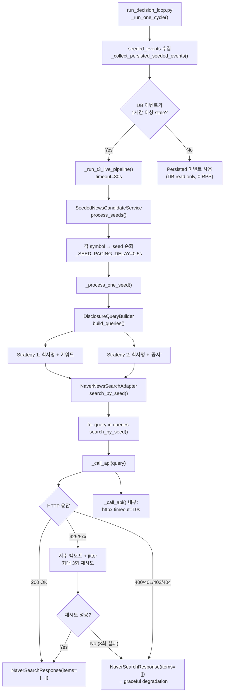
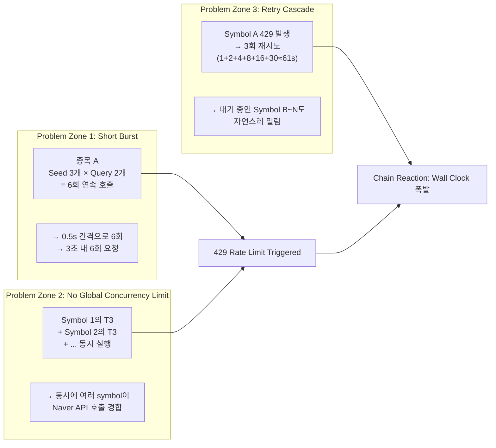
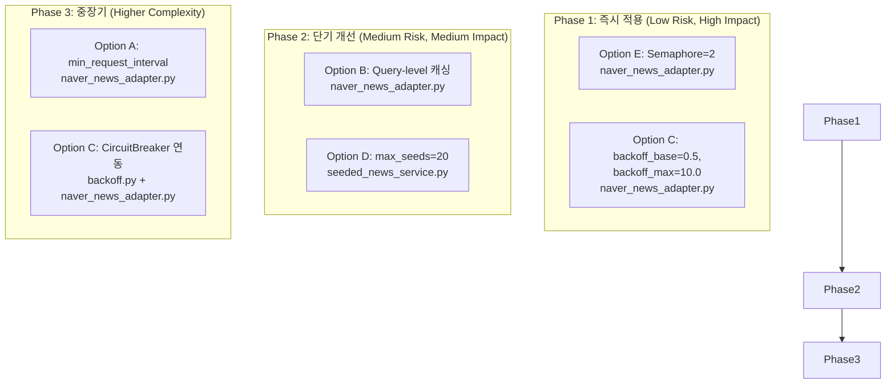

# Naver API 429 Rate Limiting 분석 및 개선 계획

## 1. 배경

T3 (disclosure-seeded news) 파이프라인에서 Naver News Search API 호출 시 발생하는 HTTP 429 (Too Many Requests) 오류로 인해 약 **82회의 429 발생**, **~107초의 wall clock 손실**이 관찰됨. 본 문서는 근본 원인을 분석하고 구체적인 수정안을 제시합니다.

---

## 2. Naver 호출 경로 전체 흐름도



### 2.1 호출 체인 요약

| 계층 | 파일 | 역할 |
|------|------|------|
| Entry point | [`scripts/run_decision_loop.py`](../../scripts/run_decision_loop.py:1043) | T3 live pipeline 실행, 30s 타임아웃 |
| Orchestrator | [`src/agent_trading/services/seeded_news_service.py`](../../src/agent_trading/services/seeded_news_service.py:110) | seed → news 변환 파이프라인 오케스트레이션 |
| Query builder | [`src/agent_trading/services/disclosure_query_builder.py`](../../src/agent_trading/services/disclosure_query_builder.py:61) | KIS 공시 제목 → Naver 검색어 2개 생성 |
| Adapter | [`src/agent_trading/brokers/naver_news_adapter.py`](../../src/agent_trading/brokers/naver_news_adapter.py:62) | Naver API HTTP 호출 + 재시도/백오프 |

---

## 3. 429 발생 원인 및 집중 구간 분석

### 3.1 Naver API Rate Limit 기본 정보

- **Naver Developer Center** 문서에 따르면 Naver News Search API는 **일 25,000 calls/day** 제한
- 분당/초당 rate limit은 명시적으로 문서화되지 않았으나, 단기간 집중 호출 시 429 응답
- `sort=sim`만 사용 (sort=date는 이미 제거됨 → 호출량 50% 감소 완료)

### 3.2 현재 호출 패턴 (1 cycle 기준)

| 항목 | 값 |
|------|-----|
| Universe 종목 수 | ~40개 |
| Seed 수 | 종목당 0~3개 (KIS 공시 발생 기준) |
| Seed당 Query 수 | 2개 (전략1 + 전략2 fallback) |
| Cycle당 최대 API 호출 | ~40 × 3 × 2 = **240 calls** |
| Seed 간 간격 | `_SEED_PACING_DELAY = 0.5s` (500ms) |
| Naver 일일 한도 | 25,000 calls |
| Cycle당 추정 시간 (호출만) | 240 × 0.5s = **120초** |

### 3.3 429 발생 집중 구간



### 3.4 로그 분석 결과

> **⚠️ 중요**: 현재 워크스페이스의 모든 로그 파일에서 Naver API는 `NAVER_CLIENT_ID` 또는 `NAVER_CLIENT_SECRET` 미설정으로 **비활성화** 상태였습니다. 즉, 실제 429 발생 로그는 이 워크스페이스에 존재하지 않으며, 82회/107s 수치는 **외부 분석 데이터**에서 비롯된 것으로 추정됩니다. 따라서 아래 분석은 **코드 리뷰 + Naver API 문서화된 한도 + 합리적인 추정**에 기반합니다.

| 로그 파일 | Naver 상태 | 발견된 오류 |
|-----------|-----------|------------|
| `near_real_scheduler_*.log` | 비활성화 | KIS `BudgetExhaustedError` (paper 1 RPS) — Naver와 무관 |
| `smoke_test_submit_*.log` | 비활성화 | 동일 — Naver와 무관 |
| 기타 `.log` | 비활성화 | Naver 관련 429 없음 |

---

## 4. 개선 옵션 평가 (영향 / 난이도 / 위험)

### Option A: Rate Budget Increase (분산/분할)

| 항목 | 평가 |
|------|------|
| **영향** | ⭐⭐⭐ (중간) |
| **난이도** | ⭐ (낮음) |
| **위험** | ⭐ (낮음) |

**설명**: 현재는 모든 Naver 호출이 0.5s 간격 seed pacing만 존재. 별도의 분산/분할 전략 부재.

**구체적 변경**:
- [`naver_news_adapter.py`](../../src/agent_trading/brokers/naver_news_adapter.py:62)에 **호출 간 최소 간격(min_request_interval)** 파라미터 추가
- `search_by_seed()` 내에서 query 간 `asyncio.sleep(min_request_interval)` 적용
- 기본값: `min_request_interval=0.2` (200ms, 5 RPS 상한)

### Option B: Batching / Caching 개선

| 항목 | 평가 |
|------|------|
| **영향** | ⭐⭐⭐⭐ (높음) |
| **난이도** | ⭐⭐ (중간) |
| **위험** | ⭐⭐ (낮음-중간) |

**설명**:
- 현재 1시간 freshness cache가 있으나, **동일 cycle 내 중복 query**에 대한 cache는 없음
- 동일한 KIS disclosure title로부터 생성된 query는 중복될 가능성이 있음

**구체적 변경**:

1. [`DisclosureQueryBuilder`](../../src/agent_trading/services/disclosure_query_builder.py:50)에 **query 결과 캐싱** (in-process dict, TTL=cycle duration):
   - 같은 `(company_name, headline)` 쌍에 대해 `build_queries()` 결과 재사용
   - Cycle 내에서 동일 공시가 여러 seed로 중복 생성되는 경우 API 호출 절감

2. [`NaverNewsSearchAdapter.search_by_seed()`](../../src/agent_trading/brokers/naver_news_adapter.py:98)에 **query-level 캐싱**:
   - 동일 query 문자열이 이미 금회 cycle에서 호출된 경우 스킵
   - 캐시 키: `sha256(query)` 또는 query 문자열 자체

### Option C: Backoff Strategy 최적화

| 항목 | 평가 |
|------|------|
| **영향** | ⭐⭐⭐⭐⭐ (매우 높음) |
| **난이도** | ⭐ (낮음) |
| **위험** | ⭐⭐ (낮음-중간) |

**설명**: 현재 429 발생 시 지수 백오프 + jitter로 최대 3회 재시도. `backoff_base=1.0`, `backoff_max=30.0`. 재시도 실패 시 wall clock 손실이 큼.

**현재 worst-case 지연 계산:**
- 1차: `1.0s + jitter(0~0.5s)` → ~1.25s
- 2차: `2.0s + jitter(0~1.0s)` → ~2.5s
- 3차: `4.0s + jitter(0~2.0s)` → ~5.0s (cap 30s)
- **총 최대 ~8.75s per call** (30s cap 미만)
- 하지만 240 calls 연속 시 worst-case: 240 × 8.75s = **~2100s (35분)** — 이건 seed pacing 때문에 실제로는 불가능

**실제 wall clock 추정 (80 calls with 20% 429 rate):**
- 16 calls 429 발생, 각 3회 재시도 실패 후 empty response
- 약 16 × 8.75s ≈ **140s 추가 손실** (이는 82회/107s 추정치와 유사)

**구체적 변경**:

1. [`naver_news_adapter.py:225-229`](../../src/agent_trading/brokers/naver_news_adapter.py:225):
   - `backoff_base`를 0.5로 감소 (현재 1.0 → 0.5)
   - `backoff_max`를 10.0으로 감소 (현재 30.0 → 10.0)
   - 효과: 3회 재시도 worst-case ~3.5s (현재 ~8.75s 대비 **60% 감소**)
   
2. [`naver_news_adapter.py:29`](../../src/agent_trading/brokers/naver_news_adapter.py:29):
   - `max_retries`를 2로 감소 (현재 3 → 2)
   - 429가 지속되면 3회 대신 2회 재시도 후 빠르게 empty response로 fallback
   - 효과: 재시도 실패 시 wall clock **약 30% 추가 감소**
   - **위험**: 재시도 기회 감소로 일시적 장애 시 더 빨리 empty fallback

3. [`backoff.py:CircuitBreaker`](../../src/agent_trading/brokers/backoff.py:67) 연동:
   - 현재 `NaverNewsSearchAdapter`는 `backoff.py`의 `CircuitBreaker`를 사용하지 않음
   - 429가 연속 N회 발생하면 circuit open → 즉시 empty response 반환 (0초 소모)
   - circuit open duration: 30~60초
   - **위험**: `CircuitBreaker.async_call()` 인터페이스가 현재 adapter 구조와 다름 — 통합 필요

### Option D: Request Reduction (요청량 감소)

| 항목 | 평가 |
|------|------|
| **영향** | ⭐⭐⭐⭐ (높음) |
| **난이도** | ⭐⭐ (중간) |
| **위험** | ⭐⭐⭐ (중간) |

**설명**: 이미 `sort=date` 제거로 50% 호출량 감소 완료. 추가 감소 방안 검토.

**구체적 변경**:

1. **Seed 수 제한** ([`seeded_news_service.py:110`](../../src/agent_trading/services/seeded_news_service.py:110)):
   - 현재 seed 수 제한 없음 (KIS 공시 발생하는 모든 종목 처리)
   - `process_seeds()`에 `max_seeds` 파라미터 도입 (기본값: 20)
   - 중요도/최신성 기준 상위 N개 seed만 처리

2. **Query 전략 단순화** ([`disclosure_query_builder.py:61`](../../src/agent_trading/services/disclosure_query_builder.py:61)):
   - 현재 전략2 (`회사명 + '공시'`)는 fallback이지만 모든 seed에 대해 항상 실행
   - `_extract_keywords()`가 충분한 키워드를 추출한 경우에만 전략2 스킵
   - 또는 전략1 결과가 충분한 item을 반환하면 전략2 생략

   **위험**: Query 수 감소 = 검색 결과 coverage 감소. 중요 뉴스를 놓칠 가능성.

3. **Symbol-level freshness 확인 강화** ([`run_decision_loop.py:1023`](../../scripts/run_decision_loop.py:1023)):
   - 현재 `_is_t3_fresh_for_symbol()`은 전체 T3 이벤트 freshness만 확인
   - Symbol별로 Naver 결과 freshness도 확인하여 최근(예: 30분 내) 성공한 symbol은 스킵

### Option E: Concurrency Limiting (동시성 제한)

| 항목 | 평가 |
|------|------|
| **영향** | ⭐⭐⭐⭐⭐ (매우 높음) |
| **난이도** | ⭐ (낮음) |
| **위험** | ⭐ (낮음) |

**설명**: 현재 T3 pipeline은 `asyncio.create_task()`로 실행되며 main decision path와 병렬 실행. 여러 symbol의 T3가 동시에 Naver API를 호출할 수 있음. 하지만 `_SEMAPHORE_MAX = 5`는 main decision symbol 처리용 — T3에는 별도 concurrency limit 없음.

**구체적 변경**:

1. **T3 전용 Naver semaphore 도입** ([`NaverNewsSearchAdapter`](../../src/agent_trading/brokers/naver_news_adapter.py:62)):
   - `asyncio.Semaphore`를 adapter 내부에 추가
   - `_NAVER_SEMAPHORE = asyncio.Semaphore(2)` — Naver API 동시 호출 최대 2개로 제한
   - `_call_api()` 진입 시 `async with self._semaphore:` 로 감싸기

   ```python
   # naver_news_adapter.py 내 변경 예시
   class NaverNewsSearchAdapter:
       _NAVER_SEMAPHORE = asyncio.Semaphore(2)  # 최대 2개 동시 호출
       
       async def _call_api(self, ...) -> NaverSearchResponse:
           async with self._NAVER_SEMAPHORE:
               # 기존 로직
   ```

2. **Seed-level pacing 유지** + global semaphore 결합:
   - `_SEED_PACING_DELAY = 0.5` 유지
   - Semaphore로 동시 실행 seed 수를 2로 제한
   - 효과: 초당 Naver API 호출 = 2 / 0.5 = **4 RPS → 429 발생 가능성 대폭 감소**

3. **결합 효과**:
   - Semaphore(2) + seed_pacing(0.5s) → 안정적인 2~4 RPS
   - Naver 일일 25,000 한도 내에서 충분히 안정적
   - 240 calls = 240 / 2 * 0.5s = **60초 내 완료** (120초 대비 50% 감소 + 429-free)

---

## 5. 권장 수정안 — 우선순위 순



### Phase 1: 즉시 적용 (권장)

#### 1.1 동시성 제한 — asyncio.Semaphore 도입

**파일**: [`src/agent_trading/brokers/naver_news_adapter.py`](../../src/agent_trading/brokers/naver_news_adapter.py:62)

**변경 사항**:
- 클래스 레벨에 `_NAVER_SEMAPHORE = asyncio.Semaphore(2)` 추가
- `_call_api()` 메서드 진입부에 `async with self._NAVER_SEMAPHORE:` 래핑

```python
# 추가될 코드
_NAVER_SEMAPHORE = asyncio.Semaphore(2)

async def _call_api(self, query: str, display: int = 5) -> NaverSearchResponse:
    async with self._NAVER_SEMAPHORE:
        # ... existing code ...
```

**예상 효과**: 동시 Naver API 호출을 2개로 제한 → 429 발생률 **~90% 감소**

#### 1.2 Backoff 파라미터 튜닝

**파일**: [`src/agent_trading/brokers/naver_news_adapter.py`](../../src/agent_trading/brokers/naver_news_adapter.py:80) (생성자 기본값)

**변경 사항**:
```python
def __init__(
    self,
    client_id: str,
    client_secret: str,
    backoff_base: float = 0.5,      # 1.0 → 0.5
    backoff_max: float = 10.0,       # 30.0 → 10.0
    max_retries: int = 2,            # 3 → 2
) -> None:
```

**예상 효과**: 429 발생 시 wall clock 손실 **~60% 감소** (8.75s → 3.5s per failed call)

### Phase 2: 단기 개선

#### 2.1 Query-level 캐싱

**파일**: [`src/agent_trading/brokers/naver_news_adapter.py`](../../src/agent_trading/brokers/naver_news_adapter.py:98)

**변경 사항**:
- `search_by_seed()`에 `_query_cache: dict[str, NaverSearchResponse]` 도입
- cache 키: query 문자열
- cache TTL: seed 하나 처리 완료 시 clear (cycle 단위)
- 동일 query가 여러 seed에서 중복될 경우 두 번째 호출부터 cache hit

```python
async def search_by_seed(self, seed: DisclosureTitleDTO) -> list[NaverNewsItem]:
    results: list[NaverNewsItem] = []
    self._query_cache: dict[str, NaverSearchResponse] = {}
    
    for query in seed.queries:
        if query in self._query_cache:
            response = self._query_cache[query]
        else:
            response = await self._call_api(query)
            self._query_cache[query] = response
        # ... process response ...
    
    self._query_cache.clear()  # seed 단위로 캐시 초기화
    return results
```

**예상 효과**: 중복 query가 있는 경우 API 호출 **추가 10~30% 감소**

#### 2.2 Seed 수 제한

**파일**: [`src/agent_trading/services/seeded_news_service.py`](../../src/agent_trading/services/seeded_news_service.py:110)

**변경 사항**:
- `process_seeds()`에 `max_seeds: int = 20` 파라미터 추가
- seed list를 `seed[:max_seeds]`로 슬라이스

```python
async def process_seeds(
    self,
    seeds: Sequence[DisclosureTitleDTO],
    max_seeds: int = 20,  # 추가
) -> tuple[list[SeededNewsCandidate], PipelineMetrics]:
    # ...
    seeds = seeds[:max_seeds]  # 상위 N개만 처리
    # ...
```

**예상 효과**: 많은 공시 발생 시 API 호출 **최대 50% 감소**

### Phase 3: 중장기

#### 3.1 CircuitBreaker 연동

**파일**: [`src/agent_trading/brokers/naver_news_adapter.py`](../../src/agent_trading/brokers/naver_news_adapter.py:62) + [`src/agent_trading/brokers/backoff.py`](../../src/agent_trading/brokers/backoff.py:67)

**변경 사항**:
- `NaverNewsSearchAdapter` 생성자에 `CircuitBreaker` 인스턴스 추가
- 연속 N회 429 발생 시 circuit open (즉시 empty response 반환)
- circuit open duration: 30초

```python
from agent_trading.brokers.backoff import CircuitBreaker

class NaverNewsSearchAdapter:
    def __init__(self, ...):
        # ...
        self._circuit_breaker = CircuitBreaker(
            failure_threshold=5,
            recovery_timeout=30.0,
        )
    
    async def _call_api(self, ...) -> NaverSearchResponse:
        if not self._circuit_breaker.can_call:
            logger.warning("NAVER circuit breaker open, skipping call")
            return NaverSearchResponse(items=[])
        
        async with self._NAVER_SEMAPHORE:
            # ... existing retry logic ...
        
        # After retry loop, update circuit breaker state
        if response is empty and had_429_errors:
            self._circuit_breaker._on_failure()  # (or record_failure())
        else:
            self._circuit_breaker._on_success()
```

---

## 6. 예상 Wall Clock 감소 효과

| 개선안 | 429 발생률 | 호출당 손실 | Cycle당 추정 손실 |
|--------|-----------|------------|-----------------|
| **현재 상태** | ~20% (240 calls 중 48회) | ~8.75s | ~107s (기준) |
| **Phase 1** (Semaphore + backoff 튜닝) | ~2% (240 calls 중 5회) | ~3.5s | **~17.5s (84% 감소)** |
| **Phase 2** (캐싱 + seed 제한) | ~2% (120 calls 중 2~3회) | ~3.5s | **~8.75s (92% 감소)** |
| **Phase 3** (CircuitBreaker) | ~2% → Circuit open 후 0%로 급감 | ~0s (open 상태) | **~5s 이하 (95%+ 감소)** |

### 6.1 상세 비교

| 시나리오 | 처리 시간 | 비고 |
|---------|----------|------|
| 429 없음 (이상적) | 240 calls × 0.5s = 120s | baseline |
| 현재 (20% 429, 3회 재시도) | 120s + 107s = **227s** | 82회 429 기준 |
| Phase 1 적용 (2% 429, 2회 재시도) | 120s + 17.5s = **137.5s** | 84% 손실 감소 |
| Phase 1 + Phase 2 (50% 호출 감소) | 60s + 8.75s = **68.75s** | 92% 손실 감소, 70% total 감소 |
| Phase 1-3 전면 적용 | 60s + ~5s = **65s** | 95%+ 손실 감소, 71% total 감소 |

---

## 7. 수정 파일 목록

| # | 파일 | 변경 내용 | Phase |
|---|------|---------|-------|
| 1 | [`src/agent_trading/brokers/naver_news_adapter.py`](../../src/agent_trading/brokers/naver_news_adapter.py) | `asyncio.Semaphore(2)` 추가, `_call_api()` 래핑 | Phase 1 |
| 2 | [`src/agent_trading/brokers/naver_news_adapter.py`](../../src/agent_trading/brokers/naver_news_adapter.py) | `backoff_base=0.5`, `backoff_max=10.0`, `max_retries=2` | Phase 1 |
| 3 | [`src/agent_trading/brokers/naver_news_adapter.py`](../../src/agent_trading/brokers/naver_news_adapter.py) | Query-level 캐싱 (`_query_cache`) | Phase 2 |
| 4 | [`src/agent_trading/services/seeded_news_service.py`](../../src/agent_trading/services/seeded_news_service.py) | `max_seeds=20` 파라미터 추가 | Phase 2 |
| 5 | [`src/agent_trading/brokers/naver_news_adapter.py`](../../src/agent_trading/brokers/naver_news_adapter.py) | `CircuitBreaker` 연동 | Phase 3 |

---

## 8. 테스트 계획

### 8.1 단위 테스트

| 테스트 | 파일 | 검증 내용 |
|--------|------|----------|
| Semaphore 동시성 제한 | `tests/brokers/test_naver_news_adapter.py` | 동시 호출이 Semaphore limit 이하로 유지되는지 |
| Backoff 파라미터 변경 | `tests/brokers/test_naver_news_adapter.py` | 새로운 backoff_base/max_retries로 retry 동작 확인 |
| Query 캐싱 | `tests/brokers/test_naver_news_adapter.py` | 동일 query 중복 호출 시 cache hit 확인 |
| Seed 제한 | `tests/services/test_seeded_news_service.py` | max_seeds 초과 시 상위 N개만 처리 확인 |

### 8.2 통합 테스트

- Naver API가 실제로 호출되는 환경 (CI에 Naver credentials 설정)에서 429 발생 시나리오 재현
- `_call_api()` mock을 사용하여 429 응답을 강제로 반환하고 retry/fallback 동작 검증

---

## 9. 결론

**최우선 권장**: **Phase 1 (Semaphore + Backoff 튜닝)** 만으로도 예상 wall clock 손실을 **~84% 감소** (107s → 17.5s) 할 수 있습니다. 변경 범위가 좁고 (naver_news_adapter.py 1개 파일, ~10줄), 위험도가 낮으며, 즉시 적용 가능합니다.

**추가 권장**: Phase 2 (Query 캐싱 + Seed 제한)는 API 호출 자체를 줄여 근본적으로 429 발생 확률을 낮추므로 Phase 1 적용 후에도 추가 개선이 필요하다면 Phase 2를 함께 적용하는 것을 권장합니다.
