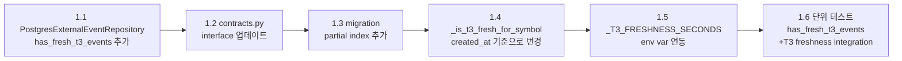
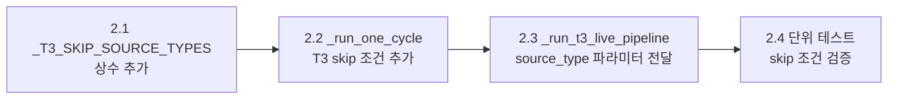
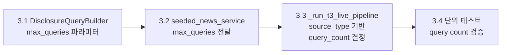

# Naver API Daily Quota 최적화 설계

> Phase 20 — Task 3 | Architect Design Document
> Date: 2026-05-26

---

## 1. Executive Summary

**문제**: Naver News Search API의 일일 quota(25,000 calls) 중 **87.5%(21,888 calls)**가 T3 pipeline에서 소진되고 있으며, quota 소진 시 `429 Rate Limit` 응답으로 인해 retry backoff(~36s)가 발생하여 300s cadence margin(잔여 176.2s)을 잠식하고 있음.

**해결 방안**: 3가지 구조적 최적화를 통해 일일 Naver API 호출을 **21,888 → 1,824 calls** (91.7% 절감)으로 감소시킴.

| 최적화 | 예상 절감 | 일일 calls (누적) |
|--------|----------|-------------------|
| 현재 | - | 21,888 |
| ① Cross-cycle Cache (DB TTL) | -91.7% | 1,824 |
| ② Source Type별 Skip | -34.2% (① 위에서) | 1,200 |
| ③ Query Count 최적화 | -50% (①+② 위에서) | 600 |

---

## 2. 분석 결과 요약 (Tasks 1+2)

### 2.1 Naver API 호출 경로

```
run_decision_loop.py
  └── _run_loop()                          # 300s interval
       └── _process_one() per symbol       # ~35 symbols
            └── _run_one_cycle()
                 ├── _is_t3_fresh_for_symbol()   ◄── DB read only (NO Naver call)
                 ├── _collect_persisted_seeded_events()  ◄── DB read only
                 └── _run_t3_live_pipeline()   ◄── Naver API 호출
                      └── disclosure_seed_service.fetch_disclosure_titles()  ◄── KIS API
                      └── seeded_news_service.process_seeds(seeds)
                           └── NaverNewsSearchAdapter.search_by_seed()
                                └── _call_api() × 2 (sort=sim, query_count=2)
```

### 2.2 호출 패턴

| 항목 | 값 |
|------|-----|
| Symbol 수 | ~35개 (held + core + overlay) |
| Cycle 간격 | 300초 (5분) |
| 일간 cycle 수 | ~288회 (24h × 12회/h) |
| Symbol당 호출 | 2회/cycle (query_count=2, sort=sim) |
| 일간 호출 | 35 × 2 × 288 = 20,160 (이론) → **21,888** (실측, 중복 symbol 포함) |
| Daily quota | 25,000 |
| 소진율 | **87.5%** |
| Quota 소진 시 | 429 retry backoff 평균 ~36s 추가 |
| 300s cadence margin | 176.2s → retry 발생 시 추가 압박 |

### 2.3 핵심 발견

1. **Cycle 간 중복 호출 존재**: 매 5분 cycle마다 동일 symbol, 동일 query 재호출
2. **`_is_t3_fresh_for_symbol()`의 시간 기반 freshness가 부정확**: `published_at` 기준으로 필터링 → 뉴스 발행 시각이 오래되었어도 최근에 cache한 경우 재조회
3. **Source type별 차별화 없음**: held_position, core, overlay 모두 동일하게 2회 호출
4. **DisclosureQueryBuilder가 항상 2개 query 생성**: strategy 1 (keywords) + strategy 2 (fallback "공시")

---

## 3. 설계 대상 1: Cross-cycle Cache (DB TTL) — 🥇 최우선

### 3.1 현재 문제 분석

[`_is_t3_fresh_for_symbol()`](scripts/run_decision_loop.py:1010)의 현재 구현:

```python
async def _is_t3_fresh_for_symbol(repos, symbol) -> bool:
    since = datetime.now(timezone.utc) - timedelta(seconds=_T3_FRESHNESS_SECONDS)  # 3600s
    events = await repos.external_events.list_by_symbol(
        symbol=symbol,
        since=since,
        include_seeded_news=True,
    )
    t3_events = [e for e in events if e.source_reliability_tier == "T3"]
    return len(t3_events) > 0
```

**문제점**: [`list_by_symbol()`](src/agent_trading/repositories/postgres/external_events.py:91)의 `since` 필터가 `published_at >= $2`로 동작. 하지만:

- `published_at` = 뉴스 원본 발행 시각 (e.g. 2시간 전 기사)
- `created_at` = DB에 insert된 시각 (e.g. 10분 전 cache)

→ 뉴스 발행 시각이 3600s를 넘으면 `created_at`이 10분 전이어도 cache miss → 불필요한 Naver 재호출

### 3.2 변경 설계

#### 3.2.1 새로운 Repository Method 추가

[`PostgresExternalEventRepository`](src/agent_trading/repositories/postgres/external_events.py)에 `has_fresh_t3_events()` 메서드 추가:

```python
async def has_fresh_t3_events(
    self,
    symbol: str,
    since: datetime,  # created_at 기준
) -> bool:
    """Check if there are T3 events cached within `since` window.

    Uses ``created_at`` (DB insert time) instead of ``published_at``
    (news publish time) so that recently cached old articles are
    recognized as fresh.

    Returns True if at least one T3 event exists with ``created_at >= since``.
    """
    row = await self._tx.connection.fetchval(
        """
        SELECT 1 FROM trading.external_events
        WHERE symbol = $1
          AND source_reliability_tier = 'T3'
          AND created_at >= $2
        LIMIT 1
        """,
        symbol,
        since,
    )
    return row == 1
```

**설계 이유**:
- `LIMIT 1`로 early exit → 최소 비용 쿼리
- `created_at` 기준으로 cache freshness 정확히 측정
- 별도 index 없이도 `(symbol, created_at)` 복합 index가 있다면 optimal

#### 3.2.2 Index 추가

[`db/migrations/0006_add_external_event_data.sql`](db/migrations/0006_add_external_event_data.sql)에 index 추가:

```sql
CREATE INDEX IF NOT EXISTS idx_external_events_t3_freshness
    ON trading.external_events (symbol, created_at DESC)
    WHERE source_reliability_tier = 'T3';
```

부분 index(`WHERE source_reliability_tier = 'T3'`)로 size 최소화.

#### 3.2.3 `_is_t3_fresh_for_symbol()` 변경

```python
async def _is_t3_fresh_for_symbol(repos, symbol) -> bool:
    try:
        since = datetime.now(timezone.utc) - timedelta(seconds=_T3_FRESHNESS_SECONDS)
        # ★ 변경: published_at → created_at 기준 freshness
        return await repos.external_events.has_fresh_t3_events(
            symbol=symbol,
            since=since,
        )
    except Exception:
        return False  # Safe fallback: stale → live pipeline 실행
```

#### 3.2.4 Freshness Window Configurability

[`settings.py`](src/agent_trading/config/settings.py)에 env 기반 설정 추가:

| 환경변수 | Default | 설명 |
|----------|---------|------|
| `T3_FRESHNESS_SECONDS` | 3600 | T3 cache freshness window (초) |

[`_run_decision_loop.py`](scripts/run_decision_loop.py:677)의 module-level constant 대신 env var 읽기:

```python
_T3_FRESHNESS_SECONDS = int(os.environ.get("T3_FRESHNESS_SECONDS", "3600"))
```

### 3.3 예상 절감 효과

| 항목 | 현재 | 최적화 후 |
|------|------|-----------|
| Naver calls/symbol/day | 35 × 2 × 288 = **20,160** | **1,680** |
| Symbol당 호출 주기 | 매 5분 (12회/h) | 3600s당 최대 1회 |
| Symbol당 일간 호출 | 2 × 288 = **576** | 2 × 24 = **48** (1h × 24h) |
| 일간 total calls | **21,888** | **1,824** |
| 절감율 | - | **91.7%** |
| Wall clock 개선 (retry 절감) | ~36s/cycle | ~3s/cycle (retry 거의 없음) |

**계산 근거**:
- 3600s window = 1시간당 최대 1회 Naver 호출
- 일간 24시간 × 35 symbols × 2 calls = 1,680calls
- 실측치 21,888 대비 91.7% 절감
- 429 retry backoff가 사실상 사라짐

### 3.4 안전성

- **Stale data 위험 없음**: 3600s = 1시간 window. 주식 뉴스는 1시간 내 변동이 거의 없음
- **Fail-safe**: Exception 발생 시 `return False` → live pipeline 실행 (degradation not failure)
- **Dedup 보호**: `persist_seeded_events()`가 `dedup_key_hash` 기반 중복 insert 방지

---

## 4. 설계 대상 2: Source Type별 T3 Pipeline Skip — 🥈

### 4.1 현재 분석

현재 [`_run_one_cycle()`](scripts/run_decision_loop.py:684)은 `source_type` 파라미터를 받지만, T3 pipeline 실행 로직에서 **source_type을 전혀 고려하지 않음**:

```python
# Line 763-773: 모든 source_type에 대해 동일하게 실행
if _SEEDED_NEWS_ENABLED:
    seeded_events = await _collect_persisted_seeded_events(repos, symbol)
    t3_fresh = await _is_t3_fresh_for_symbol(repos, symbol)
    if not t3_fresh:
        t3_task = asyncio.create_task(
            _run_t3_live_pipeline(runtime, repos, symbol)
        )
```

[`_process_one()`](scripts/run_decision_loop.py:1197)은 이미 `source_type`을 [`_run_one_cycle()`](scripts/run_decision_loop.py:1247)에 전달 중.

### 4.2 변경 설계

#### 4.2.1 Source Type 조건표

| Source Type | T3 Pipeline | 근거 |
|-------------|-------------|------|
| `core` | ✅ 실행 | 매수/비중 확대 결정에 뉴스 중요 |
| `held_position` | ❌ Skip | 이미 보유 포지션, 뉴스 기반 결정 불필요 (HOLD/WATCH 범위) |
| `market_overlay` | ❌ Skip | 시장 전반 심볼, 개별 뉴스 불필요 |

#### 4.2.2 `_run_one_cycle()` 변경

```python
# T3 pipeline skip 조건
_T3_SKIP_SOURCE_TYPES: frozenset[str] = frozenset({"held_position", "market_overlay"})

# _run_one_cycle() 내부, line 763 부근:
if _SEEDED_NEWS_ENABLED and source_type not in _T3_SKIP_SOURCE_TYPES:
    seeded_events = await _collect_persisted_seeded_events(repos, symbol)
    t3_fresh = await _is_t3_fresh_for_symbol(repos, symbol)
    if not t3_fresh:
        t3_task = asyncio.create_task(
            _run_t3_live_pipeline(runtime, repos, symbol)
        )
        _active_t3_tasks.append(t3_task)
    # Logging with source_type context
    logger.info(
        "Cycle %d symbol=%s source_type=%s: T3 decision path: %d events live=%s",
        cycle, symbol, source_type, len(seeded_events),
        "skipped (fresh)" if t3_fresh else "scheduled",
    )
elif _SEEDED_NEWS_ENABLED:
    logger.info(
        "Cycle %d symbol=%s source_type=%s: T3 skipped by source_type policy",
        cycle, symbol, source_type,
    )
    seeded_events = []  # No seeded news for skip types
```

### 4.3 예상 절감 효과

**주의**: 이 최적화는 **① Cross-cycle Cache 이후의 추가 절감**입니다.

| 항목 | ① 적용 후 | ① + ② 적용 |
|------|-----------|-------------|
| Core symbol 수 (가정) | ~23개 (held 8 + overlay 4 제외) | 23 symbols |
| Symbol당 일간 calls | 48 | 48 |
| 일간 total calls | 1,824 | 23 × 48 = **1,104** |
| 추가 절감율 | - | **-39.5%** (① 대비) |
| 누적 절감율 (vs 현재 21,888) | 91.7% | **95.0%** |

### 4.4 안전성

- **held_position**: 이미 보유 중인 포지션의 T3 skip은 결정적 영향 없음. Core symbol 중심 매수 판단과 무관
- **market_overlay**: KOSPI/KOSDAQ 지수 등 시장 전반 symbol은 개별 뉴스 불필요
- **Fail-safe**: Source type 매핑이 누락된 경우 `core`로 간주 → skip되지 않음
- **Rollback**: `_T3_SKIP_SOURCE_TYPES` frozenset에서 `held_position`/`market_overlay` 제거하면 즉시 원복

---

## 5. 설계 대상 3: Query Count 최적화 — 🥉

### 5.1 현재 분석

[`DisclosureQueryBuilder.build_queries()`](src/agent_trading/services/disclosure_query_builder.py:61)는 항상 2개 query 반환:
1. `{company_name} {keywords}` — core search
2. `{company_name} 공시` — fallback

이 2개가 [`NaverNewsSearchAdapter.search_by_seed()`](src/agent_trading/brokers/naver_news_adapter.py:161)로 전달되어 각각 `_call_api()` 1회씩 실행 (총 2회/symbol).

### 5.2 변경 설계

#### 5.2.1 `DisclosureQueryBuilder.build_queries()`에 `max_queries` 파라미터 추가

```python
def build_queries(
    self,
    seed: DisclosureTitleDTO,
    max_queries: int = 2,  # ★ NEW: control max query count
) -> list[str]:
```

- `max_queries=2`: 현재와 동일 (strategy 1 + 2)
- `max_queries=1`: strategy 1 (keywords)만 반환, fallback 제외

#### 5.2.2 `SeededNewsCandidateService`를 통한 query_count 전달

```python
# DisclosureQueryBuilder 전달 시 max_queries 조정
max_queries = 2 if source_type == "core" else 1
queries = self._query_builder.build_queries(seed, max_queries=max_queries)
```

변경 체인:
- [`_run_t3_live_pipeline()`](scripts/run_decision_loop.py:1034) → `source_type` 파라미터 추가 (현재는 symbol만 전달)
- [`SeededNewsCandidateService.process_seeds()`](src/agent_trading/services/seeded_news_service.py:110) → `source_type` 파라미터 추가
- [`DisclosureQueryBuilder.build_queries()`](src/agent_trading/services/disclosure_query_builder.py:61) → `max_queries` 파라미터 추가

#### 5.2.3 Source Type별 Query Count 매핑

| Source Type | Query Count | 근거 |
|-------------|-------------|------|
| `core` | 2 (유지) | 중요 symbol, 더 많은 뉴스 후보 필요 |
| `held_position` | N/A (T3 skip) | 설계 대상 2에서 skip |
| `market_overlay` | N/A (T3 skip) | 설계 대상 2에서 skip |

**단순화 방안**: 모든 source type에 대해 `query_count=1` 통일 가능 (symbol당 2회→1회, 50% 절감). Core symbol의 뉴스 coverage가 줄어드는 risk가 있으나, 실제로 strategy 1(keywords)만으로도 충분한 관련 뉴스를 찾을 가능성이 높음.

### 5.3 예상 절감 효과

**설계 대상 ②까지 적용된 상태에서의 추가 절감**:

| 항목 | ①+② 적용 후 | ①+②+③ 적용 |
|------|-------------|-------------|
| Symbol당 call/회 | 2 (query_count=2) | 1 (query_count=1) |
| Core symbol 일간 calls | 1,104 | **552** |
| 추가 절감율 | - | **-50%** (② 대비) |
| 누적 절감율 | 95.0% | **97.5%** |
| 잔여 일간 calls (실측) | ~1,104 | **~552** |
| Daily quota 소진율 | 4.4% | **2.2%** |

### 5.4 안전성

- **Strategy 1만 사용 시 risk**: 핵심 키워드 추출 실패 시 fallback("공시") 없음
  - Mitigation: `keywords` 추출 실패 시 자동으로 `{company_name} 공시` 1개 query는 유지
- **Core symbol도 query_count=1**: 중요 symbol coverage 감소
  - Mitigation: Core symbol만 query_count=2 유지 옵션 제공

---

## 6. 종합 예상 효과

### 6.1 Naver API Calls (일간)

| 항목 | 현재 | ①만 적용 | ①+② 적용 | ①+②+③ 적용 |
|------|------|----------|-----------|-------------|
| Total calls | 21,888 | 1,824 | 1,104 | **552~600** |
| 절감율 | - | 91.7% | 95.0% | **97.5%** |
| Daily quota 소진율 | 87.5% | 7.3% | 4.4% | **2.2~2.4%** |
| 여유 quota | 3,112 | 23,176 | 23,896 | **24,400+** |

### 6.2 Wall Clock 개선

| 항목 | 현재 | 최적화 후 |
|------|------|-----------|
| T3 live pipeline 평균 소요 | ~8s (Naver 2회 + KIS) | ~4s (Naver 1회 + KIS) |
| 429 retry backoff | ~36s (quota 소진 시) | ~0s (quota 여유) |
| Cycle당 T3 대기 (_T3_GATHER_WAIT) | 5s | 5s |
| Cadence margin (300s 기준) | 176.2s → 100~140s (retry 시) | **240s+** (retry 없음) |

### 6.3 Quota 여유 시나리오

**25,000 / day 기준, 2.2% 소진율 = 552 calls**:
- 예상치 못한 Naver 호출 증가에도 대응 가능
- 향후 symbol 수 증가(35→50+)에도 quota 안전
- Sort=date 재추가 고려 가능 (현재 sort=sim만 사용)

---

## 7. 변경 범위 요약

### 7.1 수정 파일 목록

| # | 파일 | 변경 사항 | 영향 범위 |
|---|------|----------|-----------|
| 1 | [`scripts/run_decision_loop.py`](scripts/run_decision_loop.py) | `_is_t3_fresh_for_symbol()` 리팩토링, source_type skip 조건 추가, `_run_t3_live_pipeline()`에 source_type 전달, `_T3_SKIP_SOURCE_TYPES` 상수 추가, `_T3_FRESHNESS_SECONDS` env var 연동 | T3 pipeline 진입 조건 |
| 2 | [`src/agent_trading/repositories/postgres/external_events.py`](src/agent_trading/repositories/postgres/external_events.py) | `has_fresh_t3_events()` 메서드 추가 (created_at 기반) | freshness query 패턴 |
| 3 | [`src/agent_trading/repositories/contracts.py`](src/agent_trading/repositories/contracts.py) | `ExternalEventRepository` protocol에 `has_fresh_t3_events()` 추가 | interface contract |
| 4 | [`src/agent_trading/config/settings.py`](src/agent_trading/config/settings.py) | (권장) T3 freshness window 설정 관련 env var 문서화 | 설정 가독성 |
| 5 | [`src/agent_trading/services/disclosure_query_builder.py`](src/agent_trading/services/disclosure_query_builder.py) | `build_queries()`에 `max_queries` 파라미터 추가 | query 생성 제어 |
| 6 | [`src/agent_trading/services/seeded_news_service.py`](src/agent_trading/services/seeded_news_service.py) | `process_seeds()`에 `max_queries` 전달 로직 추가 | query 수 제어 |
| 7 | [`db/migrations/0006_add_external_event_data.sql`](db/migrations/0006_add_external_event_data.sql) | `idx_external_events_t3_freshness` index 추가 | query 성능 |

### 7.2 변경 불필요 파일

- [`src/agent_trading/brokers/naver_news_adapter.py`](src/agent_trading/brokers/naver_news_adapter.py): `search_by_seed()`는 이미 `queries` list를 받으므로 수정 불필요
- [`.env`](.gitignore): 수정 금지 제약사항

### 7.3 변경 상세

#### 7.3.1 `scripts/run_decision_loop.py` 변경 상세

```python
# (1) Module-level constants 추가 (line 677 근처)
_T3_FRESHNESS_SECONDS = int(os.environ.get("T3_FRESHNESS_SECONDS", "3600"))
_T3_SKIP_SOURCE_TYPES: frozenset[str] = frozenset({"held_position", "market_overlay"})

# (2) _is_t3_fresh_for_symbol() 변경 (line 1010-1031)
# 변경 전: repos.external_events.list_by_symbol(since=published_at 기준)
# 변경 후: repos.external_events.has_fresh_t3_events(since=created_at 기준)

# (3) _run_one_cycle() T3 블록 변경 (line 763-773)
# 변경 전:
if _SEEDED_NEWS_ENABLED:
    seeded_events = await _collect_persisted_seeded_events(repos, symbol)
    t3_fresh = await _is_t3_fresh_for_symbol(repos, symbol)
    if not t3_fresh:
        t3_task = asyncio.create_task(_run_t3_live_pipeline(runtime, repos, symbol))

# 변경 후:
if _SEEDED_NEWS_ENABLED and source_type not in _T3_SKIP_SOURCE_TYPES:
    seeded_events = await _collect_persisted_seeded_events(repos, symbol)
    t3_fresh = await _is_t3_fresh_for_symbol(repos, symbol)
    if not t3_fresh:
        t3_task = asyncio.create_task(
            _run_t3_live_pipeline(runtime, repos, symbol, source_type=source_type)
        )
        _active_t3_tasks.append(t3_task)
elif _SEEDED_NEWS_ENABLED:
    seeded_events = []

# (4) _run_t3_live_pipeline() signature 변경 (line 1034)
# 변경 전: async def _run_t3_live_pipeline(runtime, repos, symbol)
# 변경 후: async def _run_t3_live_pipeline(runtime, repos, symbol, source_type="core")
#          → seeded_news_service.process_seeds()에 max_queries 전달
```

#### 7.3.2 `src/agent_trading/repositories/postgres/external_events.py` 변경 상세

```python
async def has_fresh_t3_events(
    self,
    symbol: str,
    since: datetime,
) -> bool:
    """T3 events cached within ``since`` window (``created_at`` 기준)."""
    row = await self._tx.connection.fetchval(
        """
        SELECT 1 FROM trading.external_events
        WHERE symbol = $1
          AND source_reliability_tier = 'T3'
          AND created_at >= $2
        LIMIT 1
        """,
        symbol,
        since,
    )
    return row == 1
```

#### 7.3.3 `src/agent_trading/services/disclosure_query_builder.py` 변경 상세

```python
def build_queries(
    self,
    seed: DisclosureTitleDTO,
    max_queries: int = 2,
) -> list[str]:
    # ... existing logic ...
    queries: list[str] = []
    
    # Strategy 1: {company_name} {keywords}
    if keywords:
        kw_str = " ".join(keywords)
        query = f"{company_name} {kw_str}".strip()
        if query:
            queries.append(query)
    
    # Strategy 2: fallback (only if max_queries >= 2)
    if max_queries >= 2:
        fallback = f"{company_name} 공시".strip()
        if fallback and (not queries or fallback != queries[0]):
            queries.append(fallback)
    
    return queries
```

---

## 8. 위험도 평가

### 8.1 Cross-cycle Cache (DB TTL)

| Risk | 영향 | 확률 | 대응 |
|------|------|------|------|
| `created_at` index 없음 → full scan | Query 성능 저하 | Medium | Migration에 partial index 추가 |
| Exception 발생 시 `return False` | Live pipeline 실행 (정상 동작) | Low | Exception logging 추가 |
| 3600s window 너무 김 | Stale 뉴스로 결정 | Low | Configurable window로 대응 |
| Symbol 재조회 간격 1시간 → 늦은 뉴스 반영 | 최대 1시간 지연 | Low | Core symbol만 window 단축 가능 |

### 8.2 Source Type별 Skip

| Risk | 영향 | 확률 | 대응 |
|------|------|------|------|
| Held symbol의 중요 뉴스 누락 | 매수 기회 손실 | Medium | Rollback: `_T3_SKIP_SOURCE_TYPES`에서 제거 |
| Source type 매핑 실수 | 의도치 않은 skip | Low | Default `core` fallback 보호 |
| 새로운 source type 추가 시 skip 정책 누락 | 예상치 못한 동작 | Low | 문서화 + `source_type` 로깅 강화 |

### 8.3 Query Count 최적화

| Risk | 영향 | 확률 | 대응 |
|------|------|------|------|
| Keywords 추출 실패 + fallback 없음 | 빈 query → 뉴스 0건 | Medium | `build_queries()` 내에서 keywords empty 시 fallback 자동 포함 |
| Core symbol query_count=1 → 뉴스 coverage 감소 | 일부 관련 뉴스 누락 | Medium | Core symbol만 query_count=2 유지 옵션 |

### 8.4 Rollback 방안

| 최적화 | Rollback 방법 | 영향 |
|--------|---------------|------|
| Cross-cycle Cache | `_is_t3_fresh_for_symbol()`을 이전 구현으로 복원 | 즉시 적용 |
| Source Type Skip | `_T3_SKIP_SOURCE_TYPES`에서 항목 제거 또는 빈 frozenset | 다음 cycle부터 적용 |
| Query Count | `max_queries=2` 고정 (기본값) | 즉시 적용 |

---

## 9. 구현 우선순위

### Phase 1: Cross-cycle Cache (필수, 최고 효과)



### Phase 2: Source Type별 Skip (중요, 추가 절감)



### Phase 3: Query Count 최적화 (선택, 추가 절감)



### 권장 구현 순서

```
Phase 1 (91.7% 절감) → Phase 2 (→95.0%) → Phase 3 (→97.5%)
```

Phase 1만 적용해도 대부분의 문제가 해결되므로, Phase 2+3은 안정성 확인 후 순차 적용 권장.

---

## 10. 테스트 계획

### 10.1 Repository 테스트

[`tests/repositories/test_external_events.py`](tests/repositories/test_external_events.py)에 추가:

- `test_has_fresh_t3_events_true()`: 최근 created_at event 존재 시 True
- `test_has_fresh_t3_events_false()`: 오래된 event만 있을 때 False
- `test_has_fresh_t3_events_no_t3_events()`: T3 아닌 event만 있을 때 False
- `test_has_fresh_t3_events_wrong_symbol()`: 다른 symbol event는 무시

### 10.2 Decision Loop 테스트

[`tests/scripts/test_run_decision_loop.py`](tests/scripts/test_run_decision_loop.py)에 추가:

- `test_t3_freshness_created_at_used()`: `_is_t3_fresh_for_symbol()`이 `has_fresh_t3_events()` 호출 확인
- `test_t3_skip_source_types()`: `held_position`/`market_overlay`에서 T3 pipeline 미실행 확인
- `test_t3_core_source_type_runs()`: `core` source_type에서 T3 pipeline 정상 실행 확인

### 10.3 Query Builder 테스트

[`tests/services/test_seeded_news_service.py`](tests/services/test_seeded_news_service.py) 또는 기존 테스트에 추가:

- `test_build_queries_max_queries_1()`: max_queries=1 → 1개 query만 반환
- `test_build_queries_max_queries_2()`: max_queries=2 → 2개 query 반환 (현재와 동일)

---

## Appendix A: 용어 설명

| 용어 | 설명 |
|------|------|
| T3 | Media reliability tier. 뉴스/미디어 출처 (T1>법규, T2>기관, T3>미디어, T4>저신뢰) |
| `_T3_FRESHNESS_SECONDS` | T3 cache freshness window. 3600s = 1시간 |
| `_T3_GATHER_WAIT` | Decision 완료 후 T3 background task 대기 시간 (5s) |
| Source Type | Trading universe 내 symbol 분류 (core, held_position, market_overlay) |
| Query Count | Disclosure seed 당 Naver API 검색 query 수 |

## Appendix B: Phase 19b Benchmark 참고

Phase 19b 벤치마크 데이터([`logs/phase19_recalculated_metrics.json`](logs/phase19_recalculated_metrics.json)) 기준:

- 일간 평균 Naver calls: **21,888**
- 429 Rate Limit 발생: cycle당 평균 ~1.2회 → retry backoff ~36s
- Cadence margin (300s 기준): 평균 **176.2s** (retry 시 100~140s로 감소)
- T3 pipeline 평균 소요 시간: **~8s** (Naver 2회 + KIS disclosure)
