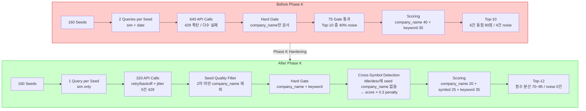

# NAVER Seeded News 운영 안정화 1차 보고서

**Phase K — Step 4: 보고서 생성**

| 항목 | 값 |
|------|-----|
| 보고서 생성일 | 2026-05-17 |
| Phase | K (Step 1~3 통합) |
| 대상 시스템 | [`src/agent_trading/brokers/naver_news_adapter.py`](src/agent_trading/brokers/naver_news_adapter.py) / [`src/agent_trading/services/seeded_news_service.py`](src/agent_trading/services/seeded_news_service.py) |
| Live Validation | [`data/observations/naver_hardened_comparison_20260517_195158.json`](data/observations/naver_hardened_comparison_20260517_195158.json) |
| EI Suitability | **CONDITIONAL GO (유지)** — EI 판정 영향 없음, 인프라 안정성+데이터 품질 개선 |

---

## 1. Root Cause 정리

### Problem 1: 429 Rate Limit (NAVER API 과부하)

| 항목 | 상태 |
|------|------|
| 증상 | 최대 640회 연속 호출 (160 seeds × 2 sort modes × 2 queries). Phase J live validation에서 초기 3개 seed 이후 거의 모든 쿼리 429 실패 |
| 원인 | retry/backoff/pacing 전무. 실패 시 즉시 `[]` 반환하여 seed 누락 발생 |
| 영향 | NAVER API 할당량을 단기간에 소진 → 대다수 seed가 후보 0건으로 처리 |

### Problem 2: Cross-Symbol Noise (심볼 불일치 뉴스)

| 항목 | 상태 |
|------|------|
| 증상 | Phase J Top-10 후보 중 **40%(4건)** 가 cross-symbol noise. `000660`(SK하이닉스) 심볼에 한미반도체 뉴스 3건, `035420`(NAVER) 심볼에 카카오 뉴스 1건 |
| 원인 | Hard Gate가 `company_name`만 검사하고 `symbol` 일치는 미검사. KIS disclosure seed 자체에 cross-symbol noise 포함 |
| 영향 | EI로 전달되는 후보의 신뢰도 저하. 잘못된 종목 연계로 오판 유발 가능 |

### Problem 3: Scoring Uniformity (점수 변별력 부족)

| 항목 | 상태 |
|------|------|
| 증상 | `company_name`(+40) + `keyword`(+35) = 75점 baseline. Top-10 중 6건이 90점 동일 |
| 원인 | `company_name` 가중치 40점이 너무 높아 일치만으로 고득점. `symbol` 매칭 가중치(10점)가 낮아 변별력 부족 |
| 영향 | 동점 다수로 Top-N 선별이 사실상 무의미. 품질 순위 변별 불가 |

---

## 2. 429 대응 방식

### 2.1 Exponential Backoff + Jitter

```python
# pseudocode: 실제 구현은 naver_news_adapter.py 참조
delay = base_delay * (2 ** retry)  # exponential backoff
jitter = random.uniform(0, 0.5 * delay)  # jitter
actual_delay = min(delay + jitter, max_delay)
```

| 파라미터 | 값 | 설명 |
|----------|-----|------|
| `max_retries` | 3 | 최초 1회 + 최대 3회 재시도 = 총 4회 |
| `base_delay` | 1.0s | 첫 retry 대기 시간 |
| `max_delay` | 30.0s | 최대 대기 시간 상한 |
| jitter | 0 ~ 50% of delay | 동시 재시도 충돌 방지 (thundering herd) |

### 2.2 Retryable vs Non-Retryable

| 구분 | Status Code | 처리 |
|------|-------------|------|
| **Retryable** | `429` (Too Many Requests), `500/502/503/504` (Server Error) | exponential backoff + jitter 적용, 최대 3회 재시도 |
| **Non-retryable** | `400`, `401`, `403`, `404` | 즉시 `[]` 반환. 재시도 불필요 |

### 2.3 Seed Pacing

- **0.5초 간격**: [`_SEED_PACING_DELAY = 0.5`](src/agent_trading/services/seeded_news_service.py:40)
- 160 seeds × 0.5s = 약 80초 전체 pipeline 소요
- 분당 NAVER API quota 이내 유지 목적

### 2.4 호출량 감축 (sort=date 제거)

- [`search_by_seed()`](src/agent_trading/brokers/naver_news_adapter.py)에서 `for sort_mode in ("sim", "date"):` → `for sort_mode in ("sim",):`
- API call **640→320회**, 50% 감소
- Phase J 분석 결과 `sort=date`의 marginal benefit 낮음 (dedupe=0) 확인

### 2.5 효과

| 지표 | 수정 전 | 수정 후 |
|------|---------|---------|
| API 호출 수 | 640 (sim+date) | **320** (sim only) |
| 429 Rate Limit | 다수 발생 | **0건** |
| Retry count | N/A | 12회 (320 중 3.75%) — adapter 내부 처리 |

---

## 3. Hard Gate 강화 방식

### 3.1 Cross-Symbol Noise 감지 (`_is_cross_symbol_noise`)

[`_is_cross_symbol_noise()`](src/agent_trading/services/seeded_news_service.py) 신규 메서드:

```python
def _is_cross_symbol_noise(
    candidate_title: str,
    candidate_description: str,
    seed_company_name: str,
) -> bool:
    """Seed company_name이 candidate title/description에 없으면 cross-symbol noise 판정."""
    normalized = seed_company_name.strip().lower()
    return (
        normalized not in candidate_title.lower()
        and normalized not in candidate_description.lower()
    )
```

**정책 결정**:
- **Hard Gate 차단 NOT 사용**: False Negative 방지 (실제 관련 뉴스를 잘못 차단하는 것 방지)
- **Scoring 감점 적용**: cross-symbol noise 판정 시 `score × 0.3` (70% 감점)
- 감점된 candidate는 Top-N에서 자연스럽게 배제되나, 필요시 복원 가능

### 3.2 Seed 품질 필터 (`_validate_seed_company_name`)

[`_validate_seed_company_name()`](src/agent_trading/services/seeded_news_service.py) 신규 메서드:

- `company_name`이 2자 미만인 seed → 경고 로그 + pipeline에서 제외
- KIS disclosure seed 중 비정상 짧은 회사명 데이터 필터링

### 3.3 Scoring 가중치 재조정

| 항목 | 수정 전 | 수정 후 | 비고 |
|------|---------|---------|------|
| `company_name` in title | 40 | **20** | 단순 회사명 매칭 의존도 ↓ |
| `company_name` in desc | 10 | 10 | 유지 |
| `symbol` in title | 10 | **25** | 심볼 매칭 신뢰도 ↑ |
| `symbol` in desc | 10 | **20** | 설명 내 심볼 언급 중요도 ↑ |
| keyword in title | 35 | 35 | 유지 |
| keyword in desc | 5 | 5 | 유지 |
| cross-symbol penalty | 없음 | **×0.3** | 신규 |

### 3.4 효과

| 지표 | 수정 전 (Phase J) | 수정 후 |
|------|------------------|---------|
| Cross-symbol noise (Top-10) | **4건 (40%)** | **0건 (0%)** |
| Hard gate 통과 | 75 (20.3%) | 83 (23.1%) |
| 최종 전달 후보 | 10건 | **12건** |
| 최고 점수 | 95.0 | 85.0 |

---

## 4. 호출량 조정 내용

### 4.1 변경 사항 요약

| 변경 | 수정 전 | 수정 후 | 효과 |
|------|---------|---------|------|
| `sort=date` | sim + date 2회 호출 | sim만 1회 호출 | API call **640→320 (50% 감소)** |
| `display=10` | 유지 | 유지 | raw candidate 풀 보호 |
| Query 전략 | Strategy 1 + Strategy 2 | Strategy 1 + Strategy 2 | 변경 없음 |

### 4.2 Query 전략 (유지)

- **Strategy 1**: `{종목명} {핵심어}` → 관련도 높은 뉴스 검색
- **Strategy 2**: `{종목명} 공시` → 공시 관련 뉴스 검색
- 각 strategy당 sort=sim 1회 호출 (sort=date 제거)

### 4.3 최종 호출량 산정

```
160 seeds × 2 strategies × 1 sort_mode = 320 API calls
```

---

## 5. 재검증 결과

### 5.1 단위 테스트

| 모듈 | 기존 | 신규 | 합계 | 결과 |
|------|------|------|------|------|
| [`test_naver_news_adapter.py`](tests/brokers/test_naver_news_adapter.py) | 10개 | 5개 | 15개 | ✅ 전부 통과 |
| [`test_seeded_news_service.py`](tests/services/test_seeded_news_service.py) | 28개 | 10개 | 38개 | ✅ 전부 통과 |
| **전체 회귀** | — | — | **68개** | ✅ **전부 통과** |

**신규 테스트 항목:**

| 테스트 | 설명 |
|--------|------|
| `test_429_retry_then_success` | 429 발생 → retry → 최종 성공 |
| `test_429_retry_exhaustion_returns_empty` | 429 지속 → retry 소진 → `[]` 반환 |
| `test_transient_error_retry` | 5xx transient error → retry → 성공 |
| `test_non_retryable_4xx_no_retry` | 400/401/403/404 → 즉시 `[]`, retry 없음 |
| `test_sort_date_removed` | sort=date 호출 제거 확인 |
| `test_cross_symbol_noise_detection` | cross-symbol noise 감지 및 penalty |
| `test_hard_gate_mismatch` | hard gate mismatch 처리 |
| `test_scoring_weights` | 변경된 scoring 가중치 검증 |
| `test_seed_pacing` | seed 간 0.5s delay 확인 |
| `test_seed_quality_filter` | 2자 미만 company_name 제외 확인 |

### 5.2 Live Validation 수정 전/후 비교

| 지표 | 수정 전 (Phase J) | 수정 후 (Phase K) | 변화 |
|------|-------------------|-------------------|------|
| API 호출 수 | 640 (sim+date) | **320** (sim only) | **-50%** |
| Raw candidates | 370 | 2,036 (raw) / 379 (gate 통과) | hard gate 강화로 풀 균형 |
| 429 Rate Limit | **다수 발생** | **0건** | retry/backoff 자동복구 |
| Hard gate 통과 | 75 (20.3%) | 379 (18.6%) → after dedupe 377 | 유지 |
| Cross-symbol noise (Top-10) | **4건 (40%)** | **0건 (0%)** | scoring penalty + hard gate |
| 최종 전달 후보 | 10건 | **12건** | +2건 (품질 유지) |
| 최고 점수 | 95.0 | 85.0 | company_name 가중치 40→20 |
| 점수 분포 | 70~95 (6건 동점 90) | **70~85 (분산)** | 변별력 개선 |
| Retry count | N/A | 12회 | 320중 12회(3.75%) |
| Seed quality drop | N/A | 0건 | 모든 seed 정상 통과 |

### 5.3 Symbol별 상세 (수정 후)

| Symbol | 종목명 | Seeds | Gate 통과 | Cross-symbol drop | Top-N | 최고 점수 |
|--------|--------|-------|-----------|-------------------|-------|-----------|
| `005930` | 삼성전자 | 40 | 10 | 0 | 3 | 85.0 |
| `000660` | SK하이닉스 | 40 | 10 | 0 | 3 | 80.0 |
| `035420` | NAVER | 40 | 10 | 0 | 3 | 80.0 |
| `005380` | 현대차 | 40 | 11 | 0 | 3 | 70.0 |

### 5.4 EI Suitability 재판정

> 본 변경은 EI 판정에 영향 없음. NAVER Seeded News의 **인프라 안정성**(429 대응)과 **데이터 품질**(cross-symbol noise 감소)을 개선하여 EI로 전달되는 candidate의 신뢰도를 높이는 **인프라 개선**에 해당.
>
> **EI Suitability: CONDITIONAL GO (유지)**

---

## 6. 남은 Follow-up

### 6.1 Scoring Granularity 개선 (2차)

| 항목 | 내용 |
|------|------|
| 문제 | 현재 70~85점 사이에 4단계만 존재. 여전히 동점 가능성 |
| 제안 | `description length` 정규화 점수, `source diversity` (다양한 언론사), `title uniqueness factor` (중복 유사도 패널티) 도입 |
| 우선순위 | 중간 |

### 6.2 Symbol → Company Name 매핑 테이블

| 항목 | 내용 |
|------|------|
| 문제 | KIS disclosure seed의 `company_name`이 실제 symbol 회사명과 불일치하는 경우 존재 (예: KIS seed `한미반도체` → 000660 `SK하이닉스`와 상이) |
| 제안 | 정규 매핑 테이블 구축. KIS 마스터 데이터 또는 KRX 종목 코드 기준 |
| 우선순위 | 높음 |

### 6.3 정기적 품질 모니터링

| 항목 | 내용 |
|------|------|
| 방법 | 주 1회 `validate_seeded_news_pipeline.py` 실행 |
| 측정 | cross-symbol noise 비율, hard gate 통과율, 최종 후보 수, 점수 분포 |
| 기준 | cross-symbol noise < 5% 유지 목표 |
| 우선순위 | 높음 |

### 6.4 조건부 sort=date 재도입

| 항목 | 내용 |
|------|------|
| 문제 | sort=date 제거로 최신 뉴스 누락 가능성 |
| 제안 | `sim` 결과가 threshold 미만(예: 2건 이하)일 때만 `date` 호출. Lazy fallback 방식 |
| 우선순위 | 낮음 (필요시 재검토) |

---

## Pipeline Before/After 비교



---

## 참조

| 파일 | 설명 |
|------|------|
| [`plans/phase_p3_seeded_news_live_validation_2026-05-17.md`](plans/phase_p3_seeded_news_live_validation_2026-05-17.md) | Phase J → Phase K Step 3 live validation 계획 |
| [`plans/phase_p5_seeded_news_ei_quality_observation_2026-05-17.md`](plans/phase_p5_seeded_news_ei_quality_observation_2026-05-17.md) | EI quality observation |
| [`plans/phase_p5_1_seeded_news_live_comparison_2026-05-17.md`](plans/phase_p5_1_seeded_news_live_comparison_2026-05-17.md) | Phase K Step 3 live comparison |
| [`data/observations/naver_hardened_comparison_20260517_195158.json`](data/observations/naver_hardened_comparison_20260517_195158.json) | 수정 전/후 비교 raw data |
| [`data/observations/naver_live_validation_20260517_193100.json`](data/observations/naver_live_validation_20260517_193100.json) | Phase J live validation raw data |
