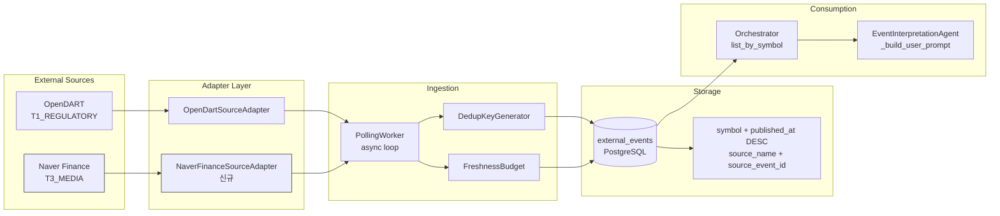

# News Source Adapter 1차 설계 (보강)

> 작성일: 2026-05-12 (1차) / 2026-05-12 (2차 보강)
> 상태: **❌ No-Go (Legal Gate) — v1 범위 외 보류**
>
> **최종 결론**: Naver Finance scraping은 Legal Gate 미통과. 이후 2차(Naver API) / 3차(대체 후보 6개) 평가도 모두 No-Go.
> **v1 External Event Source = OpenDART only. 뉴스 source 통합은 P2 Backlog으로 이동.**
>
> | 평가 단계 | 결과 | 상세 |
> |-----------|------|------|
> | 1차 (본 문서) | ❌ Legal Gate No-Go | finance.naver.com scraping — 저작권/ToS 위험 |
> | 2차 (Naver API) | ❌ 3-way 검증 No-Go | sort=sim/sort=date/2-stage hybrid 모두 기준 미달 |
> | 3차 (대체 후보) | ❌ 6개 후보 모두 No-Go | Symbol 직접 매핑 + 한국 Coverage + Legal 안전성을 모두 만족하는 source 없음 |
>
> 자세한 평가 결과: [`2nd_design_api.md`](plans/news_source_adapter_2nd_design_api.md) · [`3rd_evaluation.md`](plans/news_source_adapter_3rd_evaluation.md)

---

## 1. 현재 인프라 요약

### 1.1 Event Ingestion 파이프라인 (현재)

```
PollingWorker (async loop)
  ├── SourceAdapter.fetch() → RawEvent[]
  ├── DedupKeyGenerator → dedup_key_hash
  ├── ExternalEventRepository.find_by_dedup_key() → skip if exists
  ├── SourceAdapter.normalize() → ExternalEventEntity
  ├── FreshnessBudget → stale metadata
  └── ExternalEventRepository.add() → persisted
```

**현재 구현된 Source Adapter:**
- [`OpenDartSourceAdapter`](src/agent_trading/brokers/opendart_adapter.py) (T1_REGULATORY) — 공시 데이터만 수집

**현재 미구현:**
- 뉴스 source adapter — **이번 설계 대상**

### 1.2 EI Prompt에서 이벤트 표현 방식 (현재)

```python
# event_interpretation.py:_build_user_prompt()
# 각 이벤트는 아래 형식으로 표시
[src:opendart] [tier:T1_REGULATORY] [Y|분기보고서] [2026-05-12] [issuer:00126380] ⚠️STALE headline — body_summary
```

### 1.3 ExternalEventEntity 핵심 필드

| 필드 | 타입 | 설명 |
|------|------|------|
| `source_name` | str | `"opendart"`, `"naver_finance"` 등 |
| `source_reliability_tier` | str | `"T1_REGULATORY"`, `"T3_MEDIA"` |
| `symbol` | str? | 종목 코드 (`"005930"`) |
| `headline` | str? | 기사 제목 |
| `body_summary` | str? | 기사 본문 요약 |
| `event_type` | str | 이벤트 분류 |
| `dedup_key_hash` | str? | 중복 방지 키 |
| `source_event_id` | str? | Source 고유 ID |
| `published_at` | datetime | 발행 시각 |

### 1.4 DB Schema (`external_events` 테이블)

```sql
-- db/migrations/0006_add_external_event_data.sql
-- 이미 symbol + published_at DESC 인덱스 존재
-- 이미 source_name + source_event_id 인덱스 존재
-- 이미 source_reliability_tier 컬럼 존재 (DEFAULT 'T3')
```

**→ DB schema 변경 불필요.** 기존 `external_events` 테이블을 그대로 재사용.

---

## 2. 뉴스 Source 후보 비교

### 2.1 후보 목록

| # | Source | 타입 | API 필요 | Symbol 제공 | 법적 리스크 | 1순위 적합 |
|---|--------|------|---------|------------|-----------|-----------|
| 1 | **네이버 금융 종목별 뉴스 페이지** | HTML scraping | 없음 | ✅ **URL에 code 직접 내장** | ⚠️ 주의 | **⭐ 1순위** |
| 2 | **네이버 뉴스 검색 API** | REST API | Naver Client ID/Secret | ❌ 없음 (회사명 기반 검색 필요) | 낮음 (공식 API) | ❌ (Symbol 매핑 불가) |
| 3 | 한국경제 / 매일경제 / 서울경제 RSS | RSS | 없음 | ❌ 없음 | 낮음 (RSS) | ❌ |
| 4 | 연합인포맥스 | 유료 API | 유료 계약 | 부분적 | 낮음 | ❌ (유료) |
| 5 | Yahoo Finance RSS | RSS | 없음 | ✅ Symbol 존재 | 낮음 | ❌ (해외) |
| 6 | KRX API (KIND) | REST | 없음 | ✅ Symbol 존재 | 낮음 | ❌ (공시 위주) |

### 2.2 1순위 선정: **네이버 금융 종목별 뉴스 페이지**

**선정 이유 (설계 시점 기준):**

| 기준 | 평가 | 설명 |
|------|------|------|
| **Symbol 연결** | ✅ **직접 매핑** | `finance.naver.com/item/news_read.nhn?code=005930` — URL에 symbol 내장 |
| **Company name fuzzy matching 불필요** | ✅ **필요 없음** | URL에서 code 파라미터 직접 추출 |
| **한국 시장 coverage** | ✅ 최적 | 코스피/코스닥 전 종목 뉴스 |
| **실시간성** | ✅ 양호 | 속보 → 수 분 내 반영 |
| **Noise 수준** | ✅ 관리 가능 | 종목별 페이지는 해당 종목 뉴스만 — filtering 부담 낮음 |
| **API 키** | ✅ 불필요 | 추가 인증 불필요 |
| **법적 리스크** | ❌ **No-Go (조사 후)** | `robots.txt` Disallow + TOS 자동수집 금지 명시 → **구현 불가**<br>Section 13.2 참고 |
| **운영 안정성** | ⚠️ 중간 | HTML 구조 변경 가능 — but URL 패턴은 안정적 |

**⚠️ 중요: Legal Gate No-Go로 인해 이 source는 구현 불가.**
실제 조사 결과 `news_read.nhn`은 JS redirect stub이며, `robots.txt` Disallow + TOS 자동수집 금지로 scraping이 법적으로 허용되지 않음.
**Fallback: Naver News Search API (공식 API) 기반 재설계 필요.** Section 16-17 참고.

**Naver News Search API 배제 사유:**
- 검색 기반 (`query=삼성전자`) → Symbol 매핑 위해 회사명 → symbol 변환 필요
- 사용자가 명시적으로 "company name fuzzy matching이 필요한 source는 2차로 미루는 편이 좋음"
- 따라서 Naver News Search API는 2차 source 후보로 적합

### 2.3 Scraping 리스크 완화 방안

| 리스크 | 완화 방안 |
|--------|----------|
| HTML 구조 변경 | CSS selector 기반 파싱 → 구조 변경 시 `headline`/`body` 추출 실패 = empty result → safe fail |
| Rate limit / 차단 | Polling 간격 300초(5분) 이상, 20종목 이하 유지 → 0.07 rps 이하 |
| 법적 리스크 | **Section 13 (Legal Gate) 참고** — 통과 전 구현 불가 |

### 2.4 Fallback 전략

Naver Finance가 차단/구조변경 시 2순위 source:
- **네이버 뉴스 검색 API** → 회사명 기반 검색 → symbol 매핑 필요 (2차 구현)

---

## 3. Symbol 매핑 전략

### 3.1 전략 개요 (4-Level)

```
Level 1: 종목별 뉴스 페이지 URL → "code" 파라미터 직접 추출
Level 2: (현재 미구현, 향후) 뉴스 목록 "관련종목" 태그 → Symbol
Level 3: (현재 미구현, 향후) 회사명 → instruments.name 매칭
Level 4: 매핑 불가 → symbol=None (EI 전달 안 됨)
```

### 3.2 Level 1: 종목별 URL 직접 매핑 (1차 구현 대상)

```python
# finance.naver.com/item/news_read.nhn?code=005930
# → URL query param "code" = "005930"
symbol = parsed_url.query_params.get("code")
```

**구현 방식:**
- Adapter가 **명시적 symbol allowlist**를 순회
- 각 symbol별로 `finance.naver.com/item/news_read.nhn?code={symbol}` URL 호출
- 응답 HTML에서 뉴스 목록 파싱
- Symbol은 호출 시 이미 알고 있음 → `RawEvent.symbol`에 직접 설정

### 3.3 `list_active()` 미존재 — Allowlist 방식으로 대체

**1차 설계 오류 수정:**
[`InstrumentRepository`](src/agent_trading/repositories/contracts.py:179)에는 `list_active()` 메서드가 존재하지 않음.
`add()`, `get()`, `get_by_symbol()`만 정의됨.

**해결 방안: Static Allowlist 사용**

```python
# settings.py
naver_finance_symbols: tuple[str, ...] = ()  # "005930,000660,..." from env
```

- `NAVER_FINANCE_SYMBOLS` env var에서 콤마 구분 symbol 목록 읽음
- 1차 범위: **최대 20종목** (Section 8 참고)
- Allowlist은 env/settings로 관리 → 재시작 없이 변경 불가 (v1 한계, 이후 개선 가능)

**이 방식이 가능한 이유:**
- `ExternalEventRepository.list_by_symbol(symbol, since)`가 이미 존재
- Orchestrator `assemble()`에서 `list_by_symbol()`로 이벤트 로드
- DB 인덱스 `idx_external_events_symbol` (symbol, published_at DESC) 이미 존재

---

## 4. Noise Filtering / Dedup 정책

### 4.1 Filtering 파이프라인 (Adapter 단계)

```
Naver Finance HTML response
  │
  ├── Filter 1: Symbol 매핑 확인
  │   symbol=None → skip (RawEvent 생성하지 않음)
  │
  ├── Filter 2: Market-wide Macro 뉴스
  │   headline에 "코스피", "코스닥", "환율", "금리", "국제유가" 등 포함
  │   AND 종목 특정 정보 없음 → skip
  │
  ├── Filter 3: Opinion / Column / 광고성 기사
  │   headline에 "[기자 칼럼]", "[시황분석]", "프리미엄", "유료" 등 포함 → skip
  │
  ├── Filter 4: 본문 품질 임계값
  │   headline 길이 < 5자 or headline=None → skip
  │
  └── Filter 5: 중복 기사 (DedupKeyGenerator)
      dedup key = "naver_finance|{article_id}|news|{symbol}"
      ExternalEventRepository.find_by_dedup_key() → 존재하면 skip
```

### 4.2 Filtering 위치 결정

**Filter 1–4는 `fetch()` 내부 `_parse_articles()`에서 처리.**

**Filter 5 (dedup)는 `PollingWorker`에서 처리 — 기존 contract 유지.**

```python
# naver_finance_adapter.py (설계 — B안)
class NaverFinanceSourceAdapter:
    async def fetch(self) -> Sequence[RawEvent]:
        """Fetch news — noise filtering applied before RawEvent creation."""
        # ... pagination ...
        for article_element in parsed_articles:
            if not self._passes_filters(article_element):
                continue  # skip: filtered at fetch level
            raw = self._to_raw_event(article_element, symbol)
            results.append(raw)
        return results

    async def normalize(self, raw: RawEvent) -> ExternalEventEntity:
        """Pure field mapping — always returns entity (contract preserved)."""
        dedup_key = self.generate_dedup_key(raw)
        return ExternalEventEntity(...)

    def generate_dedup_key(self, raw: RawEvent) -> str:
        """Dedup key: naver_finance|{article_id}|news|{symbol}"""
        return DedupKeyGenerator.generate_from_raw(...)
```

### 4.3 Dedup Key Format

```
naver_finance|{article_id}|news|{symbol}
```

- `article_id`: Naver 뉴스 URL에서 추출한 stable article ID
  - URL: `https://n.news.naver.com/mnews/article/009/0005234567`
  - → `source_event_id` = `009/0005234567` (언론사코드/기사번호)
- Symbol까지 포함 → 동일 기사가 여러 종목 페이지에서 중복 수집되어도 동일 dedup key

### 4.4 Source Reliability Tier

| Tier | 값 | Source | 설명 |
|------|-----|--------|------|
| T1_REGULATORY | `"T1_REGULATORY"` | OpenDART | 공식 공시 — 최고 신뢰도 |
| T2_INSTITUTIONAL | `"T2_INSTITUTIONAL"` | (향후) 증권사 리포트 | 기관 발행 |
| **T3_MEDIA** | **`"T3_MEDIA"`** | **Naver Finance** | **뉴스/미디어 — 이번 설계 대상** |
| T4_LOW_CONFIDENCE | `"T4_LOW_CONFIDENCE"` | (향후) 미검증 소스 | 실험적 |

EI prompt에서 tier 정보가 함께 표시되므로, EI가 T3를 T1보다 낮은 가중치로 해석할 수 있음.

---

## 5. EI Prompt 공존 Format

### 5.1 현재 Format

```
Recent events (3):
  [src:opendart] [tier:T1_REGULATORY] [Y|분기보고서] [2026-05-12] [issuer:00126380] 삼성전자 분기보고서 제출
  [src:opendart] [tier:T1_REGULATORY] [Y|단일회사개별감사보고서] [2026-05-11] [issuer:00126380] 감사보고서 제출
  [src:opendart] [tier:T1_REGULATORY] [A|주주총회소집결의] [2026-05-10] [issuer:00126380] 주주총회 소집
```

### 5.2 News 추가 후 Format (변경 안 함 — 동일 format 유지)

```
Recent events (5):
  [src:opendart] [tier:T1_REGULATORY] [Y|분기보고서] [2026-05-12] [issuer:00126380] 삼성전자 분기보고서 제출
  [src:naver_finance] [tier:T3_MEDIA] [news] [2026-05-12] 삼성전자, HBM3E 6세대 양산 돌입 — 업계 최초
  [src:naver_finance] [tier:T3_MEDIA] [news] [2026-05-12] 삼성전자, 2분기 영업이익 시장전망치 상회 전망
  [src:opendart] [tier:T1_REGULATORY] [A|주주총회소집결의] [2026-05-10] [issuer:00126380] 주주총회 소집
  [src:naver_finance] [tier:T3_MEDIA] [news] [2026-05-11] TSMC 3nm 수율 90% 돌파... 삼성과 격차
```

**변경 사항:**
- `event_type`: OpenDART는 `"Y|분기보고서"` 형식, News는 `"news"` (단일 값)
- `source_name`: `"naver_finance"` (신규)
- `source_reliability_tier`: `"T3_MEDIA"` (OpenDART의 `T1_REGULATORY`와 구분)

### 5.3 변경 불필요한 항목

| 항목 | 이유 |
|------|------|
| [`EI._build_system_prompt()`](src/agent_trading/services/ai_agents/event_interpretation.py:201) | 변경 불필요 — JSON schema는 동일 |
| [`EI._build_user_prompt()`](src/agent_trading/services/ai_agents/event_interpretation.py:218) | **변경 불필요** — provenance tag format(`[src:...]`, `[tier:...]`)은 source에 무관하게 동일하게 적용됨 |
| `Orchestrator.assemble()` | 변경 불필요 — `list_by_symbol()`은 이미 `source_name`과 무관하게 모든 external event를 반환 |

---

## 6. 변경 파일 목록

### 6.1 신규 파일

| 파일 | 설명 | 비고 |
|------|------|------|
| `src/agent_trading/brokers/naver_finance_adapter.py` | Naver Finance 뉴스 source adapter | SourceAdapter protocol 구현. `fetch()` → HTML 파싱 + noise filtering → `RawEvent[]` 반환 |
| `tests/brokers/test_naver_finance_adapter.py` | Naver Finance adapter 단위 테스트 | HTTP 응답 Mock 기반 |

### 6.2 수정 파일

| 파일 | 변경 내용 | 변경 이유 |
|------|----------|----------|
| [`src/agent_trading/runtime/bootstrap.py`](src/agent_trading/runtime/bootstrap.py) | `_build_polling_workers()`에 Naver Finance PollingWorker 추가 | `settings.naver_finance_enabled` 플래그로 활성화. `settings.naver_finance_symbols`로 allowlist 전달 |
| [`src/agent_trading/config/settings.py`](src/agent_trading/config/settings.py) | `naver_finance_enabled: bool`, `naver_finance_symbols: tuple[str, ...]` 필드 추가 | env var `NAVER_FINANCE_ENABLED` (default: `False`), `NAVER_FINANCE_SYMBOLS` (default: `""`) |
| [`.env.example`](.env.example) | `NAVER_FINANCE_ENABLED=false`, `NAVER_FINANCE_SYMBOLS=` 추가 | 설정 문서화 |

**`polling_worker.py` 변경 불필요 (B안 채택).** Section 7 참고.

### 6.3 변경 불필요 (재사용)

| 파일 | 이유 |
|------|------|
| [`src/agent_trading/brokers/source_adapter.py`](src/agent_trading/brokers/source_adapter.py) | `RawEvent`, `SourceAdapter` protocol — 변경 불필요 |
| [`src/agent_trading/brokers/dedup.py`](src/agent_trading/brokers/dedup.py) | `DedupKeyGenerator` — 변경 불필요 (기존 format 준수) |
| [`src/agent_trading/brokers/freshness.py`](src/agent_trading/brokers/freshness.py) | `FreshnessBudget` — 변경 불필요 |
| [`src/agent_trading/domain/entities.py`](src/agent_trading/domain/entities.py) | `ExternalEventEntity` — 변경 불필요 |
| [`src/agent_trading/domain/enums.py`](src/agent_trading/domain/enums.py) | `SourceReliabilityTier` — `T3_MEDIA` 이미 존재 |
| [`src/agent_trading/repositories/contracts.py`](src/agent_trading/repositories/contracts.py) | `ExternalEventRepository` — 변경 불필요 |
| `db/migrations/*` | **DB schema 변경 불필요** — 기존 `external_events` 테이블 재사용 |
| [`src/agent_trading/services/ai_agents/event_interpretation.py`](src/agent_trading/services/ai_agents/event_interpretation.py) | `_build_user_prompt()` — 변경 불필요 |
| [`src/agent_trading/services/decision_orchestrator.py`](src/agent_trading/services/decision_orchestrator.py) | `assemble()` — 변경 불필요 |
| [`src/agent_trading/brokers/polling_worker.py`](src/agent_trading/brokers/polling_worker.py) | **변경 불필요 (B안 채택)** — Section 7 참고 |

---

## 7. Worker Contract 영향 분석: `normalize() -> None` 재검토

### 7.1 문제

1차 설계에서는 `normalize()`가 `None`을 반환하여 noise filtering을 수행하고,
`PollingWorker.poll_once()`가 `None`을 skip하도록 수정하는 **A안**을 제안했음.

### 7.2 비교: A안 vs B안

| 항목 | A안 (Worker contract 변경) | B안 (Adapter 내부 filter) |
|------|--------------------------|--------------------------|
| **변경 내용** | `SourceAdapter.normalize()` return type: `ExternalEventEntity` → `ExternalEventEntity \| None`<br>`PollingWorker.poll_once()`: None skip 처리 | Filter 1–4를 `fetch()` 내 `_parse_articles()`에서 처리.<br>`normalize()`는 pure mapping 유지 |
| **영향 범위** | `source_adapter.py` protocol 변경<br>`polling_worker.py` 수정<br>기존 `OpenDartSourceAdapter` 영향 없음 (항상 entity 반환) | `naver_finance_adapter.py`만 변경<br>기존 코드 영향 없음 |
| **contract 안정성** | **❌ 약화** — 모든 adapter가 None 반환 가능해짐<br>OpenDART도 실수로 None 반환 가능 | **✅ 유지** — `ExternalEventEntity` 반환 보장 |
| **filtering 위치 일관성** | ❌ fetch/normalize 분산 | ✅ fetch 내에서 filtering 완료 |
| **테스트 용이성** | ⚠️ normalize + worker 결합 테스트 필요 | ✅ adapter 단독 테스트로 충분 |
| **기존 adapter 호환성** | ✅ 영향 없음 | ✅ 영향 없음 |
| **향후 adapter 추가** | ⚠️ None 반환 가능성 항상 고려 | ✅ "not found = empty RawEvent"로 통일 |

### 7.3 권장안: **B안 (Adapter 내부 filter)**

**이유:**
1. [`SourceAdapter` protocol](src/agent_trading/brokers/source_adapter.py:96)의 `normalize()` 명세가 "Convert a RawEvent into a normalised ExternalEventEntity"이므로, 이 contract을 깨는 것은 미래 adapter에도 영향을 줌
2. [`PollingWorker.poll_once()`](src/agent_trading/brokers/polling_worker.py:134)의 단계 (fetch → dedup check → normalize → freshness → persist)에서 filtering은 fetch 단계에서 완료하는 것이 자연스러움
3. Naver Finance의 noise filter (macro, opinion, short headline)는 **content 기반 판단**이므로 RawEvent 생성 전에 적용해도 무방

### 7.4 B안 상세 설계

```python
async def fetch(self) -> Sequence[RawEvent]:
    results: list[RawEvent] = []
    for symbol in self._symbols:
        html = await self._fetch_news_page(symbol)
        articles = self._parse_articles(html)
        for article in articles:
            # Filter 1: Symbol 부재 (실제로는 항상 존재)
            if not self._passes_symbol_check(article, symbol):
                continue
            # Filter 2: Market-wide macro
            if self._is_market_wide(article):
                continue
            # Filter 3: Opinion/Column/Ad
            if self._is_opinion_or_ad(article):
                continue
            # Filter 4: Short headline
            headline = (article.get("headline") or "").strip()
            if len(headline) < 5:
                continue
            results.append(self._to_raw_event(article, symbol))
    return results

async def normalize(self, raw: RawEvent) -> ExternalEventEntity:
    """Pure field mapping — always returns ExternalEventEntity."""
    dedup_key = self.generate_dedup_key(raw)
    return ExternalEventEntity(
        event_id=uuid4(),
        event_type="news",
        source_name=self.source_name,
        published_at=raw.published_at,
        source_reliability_tier=self.reliability_tier.value,
        source_event_id=raw.source_event_id,
        symbol=raw.symbol,
        headline=raw.headline,
        body_summary=raw.body,
        dedup_key_hash=dedup_key,
        ...
    )
```

---

## 8. Symbol Polling Universe 상세 설계

### 8.1 OpenDART와의 구조적 차이

| 항목 | OpenDART | Naver Finance (뉴스) |
|------|----------|---------------------|
| **API 형식** | 전역 list fetch (1회 호출로 전체 공시) | **Symbol별 개별 페이지 호출** |
| **Symbol 의존성** | 응답에 stock_code 포함 (단순 추출) | **호출 URL에 symbol 필요** |
| **호출 횟수** | 1회/cycle | N회/cycle (N = symbol 수) |
| **속도 제약** | OpenDART API rate limit | Naver scraping rate limit |

### 8.2 Symbol Source

```python
# settings.py
naver_finance_symbols: tuple[str, ...] = ()
```

- **값 출처**: `NAVER_FINANCE_SYMBOLS` 환경 변수 (콤마 구분)
  - 예: `NAVER_FINANCE_SYMBOLS=005930,000660,035420,207940,005380`
- **1차 범위**: 최대 **20종목**
- **Symbol 선정 기준** (구현 시 결정):
  - 운영자가 명시적으로 관심 종목을 allowlist에 등록
  - `InstrumentRepository`와 독립적 — `list_active()` 미존재 문제 회피
- **갱신 주기**: env 변경 + 재시작 필요 (v1 한계)

### 8.3 Allowlist 방식 채택 이유

1. **`InstrumentRepository.list_active()` 미존재** — 이 메서드를 추가하면 `contracts.py` + Postgres 구현체 + Memory 구현체까지 변경 필요 (DB schema 변경은 아니지만 interface 변경). 이는 "설계만" 원칙에 위배되지는 않지만, 불필요한 변경 범위 확장.

2. **전 종목 전수 polling은 1차 범위에서 제외**
   - 코스피 + 코스닥 ≈ 2,500종목
   - 각 종목당 1회 호출 → 2,500회/cycle
   - Naver scraping 관점에서 비현실적

3. **Allowlist가 가장 단순하고 안전한 접근법**

### 8.4 Polling Budget / Cycle Scope

| 항목 | 값 | 근거 |
|------|-----|------|
| Symbol max | **20** | 운영 관리 가능 범위 + scraping 부담 최소화 |
| 기사 max/종목/cycle | **20** (1페이지 분량) | Naver 뉴스 페이지 기본 20건 |
| Polling 주기 | **300초 (5분)** | OpenDART와 동일 |
| 전체 호출/cycle | max 20회 (20 symbols × 1 page) | — |
| 호출 간격 | 연속 호출 (burst) | 20회 × ~0.5s = ~10초 total |
| 예상 scraping 부담 | **0.07 rps** (20회 / 300초) | 매우 낮음, 일반 사용자 이하 |

**왜 20종목인가:**
- 20종목 × 300초 = 0.07 rps — Naver 입장에서 감지하기 어려운 수준
- 1일 예상 요청: 20종목 × 288회/일 = 5,760회
- 일반 사용자가 5분마다 20개 종목 페이지를 보는 것과 유사

---

## 9. Dedup / `source_event_id` 전략 상세

### 9.1 `source_event_id` 정의

| 필드 | 값 | 예시 |
|------|-----|------|
| `source_event_id` | **Naver 뉴스 article ID** | `009/0005234567` |

**추출 방법:**
- Naver 뉴스 기사 URL은 아래 구조:
  - `https://n.news.naver.com/mnews/article/{media_id}/{article_id}`
  - 예: `https://n.news.naver.com/mnews/article/009/0005234567`
- `source_event_id` = `{media_id}/{article_id}` = `009/0005234567`
- **기사 URL 전체를 source_event_id로 사용하지 않음** — URL path의 식별자 부분만 사용

**선정 이유:**
- Stable identifier — headline이 변경되어도 article ID는 동일
- Naver 내부에서 기사를 식별하는 canonical ID
- 재게시/수정 시 동일한 article ID 유지

### 9.2 Dedup Key Format

```
naver_finance|{article_id}|news|{symbol}
```

예:
```
naver_finance|009/0005234567|news|005930
```

**기존 [`DedupKeyGenerator`](src/agent_trading/brokers/dedup.py:27) format 준수:**
```python
# DedupKeyGenerator.generate()
stable_key = f"{source_name}|{source_event_id}|{event_type}|{identifier}"
# → SHA-256 hash
```

**기존 `DedupKeyGenerator.generate_from_raw()` 재사용:**
```python
def generate_dedup_key(self, raw: RawEvent) -> str:
    return DedupKeyGenerator.generate_from_raw(
        source_name=raw.source_name,
        source_event_id=raw.source_event_id,
        event_type=raw.event_type,
        symbol=raw.symbol,
    )
```

### 9.3 Headline 변경 / 재게시 정책

| 시나리오 | Dedup Key | 동작 | 정당성 |
|----------|-----------|------|--------|
| 동일 기사, 동일 headline | 동일 | **중복 skip** | 정상 |
| 동일 기사, headline 미변경 수정 | 동일 | **중복 skip** (재수집 안 됨) | 허용 |
| 동일 article ID, headline 변경 | 동일 | **중복 skip** (재수집 안 됨) | **의도된 동작** — 수정본을 새 이벤트로 보지 않음 |
| 동일 article ID, 기사 내용 완전 변경 | 동일 | **중복 skip** | Naver 정책상 드문 케이스 |
| 새로운 기사, 동일 headline | 상이 | **정상 수집** | 다른 article ID |

**정책 근거:** 동일 article ID = 동일 논리적 이벤트. 수정/재게시는 headline이 바뀌어도 dedup으로 처리.
이것이 OpenDART의 `rcept_no` 기반 dedup과 일관된 정책.

### 9.4 Filter 5 (Dedup) 처리 위치

**PollingWorker가 처리** — `find_by_dedup_key()` + `continue` 로직 재사용.
별도 변경 불필요.

---

## 10. NaverFinanceSourceAdapter 구현 설계 (B안 반영)

### 10.1 클래스 구조

```python
class NaverFinanceSourceAdapter:
    """Source adapter for Naver Finance (finance.naver.com) news.
    
    Fetches news articles per-symbol from the Naver Finance
    item-specific news page, parses headlines, and normalises
    into ExternalEventEntity.
    
    Source reliability: T3_MEDIA (news/media tier).
    
    Note: This adapter uses a static allowlist of symbols (not
    InstrumentRepository.list_active()) because:
    1. InstrumentRepository does not have list_active()
    2. Full-market scraping is out of v1 scope
    3. Allowlist is simpler and safer for scraping rate management
    """
    
    source_name = "naver_finance"
    reliability_tier = SourceReliabilityTier.T3_MEDIA
    
    def __init__(
        self,
        symbols: Sequence[str],        # Allowlist — from settings
        request_timeout: int = 15,
    ) -> None: ...
    
    async def fetch(self) -> Sequence[RawEvent]:
        """Fetch news — noise filtering at fetch level (B안)."""
        ...
    
    async def normalize(self, raw: RawEvent) -> ExternalEventEntity:
        """Pure field mapping — always returns entity."""
        ...
    
    def generate_dedup_key(self, raw: RawEvent) -> str:
        """DedupKeyGenerator.generate_from_raw() 재사용."""
        ...
```

### 10.2 `fetch()` 동작 — B안

```python
# ⚠️ 중요: 실제 조사 결과 news_read.nhn은 JS redirect stub.
# Server-side rendered 뉴스 데이터는 item/main.naver?code={symbol}에서 추출 가능.
# 하지만 Legal Gate No-Go로 이 설계는 구현 불가.
# 아래 코드는 참고용 설계이며, Fallback (Naver News Search API)에서는 완전히 다른 fetch() 구현 필요.

NAVER_NEWS_BASE_URL = "https://finance.naver.com/item/news_read.nhn"
# 실제 사용해야 할 URL (server-side rendered):
# "https://finance.naver.com/item/main.naver?code={symbol}"
# → div.sub_section.news_section ul li span.txt a (headline)
# → div.sub_section.news_section ul li em (date)
# → a href 파라미터: article_id={id}&office_id={office_id}

MACRO_KEYWORDS = {"코스피", "코스닥", "환율", "금리", "국제유가", "비트코인", "원/달러"}
OPINION_KEYWORDS = {"[기자 칼럼]", "[시황분석]", "[전문가 의견]", "프리미엄", "유료", "광고"}

async def fetch(self) -> Sequence[RawEvent]:
    results: list[RawEvent] = []
    for symbol in self._symbols:
        html = await self._fetch_page(symbol)
        articles = self._parse_articles(html)
        for article in articles:
            # ---- Noise filtering at fetch level ----
            headline = (article.get("headline") or "").strip()
            if len(headline) < 5:
                continue
            if any(kw in headline for kw in MACRO_KEYWORDS):
                continue
            if any(kw in headline for kw in OPINION_KEYWORDS):
                continue
            # ---- Build RawEvent ----
            raw = self._to_raw_event(article, symbol)
            results.append(raw)
    return results

async def normalize(self, raw: RawEvent) -> ExternalEventEntity:
    """Pure field mapping — always returns ExternalEventEntity."""
    dedup_key = self.generate_dedup_key(raw)
    return ExternalEventEntity(
        event_id=uuid4(),
        event_type="news",
        source_name=self.source_name,
        published_at=raw.published_at,
        source_reliability_tier=self.reliability_tier.value,
        source_event_id=raw.source_event_id,
        symbol=raw.symbol,
        ingested_at=raw.ingested_at,
        effective_at=raw.published_at,
        severity="medium",
        direction="neutral",
        headline=raw.headline,
        body_summary=raw.body,
        dedup_key_hash=dedup_key,
        metadata={"source_raw_event_type": raw.event_type},
    )
```

### 10.3 Polling Config

```python
config = PollingConfig(
    source_name="naver_finance",
    interval_seconds=300,        # 5분 — scraping 부담 최소화
    freshness_max_seconds=600,   # 10분 max lag
)
```

### 10.4 Bootstrap Wiring

```python
# bootstrap.py:_build_polling_workers()
if settings.naver_finance_enabled and settings.naver_finance_symbols:
    from agent_trading.brokers.naver_finance_adapter import NaverFinanceSourceAdapter
    
    adapter = NaverFinanceSourceAdapter(
        symbols=settings.naver_finance_symbols,
    )
    config = PollingConfig(
        source_name="naver_finance",
        interval_seconds=300,
        freshness_max_seconds=600,
    )
    workers.append(PollingWorker(adapter, config, external_event_repo))
```

---

## 11. 전체 아키텍처 다이어그램



---

## 12. 테스트 / 검증 방법

### 12.1 단위 테스트

| 테스트 | 설명 |
|--------|------|
| `test_fetch_returns_raw_events` | Mock HTTP 응답 → Naver Finance HTML → RawEvent[] 정상 파싱 |
| `test_fetch_filters_market_wide` | "코스피, 2분기 전망" headline → RawEvent에서 제외 |
| `test_fetch_filters_opinion` | "[기자 칼럼]" headline → RawEvent에서 제외 |
| `test_fetch_filters_short_headline` | headline < 5자 → RawEvent에서 제외 |
| `test_fetch_empty_page` | 뉴스 없는 종목 → empty list |
| `test_fetch_http_error` | HTTP 500/403 → graceful empty return |
| `test_normalize_returns_entity` | RawEvent → ExternalEventEntity 정상 매핑 |
| `test_normalize_dedup_key` | dedup key format = `naver_finance\|{article_id}\|news\|{symbol}` |
| `test_generate_dedup_key_consistency` | 동일 입력 → 동일 SHA256 hash |
| `test_dedup_key_follows_existing_format` | `DedupKeyGenerator.generate_from_raw()` 재사용 확인 |
| `test_fetch_polling_config` | PollingConfig interval=300s |
| `test_symbol_allowlist_empty` | `symbols=[]` → fetch() returns [] |

### 12.2 통합 테스트

- PollingWorker + NaverFinanceSourceAdapter 조합 검증
- Dedup → 중복 기사 skip 확인
- Freshness budget 정상 적용 확인
- `external_events` 테이블에 정상 저장 확인

### 12.3 EI Prompt 검증

Dry-run으로 뉴스 포함된 EI prompt 로그 확인:
```
Recent events (5):
  [src:opendart] [tier:T1_REGULATORY] [Y|분기보고서] [2026-05-12] [issuer:00126380] ...
  [src:naver_finance] [tier:T3_MEDIA] [news] [2026-05-12] 삼성전자, HBM3E 양산 돌입
```

---

## 13. Legal / Robots / TOS Gate (Go/No-Go)

### 13.1 Gate 조건

**구현 전 반드시 아래 3가지 조건을 확인해야 함.**

| # | 확인 항목 | 확인 방법 | 통과 기준 |
|---|----------|----------|----------|
| 1 | **`robots.txt`** | `curl https://finance.naver.com/robots.txt` | `/item/` 경로가 **Allow** 또는 **미명시**되어야 함. `Disallow: /item/`이면 구현 보류 |
| 2 | **Naver 이용약관** | [Naver 이용약관](https://www.naver.com/policy/terms.html) 확인 | 크롤링/자동수집에 관한 조항 확인. "자동 수집 금지" 조항 존재 시 법률 검토 필요 |
| 3 | **Scraping 빈도 제한** | 설계 문서 내 명시 | 0.07 rps (20종목 × 5분) — 일반 사용자 수준. 동의 필요 |

### 13.2 Gate 결과 — **❌ No-Go (Legal Gate 미통과)**

**실제 조사 결과 (2026-05-12):**

| Gate | 결과 | 상세 |
|------|------|------|
| **`robots.txt`** | ❌ **Disallow** | `finance.naver.com/robots.txt`: `User-agent: * → Disallow: /`<br>`news_read.nhn` 경로는 Allow 목록에 없음 → **효과적으로 Disallowed**<br>Allow 목록: `/sise/`, `/research/`, `/marketindex/`, `/fund/`, `/template/head_js.naver`, `/world/`, `/item/board.naver?code=*`<br>→ `/item/` 경로는 Allow에 없음 |
| **Naver 이용약관** | ❌ **자동수집 금지 명시** | [Naver 서비스 이용약관/운영정책](https://policy.naver.com/policy/service.html):<br>"네이버의 사전 허락 없이 자동화된 수단(예: 매크로 프로그램, 로봇(봇), 스파이더, 스크래퍼 등)을 이용하여 ... 네이버 서비스에 게재된 회원의 아이디(ID), 게시물 등을 수집하거나"<br>→ **Scraping을 명시적으로 금지** |
| **검색결과 수집 정책** | ❌ **robots.txt 준수 요구** | [Naver 검색결과 수집 정책](https://policy.naver.com/policy/search_policy.html):<br>"robots.txt를 무시하고 네이버 데이터 베이스를 계속 수집하는 경우" 법적 조치 가능 명시 |
| **Scraping 빈도** | ⚠️ **의미 없음** | Legal gate 미통과로 빈도 제한 자체가 무의미 |

### 13.3 HTML 구조 조사 결과 (기술적)

**조사한 URL 목록:**

| URL | 크기 | 결과 |
|-----|------|------|
| `finance.naver.com/item/news_read.nhn?code=005930` | 87 bytes | **JS redirect stub** — `<SCRIPT>top.location.href='https://n.news.naver.com/mnews/article/null/null';</SCRIPT>`<br>실제 콘텐츠 없음, article/null/null |
| `finance.naver.com/item/news_read.naver?article_id=...&office_id=...&code=005930` | 92 bytes | **JS redirect stub** — `n.news.naver.com/mnews/article/{office_id}/{article_id}`<br>article ID는 URL에 포함되어 있음 |
| `finance.naver.com/item/main.naver?code=005930` | **197 KB** | **✅ Server-side rendered full HTML**<br>뉴스 섹션(`div.sub_section.news_section`)에 10개 기사 포함<br>CSS selector: `ul li span.txt a` (headline), `em` (date)<br>기사 URL에 `article_id`와 `office_id` 포함 |
| `finance.naver.com/item/news.naver?code=005930` | 131 KB | **iframe 기반** — JS 필요 (`news_frame` → `news_news.naver`) |
| `finance.naver.com/item/news_news.naver?code=005930` | 5.8 KB | **빈 결과** — Npay 증권 AI 요약 시스템, "최근 1일 내 검색된 '' 관련 결과가 없습니다" |

**핵심 발견:**
1. **`news_read.nhn`은 JS redirect stub** — 원래 설계에서 가정한 URL이 실제로는 콘텐츠를 반환하지 않음
2. **`item/main.naver`는 server-side rendered** — JS 없이 headline/article_id/date 추출 가능 (197KB)
3. **기사 본문(body) 추출 불가** — `news_read.naver`도 JS redirect, `n.news.naver.com`은 별도 robots.txt
4. **`item/news.naver` (더보기)는 iframe/JS 의존** — 추가 페이지 로드 불가

**Article ID 추출 가능 여부: ✅ 가능**
- `item/main.naver` 내 기사 링크: `/item/news_read.naver?article_id={article_id}&office_id={office_id}&code={symbol}`
- `source_event_id = "{office_id}/{article_id}"` (예: `014/0005520434`)
- Symbol은 URL의 `code` 파라미터에서 직접 추출 가능
- headline은 `<span class="txt"><a href="...">headline</a></span>`에서 추출
- date는 `<em>MM/DD</em>`에서 추출

### 13.4 Legal Gate 통과 시 추가 운영 조건 (현재 무의미)

- Scraping 빈도 0.07 rps 초과 금지
- 수집 데이터: 내부 연구/분석용으로만 사용 (상업적 재배포 금지)
- Naver에 explicit block 당하면 즉시 수집 중단

---

## 14. 구현 착수 조건 (Go/No-Go Criteria)

**아래 4개 조건이 모두 충족되어야 구현을 시작할 수 있음.**

| # | 조건 | 상태 | 비고 |
|---|------|------|------|
| 1 | **Symbol universe 확정** | ✅ **완료** | Static allowlist, 최대 20종목, env 기반 |
| 2 | **Dedup / source_event_id 확정** | ✅ **완료** | `article_id` (`{media_id}/{article_id}`)를 `source_event_id`로 사용.<br>Dedup key = `naver_finance\|{article_id}\|news\|{symbol}`.<br>기존 `DedupKeyGenerator` 재사용 |
| 3 | **Worker contract 유지/변경 방침 확정** | ✅ **완료** | **B안 채택** — `normalize()` contract 유지.<br>Filtering은 `fetch()` 내 `_parse_articles()`에서 처리.<br>`polling_worker.py` 변경 불필요 |
| 4 | **Legal / robots gate 통과** | ❌ **No-Go** | **robots.txt Disallow + TOS 자동수집 금지 명시 → 통과 불가**<br>Section 13.2 참고 |

---

## 15. 답변: 핵심 질문

### Q1. 뉴스 source 1순위?

**네이버 금융 종목별 뉴스 페이지 (`finance.naver.com/item/news_read.nhn?code={symbol}`)**

선정 사유:
- **Symbol이 URL에 직접 내장**되어 있어 fuzzy matching 불필요
- 한국 시장 coverage 가장 우수
- 별도 API 키 불필요
- 종목별 페이지는 해당 종목 뉴스만 노출 → noise 관리 용이

RSS / 벤더 API / 거래소 feed는 모두 Symbol 연결성이 부족하여 2차 후보.

### Q2. Symbol 매핑 위치?

**Adapter `fetch()` 단계에서 직접 매핑 (Level 1).**
- Static allowlist (`settings.naver_finance_symbols`) 순회
- 각 symbol별 URL 호출: `news_read.nhn?code={symbol}`
- Symbol은 호출 시 이미 알고 있음 → `RawEvent.symbol`에 직접 설정
- Company name 기반 매핑(Level 3)은 1차 구현에서 제외

### Q3. Noise filtering?

4단계 필터 (adapter `fetch()` 내부 — B안):
1. Symbol 매핑 실패 → RawEvent 생성 안 함
2. Market-wide macro 뉴스 → skip
3. Opinion/Column/광고 → skip
4. Dedup은 PollingWorker가 처리 (기존 로직 재사용)

### Q4. Source reliability tier?

| Source | Tier | EI 해석 기대 |
|--------|------|-------------|
| OpenDART | T1_REGULATORY | 높은 신뢰도 — 정책/의사결정에 중요 |
| Naver Finance | T3_MEDIA | 중간 신뢰도 — 참고용, noise 가능성 인지 |

### Q5. `list_by_symbol()` 구조 유지 가능?

**가능.** 변경 불필요.
- `ExternalEventRepository.list_by_symbol(symbol, since)`는 `source_name`에 무관하게 동작
- Orchestrator `assemble()`에서 이미 이 메서드 사용 중
- DB 인덱스 `idx_external_events_symbol` (symbol, published_at DESC) 이미 존재

### Q6. EI prompt에서 공존 format?

**변경 불필요.** 현재 provenance tag format(`[src:...] [tier:...] [event_type] [date]`)이 source 무관하게 동일하게 적용됨.
EI가 tier 정보를 보고 자연스럽게 T1 > T3 우선순위로 해석.

---

## 16. 남은 리스크 1개

### **Naver Finance Scraping — Legal Gate 미통과로 전체 설계 무효**

**현황:** `robots.txt` Disallow + Naver TOS 자동수집 금지 명시 → **Legal Gate No-Go**

**Fallback 경로:**
- **Naver News Search API** (공식 API, Client ID/Secret 필요)
  - Symbol 매핑: 회사명 기반 검색 → `InstrumentRepository.get_by_symbol()` 또는 `get()` 필요
  - 이 경우 `fetch()` 내 Level 3 symbol 매핑 (회사명 → symbol) 추가 필요
  - Adapter 인터페이스는 동일하게 유지 가능 (내부 구현만 변경)
  - Legal 리스크: 낮음 (공식 API 사용)
  - 기술적 리스크: 회사명 → symbol 매핑 정확도 (fuzzy matching)

---

## 17. 다음 직접 액션

### **Naver News Search API 기반 재설계 (Fallback)**

Legal Gate No-Go로 Naver Finance scraping은 구현 불가.
다음 단계로 **Naver News Search API** 기반 설계를 검토:

1. **Naver News Search API 조사**
   - API 엔드포인트: `https://openapi.naver.com/v1/search/news.json`
   - 필요 인증: Naver Client ID / Client Secret (공식 API)
   - 검색 파라미터: `query` (회사명), `display` (최대 100), `sort` (date/sim)
   - Rate limit: 25,000 calls/day (일반) / 2,500 calls/day (비로그인)

2. **Symbol 매핑 전략 재설계**
   - 검색 query: 회사명 (예: "삼성전자") → 검색 결과에서 symbol 추출 불가
   - 해결 방안: `InstrumentRepository`에 회사명 → symbol 매핑 메서드 추가 필요
   - 또는: Allowlist 기반으로 각 symbol의 회사명을 미리 알고 검색

3. **Legal 리스크 재평가**
   - 공식 API 사용 → robots.txt/TOS 우회 가능
   - 단, API 이용약관 별도 확인 필요

4. **설계 문서 업데이트**
   - Source URL 변경: `finance.naver.com` → `openapi.naver.com`
   - Symbol 매핑 전략 변경: Level 1 (URL 직접) → Level 3 (회사명 기반)
   - Legal Gate: 통과 가능 (공식 API)

---

## Appendix: 1차 설계 대비 변경 사항 요약

| 항목 | 1차 설계 | 2차 보강 |
|------|---------|---------|
| **Symbol universe** | `InstrumentRepository.list_active()` (미존재) | Static allowlist via `NAVER_FINANCE_SYMBOLS` env, max 20 |
| **Polling budget** | 미명시 | 20 symbols × 1 page, 300s interval, 0.07 rps |
| **`normalize() -> None`** | A안 (contract 변경) | **B안 (contract 유지)** — filter in `fetch()` |
| **`source_event_id`** | 미명시 | Naver article ID (`{media_id}/{article_id}`) |
| **Dedup key** | `naver_finance\|{url_hash}\|{symbol}` | `naver_finance\|{article_id}\|news\|{symbol}` → 기존 `DedupKeyGenerator` format 준수 |
| **Legal 리스크** | Section 11 (남은 리스크) | **Section 13 (Go/No-Go Gate)** 로 승격 |
| **구현 착수 조건** | 미명시 | 4개 조건 문서화 (Section 14) |
| **변경 파일** | `polling_worker.py` 수정 포함 | `polling_worker.py` **변경 불필요** |
