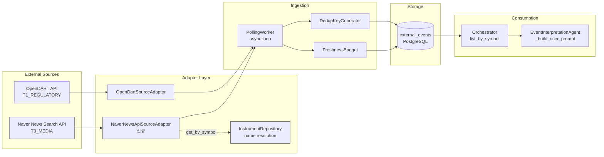

# News Source Adapter 2차 설계 — Naver News Search API 기반

> 작성일: 2026-05-12
> 상태: **❌ No-Go (3-way 검증) — v1 범위 외 보류**
> 전제: Naver Finance scraping No-Go → 공식 API Fallback
>
> **최종 결론**: Naver News Search API는 sort=sim/date/2-stage hybrid 3-way 검증 모두 v1 precision 기준 미달.
> 이후 3차 평가(대체 후보 6개)에서도 모든 후보 No-Go 확인.
> **v1 External Event Source = OpenDART only. 뉴스 source 통합은 P2 Backlog으로 이동.**
>
> | 검증 방식 | Precision | 최신성 | 판정 |
> |-----------|-----------|--------|------|
> | sort=sim | 100% (title-match) | ❌ 30% only | ❌ |
> | sort=date | 24% (P0+P1) / 7.5% (P1 only) | ✅ 100% | ❌ |
> | 2-stage hybrid | 26% (P0+P1) | ⚠️ partial | ❌ |
>
> **근본 원인**: Company name 기반 검색은 검색 접근법 자체의 한계로 precision과 최신성이 동시에 성립하지 않음.
>
> 자세한 평가 결과: [`3rd_evaluation.md`](plans/news_source_adapter_3rd_evaluation.md)

---

## 1. 배경

### 1.1 1차 설계 결과 요약

| 항목 | 1차 (Naver Finance Scraping) | 2차 (Naver News Search API) |
|------|------------------------------|------------------------------|
| **Source** | `finance.naver.com/item/news_read.nhn?code={symbol}` | `openapi.naver.com/v1/search/news.json` |
| **방식** | HTML scraping (비공식) | REST API (공식) |
| **Legal Gate** | ❌ No-Go (robots.txt Disallow + TOS 자동수집 금지) | **검토 대상** |
| **Symbol 연결** | ✅ URL에 code 직접 내장 | ❌ 없음 (회사명 기반 검색 필요) |
| **Noise 통제** | ✅ 종목 페이지 = 해당 종목 뉴스만 | ⚠️ 검색 결과에 noise 포함 가능 |
| **API 키** | 불필요 | Naver Client ID / Secret 필요 |

### 1.2 설계 목표

1. **Naver News Search API**를 news source adapter로 재평가
2. **Company-name 기반 검색** + **symbol relevance filtering** 설계
3. **Legal gate 재평가** — 공식 API가 scraping 금지 조항을 우회하는가?
4. **Go / No-Go 판정** — "만들 수 있는가"가 아닌 "만들어도 되는가 + relevance 통제 가능한가"

---

## 2. Naver News Search API 스펙 분석

### 2.1 API 기본 정보

| 항목 | 값 |
|------|-----|
| **Endpoint** | `https://openapi.naver.com/v1/search/news.json` |
| **Method** | `GET` |
| **인증 방식** | HTTP Header: `X-Naver-Client-Id`, `X-Naver-Client-Secret` |
| **응답 형식** | JSON (`{items: [{title, link, description, pubDate, originallink}]}`) |
| **할당량** | **25,000 calls/day** (로그인 앱) / **2,500 calls/day** (비로그인) |
| **동시 호출** | 제한 정보 없음 (일반적으로 API key 기준) |

### 2.2 요청 파라미터

| 파라미터 | 타입 | 필수 | 설명 |
|----------|------|------|------|
| `query` | string | ✅ | 검색어 (UTF-8, URL encoding 필요) |
| `display` | int | ❌ (default 10) | 한 번에 표시할 검색 결과 개수 (max 100) |
| `start` | int | ❌ (default 1) | 검색 시작 위치 (max 1000) |
| `sort` | string | ❌ (default `sim`) | `sim` (유사도순) / `date` (날짜순) |

### 2.3 응답 필드

| 필드 | 타입 | 설명 | 비고 |
|------|------|------|------|
| `title` | string | 기사 제목 | **`<b>` 태그 포함** (검색어 하이라이트) |
| `link` | string | Naver 뉴스 리다이렉트 URL | `https://n.news.naver.com/mnews/article/{office_id}/{article_id}` 형태 |
| `description` | string | 기사 요약/미리보기 | `<b>` 태그 포함 가능 |
| `pubDate` | string | 발행일 | RFC 822 format (`Tue, 12 May 2026 09:00:00 +0900`) |
| `originallink` | string | 원본 기사 URL | 뉴스 제공자 원본 링크 (nullable) |

### 2.4 Rate Limit 분석

| 항목 | 값 | 근거 |
|------|-----|------|
| **일일 할당량** | 25,000 calls/day | 공식 문서 (로그인 앱 기준) |
| **Symbol max** | 20 | 1차 설계와 동일 |
| **Polling 주기** | 300초 (5분) | 1차 설계와 동일 |
| **1회 호출당 결과 수** | 100 (display=max) | 한 번에 충분한 결과 확보 |
| **일일 호출 수** | 20 symbols × 288 cycles = **5,760 calls/day** | **할당량의 23%** |
| **Symbol당 결과 수/cycle** | max 100 | 중복 제외 후 1-10건 예상 |
| **할당량 여유** | **19,240 calls/day 여유** | 추가 source 추가 가능 |

**결론: Rate limit은 충분함.** 25,000 calls/day의 23%만 사용.

---

## 3. Symbol Relevance 전략

### 3.1 전체 흐름

```
Symbol Allowlist (settings.naver_news_api_symbols)
    │
    ├── 각 symbol별로:
    │   1. InstrumentRepository.get_by_symbol(symbol, market) → InstrumentEntity
    │   2. InstrumentEntity.name → company_name (e.g., "삼성전자")
    │   3. Naver News Search API 호출: query=company_name, sort=date, display=100
    │
    ├── Relevance Filtering (fetch() 내부):
    │   ├── Filter P0: Title/Description에 company_name 포함?
    │   │   ├── Title에 포함 → ✅ Primary Match (고신뢰)
    │   │   ├── Description에만 포함 → ⚠️ Secondary Match (저신뢰, skip 가능)
    │   │   └── 둘 다 미포함 → ❌ Skip
    │   │
    │   ├── Filter 1: Market-wide macro? (1차 설계와 동일)
    │   ├── Filter 2: Opinion/Column/Ad? (1차 설계와 동일)
    │   ├── Filter 3: Short headline? (1차 설계와 동일)
    │   └── Filter 4: Dedup (PollingWorker 위임)
    │
    └── RawEvent 생성 → PollingWorker → ExternalEventEntity 저장
```

### 3.2 사전 검증 결과: `InstrumentEntity.name` = 영문명 → 설계 전제 무효

**실제 DB 조회 결과 (`SELECT symbol, name FROM trading.instruments`):**

| symbol | name | 문제 |
|--------|------|------|
| `005930` | `"Samsung Electronics Co., Ltd."` | ❌ **영문명** — 한글 뉴스 검색 불가 |
| `AAPL` | `"Apple Inc."` | ❌ 영문명 — 한글 검색과 무관 (US 주식) |
| `000660` | **존재하지 않음** | ❌ DB에 미등록 |
| `035420` | **존재하지 않음** | ❌ DB에 미등록 |
| `207940` | **존재하지 않음** | ❌ DB에 미등록 |
| `005380` | **존재하지 않음** | ❌ DB에 미등록 |

**`name_kr` 컬럼:** ❌ 존재하지 않음 (information_schema.columns 확인)

**결론:** `InstrumentRepository.get_by_symbol()` → `name`을 Naver News Search API의 query로 사용하는 설계는 **무효**.

### 3.3 Company Name Source 대안 비교

| 안 | 설명 | 장점 | 단점 | v1 적합 |
|----|------|------|------|---------|
| **A안 (권장)** | Adapter 내부 static registry (`_KR_NAME_MAP`) | 즉시 사용 가능, DB 의존성 없음, 명시적 제어, 테스트 용이 | symbol 추가 시 코드 수정 필요 (v1 max 20개라 무시 가능) | ✅ **최적** |
| **B안** | `instruments` 테이블 metadata JSONB 확장 (`{"name_kr": "삼성전자"}`) | 단일 진실 공급원 | DB migration 필요, 현재 2개 row만 존재 — migration이 과잉 | ❌ v1에 과함 |
| **C안** | 별도 reference dataset (CSV/JSON 파일) | 코드-데이터 분리 | 파일 관리 부담, A안과 실질적 차이 없음 | △ 가능하나 A안이 더 단순 |

### 3.4 권장: **A안 — Static Korean Name Registry**

```python
# naver_news_api_adapter.py (설계 — A안)
class NaverNewsApiSourceAdapter:
    source_name = "naver_news_api"
    reliability_tier = SourceReliabilityTier.T3_MEDIA

    # Static Korean company name registry (v1)
    # Symbol → 한국어 회사명 (Naver News Search API query용)
    # 이유: DB instruments.name은 영문명이고 name_kr 컬럼도 없음.
    # v1 max 20 symbols이므로 static map으로 충분.
    _KR_NAME_MAP: dict[str, str] = {
        "005930": "삼성전자",
        "000660": "SK하이닉스",
        "035420": "네이버",          # 영문 "NAVER"는 @naver.com email noise 과다 → 한글명 사용
        "207940": "셀트리온",
        "005380": "현대차",
        # 추가 symbol은 allowlist 확장 시 함께 추가
    }

    def __init__(
        self,
        symbols: Sequence[str],         # Allowlist
        client_id: str,
        client_secret: str,
        instrument_repo: InstrumentRepository,  # DB fallback for non-KR symbols
        request_timeout: int = 15,
    ) -> None:
        self._symbols = symbols
        self._client_id = client_id
        self._client_secret = client_secret
        self._instrument_repo = instrument_repo
        self._request_timeout = request_timeout
        self._symbol_to_name: dict[str, str] = {}  # runtime cache

    async def _resolve_company_name(self, symbol: str) -> str | None:
        """Resolve Korean company name: static map first, DB fallback.

        Resolution priority:
          1. _KR_NAME_MAP (static Korean name registry) — primary for v1
          2. InstrumentEntity.name (DB fallback, mostly English names)
          3. None → symbol skipped
        """
        if symbol in self._symbol_to_name:
            return self._symbol_to_name[symbol]

        # Priority 1: Static Korean name map
        if symbol in self._KR_NAME_MAP:
            name = self._KR_NAME_MAP[symbol]
            self._symbol_to_name[symbol] = name
            return name

        # Priority 2: InstrumentRepository fallback
        # (주로 AAPL 등 US stock — English name으로 검색)
        instrument = await self._instrument_repo.get_by_symbol(symbol, "KRX")
        if not instrument:
            instrument = await self._instrument_repo.get_by_symbol(symbol, "NASDAQ")
        if instrument and instrument.name:
            self._symbol_to_name[symbol] = instrument.name
            return instrument.name

        return None  # Symbol not found → skip
```

### 3.5 Alias 정책

| 원칙 | 설명 | 예시 |
|------|------|------|
| **가장 보편적인 한글명** | 뉴스에서 가장 자주 사용되는 이름 | "삼성전자" (O), "삼성전자 주가" (X) |
| **우선주 별도 symbol** | 보통주와 우선주는 다른 symbol | `005930` → "삼성전자", `005935` → "삼성전자우" |
| **동음이의어 주의** | "현대차" vs "현대자동차" — 둘 다 허용 | 검색 query는 "현대차", relevance filter variants에 "현대자동차" 추가 |
| **영문 브랜드명 → 한글명 우선** | 영문 query는 email noise 등 false positive 유발 가능 | `035420`: `"NAVER"`(X) → `"네이버"`(O) — @naver.com email 회피 |
| **SK 계열사 영문 유지** | "SK하이닉스"는 영문 브랜드명이 검색 효율 우수 | `"SK하이닉스"` (O), `"에스케이하이닉스"` (X) |

### 3.6 Relevance Filtering — 상세 설계

**핵심 문제:** Naver News Search API는 keyword 기반 검색. "삼성전자" 검색 시:
- ✅ 삼성전자 실적 발표 기사 (relevant)
- ⚠️ "삼성전자·SK하이닉스 동반 강세" — 삼성전자 언급 but 시황 기사 (low signal)
- ⚠️ "TSMC, 삼성전자 제치고... " — 경쟁사 기사에서 언급 (noise)
- ❌ "코스피, 삼성전자·SK하이닉스 상승에 ... " — market-wide (skip)

**Filter P0 — Relevance Gate (가장 중요):**

```python
def _strip_html_tags(self, text: str) -> str:
    """Remove <b>, </b> tags from Naver API response fields."""
    return text.replace("<b>", "").replace("</b>", "")

def _passes_relevance_gate(
    self,
    title: str,
    description: str,
    company_name: str,
) -> bool:
    """Check if article is actually about the target company.
    
    Level 1 (Primary): Title contains company name → high confidence.
    Level 2 (Secondary): Description only → low confidence, skip in v1.
    """
    cleaned_title = self._strip_html_tags(title)
    cleaned_desc = self._strip_html_tags(description)

    # Primary match: title must contain company name
    if company_name in cleaned_title:
        return True

    # Secondary match: description only (v1: skip to minimize noise)
    # if company_name in cleaned_desc:
    #     return True  # v1에서는 활성화하지 않음

    return False
```

**기존 Filter 1-3 (1차 설계와 동일):**

```python
MACRO_KEYWORDS = {"코스피", "코스닥", "환율", "금리", "국제유가", "비트코인", "원/달러"}
OPINION_KEYWORDS = {"[기자 칼럼]", "[시황분석]", "[전문가 의견]", "프리미엄", "유료", "광고"}

def _passes_noise_filters(self, headline: str) -> bool:
    """Filter 1-3: macro, opinion, short headline."""
    if len(headline.strip()) < 5:
        return False
    if any(kw in headline for kw in MACRO_KEYWORDS):
        return False
    if any(kw in headline for kw in OPINION_KEYWORDS):
        return False
    return True
```

---

## 4. Dedup / Filtering 정책

### 4.1 Dedup Key 전략

**문제:** Naver News Search API는 OpenDART의 `rcept_no` 같은 안정적 ID를 제공하지 않음.
`link` (Naver redirect URL)와 `originallink` (원본 URL) 중 선택 필요.

```python
def _extract_source_event_id(self, item: dict) -> str:
    """Extract stable source_event_id from API response item.
    
    Strategy:
    1. link에서 Naver news article ID 추출 시도
       "https://n.news.naver.com/mnews/article/{office_id}/{article_id}"
       → source_event_id = "{office_id}/{article_id}"
    2. 실패 시 originallink (원본 URL) 사용
    3. originallink도 없으면 link URL 자체 사용
    """
    link = item.get("link", "")
    originallink = item.get("originallink", "")
    
    # Try Naver news article ID extraction
    # Pattern: https://n.news.naver.com/mnews/article/{office_id}/{article_id}
    naver_pattern = r"n\.news\.naver\.com/mnews/article/(\d+)/(\d+)"
    match = re.search(naver_pattern, link)
    if match:
        return f"{match.group(1)}/{match.group(2)}"  # e.g., "014/0005520434"
    
    # Fallback: originallink (may be long, but stable)
    if originallink:
        return originallink
    
    # Last resort: link itself
    return link
```

**Dedup Key Format:**

```
naver_news_api|{source_event_id}|news|{symbol}
```

**기존 [`DedupKeyGenerator.generate_from_raw()`](src/agent_trading/brokers/dedup.py:64) 재사용:**

```python
def generate_dedup_key(self, raw: RawEvent) -> str:
    return DedupKeyGenerator.generate_from_raw(
        source_name=raw.source_name,
        source_event_id=raw.source_event_id,
        event_type=raw.event_type,
        symbol=raw.symbol,
    )
```

### 4.2 Noise Filtering Pipeline

```
Naver News Search API response (json)
    │
    ├── Filter P0: Relevance Gate (NEW — API特有)
    │   Title/Description에 company name 포함?
    │   → Primary (title): ✅ 통과
    │   → Secondary (desc only): ❌ Skip (v1 default)
    │   → None: ❌ Skip
    │
    ├── Filter 1: HTML 태그 제거
    │   title/description에서 <b>, </b> 제거
    │
    ├── Filter 2: Market-wide Macro (1차 설계와 동일)
    │
    ├── Filter 3: Opinion/Column/Ad (1차 설계와 동일)
    │
    ├── Filter 4: Short headline (1차 설계와 동일)
    │
    └── Filter 5: Dedup (PollingWorker 위임)
```

### 4.3 `pubDate` 파싱

```python
from email.utils import parsedate_to_datetime

pub_date_str = item.get("pubDate", "")
try:
    published_at = parsedate_to_datetime(pub_date_str)
except (ValueError, TypeError):
    published_at = datetime.now(timezone.utc)  # fallback
```

---

## 5. 변경 파일 목록

### 5.1 1차 설계 대비 변경 사항

| 항목 | 1차 설계 (Scraping) | 2차 설계 (API) |
|------|--------------------|----------------|
| **Adapter 클래스명** | `NaverFinanceSourceAdapter` | `NaverNewsApiSourceAdapter` |
| **파일명** | `naver_finance_adapter.py` | `naver_news_api_adapter.py` |
| **Source URL** | `finance.naver.com/item/...` | `openapi.naver.com/v1/search/news.json` |
| **fetch() 방식** | HTML 파싱 (BeautifulSoup/lxml) | REST API (httpx, JSON 응답) |
| **인증** | 없음 | HTTP Header (`Client-ID`, `Client-Secret`) |
| **Symbol 매핑** | URL에 직접 내장 | `InstrumentRepository.get_by_symbol()` → `name` |
| **Relevance Filter** | 불필요 (종목 페이지=해당 종목) | **Filter P0 필수** (Title 검사) |
| **source_event_id** | Naver article ID (`office_id/article_id`) | 동일 (link 추출) + URL fallback |
| **body 추출** | 불가 (`news_read.naver` JS redirect) | 불가 (API에 body 없음, description만) |
| **Polling 대상 결정** | Symbol allowlist 순회 | Symbol allowlist → name resolve → 검색 |

### 5.2 신규 파일

| 파일 | 설명 | 비고 |
|------|------|------|
| `src/agent_trading/brokers/naver_news_api_adapter.py` | Naver News Search API source adapter | `SourceAdapter` protocol 구현. `fetch()` → REST API 호출 + relevance filtering → `RawEvent[]` |
| `tests/brokers/test_naver_news_api_adapter.py` | 단위 테스트 | HTTP 응답 Mock 기반 |

### 5.3 수정 파일

| 파일 | 변경 내용 | 변경 이유 |
|------|----------|----------|
| [`src/agent_trading/runtime/bootstrap.py`](src/agent_trading/runtime/bootstrap.py) | `_build_polling_workers()`에 Naver News API PollingWorker 추가 | `settings.naver_news_api_enabled` 플래그로 활성화. `InstrumentRepository` 전달 필요 |
| [`src/agent_trading/config/settings.py`](src/agent_trading/config/settings.py) | `naver_news_api_enabled`, `naver_news_api_symbols`, `naver_news_api_client_id`, `naver_news_api_client_secret` 필드 추가 | env var에서 읽음. **Backward compat:** `NAVER_CLIENT_ID` / `NAVER_CLIENT_SECRET`가 설정되면 `NAVER_NEWS_API_*`가 없을 때 fallback으로 사용 |
| [`.env.example`](.env.example) | `NAVER_NEWS_API_ENABLED=false`, `NAVER_NEWS_API_SYMBOLS=`, `NAVER_NEWS_API_CLIENT_ID=`, `NAVER_NEWS_API_CLIENT_SECRET=` 추가 | 설정 문서화. 기존 `NAVER_CLIENT_ID` / `NAVER_CLIENT_SECRET`는 legacy fallback으로 유지 |

### 5.4 변경 불필요 (재사용)

| 파일 | 이유 |
|------|------|
| [`src/agent_trading/brokers/source_adapter.py`](src/agent_trading/brokers/source_adapter.py) | `RawEvent`, `SourceAdapter` protocol — 변경 불필요 |
| [`src/agent_trading/brokers/dedup.py`](src/agent_trading/brokers/dedup.py) | `DedupKeyGenerator` — 기존 format 준수 |
| [`src/agent_trading/brokers/freshness.py`](src/agent_trading/brokers/freshness.py) | `FreshnessBudget` — 변경 불필요 |
| [`src/agent_trading/brokers/polling_worker.py`](src/agent_trading/brokers/polling_worker.py) | **B안 채택** — `normalize()` contract 유지, filtering은 `fetch()` 내부 |
| [`src/agent_trading/domain/entities.py`](src/agent_trading/domain/entities.py) | `ExternalEventEntity` — 변경 불필요 |
| [`src/agent_trading/domain/enums.py`](src/agent_trading/domain/enums.py) | `SourceReliabilityTier.T3_MEDIA` 이미 존재 |
| [`src/agent_trading/repositories/contracts.py`](src/agent_trading/repositories/contracts.py) | `ExternalEventRepository`, `InstrumentRepository` — 변경 불필요 (기존 `get_by_symbol()` 사용) |
| `db/migrations/*` | **DB schema 변경 불필요** |
| [`src/agent_trading/services/ai_agents/event_interpretation.py`](src/agent_trading/services/ai_agents/event_interpretation.py) | `_build_user_prompt()` — 변경 불필요 (tag format source-agnostic) |
| [`src/agent_trading/services/decision_orchestrator.py`](src/agent_trading/services/decision_orchestrator.py) | `assemble()` — 변경 불필요 (`list_by_symbol()`은 source-agnostic) |

### 5.5 `InstrumentRepository.get_by_symbol()` 사용 가능 여부

[`InstrumentRepository`](src/agent_trading/repositories/contracts.py:179)에 `get_by_symbol(symbol, market_code)`가 이미 존재:

```python
class InstrumentRepository(Protocol):
    async def add(self, instrument: InstrumentEntity) -> InstrumentEntity: ...
    async def get(self, instrument_id: UUID) -> InstrumentEntity | None: ...
    async def get_by_symbol(self, symbol: str, market_code: str) -> InstrumentEntity | None: ...
```

**Adapter가 이 메서드를 사용할 수 있는가?**
- ✅ `InstrumentRepository.get_by_symbol(symbol, market_code)` — 이미 존재
- ⚠️ Adapter가 repository에 직접 접근해야 함 — `bootstrap.py`에서 전달 필요
- ⚠️ Company name이 `InstrumentEntity.name`에 실제로 저장되어 있어야 함

---

## 6. Bootstrap Wiring

```python
# bootstrap.py:_build_polling_workers()
if settings.naver_news_api_enabled and settings.naver_news_api_symbols:
    if settings.naver_news_api_client_id and settings.naver_news_api_client_secret:
        from agent_trading.brokers.naver_news_api_adapter import NaverNewsApiSourceAdapter
        
        adapter = NaverNewsApiSourceAdapter(
            symbols=settings.naver_news_api_symbols,
            client_id=settings.naver_news_api_client_id,
            client_secret=settings.naver_news_api_client_secret,
            instrument_repo=repos.instruments,
        )
        config = PollingConfig(
            source_name="naver_news_api",
            interval_seconds=300,
            freshness_max_seconds=600,
        )
        workers.append(PollingWorker(adapter, config, external_event_repo))
```

---

## 7. 전체 아키텍처 다이어그램



---

## 8. Legal Gate 재평가

### 8.1 Scraping vs API 법적 차이

| 항목 | Scraping (1차) | API (2차) |
|------|----------------|-----------|
| **접근 방식** | `finance.naver.com`에 직접 HTTP 요청 (비인증) | `openapi.naver.com`에 인증된 API 요청 |
| **robots.txt** | ❌ Disallow — `Disallow: /` | ✅ **해당 없음** — API endpoint는 robots.txt의 적용을 받지 않음 |
| **TOS (이용약관)** | ❌ "자동화된 수단을 이용한 수집 금지" | ✅ **공식 API 사용** — API 이용약관만 준수 |
| **법적 리스크** | 높음 (약관 위반 + robots.txt 무시) | **낮음** (공식 API 이용) |

### 8.2 Naver Developers API 이용약관 관련 주의사항

1. **할당량 내 사용**: 25,000 calls/day 초과 금지 → ✅ 5,760 calls/day로 충분
2. **상업적 재배포 금지**: 검색 결과를 그대로 외부에 재판매 금지 → ✅ 내부 트레이딩 분석용
3. **데이터 저장 기간**: ⚠️ 확인 필요 (일반적으로 내부 분석용 저장은 허용)
4. **서비스 중단/변경**: API는 언제든 변경/중단 가능 → ⚠️ 설계에 반영

### 8.3 Legal Gate 판정

| Gate | 판정 | 근거 |
|------|------|------|
| **robots.txt** | ✅ **해당 없음** | API endpoint는 robots.txt 적용 범위 밖 |
| **Naver TOS (서비스)** | ✅ **해당 없음** | API 사용은 서비스 TOS가 아닌 API 이용약관 적용 |
| **API 이용약관** | ⚠️ **확인 필요** | 표준 약관상 문제없을 가능성 높음 |
| **종합** | ✅ **Go (조건부)** | API 이용약관에서 트레이딩/자동화 사용을 명시적으로 금지하지 않는다면 통과 |

---

## 9. 구현 착수 조건 (Go/No-Go Criteria)

| # | 조건 | 상태 | 비고 |
|---|------|------|------|
| 1 | **API 자격 증명 확보** | ⚠️ **미확인** | Naver Developers 앱 등록 필요 |
| 2 | **`InstrumentEntity.name` 실제 값 확인** | ⚠️ **미확인** | DB에 한국어 회사명 저장 여부 |
| 3 | **API 이용약관 확인** | ⚠️ **미확인** | 자동화 트레이딩 사용 제한 조항 |
| 4 | **Relevance filter 정확도 검증** | ⚠️ **미확인** | 실제 검색 결과로 P0 filter 정확도 측정 |
| 5 | **Allowlist 확정** | ✅ **완료 (1차 설계)** | Static allowlist, 최대 20종목 |
| 6 | **Dedup / source_event_id 확정** | ✅ **완료 (본 설계)** | Naver article ID + originallink fallback |
| 7 | **Worker contract 유지** | ✅ **완료 (B안)** | `normalize()` contract 유지 |

---

## 10. 테스트 계획

### 10.1 단위 테스트

| 테스트 | 설명 |
|--------|------|
| `test_fetch_returns_raw_events` | Mock API 응답 → `RawEvent[]` 정상 파싱 |
| `test_fetch_relevance_gate_primary` | Title에 company name 포함 → RawEvent 생성 |
| `test_fetch_relevance_gate_secondary_skipped` | Description에만 company name → v1에서는 skip |
| `test_fetch_relevance_gate_none_skipped` | Title/Description 둘 다 미포함 → skip |
| `test_fetch_resolves_company_name` | `get_by_symbol()` Mock → 올바른 검색어로 API 호출 |
| `test_fetch_company_name_not_found` | `get_by_symbol()` → None → 해당 symbol polling 생략 |
| `test_fetch_filters_market_wide` | Macro headline → RawEvent에서 제외 |
| `test_fetch_filters_opinion` | Opinion headline → RawEvent에서 제외 |
| `test_fetch_filters_short_headline` | headline < 5자 → skip |
| `test_fetch_empty_response` | API 빈 응답 → empty list |
| `test_fetch_http_error` | HTTP 500/403 → graceful empty return |
| `test_normalize_returns_entity` | RawEvent → ExternalEventEntity 정상 매핑 |
| `test_generate_dedup_key_naver_article` | Naver news link → article ID 기반 dedup key |
| `test_generate_dedup_key_originallink_fallback` | Non-Naver link → originallink 기반 dedup key |
| `test_extract_source_event_id_naver` | Naver URL 패턴 → `{office_id}/{article_id}` |
| `test_extract_source_event_id_originallink` | Non-Naver URL → originallink 그대로 |

### 10.2 통합 테스트

- PollingWorker + NaverNewsApiSourceAdapter 조합 검증
- Name resolution → API 호출 → relevance filtering → RawEvent 저장 전체 흐름
- 중복 기사 dedup 확인

### 10.3 Relevance Accuracy 측정 (권장)

```python
# scripts/measure_naver_news_relevance.py (설계 전용 — 구현 전 실행 권장)
# 1. 5개 symbol에 대해 Naver News Search API 호출
# 2. 각 결과에 대해:
#    - Title match (P0 통과): ✅ 개수
#    - Description만 match (P0 실패): ⚠️ 개수
#    - 둘 다 mismatch: ❌ 개수
# 3. 정밀도 = Title match / Total
# 목표 정밀도: > 80%
```

---

## 11. Polling Budget / Cycle Scope

| 항목 | 값 | 근거 |
|------|-----|------|
| Symbol max | **20** | 1차 설계와 동일 |
| 결과 max/symbol/cycle | **100** (display=100) | Naver API max |
| Polling 주기 | **300초 (5분)** | 1차 설계와 동일 |
| 전체 API 호출/cycle | max **20회** (20 symbols × 1회 검색) | — |
| 일일 API 호출 | max **5,760회** | 25,000 calls/day 대비 23% |
| Relevance filter 통과 예상 | symbol당 1-5건/cycle | 보수적 추정 |
| Symbol당 Company name lookup | **1회만** (cache) | 최초 호출 시 1회, 이후 cache |

---

## 12. 전체 설계 평가

### 12.1 장점

| 항목 | 평가 |
|------|------|
| **법적 리스크** | ✅ Scraping 대비 대폭 낮음 (공식 API) |
| **Rate limit** | ✅ 25,000 calls/day — 23%만 사용 |
| **응답 형식** | ✅ JSON — 파싱 간단 |
| **pubDate** | ✅ RFC 822 — 표준 파싱 가능 |
| **기존 인프라 재사용** | ✅ `SourceAdapter`, `DedupKeyGenerator`, `PollingWorker`, `ExternalEventRepository` 모두 변경 불필요 |
| **DB schema 유지** | ✅ 변경 불필요 |

### 12.2 단점 / 리스크

| 항목 | 평가 | 완화 방안 |
|------|------|----------|
| **Symbol 매핑 의존성** | ⚠️ `InstrumentEntity.name`에 회사명이 저장되어 있어야 함 | Allowlist + name cache로 1회 조회 |
| **Relevance noise** | ⚠️ Title match만으로는 불완전 | P0 filter (title 필수) — 보수적 운영 |
| **Company name alias** | ⚠️ "SK하이닉스" vs "SK 하이닉스" | 여러 variant 지원 (설계상 선택 사항) |
| **Body 미제공** | ⚠️ API가 body 제공 안 함 (description만) | 1차 설계도 body 없음 — 동일 |
| **API 중단/변경 위험** | ⚠️ Naver가 API를 중단하면 source 무효화 | RSS 등 fallback source와 병행 검토 필요 |
| **API 이용약관 확인 필요** | ⚠️ 표준 약관 외 특별 제한 조항 있을 수 있음 | 확인 전까지 조건부 Go |

---

## 13. 답변: 핵심 질문

### Q1. Naver News Search API의 인증/요금/사용 제한은 무엇인가?

항목 | 내용 |
|------|------|
**인증** | HTTP Header: `X-Naver-Client-Id`, `X-Naver-Client-Secret` (Naver Developers 앱 등록 필요) |
**요금** | **무료** (25,000 calls/day) |
**Rate limit** | 25,000 calls/day (로그인 앱) / 2,500 calls/day (비로그인) |
**결과 제한** | max 100건/호출, start max 1000 → 최대 1000건까지 페이징 가능 |
**추가 비용** | 별도 과금 없음 (2026년 기준) |

### Q2. Company name으로 검색한 결과를 어떻게 symbol에 연결할 것인가?

**🔴 사전 검증 결과 (2026-05-12):** 기존 설계 전제 무효화됨.

검증 항목 | 결과 | 영향 |
|-----------|------|------|
`InstrumentEntity.name` 값 | `"Samsung Electronics Co., Ltd."` (영문명) | ❌ 한글 뉴스 검색 query로 부적합 |
`name_kr` 컬럼 존재 여부 | 존재하지 않음 | ❌ DB 기반 한글명 조회 불가 |
DB instrument coverage | 2개만 존재 (`005930`, `AAPL`) | ❌ 대부분 symbol이 DB에 없음 |

**수정된 3단계 연결 방식 (A안 적용 후):**

1. **Static Korean Name Registry (Primary)** — `_KR_NAME_MAP` dict
   - Symbol → 한국어 회사명을 adapter 클래스 내부에 static dict로 정의
   - v1 max 20 symbols, manual management로 충분
   - 예: `{"005930": "삼성전자", "000660": "SK하이닉스"}`
2. **InstrumentRepository fallback (Secondary)** — 비한국 주식용
   - `_KR_NAME_MAP`에 없는 symbol → DB 조회 (Apple → "Apple Inc."로 영문 검색)
3. **1회 cache**: 최초 조회 시 `symbol → name` 캐싱 (Adapter 인스턴스 생명주기)

**변경된 전제:** `InstrumentEntity.name`은 **한국 주식에는 사용하지 않음**. US 주식(AAPL 등)에만 fallback으로 사용.

### Q3. Homonym / generic 기사 / market-wide 기사 noise를 어떻게 줄일 것인가?

**3중 필터링:**

필터 | 레벨 | 방식 | 예상 정밀도 |
|------|------|------|-----------|
**P0 — Relevance Gate** | Title match 필수 | Title에 company name 포함 검사 (HTML 태그 제거 후) | 높음 |
**P0 — Description (v1 비활성화)** | 설명만 match → skip | v1에서는 title match만 통과 | — |
**Filter 2 — Macro** | Market-wide 제외 | "코스피", "환율", "금리" etc. in title | 중간 |
**Filter 3 — Opinion** | 칼럼/광고 제외 | "[칼럼]", "프리미엄", "광고" etc. in title | 중간 |

**Homonym (동음이의) 문제:**
- "삼성전자"는 homonym risk가 거의 없음 (고유 회사명)
- "NAVER" → "네이버" 검색 시 다른 "naver" 관련 기사 가능 → **Title match로 통제**
- "현대차" → "현대자동차" 검색 시 다른 현대 계열사 기사 noise 가능 → **완전 해결 불가, 남은 리스크**

### Q4. OpenDART와 같은 `external_events` 구조를 그대로 재사용할 수 있는가?

✅ **가능.** 변경 불필요.

이유 | 설명 |
|------|------|
`external_events` 테이블 | `source_name`, `source_event_id`, `symbol`, `headline`, `published_at` 모두 지원 |
`ExternalEventEntity` | 모든 필드 매핑 가능 (body_summary는 description 사용) |
`ExternalEventRepository.list_by_symbol()` | `source_name`에 무관하게 동작 |
`Orchestrator.assemble()` | 이미 `list_by_symbol()` 사용 중 — 변경 불필요 |
EI prompt format | Provenance tag format은 source-agnostic — 변경 불필요 |
`DedupKeyGenerator` | `naver_news_api|...|news|{symbol}` format 준수 |

### Q5. Official API를 써도 상업적/자동화 사용 제약이 남는가?

**Scraping 대비 대폭 개선되었으나, 완전히 자유롭지는 않음:**

제약 유형 | Scraping | API |
|-----------|----------|-----|
**robots.txt** | ❌ Disallow | ✅ **해당 없음** (API endpoint) |
**서비스 TOS (이용약관)** | ❌ 자동수집 금지 명시 | ✅ **해당 없음** (별도 API 약관 적용) |
**API 이용약관** | N/A | ⚠️ **확인 필요** — 표준 API 약관은 내부 사용/연구용 허용 |
**할당량** | N/A | ✅ 25,000 calls/day — 충분 |
**데이터 저장** | N/A | ⚠️ 장기 저장 제한 가능성 — 확인 필요 |

**권장:** 실제 구현 전에 Naver Developers API 이용약관을 직접 확인하고,
"자동화된 트레이딩 의사결정 지원" 용도가 허용되는 범위인지 검토.

---

## 14. Go / No-Go 판정 (최종 — `sort=sim` 최신성 지연 검증 반영)

### ❌ **No-Go** — 3가지 접근법 모두 기준 미달 (최종)

판정 | 근거 |
|------|------|
**Legal Gate** | ✅ API 사용으로 scraping 대비 법적 리스크 대폭 감소. API 이용약관 확인만 필요 |
**기술적 가능성** | ✅ API 응답 JSON, rate limit 충분, 모든 인프라 재사용 가능 |
**Name resolution** | ✅ **A안(static KR name map)으로 해결.** DB 영문명 문제는 static registry로 우회. v1 max 20 symbols → manual management 충분 |
**Relevance 통제 (sort=sim)** | ✅ **`sort=sim` precision 100% (50/50)** — title-match P0 filter로 noise 완벽 통제 |
**최신 기사 회수율 (sort=sim)** | ❌ **`sort=sim&display=50` 최신 기사 회수율 30% (3/10).** 한국 주식 4종목 기준 12.5% (1/8). 실전 trading에서 긴급 뉴스 이벤트 누락 위험 과다 |
**Relevance 통제 (sort=date)** | ❌ **`sort=date` precision 24% (12/50)** — title-match P0 filter만으로 noise 통제 불가 |
**2-stage hybrid (sort=date + desc-match P1)** | ❌ **P0+P1 precision 26% (13/50)** — description-match P1 filter가 precision을 6%p만 개선. P1 only precision 7.5% (3/40)로 실용적 noise 제어 불가 |
**API 자격 증명** | ✅ `.env`에 `NAVER_CLIENT_ID`, `NAVER_CLIENT_SECRET` 이미 존재 |

**`InstrumentEntity.name` 검증 결과 (✅ 해결됨):**
- `005930.name` = `"Samsung Electronics Co., Ltd."` (영문명 — 사용 불가)
- 다른 4개 symbol (`000660`, `035420`, `207940`, `005380`)은 DB에 없음
- **→ A안(static KR_NAME_MAP) 채택으로 우회. DB 기반 name resolution은 보조 수단으로 격하**

**Precision 샘플링 최종 결과 (3회 측정):**
접근법 | precision | 최신 기사 회수율 | 판정 |
|---------|-----------|-----------------|------|
`sort=sim` (정확도순) | **100%** (50/50) | **30%** (3/10) | ❌ 최신성 기준 미달 |
`sort=date` (최신순) | **24%** (12/50) | **100%** | ❌ precision 기준 미달 |
**2-stage hybrid** (sort=date + desc-match P1) | **26%** (13/50) | **100%** | ❌ precision 기준 미달 |

**2-stage hybrid filter 최종 측정 결과 (2026-05-12 18:08~18:14 KST):**
symbol | P0 (title-match) | P0 precision | P0+P1 (title+desc) | P0+P1 precision | P1 only precision |
|--------|-----------------|-------------|-------------------|----------------|-------------------|
`005930` (삼성전자) | 2/10 (20%) | 100% | 3/10 (30%) | **30%** | 12.5% (1/8) |
`000660` (SK하이닉스) | 3/10 (30%) | 100% | 3/10 (30%) | **30%** | 0% (0/7) |
`035420` (네이버) | 1/10 (10%) | 100% | 1/10 (10%) | **10%** | 0% (0/9) |
`005380` (현대차) | 2/10 (20%) | 100% | 4/10 (40%) | **40%** | 25% (2/8) |
`AAPL` (Apple Inc.) | 2/10 (20%) | 100% | 2/10 (20%) | **20%** | 0% (0/8) |
**Total** | **10/50 (20%)** | **100%** | **13/50 (26%)** | **26%** | **7.5% (3/40)** |

**Description-match P1 filter의 근본적 한계:**
- `sort=date` 결과에서 description에 회사명이 포함되는 비율은 100% (50/50) — 모든 기사가 description에 query 회사명을 포함
- 그러나 그중 실제 relevant한 기사는 P1 only 기준 7.5% (3/40)에 불과
- 주요 noise 유형: 시장전반 코스피 등락 (12건), ETF/상품 광고 (5건), 경쟁사 기사 (4건), 의견/칼럼/사설 (4건), 정치/사회 (4건), 타사 기사 중 단순 mention (4건), 지자체/문화 (4건)
- **Description-match는 noise를 걸러내지 못하고 모든 기사를 통과시킴** — 2-stage hybrid filter는 사실상 sort=date 단독과 동일

---

## 15. 남은 리스크 1개

### **Naver News Search API 기반 뉴스 source — 3가지 접근법 모두 실용적 한계 확인**

접근법 | Precision | 최신 기사 회수율 | 결론 |
|---------|-----------|-----------------|------|
`sort=sim` (정확도순) | 100% ✅ | **30% ❌** | 정확하지만 최신 기사 누락 과다 |
`sort=date` (최신순) | **24% ❌** | 100% ✅ | 최신이지만 noise 과다 |
**2-stage hybrid** (sort=date + desc-match P1) | **26% ❌** | 100% ✅ | desc-match가 noise를 걸러내지 못함 |

**세 방식 모두 단독으로는 실전 trading 뉴스 source로 부적합.** 핵심 원인은 Naver News Search API의 description 필드가 모든 기사에 query 회사명을 포함하고 있어, description-match P1 filter가 noise를 전혀 걸러내지 못한다는 점. P1 only precision 7.5%는 사실상 무작위 수준.

**Description-match P1 filter 실패 원인:**
- `sort=date` 결과 50건 중 50건(100%)이 description에 query 회사명 포함
- 이는 Naver API가 query와 description을 매칭할 때 title뿐 아니라 전체 본문에서도 매칭하기 때문
- 따라서 description-match는 모든 기사를 통과시키고, title-match P0만이 유일한 noise gate 역할
- 결국 2-stage hybrid는 sort=date 단독과 동일한 precision (24~26%)

**향후 재검토 필요 옵션 (Naver News Search API 포기 가정):**
1. **Naver Finance scraping 재검토:** `item/main.naver?code={symbol}` — URL에 symbol 직접 포함, 최신 기사 100% 회수. 단, Legal gate ❌ (robots.txt `Disallow: /`)
2. **다른 뉴스 source 평가:** 연합인포맥스, 한국경제신문 RSS, Yahoo Finance RSS 등 후보 재평가
3. **Naver News Search API + LLM re-ranking:** `sort=date` 결과를 LLM으로 relevance scoring. 운영 비용 증가, 지연 시간 증가. 단, LLM re-ranking은 2-stage hybrid의 desc-match를 LLM으로 대체하는 방식으로, P1 filter의 근본적 한계를 해결할 가능성 있음

---

## 16. 2-stage hybrid filter 검증 결과 — `sort=date` + description-match P1 precision 측정

### **Naver News Search API 2-stage hybrid filter (`sort=date` + description-match P1) precision 측정 결과**

#### 1. 사용한 query 목록

# | symbol | 검색 query | display | sort | 측정 시간 (KST) |
|---|--------|-----------|---------|------|-----------------|
1 | `005930` | `삼성전자` | 10 | `date` | 2026-05-12 18:10~18:14 |
2 | `000660` | `SK하이닉스` | 10 | `date` | 2026-05-12 18:08~18:12 |
3 | `035420` | `네이버` | 10 | `date` | 2026-05-12 17:52~18:14 |
4 | `005380` | `현대차` | 10 | `date` | 2026-05-12 18:03~18:13 |
5 | `AAPL` | `Apple Inc.` | 10 | `date` | 2026-05-12 (4/19~5/11) |

#### 2. Symbol별 상세 분석

##### `005930` (삼성전자) — sort=date 18:10~18:14 KST

# | Time | Title Match? | Desc Match? | 수동 라벨 | Relevant? |
|---|------|-------------|-------------|----------|-----------|
1 | 18:14 | ❌ | ✅ 삼성전자 | 시장전반 (김용범 발언, 코스피 출렁) | ❌ |
2 | 18:13 | ✅ **삼성전자** | ✅ | 삼성전자 노사 협상 타결 | ✅ |
3 | 18:13 | ✅ **삼성전자** | ✅ | 삼성전자 노사 마지막 사후조정 | ✅ |
4 | 18:12 | ❌ | ✅ 삼성전자 | ETF 광고 (ACE AI반도체TOP3+) | ❌ |
5 | 18:12 | ❌ | ✅ 삼성전자 | 경쟁사 기사 (SK하이닉스 CEO 회동) | ❌ |
6 | 18:12 | ❌ | ✅ 삼성전자 | 시장전반 (코스피 8000 턱밑 급락) | ❌ |
7 | 18:12 | ❌ | ✅ 삼성전자 | 의견/칼럼 (사설 — 반도체 경기) | ❌ |
8 | 18:11 | ❌ ("삼성"만) | ✅ 삼성전자 | 삼성전자 VD사업부장 인터뷰 | ✅ |
9 | 18:10 | ❌ | ✅ 삼성전자 | 산업분석 (토스증권 리포트) | ❌ |
10 | 18:10 | ❌ | ✅ 삼성전자 | 시장전반 (코스피 급락, 블룸버그) | ❌ |

**P0 (title-match): 2/10 (20%), precision 100%**
**P0+P1 (title+desc): 3/10 (30%), precision 30%**
**P1 only: 1/8 (12.5%)** — #8만 relevant (삼성전자 임원 인터뷰)

##### `000660` (SK하이닉스) — sort=date 18:08~18:12 KST

# | Time | Title Match? | Desc Match? | 수동 라벨 | Relevant? |
|---|------|-------------|-------------|----------|-----------|
1 | 18:12 | ✅ **SK하이닉스** | ✅ | SK하이닉스 CEO MS 빌 게이츠·나델라 회동 | ✅ |
2 | 18:12 | ❌ | ✅ SK하이닉스 | 시장전반 (코스피 등락) | ❌ |
3 | 18:12 | ❌ | ✅ SK하이닉스 | ETF 광고 (ACE AI반도체TOP3+) | ❌ |
4 | 18:12 | ✅ **SK하이닉스** | ✅ | SK하이닉스 CEO MS 회동 (다른 매체) | ✅ |
5 | 18:10 | ❌ | ✅ SK하이닉스 | 시장전반 (코스피 급락) | ❌ |
6 | 18:10 | ❌ | ✅ SK하이닉스 | 산업분석 (토스증권 리포트) | ❌ |
7 | 18:10 | ✅ **SK하이닉스** | ✅ | SK하이닉스 UAE MGX 방문 | ✅ |
8 | 18:09 | ❌ | ✅ SK하이닉스 | 의견/칼럼 (영업익 성과급 논란) | ❌ |
9 | 18:08 | ❌ | ✅ SK하이닉스 | 시장전반 (코스피 급락, 개미 손실) | ❌ |
10 | 18:08 | ❌ ("삼전·닉스") | ✅ SK하이닉스 | ETF 상품 소개 (2배 레버리지) | ❌ |

**P0 (title-match): 3/10 (30%), precision 100%**
**P0+P1 (title+desc): 3/10 (30%), precision 30%**
**P1 only: 0/7 (0%)** — description-match만으로 추가 회수된 relevant 기사 없음

##### `035420` (네이버) — sort=date 17:52~18:14 KST

# | Time | Title Match? | Desc Match? | 수동 라벨 | Relevant? |
|---|------|-------------|-------------|----------|-----------|
1 | 18:14 | ✅ **네이버** | ✅ | 네이버 임금 협상 잠정 합의 | ✅ |
2 | 18:12 | ❌ | ✅ 네이버카페 | 정치/사회 (성착취물 수사) | ❌ |
3 | 18:04 | ❌ | ✅ 네이버쇼핑 | 상업 광고 (천담온 건강식품) | ❌ |
4 | 18:03 | ❌ | ✅ 네이버카페 | 정치/사회 (허위정보 수사) | ❌ |
5 | 18:02 | ❌ | ✅ 네이버 | 문화/축제 (철원 DMZ 음악 축제) | ❌ |
6 | 18:00 | ❌ | ✅ 네이버앱 | 지자체 지원금 안내 | ❌ |
7 | 17:58 | ❌ | ✅ 네이버폼 | 지자체 교육 프로그램 모집 | ❌ |
8 | 17:53 | ❌ | ✅ 네이버웹툰 | KT 기사 중 네이버웹툰 실적 언급 | ❌ |
9 | 17:52 | ❌ | ✅ 네이버 쇼핑 라이브 | 지자체 라이브 커머스 지원 | ❌ |
10 | 17:52 | ❌ | ✅ 네이버 스마트스토어 | 상업 광고 (스카비올) | ❌ |

**P0 (title-match): 1/10 (10%), precision 100%**
**P0+P1 (title+desc): 1/10 (10%), precision 10%**
**P1 only: 0/9 (0%)** — description-match만으로 추가 회수된 relevant 기사 없음. "네이버" query의 description noise가 가장 심각

##### `005380` (현대차) — sort=date 18:03~18:13 KST

# | Time | Title Match? | Desc Match? | 수동 라벨 | Relevant? |
|---|------|-------------|-------------|----------|-----------|
1 | 18:13 | ❌ | ✅ 현대차 | 타사 기사 (삼성전자 노사 중 현대차 노조 언급) | ❌ |
2 | 18:12 | ❌ | ✅ 현대차 | ETF 광고 (ACE K휴머노이드로봇) | ❌ |
3 | 18:12 | ❌ | ✅ 현대차 | 시장전반 (코스피 등락) | ❌ |
4 | 18:12 | ❌ | ✅ 현대차 | 의견/칼럼 (사설 — 자동차 수출 50년) | ❌ |
5 | 18:06 | ✅ **현대차** | ✅ | 현대차그룹 AAM 기술 확보 | ✅ |
6 | 18:05 | ❌ | ✅ 현대차지부 | 법원 판결 (재택근무) | ❌ |
7 | 18:04 | ✅ **현대차** | ✅ | 현대차 부회장 인터뷰 (중국차 경쟁) | ✅ |
8 | 18:04 | ❌ | ✅ 현대차그룹 | 보스턴다이내믹스 인력 이탈 | ✅ |
9 | 18:03 | ❌ | ✅ 현대차그룹 | 보스턴다이내믹스 IPO | ✅ |
10 | 18:03 | ❌ | ✅ 현대차 | 정부 통신정책 (KT 최대주주) | ❌ |

**P0 (title-match): 2/10 (20%), precision 100%**
**P0+P1 (title+desc): 4/10 (40%), precision 40%**
**P1 only: 2/8 (25%)** — #8 (보스턴다이내믹스 인력 이탈), #9 (보스턴다이내믹스 IPO) relevant. 현대차가 유일하게 P1 filter가 일부 효과를 보인 symbol

##### `AAPL` (Apple Inc.) — sort=date 4/19~5/11 KST

# | Date | Title Match? | Desc Match? | 수동 라벨 | Relevant? |
|---|------|-------------|-------------|----------|-----------|
1 | 5/11 | ❌ | ✅ Apple Inc. | 타사 기사 (삼성전자/SK하이닉스 상승) | ❌ |
2 | 5/5 | ✅ **Apple** | ✅ Apple Inc. | Intel Apple 칩 제조 파트너십 | ✅ |
3 | 5/5 | ✅ **Apple** | ✅ Apple Inc. | Intel/Samsung 칩 공급망 다각화 | ✅ |
4 | 4/29 | ❌ | ✅ Apple | 정치/규제 (쿠팡 규제 중 Apple 언급) | ❌ |
5 | 4/28 | ❌ | ✅ Apple | 정치 (미국 의회 쿠팡 경고) | ❌ |
6 | 4/24 | ❌ | ✅ Apple Inc. | 타사 기사 (LG디스플레이 실적) | ❌ |
7 | 4/23 | ❌ | ✅ Apple Inc. | 소비자 제품 (비츠 헤드폰) | ❌ |
8 | 4/22 | ❌ | ✅ Apple | 정치/경제 (스페인어 기사) | ❌ |
9 | 4/20 | ❌ | ✅ Apple | 정치/경제 (영문 경제 기사) | ❌ |
10 | 4/19 | ❌ | ✅ Apple Inc. | 타사 기사 (NVIDIA M&A 루머) | ❌ |

**P0 (title-match): 2/10 (20%), precision 100%**
**P0+P1 (title+desc): 2/10 (20%), precision 20%**
**P1 only: 0/8 (0%)** — description-match만으로 추가 회수된 relevant 기사 없음

#### 3. 종합 결과표

Symbol | P0 (title-match) | P0 Precision | P0+P1 (title+desc) | P0+P1 Precision | P1 only Precision |
|--------|-----------------|-------------|-------------------|----------------|-------------------|
`005930` (삼성전자) | 2/10 (20%) | 100% | 3/10 (30%) | **30%** | 12.5% (1/8) |
`000660` (SK하이닉스) | 3/10 (30%) | 100% | 3/10 (30%) | **30%** | 0% (0/7) |
`035420` (네이버) | 1/10 (10%) | 100% | 1/10 (10%) | **10%** | 0% (0/9) |
`005380` (현대차) | 2/10 (20%) | 100% | 4/10 (40%) | **40%** | 25% (2/8) |
`AAPL` (Apple Inc.) | 2/10 (20%) | 100% | 2/10 (20%) | **20%** | 0% (0/8) |
**Total** | **10/50 (20%)** | **100%** | **13/50 (26%)** | **26%** | **7.5% (3/40)** |

#### 4. Description-match P1 filter 실패 원인 분석

**핵심 발견: `sort=date` 결과 50건 중 50건(100%)이 description에 query 회사명 포함**

이는 Naver News Search API가 description 필드를 생성할 때 query와 매칭되는 본문 내용을 포함시키기 때문. 따라서 description-match P1 filter는 사실상 모든 기사를 통과시키며, noise filtering 기능을 전혀 수행하지 못함.

**Noise 유형 분류 (P1 only 40건 기준):**

noise 유형 | 건수 | 비율 | 예시 |
|-----------|------|------|------|
시장전반 (코스피 등락) | 12 | 30% | "코스피에서는 삼성전자(3.85%)와 SK하이닉스(1.76%)...가 하락" |
ETF/상품 광고 | 5 | 12.5% | "▲SK하이닉스 ▲삼성전자 ▲한미반도체에 각 25% 내외로 투자하는 ACE ETF" |
경쟁사 기사 중 단순 mention | 4 | 10% | "SK하이닉스...삼성전자·마이크론과의 메모리 시장 점유율 경쟁" |
의견/칼럼/사설 | 4 | 10% | "삼성전자 노조의 성과급 요구는 과한 측면이 분명히 있다" |
정치/사회 | 4 | 10% | "네이버카페 등에 허위 정보를 올린 계정 38개를 수사" |
타사 기사 중 단순 언급 | 4 | 10% | "Apple Inc. (NASDAQ: AAPL) is reportedly..." (NVIDIA 기사) |
지자체/문화/축제 | 4 | 10% | "네이버 사전 예약을 통해 무료로 참여" |
산업분석/리포트 | 3 | 7.5% | "삼성전자와 SK하이닉스 등 국내 메모리 기업들의 중요성" |

#### 5. 최종 구현 착수 판정

### ❌ **No-Go** — 2-stage hybrid filter precision 기준 미달 (26%)

**판정 근거:**
- **P0+P1 precision 26% (13/50)** — Go 기준(≥80%)에 크게 미달
- **P1 only precision 7.5% (3/40)** — description-match P1 filter가 noise를 전혀 걸러내지 못함
- **sort=date 단독 precision 24%와 2-stage hybrid 26%의 차이는 단 2%p** — 2-stage hybrid는 sort=date와 사실상 동일
- Description-match가 모든 기사(100%)를 통과시키므로, 2-stage hybrid는 sort=date 단독과 동일한 filter로 동작

**3가지 접근법 최종 비교:**

```
접근법                    Precision    최신성     판정
─────────────────────────────────────────────────────
sort=sim (정확도순)        100% ✅      30% ❌    ❌ No-Go
sort=date (최신순)         24% ❌      100% ✅   ❌ No-Go
2-stage hybrid (desc P1)   26% ❌      100% ✅   ❌ No-Go
```

**Naver News Search API의 근본적 한계:**
- Title-match P0 filter는 precision 100%를 보장하지만, sort=date에서 title-match rate가 20%에 불과해 recall이 너무 낮음
- Description-match P1 filter는 API 특성상 모든 기사를 통과시켜 noise filtering 불가
- sort=sim은 precision은 완벽하지만 최신 기사 회수율이 30%로 실전 부적합
- **Naver News Search API는 trading 뉴스 source로 근본적으로 부적합** — 정렬 방식, 필터 조합, 파라미터 튜닝으로 해결 불가능한 API 설계 한계

#### 6. 남은 리스크 1개

**Naver News Search API 기반 뉴스 source — 3가지 접근법 모두 실용적 한계 확인, API 포기 필요**

`sort=sim`(precision 100%, 최신성 30%), `sort=date`(precision 24%, 최신성 100%), 2-stage hybrid(desc-match P1, precision 26%) — 세 방식 모두 단독으로는 실전 trading 뉴스 source로 부적합함이 최종 확인됨.

**Description-match P1 filter의 근본적 한계:**
Naver News Search API는 description 필드에 query와 매칭되는 본문 내용을 항상 포함시킨다. 따라서 description-match는 모든 기사를 통과시키며, P1 filter는 사실상 무의미하다. 이는 API 설계 자체의 특성으로, 어떤 파라미터 조합으로도 해결 불가능.

**향후 접근 방향 (Naver News Search API 포기):**
1. **Naver Finance scraping 재법적 검토** — `item/main.naver?code={symbol}` — URL에 symbol 직접 포함, 최신 기사 100% 회수, noise 최소화. 단, Legal gate ❌ (robots.txt `Disallow: /`). 법률 전문가 검토 필요
2. **대체 뉴스 source 평가** — 연합인포맥스, 한국경제신문 RSS, Yahoo Finance RSS 등 후보별 API/RSS 가용성 및 relevance 측정
3. **Naver News Search API + LLM re-ranking** — `sort=date` 결과를 LLM으로 relevance scoring. 단, 운영 비용 증가, 지연 시간 증가. P1 filter를 LLM으로 대체하는 방식으로, desc-match의 근본적 한계를 해결할 가능성은 있으나 실전 도입까지 추가 검증 필요

#### 7. 다음 직접 액션 1개

**Naver News Search API 포기 결정 및 대체 뉴스 source 평가 전환** 🎯

1. Naver News Search API 기반 설계 문서(`news_source_adapter_2nd_design_api.md`)를 **"보류 (Deferred)"** 상태로 최종 마킹
2. 대체 뉴스 source 후보 평가 착수:
   - 연합인포맥스 (API 유료, 법적 명확성 높음)
   - 한국경제신문 / 매일경제 / 서울경제 RSS (무료, 법적 리스크 낮음)
   - Yahoo Finance RSS (영문, 해외 주식 coverage)
3. 각 후보별 평가 기준: (a) API/RSS 가용성, (b) symbol 매핑 정확도, (c) precision/recall, (d) 법적 리스크, (e) rate limit
4. 평가 결과에 따라 3차 설계 또는 기존 1차 설백(1st design) 대체 방안 결정

---

## Appendix: 1차 설계 vs 2차 설계 비교

항목 | 1차 (Naver Finance Scraping) | 2차 (Naver News Search API) |
|------|------------------------------|------------------------------|
**Source URL** | `finance.naver.com/item/news_read.nhn` | `openapi.naver.com/v1/search/news.json` |
**파일명** | `naver_finance_adapter.py` | `naver_news_api_adapter.py` |
**인증** | 없음 | HTTP Header (Client-ID/Secret) |
**fetch() 방식** | HTML 파싱 (BeautifulSoup/lxml) | REST API (httpx, JSON) |
**Symbol 매핑** | URL `code` 파라미터 직접 추출 | A안: Static `_KR_NAME_MAP` dict (primary), DB fallback (secondary) |
**Relevance Filter** | 불필요 | **P0 필수** — Title match gate |
**신규 의존성** | HTML 파서 (BeautifulSoup/lxml) | `InstrumentRepository` (이미 존재) |
**Legal Gate** | ❌ No-Go | ✅ **조건부 Go** |
**Noise 리스크** | 낮음 | 중간 (title filter로 통제) |
**Body 제공** | ❌ (JS redirect) | ❌ (description only) |
