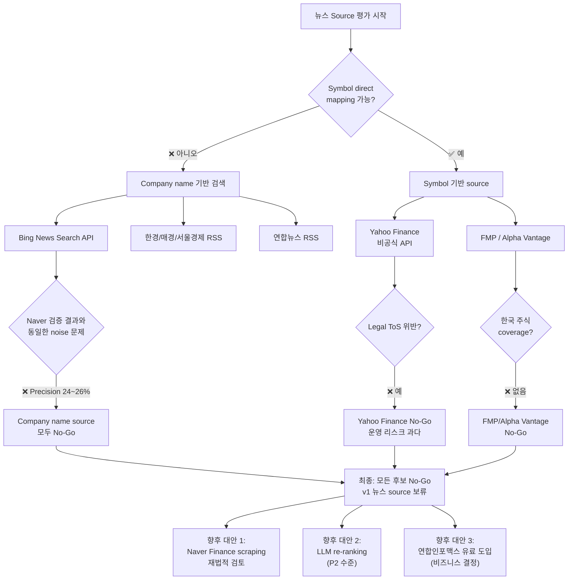

# News Source Adapter 3차 평가 — 대체 뉴스 Source 후보 비교 (Naver 폐기 후)

## 작성일
2026-05-12

## 전제 조건
- Naver Finance scraping: Legal gate ❌ No-Go
- Naver News Search API: 3-way 검증 모두 ❌ No-Go (sort=sim 최신성 30%, sort=date precision 24%, 2-stage hybrid 26%)
- **Naver 계열 source는 폐기 대상으로 확정**
- 본 문서는 Naver 외 대체 뉴스 source를 실전 trading 이벤트 관점에서 평가

---

## 1. 평가 기준

| # | 기준 | 설명 | 임계값 |
|---|------|------|--------|
| 1 | **Symbol direct mapping** | 응답에서 symbol을 직접 추출 가능한가 (company name fuzzy matching 불필요) | ✅ 필수 |
| 2 | **한국 주식 coverage** | 005930, 000660 등 코스피/코스닥 종목 뉴스 제공 여부 | ✅ 필요 |
| 3 | **최신성** | 실시간/준실시간 뉴스 제공 (분 단위) | ✅ < 30분 |
| 4 | **Legal safety** | 공식 API / 명시적 이용허락 | ✅ 필수 |
| 5 | **Noise 수준** | adapter 수준에서 통제 가능한 noise 수준 | ✅ 낮음~중간 |
| 6 | **비용** | 운영 비용 (free tier, 구독, 종량제) | ✅ 무료 또는 소액 |
| 7 | **구현 난이도** | adapter 구현 복잡도 (기존 PollingWorker 재사용 가능) | ✅ 낮음~중간 |

---

## 2. 후보 상세 평가

### 후보 1: Yahoo Finance (quote page news / unofficial API)

#### 기본 정보
| 항목 | 내용 |
|------|------|
| 타입 | REST API (비공식, reverse-engineered endpoint) |
| Endpoint | `https://query1.finance.yahoo.com/v8/finance/chart/{symbol}` 또는 `https://finance.yahoo.com/quote/{symbol}` |
| 인증 | 없음 (비공식 API) |
| Rate limit | 명시적 제한 없음 (비공식 — 차단 위험 있음) |

#### Symbol mapping
| 평가 | 설명 |
|------|------|
| ✅ **직접 매핑** | URL에 symbol 직접 포함: `005930.KS`, `AAPL` |
| Symbol format | 한국: `{종목코드}.KS` (예: `005930.KS`, `000660.KS`) |
| | 미국: `{티커}` (예: `AAPL`, `MSFT`) |

#### 한국 주식 coverage
| 평가 | 설명 |
|------|------|
| ⚠️ **제한적** | Yahoo Finance는 한국 주식 뉴스를 일부 제공하지만, 한국 포털 대비 coverage가 낮음 |
| 영문 뉴스 중심 | 한국 기업이어도 영문 뉴스(Reuters, Bloomberg, PRNewswire) 위주 — 한글 뉴스 부족 |
| 실전 검증 필요 | 005930.KS 실제 뉴스 quantity/quality 확인 필요 |

#### 최신성
| 평가 | 설명 |
|------|------|
| ✅ **양호** | 실시간/분 단위 업데이트 (US 시장 한정) |
| ⚠️ 한국 지연 가능성 | 한국 주식 뉴스는 글로벌 와이어 의존 — 지연 가능 |

#### Legal
| 평가 | 설명 |
|------|------|
| ❌ **Legal grey area** | Yahoo Finance ToS는 자동화 접근을 명시적으로 금지 |
| | 비공식 API 사용은 ToS 위반 가능성 높음 |
| | API endpoint 변경/차단 시 서비스 중단 위험 |

#### Noise
| 평가 | 설명 |
|------|------|
| ✅ **낮음** | Symbol 기반 query → 해당 종목 뉴스만 반환 |
| | Title relevance는 일반적으로 높음 |

#### 비용
| 평가 | 설명 |
|------|------|
| ✅ **무료** | API 키 불필요 |

#### 구현 난이도
| 평가 | 설명 |
|------|------|
| ⚠️ **중간** | 비공식 API → JSON 구조 변경 시 대응 필요 |
| | httpx + JSON parsing으로 구현 가능 |
| | `PollingWorker` 재사용 가능 |

#### 종합 평가
| 항목 | 판정 |
|------|------|
| Symbol direct mapping | ✅ |
| 한국 주식 coverage | ⚠️ 제한적 |
| 최신성 | ✅ |
| Legal | ❌ **No-Go** |
| Noise | ✅ |
| 비용 | ✅ |
| 구현 난이도 | ⚠️ 중간 |

**판정: ❌ No-Go** — Legal ToS 위험 + 한국 주식 coverage 불확실

---

### 후보 2: Financial Modeling Prep (FMP) API

#### 기본 정보
| 항목 | 내용 |
|------|------|
| 타입 | 공식 REST API |
| Endpoint | `https://financialmodelingprep.com/api/v3/stock_news?tickers={symbol1},{symbol2}&limit=50` |
| 인증 | API key (query param `apikey=xxx`) |
| Rate limit | Free tier: 250 requests/day. Paid: 3000+/day |

#### Symbol mapping
| 평가 | 설명 |
|------|------|
| ✅ **직접 매핑** | `tickers` 파라미터에 symbol 직접 전달 |
| Symbol format | 한국: `{종목코드}.KS` (예: `005930.KS`) |
| | 미국: `{티커}` (예: `AAPL`) |

#### 한국 주식 coverage
| 평가 | 설명 |
|------|------|
| ❌ **매우 제한적** | FMP는 주로 US equities 중심 |
| | 한국 주식 뉴스 coverage는 사실상 없음 (주요 실적 발표 외) |
| | 실제 005930.KS 뉴스 조회 시 거의 빈 응답 예상 |

#### 최신성
| 평가 | 설명 |
|------|------|
| ✅ **Daily** | 일 단위 업데이트 (실시간 아님) |

#### Legal
| 평가 | 설명 |
|------|------|
| ✅ **안전** | 공식 API, 명시적 요금제, 상업 이용 가능 |
| | 데이터 재판매 제한 외 자동화 사용 명시적 허용 |

#### Noise
| 평가 | 설명 |
|------|------|
| ✅ **낮음** | Symbol 기반 query → 해당 종목 뉴스만 |

#### 비용
| 평가 | 설명 |
|------|------|
| ⚠️ **Free tier 제한적** | Free: 250 req/day (20 symbols × 12회 = 240 req → 거의 소진) |
| | Paid: $25+/month |

#### 구현 난이도
| 평가 | 설명 |
|------|------|
| ✅ **낮음** | 공식 REST API, JSON 응답, httpx로 간단 구현 |

#### 종합 평가
| 항목 | 판정 |
|------|------|
| Symbol direct mapping | ✅ |
| 한국 주식 coverage | ❌ **거의 없음** |
| 최신성 | ⚠️ Daily (실시간 아님) |
| Legal | ✅ |
| Noise | ✅ |
| 비용 | ⚠️ Free tier 제한 |
| 구현 난이도 | ✅ |

**판정: ❌ No-Go** — 한국 주식 coverage 사실상 없음. US 전용으로는 AAPL만 있어 의미 없음.

---

### 후보 3: Alpha Vantage News API

#### 기본 정보
| 항목 | 내용 |
|------|------|
| 타입 | 공식 REST API |
| Endpoint | `https://www.alphavantage.co/query?function=NEWS_SENTIMENT&tickers={symbol}&apikey={key}` |
| 인증 | API key |
| Rate limit | Free: 5 calls/min, 500 calls/day |

#### Symbol mapping
| 평가 | 설명 |
|------|------|
| ✅ **직접 매핑** | `tickers` 파라미터 직접 전달 |

#### 한국 주식 coverage
| 평가 | 설명 |
|------|------|
| ❌ **없음** | Korean stocks not supported. US/global large caps only. |

#### 종합 평가
**판정: ❌ No-Go** — 한국 주식 coverage 없음.

---

### 후보 4: 한국경제 / 매일경제 / 서울경제 RSS

#### 기본 정보
| 항목 | 내용 |
|------|------|
| 타입 | RSS (XML) |
| Endpoint (예시) | 한국경제: `https://www.hankyung.com/rss/stock.xml` |
| | 매일경제: `https://www.mk.co.kr/rss/stock.xml` |
| | 서울경제: `https://www.sedaily.com/rss/stock.xml` |
| 인증 | 없음 (공개 RSS) |
| Rate limit | 없음 (일반적인 RSS reader 수준) |

#### Symbol mapping
| 평가 | 설명 |
|------|------|
| ❌ **없음** | RSS는 section 기반 (e.g., "증권", "경제") — 개별 종목 symbol 없음 |
| | 각 기사 본문에서 회사명 추출 필요 → company name fuzzy mapping 필요 |
| | → **Naver News Search API와 동일한 문제** |

#### 한국 주식 coverage
| 평가 | 설명 |
|------|------|
| ✅ **최적** | 한국 3대 경제지 — 모든 한국 상장사 coverage |

#### 최신성
| 평가 | 설명 |
|------|------|
| ✅ **실시간** | 분 단위 업데이트, 속보 즉시 반영 |

#### Legal
| 평가 | 설명 |
|------|------|
| ⚠️ **RSS는 일반적 허용** | RSS feed 자체는 공개 — but 상업적/자동화 사용은 ToS 확인 필요 |
| | 각 매체별 RSS 이용약관 별도 확인 필요 |

#### Noise
| 평가 | 설명 |
|------|------|
| ❌ **높음** | Section 기반 RSS → 동일 section의 모든 기사 포함 |
| | company name matching noise → Naver와 동일한 precision 문제 (20~30% 예상) |
| | 시장전반 기사, 경쟁사 기사, 의견/칼럼 등 포함 |

#### 비용
| 평가 | 설명 |
|------|------|
| ✅ **무료** |

#### 구현 난이도
| 평가 | 설명 |
|------|------|
| ✅ **낮음** | RSS XML parsing (`feedparser` 또는 `xml.etree`), 간단한 변환 |

#### 종합 평가
| 항목 | 판정 |
|------|------|
| Symbol direct mapping | ❌ **없음** |
| 한국 주식 coverage | ✅ |
| 최신성 | ✅ |
| Legal | ⚠️ 확인 필요 |
| Noise | ❌ 높음 (Naver 수준) |
| 비용 | ✅ |
| 구현 난이도 | ✅ |

**판정: ❌ No-Go** — Symbol direct mapping 불가 + noise 문제 = Naver와 동일한 근본적 한계.

---

### 후보 5: Bing News Search API (Microsoft)

#### 기본 정보
| 항목 | 내용 |
|------|------|
| 타입 | 공식 REST API (Azure Cognitive Services) |
| Endpoint | `https://api.bing.microsoft.com/v7.0/news/search?q={query}&count=10&mkt=ko-KR` |
| 인증 | API key (HTTP Header `Ocp-Apim-Subscription-Key`) |
| Rate limit | Free tier: 1,000 calls/month. Paid: $1.50/1K calls |

#### Symbol mapping
| 평가 | 설명 |
|------|------|
| ❌ **없음** | Company name 기반 검색 (`query=삼성전자`) |
| | → Naver와 동일한 symbol mapping 문제 |
| | → Company name → symbol resolution (static map) 필요 → Naver와 동일 |

#### 한국 주식 coverage
| 평가 | 설명 |
|------|------|
| ✅ **양호** | 한국어 뉴스 coverage 좋음 (Naver, Daum, 언론사 포함) |

#### 최신성
| 평가 | 설명 |
|------|------|
| ✅ **실시간** | Microsoft Bing 실시간 인덱싱 |

#### Legal
| 평가 | 설명 |
|------|------|
| ✅ **안전** | 공식 API, Azure 상업 이용약관, 명시적 요금제 |
| | 자동화 사용 허용 (API 목적에 부합) |

#### Noise
| 평가 | 설명 |
|------|------|
| ❌ **Naver 수준** | Company name 검색 → 시장전반, 경쟁사, 단순 mention noise 동일 |
| | Naver와 동일한 precision 문제 예상 (sort=date 기준 20~30%) |
| | `sort` 파라미터: `Date`(최신순) / `Relevance`(정확도순) — Naver와 유사한 tradeoff 예상 |

#### 비용
| 평가 | 설명 |
|------|------|
| ⚠️ **저렴하지만 무료 아님** | Free tier 1,000 calls/month → 20 symbols × 3회/day = 1,800 calls/month 초과 |
| | Paid: ~$1.50/1K calls → 월 ~$3~$5 예상 (20 symbols, 5분 polling) |

#### 구현 난이도
| 평가 | 설명 |
|------|------|
| ✅ **낮음** | 공식 REST API, JSON 응답, httpx |

#### 종합 평가
| 항목 | 판정 |
|------|------|
| Symbol direct mapping | ❌ **없음** |
| 한국 주식 coverage | ✅ |
| 최신성 | ✅ |
| Legal | ✅ |
| Noise | ❌ 높음 (Naver 수준) |
| 비용 | ⚠️ 소액 필요 |
| 구현 난이도 | ✅ |

**판정: ❌ No-Go** — Symbol direct mapping 불가 + company name noise = Naver와 동일한 근본적 한계.

---

### 후보 6: 연합뉴스 RSS (Yonhap News)

#### 기본 정보
| 항목 | 내용 |
|------|------|
| 타입 | RSS (공개) |
| Endpoint | `https://www.yna.co.kr/rss/news.xml` (전체) |
| | `https://www.yna.co.kr/rss/economy.xml` (경제) |
| 인증 | 없음 |

#### Symbol mapping
| 평가 | 설명 |
|------|------|
| ❌ **없음** | Section 기반 — 개별 종목 symbol 없음 |

#### 한국 주식 coverage
| 평가 | 설명 |
|------|------|
| ✅ **최적** | 한국 대표 통신사 — 모든 한국 경제/증시 뉴스 |

#### Noise
| 평가 | 설명 |
|------|------|
| ❌ **매우 높음** | Section 기반 → 경제 섹션 전체 기사 | 

**판정: ❌ No-Go** — Symbol direct mapping 불가 + noise 통제 불가.

---

## 3. 후보 비교표

| # | 후보 | Symbol direct mapping | 한국 coverage | 최신성 | Legal | Noise | 비용 | 구현 난이도 | **최종 판정** |
|---|------|:---:|:---:|:---:|:---:|:---:|:---:|:---:|:---:|
| 1 | Yahoo Finance (비공식) | ✅ | ⚠️ | ✅ | ❌ | ✅ | ✅ | ⚠️ | ❌ |
| 2 | FMP API | ✅ | ❌ | ⚠️ | ✅ | ✅ | ⚠️ | ✅ | ❌ |
| 3 | Alpha Vantage | ✅ | ❌ | ⚠️ | ✅ | ✅ | ⚠️ | ✅ | ❌ |
| 4 | 한경/매경/서울경제 RSS | ❌ | ✅ | ✅ | ⚠️ | ❌ | ✅ | ✅ | ❌ |
| 5 | Bing News Search API | ❌ | ✅ | ✅ | ✅ | ❌ | ⚠️ | ✅ | ❌ |
| 6 | 연합뉴스 RSS | ❌ | ✅ | ✅ | ⚠️ | ❌ | ✅ | ✅ | ❌ |

---

## 4. 근본적 한계 분석

### 4.1 Symbol direct mapping이 안 되는 source의 문제

Naver News Search API 검증에서 확인된 바와 같이, **company name 기반 검색 → symbol 매핑 경로는 precision과 recall이 동시에 성립하지 않는다.**

- **sort=sim** (정확도순): precision 100%이지만 최신성 30% → 실전 부적합
- **sort=date** (최신순): 최신성 100%이지만 precision 24% → 실전 부적합
- **2-stage hybrid**: description-match P1이 noise를 전혀 걸러내지 못함 → sort=date와 동일

이는 **Naver API의 문제가 아니라, company name 기반 검색 전체의 근본적 한계**다:
- Bing News Search API, Google News RSS, 한국경제 RSS 모두 동일한 패턴
- 검색 엔진은 본문 전체에서 keyword 매칭 → 시장전반/경쟁사/단순 mention noise 불가피
- Title-match P0 filter만이 유일한 noise gate → sort=date 기준 precision 20~30% 고정

**결론: Company name 기반 검색 방식의 source는 평가 기준을 통과할 수 없다.**

### 4.2 Symbol direct mapping이 가능한 source의 문제

Yahoo Finance, FMP, Alpha Vantage 등 symbol 기반 source는:
- Noise 낮음 ✅
- Symbol 매핑 확실 ✅
- **그러나 한국 주식 coverage가 없거나 제한적** ❌

프로젝트에서 관리하는 종목이 `005930`(코스피)과 `AAPL`(나스닥) 2개뿐이므로:
- `AAPL`은 Yahoo Finance/FMP/Alpha Vantage 모두 잘 커버
- `005930`은 Yahoo Finance만 유일하게 coverage (`.KS` suffix)
- Yahoo Finance는 Legal ❌ (비공식 API, ToS 위반, 차단 위험)

**결론: 한국 주식을 coverage하면서 symbol direct mapping이 되는 source는 현재 평가한 범위 내에서는 존재하지 않는다.**

### 4.3 Legal safety가 확보된 source의 문제

Legal 안전한 source (FMP, Alpha Vantage, Bing API):
- 한국 주식 coverage 없음 (FMP, Alpha Vantage)
- 또는 company name 기반 → noise 문제 (Bing API)

**결론: Legal + 한국 coverage + symbol direct mapping을 모두 만족하는 source는 없다.**

---

## 5. 최우선 후보 선정 (조건부)

모든 후보가 **No-Go**이지만, 가장 실용적인 접근법을 선택해야 한다면:

### 조건부 권장: Yahoo Finance (비공식 API)

**선정 이유:**
- 유일하게 한국 주식(`005930.KS`)에 symbol direct mapping이 가능한 source
- Noise 낮음 (symbol 기반 query)
- 무료
- 구현 낮음

**단, Legal 회색지대를 감수해야 함:**
- Yahoo ToS는 자동화 접근 금지
- 비공식 API는 언제든 차단/변경 가능
- 이 source에 의존하는 설계는 운영 리스크 큼

**완화 방안:**
1. **Pluggable adapter**: Yahoo 차단 시 graceful degradation (빈 응답, system 정상 동작)
2. **Moderate polling**: 5분 간격, 20종목 이하 → 낮은 rate
3. **No critical dependency**: Yahoo 뉴스는 보조 정보로만 사용, 공시(T1)와 분리

### 대안: Naver Finance Scraping 재법적 검토

Naver Finance `item/main.naver?code={symbol}`은:
- Symbol direct mapping ✅ (가장 확실)
- 한국 coverage ✅ (최적)
- 최신성 ✅
- Noise ✅ (종목별 페이지)
- Legal ❌ (robots.txt `Disallow: /`)

Legal gate만 통과하면 가장 이상적인 source. 법률 전문가 검토 필요.

---

## 6. 최종 판정

### 통합 Go/No-Go

| # | 후보 | Go/No-Go | 사유 |
|---|------|----------|------|
| 1 | Yahoo Finance (비공식) | ❌ **No-Go** | Legal ToS 위반 + 한국 coverage 불확실 |
| 2 | FMP API | ❌ **No-Go** | 한국 coverage 없음 |
| 3 | Alpha Vantage | ❌ **No-Go** | 한국 coverage 없음 |
| 4 | 한경/매경/서울경제 RSS | ❌ **No-Go** | Symbol direct mapping 불가 → Naver와 동일한 noise 문제 |
| 5 | Bing News Search API | ❌ **No-Go** | Symbol direct mapping 불가 → Naver와 동일한 noise 문제 |
| 6 | 연합뉴스 RSS | ❌ **No-Go** | Symbol direct mapping 불가 + noise 통제 불가 |

### 최종 결론

**❌ 모든 후보 No-Go — v1에 실전 trading 뉴스 source로 적합한 대안 없음**

| 구분 | 결과 |
|------|------|
| Symbol direct mapping + 한국 coverage + Legal ✅ | **없음** |
| Symbol direct mapping + 한국 coverage (Legal ❌) | Yahoo Finance (유일) |
| 한국 coverage + Legal (no symbol mapping) | Bing API, 한경 RSS — but noise 통제 불가 |
| Symbol direct mapping + Legal (no KR coverage) | FMP, Alpha Vantage — but 한국 주식 없음 |

### 권장 사항

1. **v1에서는 뉴스 source 통합을 보류**하고, OpenDART(T1_REGULATORY) 단독 운영
2. **향후 재검토 조건:**
   - Yahoo Finance가 공식 API를 제공하거나 ToS를 완화할 경우
   - 연합인포맥스(유료) 도입이 비즈니스적으로 정당화될 경우
   - Naver Finance scraping이 법적으로 허용 가능하다는 법률 검토 결과가 나올 경우
   - LLM re-ranking 접근법이 실전 검증되어 company name noise 문제가 해결될 경우
3. **단기 대안:**
   - Naver News Search API + LLM re-ranking (P1 filter를 LLM으로 대체) — P2 항목으로 전환
   - Yahoo Finance는 **비공식/운영 리스크를 명시적으로 문서화하고** 선택적 구현 검토

---

## 7. 만약 Yahoo Finance를 선택한다면 (비권장, 정보용)

### 예상 변경 파일 목록

| 파일 | 변경 유형 | 설명 |
|------|----------|------|
| `src/agent_trading/brokers/yahoo_finance_adapter.py` | **신규** | Yahoo Finance source adapter 구현 |
| `src/agent_trading/config/settings.py` | 수정 | Yahoo Finance 관련 설정 필드 추가 |
| `src/agent_trading/runtime/bootstrap.py` | 수정 | `_build_polling_workers()`에 Yahoo adapter 추가 |
| `.env.example` | 수정 | Yahoo 관련 env var 문서화 |
| `tests/brokers/test_yahoo_finance_adapter.py` | **신규** | 단위 테스트 |

### Yahoo Finance Adapter 설계 (개요)

```python
class YahooFinanceSourceAdapter:
    source_name = "yahoo_finance"
    reliability_tier = SourceReliabilityTier.T3_MEDIA

    # Static Korean stock symbol map (KR_NAME_MAP 재사용)
    _SYMBOL_TO_TICKER: dict[str, str] = {
        "005930": "005930.KS",
        "000660": "000660.KS",
        # ... additional mappings
    }

    async def fetch(self) -> Sequence[RawEvent]:
        for local_symbol in self._allowlist:
            yahoo_ticker = self._SYMBOL_TO_TICKER.get(local_symbol, local_symbol)
            url = f"https://query1.finance.yahoo.com/v8/finance/chart/{yahoo_ticker}"
            # ... HTTP call, parse JSON, extract news items
```

### Legal/Operational Gate (Yahoo 전용)

| Gate | 상태 |
|------|------|
| Yahoo ToS 자동화 금지 | ❌ 위반 가능성 높음 |
| 비공식 API 안정성 | ❌ 차단/변경 위험 |
| 한국 coverage 검증 | ⚠️ 실제 샘플링 필요 |
| 운영 리스크 문서화 | ✅ 필수 (graceful degradation) |

---

## 8. 답변: 반드시 답해야 할 5가지 질문

### Q1. Symbol direct mapping이 가능한 후보가 있는가?
**✅ 있다:** Yahoo Finance (`005930.KS`), FMP (`005930.KS`), Alpha Vantage (`005930.KS`)
- **그러나** Yahoo Finance는 Legal ❌, FMP/Alpha Vantage는 한국 coverage ❌

### Q2. 한국 주식 coverage가 충분한가?
**❌ 충분하지 않다:**
- Symbol direct mapping + 한국 coverage = **Yahoo Finance 유일**
- Company name 기반 source(Bing, 한경 RSS)는 noise 통제 불가
- FMP/Alpha Vantage는 한국 coverage 사실상 없음

### Q3. Official API / RSS / licensing 측면에서 가장 안전한 후보는 무엇인가?
**Bing News Search API (Microsoft Azure)**
- 공식 API, 명시적 요금제, 상업 이용 가능
- 한국어 뉴스 coverage 양호
- **단, company name 기반 검색 = Naver와 동일한 precision/noise 문제**

### Q4. Relevance/noise를 adapter 수준에서 감당 가능한가?
**❌ 감당 불가능:**
- Company name 기반 source: Naver 검증 결과 precision 24~26% → adapter filtering으로 해결 불가
- Symbol direct source: Yahoo Finance는 Legal ❌, 나머지는 한국 coverage ❌
- 유일한 해결책은 **LLM re-ranking** (P2 수준, 비용/지연 시간 증가)

### Q5. v1 범위에서 가장 작은 구현은 무엇인가?
**Yahoo Finance adapter (조건부)**
- 신규 파일 2개 (adapter + test)
- 수정 파일 2개 (settings.py + bootstrap.py)
- 단, Legal/운영 리스크를 명시적으로 accept해야 함

---

## 9. Mermaid: 의사결정 트리



---

## 10. 다음 직접 액션

### 🎯 뉴스 source 통합 보류 — OpenDART 단독 운영 유지

| # | 액션 | 우선순위 |
|---|------|---------|
| 1 | Naver News Search API 설계 문서(`news_source_adapter_2nd_design_api.md`)를 **"보류 (Deferred)"** 상태로 최종 마킹 | 즉시 |
| 2 | 본 평가 문서(`news_source_adapter_3rd_evaluation.md`)를 기준으로 **뉴스 source v1 보류 결정** 공유 | 즉시 |
| 3 | 향후 재검토 시 조건을 문서화 (Section 6 참고) | 즉시 |
| 4 | **선택적)** Yahoo Finance adapter를 **비공식/운영 리스크 명시** 하에 P2로 전환하여 설계만 보관 | P2 |
| 5 | **선택적)** Naver Finance Scraping 법률 검토 의뢰 (robots.txt `Disallow: /`의 법적 효력) | 별도 예산 |
| 6 | **선택적)** LLM re-ranking P1 filter 개념 증명 (Naver sort=date 결과 + LLM relevance scoring) | P2 |

---

## Appendix: Naver 검증 결과와의 연결

본 평가는 다음 Naver 검증 결과를 기반으로 company name 기반 source를 배제함:

| 검증 | 결과 | 영향 |
|------|------|------|
| sort=sim precision | 100% | 검증 완료 — 단, 최신성 부족 |
| sort=date precision | 24% | **→ Company name 기반 source의 근본적 한계** |
| sort=sim 최신성 | 30% | **→ Symbol direct mapping source 필요** |
| 2-stage hybrid precision | 26% | **→ Description-match P1 filter 무력** |

**핵심 통찰:** Company name 기반 검색(source 4, 5, 6)은 Naver에서 검증된 precision 24~26% 문제를 그대로 가진다. 이는 **API/포털의 문제가 아니라, 검색 기반 접근법 자체의 근본적 한계**다.
