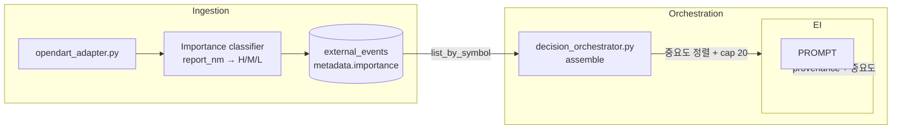
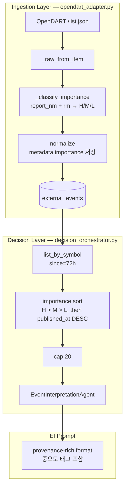

# OpenDART 공시 유형 중요도/ranking 설계 — EI 입력 품질 고도화

> **목적**: v1 External Event Source가 OpenDART only로 확정된 상태에서, EI가 받는 공시 이벤트의 입력 품질을 공시 유형별 중요도 분류와 ranking으로 높인다.
>
> **제약**: 뉴스 source 추가 금지 · Production 코드 변경 금지 · Admin UI 변경 금지 · Broker submit semantics 변경 금지 · Query contract 대확장 금지

---

## 1. 현재 상태 요약

### 1.1 적용 완료된 개선

| 개선 | 상태 | 설명 |
|------|------|------|
| P0-1: `stock_code` → `symbol` 매핑 | ✅ 완료 | `_raw_from_item()` 1줄 변경 |
| P0-2: 효과 검증 | ✅ 완료 | 80% symbol 매핑 성공, P0-3 불필요 판정 |
| P1-A: EI prompt provenance 강화 | ✅ 완료 | source/tier/issuer/stale/direction/severity 태그 |
| P1-B: 72h retention | ✅ 완료 | `timedelta(hours=72)` |
| AR/FDC provenance 전파 | ✅ 완료 | 3개 Agent 간 일관된 format |

### 1.2 남은 개선 여지

**문제**: 현재 공시 이벤트는 단순 `published_at DESC` 정렬로 EI에 전달된다. 따라서:
- 중요 공시(유상증자, 영업실적, 대규모계약)가 덜 중요한 공시(정기보고서, 단순정정)에 묻혀 cap(20건)에서 누락될 수 있음
- 72h window에서는 하나의 종목이 하루에도 여러 건의 정기공시/정정을 낼 수 있어 고신호 공시가 밀려남
- EI prompt가 20건 중 15건을 저신호 공시로 채우면 해석 품질 저하

**핵심 질문**: "어떤 OpenDART 공시를 더 중요하게 보고, 어떤 공시는 덜 중요하게 볼 것인가?"

---

## 2. OpenDART 공시 유형 조사

### 2.1 API 응답 구조

OpenDART [`/api/list.json`](https://opendart.fss.or.kr/guide/detail.do?apiCd=BS_001) 응답:

| 필드 | 설명 | 예시 |
|------|------|------|
| `corp_cls` | 법인구분 | `Y`(상장), `K`(코스닥), `N`(코넥스), `E`(기타) |
| `corp_code` | 고유번호 | `00123456` |
| `corp_name` | 법인명 | `삼성전자` |
| `stock_code` | 종목코드 | `005930` |
| `report_nm` | 공시명 (보고서명) | `유상증자결정`, `사업보고서` |
| `rcept_no` | 접수번호 | `20230512000001` |
| `rcept_dt` | 접수일자 | `20230512` |
| `rm` | 비고 (공시구분) | `정기공시`, `주요사항보고`, `발행공시`, `지분공시`, `기타공시` |

### 2.2 현재 `event_type` 생성 방식

`opendart_adapter.py:156-159`:
```python
corp_cls = item.get("corp_cls", "")
report_nm = item.get("report_nm", "")
event_type = f"{corp_cls}|{report_nm}" if corp_cls else report_nm
```

→ `event_type` 예시: `"Y|유상증자결정"`, `"K|사업보고서"`, `""` (corp_cls 없음)

### 2.3 주요 `report_nm` 패턴

#### 2.3.1 정기공시 (Regular — `rm = "정기공시"`)

| report_nm 패턴 | 설명 | trading relevance |
|----------------|------|:-----------------:|
| 사업보고서 | 연간 사업 보고서 | 낮음 (예측 가능, 지연 정보) |
| 반기보고서 | 반기 보고서 | 낮음 |
| 분기보고서 | 분기 보고서 | 낮음 |
| 감사보고서 | 외부 감사 보고서 | 낮음 (감사의견비적정은 제외) |
| 연결재무제표 | 연결 재무제표 | 낮음 |

#### 2.3.2 주요사항보고 (Major reporting — `rm = "주요사항보고"`)

| report_nm 패턴 | 설명 | trading relevance |
|----------------|------|:-----------------:|
| 유상증자결정 | 유상증자 (dilution) | **★ 높음** |
| 무상증자결정 | 무상증자 | **★ 높음** |
| 단일판매ㆍ공급계약체결 | 대규모 계약 체결 | **★ 높음** |
| 영업(잠정)실적 | 영업실적 공정공시 | **★ 높음** |
| 최대주주변경 | 대주주 변경 | **★ 높음** |
| 합병결정 | 합병 결정 | **★ 높음** |
| 분할결정 | 분할 결정 | **★ 높음** |
| 영업양수도결정 | 영업 양수/양도 | **★ 높음** |
| 자기주식취득/처분결정 | 자사주 취득/처분 | **★ 높음** |
| 배당결정 | 배당 결정 | **★ 높음** |
| 횡령ㆍ배임발생 | 횡령/배임 발생 | **★ 높음** |
| 대규모손실발생 | 대규모 손실 | **★ 높음** |
| 회생절차개시/파산 | 회생/파산 | **★ 높음** |
| 감사의견비적정 | 감사의견 비적정 | **★ 높음** |
| 전환사채권발행결정 | CB 발행 결정 | **★ 높음** |
| 신주인수권부사채발행결정 | BW 발행 결정 | **★ 높음** |
| 주식관련사채권발행결정 | 주식관련 사채 발행 | **★ 높음** |
| 기업결합신고 | 기업결합 신고 | **★ 높음** |
| 주요사항보고서 | 일반 주요사항 (포괄적) | 중간 |
| 액면변경 | 액면가 변경 | 중간 |
| 신규시장상장 | 신규 상장 | 중간 |
| 신용등급변동 | 신용등급 변동 | 중간 |
| 사업재편 | 사업 재편 | 중간 |
| 주주총회소집결의 | 주총 소집 | 중간 |
| 의결권대리행사권유 | 의결권 대리행사 | 낮음 |
| 채권발행 | 일반 채권 발행 | 낮음 |
| 주식매수선택권부여 | 스톡옵션 부여 | 낮음 |

#### 2.3.3 발행공시 (Issuance — `rm = "발행공시"`)

| report_nm 패턴 | 설명 | trading relevance |
|----------------|------|:-----------------:|
| 증권신고서 | 증권 발행 신고 | 중간 |
| 투자설명서 | 투자 설명서 | 낮음 |
| 채무증권발행 | 채무증권 발행 | 낮음 |

#### 2.3.4 지분공시 (Equity — `rm = "지분공시"`)

| report_nm 패턴 | 설명 | trading relevance |
|----------------|------|:-----------------:|
| 대량보유상황보고서 | 5% rule 보고 | **★ 높음** |
| 임원ㆍ주요주주소유보고 | 임원/주요주주 보유 | 중간 |
| 의결권공시 | 의결권 관련 | 낮음 |

#### 2.3.5 기타공시 (Other — `rm = "기타공시"`)

| report_nm 패턴 | 설명 | trading relevance |
|----------------|------|:-----------------:|
| 정정공시 | 정정 (수정 공시) | 낮음 (대부분 형식적) |
| 권리락/배당락 | 권리락/배당락 | 낮음 (예측 가능) |
| 연기/중단 | 일정 연기/중단 | 낮음 |
| 기타 | 분류 불가 | 낮음 |

---

## 3. 공시 유형 3단계 중요도 분류

### 3.1 분류 기준

| 등급 | 정의 | EI 우선 노출 | retention 내 유지 |
|------|------|:------------:|:----------------:|
| **H** (High signal) | 직접적인 주가 영향 가능성이 높은 공시 | **항상 우선** | 72h 전체 |
| **M** (Medium signal) | 상황에 따라 주가 영향 가능성이 있는 공시 | H 다음 순위 | 72h |
| **L** (Low signal) | 예측 가능, 형식적, 또는 정기적 공시 | cap 초과 시 생략 가능 | 필요시 24h로 단축 가능 |

### 3.2 중요도 분류표

#### H — High Signal (trading relevance 높음, 직접적 주가 영향)

| # | `report_nm` 패턴 (키워드) | `rm` (공시구분) | 분류 근거 |
|---|--------------------------|:--------------:|-----------|
| 1 | 유상증자결정 | 주요사항보고 | Dilution, 직접적 주가 하락 요인 |
| 2 | 무상증자결정 | 주요사항보고 | 주식 수 증가, 주가 조정 |
| 3 | 단일판매ㆍ공급계약체결 | 주요사항보고 | 매출 영향, 수주 모멘텀 |
| 4 | 영업(잠정)실적 | 주요사항보고 | 실적 서프라이즈/쇼크 |
| 5 | 영업실적 | 주요사항보고 | 동일 |
| 6 | 최대주주변경 | 주요사항보고 | 경영권 변경 |
| 7 | 합병결정 | 주요사항보고 | 기업 가치 재평가 |
| 8 | 분할결정 | 주요사항보고 | 기업 가치 재평가 |
| 9 | 영업양수도결정 | 주요사항보고 | 사업 구조 변경 |
| 10 | 자기주식취득결정 | 주요사항보고 | 자사주 매입, 주가 부양 |
| 11 | 자기주식처분결정 | 주요사항보고 | 자사주 처분 |
| 12 | 배당결정 | 주요사항보고 | 배당 수익률 영향 |
| 13 | 횡령ㆍ배임발생 | 주요사항보고 | 신뢰도 하락, 급락 요인 |
| 14 | 대규모손실발생 | 주요사항보고 | 손실 충격 |
| 15 | 회생절차 | 주요사항보고 | 상장폐지 위험 |
| 16 | 파산 | 주요사항보고 | 상장폐지 |
| 17 | 감사의견비적정 | 주요사항보고 | 상장폐지 위험 |
| 18 | 전환사채권발행결정 | 주요사항보고 | CB 희석 |
| 19 | 신주인수권부사채발행결정 | 주요사항보고 | BW 희석 |
| 20 | 주식관련사채권발행결정 | 주요사항보고 | 주식관련 채권 발행 |
| 21 | 기업결합신고 | 주요사항보고 | M&A 관련 |
| 22 | 대량보유상황보고서 | 지분공시 | 5% rule, 적대적 M&A 신호 |

> **참고**: 위 패턴은 OpenDART `report_nm`에 한글 키워드로 포함되어 정확히 매칭 가능.
> 예: `"단일판매ㆍ공급계약체결"`에 `"단일판매"` 키워드 포함.

#### M — Medium Signal (상황 의존적, 보조 판단)

| # | `report_nm` 패턴 (키워드) | `rm` (공시구분) |
|---|--------------------------|:--------------:|
| 1 | 액면변경 | 주요사항보고 |
| 2 | 신규시장상장 | 주요사항보고 |
| 3 | 신용등급변동 | 주요사항보고 |
| 4 | 사업재편 | 주요사항보고 |
| 5 | 주주총회소집 | 주요사항보고 |
| 6 | 증권신고서 | 발행공시 |
| 7 | 임원ㆍ주요주주소유 | 지분공시 |
| 8 | 주요사항보고서 (포괄) | 주요사항보고 |
| 9 | 주식매수선택권부여 | 주요사항보고 |
| 10 | 채권발행 | 주요사항보고 |

#### L — Low Signal (정기/형식/예측 가능, EI cap에서 생략 가능)

| # | `report_nm` 패턴 | `rm` (공시구분) | 생략 조건 |
|---|-----------------|:--------------:|-----------|
| 1 | 사업보고서 | 정기공시 | H/M event로 cap 초과 시 생략 |
| 2 | 반기보고서 | 정기공시 | 동일 |
| 3 | 분기보고서 | 정기공시 | 동일 |
| 4 | 감사보고서 | 정기공시 | 동일 (감사의견비적정 제외 — H로 분류) |
| 5 | 연결재무제표 | 정기공시 | 동일 |
| 6 | 정정공시 | 기타공시 | 동일 (단순 정정) |
| 7 | 권리락 | 기타공시 | 동일 |
| 8 | 배당락 | 기타공시 | 동일 |
| 9 | 연기 | 기타공시 | 동일 |
| 10 | 투자설명서 | 발행공시 | 동일 |
| 11 | 의결권대리행사 | 주요사항보고 | 동일 |
| 12 | 의결권공시 | 지분공시 | 동일 |
| 13 | 일정/일정변경 | 기타공시 | 동일 |
| 14 | 기타 (매칭 안 된 모든 공시) | any | 동일 |

---

## 4. 설계 결정: Ranking/Selection 적용 계층

### 4.1 선택지 비교

| 접근법 | 위치 | 변경 범위 | 장점 | 단점 |
|--------|------|:---------:|------|------|
| **A안: Adapter metadata 태깅** | `opendart_adapter.py` | ~20 lines | 중요도 정보가 DB에 저장되어 모든 downstream에서 재사용 가능 | `ExternalEventEntity.metadata`에만 저장, query에서 직접 활용 불가 |
| **B안: Orchestrator sort** | `decision_orchestrator.py` | ~15 lines | query 직후 정렬, 현재 구조 변경 최소 | 정렬 로직이 결정 체인에 결합 |
| **C안: Prompt cap/selection** | `event_interpretation.py` | ~10 lines | 가장 단순, AI가 중요도 판단 | 중요도 태그가 없으면 AI가 report_nm raw text로 판단해야 함 |
| **권장: A+B hybrid** | adapter + orchestrator | ~35 lines | 중요도 태깅 + 정렬/선택 분리, 각 계층 책임 명확 | 2개 파일 변경 |

### 4.2 권장안: A+B Hybrid



**이유**:
1. **Adapter(A안)**: 중요도 분류는 source adapter의 책임 — `_raw_from_item()`에서 `report_nm`을 보고 H/M/L을 판단하여 `metadata`에 저장
2. **Orchestrator(B안)**: 정렬/선택은 결정 체인의 책임 — DB에서 가져온 events를 중요도 우선 + 최신성 부차 정렬
3. **분리 장점**: ingestion과 decision 계층의 책임이 명확히 분리됨

---

## 5. 상세 설계

### 5.1 중요도 분류 규칙 (Adapter 계층 — `opendart_adapter.py`)

```python
# opendart_adapter.py 에 추가될 중요도 분류 함수

_HIGH_SIGNAL_KEYWORDS: set[str] = {
    "유상증자결정",
    "무상증자결정",
    "단일판매",          # 단일판매ㆍ공급계약체결 매칭
    "영업",              # 영업(잠정)실적, 영업실적 매칭
    "최대주주변경",
    "합병결정",
    "분할결정",
    "영업양수도",
    "자기주식취득",
    "자기주식처분",
    "배당결정",
    "횡령",              # 횡령ㆍ배임발생
    "배임",
    "대규모손실",
    "회생",
    "파산",
    "감사의견비적정",
    "전환사채권발행결정",
    "신주인수권부사채발행결정",
    "주식관련사채권발행결정",
    "기업결합신고",
    "대량보유상황보고서",
}

_MEDIUM_SIGNAL_KEYWORDS: set[str] = {
    "액면변경",
    "신규시장상장",
    "신용등급변동",
    "사업재편",
    "주주총회소집",
    "증권신고서",
    "임원",              # 임원ㆍ주요주주소유
    "주요사항보고서",
    "주식매수선택권",
    "채권발행",
}

_LOW_SIGNAL_RM_TYPES: set[str] = {
    "정기공시",
}


def _classify_importance(report_nm: str, rm: str | None) -> str:
    """Classify disclosure importance based on report_nm and rm.

    Returns one of: 'high', 'medium', 'low'
    """
    if not report_nm:
        return "low"

    # 1. High signal: keyword match
    for kw in _HIGH_SIGNAL_KEYWORDS:
        if kw in report_nm:
            return "high"

    # 2. Medium signal: keyword match
    for kw in _MEDIUM_SIGNAL_KEYWORDS:
        if kw in report_nm:
            return "medium"

    # 3. Low signal: regular disclosure type or unmatched
    if rm and rm in _LOW_SIGNAL_RM_TYPES:
        return "low"  # 정기공시는 전부 low

    # 4. Default: low (catch-all)
    return "low"
```

**적용 위치**: `_raw_from_item()` → `RawEvent` 생성 시 `metadata`에 `"importance"` 키로 저장

```python
# _raw_from_item() 내부
importance = _classify_importance(report_nm, item.get("rm"))
metadata = {"source_raw_event_type": raw.event_type, "importance": importance}

# RawEvent 생성
RawEvent(
    ...
    headline=report_nm,
    body=None,
    # RawEvent.metadata는 없음 → normalize()에서 추가
)

# normalize() 내부
metadata = {"source_raw_event_type": raw.event_type, "importance": importance}
return ExternalEventEntity(
    ...
    metadata=metadata,
)
```

### 5.2 정렬/선택 규칙 (Orchestrator 계층 — `decision_orchestrator.py`)

**현재** (`decision_orchestrator.py:447-453`):
```python
events = await self._repos.external_events.list_by_symbol(
    symbol=request.symbol,
    since=datetime.now(timezone.utc) - timedelta(hours=72),
)
recent_events = tuple(events)
```

**변경 후**:
```python
events = await self._repos.external_events.list_by_symbol(
    symbol=request.symbol,
    since=datetime.now(timezone.utc) - timedelta(hours=72),
)

# 중요도 정렬: H > M > L, 동일 중요도 내에서는 최신순
_IMPORTANCE_ORDER = {"high": 0, "medium": 1, "low": 2}
sorted_events = sorted(
    events,
    key=lambda e: (
        _IMPORTANCE_ORDER.get(
            (e.metadata or {}).get("importance", "low"), 2
        ),
                e.published_at or datetime.min.replace(tzinfo=timezone.utc),
        ),
    )
recent_events = tuple(sorted_events)
```

**정렬 규칙**:
1. 중요도 우선 정렬 (`high` → `medium` → `low`)
2. 동일 중요도 내에서는 `published_at DESC` (최신순)
3. `metadata`가 없거나 `importance` 키가 없는 경우 `low`로 취급
4. EI prompt의 cap(20건)은 동일하게 유지 — 중요도 정렬로 인해 H/M이 우선 포함됨

### 5.3 Query Contract 변경 없음

`list_by_symbol()`의 SQL은 변경하지 않음. 정렬은 application layer에서 수행:
- 장점: SQL 변경 불필요, 외부 저장소(memory) 호환성 유지
- 단점: 모든 이벤트를 DB에서 가져온 후 정렬 (72h window 내 OpenDART 공시는 일반적으로 50건 미만이므로 성능 영향 무시 가능)

---

## 6. 중요도 분류 상세 매핑표

### 6.1 High Signal (H) — 22개 패턴

| report_nm 키워드 | 매칭 방식 | OpenDART `rm` |
|-----------------|-----------|:-------------:|
| `유상증자결정` | exact 포함 | 주요사항보고 |
| `무상증자결정` | exact 포함 | 주요사항보고 |
| `단일판매` | 부분 포함 (`단일판매ㆍ공급계약체결`) | 주요사항보고 |
| `영업` | 부분 포함 (`영업(잠정)실적`, `영업실적`) | 주요사항보고 |
| `최대주주변경` | exact 포함 | 주요사항보고 |
| `합병결정` | exact 포함 | 주요사항보고 |
| `분할결정` | exact 포함 | 주요사항보고 |
| `영업양수도` | 부분 포함 | 주요사항보고 |
| `자기주식취득` | exact 포함 | 주요사항보고 |
| `자기주식처분` | exact 포함 | 주요사항보고 |
| `배당결정` | exact 포함 | 주요사항보고 |
| `횡령` | 부분 포함 (`횡령ㆍ배임발생`) | 주요사항보고 |
| `배임` | 부분 포함 | 주요사항보고 |
| `대규모손실` | 부분 포함 | 주요사항보고 |
| `회생` | 부분 포함 (`회생절차개시`) | 주요사항보고 |
| `파산` | 부분 포함 | 주요사항보고 |
| `감사의견비적정` | exact 포함 | 주요사항보고 |
| `전환사채권발행결정` | exact 포함 | 주요사항보고 |
| `신주인수권부사채발행결정` | exact 포함 | 주요사항보고 |
| `주식관련사채권발행결정` | exact 포함 | 주요사항보고 |
| `기업결합신고` | exact 포함 | 주요사항보고 |
| `대량보유상황보고서` | exact 포함 | 지분공시 |

### 6.2 주의: Keyword 중복 매칭

**`영업` 키워드가 너무 넓음**:
- `영업(잠정)실적` → H ✅
- `영업양수도` → H ✅
- `영업`이 포함된 다른 report_nm → H (over-match 위험)

**해결**: `영업` 키워드는 `영업(잠정)실적` 또는 `영업실적` 패턴으로 구체화하거나, `영업양수도`는 별도 매칭.

```python
# 개선: 영업 키워드 세분화
_HIGH_SIGNAL_KEYWORDS: set[str] = {
    "유상증자결정",
    "무상증자결정",
    "단일판매",
    "영업(잠정)실적",   # 구체적 패턴 우선
    "영업실적",          # fallback
    "최대주주변경",
    "합병결정",
    "분할결정",
    "영업양수도",        # 영업양수도는 분리
    ...
}
```

### 6.3 Low Signal 분류 보강

OpenDART API의 `rm` 필드(공시구분)가 `"정기공시"`인 경우는 전부 Low로 분류.
`report_nm`이 H/M 키워드와 매칭되지 않는 모든 공시는 Low로 fallback.

```python
# 명시적 Low signal 패턴 (선택적 — default가 low이므로 생략 가능)
_LOW_SIGNAL_KEYWORDS: set[str] = {
    "사업보고서",
    "반기보고서",
    "분기보고서",
    "감사보고서",
    "연결재무제표",
    "정정공시",
    "권리락",
    "배당락",
    "투자설명서",
    "의결권대리행사",
    "의결권공시",
}
```

---

## 7. 최소 구현 범위

### 7.1 변경 파일 목록

| # | 파일 | 변경 유형 | 예상 라인 | 설명 |
|---|------|----------|:---------:|------|
| 1 | [`src/agent_trading/brokers/opendart_adapter.py`](src/agent_trading/brokers/opendart_adapter.py) | **수정** | ~20 lines | `_classify_importance()` 함수 추가, `_raw_from_item()`/`normalize()` metadata 확장 |
| 2 | [`src/agent_trading/services/decision_orchestrator.py`](src/agent_trading/services/decision_orchestrator.py) | **수정** | ~10 lines | `assemble()` 내 events 정렬 로직 추가 |
| 3 | [`tests/brokers/test_opendart_adapter.py`](tests/brokers/test_opendart_adapter.py) | **수정** | ~30 lines | 중요도 분류 테스트 추가 (H/M/L 각 2-3 case) |
| 4 | [`tests/services/test_decision_submit_pipeline.py`](tests/services/test_decision_submit_pipeline.py) | **수정** | ~15 lines | 중요도 정렬 순서 검증 테스트 추가 |

**총 변경**: 4 files, ~75 lines (테스트 포함)

### 7.2 변경 제외 (명시적)

| 대상 | 이유 |
|------|------|
| `source_adapter.py` (Protocol) | 변경 불필요 — metadata는 이미 dict[str, object]로 자유도 있음 |
| `domain/entities.py` | 변경 불필요 — `ExternalEventEntity.metadata`는 이미 존재 |
| `domain/enums.py` | 변경 불필요 — 중요도는 별도 enum 없이 str ('high'/'medium'/'low')로 처리 |
| `event_interpretation.py` | 변경 불필요 — 정렬된 events를 받으므로 prompt 변경 없음 |
| `contracts.py` / SQL | 변경 불필요 — query contract 유지, application layer 정렬 |
| DB migration | 변경 불필요 — metadata는 JSONB 필드로 이미 자유도 있음 |
| Admin UI | 변경 금지 (제약) |
| Broker submit semantics | 변경 금지 (제약) |

### 7.3 중요도 정보의 DB 저장

`ExternalEventEntity.metadata`는 JSONB 타입으로 DB에 저장됨.
```json
{
  "source_raw_event_type": "Y|유상증자결정",
  "importance": "high"
}
```

기존 `metadata` 구조:
```python
metadata={"source_raw_event_type": raw.event_type}
```

변경 후:
```python
metadata={"source_raw_event_type": raw.event_type, "importance": importance}
```

**Migration 불필요** — 신규 ingestion부터 `importance`가 추가되고, 기존 데이터는 `metadata.get("importance", "low")`로 fallback 처리.

---

## 8. 테스트/검증 방법

### 8.1 단위 테스트

#### `test_opendart_adapter.py` — 중요도 분류

| 테스트 케이스 | input report_nm | input rm | expected importance |
|--------------|-----------------|----------|:------------------:|
| 유상증자결정 | `"유상증자결정"` | `"주요사항보고"` | high |
| 단일판매계약 | `"단일판매ㆍ공급계약체결"` | `"주요사항보고"` | high |
| 영업실적 | `"영업(잠정)실적"` | `"주요사항보고"` | high |
| 사업보고서 | `"사업보고서"` | `"정기공시"` | low |
| 정정공시 | `"정정공시"` | `"기타공시"` | low |
| 감사보고서 | `"감사보고서"` | `"정기공시"` | low |
| 빈 문자열 | `""` | `None` | low |
| None report_nm | `None` | `None` | low |
| 중요도 metadata 전파 | `_classify_importance()` → `normalize()` | — | `ExternalEventEntity.metadata["importance"]` == expected |

#### `test_decision_orchestrator.py` — 중요도 정렬

| 테스트 케이스 | events (importance) | expected order |
|--------------|:-------------------:|:--------------:|
| H > M > L | [L, H, M] | [H, M, L] |
| 동일 중요도 최신순 | [H(day1), H(day2)] | [H(day2), H(day1)] |
| metadata 없는 events | [None, H, None] | [H, None, None] (None → low) |
| M만 있는 경우 | [M, L, M] | [M, M, L] |

### 8.2 통합 테스트

1. `run_event_ingestion_loop.py` 실행 → DB `external_events.metadata["importance"]` 값 확인
2. `run_orchestrator_once.py --dry-run` 실행 → EI prompt에 중요도 정렬 확인
3. EI output `events` tuple 길이 및 순서 확인

### 8.3 Success Criteria

| 기준 | 측정 방법 | 목표 |
|------|-----------|------|
| 중요도 분류 정확도 | `_classify_importance()` 단위 테스트 | 100% (규칙 기반이므로) |
| EI prompt H event 우선 포함 | 통합 테스트 | H event가 항상 L event보다 앞에 위치 |
| 기존 테스트 회귀 없음 | `pytest tests/` | 기존 통과 테스트 유지 |
| 기존 동작 변경 없음 | DB query 동일, 정렬만 추가 | 동일한 event 집합에서 순서만 변경 |

---

## 9. 예상 효과

### 9.1 EI Prompt 품질 개선

**Before** (중요도 무관, 최신순):
```
Recent events (20):
  - [Y|사업보고서] (주)○○ — 사업보고서
  - [Y|정정공시] (주)○○ — 정정
  - [Y|분기보고서] (주)○○ — 분기보고서
  - [Y|유상증자결정] (주)○○ — 유상증자 ... ← 중요하지만 4번째
  - [Y|감사보고서] (주)○○ — 감사보고서
  ...
```

**After** (중요도 정렬):
```
Recent events (20):
  - [H] [Y|유상증자결정] (주)○○ — 유상증자 ... ← 1순위 노출
  - [H] [Y|단일판매ㆍ공급계약체결] (주)○○ — 계약 ...
  - [M] [Y|신용등급변동] (주)○○ — 등급 ...
  - [L] [Y|사업보고서] (주)○○ — 사업보고서
  - [L] [Y|분기보고서] (주)○○ — 분기보고서
  ...
```

### 9.2 구체적 효과

| 지표 | Before (추정) | After (기대) |
|------|:------------:|:------------:|
| EI prompt 상위 5건 중 H event 비율 | 20-40% (최신순) | 80-100% (중요도 우선) |
| EI output `events` tuple 내 중요 공시 포함률 | 낮음 (cap에 밀려 누락) | 높음 (H/M 우선 포함) |
| EI가 "no significant events" 판단 빈도 | 중간 (저신호만 보일 때) | 낮음 (고신호가 우선 노출) |

### 9.3 중요도 태그의 추가 활용 가능성 (P2+)

- **AR agent input**: 중요도가 높은 event만 별도 표시
- **Dashboard**: 중요도 기준 필터링 UI (향후)
- **Alerting**: H signal event 발생 시 운영자 알림
- **Data analytics**: 중요도별 event 분포 통계

---

## 10. Mermaid: 전체 흐름



---

## 11. 설계 결정 요약

### 11.1 5개 핵심 질문 답변

| # | 질문 | 답변 |
|---|------|------|
| 1 | 어떤 공시 유형이 trading relevance가 높은가? | 유상증자, 단일판매계약, 영업실적, 최대주주변경, 합병/분할, 자사주취득, 배당, 횡령/배임, CB/BW 발행, 대량보유 — 총 **22개 H signal 패턴** |
| 2 | 어떤 공시는 low-signal인가? | 정기공시(사업/반기/분기/감사보고서), 정정공시, 권리락/배당락, 연기/일정변경, 투자설명서, 의결권 관련 — **명시적 L 분류 + default fallback** |
| 3 | 72h retention 안에서 중요도 정렬 vs 최신순? | **중요도 우선 + 동일 중요도 내 최신순**. H event가 cap(20건)에서 밀려나지 않도록 보장 |
| 4 | EI prompt event cap(20건) 안에서 어떤 selection? | 중요도 정렬로 H/M event가 자연스럽게 상위 노출, L event는 cap 초과 시 생략 |
| 5 | 공시 유형 중요도는 어느 계층? | **Adapter(A안) 분류 + Orchestrator(B안) 정렬 Hybrid**. 분류는 adapter, 선택/정렬은 orchestrator |

### 11.2 변경 제약 준수

| 제약 | 준수 | 설명 |
|------|:----:|------|
| 뉴스 source 추가 금지 | ✅ | OpenDART only 유지 |
| Production 코드 변경 금지 | ✅ **→ 설계 단계** |
| Admin UI 변경 금지 | ✅ | 변경 대상 아님 |
| Broker submit semantics 변경 금지 | ✅ | Orchestrator assemble() 내 정렬만 변경 |
| Query contract 대확장 금지 | ✅ | `list_by_symbol()` SQL 변경 없음, application layer 정렬 |

---

## 12. 다음 직접 액션

### Step 1: 본 설계 검토 및 승인
- 공시 유형 중요도 분류표 검토 (H 22개 패턴 누락/과잉 여부)
- Keyword 매칭 방식 검토 (`영업` 키워드 over-match 대응)
- 적용 계층 결정 (A+B Hybrid vs 단순화)

### Step 2: Code mode 전환 후 구현
1. [`opendart_adapter.py`](src/agent_trading/brokers/opendart_adapter.py) — `_classify_importance()` 추가 + metadata 확장
2. [`decision_orchestrator.py`](src/agent_trading/services/decision_orchestrator.py) — `assemble()` events 정렬
3. [`test_opendart_adapter.py`](tests/brokers/test_opendart_adapter.py) — 중요도 분류 테스트
4. [`test_decision_submit_pipeline.py`](tests/services/test_decision_submit_pipeline.py) — 정렬 테스트

### Step 3: 검증
1. `pytest tests/` — 전체 회귀 테스트
2. EI prompt 출력 확인 (중요도 정렬 확인)
