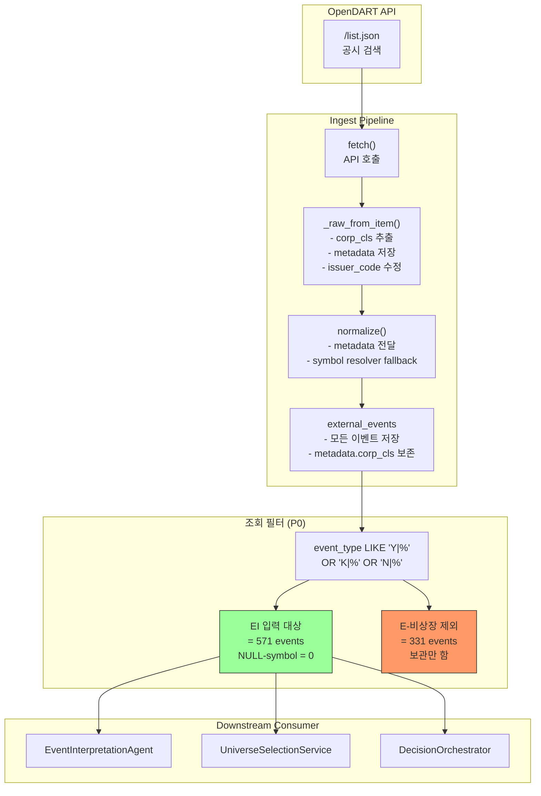

# OpenDART 상장/비상장 이벤트 분리 정책 설계

## 1. 문제 재정의

### 1.1 기존 가정
초기 symbol mapping 개선 과제에서는 `external_events` 테이블의 `symbol IS NULL` 비율 33.7% (304/902)를 **매핑 실패**로 가정하고, 이를 해결하기 위해 [`OpenDartSymbolResolver`](src/agent_trading/services/symbol_resolver.py)를 구현하여 ingest 경로(`opendart_adapter.py:277-295`)와 backfill 스크립트(`scripts/backfill_external_events_symbol.py`)에 fallback 로직을 추가했다.

### 1.2 실제 원인 — 비상장법인 공시
Backfill 실행 + DB 분석 결과, **304개 NULL-symbol 이벤트의 실제 원인**:

- 모두 `E-기타(비상장)` corp_cls
- OpenDART API의 `/company.json` 엔드포인트가 이들에 대해 `stock_code`를 반환하지 않음 (당연: 비상장법인은 stock_code가 없음)
- 164개 unique issuer_code 모두 유동화전문회사(SPV), 비상장 주식회사, 유한회사, 농업회사법인 등
- **매핑 실패가 아니라 정상적인 비상장법인 공시 수집**

### 1.3 재정의된 문제
| 구분 | 내용 |
|------|------|
| **진짜 문제** | 상장사 이벤트와 비상장법인 이벤트가 하나의 테이블에 혼합 저장 |
| **영향** | EI/Universe/Decision loop에서 불필요한 비상장법인 이벤트를 필터링해야 함 |
| **근본 원인** | ingest 단계에서 상장사 여부를 판별하지 않고 모든 OpenDART 이벤트를 동일하게 처리 |
| **발견된 추가 문제** | [`issuer_code=corp_code`](src/agent_trading/brokers/opendart_adapter.py:315) — issuer_code가 stock_code(6자리)가 아닌 corp_code(8자리)로 저장됨 |

---

## 2. 실제 Backfill 결과 해석

### 2.1 실행 요약

| 단계 | 결과 |
|------|------|
| Before 측정 | 304/902 NULL (33.7%) |
| Dry-run (via Docker) | 0 resolved, 164 unresolved (304 total NULL-symbol) |
| Apply | Skipped (0 UPDATE 대상) |
| After 측정 | 동일 (변화 없음) |

### 2.2 164 Unresolved의 정체

| 유형 | 개수 | 예시 |
|------|------|------|
| 유동화전문회사 (SPV) | ~30+ | `제칠십차유동화전문 유한회사` |
| 비상장 주식회사 | ~80+ | `(주)누리디앤씨`, `디와이개발 주식회사` |
| 유한회사 | ~20+ | `퍼스트파이브지유한회사` |
| 농업회사법인 | ~10+ | `농업회사법인(주)꿀떡` |
| 기타 (조합, 재단 등) | ~20+ | |

**결론**: 이 이벤트들은 symbol mapping 개선으로 해결할 수 없는 **정책적 분류 문제**다.

### 2.3 상장사 vs 비상장사 통계

| 구분 | Total | Symbol O | Symbol NULL | NULL% |
|------|-------|----------|-------------|-------|
| **Y-상장(KOSPI)** | 196 | 196 | 0 | 0.0% |
| **K-코스닥** | 368 | 368 | 0 | 0.0% |
| **N-코넥스** | 7 | 7 | 0 | 0.0% |
| **E-기타(비상장)** | 331 | 27 | 304 | 91.8% |

> 상장사(Y/K/N)는 **100% symbol mapping 성공**. 비상장사(E) 중 27건이 symbol이 있는 이유는 증권발행실적보고서 등으로 최근 상장된 기업이 `E`에서 `Y/K`로 전환되기 전 시점의 데이터.

---

## 3. 상장/비상장 이벤트 분류 기준

### 3.1 분류 키: OpenDART `corp_cls` 필드

| corp_cls | 의미 | 상장 여부 | 비고 |
|----------|------|-----------|------|
| `Y` | 유가증권시장 (KOSPI) | 상장 | 과거 `Y`는 `KRX` |
| `K` | 코스닥 (KOSDAQ) | 상장 | |
| `N` | 코넥스 (KONEX) | 상장 | |
| `E` | 기타 (비상장) | **비상장** | SPV, 유한회사, 비상장 주식회사 등 |

### 3.2 현재 저장 방식

`corp_cls`는 [`opendart_adapter.py:262`](src/agent_trading/brokers/opendart_adapter.py:262)에서 `event_type` prefix로 저장됨:

```python
event_type = f"{corp_cls}|{report_nm}"
```

예시:
- `Y|유상증자결정` — 상장사 이벤트
- `K|[기재정정]단일판매ㆍ공급계약체결` — 상장사 이벤트
- `E|[기재정정]감사보고서 (2025.12)` — 비상장법인 이벤트
- `N|주요사항보고서(주식교환ㆍ이전결정)` — 상장사 이벤트

### 3.3 분류 조건

```sql
-- 상장사 이벤트
event_type LIKE 'Y|%' OR event_type LIKE 'K|%' OR event_type LIKE 'N|%'
-- = 571 events, 모두 symbol 존재

-- 비상장법인 이벤트
event_type LIKE 'E|%'
-- = 331 events, 304건 symbol NULL
```

### 3.4 추가: importance 관점

| 구분 | H | M | L | null | 계 |
|------|---|---|---|------|----|
| 상장사(Y/K/N) | 94 | 89 | 309 | 79 | 571 |
| 비상장(E) | 5 | 12 | 293 | 21 | 331 |

상장사 H+M: **183건** → EI에 유용한 신호  
비상장 H+M: **17건** → symbol이 없어 Universe/Trading에 활용 불가

---

## 4. Ingest 정책 옵션 비교

### 4.1 옵션 개요

| 옵션 | 설명 | 변경 범위 | 난이도 |
|------|------|-----------|--------|
| **A. Ingest 시 필터링** | `_raw_from_item()`에서 E-cls 이벤트를 제외하고 저장 | adapter만 변경 | **매우 낮음** |
| **B. Metadata 태깅** | 모든 이벤트 저장 + `metadata` JSONB에 `corp_cls` 저장 | adapter 변경 + 쿼리 조건 추가 | 낮음 |
| **C. 별도 테이블** | `non_listed_entity_events` 테이블 분리 | schema 변경 + adapter + repository | 높음 |
| **D. Downstream 필터링** | 현재 상태 유지 + Universe/EI 쿼리에서 E-cls 제외 | 쿼리 조건만 추가 | **가장 낮음** |

### 4.2 상세 비교

| 평가 항목 | A. Ingest 필터링 | B. Metadata 태깅 | C. 별도 테이블 | D. Downstream 필터링 |
|-----------|-----------------|------------------|----------------|----------------------|
| **구현 복잡도** | ⭐ (1일) | ⭐⭐ (1-2일) | ⭐⭐⭐⭐⭐ (1주) | ⭐ (0.5일) |
| **데이터 보존** | 비상장 이벤트 손실 | **보존** | 보존 | **보존** |
| **스키마 변경** | 없음 | 없음 (metadata JSONB 활용) | 신규 테이블 | 없음 |
| **역호환성** | 하위 호환 깨짐 | **완전 호환** | 완전 호환 | 완전 호환 |
| **EI 입력 품질** | **최고** (노이즈 제거) | 양호 (쿼리로 필터링) | 양호 | 양호 (쿼리 의존) |
| **운영 메트릭** | 비상장 이벤트 수집 불가 | **가능** | 가능 | 가능 |
| **향후 확장** | 어려움 (과거 데이터 없음) | **유연함** | 유연함 | 유연함 |
| **issuer_code 버그** | 별도 수정 필요 | 별도 수정 필요 | 별도 수정 필요 | 별도 수정 필요 |

### 4.3 위험 분석

| 옵션 | 주요 위험 |
|------|-----------|
| **A** | E-cls 이벤트가 모두 무의미하다는 가정에 의존. 향후 SPV 분석 필요 시 데이터 없음 |
| **B** | metadata JSONB에 `corp_cls` 저장하려면 `_raw_from_item()`에서 raw_payload의 corp_cls를 metadata로 전달해야 함 (현재는 metadata에 저장 안 됨) |
| **C** | schema migration, repository 계층, API 변경 등 과도한 작업량. 현재 규모(331건)에 비해 오버엔지니어링 |
| **D** | 쿼리 성능 저하 가능성 (LIKE 조건). 일관성 유지를 위해 모든 조회 포인트를 찾아야 함 |

---

## 5. 추천 정책

### 5.1 권장: 옵션 B + D Hybrid (Metadata 태깅 + Downstream 필터링)

**선정 이유**:
1. **데이터 보존**: 비상장법인 이벤트도 보관하여 운영 메트릭(총 수집량 vs EI eligible vs 제외량) 추적 가능
2. **No schema change**: 기존 `metadata` JSONB 컬럼 활용, migration 불필요
3. **역호환성**: 기존 consumer에 영향 없음
4. **발견된 issuer_code 버그도 동시 수정 가능**: 하나의 PR로 해결
5. **향후 확장성**: 필요시 E-cls 이벤트에 대한 별도 분석 파이프라인 구축 가능

### 5.2 상세 정책

#### 5.2.1 Ingest 시점 (P0)

[`_raw_from_item()`](src/agent_trading/brokers/opendart_adapter.py:247-319)에서:

```python
# 1. corp_cls를 metadata에 저장
corp_cls = item.get("corp_cls", "")
metadata: dict[str, Any] = {}
if corp_cls:
    metadata["corp_cls"] = corp_cls

# 2. issuer_code 버그 수정: stock_code 우선, fallback corp_code
issuer_code = stock_code or corp_code  # stock_code(6자리) 우선
```

**변경 사항**:
| 위치 | 변경 | 타입 |
|------|------|------|
| [`opendart_adapter.py:262`](src/agent_trading/brokers/opendart_adapter.py:262) | `event_type = f"{corp_cls}|{report_nm}"` | **변경 없음** (이미 저장 중) |
| [`opendart_adapter.py:315`](src/agent_trading/brokers/opendart_adapter.py:315) | `issuer_code=corp_code` → `issuer_code=stock_code or corp_code` | **버그 수정** |
| `_raw_from_item()` 내 | metadata에 corp_cls 저장 | **신규** |
| `normalize()` | metadata 전달 | **변경** |

#### 5.2.2 조회 시점 (P0)

모든 downstream 조회에서 E-cls 이벤트를 기본적으로 제외:

```sql
-- Universe/EI 조회용
WHERE source_name = 'opendart'
  AND (event_type LIKE 'Y|%' OR event_type LIKE 'K|%' OR event_type LIKE 'N|%')
```

```python
# ExternalEventRepository.list_by_symbol / list_by_type
# 기본 필터에 상장사 조건 추가
```

#### 5.2.3 예외: E-cls High/Medium Signal (P2 고려)

E-cls 중 H/M 중요도(17건)는 symbol이 없지만, 특수 상황에서 참고 자료로 활용 가능:
- `list_by_type()`에 `include_non_listed: bool = False` 파라미터 추가
- 운영자가 필요시 조회 가능하도록 Admin UI 개선

#### 5.2.4 EI Prompt에 반영 (P1)

[`event_interpretation.py`](src/agent_trading/services/ai_agents/event_interpretation.py)의 system prompt에 다음을 명시:

> "OpenDART 이벤트 중 상장사(Y/K/N corp_cls prefix) 이벤트만 분석 대상입니다. E-비상장 prefix 이벤트는 제공되지 않습니다."

---

## 6. EI 입력 대상 이벤트 정의

### 6.1 EI Input Subset

| 기준 | 포함 | 제외 |
|------|------|------|
| **Source** | OpenDART (`source_name='opendart'`) | 다른 source (추후 정의) |
| **Listed status** | `event_type LIKE 'Y\|%'` OR `'K\|%'` OR `'N\|%'` | `event_type LIKE 'E\|%'` |
| **Symbol 존재** | 자동 보장 (상장사는 100% symbol 존재) | 필터링 시점에 symbol 유무 확인 |
| **Importance** | 전체 (H/M/L 모두 포함, 중요도 정렬은 별도) | N/A |
| **기간** | `published_at >= now() - interval '{lookback_days}'` | 그 이전 |

### 6.2 예상 효과

| 메트릭 | Before | After | 변화 |
|--------|--------|-------|------|
| EI 입력 대상 | 902 | **571** | -36.7% |
| NULL-symbol in EI | 304 (33.7%) | **0 (0%)** | 완전 제거 |
| H+M 중요도 events | 200 | 183 | 비상장 H+M 17건 제외 (영향 미미) |

### 6.3 운영 메트릭 (대시보드)

```sql
-- 일별 수집 메트릭
SELECT 
  COUNT(*) AS total_collected,
  COUNT(*) FILTER (WHERE event_type LIKE 'Y|%' OR event_type LIKE 'K|%' OR event_type LIKE 'N|%') AS listed_eligible,
  COUNT(*) FILTER (WHERE event_type LIKE 'E|%') AS non_listed_excluded,
  COUNT(*) FILTER (WHERE event_type LIKE 'Y|%' OR event_type LIKE 'K|%' OR event_type LIKE 'N|%') 
    / NULLIF(COUNT(*), 0)::float AS eligible_ratio
FROM external_events 
WHERE source_name = 'opendart'
  AND DATE(ingested_at) = CURRENT_DATE;
```

---

## 7. P0/P1/P2 단계별 실행안

### 7.1 P0 — Immediate (1-2일)

| # | 작업 | 파일 | 우선순위 |
|---|------|------|----------|
| 1 | `issuer_code` 버그 수정 | [`opendart_adapter.py:315`](src/agent_trading/brokers/opendart_adapter.py:315) | **Critical** |
| 2 | `metadata`에 `corp_cls` 저장 | [`opendart_adapter.py`](src/agent_trading/brokers/opendart_adapter.py) `_raw_from_item()` | High |
| 3 | `normalize()`에서 metadata 전달 | [`opendart_adapter.py`](src/agent_trading/brokers/opendart_adapter.py) `normalize()` | High |
| 4 | ExternalEventRepository.list_by_symbol/type에 상장사 필터 기본 적용 | [`external_events.py`](src/agent_trading/repositories/postgres/external_events.py) | High |
| 5 | 기존 이벤트 metadata backfill (`corp_cls` prefix를 metadata로 복사) | 신규 script or migration | Medium |
| 6 | 기존 571건 상장사 issuer_code 보정 (symbol → issuer_code 복사) | Backfill script 확장 | Medium |

### 7.2 P1 — Near-term (3-5일)

| # | 작업 | 파일 | 우선순위 |
|---|------|------|----------|
| 7 | `UniverseSelectionService._add_event_overlay()`에 상장사 필터 조건 추가 | [`universe_selection.py`](src/agent_trading/services/universe_selection.py) | High |
| 8 | EI system prompt에 비상장 제외 명시 | [`event_interpretation.py`](src/agent_trading/services/ai_agents/event_interpretation.py) | High |
| 9 | 운영 메트릭 쿼리 추가 (수집량/EI-eligible/제외량) | 모니터링 대시보드 or 리포트 | Medium |
| 10 | `list_by_type()`에 `include_non_listed` 파라미터 추가 | [`external_events.py`](src/agent_trading/repositories/postgres/external_events.py), [`contracts.py`](src/agent_trading/repositories/contracts.py) | Low |

### 7.3 P2 — Future (1-2주)

| # | 작업 | 우선순위 |
|---|------|----------|
| 11 | 비상장 E-cls H/M signal 이벤트 참고 조회 기능 (Admin UI) | Low |
| 12 | 비상장 이벤트 분석 전용 파이프라인 설계 (SPV 건수 추이 등) | Low |
| 13 | OpenDART API 응답에서 `corp_cls`, `stock_code`, `corp_code`를 `metadata`에 추가 저장 | Medium |

### 7.4 실행 순서 Mermaid

```mermaid
flowchart LR
    P0a["P0-1: issuer_code 버그 수정<br/>(opendart_adapter.py:315)"] --> P0b["P0-2: metadata에 corp_cls 저장"]
    P0b --> P0c["P0-3: normalize()에서 metadata 전달"]
    P0c --> P0d["P0-4: Repository 필터 적용"]
    P0d --> P0e["P0-5: 기존 데이터 metadata backfill"]
    P0e --> P0f["P0-6: 기존 issuer_code 보정"]
    P0f --> P1a["P1-7: Universe Selection 필터"]
    P1a --> P1b["P1-8: EI Prompt 업데이트"]
    P1b --> P1c["P1-9: 운영 메트릭 쿼리"]
    P1c --> P2["P2: 고급 기능<br/>(Admin UI, SPV 분석 등)"]
```



---

## 8. 리스크와 검증 방법

### 8.1 Risk Register

| # | 위험 | 영향 | 확률 | 대응 |
|---|------|------|------|------|
| R1 | 상장사 이벤트 중 일부가 `event_type` prefix에 `Y/K/N` 외 값을 가짐 | 분류 누락 | 낮음 | 정규식 `^[YKN]\|`로 보수적 매칭. 운영 모니터링으로 탐지 |
| R2 | `issuer_code`를 stock_code로 변경 시 downstream consumer 영향 | 데이터 정합성 깨짐 | 중간 | 변경 전 모든 조회 포인트 식별. 변경 후 통합 테스트로 검증 |
| R3 | metadata JSONB에 corp_cls를 추가하면서 기존 metadata 구조 변경 | 기존 consumer 파싱 실패 | 낮음 | 기존 metadata key와 충돌 없는지 확인 (현재 metadata는 비어 있음) |
| R4 | 상장사 필터가 너무 보수적/진보적으로 적용됨 | EI 입력 품질 저하 | 낮음 | P0-4에서 필터 적용 후 상장사/비상장 비율을 메트릭으로 지속 확인 |
| R5 | E-cls 이벤트 중 일부가 실은 상장사인 경우 (corp_cls 오류) | 유실 | 매우 낮음 | OpenDART 데이터 품질 문제. 별도 대응 불가 |

### 8.2 검증 계획

| 검증 항목 | 방법 | 기준 |
|-----------|------|------|
| **분류 정확성** | P0-4 적용 후 `event_type LIKE 'Y|K|N|%'` 결과와 symbol 존재 여부 교차 검증 | 상장사는 100% symbol 존재 |
| **issuer_code 정합성** | 변경 후 issuer_code가 stock_code와 일치하는지 확인 | 모든 상장사 이벤트의 issuer_code = symbol 값 |
| **기존 동작 회귀** | 기존 pytest suite 실행 | 전 테스트 통과 |
| **EI 입력 품질** | EI Agent 호출 시 NULL-symbol 이벤트가 전달되지 않는지 확인 | EI input에서 NULL-symbol = 0 |
| **운영 메트릭** | 일별 수집 리포트에서 eligible_ratio 추이 확인 | eligible_ratio ~63% (571/902) 유지 |

### 8.3 구체적 검증 쿼리

```sql
-- 1. 분류 정확성: 상장사 이벤트는 모두 symbol이 있어야 함
SELECT COUNT(*) AS violation
FROM external_events 
WHERE source_name = 'opendart'
  AND (event_type LIKE 'Y|%' OR event_type LIKE 'K|%' OR event_type LIKE 'N|%')
  AND symbol IS NULL;
-- Expected: 0

-- 2. issuer_code 정합성: 상장사 이벤트의 issuer_code는 symbol(6자리 stock_code)이어야 함
SELECT COUNT(*) AS violation
FROM external_events 
WHERE source_name = 'opendart'
  AND (event_type LIKE 'Y|%' OR event_type LIKE 'K|%' OR event_type LIKE 'N|%')
  AND issuer_code != symbol;
-- Expected: 0 (P0-6 적용 후)

-- 3. metadata corp_cls 저장 확인
SELECT 
  metadata->>'corp_cls' AS corp_cls,
  COUNT(*) AS cnt
FROM external_events
WHERE source_name = 'opendart'
  AND metadata ? 'corp_cls'
GROUP BY corp_cls
ORDER BY corp_cls;
-- Expected: Y/K/N/E 각각 존재
```

---

## 부록 A: 발견된 버그 요약

### B1. `issuer_code` 의미 오염 (P0 수정 대상)

**위치**: [`opendart_adapter.py:315`](src/agent_trading/brokers/opendart_adapter.py:315)

```python
issuer_code=corp_code,  # 현재: 8자리 OpenDART corp_code
```

**문제**: `issuer_code` 필드는 `ExternalEventEntity`에서 "증권 발행 기관 코드"를 의미하지만, 현재 corp_code(8자리)가 저장됨. 이는 stock_code(6자리, 종목코드)와 다름.

**증상**: 
- 상장사 571건 모두 `issuer_code`가 8자리 corp_code (예: `00126380` for 삼성전자)
- 실제 stock_code는 `005930`이지만 issuer_code에는 저장되지 않음
- `issuer_code`를 stock_code로 가정하고 조회하는 consumer가 있다면 잘못된 결과 초래

**수정 방안**:
```python
issuer_code=stock_code or corp_code,  # stock_code(6자리) 우선, 없으면 corp_code fallback
```

### B2. `metadata`에 `corp_cls` 미저장 (P0 수정 대상)

**위치**: [`opendart_adapter.py`](src/agent_trading/brokers/opendart_adapter.py) `_raw_from_item()` -> `normalize()`

**문제**: `corp_cls`는 `event_type` prefix로만 저장되고, 구조화된 형태로 보관되지 않음. `metadata` JSONB는 현재 사용되지 않음 (모든 이벤트가 빈 `{}`).

**수정 방안**: `_raw_from_item()`에서 `metadata["corp_cls"] = corp_cls` 추가, `normalize()`에서 `raw.metadata`를 entity.metadata로 전달.

---

## 부록 B: 관련 파일 목록

### 변경 필요한 파일 (P0)

| 파일 | 변경 내용 | 영향도 |
|------|-----------|--------|
| [`opendart_adapter.py`](src/agent_trading/brokers/opendart_adapter.py) | issuer_code 수정 + metadata에 corp_cls 저장 | 상 |
| [`external_events.py`](src/agent_trading/repositories/postgres/external_events.py) | list_by_* 에 상장사 필터 기본 적용 | 중 |
| [`contracts.py`](src/agent_trading/repositories/contracts.py) | (선택) include_non_listed 파라미터 추가 | 중 |
| [`entities.py`](src/agent_trading/domain/entities.py) | 변경 불필요 (metadata는 이미 JSONB) | 없음 |

### 변경 고려 파일 (P1)

| 파일 | 변경 내용 | 영향도 |
|------|-----------|--------|
| [`universe_selection.py`](src/agent_trading/services/universe_selection.py) | event overlay fetch 시 상장사 조건 추가 | 하 |
| [`event_interpretation.py`](src/agent_trading/services/ai_agents/event_interpretation.py) | system prompt에 비상장 제외 명시 | 하 |
| [`bootstrap.py`](src/agent_trading/runtime/bootstrap.py) | 변경 불필요 | 없음 |

### 참조 (변경 불필요)

| 파일 | 이유 |
|------|------|
| [`source_adapter.py`](src/agent_trading/brokers/source_adapter.py) | protocol 정의만 포함, 구현 수정 불필요 |
| [`symbol_resolver.py`](src/agent_trading/services/symbol_resolver.py) | 이미 구현 완료. 상장사 fallback으로 유효 |
| [`opendart_symbol_mapping_improvement_plan.md`](plans/opendart_symbol_mapping_improvement_plan.md) | 참고 문서. 33.7%의 원인이 재정의됨 |
| [`opendart_symbol_backfill_effect_report.md`](plans/opendart_symbol_backfill_effect_report.md) | backfill 실행 결과 기록 |
| [`opendart_disclosure_importance_ranking.md`](plans/opendart_disclosure_importance_ranking.md) | 중요도 분류 설계. 상장사 대상으로 유효 |

---

## 부록 C: Mermaid — 정책 적용 후 전체 흐름



---

*Document version: 1.0*
*Last updated: 2026-05-14*
*Author: Architect mode*
