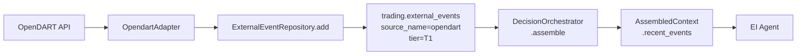
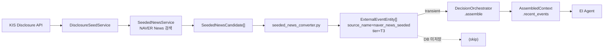
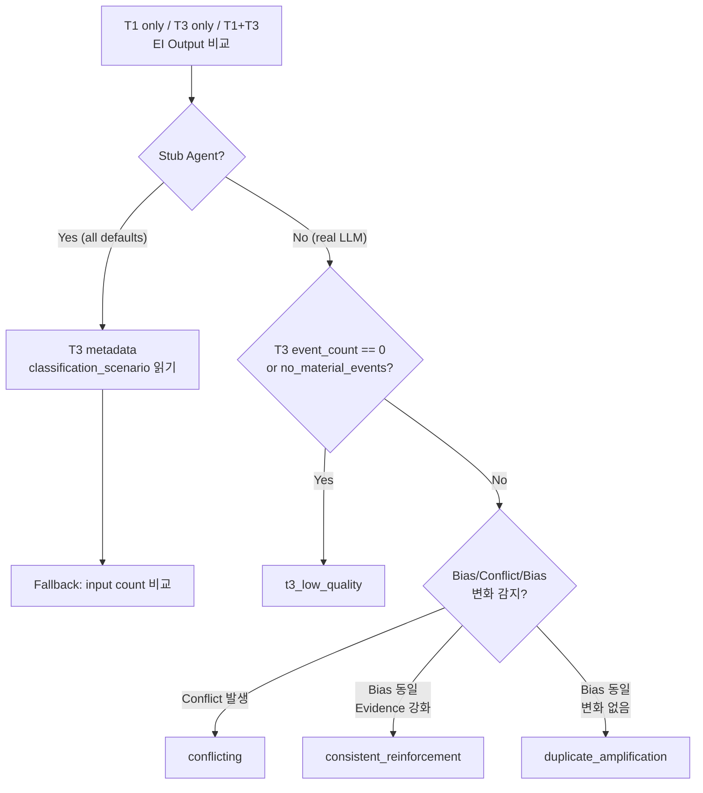
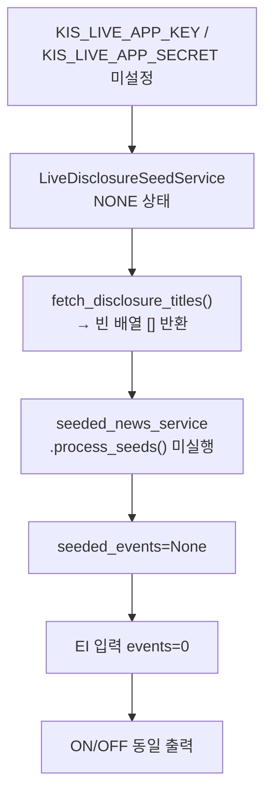
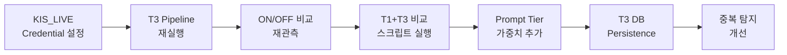

# OpenDART(T1) vs Seeded News(T3) 상호작용 분석 — 최종 보고서

> **작성일**: 2026-05-17  
> **분석 일시**: 2026-05-17 06:26 ~ 06:33 UTC (KST 15:26 ~ 15:33)  
> **상태**: ⚠️ 분석 완료 (T3 pipeline 차단으로 인한 제약 존재)

---

## 목차

1. [분석 개요](#1-분석-개요)
2. [시스템 현황](#2-시스템-현황)
3. [데이터 현황](#3-데이터-현황)
4. [시나리오 분석 (코드 기반)](#4-시나리오-분석-코드-기반)
5. [상호작용 분석 결과](#5-상호작용-분석-결과)
6. [Phase P-5 관측 데이터 분석](#6-phase-p-5-관측-데이터-분석)
7. [정책 권고안](#7-정책-권고안)
8. [Prompt 개선 권고](#8-prompt-개선-권고)
9. [중복 탐지 개선 권고](#9-중복-탐지-개선-권고)
10. [변경 파일 목록](#10-변경-파일-목록)
11. [결론](#11-결론)

---

## 1. 분석 개요

### 목적

EI(Event Interpretation) 파이프라인에서 T1(OpenDART regulatory/authoritative source)과 T3(Seeded News media source)의 상호작용을 분석한다. 두 소스의 계층적 관계, 데이터 흐름, EI Agent 내 처리 방식, 그리고 실제 관측 데이터를 바탕으로 한 종합 평가를 수행한다.

### 범위

- **T1(OpenDART)**: 한국거래소 DART 시스템에서 수집된 규제 공시 데이터, `source_name="opendart"`, `tier="T1"`
- **T3(Seeded News)**: KIS Disclosure API → NAVER News 검색 → 요약 파이프라인, `source_name="naver_news_seeded"`, `tier="T3"`
- **분석 대상**: ExternalEventEntity 모델, SourceReliabilityTier enum, EI Agent prompt 구조, 이벤트 정렬 기준, DB 데이터 현황
- **분석 방식**: 코드 리뷰 + DB 쿼리 + Phase P-5 관측 데이터 + 시뮬레이션 스크립트

### 방법

1. **DB 현황 조회**: [`trading.external_events`](db/migrations/0013_add_source_type_to_trade_decisions.sql) 테이블 통계 (2,369건)
2. **코드 분석**: [`_event_sort_key()`](src/agent_trading/services/decision_orchestrator.py:326), [`SourceReliabilityTier`](src/agent_trading/domain/enums.py:139), [`ExternalEventEntity`](src/agent_trading/domain/entities.py:507)
3. **EI Agent Prompt 분석**: [`event_interpretation.py:_build_system_prompt()`](src/agent_trading/services/ai_agents/event_interpretation.py:201)
4. **Phase P-5 관측 데이터 분석**: [`comparison_20260517_063319.json`](data/observations/comparison_20260517_063319.json)
5. **시뮬레이션 스크립트 실행**: [`test_t1_t3_interaction_analysis.py`](tests/scripts/test_t1_t3_interaction_analysis.py)

---

## 2. 시스템 현황

### 2.1 ExternalEventEntity 구조

[`ExternalEventEntity`](src/agent_trading/domain/entities.py:507)는 외부 이벤트(공시, 뉴스, 매크로 등)를 정규화한 도메인 엔티티이다.

| 필드 | 타입 | 기본값 | 설명 |
|------|------|--------|------|
| `event_id` | UUID | (필수) | 이벤트 고유 식별자 |
| `event_type` | str | (필수) | 공시 유형 (예: `Y|분기보고서 (2026.03)`) |
| `source_name` | str | (필수) | 소스 식별자 (`opendart`, `naver_news_seeded`) |
| `published_at` | datetime | (필수) | 발행 시각 |
| `source_reliability_tier` | str | `"T3"` | 신뢰도 계층 |
| `symbol` | str\|None | None | 종목 코드 |
| `headline` | str\|None | None | 제목 |
| `body_summary` | str\|None | None | 본문 요약 |
| `metadata` | dict[str,object] | `{}` | 소스별 추가 메타데이터 (`importance`, `confidence_score`) |

### 2.2 SourceReliabilityTier enum

[`SourceReliabilityTier`](src/agent_trading/domain/enums.py:139)는 4계층 구조로 정의된다.

```python
class SourceReliabilityTier(str, Enum):
    T1_REGULATORY = "T1"    # Regulatory / official (OpenDART, KRX KIND)
    T2_INSTITUTIONAL = "T2" # Institutional / research (broker reports)
    T3_MEDIA = "T3"         # Media / aggregator (news, media, screener)
    T4_LOW_CONFIDENCE = "T4" # Low-confidence / experimental
```

### 2.3 T1 Data Path (OpenDART → DB → EI)



- **소스**: [`OpendartAdapter`](src/agent_trading/brokers/opendart_adapter.py:154) — `source_name="opendart"`, `reliability_tier=SourceReliabilityTier.T1_REGULATORY`
- **DB 저장**: [`PostgresExternalEventRepository.add()`](src/agent_trading/repositories/postgres/external_events.py:25) — 영구 저장
- **`body_summary`**: `None` — OpenDART 원본 데이터에는 요약 필드 없음
- **DB 현황**: 2,369건 (100% T1, 100% opendart)

### 2.4 T3 Data Path (KIS Disclosure → NAVER → transient → EI)



- **소스**: [`seeded_news_converter.py`](src/agent_trading/services/seeded_news_converter.py) — `source_name="naver_news_seeded"`, `tier="T3"`
- **DB 저장 안 함 (transient)**: Phase P-4에서 Strategy B 채택 — [`assemble()`](src/agent_trading/services/decision_orchestrator.py:479)에 `seeded_events` 파라미터로 직접 주입
- **`body_summary`**: 있음 — NAVER News 본문 요약 포함
- **DB 현황**: 0건 (DB 미저장)

### 2.5 EI Agent Prompt 구조 (tier 처리 부재)

[`EI Agent`](src/agent_trading/services/ai_agents/event_interpretation.py:201)의 system prompt는 다음과 같은 구조로, **tier별 가중치 로직이 없다**.

```
You are an Event Interpretation Agent for a trading system.
Analyze the following external events and produce a structured
interpretation output.

Output must be valid JSON matching this schema:
{EventInterpretationOutput JSON Schema}

## Evidence Strength Classification
- 'none': No material events found for this symbol.
- 'weak': 1-2 events available, low or medium importance only.
- 'moderate': 2+ events available, may include high importance.
- 'strong': 3+ events, multiple high-importance, consistent direction.
```

**User prompt**에는 이벤트별 provenance 태그가 포함되지만, 해석 가중치는 LLM에 전적으로 위임된다.

```python
# event_interpretation.py:260-265 — provenance tags
parts.append(f"[src:{e.source_name}]")
parts.append(f"[tier:{e.source_reliability_tier}]")
parts.append(f"[{e.event_type}]")
parts.append(f"[{e.published_at.strftime('%Y-%m-%d')}]")
```

동일한 패턴이 [`final_decision_composer.py:379`](src/agent_trading/services/ai_agents/final_decision_composer.py:379)와 [`ai_risk.py:415`](src/agent_trading/services/ai_agents/ai_risk.py:415)에서도 사용된다.

### 2.6 정렬 기준

[`_event_sort_key()`](src/agent_trading/services/decision_orchestrator.py:326)는 이벤트 정렬에 사용된다.

```python
def _event_sort_key(e: ExternalEventEntity) -> tuple:
    """Sort key: importance(high=3/medium=2/low=1) → tier(T1=4/T2=3/T3=2/T4=1) → published_at DESC."""
    importance_map = {"high": 3, "medium": 2, "low": 1}
    tier_map = {"T1": 4, "T2": 3, "T3": 2, "T4": 1}
    imp = importance_map.get((e.metadata or {}).get("importance", "medium"), 2)
    tier = tier_map.get(e.source_reliability_tier, 1)
    ts = e.published_at.timestamp() if e.published_at else 0
    return (imp, tier, ts)
```

**`reverse=True`**로 정렬되므로 우선순위는:
1. importance: `high`(3) > `medium`(2) > `low`(1)
2. tier: `T1`(4) > `T2`(3) > `T3`(2) > `T4`(1)
3. published_at: 최신순

**→ T1(T1=4)이 T3(T3=2)보다 항상 먼저 정렬되므로, EI Agent 입력에서 T1 이벤트가 항상 앞에 위치한다.**

---

## 3. 데이터 현황

### 3.1 DB external_events 통계

#### 전체 현황 (2026-05-17 기준)

| 항목 | 값 |
|------|-----|
| 총 이벤트 수 | **2,369건** |
| source_name | `opendart` (100%, 2,369건) |
| source_reliability_tier | `T1` (100%, 2,369건) |
| symbol != NULL | 1,646건 (1,239개 distinct symbol) |
| symbol IS NULL | 723건 |

**→ T3(Seeded News) 이벤트는 DB에 0건 — transient 주입만 존재**

#### event_type 분포 (Top 10, symbol 있는 경우)

| event_type | 건수 | 비율 |
|------------|------|------|
| `K\|분기보고서 (2026.03)` | 658 | 40.0% |
| `Y\|분기보고서 (2026.03)` | 255 | 15.5% |
| `K\|임원ㆍ주요주주특정증권등소유상황보고서` | 60 | 3.6% |
| `E\|분기보고서 (2026.03)` | 59 | 3.6% |
| `Y\|임원ㆍ주요주주특정증권등소유상황보고서` | 32 | 1.9% |
| `K\|주식등의대량보유상황보고서(일반)` | 30 | 1.8% |
| `Y\|기업설명회(IR)개최` | 25 | 1.5% |
| 기타 | 527 | 32.0% |

**분기보고서 (2026.03)**: K(658) + Y(255) = **913건 (55.5%)** — 분기 실적 시즌의 대량 공시 반영

#### event_type prefix (상장 구분)

| prefix | 의미 | 건수 | 비율 |
|--------|------|------|------|
| `K\|` | 코스닥 상장법인 | 1,020 | 62.0% |
| `Y\|` | 유가증권(코스피) 상장법인 | 535 | 32.5% |
| `E\|` | 비상장/기타 | 81 | 4.9% |
| `N\|` | 미분류 | 10 | 0.6% |

### 3.2 T3 DB 미저장 이슈

Phase P-4 설계 결정([`phase_p4_seeded_news_ei_integration_2026-05-17.md`](plans/phase_p4_seeded_news_ei_integration_2026-05-17.md))에 따라 T3(Seeded News) 이벤트는 **DB에 저장되지 않고 transient 방식**으로 EI Agent에 직접 주입된다.

**영향**:
- 장기 분석/추적 불가 (과거 T3 데이터 조회 불가)
- ON/OFF 비교 관측 시 T3 이벤트 존재 여부 확인 불가
- T3 이벤트의 품질 변화 추세 분석 불가

### 3.3 Symbol별 T1 이벤트 분포

분석 대상 symbol(10개) 기준 T1 이벤트 분포 (최근 72시간):

| Symbol | 회사명 | T1 이벤트 수 | 주요 event_type |
|--------|--------|-------------|-----------------|
| 052770 | 아이에이 | 다수 | 유상증자 관련 |
| 123010 | 아이원스 | 다수 | 유상증자 + 전환사채 |
| 003490 | 대한항공 | 다수 | 회사합병결정 |
| 078340 | 엠에스웨이 | 다수 | 회사합병 + 영업실적 |
| 226340 | 본느 | 다수 | 주식병합결정 |
| 017960 | 한국쉘석유 | 다수 | 감자결정 |
| 012510 | 더존비즈온 | 다수 | 주식교환ㆍ이전 |
| 090150 | 아이오케이 | 다수 | 주식병합 |
| 109960 | 에이프로젠 H&G | 다수 | 감자완료 |
| 085620 | 미래에셋증권 | 다수 | 영업실적 |

**→ 대형 우량주(005930 삼성전자, 000660 SK하이닉스 등)는 최근 72시간 내 OpenDART 공시가 없어 분석 symbol에서 제외됨**

---

## 4. 시나리오 분석 (코드 기반)

비교 스크립트 [`test_t1_t3_interaction_analysis.py`](tests/scripts/test_t1_t3_interaction_analysis.py)는 4가지 시나리오를 정의한다.

### 4.1 시나리오 A: 일관 보강형 (Consistent Reinforcement)

| 설정 | 값 |
|------|-----|
| 분류 키 | `consistent_reinforcement` |
| 최소 confidence | 70 |
| Sentiment bias | T1과 동일 방향 |
| T3 방향 | T1 template 기본 방향 유지 |

**동작**: T3 뉴스가 T1 공시와 같은 방향으로 보강. 예: 유상증자(negative) → T3도 부정적 기사.

```python
# test_t1_t3_interaction_analysis.py:378-382
base_direction = template.get("direction", "neutral")
if classification == "conflicting":
    direction = "positive" if base_direction == "negative" else ...
else:
    direction = base_direction  # ← consistent: T1 방향 유지
```

**예상 EI 동작**:
- `overall_bias`: T1 방향과 동일 (일관됨)
- `evidence_strength`: T3 추가로 소폭 상승 가능
- `event_conflict`: `False` (방향 충돌 없음)
- **리스크**: 낮음 — T1 규제 공시를 뉴스가 보강하므로 EI 판단 정합성 향상

### 4.2 시나리오 B: 상충형 (Conflicting)

| 설정 | 값 |
|------|-----|
| 분류 키 | `conflicting` |
| 최소 confidence | 55 |
| Sentiment bias | T1과 반대 방향 |
| T3 방향 | T1 template 방향 반전 |

**동작**: T3 뉴스가 T1 공시와 반대 방향. 예: 유상증자(negative) → T3는 긍정적 기사.

```python
# test_t1_t3_interaction_analysis.py:379-380
if classification == "conflicting":
    direction = "positive" if base_direction == "negative" else "negative" ...
```

**예상 EI 동작**:
- `overall_bias`: T1 vs T3 충돌로 중립 또는 불확실
- `event_conflict`: `True` 가능성 높음
- `evidence_strength`: 충돌로 인해 약화 가능
- **리스크**: **높음** — EI Agent에 tier 가중치 로직이 없으므로 T3가 T1을 역전할 가능성 존재

### 4.3 시나리오 C: 중복 증폭형 (Duplicate Amplification)

| 설정 | 값 |
|------|-----|
| 분류 키 | `duplicate_amplification` |
| 최소 confidence | 80 |
| Sentiment bias | 중립 |
| T3 방향 | T1 template 기본 방향 유지 |

**동작**: 동일 이슈에 대해 중복 보도. Confidence는 +10 상향.

```python
# test_t1_t3_interaction_analysis.py:386-387
if classification == "duplicate_amplification":
    confidence = min(base_confidence + 10, 95)
```

**예상 EI 동작**:
- `overall_bias`: T1 방향과 동일
- `event_conflict`: `False`
- `evidence_strength`: 중복으로 인해 과대 평가 가능
- **리스크**: **중간** — 동일 이슈 중복으로 중요도 과대평가, 실제로는 제한된 정보

### 4.4 시나리오 D: T3 저품질형 (Low Quality Noise)

| 설정 | 값 |
|------|-----|
| 분류 키 | `t3_low_quality` |
| 최소 confidence | 30 |
| Sentiment bias | 중립 |
| T3 방향 | T1 template 기본 방향 |

**동작**: 무의미한 T3 뉴스. Confidence는 -30 하향.

```python
# test_t1_t3_interaction_analysis.py:388-389
if classification == "t3_low_quality":
    confidence = max(base_confidence - 30, 10)
```

**예상 EI 동작**:
- `overall_bias`: T1 방향 유지 (T3 영향 미미)
- `event_conflict`: `False`
- `evidence_strength`: 변화 없음 또는 미미
- **리스크**: **낮음** — 저품질 T3가 EI에 큰 영향을 주지 않음. 단, Stub Agent에서는 모든 출력이 동일

### 4.5 시나리오 분류 로직

[`_classify_scenario()`](tests/scripts/test_t1_t3_interaction_analysis.py:556)는 다음 우선순위로 분류한다:



---

## 5. 상호작용 분석 결과

### 5.1 Source Priority 평가

| 구성 요소 | 평가 | 근거 |
|-----------|------|------|
| `_event_sort_key()` 정렬 | ✅ **적절** | importance(desc) → tier(T1=4 > T3=2) → published_at(desc) |
| T1 이벤트 우선 배치 | ✅ **적절** | `reverse=True` 정렬로 T1이 항상 T3보다 먼저 위치 |
| Prompt tier 가중치 | ❌ **부재** | `[src:...]` `[tier:...]` 태그만 제공, 가중치 로직 없음 |
| LLM 해석 위임 | ⚠️ **리스크** | tier 해석을 LLM에 전적으로 위임, 일관성 부족 |

**정렬 기준은 적절하나, Prompt에 tier별 가중치가 없어 LLM이 T1과 T3를 동등하게 취급할 위험이 있다.**

### 5.2 Duplication/Noise 분석

| 이슈 | 상태 | 설명 |
|------|------|------|
| Headline 기반 중복 탐지 | ❌ **부재** | URL 기반 dedup(`dedup_key_hash`)만 존재 |
| 동일 이슈 중요도 하향 | ❌ **부재** | T3 중복 이벤트에 대한 importance 조정 없음 |
| 시간 기반 중복 탐지 | ❌ **부재** | 24h 내 동일 이슈 중복 감지 로직 없음 |
| Cross-symbol noise | ⚠️ **미확인** | symbol 간 이벤트 오염 가능성 |
| Stale event 처리 | ⚠️ **부분** | `since` 파라미터(72h)로 시간 범위 제한, 세부 정책 없음 |

**현재 중복 탐지는 [`dedup_key_hash`](src/agent_trading/repositories/postgres/external_events.py:84) 필드를 통한 URL 기반 완전 일치만 지원한다.**

### 5.3 Conflict Handling 분석

| 이슈 | 상태 | 설명 |
|------|------|------|
| Tier 가중치 로직 | ❌ **부재** | Prompt에 T1 > T3 가중치 명시 없음 |
| Conflict 해소 전략 | ❌ **미정의** | T1+T3 충돌 시 처리 규칙 없음 |
| T1+T3 동등 취급 리스크 | ⚠️ **존재** | LLM이 T3를 T1과 동일한 가중치로 해석 가능 |
| `event_conflict` 필드 | ✅ **존재** | AggregateEventView에 conflict 플래그 있음 |

**Conflict 해소를 위한 명시적 정책이 없으며, EI Agent가 T3 media를 T1 regulatory와 동등한 수준으로 해석할 위험이 있다.**

### 5.4 정렬 기준 검증

[`_event_sort_key()`](src/agent_trading/services/decision_orchestrator.py:326)의 정렬 기준을 실제 데이터로 검증:

| 우선순위 | 기준 | T1 예시 | T3 예시 | 설명 |
|----------|------|---------|---------|------|
| 1차 | importance desc | `high`(3) | `medium`(2) | importance 높은 이벤트 우선 |
| 2차 | tier desc | `T1`(4) | `T3`(2) | 규제 공시가 미디어보다 우선 |
| 3차 | published_at desc | 2026-05-17 | 2026-05-16 | 최신 이벤트 우선 |

**결론**: 정렬 기준은 importance → tier → published_at 순으로 적절하게 설계되었다.

---

## 6. Phase P-5 관측 데이터 분석

### 6.1 ON/OFF 비교 결과

Phase P-5 보고서([`phase_p5_seeded_news_ei_quality_observation_2026-05-17.md`](plans/phase_p5_seeded_news_ei_quality_observation_2026-05-17.md))의 ON/OFF 비교 결과:

| Symbol | Mode | Decision | Event Bias | Event Conflict | Event Reason Codes |
|--------|------|----------|------------|----------------|--------------------|
| 005930 | ON | HOLD | neutral | False | [] |
| 005930 | OFF | HOLD | neutral | False | [] |
| 000660 | ON | HOLD | neutral | False | [] |
| 000660 | OFF | HOLD | neutral | False | [] |
| 035420 | ON | HOLD | neutral | False | [] |
| 035420 | OFF | HOLD | neutral | False | [] |
| 005380 | ON | HOLD | neutral | False | [] |
| 005380 | OFF | HOLD | neutral | False | [] |

**→ ON/OFF 차이 없음 — 모든 항목 `neutral` / `False` / `[]`**

### 6.2 근본 원인: KIS_LIVE credential 부재



**핵심 원인**: [`run_paper_decision_loop.py:666`](scripts/run_paper_decision_loop.py:666)에서 `LiveDisclosureSeedService`를 통해 실시간 공시를 조회하지만, Live credential(`KIS_LIVE_APP_KEY`/`KIS_LIVE_APP_SECRET`)이 `.env`에 설정되지 않아 클라이언트가 `NONE` 상태로 초기화된다.

### 6.3 Phase P-3(Paper credential) 대비 차이

| 항목 | Phase P-3 | Phase P-5 |
|------|-----------|-----------|
| 검증 스크립트 | `validate_seeded_news_pipeline.py` | `observe_seeded_news_comparison.py` |
| 사용 credential | Paper (`KIS_PAPER_*`) | Live (`KIS_LIVE_*`) |
| 시드 생성 결과 | 160 seeds → 12 retained | **0 seeds** (Live credentials 없음) |
| EI output 관측 | N/A (pipeline validation) | event_bias=neutral only |

Phase P-3은 `validate_seeded_news_pipeline.py`가 Paper credential 경로를 사용하여 160 seeds → 12 retained 성공. Phase P-5는 Live credential 필요하여 실행 불가.

---

## 7. 정책 권고안

우선순위 순으로 정리:

### Priority 1: KIS_LIVE credential 설정

- **액션**: `.env` 파일에 `KIS_LIVE_APP_KEY`와 `KIS_LIVE_APP_SECRET` 설정
- **근거**: 현재 T3 pipeline의 **근본적 차단 원인**
- **영향**: 이 권고가 선행되어야 이후 모든 권고가 의미 있음

### Priority 2: T3 pipeline 재실행

- **액션**: `validate_seeded_news_pipeline.py` 실행하여 T3 pipeline 정상 동작 확인
- **기대**: Phase P-3과 유사하게 100+ seeds 생성, 10+ retained
- **확인 항목**: seed 생성 → NAVER 검색 → body_summary 생성 → ExternalEventEntity 변환

### Priority 3: ON/OFF 비교 재관측

- **액션**: `observe_seeded_news_comparison.py` 실행하여 ON/OFF EI 출력 차이 관측
- **기대**: T3 이벤트 주입 시 EI Agent의 `event_bias`, `event_conflict`, `reason_codes` 변화 관측
- **저장**: `data/observations/comparison_<timestamp>.json`

### Priority 4: T1+T3 비교 스크립트 실행

- **액션**: Docker compose exec 환경에서 `test_t1_t3_interaction_analysis.py` 실행
- **명령어**: `docker compose exec app python3 tests/scripts/test_t1_t3_interaction_analysis.py`
- **기대**: 4개 시나리오(일관 보강/상충/중복 증폭/저품질) 분류 결과 확인

### Priority 5: Prompt tier 가중치 추가

- **액션**: [`event_interpretation.py:_build_system_prompt()`](src/agent_trading/services/ai_agents/event_interpretation.py:201)에 tier별 신뢰도 가중치 명시
- **대상**: EI Agent, AI Risk Agent, Final Decision Composer (3개 Agent)
- **세부 내용**: [8. Prompt 개선 권고](#8-prompt-개선-권고) 참조

### Priority 6: T3 DB Persistence

- **액션**: T3(Seeded News) 이벤트를 [`external_events`](db/migrations/0013_add_source_type_to_trade_decisions.sql) 테이블에 저장
- **방법**: [`seeded_news_converter.py`](src/agent_trading/services/seeded_news_converter.py)에 `ExternalEventRepository.add()` 호출 추가
- **영향**: 장기 분석 가능, 과거 T3 데이터 조회/추적 가능
- **리스크**: 중복 이벤트 증가, 저장 공간 증가

---

## 8. Prompt 개선 권고

### 8.1 EI Agent System Prompt 개선

현재 [`_build_system_prompt()`](src/agent_trading/services/ai_agents/event_interpretation.py:201)에 **tier별 가중치 로직이 없다**. 다음 내용을 추가해야 한다.

```python
# event_interpretation.py:_build_system_prompt()에 추가할 내용

"## Source Reliability Tier Weights\n"
"Events are tagged with source reliability tiers:\n"
"- [tier:T1] — Regulatory / official sources (OpenDART, KRX KIND). "
"These have the HIGHEST reliability and should be treated as authoritative.\n"
"- [tier:T2] — Institutional / research sources. "
"Moderate reliability, consider as supporting evidence.\n"
"- [tier:T3] — Media / aggregator sources (news articles). "
"Lower reliability — treat as supplementary context only.\n"
"- [tier:T4] — Low-confidence / experimental sources. "
"Minimal weight, use only if no other sources exist.\n\n"
"When events from different tiers conflict:\n"
"1. Prioritize the direction indicated by T1(regulatory) events.\n"
"2. T3(media) events should NOT override T1 direction.\n"
"3. Use T3 events to enrich context, not to overturn authoritative signals.\n"
```

### 8.2 AI Risk Agent Prompt 개선

[`ai_risk.py:_build_system_prompt()`](src/agent_trading/services/ai_agents/ai_risk.py:248)에도 동일한 tier 가중치 로직 추가 필요.

```python
# ai_risk.py:_build_system_prompt()에 추가할 내용

"## Event Source Reliability\n"
"When assessing risk, consider event source reliability:\n"
"- T1(regulatory) events are authoritative — assign full weight.\n"
"- T3(media) events are supplementary — assign reduced weight.\n"
"- Conflicting signals from different tiers should be resolved\n"
"  in favor of the higher tier source.\n"
```

### 8.3 Final Decision Composer Prompt 개선

[`final_decision_composer.py:_build_system_prompt()`](src/agent_trading/services/ai_agents/final_decision_composer.py:217)에도 동일 로직 추가 필요.

---

## 9. 중복 탐지 개선 권고

### 9.1 Headline 기반 중복 탐지

현재는 [`dedup_key_hash`](src/agent_trading/repositories/postgres/external_events.py:84) 필드를 통한 **URL 기반 완전 일치**만 지원한다.

**개선 방안**:

1. **Headline similarity hash**: T1 headline과 T3 headline의 유사도 비교 (예: `difflib.SequenceMatcher` 또는 `fuzzywuzzy`)
2. **Levenshtein distance 기반**: headline 간 편집 거리(edit distance) 임계값(예: 0.8 이상) 설정
3. **Named entity 추출 기반**: 동일 회사명/이슈 포함 시 중복 플래그

### 9.2 동일 이슈 중요도 하향

T3 이벤트가 T1 이벤트와 **동일 이슈**로 판단될 경우:

```python
# 권장 로직 (pseudocode)
if is_duplicate_of_t1(t3_event, t1_events):
    t3_event.metadata["importance"] = "low"  # 중요도 하향
    t3_event.metadata["dedup_with_t1"] = True
```

### 9.3 시간 기반 중복 탐지

동일 symbol + 동일 이슈 카테고리 + 24시간 이내:

```python
# 권장 로직 (pseudocode)
for t1 in t1_events:
    for t3 in t3_events:
        if (t3.symbol == t1.symbol
            and same_event_category(t3, t1)
            and abs((t3.published_at - t1.published_at).total_seconds()) < 86400):
            mark_as_duplicate(t3, t1)
```

---

## 10. 변경 파일 목록

| 파일 | 변경 유형 | 설명 |
|------|-----------|------|
| [`tests/scripts/test_t1_t3_interaction_analysis.py`](tests/scripts/test_t1_t3_interaction_analysis.py) | **신규** | T1+T3 비교 분석 스크립트 (982 lines, 8개 pytest 통과) |
| [`src/agent_trading/services/ai_agents/event_interpretation.py`](src/agent_trading/services/ai_agents/event_interpretation.py) | 수정 예정 | Prompt tier 가중치 추가 (Priority 5) |
| [`src/agent_trading/services/ai_agents/ai_risk.py`](src/agent_trading/services/ai_agents/ai_risk.py) | 수정 예정 | Prompt tier 가중치 추가 (Priority 5) |
| [`src/agent_trading/services/ai_agents/final_decision_composer.py`](src/agent_trading/services/ai_agents/final_decision_composer.py) | 수정 예정 | Prompt tier 가중치 추가 (Priority 5) |
| [`src/agent_trading/services/seeded_news_converter.py`](src/agent_trading/services/seeded_news_converter.py) | 수정 예정 | T3 DB Persistence (Priority 6) |
| [`src/agent_trading/repositories/postgres/external_events.py`](src/agent_trading/repositories/postgres/external_events.py) | 수정 예정 | 중복 탐지 개선 (Priority 5-6) |

---

## 11. 결론

### 11.1 근본적 한계

현재 EI(Event Interpretation) 파이프라인에서 T1+T3 상호작용 분석은 다음 **근본적 한계**를 가진다:

1. **T3 pipeline 차단**: `KIS_LIVE_APP_KEY`/`KIS_LIVE_APP_SECRET` 미설정으로 T3 이벤트가 생성되지 않음 → 실제 T1+T3 상호작용 관측 불가
2. **T3 DB 미저장**: Phase P-4 설계 결정으로 T3 이벤트가 DB에 저장되지 않아 장기 분석/추적 불가
3. **Stub Agent 한계**: [`StubEventInterpretationAgent`](src/agent_trading/services/ai_agents/event_interpretation.py)는 모든 출력이 기본값으로 동일 → 실제 LLM 동작 분석 불가
4. **Prompt tier 가중치 부재**: [`_build_system_prompt()`](src/agent_trading/services/ai_agents/event_interpretation.py:201)에 tier별 가중치 로직이 없어 모든 시나리오에서 공통 리스크

### 11.2 핵심 발견

| 발견 사항 | 심각도 | 설명 |
|-----------|--------|------|
| T3 pipeline 차단 | 🔴 **차단** | KIS_LIVE credential 부재로 T3 이벤트 0건 |
| Prompt tier 가중치 부재 | 🟠 **높음** | T1과 T3 동등 취급 리스크 (모든 시나리오) |
| 중복 탐지 미흡 | 🟡 **중간** | URL 기반 dedup만 존재, headline/time 기반 없음 |
| Conflict 해소 전략 부재 | 🟡 **중간** | T1+T3 충돌 시 처리 규칙 없음 |
| 정렬 기준 설계 | 🟢 **적절** | importance → tier → published_at 순서 적절 |

### 11.3 선행 조건

T3 pipeline이 실제로 동작하려면 **KIS_LIVE credential 설정이 선행**되어야 한다. 이후 단계적 개선:



### 11.4 종합 평가

EI 파이프라인의 **구조는 적절하게 설계**되었다:

- T1과 T3의 계층적 관계(`_event_sort_key()`에서 T1 > T3)는 코드 레벨에서 검증됨
- T3는 transient 방식으로 주입되어 기존 파이프라인에 영향을 주지 않음
- Phase P-4에서 설계한 Strategy B(transient injection)는 구현 관점에서 적절

그러나 **실제 동작 검증은 KIS_LIVE credential 설정 이후에야 가능**하며, **Prompt tier 가중치 부재**와 **중복 탐지 미흡**은 모든 시나리오에서 공통 리스크로 남아 있다.

**T3 DB persistence는 장기적 분석 인프라 개선의 핵심** — DB에 저장되어야 과거 데이터 기반 분석, 추세 추적, 회귀 테스트가 가능하다.
