# Reason Code Metadata 등록 + Frontend 한글 라벨 연동

> **작성일**: 2026-05-17  
> **상태**: 설계 완료 (Code 모드 구현 대기)  
> **관련 파일**:
> - [`src/agent_trading/api/enum_metadata.py`](../src/agent_trading/api/enum_metadata.py)
> - [`tests/api/test_enum_metadata.py`](../tests/api/test_enum_metadata.py)
> - [`admin_ui/src/lib/utils.ts`](../admin_ui/src/lib/utils.ts)
> - [`admin_ui/src/components/OrderTrackingView.tsx`](../admin_ui/src/components/OrderTrackingView.tsx)
> - [`admin_ui/src/components/OrderDetail.tsx`](../admin_ui/src/components/OrderDetail.tsx)
> - [`admin_ui/src/__tests__/utils.test.ts`](../admin_ui/src/__tests__/utils.test.ts)
> - [`admin_ui/src/__tests__/orderTrackingView.test.tsx`](../admin_ui/src/__tests__/orderTrackingView.test.tsx)
> - [`admin_ui/src/__tests__/test-utils/fixtures.ts`](../admin_ui/src/__tests__/test-utils/fixtures.ts)

---

## 1. Why Metadata Vocabulary (not strict enum)

`reason_code`는 `OrderStatus`나 `OrderSide`와 달리 **strict enum이 아닙니다**.

- **현재 시스템**에서 `reason_code`는 DB `order_state_events.reason_code` 컬럼에 저장되는 자유 문자열입니다.
- Broker callback, WebSocket 이벤트, 운영자 수동 조작 등 다양한 소스에서 서로 다른 naming convention으로 기록됩니다 (e.g., `BLOCKED`, `manual_paper_resolution`, `stale_cleanup`).
- 이 값들을 Python `Enum`으로 강제하면:
  - 기존 DB 데이터와의 정합성 문제 (Enum member가 아닌 값이 이미 존재)
  - 새로운 reason code 추가 시 migration + 재배포 필요
  - Broker 응답 파싱 로직에 side-effect 발생

**Metadata vocabulary 접근법**의 장점:
- `ENUM_METADATA`는 **display reference** — API 응답의 `reason_code` 필드를 한글로 표시하기 위한 vocabulary
- DB 스키마 변경 불필요
- `FIELD_METADATA`에 새 키 추가만으로 API endpoint가 자동 pick up
- Frontend에서 `fieldMap`을 통해 동적 label 조회 가능
- Backend domain logic(enum validation)과 UI display(metadata)의 **관심사 분리** 유지

---

## 2. 등록할 Known Reason Code 목록 (10개)

| value | label | description |
|-------|-------|-------------|
| `BLOCKED` | 차단됨 | Blocking lock에 의해 submit 차단 |
| `UNCERTAIN` | 불확실 상태 | Broker 응답 불확실로 조정 필요 |
| `RECONCILE_RESOLVED` | 조정 해소 | Broker 조회로 상태 확정 |
| `MANUAL_RESOLVE` | 운영자 수동 해소 | 관리자가 수동으로 상태 변경 |
| `manual_paper_resolution` | 운영자 수동 해소 | 관리자 수동 해소 (legacy) |
| `WS_FILL` | WS 체결 수신 | WebSocket 실시간 체결 통보 |
| `FILL_CONFIRMED` | 체결 확인 | 체결 내역 확인 완료 |
| `REJECTED` | 거부됨 | Broker 주문 거부 |
| `stale_cleanup` | 오래된 상태 정리 | 장기 미확정 주문 정리 |
| `broker_truth_recovery` | 브로커 조회 기반 상태 복구 | Broker 조회로 실제 상태 반영 |

**참고**: `BLOCKED` 값은 이미 [`enum_metadata.py`](../src/agent_trading/api/enum_metadata.py)의 기존 P0/P1 field들과 달리 `broker_code`/`supported` 필드가 불필요하므로 `EnumValueMetadata(value=..., label=..., description=...)` 형태로 등록합니다.

---

## 3. Backend 변경

### 3.1 [`enum_metadata.py`](../src/agent_trading/api/enum_metadata.py) — `FIELD_METADATA`에 `reason_code` 추가

`ENUM_METADATA` dict의 마지막 엔트리로 추가 (additive only, 기존 field 수정 없음):

```python
# ── P1: reason_code ──────────────────────────────────────────
# Display vocabulary — NOT a strict enum.
# reason_code values are free-form strings from various sources
# (broker callbacks, operator actions, scheduler cleanup).
"reason_code": EnumFieldMetadata(
    field="reason_code",
    values=(
        EnumValueMetadata(value="BLOCKED", label="차단됨",
            description="Blocking lock에 의해 submit 차단"),
        EnumValueMetadata(value="UNCERTAIN", label="불확실 상태",
            description="Broker 응답 불확실로 조정 필요"),
        EnumValueMetadata(value="RECONCILE_RESOLVED", label="조정 해소",
            description="Broker 조회로 상태 확정"),
        EnumValueMetadata(value="MANUAL_RESOLVE", label="운영자 수동 해소",
            description="관리자가 수동으로 상태 변경"),
        EnumValueMetadata(value="manual_paper_resolution", label="운영자 수동 해소",
            description="관리자 수동 해소 (legacy)"),
        EnumValueMetadata(value="WS_FILL", label="WS 체결 수신",
            description="WebSocket 실시간 체결 통보"),
        EnumValueMetadata(value="FILL_CONFIRMED", label="체결 확인",
            description="체결 내역 확인 완료"),
        EnumValueMetadata(value="REJECTED", label="거부됨",
            description="Broker 주문 거부"),
        EnumValueMetadata(value="stale_cleanup", label="오래된 상태 정리",
            description="장기 미확정 주문 정리"),
        EnumValueMetadata(value="broker_truth_recovery", label="브로커 조회 기반 상태 복구",
            description="Broker 조회로 실제 상태 반영"),
    ),
),
```

**변경 영향도**:
- `GET /metadata/enums` 응답에 `reason_code` field 자동 추가 (10개 values)
- `GET /metadata/enums/reason_code` 단일 조회 가능
- 기존 5개 field (order_type, side, order_status, decision_type, entry_style) — 변경 없음
- API contract additive only, 기존 endpoint 변경 없음

### 3.2 [`test_enum_metadata.py`](../tests/api/test_enum_metadata.py) — 테스트 추가

`TestEnumMetadataList` 클래스에 field presence 검증 추가:

```python
def test_list_contains_reason_code(self, client: TestClient) -> None:
    """Response includes ``reason_code`` field."""
    response = client.get("/metadata/enums")
    field_names = [f["field"] for f in response.json()["fields"]]
    assert "reason_code" in field_names

def test_reason_code_values_count(self, client: TestClient) -> None:
    """``reason_code`` has exactly 10 values."""
    response = client.get("/metadata/enums")
    fields = response.json()["fields"]
    rc = next(f for f in fields if f["field"] == "reason_code")
    assert len(rc["values"]) == 10
```

`TestEnumMetadataSingleField` 클래스에 단일 조회 + label mapping 검증 추가:

```python
def test_get_reason_code_metadata(self, client: TestClient) -> None:
    """Returns 200 with ``reason_code`` metadata."""
    response = client.get("/metadata/enums/reason_code")
    assert response.status_code == 200
    body = response.json()
    assert body["field"] == "reason_code"
    assert len(body["values"]) == 10

def test_reason_code_blocked_label(self, client: TestClient) -> None:
    """``BLOCKED`` → label=차단됨."""
    response = client.get("/metadata/enums/reason_code")
    values = response.json()["values"]
    v = next(vv for vv in values if vv["value"] == "BLOCKED")
    assert v["label"] == "차단됨"
    assert v["description"] is not None

def test_reason_code_stale_cleanup_label(self, client: TestClient) -> None:
    """``stale_cleanup`` → label=오래된 상태 정리."""
    response = client.get("/metadata/enums/reason_code")
    values = response.json()["values"]
    v = next(vv for vv in values if vv["value"] == "stale_cleanup")
    assert v["label"] == "오래된 상태 정리"
    assert v["description"] is not None

def test_reason_code_broker_truth_recovery_label(self, client: TestClient) -> None:
    """``broker_truth_recovery`` → label=브로커 조회 기반 상태 복구."""
    response = client.get("/metadata/enums/reason_code")
    values = response.json()["values"]
    v = next(vv for vv in values if vv["value"] == "broker_truth_recovery")
    assert v["label"] == "브로커 조회 기반 상태 복구"
    assert v["description"] is not None
```

**테스트 패턴 정합성**:
- 기존 `test_list_contains_side`, `test_order_status_values_count` 등과 동일한 패턴
- Field presence → single field lookup → specific value label 검증 순서
- `TestEnumMetadataRegression` 클래스는 수정 불필요 (회귀 테스트는 기존 endpoint만 검증)

---

## 4. Frontend 변경

### 4.1 [`utils.ts`](../admin_ui/src/lib/utils.ts) — `formatOrderEventReason()` 확장

**변경 사항**:
1. `fieldMap` optional 파라미터 추가 (1순위 lookup)
2. `REASON_LABEL_MAP`에 `stale_cleanup`, `broker_truth_recovery` 추가
3. Fallback 정책 4단계로 재정의 (metadata → local map → broker pattern → raw)

**코드 변경**:

```typescript
// REASON_LABEL_MAP에 2개 신규 코드 추가
const REASON_LABEL_MAP: Record<string, string> = {
  BLOCKED: "차단됨",
  UNCERTAIN: "불확실 상태",
  RECONCILE_RESOLVED: "조정 해소",
  MANUAL_RESOLVE: "운영자 수동 해소",
  manual_paper_resolution: "운영자 수동 해소",
  WS_FILL: "WS 체결 수신",
  FILL_CONFIRMED: "체결 확인",
  REJECTED: "거부됨",
  stale_cleanup: "오래된 상태 정리",          // ← 추가
  broker_truth_recovery: "브로커 조회 기반 상태 복구",  // ← 추가
};

// 함수 시그니처 + 구현 변경
export function formatOrderEventReason(
  code: string | null | undefined,
  fieldMap?: Record<string, string> | null   // ← optional 파라미터 추가
): string {
  if (code == null || code === "") return "—";
  // 1순위: metadata label (backend `fieldMap` 우선)
  if (fieldMap && code in fieldMap) return fieldMap[code];
  // 2순위: local fallback map
  if (code in REASON_LABEL_MAP) return REASON_LABEL_MAP[code];
  // 3순위: broker order ID pattern
  if (BROKER_ORDER_ID_PATTERN.test(code)) return `브로커 주문번호: ${code}`;
  // 4순위: raw fallback
  return code;
}
```

**하위 호환성**: 기존 `formatOrderEventReason(code)` 호출은 `fieldMap`이 `undefined`이므로 1순위를 건너뛰고 기존과 동일하게 동작.

### 4.2 [`OrderTrackingView.tsx`](../admin_ui/src/components/OrderTrackingView.tsx) — `fieldMap` 전달

현재 `OrderTrackingView`는 `useEnumMetadata()`를 사용하지 않습니다. 따라서:

1. `useEnumMetadata` import 추가 (이미 `@/lib/utils`에서 `formatOrderEventReason` import 중)
2. 컴포넌트 내에서 `const { fieldMap } = useEnumMetadata();` 호출
3. `eventColumns`의 `reason_code` render에 `fieldMap` 전달

```typescript
// 1. import 추가
import { useEnumMetadata } from "../hooks/useEnumMetadata";

// 2. 컴포넌트 내부
export default function OrderTrackingView() {
  const { fieldMap } = useEnumMetadata();  // ← 추가
  // ... 기존 코드 ...
}

// 3. eventColumns 수정
const eventColumns: Column<OrderEvent>[] = [
  // ... 기존 컬럼 ...
  {
    key: "reason_code",
    header: "사유",
    render: (row: OrderEvent) => {
      const reasonFieldMap = fieldMap?.reason_code
        ? Object.fromEntries(
            fieldMap.reason_code.values.map((v) => [v.value, v.label])
          )
        : undefined;
      return formatOrderEventReason(row.reason_code, reasonFieldMap);
    },
  },
];
```

**참고**: `fieldMap.reason_code`는 `EnumFieldMetadataSchema` 타입으로 `values: EnumValueMetadataSchema[]` 형태입니다. 이를 `Record<string, string>`으로 변환하는 헬퍼가 필요할 수 있습니다.

**최적화 제안**: `useMemo`로 `reasonFieldMap`을 캐싱:

```typescript
const reasonFieldMap = useMemo(() => {
  if (!fieldMap?.reason_code) return undefined;
  return Object.fromEntries(
    fieldMap.reason_code.values.map((v) => [v.value, v.label])
  );
}, [fieldMap]);
```

### 4.3 [`OrderDetail.tsx`](../admin_ui/src/components/OrderDetail.tsx) — `fieldMap` 전달

`OrderDetail`은 이미 `useEnumMetadata()`를 사용 중이므로 (line 16: `const { fieldMap } = useEnumMetadata();`), event column의 `formatOrderEventReason` 호출에 `fieldMap`만 전달하면 됩니다.

```typescript
// eventColumns 내부
{
  key: "reason_code",
  header: "사유",
  render: (r) => {
    const reasonFieldMap = fieldMap?.reason_code
      ? Object.fromEntries(
          fieldMap.reason_code.values.map((v) => [v.value, v.label])
        )
      : undefined;
    return formatOrderEventReason(r.reason_code, reasonFieldMap);
  },
},
```

### 4.4 [`fixtures.ts`](../admin_ui/src/__tests__/test-utils/fixtures.ts) — `reason_code` mock 추가

`mockEnumMetadataResponse`에 `reason_code` field 추가:

```typescript
export const mockEnumMetadataResponse: EnumMetadataListResponse = {
  fields: [
    // ... 기존 필드들 ...
    {
      field: "reason_code",
      type: "enum",
      values: [
        { value: "BLOCKED", label: "차단됨", description: "Blocking lock에 의해 submit 차단", broker_code: null, supported: true },
        { value: "UNCERTAIN", label: "불확실 상태", description: null, broker_code: null, supported: true },
        { value: "RECONCILE_RESOLVED", label: "조정 해소", description: null, broker_code: null, supported: true },
        { value: "MANUAL_RESOLVE", label: "운영자 수동 해소", description: null, broker_code: null, supported: true },
        { value: "manual_paper_resolution", label: "운영자 수동 해소", description: null, broker_code: null, supported: true },
        { value: "WS_FILL", label: "WS 체결 수신", description: null, broker_code: null, supported: true },
        { value: "FILL_CONFIRMED", label: "체결 확인", description: null, broker_code: null, supported: true },
        { value: "REJECTED", label: "거부됨", description: null, broker_code: null, supported: true },
        { value: "stale_cleanup", label: "오래된 상태 정리", description: null, broker_code: null, supported: true },
        { value: "broker_truth_recovery", label: "브로커 조회 기반 상태 복구", description: null, broker_code: null, supported: true },
      ],
    },
  ],
};
```

---

## 5. Formatter Fallback 정책 (4단계)

새로운 `formatOrderEventReason()`의 fallback 정책:

```
입력: code (string | null | undefined), fieldMap? (Record<string, string> | null)
  │
  ├── null / undefined / "" ──────────────→ "—" (단계 0: null guard)
  │
  ├── fieldMap이 존재하고 code가 key로 있음 ──→ fieldMap[code] (단계 1: metadata 우선)
  │
  ├── code in REASON_LABEL_MAP ──────────→ REASON_LABEL_MAP[code] (단계 2: local fallback)
  │
  ├── /^\d+$/ (숫자로만 구성) ──────────→ "브로커 주문번호: {code}" (단계 3: broker ID)
  │
  └── 그 외 ────────────────────────────→ code (단계 4: raw fallback)
```

**설계 근거**:
- **단계 1 (metadata 우선)**: Backend `FIELD_METADATA`가 single source of truth. Frontend는 backend metadata를 신뢰하여 우선 조회.
- **단계 2 (local map)**: `REASON_LABEL_MAP`은 네트워크 지연 없이 즉시 표시 가능한 fallback. Metadata 미등록 코드에 대한 안전장치.
- **단계 3 (broker ID)**: 숫자로만 구성된 `reason_code`는 broker order ID로 간주. 기존 동작 유지.
- **단계 4 (raw)**: 완전히 미지의 코드도 빈 값 대신 원본 표시. 운영 디버깅에 유용.

---

## 6. Docker 재빌드 및 검증 절차

### 6.1 Build & Deploy

```bash
# 1. Backend 변경 반영 (Docker 이미지 재빌드)
docker compose build

# 2. Frontend 빌드 (admin_ui)
cd admin_ui && npm run build && cd ..

# 3. 컨테이너 강제 재생성 + 재기동
docker compose up -d --force-recreate

# 4. 상태 확인
docker compose ps
```

### 6.2 API 검증

```bash
# 5. Health check
curl -s http://localhost:8000/health | python3 -m json.tool
# → {"status": "ok", "database": "connected", ...}

# 6. Metadata endpoint - reason_code 필드 포함 확인
curl -s http://localhost:8000/metadata/enums | python3 -c "
import json, sys
data = json.load(sys.stdin)
fields = [f['field'] for f in data['fields']]
assert 'reason_code' in fields, 'reason_code not found!'
rc = next(f for f in data['fields'] if f['field'] == 'reason_code')
print(f'reason_code: {len(rc[\"values\"])} values')
for v in rc['values']:
    print(f'  {v[\"value\"]:40s} → {v[\"label\"]}')
"

# 7. 단일 field 조회
curl -s http://localhost:8000/metadata/enums/reason_code | python3 -m json.tool
```

### 6.3 Backend 테스트

```bash
# 8. Enum metadata 테스트만 실행
docker compose exec app python -m pytest tests/api/test_enum_metadata.py -v

# 9. 전체 API 테스트 회귀 확인
docker compose exec app python -m pytest tests/api/ -v
```

### 6.4 Frontend 테스트

```bash
# 10. Frontend unit tests
cd admin_ui && npx vitest run src/__tests__/utils.test.ts

# 11. Frontend component tests
cd admin_ui && npx vitest run src/__tests__/orderTrackingView.test.tsx
```

---

## 7. 리스크 분석

| 리스크 | 영향 | 확률 | 대응 |
|--------|------|------|------|
| **Frontend `fieldMap` 변환 로직 중복** | `OrderTrackingView`와 `OrderDetail`에서 동일한 `reasonFieldMap` 변환 코드 중복 | 높음 | 공용 헬퍼 함수 `getReasonCodeFieldMap(fieldMap)` 추출 고려 (P2 — 현재는 중복 허용) |
| **`useEnumMetadata()` 도입으로 인한 OrderTrackingView 초기 렌더링 지연** | metadata fetch 완료 전까지 `fieldMap`이 빈 객체 → formatter가 metadata lookup skip | 낮음 | 문제 없음 — local `REASON_LABEL_MAP`이 fallback으로 동작 |
| **Old browser cache가 이전 JS 번들 사용** | 변경된 formatter가 반영되지 않음 | 중간 | `npm run build`에서 `[contenthash]`가 자동 생성되므로 캐시 무효화는 자동 |
| **Docker 이미지 캐시 문제** | 변경사항이 반영되지 않은 이미지 사용 | 낮음 | `--no-cache` 옵션 또는 `docker compose build --no-cache` 사용 가능 |
| **`reason_code` 값이 10개에서 추가/변경** | Metadata 미등록 코드는 local map fallback 사용 | 낮음 | Metadata 등록 주기와 local map 업데이트를 동기화할 필요 없음 (독립적 fallback 구조) |
| **기존 `formatOrderEventReason(code)` 호출 회귀** | `fieldMap` undefined → 기존 동작 유지 | 없음 | Optional 파라미터로 하위 호환성 100% 보장 |

---

## 8. 구현 순서 (Code Mode 용 Todo)

```mermaid
flowchart LR
    S1["1. enum_metadata.py<br/>reason_code 등록"] --> S2["2. test_enum_metadata.py<br/>5개 테스트 추가"]
    S2 --> S3["3. Backend 테스트 실행<br/>pytest tests/api/test_enum_metadata.py -v"]
    S3 --> S4["4. utils.ts<br/>formatOrderEventReason 확장"]
    S4 --> S5["5. fixtures.ts<br/>mockEnumMetadataResponse 확장"]
    S5 --> S6["6. OrderTrackingView.tsx<br/>fieldMap 전달"]
    S6 --> S7["7. OrderDetail.tsx<br/>fieldMap 전달"]
    S7 --> S8["8. utils.test.ts<br/>fieldMap 테스트 추가"]
    S8 --> S9["9. orderTrackingView.test.tsx<br/>formatter 연동 테스트"]
    S9 --> S10["10. Frontend 테스트 실행<br/>vitest"]
    S10 --> S11["11. Docker 재빌드 + 검증"]
```



### 상세 구현 단계

| 단계 | 파일 | 작업 내용 | 비고 |
|------|------|-----------|------|
| 1 | [`enum_metadata.py`](../src/agent_trading/api/enum_metadata.py) | `ENUM_METADATA`에 `reason_code` 키 추가 (10개 values) | P1 주석 추가 |
| 2 | [`test_enum_metadata.py`](../tests/api/test_enum_metadata.py) | `test_list_contains_reason_code`, `test_reason_code_values_count`, `test_get_reason_code_metadata`, `test_reason_code_blocked_label`, `test_reason_code_stale_cleanup_label`, `test_reason_code_broker_truth_recovery_label` | 기존 패턴 준수 |
| 3 | Terminal | `pytest tests/api/test_enum_metadata.py -v` | Backend 테스트 통과 확인 |
| 4 | [`utils.ts`](../admin_ui/src/lib/utils.ts) | `formatOrderEventReason`에 `fieldMap?` 파라미터 추가, `REASON_LABEL_MAP` 확장 | 하위 호환 유지 |
| 5 | [`fixtures.ts`](../admin_ui/src/__tests__/test-utils/fixtures.ts) | `mockEnumMetadataResponse`에 `reason_code` field 추가 | 10개 values |
| 6 | [`OrderTrackingView.tsx`](../admin_ui/src/components/OrderTrackingView.tsx) | `useEnumMetadata` import + `fieldMap` → `reasonFieldMap` 변환 → `formatOrderEventReason` 전달 | `useMemo` 캐싱 권장 |
| 7 | [`OrderDetail.tsx`](../admin_ui/src/components/OrderDetail.tsx) | 동일하게 `fieldMap` → `reasonFieldMap` → `formatOrderEventReason` 전달 | 이미 `useEnumMetadata` 사용 중 |
| 8 | [`utils.test.ts`](../admin_ui/src/__tests__/utils.test.ts) | `fieldMap` 우선 조회, `fieldMap` null/undefined fallback, `stale_cleanup` → `오래된 상태 정리`, `broker_truth_recovery` → `브로커 조회 기반 상태 복구` | 4개 새 테스트 |
| 9 | [`orderTrackingView.test.tsx`](../admin_ui/src/__tests__/orderTrackingView.test.tsx) | `reason_code`가 `fieldMap`을 통해 한글 라벨로 표시되는지 검증 | `mockEnumMetadataResponse` 확장 활용 |
| 10 | Terminal | `cd admin_ui && npx vitest run` | Frontend 테스트 통과 확인 |
| 11 | Terminal | `docker compose build && docker compose up -d --force-recreate` | Docker 재빌드 + 재기동 |
| 12 | Terminal | `curl localhost:8000/health` + `curl localhost:8000/metadata/enums/reason_code` | 최종 검증 |

---

## 9. 변경 파일 요약

| 파일 | 변경 유형 | 예상 라인 수 |
|------|-----------|-------------|
| [`src/agent_trading/api/enum_metadata.py`](../src/agent_trading/api/enum_metadata.py) | 수정 (추가) | ~30 lines |
| [`tests/api/test_enum_metadata.py`](../tests/api/test_enum_metadata.py) | 수정 (추가) | ~40 lines |
| [`admin_ui/src/lib/utils.ts`](../admin_ui/src/lib/utils.ts) | 수정 | ~10 lines |
| [`admin_ui/src/components/OrderTrackingView.tsx`](../admin_ui/src/components/OrderTrackingView.tsx) | 수정 | ~15 lines |
| [`admin_ui/src/components/OrderDetail.tsx`](../admin_ui/src/components/OrderDetail.tsx) | 수정 | ~10 lines |
| [`admin_ui/src/__tests__/test-utils/fixtures.ts`](../admin_ui/src/__tests__/test-utils/fixtures.ts) | 수정 (추가) | ~20 lines |
| [`admin_ui/src/__tests__/utils.test.ts`](../admin_ui/src/__tests__/utils.test.ts) | 수정 (추가) | ~30 lines |
| [`admin_ui/src/__tests__/orderTrackingView.test.tsx`](../admin_ui/src/__tests__/orderTrackingView.test.tsx) | 수정 (추가) | ~30 lines |
