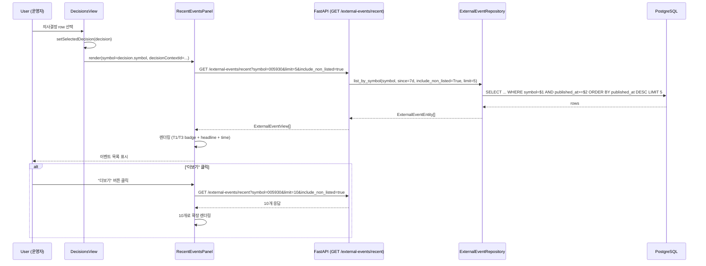
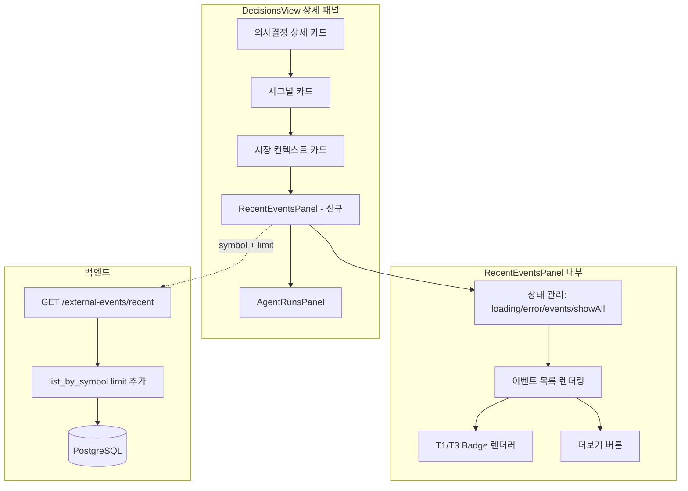

# Recent Events — DecisionsView 상세 패널 내 보조 섹션 추가 설계

## 1. 목적

T1(OpenDART) + T3(Seeded News) external events를 운영 화면 `DecisionsView`의 상세 패널 내 보조 섹션으로 노출하여 운영자가 의사결정 맥락에서 외부 이벤트를 즉시 확인할 수 있도록 한다.

---

## 2. 현재 구조 분석 (코드베이스 기반)

### 2.1 DecisionsView 상세 패널 레이아웃

현재 [`admin_ui/src/components/DecisionsView.tsx`](../admin_ui/src/components/DecisionsView.tsx:239) 상세 패널 구조 (위→아래):

```
┌─ 의사결정 상세 카드 ──────────────────────┐
│  Action banner + 메타데이터 + FDC + EI + AR │
└────────────────────────────────────────────┘
┌─ 시그널 카드 ──────────────────────────────┐
└────────────────────────────────────────────┘
┌─ 시장 컨텍스트 카드 (lines 398-442) ───────┐
│  contextDetail 표시 (strategy/account/session) │
│  (or empty state)                          │
└────────────────────────────────────────────┘
┌─ AgentRunsPanel (line 445) ────────────────┐
│  decisionContextId 기반 에이전트 실행 목록   │
└────────────────────────────────────────────┘
```

**→ 신규 "Recent Events" 카드는 시장 컨텍스트 카드와 AgentRunsPanel 사이에 삽입.**

### 2.2 백엔드 External Events 레이어

| 계층 | 파일 | 현황 |
|------|------|------|
| Entity | [`src/agent_trading/domain/entities.py`](../src/agent_trading/domain/entities.py:507) | `ExternalEventEntity` dataclass 존재 |
| Repository Protocol | [`src/agent_trading/repositories/contracts.py`](../src/agent_trading/repositories/contracts.py:643) | `list_by_symbol(symbol, since, include_non_listed=False)` — `limit` 파라미터 **없음** |
| Postgres Impl | [`src/agent_trading/repositories/postgres/external_events.py`](../src/agent_trading/repositories/postgres/external_events.py:91) | 동일 signature, `LIMIT` 절 **없음** |
| InMemory Impl | [`src/agent_trading/repositories/memory.py`](../src/agent_trading/repositories/memory.py:1065) | 동일 signature, slicing **없음** |
| Container | [`src/agent_trading/repositories/container.py`](../src/agent_trading/repositories/container.py:55) | `external_events: ExternalEventRepository` 이미 포함 |
| API Schema | [`src/agent_trading/api/schemas.py`](../src/agent_trading/api/schemas.py) | `ExternalEventView` Pydantic 모델 **없음** |
| API Router | [`src/agent_trading/api/routes/`](../src/agent_trading/api/routes) | external events 라우트 **없음** |
| API App | [`src/agent_trading/api/app.py`](../src/agent_trading/api/app.py:173) | 라우터 등록 필요 |
| Deps | [`src/agent_trading/api/deps.py`](../src/agent_trading/api/deps.py:17) | `get_repos` → `RepositoryContainer` 주입 — 변경 불필요 |

### 2.3 프런트엔드

| 계층 | 파일 | 현황 |
|------|------|------|
| 타입 | [`admin_ui/src/types/api.ts`](../admin_ui/src/types/api.ts) | `ExternalEventView` 타입 **없음** |
| API 클라이언트 | [`admin_ui/src/api/client.ts`](../admin_ui/src/api/client.ts) | `getRecentExternalEvents()` **없음** |
| 컴포넌트 | [`admin_ui/src/components/DecisionsView.tsx`](../admin_ui/src/components/DecisionsView.tsx) | recent-events 섹션 **없음** |
| Fixtures | [`admin_ui/src/__tests__/test-utils/fixtures.ts`](../admin_ui/src/__tests__/test-utils/fixtures.ts) | mock 데이터 **없음** |
| 테스트 | [`admin_ui/src/__tests__/decisions.test.tsx`](../admin_ui/src/__tests__/decisions.test.tsx) | recent-events 테스트 **없음** |

---

## 3. 설계 결정 사항

### 3.1 왜 별도 화면 대신 기존 화면 내 배치인가

- recent-events는 의사결정의 **보조 컨텍스트** (독립 업무 화면 성격 아님)
- DecisionsView는 이미 의사결정 + EI + AR + 시장 컨텍스트 표시 → 이벤트 데이터를 추가하기 자연스러운 흐름
- AgentRunsView/AgentRunDetailPanel은 Agent 실행 입/출력에 집중

### 3.2 신규 API 엔드포인트 설계

**엔드포인트**: `GET /external-events/recent`

**Query Parameters**:

| 파라미터 | 타입 | 기본값 | 설명 |
|----------|------|--------|------|
| `symbol` | str | **required** | 종목 코드 (Decision symbol에서 전달) |
| `limit` | int | `5` | 최대 응답 개수 (max: 10) |
| `include_non_listed` | bool | `true` | T3(seeded_news) 포함 여부 |

**Response**: `list[ExternalEventView]`

```json
[
  {
    "event_id": "uuid",
    "event_type": "Y|정기공시",
    "source_name": "opendart",
    "source_reliability_tier": "T1",
    "symbol": "005930",
    "headline": "...",
    "published_at": "2026-05-17T10:00:00Z",
    "source_tier": "T1"
  }
]
```

**`source_tier` 필드 추가 결정**: `source_reliability_tier`가 이미 entity에 존재하지만, API 응답에서 명시적으로 `source_tier` 필드를 포함해 프런트엔드 badge 렌더링 시 일관성 확보.

### 3.3 `limit` 파라미터 처리 전략

**결정: Repository 계층에 `limit` 파라미터 추가**

- `list_by_symbol()`에 `limit: int | None = None` 파라미터 추가
- Postgres: `LIMIT $N` 절 활용 (DB-level 효율)
- InMemory: slicing (성능 영향 미미, 소규모 데이터)
- API 라우트: Repository 호출 후 `limit` 전달

**변경되는 파일**:
- [`src/agent_trading/repositories/contracts.py`](../src/agent_trading/repositories/contracts.py:667) — `ExternalEventRepository.list_by_symbol`에 `limit` 추가
- [`src/agent_trading/repositories/postgres/external_events.py`](../src/agent_trading/repositories/postgres/external_events.py:91) — SQL `LIMIT` 적용
- [`src/agent_trading/repositories/memory.py`](../src/agent_trading/repositories/memory.py:1065) — slicing 적용

### 3.4 `since` 기본값 결정

API 레벨에서 기본값: **7일 전** (`datetime.now(timezone.utc) - timedelta(days=7)`)
- 선택적 `since` query parameter도 지원

### 3.5 프런트엔드 컴포넌트 분리 여부

**결정: 별도 [`RecentEventsPanel.tsx`](../admin_ui/src/components/RecentEventsPanel.tsx) 컴포넌트 생성**

- 재사용성: 향후 AgentRunsView 등에 연결 가능
- 관심사 분리: DecisionsView.tsx 복잡도 증가 방지
- Props: `symbol: string | null`, `decisionContextId: string | null`

---

## 4. 상세 구현 계획 (Todo List)

### Phase A: 백엔드 Repository 계층 수정

#### A1. `list_by_symbol`에 `limit` 파라미터 추가

**파일**: [`src/agent_trading/repositories/contracts.py`](../src/agent_trading/repositories/contracts.py:667)

```python
async def list_by_symbol(
    self,
    symbol: str,
    since: datetime,
    include_non_listed: bool = False,
    limit: int | None = None,  # ← 추가
) -> Sequence[ExternalEventEntity]:
    ...
```

#### A2. Postgres 구현에 LIMIT 적용

**파일**: [`src/agent_trading/repositories/postgres/external_events.py`](../src/agent_trading/repositories/postgres/external_events.py:91)

- SQL 쿼리에 `LIMIT $N` 추가
- `limit`이 `None`이면 LIMIT 생략 (기존 동작 유지)

#### A3. InMemory 구현에 slicing 적용

**파일**: [`src/agent_trading/repositories/memory.py`](../src/agent_trading/repositories/memory.py:1065)

```python
async def list_by_symbol(self, symbol, since, include_non_listed=False, limit=None):
    results = [...]
    results.sort(key=lambda item: item.published_at, reverse=True)
    if limit is not None:
        results = results[:limit]
    return tuple(results)
```

### Phase B: 백엔드 API 계층

#### B1. `ExternalEventView` Pydantic 모델 추가

**파일**: [`src/agent_trading/api/schemas.py`](../src/agent_trading/api/schemas.py)

```python
class ExternalEventView(BaseModel):
    """External event read model for the inspection API."""
    model_config = ConfigDict(from_attributes=True)

    event_id: str
    event_type: str
    source_name: str
    source_reliability_tier: str
    source_tier: str  # 명시적 필드 (badge 렌더링용)
    symbol: str | None = None
    headline: str | None = None
    published_at: datetime
```

#### B2. 신규 라우트 파일 생성

**파일**: [`src/agent_trading/api/routes/external_events.py`](../src/agent_trading/api/routes/external_events.py) (신규)

```python
"""External events inspection endpoints: GET /external-events/recent."""

from __future__ import annotations
from datetime import datetime, timezone, timedelta
from fastapi import APIRouter, Depends, Query
from agent_trading.api.deps import get_repos
from agent_trading.api.schemas import ExternalEventView
from agent_trading.repositories.container import RepositoryContainer

router = APIRouter(tags=["external_events"])

@router.get("/external-events/recent", response_model=list[ExternalEventView])
async def list_recent_external_events(
    symbol: str = Query(..., description="종목 코드"),
    limit: int = Query(5, ge=1, le=10, description="최대 개수"),
    include_non_listed: bool = Query(True, description="T3 seeded_news 포함"),
    since: datetime | None = Query(None, description="시작 시각 (기본: 7일 전)"),
    repos: RepositoryContainer = Depends(get_repos),
) -> list[ExternalEventView]:
    _since = since or (datetime.now(timezone.utc) - timedelta(days=7))
    events = await repos.external_events.list_by_symbol(
        symbol=symbol,
        since=_since,
        include_non_listed=include_non_listed,
        limit=limit,
    )
    return [
        ExternalEventView(
            event_id=str(e.event_id),
            event_type=e.event_type,
            source_name=e.source_name,
            source_reliability_tier=e.source_reliability_tier,
            source_tier=e.source_reliability_tier,
            symbol=e.symbol,
            headline=e.headline,
            published_at=e.published_at,
        )
        for e in events
    ]
```

#### B3. 라우터 등록

**파일**: [`src/agent_trading/api/app.py`](../src/agent_trading/api/app.py:239) (sessions 라우터 다음, line 242 이후 삽입)

```python
    # Phase L — External Events inspection
    from agent_trading.api.routes.external_events import router as external_events_router
    protected_routers.append(external_events_router)
```

### Phase C: 프런트엔드 타입/API 계층

#### C1. `ExternalEventView` 타입 추가

**파일**: [`admin_ui/src/types/api.ts`](../admin_ui/src/types/api.ts)

```typescript
export interface ExternalEventView {
  event_id: string;
  event_type: string;
  source_name: string;
  source_reliability_tier: string;
  source_tier: string;
  symbol: string | null;
  headline: string | null;
  published_at: string;
}
```

#### C2. `getRecentExternalEvents()` 함수 추가

**파일**: [`admin_ui/src/api/client.ts`](../admin_ui/src/api/client.ts:283) (getRecentSessionEvents 다음)

```typescript
export async function getRecentExternalEvents(
  symbol: string,
  limit: number = 5,
  include_non_listed: boolean = true
): Promise<import("../types/api").ExternalEventView[]> {
  const params = new URLSearchParams({ symbol, limit: String(limit), include_non_listed: String(include_non_listed) });
  return request<import("../types/api").ExternalEventView[]>(`/external-events/recent?${params}`);
}
```

### Phase D: 프런트엔드 UI 컴포넌트

#### D1. `RecentEventsPanel.tsx` 컴포넌트 생성

**파일**: [`admin_ui/src/components/RecentEventsPanel.tsx`](../admin_ui/src/components/RecentEventsPanel.tsx) (신규)

```typescript
interface RecentEventsPanelProps {
  symbol: string | null;
  decisionContextId: string | null;
}

// 주요 기능:
// 1. symbol prop으로 GET /external-events/recent 호출
// 2. 로딩/에러/empty 상태 처리
// 3. 각 row 표시: [T1/T3 badge] + source_name + headline(truncate 80자) + published_at + symbol
// 4. "더보기" 버튼 (기본 5개 → 10개)
// 5. 24시간/1주일/1개월 시간 필터 (선택)
// 6. decisionContextId가 null이면 "의사결정을 선택하면 최근 이벤트를 볼 수 있습니다" empty state
```

**상세 UI 구조**:

```
┌─ 최근 이벤트 (Recent Events) ──────────────────────────┐
│                                                         │
│  [T1] opendart · Y|정기공시 · 10분 전                  │
│        삼성전자 정기주주총회 결과...                     │
│                                                         │
│  [T3] naver_news · N|seeded_news · 30분 전             │
│        삼성전자, 2분기 실적 발표...                      │
│                                                         │
│  ─── 더보기 (5개 더) ───                                 │
└─────────────────────────────────────────────────────────┘
```

#### D2. DecisionsView에 RecentEventsPanel 통합

**파일**: [`admin_ui/src/components/DecisionsView.tsx`](../admin_ui/src/components/DecisionsView.tsx:442) (시장 컨텍스트 카드와 AgentRunsPanel 사이, line 442-444 사이 삽입)

```typescript
import RecentEventsPanel from "./RecentEventsPanel";

// ... (Market Context card, line 442)

            {/* Recent Events card */}
            {selectedDecision?.symbol && (
              <RecentEventsPanel
                symbol={selectedDecision.symbol}
                decisionContextId={selectedDecision.decision_context_id}
              />
            )}

            {/* Agent Runs card */}
            <AgentRunsPanel ... />
```

### Phase E: 테스트

#### E1. 백엔드 테스트 — Repository `limit` 파라미터

**파일**: [`tests/repositories/test_external_events.py`](../tests/repositories/test_external_events.py)

InMemory에 `limit` 동작 테스트 케이스 추가:
- `test_inmemory_list_by_symbol_with_limit` — 5개 중 3개만 반환 확인
- Postgres에도 동일 테스트 추가 (별도 pytest.mark.parametrize)

#### E2. 백엔드 테스트 — API 엔드포인트

**파일**: [`tests/api/test_external_events.py`](../tests/api/test_external_events.py) (신규)

- `test_list_recent_external_events` — 정상 응답
- `test_list_recent_external_events_missing_symbol` — 422 검증
- `test_list_recent_external_events_limit_validation` — limit 범위 검증

#### E3. 프런트엔드 테스트

**파일**: [`admin_ui/src/__tests__/test-utils/fixtures.ts`](../admin_ui/src/__tests__/test-utils/fixtures.ts)

```typescript
export const mockRecentExternalEvents: ExternalEventView[] = [
  { event_id: "uuid-1", event_type: "Y|정기공시", source_name: "opendart",
    source_reliability_tier: "T1", source_tier: "T1", symbol: "005930",
    headline: "삼성전자 정기주주총회 결과 공시", published_at: "2026-05-17T09:00:00Z" },
  { event_id: "uuid-2", event_type: "N|seeded_news", source_name: "naver_news",
    source_reliability_tier: "T3", source_tier: "T3", symbol: "005930",
    headline: "삼성전자, 2분기 실적 발표 예상", published_at: "2026-05-17T08:30:00Z" },
];
```

**파일**: [`admin_ui/src/__tests__/decisions.test.tsx`](../admin_ui/src/__tests__/decisions.test.tsx)

```typescript
// decisions.test.tsx — 기존 파일에 추가
// 1. recent-events 섹션 렌더 테스트 (결정 선택 시)
// 2. T1 badge (파란색) / T3 badge (회색) 스타일 확인
// 3. "더보기" 버튼 → 10개 로드
// 4. symbol 없을 때 empty state (이벤트 메시지)
// 5. API 500 시 fallback (에러 메시지 표시)
```

---

## 5. 데이터 흐름 (Sequence Diagram)



---

## 6. 컴포넌트 계층도



---

## 7. 변경 파일 요약

### 신규 파일 (3개)

| 파일 | 설명 |
|------|------|
| [`src/agent_trading/api/routes/external_events.py`](src/agent_trading/api/routes/external_events.py) | `GET /external-events/recent` 엔드포인트 |
| [`admin_ui/src/components/RecentEventsPanel.tsx`](admin_ui/src/components/RecentEventsPanel.tsx) | Recent Events UI 컴포넌트 |
| [`tests/api/test_external_events.py`](tests/api/test_external_events.py) | API 엔드포인트 테스트 |

### 수정 파일 (9개)

| 파일 | 변경 내용 |
|------|-----------|
| [`src/agent_trading/repositories/contracts.py`](src/agent_trading/repositories/contracts.py:667) | `list_by_symbol` + `list_by_type`에 `limit` 파라미터 추가 |
| [`src/agent_trading/repositories/postgres/external_events.py`](src/agent_trading/repositories/postgres/external_events.py:91) | SQL `LIMIT` 절 추가 |
| [`src/agent_trading/repositories/memory.py`](src/agent_trading/repositories/memory.py:1065) | 결과 slicing 처리 |
| [`src/agent_trading/api/schemas.py`](src/agent_trading/api/schemas.py) | `ExternalEventView` Pydantic 모델 추가 |
| [`src/agent_trading/api/app.py`](src/agent_trading/api/app.py:242) | external_events 라우터 등록 |
| [`admin_ui/src/types/api.ts`](admin_ui/src/types/api.ts) | `ExternalEventView` 타입 추가 |
| [`admin_ui/src/api/client.ts`](admin_ui/src/api/client.ts:283) | `getRecentExternalEvents()` 함수 추가 |
| [`admin_ui/src/components/DecisionsView.tsx`](admin_ui/src/components/DecisionsView.tsx:442) | RecentEventsPanel 통합 (import + JSX) |
| [`admin_ui/src/__tests__/test-utils/fixtures.ts`](admin_ui/src/__tests__/test-utils/fixtures.ts) | mockRecentExternalEvents fixture 추가 |

### 수정 필요 테스트 파일 (2개)

| 파일 | 변경 내용 |
|------|-----------|
| [`tests/repositories/test_external_events.py`](tests/repositories/test_external_events.py) | `limit` 파라미터 테스트 케이스 추가 |
| [`admin_ui/src/__tests__/decisions.test.tsx`](admin_ui/src/__tests__/decisions.test.tsx) | Recent Events 섹션 테스트 추가 |

---

## 8. 실행 체크리스트

### Phase 1: Repository 계층
- [ ] `contracts.py` — `list_by_symbol`에 `limit` 추가 (`list_by_type`도 동일하게 추가)
- [ ] `postgres/external_events.py` — SQL `LIMIT` 적용
- [ ] `memory.py` — 결과 slicing 적용
- [ ] `tests/repositories/test_external_events.py` — limit 테스트 추가, `pytest` 통과 확인

### Phase 2: API 계층
- [ ] `schemas.py` — `ExternalEventView` 모델 추가
- [ ] `routes/external_events.py` — 신규 파일 생성
- [ ] `app.py` — 라우터 등록
- [ ] `tests/api/test_external_events.py` — 신규 파일, `pytest` 통과 확인

### Phase 3: 프런트엔드 타입/API
- [ ] `types/api.ts` — `ExternalEventView` 인터페이스 추가
- [ ] `api/client.ts` — `getRecentExternalEvents()` 함수 추가

### Phase 4: 프런트엔드 UI
- [ ] `components/RecentEventsPanel.tsx` — 신규 컴포넌트
  - [ ] `GET /external-events/recent` 호출 (symbol, limit)
  - [ ] 로딩 상태 (LoadingSpinner)
  - [ ] 에러 상태 (ErrorBanner)
  - [ ] empty state ("이벤트가 없습니다.")
  - [ ] "더보기" 버튼 (기본 5 → 10)
  - [ ] T1 badge (파란색 `bg-blue-50 text-blue-700 border-blue-200`)
  - [ ] T3 badge (회색 `bg-gray-50 text-gray-700 border-gray-200`)
  - [ ] headline 80자 truncate
  - [ ] `formatKstDateTime` 적용한 published_at
- [ ] `components/DecisionsView.tsx` — RecentEventsPanel import 및 삽입
  - [ ] 시장 컨텍스트 카드 아래, AgentRunsPanel 위에 배치

### Phase 5: 테스트
- [ ] `test-utils/fixtures.ts` — `mockRecentExternalEvents` fixture 추가
- [ ] `decisions.test.tsx` — recent-events 섹션 테스트
  - [ ] 결정 선택 시 recent-events 섹션 렌더
  - [ ] T1/T3 badge 표시 확인
  - [ ] "더보기" 동작 확인
  - [ ] symbol 없을 때 메시지 확인
  - [ ] API 500 시 fallback 확인
- [ ] `npm run build` 통과 확인
- [ ] Docker rebuild + `/health` 확인

---

## 9. 위험 요소 및 고려 사항

### 9.1 API 호출 타이밍
- `DecisionsView`에서 결정 선택 시 `contextDetail`은 lazy-load (별도 `useEffect`), `RecentEventsPanel`은 `symbol`이 있을 때 즉시 로드
- 동시에 여러 API 호출이 발생할 수 있으나 이는 기존 패턴과 동일

### 9.2 stale response guard
- `contextDetail` fetch에 이미 stale-response guard 패턴 존재 (line 77-115)
- `RecentEventsPanel`도 동일 패턴 적용 필요:
  ```typescript
  useEffect(() => {
    if (!symbol) return;
    const cancelled = false;
    fetchEvents(symbol).then(data => { if (!cancelled) setEvents(data); });
    return () => { cancelled = true; };
  }, [symbol]);
  ```

### 9.3 headline truncate
- 한글 80자 = 약 80자, 영문 80자와 동일하게 처리
- `headline.length > 80 ? headline.slice(0, 80) + '...' : headline`

### 9.4 T3 seeded_news 포함 기본값
- API 기본값 `include_non_listed=True`로 설정
- 이는 T3 seeded_news(event_type=`N|seeded_news`)가 기본으로 포함됨을 의미
- T1 + T3 모두 운영자가 확인 가능

---

## 10. 향후 확장 포인트 (Follow-up)

- AgentRunsPanel에 later-phase TODO 연결 포인트
- recent-events item click 시 raw metadata detail dialog (선택)
- RecentEventsPanel을 AgentRunsView에도 연결 (필요시)
- 시간 범위 필터 (24h / 1w / 1m) UI 추가 (선택)
