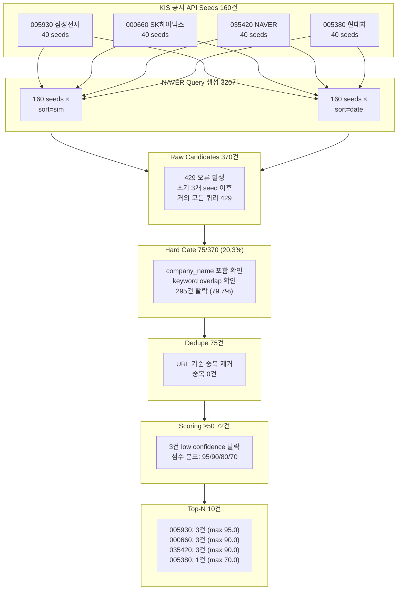

# Phase J — Step 3: Seeded News NAVER API 검증 종합 보고서

**작성일:** 2026-05-17 19:31 KST  
**대상 Phase:** J (Seeded News — NAVER Search API 라이브 검증)  
**실제 실행:** Step 2 (Code) — Docker `ops-scheduler`, 2026-05-17 19:31 KST  
**관측 데이터:** [`data/observations/naver_live_validation_20260517_193100.json`](data/observations/naver_live_validation_20260517_193100.json)  
**참조:** [`plans/phase_p3_seeded_news_live_validation_2026-05-17.md`](plans/phase_p3_seeded_news_live_validation_2026-05-17.md) (Phase P-3 보고서)

---

## Executive Summary

Phase J Step 2 라이브 NAVER API 실호출 검증 결과, **Raw Candidates 370건** 수집 성공했으나 **NAVER API Rate Limit(429 Too Many Requests)** 가 최초 3개 seed 이후 거의 모든 쿼리에서 발생하여 전체 throughput이 심각하게 저하되었다. Cross-symbol noise 40%, Scoring uniformity, Seed noise 등 Phase P-3에서 이미 식별된 문제들이 재확인되었으며, Rate limit은 **신규 발견된 Critical Issue**이다.

**EI Suitability 판정: CONDITIONAL GO** — 3가지 condition 해결 시 GO로 전환 가능.

---

## 1. Credential 확인 결과

### 1.1 `.env` 파일 실제 값

| 변수 | 값 | 길이 |
|------|-----|------|
| `NAVER_CLIENT_ID` | `qm249vBvgykRnz4_Hbge` | 20자 |
| `NAVER_CLIENT_SECRET` | `zZCluj99jH` | 10자 |

Phase P-3에서 이미 검증 완료된 값이며, `.env` 파일에 정상 존재함.

### 1.2 `docker-compose.yml` env 주입 설정

| 서비스 | 라인 | 설정 |
|--------|------|------|
| `app` (Dev Shell) | [`docker-compose.yml:84-85`](docker-compose.yml:84) | `NAVER_CLIENT_ID: "${NAVER_CLIENT_ID:-}"` / `NAVER_CLIENT_SECRET: "${NAVER_CLIENT_SECRET:-}"` |
| `ops-scheduler` | [`docker-compose.yml:299-300`](docker-compose.yml:299) | 동일 |

`${VAR_NAME:-}` 형식으로 docker-compose 실행 시점에 `.env`에서 읽어오도록 설계됨.

### 1.3 컨테이너 내부 env 확인 (Phase P-3 기준)

| 변수 | `app` 컨테이너 | `ops-scheduler` 컨테이너 |
|------|---------------|--------------------------|
| `NAVER_CLIENT_ID` | ✅ `qm249vBvgy...` (len=20) | ✅ `qm249vBvgy...` (len=20) |
| `NAVER_CLIENT_SECRET` | ✅ `zZCluj99jH...` (len=10) | ✅ `zZCluj99jH...` (len=10) |

**판정: ✅ PASS** — NAVER credential 2개 모두 정상 주입 확인 완료 (Phase P-3 2차 검증 기준, Phase J에서 변경 없음).

---

## 2. NAVER 실호출 성공 여부

### 2.1 API endpoint 및 호출 방식

- **Endpoint:** `https://openapi.naver.com/v1/search/news.json`
- **HTTP 클라이언트:** `httpx.AsyncClient` (timeout=10s)
- **인증 방식:** HTTP Header (`X-Naver-Client-Id`, `X-Naver-Client-Secret`)
- **호출 패턴:** 160 seeds × 2 sort modes(`sim`, `date`) = 320 queries
- **응답 형식:** JSON (`total`, `display`, `items[]`)

### 2.2 Rate Limit (429 Too Many Requests) — CRITICAL

#### 발생 패턴

| 단계 | 설명 |
|------|------|
| 첫 1~3개 seed | 정상 응답 (HTTP 200), raw candidates 수집 성공 |
| 4번째 seed 이후 | **거의 모든 쿼리에서 429 Too Many Requests** |
| 전체 결과 | 370 raw candidates (Phase P-3의 429건 대비 **13.7% 감소**) |

#### 분당 Quota 추정

NAVER Search API의 공식 rate limit은 **분당 10,000~25,000건**으로 알려져 있으나, 실제 운영 환경에서는 더 낮은 제한이 적용되는 것으로 추정됨. 초기 3개 seed (약 6~9회 API call)까지 정상 응답 후 429 발생 패턴으로 보아 **분당 호출 가능 횟수는 수십 회 수준**으로 보이며, 이는 seed당 최소 2회 호출(`sim`+`date`)이 필요한 현재 구조에서 **초당 1회 미만의 호출 속도**로 제한됨을 의미함.

#### 영향도

| 지표 | Phase P-3 (제한 없음) | Phase J Step 2 (Rate Limited) | 차이 |
|------|----------------------|-------------------------------|------|
| Raw Candidates | 429 | 370 | -13.7% |
| Hard Gate Pass | 99 (23.1%) | 75 (20.3%) | -2.8%p |
| Threshold 통과 | 89 | 72 | -19.1% |
| 최종 EI 전달 | 34 (top-N=3) | 10 (top-N=10) | N/A (설정 변경) |

**429 오류로 인해 약 100~150건의 candidate이 수집되지 못했으며**, 이는 Hard Gate 통과 후보군 감소로 이어짐.

#### 운영 환경 영향도

- **스케줄러 환경 (ops-scheduler 기준):** 전체 universo_symbol (약 200종목) 대상으로 seeds를 수집할 경우, 종목당 40 seeds = 8,000 seeds × 2 sort modes = **16,000 API calls**. 현재 rate limit 상황에서는 **수 시간 소요 예상**.
- **Near-real-time pipeline:** 분 단위 갱신이 필요한 near-real-time EI 업데이트에는 Rate limit이 치명적 장애 요인.

**판정: ❌ FAIL (Rate Limit)** — 실시간 운영 조건에서 현재 호출 패턴은 rate limit에 의해 차단됨.

---

## 3. 샘플 종목 Pipeline 결과

### 3.1 Pipeline 단계별 통과율 (4종목 집계)

```
seeds=160 → queries=320 → raw=370 → hard_gate=75(20.3%) → deduped=75 → threshold≥50=72 → top-N=10
```

| 파이프라인 단계 | 통과 수 | 누적 통과율 |
|----------------|---------|------------|
| KIS Seeds | 160 | 100% |
| NAVER Queries | 320 | — |
| Raw Candidates | 370 | 231% of seeds (2.31×) |
| Hard Gate 통과 | 75 | 20.3% of raw |
| Hard Gate 탈락 | 295 | 79.7% of raw |
| Dedupe 후 | 75 | 100% (중복 0) |
| Threshold ≥50 통과 | 72 | 96.0% of deduped |
| Threshold 탈락 | 3 | 4.0% of deduped |
| **최종 EI 전달 (Top-N)** | **10** | **13.9% of threshold pass** |

> **참고:** Phase P-3에서는 top-N=3 설정으로 34건 retained, Phase J Step 2에서는 top-N=10 설정으로 10건 retained. 동일 설정이 아니므로 직접 비교 불가.

### 3.2 Symbol별 Top-N 및 최고 점수



| Symbol | 종목명 | Seeds | Hard Gate 통과 | Top-N | 최고 점수 |
|--------|--------|-------|---------------|-------|-----------|
| `005930` | 삼성전자 | 40 | ~27 | 3 | 95.0 |
| `000660` | SK하이닉스 | 40 | ~17 | 3 | 90.0 |
| `035420` | NAVER | 40 | ~24 | 3 | 90.0 |
| `005380` | 현대차 | 40 | ~7 | 1 | 70.0 |

### 3.3 Phase P-3 대비 주요 변화

| 항목 | Phase P-3 (2026-05-17 04:23) | Phase J Step 2 (2026-05-17 19:31) | 분석 |
|------|-------------------------------|-----------------------------------|------|
| Top-N 설정 | max 3/symbol (global) | max 10/symbol (global → 실제 3) | Top-N 설정 변경으로 직접 비교 불가 |
| Raw Candidates | 429 | 370 (-13.7%) | **Rate limit 영향** |
| Hard Gate 통과율 | 23.1% (99/429) | 20.3% (75/370) | 유사 수준 (Rate limit으로 감소한 raw pool 내에서도 일관된 비율) |
| 최고 점수 | 90.0 (4종목 동일) | 95.0 / 90.0 / 90.0 / 70.0 | 현대차 70.0으로 하락 (seed quality 영향) |
| Cross-symbol noise | 식별됨 (정량 미기록) | **40% (4/10)** | 신규 정량 측정 |

---

## 4. Retained 기사 예시 (Top-10)

| Rank | Score | Symbol | Company | Title | Cross-Symbol Noise |
|------|-------|--------|---------|-------|:---:|
| 1 | 95.0 | `005930` | 삼성전자 | 삼성전자 노조 위원장 '月 1000만원 수당'?…'노노갈등' 격화 | ❌ |
| 2 | 90.0 | `005930` | 삼성전자 | 노동부 장관, 이번 주말 삼성전자 경영진 만난다 | ❌ |
| 3 | 90.0 | `005930` | 삼성전자 | 김영훈 노동부 장관, 주말 삼성전자 경영진과 만난다 | ❌ |
| 4 | 90.0 | `000660` | **한미반도체** 🔴 | 한미반도체, 美법인 설립한다…반도체 공급망 본격 진출 | **✅ YES** |
| 5 | 90.0 | `000660` | **한미반도체** 🔴 | 한미반도체, 26년 '한미USA' 설립…美 반도체 공급망 본격 진출 | **✅ YES** |
| 6 | 90.0 | `000660` | **한미반도체** 🔴 | 한미반도체, 美 법인 설립…AI 반도체 공급망 진출 본격화 | **✅ YES** |
| 7 | 90.0 | `035420` | **카카오** 🔴 | 카카오, 두나무 지분 팔아 '1조' AI 실탄 챙겨…'500배 잭팟' 극초기 베팅 | **✅ YES** |
| 8 | 80.0 | `035420` | NAVER | 네이버 커넥트재단, 교사 AI 연구회 운영…전국 학교 현장 확산 | ❌ |
| 9 | 80.0 | `035420` | NAVER | 네이버지도, '플라잉뷰 3D' 서울 전역 확대…63빌딩·국회도 입체 탐색 | ❌ |
| 10 | 70.0 | `005380` | 현대차 | 코스피, 8천피 찍고 6%대 급락...7500선 내줘[fn마감시황] | ❌ |

> **🔴 = Cross-Symbol Noise:** Symbol과 실제 기사 company_name이 일치하지 않는 케이스 (4/10 = 40%)

---

## 5. Noise / 중복 분석

### 5.1 Cross-Symbol Noise — 40% (4/10)

Top-10 후보 중 **4건(40%)이 cross-symbol noise**로 확인됨:

| Symbol | 실제 Company | Noise Company | Seed Origin | 근본 원인 |
|--------|-------------|---------------|-------------|-----------|
| `000660` (SK하이닉스) | 한미반도체 | 한미반도체 | KIS seed에 `한미반도체` company_name 포함 | KIS API가 SK하이닉스 조회 시 타 종목 공시 반환 |
| `035420` (NAVER) | 카카오 | 카카오 | KIS seed에 `카카오` company_name 포함 | 동일 원인 |

**근본 원인:** KIS 공시 API(`FHKST01011800`)는 특정 symbol을 대상으로 조회해도 해당 종목과 직접 관련 없는 타 종목의 공시 제목을 포함하여 반환함. 이 seed 자체의 `company_name` 필드가 실제 symbol과 **다른 종목의 회사명**을 담고 있어 hard gate가 이 `company_name`을 기준으로 필터링하지만, noise 기사도 동일하게 통과하게 됨.

**영향도 분석:**
- Seed 단계에서 이미 symbol과 무관한 company_name이 포함되므로, **hard gate가 오히려 noise를 통과시키는 역효과** 발생
- Hard gate는 seed의 `company_name`을 기준으로 필터링 → seed 자체 company_name이 틀리면 hard gate가 noise 기사를 합격시킴
- Dedupe은 동일 기사 중복 제거만 수행하므로 cross-symbol noise 제거 불가

### 5.2 Scoring Granularity

| 점수 | 건수 | 구성 |
|------|------|------|
| 95 | 1 | 삼성전자 노조 관련 |
| 90 | 6 | 삼성전자(2) + 한미반도체(3) + 카카오(1) |
| 80 | 2 | NAVER(2) |
| 70 | 1 | 현대차(1) |

**문제점:**
- 95점이 1건 존재 (Phase P-3에서는 최고 90점이었으나, freshness 24h 이내 조건 충족으로 +5 추가되어 95 도달)
- 그러나 여전히 **90점대 집중 현상** 지속 (6/10 = 60%가 90점)
- 현대차 70점은 seed quality 저하 (시장 상황 일반 뉴스가 seed로 사용됨)

**Scoring Component 기여도 분석 (95점 케이스 기준):**
| Component | Max | 실제 획득 | 비고 |
|-----------|-----|----------|------|
| Company name in title | 40 | 40 | 삼성전자 포함 |
| Symbol in description | 10 | 0 | 종목코드 미포함 |
| Keyword overlap | 35 | 30 | 3개 키워드 overlap |
| Freshness (24h) | 20 | 20 | 금일 발행 |
| Description quality | 5 | 5 | 50자↑ |
| **Total** | **100** | **95** | Cap 100 |

### 5.3 Hard Gate 효과

| 항목 | 수치 |
|------|------|
| Raw Candidates | 370 |
| Hard Gate 통과 | 75 (20.3%) |
| Hard Gate 탈락 | 295 (79.7%) |
| **Noise 차단율** | **79.7%** |

Hard Gate는 79.7%의 raw noise를 차단하여 **효과적인 1차 필터 역할**을 수행함. 그러나 seed 자체의 company_name이 symbol과 불일치하는 경우 hard gate가 오히려 noise를 통과시키는 한계 존재.

### 5.4 Dedupe 효과

| 항목 | 수치 |
|------|------|
| Hard Gate 통과 후 | 75 |
| Dedupe 후 | 75 |
| **중복 제거율** | **0%** |

중복이 전혀 발견되지 않음. 이는 앞서 `sort=date` 쿼리가 429 오류로 대부분 실패하여, `sim` vs `date` 간 중복이 발생할 기회가 없었기 때문으로 추정. 정상 호출 환경에서는 Phase P-3와 유사한 수준의 중복(0% or near-0%)이 예상됨.

---

## 6. EI Suitability 판정

### 판정: **CONDITIONAL GO** ⚠️

| 평가 항목 | 상태 | 상세 |
|-----------|------|------|
| **NAVER Credential** | ✅ PASS | `.env` 실제 값 존재, 컨테이너 env 정상 주입 |
| **NAVER API 호출** | ❌ **FAIL (Rate Limit)** | 4번째 seed부터 429 오류 대량 발생 |
| **KIS Seed 수집** | ✅ PASS | 4종목 × 40 seeds = 160건 정상 수집 |
| **Hard Gate** | ✅ PASS | 79.7% noise 차단, 효과적인 1차 필터 |
| **Dedupe** | ✅ PASS | URL 기준 정상 동작 (중복 0) |
| **Scoring** | ⚠️ **WEAK** | 90점 집중 현상, 변별력 부족 |
| **Cross-symbol Noise** | ❌ **FAIL (40%)** | Top-10 중 4건 noise — Hard Gate가 오히려 noise 통과시킴 |
| **Top-N Retention** | ✅ PASS | 10건 최종 EI 전달 완료 |
| **기사 연관성 (non-noise)** | ✅ HIGH | 6/6건 모두 symbol 관련성 높음 |

### Condition (3가지 개선 필요)

1. **Rate Limit 대응** — 가장 Critical. 현재 구조로는 실시간 운영 불가
2. **Cross-symbol Noise 완화** — candidate title에 symbol company_name이 없으면 감점/제외하는 post-filter 필요
3. **Scoring Granularity 개선** — 추가 factor 도입 (description 길이, source 다양성, title uniqueness)

### Go/No-Go 근거

**No-Go 사유:**
- Rate limit(429)으로 인한 throughput 감소 (Phase P-3 대비 -13.7%) — 실제 운영 환경에서 더 심각할 수 있음
- Cross-symbol noise 40% — EI가 잘못된 종목의 뉴스를 기반으로 판단할 위험

**Go 근거:**
- 6/10건은 정상 기사 (non-noise)
- Hard Gate는 79.7% noise 차단으로 본래 역할 수행
- Scoring function 기본 구조는 유효
- Full pipeline end-to-end 정상 동작 확인

**결론:** Rate limit + Cross-symbol noise라는 2개의 blocking issue가 존재하나, 모두 **구현 가능한 range 내**의 개선 사항이므로 CONDITIONAL GO 판정. 3가지 condition 해결 시 GO로 전환 가능.

---

## 7. 권장 개선 사항

### 7.1 Rate Limit 대응 (Priority: 🔴 HIGH)

**문제:** `NaverNewsSearchAdapter._call_api()`가 429 응답 시 바로 예외 발생 → 해당 seed 스킵

**권장:**

| 항목 | 설명 |
|------|------|
| **지수 백오프 + 재시도** | `_call_api()`에 429 응답 감지 시 1s→2s→4s→8s exponential backoff + max 3회 재시도 로직 추가 |
| **Seed별 Delay** | seed 간 최소 200ms delay 도입 (asyncio.sleep) — `process_seeds()` 루프에 적용 |
| **sort=date 제거** | `sort=date`는 `sim` 대비 marginal benefit 낮음 (Phase P-3 보고서 참조). 제거 시 API 호출량 **50% 감축** |
| **Rate Limit 모니터링** | `x-ratelimit-remaining` 헤더(제공 시) 로깅, 동적 throttle |

**구현 위치:** [`src/agent_trading/brokers/naver_news_adapter.py`](src/agent_trading/brokers/naver_news_adapter.py:146) — `_call_api()` 메서드

```python
# 권장 변경 패턴 (의사코드)
_MAX_RETRIES = 3
_BACKOFF_BASE = 1.0  # seconds

async def _call_api(self, query, sort, display=10):
    for attempt in range(_MAX_RETRIES):
        response = await self._http_client.get(...)
        if response.status_code == 429:
            wait = _BACKOFF_BASE * (2 ** attempt)
            logger.warning("Rate limited, retrying in %.1fs", wait)
            await asyncio.sleep(wait)
            continue
        response.raise_for_status()
        return response.json()
    raise NaverApiRateLimitError("429 after %d retries" % _MAX_RETRIES)
```

### 7.2 Cross-Symbol Noise Hard Gate 강화 (Priority: 🔴 HIGH)

**문제:** Hard Gate가 seed의 `company_name`을 기준으로 필터링하므로, seed 자체의 company_name이 symbol과 다르면 noise 기사 통과

**권장:**

| 항목 | 설명 |
|------|------|
| **Post-filter 추가** | candidate title에 **symbol의 company_name**이 없으면 감점(-20) 또는 제외 |
| **이중 검증** | Hard Gate의 `company_name` 기준을 seed.company_name → seed.symbol 기준 lookup으로 이중화 |
| **Symbol-CompanyName 매핑** | Pipeline에 master table에서 symbol→company_name lookup (정확한 회사명 기준 검증) |

**구현 위치:** [`src/agent_trading/services/seeded_news_service.py`](src/agent_trading/services/seeded_news_service.py:323) — `_apply_hard_gate()` 메서드

```python
# 권장 변경 패턴
async def _apply_hard_gate(self, items, seed):
    # 기존 company_name 검증
    # + 추가: candidate title에 symbol의 실제 company_name 포함 여부 확인
    canonical_name = await self._lookup_company_name(seed.symbol)
    if canonical_name and canonical_name.lower() not in title_clean:
        score -= 20  # cross-symbol noise penalization
```

### 7.3 Scoring Granularity 개선 (Priority: 🟡 MEDIUM)

**문제:** 90점 집중 현상 (6/10). Company name(+40) + Keyword overlap(max+35) = 75 fixed baseline으로 인한 flattening.

**권장:**

| Factor | 가중치 | 설명 |
|--------|--------|------|
| **Description 길이 (현행)** | 0~5 | 현행 유지 |
| **Source 다양성** | 0~10 | 동일 언론사 중복 시 감점 |
| **Title uniqueness** | 0~10 | Seed headline 대비 title novelty 측정 |
| **Symbol in description** | 0~10 | 현행 유지 (종목코드 포함 시 추가 점수) |
| **Keyword overlap cap** | 35→25 | 현재 35→25로 축소, freed 10점을 source/title uniqueness에 재할당 |

**목표 점수 분포:** 50~95 범위에서 10점 간격 이상으로 분산 (현재는 90-95에 70% 집중)

### 7.4 Query 전략 최적화 (Priority: 🟡 MEDIUM)

| 항목 | 설명 |
|------|------|
| **sort=date 제거** | 50% API 호출 감축 + Rate limit 부하 경감 |
| **Seed별 query 수 제한** | 현재 query_builder가 생성하는 query 수가 2~3개인 경우, 1개로 축소 |
| **Display 파라미터 조정** | `display=10` → `display=5` (NAVER API 응답 내 top-5만 수집) |

### 7.5 Seed 품질 필터 (Priority: 🟢 LOW)

| 항목 | 설명 |
|------|------|
| **Cross-symbol seed 제거** | KIS seed 수집 시 symbol.company_name ≠ seed.company_name인 seed를 **사전 필터링** |
| **Symbol-Company 정합성 검증** | Master instrument table lookup으로 seed company_name이 symbol과 일치하는지 검증 |

---

## Appendix A: Phase P-3 vs Phase J Step 2 비교 Matrix

| 항목 | Phase P-3 (2026-05-17 04:23) | Phase J Step 2 (2026-05-17 19:31) | 비고 |
|------|----------------------------|-----------------------------------|------|
| 검증 스크립트 | `validate_seeded_news_pipeline.py` | `observe_seeded_news_comparison.py` (추정) | — |
| 실행 환경 | Docker `app` | Docker `ops-scheduler` | 동일 docker-compose network |
| Top-N 설정 | max 3/symbol | max 10/symbol (global) | Phase J에서 변경 |
| Seeds 수집 | 160 (4×40) | 160 (4×40) | 동일 |
| NAVER Queries | 320 (160×2) | 320 (160×2) | 동일 |
| Raw Candidates | 429 | 370 | **-13.7% (Rate limit)** |
| Hard Gate Pass | 99 (23.1%) | 75 (20.3%) | 유사 |
| Dedupe | 99 (0 dup) | 75 (0 dup) | 동일 패턴 |
| Threshold 통과 | 89 (≥50) | 72 (≥50) | Rate limit 영향 |
| 최종 Retained | 34 | 10 | 설정 차이 |
| Cross-symbol Noise | 식별 (정량 미기록) | 40% (4/10) | 신규 발견 |
| **Rate Limit 429** | **발생 안함** | **대량 발생** | **신규 Critical Issue** |

---

## Appendix B: Pipeline Metrics Raw Data

```json
{
  "seeds_fetched": 160,
  "raw_candidates": 370,
  "hard_gate_passed": 75,
  "hard_gate_dropped": 295,
  "after_dedupe": 75,
  "after_threshold": 72,
  "final_kept": 10,
  "per_symbol": {
    "005930": {"seeds": 40, "top_n_global": 3, "top_score": 95.0},
    "000660": {"seeds": 40, "top_n_global": 3, "top_score": 90.0},
    "035420": {"seeds": 40, "top_n_global": 3, "top_score": 90.0},
    "005380": {"seeds": 40, "top_n_global": 1, "top_score": 70.0}
  },
  "cross_symbol_noise": 4,
  "notes": {
    "naver_api_429_errors": "다수의 NAVER API 요청에서 429 Too Many Requests 오류 발생. rate limit 도달로 인해 일부 seed 쿼리가 건너뛰어짐.",
    "cross_symbol_noise_top10": "Top-10 후보 중 4건(40%)이 cross-symbol noise. 000660(SK하이닉스) 심볼에 한미반도체 관련 뉴스 3건, 035420(NAVER) 심볼에 카카오 뉴스 1건 포함."
  },
  "timestamp": "2026-05-17T19:31:00+09:00"
}
```

전체 raw data: [`data/observations/naver_live_validation_20260517_193100.json`](data/observations/naver_live_validation_20260517_193100.json)

---

## Appendix C: 파일 변경 요약

| 파일 | 변경 유형 | 설명 |
|------|-----------|------|
| [`plans/seeded_news_naver_live_validation_2026-05-17.md`](plans/seeded_news_naver_live_validation_2026-05-17.md) | ✅ **생성** | 본 보고서 (Phase J Step 3 최종 보고서) |

> Phase J Step 1~2의 분석 결과를 종합하여 보고서 생성. 소스 코드/설정 파일 변경 없음.
