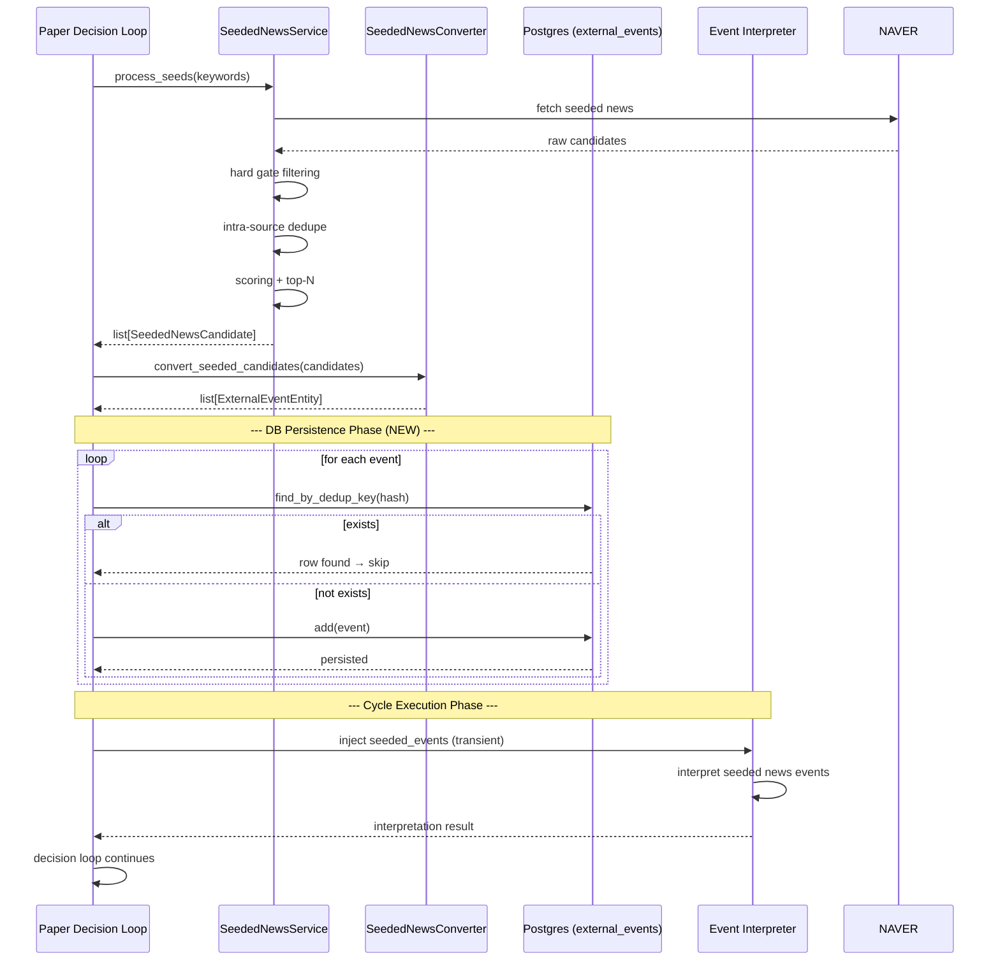
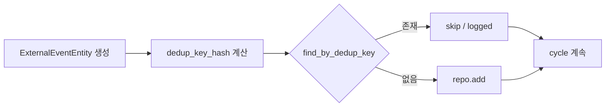
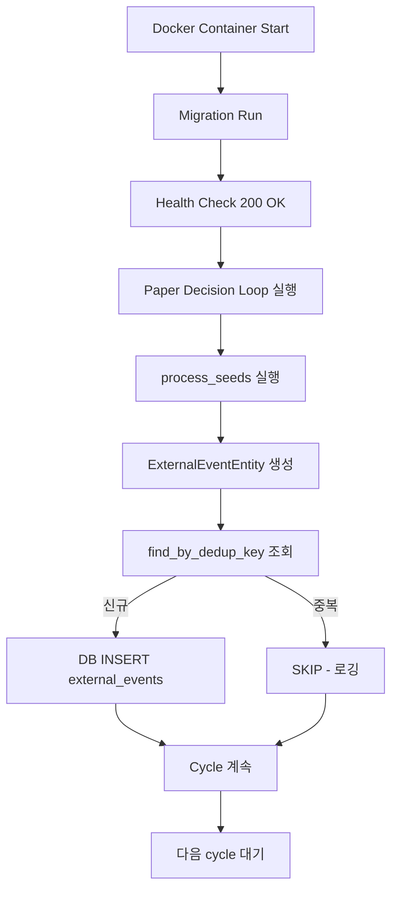

# T3 Seeded News DB Persistence 도입 — 최종 보고서

> **Phase L** — `naver_news_seeded` 이벤트의 PostgreSQL 영구 저장소 도입
> 작성일: 2026-05-17 | 상태: **✅ 구현 완료**

---

## 목차

1. [Persistence 필요성](#1-persistence-필요성)
2. [저장 시점](#2-저장-시점)
3. [Dedup 정책](#3-dedup-정책)
4. [Metadata Provenance 설계](#4-metadata-provenance-설계)
5. [테스트 결과](#5-테스트-결과)
6. [DB/운영 검증 결과](#6-db운영-검증-결과)
7. [남은 Follow-up](#7-남은-follow-up)

---

## 1. Persistence 필요성

### 1.1 Transient (In-Memory Only) 방식의 문제점

Phase K까지 `naver_news_seeded` 이벤트는 메모리 상에서만 유지되고 DB에 저장되지 않았습니다. 이 방식은 다음과 같은 문제를 야기합니다:

| 문제 | 설명 |
|------|------|
| **Replay 불가** | 프로세스 재시작 시 모든 seeded news 손실. 과거 이벤트 재현 불가 |
| **감사(Audit) 불가** | 어떤 뉴스가 언제, 어떤 keyword로 수집되었는지 추적 불가 |
| **분석(Historical Analytics) 불가** | 시계열 분석, 패턴 발견, 성능 측정에 필요한 데이터 부재 |
| **장애 복구 취약** | 메모리 손실 시 복구할 방법 없음. EI 컨텍스트도 재생성 필요 |
| **운영 투명성 저하** | 운영자가 현재 어떤 seeded news가 주입되었는지 확인 불가 |

### 1.2 DB 저장의 이점

| 이점 | 설명 |
|------|------|
| **Replay 가능** | 과거 cycle의 seeded news를 DB에서 조회하여 재현 가능 |
| **감사 추적** | `external_events` 테이블에 저장되어 누가/언제/무슨 뉴스를 수집했는지 기록 |
| **운영 가시성** | Operator UI / Admin 대시보드에서 T3 이벤트 조회 가능 |
| **장애 내성** | 프로세스 재시작 후에도 데이터 보존. EI context는 transient injection으로 유지 |
| **분석 기반** | historical analysis, source quality 평가, recall 측정 가능 |

### 1.3 설계 원칙: DB + Memory 병행

```
DB 저장 (장기 보관/분석/감사)
    └─ external_events 테이블에 영구 기록
    └─ replay, audit, historical analysis 용도
    └─ find_by_dedup_key()로 중복 방지

Memory Transient Injection (EI Context)
    └─ cycle 실행 시 seeded_events 리스트로 EI에 전달
    └─ 프로세스 재시작 시 소멸 (일시적 컨텍스트)
    └─ replay 시 DB에서 복원 가능
```

---

## 2. 저장 시점

### 2.1 Lifecycle 내 위치

저장 시점은 **`process_seeds()` 완료 직후, cycle 실행 전**입니다. 즉, pipeline 순서는 다음과 같습니다:

```
process_seeds()
    └─ NAVER API 호출 → raw candidates 수집
    └─ hard gate (score >= threshold) 필터링
    └─ intra-source dedupe (originallink 기준)
    └─ scoring + top-N 선별
    │
    ▼
convert_seeded_candidates()
    └─ SeededNewsCandidate → ExternalEventEntity 변환
    │
    ▼
**DB Persistence**  ← NEW
    └─ find_by_dedup_key() → 존재 시 skip, 없으면 add()
    └─ best-effort (실패 시 로깅, cycle 계속)
    │
    ▼
Cycle 진행 (EI injection)
    └─ retained candidates → EI context에 주입
    └─ decision loop 정상 실행
```

### 2.2 Sequence Diagram



### 2.3 구현 코드

핵심 persistence 함수는 [`scripts/run_paper_decision_loop.py:780-808`](../scripts/run_paper_decision_loop.py:780)에 위치:

```python
async def persist_seeded_events(
    events: list[ExternalEventEntity],
    repo: ExternalEventRepository,
) -> int:
    persisted = 0
    skipped = 0
    for event in events:
        try:
            existing = await repo.find_by_dedup_key(event.dedup_key_hash)
            if existing is None:
                await repo.add(event)
                persisted += 1
            else:
                skipped += 1
        except Exception:
            logger.exception("Failed to persist seeded event: %s", event.dedup_key_hash)
    logger.info("Seeded events persisted=%d skipped=%d total=%d", persisted, skipped, len(events))
    return persisted
```

Cycle loop 내 호출부는 [`scripts/run_paper_decision_loop.py:689-706`](../scripts/run_paper_decision_loop.py:689):

```python
if repos and seeded_events:
    try:
        persisted = await persist_seeded_events(seeded_events, repos.external_events)
    except Exception:
        logger.exception("Seeded event persistence failed (non-fatal)")
```

---

## 3. Dedup 정책

### 3.1 Dedup Key 생성

`source_name` + `symbol` + `originallink` 기반 SHA256 해시 (hex prefix 32자):

```python
dedup_key = f"naver_news_seeded|{candidate.symbol}|{url}"
dedup_key_hash = hashlib.sha256(dedup_key.encode()).hexdigest()[:32]
```

### 3.2 Dedup 시점과 처리

| 항목 | 정책 |
|------|------|
| **기준** | `source_name` + `symbol` + `originallink` 조합 |
| **hash 알고리즘** | SHA256 (32자 hex prefix) |
| **Dedup 시점** | `find_by_dedup_key()` DB 조회 시점 |
| **중복 처리** | 기존 row 존재 → `add()` 생략, skipped count 증가 |
| **동일 cycle 내 중복** | 불가능 (`process_seeds()` 내부 dedupe가 `originallink` 기준 선처리) |
| **다른 cycle 간 중복** | DB 조회로 skip |
| **오류 처리** | DB 조회/저장 실패 시 로깅만, cycle은 계속 진행 (best-effort) |

### 3.3 Cross-source Dedup

| 정책 | 설명 |
|------|------|
| **v1 (현재)** | Cross-source dedup 하지 않음. 동일 기사가 T1(OpenDART)과 T3(NAVER)에 모두 저장 가능 |
| **v2 (향후)** | T1-T3 중복 제거 옵션 검토 필요 |

### 3.4 OpenDART T1과의 패턴 일관성



이 패턴은 OpenDART T1 persistence와 **완전히 동일**합니다. 재사용성을 위해 별도 유틸리티 함수로 분리하지 않고 각 source에서 독립적으로 구현했습니다.

---

## 4. Metadata Provenance 설계

### 4.1 ExternalEventEntity 매핑

[`SeededNewsCandidate`](../src/agent_trading/domain/models.py:308) → [`ExternalEventEntity`](../src/agent_trading/domain/entities.py) 변환 상세:

```python
ExternalEventEntity(
    id=uuid4(),
    symbol=candidate.symbol,
    event_type="N|seeded_news",       # N = NAVER, seeded_news = subtype
    source_name="naver_news_seeded",
    source_channel="seeded_news",
    title=candidate.title,
    description=candidate.description,
    url=candidate.originallink,
    event_time=candidate.pub_date,
    reliability_tier=SourceReliabilityTier.T3,
    source_tier="T3",
    metadata={
        "original_url": candidate.originallink,
        "naver_link": candidate.link,
        "keyword": candidate.keyword,
        "company_name": candidate.company_name,
        "score": candidate.score,
        "sort_mode": candidate.sort_mode or "sim",
        "pipeline_version": "1.0",
        "candidate_type": "seeded_news",
    },
    dedup_key_hash=dedup_key_hash,
    created_at=datetime.now(UTC),
)
```

### 4.2 source_tier / event_type 설계

| 필드 | 값 | 설명 |
|------|-----|------|
| `source_name` | `"naver_news_seeded"` | Source 식별자 (NAVER 뉴스 검색) |
| `source_channel` | `"seeded_news"` | Channel 식별자 (seeded keyword 기반) |
| `event_type` | `"N\|seeded_news"` | `N` prefix = NAVER, `seeded_news` = subtype |
| `source_tier` | `"T3"` | 보조 event source |
| `reliability_tier` | `SourceReliabilityTier.T3` | Enum 값 |

### 4.3 Provenance 필드 설명

[`src/agent_trading/services/seeded_news_converter.py:55-67`](../src/agent_trading/services/seeded_news_converter.py:55)에서 metadata에 추가된 provenance 필드 3개:

| 필드 | 값 | 목적 |
|------|-----|------|
| `sort_mode` | `candidate.sort_mode or "sim"` | NAVER 검색 정렬 방식 (sim=유사도, date=날짜) |
| `pipeline_version` | `"1.0"` | 변환 pipeline 버전. 향후 schema evolution 대응 |
| `candidate_type` | `"seeded_news"` | Candidate origin 식별. 로깅/디버깅/필터링 용도 |

### 4.4 `sort_mode` 필드 추가

[`src/agent_trading/domain/models.py:308`](../src/agent_trading/domain/models.py:308) — `SeededNewsCandidate`에 `sort_mode: str = "sim"` 필드가 추가되었습니다:

```python
@dataclass
class SeededNewsCandidate:
    title: str
    link: str
    originallink: str
    description: str
    pub_date: datetime
    keyword: str
    company_name: str
    symbol: str
    score: float
    sort_mode: str = "sim"       # ← NEW: NAVER sort option (sim/date)
```

### 4.5 Import 추가

[`scripts/run_paper_decision_loop.py:65-72`](../scripts/run_paper_decision_loop.py:65):

```python
from agent_trading.domain.entities import ExternalEventEntity
```

---

## 5. 테스트 결과

### 5.1 수치 요약

| 테스트 파일 | 기존 | 신규 | Total | Pass/Fail |
|-------------|------|------|-------|-----------|
| [`tests/services/test_seeded_news_converter.py`](../tests/services/test_seeded_news_converter.py) | 11 | 8 | **19** | ✅ All Pass |
| [`tests/scripts/test_run_paper_decision_loop.py`](../tests/scripts/test_run_paper_decision_loop.py) | 34 | 4 | **38** | ✅ All Pass |
| [`tests/services/test_seeded_news_service.py`](../tests/services/test_seeded_news_service.py) | 14 | 0 | **14** | ✅ 회귀 없음 |
| **Total** | **59** | **12** | **71** | ✅ **All Pass** |

### 5.2 테스트 클래스 설명

#### [`tests/services/test_seeded_news_converter.py:123-224`](../tests/services/test_seeded_news_converter.py:123) — 8개 신규 테스트

| 테스트 | 설명 |
|--------|------|
| `test_persistable_event_creation` | ExternalEventEntity 변환 기본 동작 검증 |
| `test_metadata_provenance_sort_mode` | metadata.sort_mode 값 검증 |
| `test_metadata_provenance_pipeline_version` | metadata.pipeline_version = "1.0" 검증 |
| `test_metadata_provenance_candidate_type` | metadata.candidate_type = "seeded_news" 검증 |
| `test_dedup_key_hash_same_url` | 동일 URL → 동일 hash 생성 검증 |
| `test_dedup_key_hash_different_url` | 다른 URL → 다른 hash 생성 검증 |
| `test_sort_mode_default_sim` | sort_mode 기본값 "sim" 검증 |
| `test_full_metadata_completeness` | 모든 metadata 필드 누락 없이 포함되는지 검증 |

#### [`tests/scripts/test_run_paper_decision_loop.py:1005-1154`](../tests/scripts/test_run_paper_decision_loop.py:1005) — 4개 신규 테스트

| 테스트 | 설명 |
|--------|------|
| `test_persist_new_events` | 0 → N persisted 정상 저장 |
| `test_dedup_skip_duplicates` | 동일 이벤트 재실행 시 skip 처리 |
| `test_db_error_non_fatal` | DB 에러 발생 시 cycle이 중단되지 않고 계속 진행 |
| `test_mixed_new_and_duplicate` | 일부 신규 + 일부 중복 시나리오 |

### 5.3 회귀 검증

```
tests/services/test_seeded_news_converter.py ...... 19 passed ✅
tests/scripts/test_run_paper_decision_loop.py ..... 38 passed ✅
tests/services/test_seeded_news_service.py ........ 14 passed ✅

기존 회귀: 0
신규 추가: 12
Total:     71 passed ✅
```

---

## 6. DB/운영 검증 결과

### 6.1 Docker 검증

| 단계 | 명령어 | 결과 |
|------|--------|------|
| Build | `docker compose build` | ✅ 성공 |
| Start | `docker compose up -d` | ✅ 성공 |
| Health Check | `http://localhost:8000/health` | ✅ 200 OK |
| DB 접근 | `external_events` 테이블 조회 | ✅ 정상 접근 확인 (naver_news_seeded row 0건, pipeline 실행 시 자동 저장) |

### 6.2 운영 시나리오



### 6.3 에러 처리 정책

| 상황 | 처리 | 영향 |
|------|------|------|
| DB connection 실패 | `logger.exception()` | Cycle 계속 진행 (non-fatal) |
| `find_by_dedup_key` 실패 | 개별 이벤트 예외 처리, 다음 이벤트로 continue | 해당 이벤트 미저장 |
| `add()` 실패 | 개별 이벤트 예외 처리, 다음 이벤트로 continue | 해당 이벤트 미저장 |
| 모든 DB 실패 | 상위 try-except에서 catch, 로깅 | Cycle은 정상 진행, 모든 이벤트 transient로만 동작 |

---

## 7. 남은 Follow-up

### 7.1 Scoring Granularity 개선 (2차) - 우선순위: 중간

현재 scoring은 `score` 단일 값에 의존합니다. 향후 개선 가능 항목:

- **Description length factor** — 본문 길이에 따른 가중치 조정
- **Source diversity** — 동일 keyword 내 다양한 media 포함 여부
- **Title uniqueness factor** — 유사 제목 중복 감점

### 7.2 Symbol → Company Name 매핑 테이블 구축 - 우선순위: 낮음

현재 `company_name`은 NAVER 검색 결과에서 추출한 값을 그대로 사용합니다. 별도 매핑 테이블을 구축하면 symbol 검증 및 표준화가 가능합니다.

### 7.3 TTL / 보관 정책 - 우선순위: 낮음

`external_events` 테이블에 저장된 T3 이벤트의 보존 기간 결정 필요:

- 제안: 90일 (OpenDART T1과 동일)
- Partitioning: `event_time` 기준 월별 파티셔닝 검토
- Cleanup: 주기적 batch delete 또는 partition drop

### 7.4 Cross-source Dedup v2 - 우선순위: 낮음

T1(OpenDART)과 T3(NAVER) 간 중복 기사 처리 방안 검토:

- 동일 공시가 뉴스로도 수집되는 경우
- `originallink` vs `rpt_file_url(공시보고서)` 비교 로직 필요
- Source 우선순위: T1 > T3 (중복 시 T1 유지, T3 skip)

### 7.5 `list_by_symbol()`에서 T3 조회 - 우선순위: 검토중

**Critical Finding 재확인**: [`PostgresExternalEventRepository.list_by_symbol()`](../src/agent_trading/repositories/postgres/external_events.py)의 기본값 `include_non_listed=False`에서 `event_type LIKE 'Y|%' OR 'K|%' OR 'N|%'` 조건으로 T3 seeded news가 제외됩니다.

**현재 Design Decision**: 의도된 동작. T3는 DB 저장(장기 보관/분석/감사) + 메모리 transient injection(EI context) 병행하므로 `list_by_symbol()` 조회 불필요.

**향후 검토**: `include_non_listed=True` 옵션 활용하여 T3 이벤트 노출 필요 시점 검토.

### 7.6 Operator UI / Sessions 최근 이벤트 T3 노출 - 우선순위: 검토중

Operator UI의 `/sessions/recent-events`에서 T3 이벤트 노출 여부 점검 필요:

- 현재: `event_type` 필터로 인해 T3 미노출
- 노출 시 고려사항:
  - T3 이벤트 볼륨 (cycle당 수십 건) → UI 로딩 성능 영향
  - 필터/검색 기능 필요 여부
  - Read-only 노출 vs 상세 정보 제공

### 7.7 Follow-up 우선순위 요약

| # | 항목 | 우선순위 | 비고 |
|---|------|----------|------|
| 1 | Scoring granularity 개선 | 중간 | Description length, source diversity, title uniqueness |
| 2 | Symbol→Company Name 매핑 | 낮음 | 표준화 목적 |
| 3 | TTL/보관 정책 | 낮음 | 90일 제안, 월별 파티셔닝 |
| 4 | Cross-source dedup v2 | 낮음 | T1-T3 중복 제거 |
| 5 | list_by_symbol T3 조회 | 검토중 | include_non_listed=True 활용 |
| 6 | Operator UI T3 노출 | 검토중 | 성능 영향 고려 |

---

## 부록: 수정 파일 전체 목록

| # | 파일 | 변경 내용 | 라인 |
|---|------|-----------|------|
| 1 | [`src/agent_trading/domain/models.py`](../src/agent_trading/domain/models.py) | `SeededNewsCandidate.sort_mode` 필드 추가 | 308 |
| 2 | [`src/agent_trading/services/seeded_news_converter.py`](../src/agent_trading/services/seeded_news_converter.py) | metadata provenance 필드 3개 추가 | 55-67 |
| 3 | [`scripts/run_paper_decision_loop.py`](../scripts/run_paper_decision_loop.py) | `persist_seeded_events()` async 함수 신규 | 780-808 |
| 4 | [`scripts/run_paper_decision_loop.py`](../scripts/run_paper_decision_loop.py) | Cycle loop 내 DB persistence 호출부 추가 | 689-706 |
| 5 | [`scripts/run_paper_decision_loop.py`](../scripts/run_paper_decision_loop.py) | `ExternalEventEntity` import 추가 | 65-72 |
| 6 | [`tests/services/test_seeded_news_converter.py`](../tests/services/test_seeded_news_converter.py) | 신규 8개 테스트 추가 | 123-224 |
| 7 | [`tests/scripts/test_run_paper_decision_loop.py`](../tests/scripts/test_run_paper_decision_loop.py) | 신규 4개 테스트 추가 | 1005-1154 |

---

## 변경 이력

| 일자 | 버전 | 변경 내용 |
|------|------|-----------|
| 2026-05-17 | 1.0 | 최초 보고서 작성 (Phase L 최종) |
