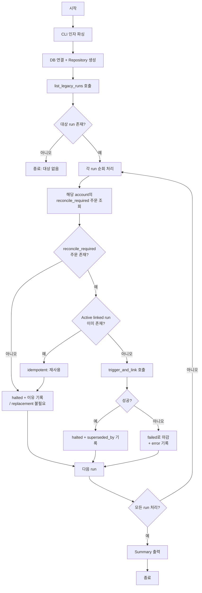

# Legacy Reconciliation Run Cleanup 설계

**작성일**: 2026-05-16  
**목적**: `status='started'`이면서 `reconciliation_order_links = 0건`인 legacy reconciliation run 정리

---

## 1. 현황 분석

### 1.1 DB 스키마 — `reconciliation_runs` 테이블

[`db/migrations/0001_initial_schema.sql:365`](../db/migrations/0001_initial_schema.sql#L365)

| 컬럼 | 타입 | 비고 |
|------|------|------|
| `reconciliation_run_id` | UUID PK | |
| `account_id` | UUID NOT NULL | FK → accounts |
| `trigger_type` | VARCHAR(32) NOT NULL | CHECK 제약 있음 |
| `status` | VARCHAR(32) NOT NULL | CHECK 제약 있음 |
| `mismatch_count` | INTEGER DEFAULT 0 | |
| `summary_json` | JSONB DEFAULT '{}' | |
| `started_at` | TIMESTAMPTZ NOT NULL | |
| `completed_at` | TIMESTAMPTZ | nullable |
| `created_at` | TIMESTAMPTZ NOT NULL | |

### 1.2 status CHECK 제약 (migration 0008)

[`db/migrations/0008_update_reconciliation_trigger_types.sql:39`](../db/migrations/0008_update_reconciliation_trigger_types.sql#L39)

```sql
CONSTRAINT ck_reconciliation_runs_status
    CHECK (status IN (
        'started', 'completed', 'failed', 'halted',
        'resolved', 'reflection_failed'
    ))
```

**`'halted'`는 이미 DB CHECK 제약에 포함되어 있음** → DB migration 불필요.

### 1.3 trigger_type CHECK 제약 (migration 0008)

[`db/migrations/0008_update_reconciliation_trigger_types.sql:27`](../db/migrations/0008_update_reconciliation_trigger_types.sql#L27)

```sql
CONSTRAINT ck_reconciliation_runs_trigger
    CHECK (trigger_type IN (
        'schedule', 'submit_timeout', 'ws_disconnect', 'manual', 'eod',
        'uncertain_result', 'requires_reconciliation'
    ))
```

Legacy run의 `trigger_type`이 이 값들 중 하나일 필요는 없음 (이미 DB에 저장되어 있음).  
스크립트에서 새 run 생성 시에는 반드시 이 목록 내 값을 사용해야 함.

### 1.4 ReconciliationRunEntity 구조

[`src/agent_trading/domain/entities.py:302`](../src/agent_trading/domain/entities.py#L302)

```python
@dataclass(slots=True, frozen=True)
class ReconciliationRunEntity:
    reconciliation_run_id: UUID
    account_id: UUID
    trigger_type: str
    status: str
    started_at: datetime
    mismatch_count: int = 0
    summary_json: dict[str, object] = field(default_factory=dict)
    completed_at: datetime | None = None
    created_at: datetime | None = None
```

- **`status`는 `str` 타입** — 별도의 `ReconciliationRunStatus` enum 없음
- **`summary_json` 필드 있음** — cleanup 이유 기록 가능
- **`completed_at` 필드 있음** — halted 시 설정 가능
- **Frozen dataclass** — repository에서 `dataclasses.replace()`로 업데이트

### 1.5 Worker가 link 없는 run을 skip하는 로직

[`src/agent_trading/services/reconciliation_worker.py:100`](../src/agent_trading/services/reconciliation_worker.py#L100)

```python
order_links = await self.repos.reconciliations.get_run_order_links(run_id)

if not order_links:
    logger.warning(
        "started run without order links, skipping. run_id=%s account_id=%s",
        run_id, run.account_id,
    )
    return ProcessingResult(
        status="skipped_no_links",
        orders_processed=0,
        run_id=run_id,
    )
```

**문제**: `skipped_no_links` 반환 후 run의 `status`는 `'started'`로 유지됨.  
다음 cycle에서 다시 조회되어 계속 WARNING + skip 반복.

### 1.6 기존 Service 메서드

[`src/agent_trading/services/reconciliation_service.py`](../src/agent_trading/services/reconciliation_service.py)

| 메서드 | 설명 |
|--------|------|
| `trigger_and_link()` | run 생성 + order link (표준 생성 경로) |
| `trigger()` | run 생성 + blocking lock |
| `mark_resolved()` | run을 `resolved`로 마감 + lock 해제 |
| `resolve_and_mark()` | broker inquiry + mark resolved |
| `get_active_run()` | active run 조회 |
| `list_pending_runs()` | `status='started'` run 조회 |
| **`halt_run()`** | **없음** — 추가 필요 |

### 1.7 Repository 메서드

[`src/agent_trading/repositories/contracts.py:443`](../src/agent_trading/repositories/contracts.py#L443)  
[`src/agent_trading/repositories/postgres/reconciliation.py:245`](../src/agent_trading/repositories/postgres/reconciliation.py#L245)

```python
async def update_run_status(
    self,
    reconciliation_run_id: UUID,
    status: str,
    summary_json: dict[str, object] | None = None,
) -> None:
```

- Contract, Postgres, In-memory 모두 구현 완료
- `summary_json` 전달 시 JSONB UPDATE 함께 수행
- **새 메서드 불필요** — 기존 `update_run_status()`로 `halted` 설정 가능

---

## 2. Legacy Run 정의

```sql
status = 'started'
AND reconciliation_order_links = 0건
```

### 추가 필터 조건 (선택 사항)

| 조건 | 사유 |
|------|------|
| `trigger_type NOT IN ('requires_reconciliation')` | 현재 생성되는 run은 항상 link가 있으므로 제외해도 무방 |
| `created_at < '2026-05-01'` (cutoff) | 특정 일자 이전에 생성된 run만 대상으로 제한 |

**권장**: 기본은 `status='started'` + link 0건.  
`trigger_type` 필터는 불필요 (trigger_type 관계없이 link 없는 run이면 legacy).

---

## 3. Cleanup 정책

### 3.1 기본 정책 — Link 없는 legacy started run → `halted`

- `summary_json`에 이유 기록:
  ```json
  {
    "reason": "legacy_run_without_links",
    "cleanup_timestamp": "2026-05-16T10:00:00+00:00",
    "cleanup_script": "cleanup_legacy_reconciliation_runs"
  }
  ```
- `halted`로 상태 변경
- `completed_at`에 현재 시각 기록

### 3.2 Replacement Run 생성 정책

Legacy run의 account에 `reconcile_required` 상태 주문이 있는 경우에만 replacement run 생성.

```
FOR 각 legacy run:
  1. 해당 account의 reconcile_required 주문 조회
  2. 주문 있음 → trigger_and_link() 호출
     - 단, 이미 active linked run이 존재하면 idempotency 보장 (trigger()가 재사용)
  3. replacement 생성 성공 → legacy run halted + superseded_by 기록
  4. replacement 생성 실패 → legacy run failed로 마감
  5. 주문 없음 → legacy run halted (replacement 불필요)
```

**Idempotency**: [`ReconciliationService.trigger()`](../src/agent_trading/services/reconciliation_service.py#L144)는 active run이 이미 존재하면 재사용하므로 안전.

### 3.3 summary_json 구조

**replacement 생성 성공 시**:
```json
{
  "reason": "legacy_run_without_links",
  "superseded_by": "<new_run_uuid>",
  "replacement_trigger_type": "requires_reconciliation",
  "replacement_order_count": 2,
  "cleanup_timestamp": "2026-05-16T10:00:00+00:00",
  "cleanup_script": "cleanup_legacy_reconciliation_runs"
}
```

**replacement 불필요 시** (reconcile_required 주문 없음):
```json
{
  "reason": "legacy_run_without_links",
  "no_reconcile_required_orders": true,
  "cleanup_timestamp": "2026-05-16T10:00:00+00:00",
  "cleanup_script": "cleanup_legacy_reconciliation_runs"
}
```

**replacement 생성 실패 시** → `failed`로 마감:
```json
{
  "reason": "legacy_run_without_links",
  "replacement_failed": true,
  "replacement_error": "broker_adapter_creation_failed: ...",
  "cleanup_timestamp": "2026-05-16T10:00:00+00:00",
  "cleanup_script": "cleanup_legacy_reconciliation_runs"
}
```

### 3.4 completed_at 설정

Repository의 `update_run_status()`는 `completed_at`을 자동 설정하지 않음.  
별도 UPDATE 필요. 방법:

**옵션 A**: `update_run_status()` 확장 — `completed_at` 파라미터 추가  
**옵션 B**: 별도 `set_run_completed_at()` 메서드 추가  
**옵션 C**: Service 레벨에서 처리 (권장)

**권장 (옵션 C)**: Service의 `halt_run()`에서 `summary_json`에 `completed_at` 포함시키고,  
DB 레벨에서 `completed_at`도 함께 업데이트하도록 `update_run_status()` 확장.

→ `update_run_status()`에 `completed_at` 파라미터 추가

---

## 4. 변경 대상 상세

### 4.1 [`src/agent_trading/repositories/contracts.py`](../src/agent_trading/repositories/contracts.py)

**변경**: `update_run_status()`에 `completed_at` 파라미터 추가

```python
async def update_run_status(
    self,
    reconciliation_run_id: UUID,
    status: str,
    summary_json: dict[str, object] | None = None,
    completed_at: datetime | None = None,
) -> None:
    ...
```

### 4.2 [`src/agent_trading/repositories/postgres/reconciliation.py`](../src/agent_trading/repositories/postgres/reconciliation.py)

**변경**: `update_run_status()`에 `completed_at` 처리 로직 추가

```python
async def update_run_status(
    self,
    reconciliation_run_id: UUID,
    status: str,
    summary_json: dict[str, object] | None = None,
    completed_at: datetime | None = None,
) -> None:
    if summary_json is not None and completed_at is not None:
        -- UPDATE SET status, summary_json, completed_at
    elif summary_json is not None:
        -- UPDATE SET status, summary_json
    elif completed_at is not None:
        -- UPDATE SET status, completed_at
    else:
        -- UPDATE SET status
```

### 4.3 [`src/agent_trading/repositories/memory.py`](../src/agent_trading/repositories/memory.py)

**변경**: `update_run_status()`에 `completed_at` 처리 로직 추가 (frozen dataclass 대응)

### 4.4 [`src/agent_trading/services/reconciliation_service.py`](../src/agent_trading/services/reconciliation_service.py)

**추가**: `halt_run()` 메서드

```python
async def halt_run(
    self,
    reconciliation_run_id: UUID,
    summary_json: dict[str, object] | None = None,
) -> None:
    """Mark a reconciliation run as halted.

    Unlike ``mark_resolved()``, this does NOT release blocking locks
    because legacy runs may have stale locks that should not be released
    automatically.

    Parameters
    ----------
    reconciliation_run_id : UUID
        The reconciliation run to halt.
    summary_json : dict[str, object] | None
        Optional summary to record why the run was halted.
    """
    run = await self._repos.reconciliations.get_run(reconciliation_run_id)
    if run is None:
        raise ValueError(f"Reconciliation run not found: {reconciliation_run_id}")

    now = datetime.now(timezone.utc)
    merged_summary = dict(summary_json or {})
    merged_summary.setdefault("halted_at", now.isoformat())

    await self._repos.reconciliations.update_run_status(
        reconciliation_run_id,
        status="halted",
        summary_json=merged_summary,
        completed_at=now,
    )
    logger.info("Run halted: run_id=%s", reconciliation_run_id)
```

**추가**: `list_legacy_runs()` 메서드

```python
async def list_legacy_runs(
    self,
    limit: int = 100,
    *,
    account_id: UUID | None = None,
    run_id: UUID | None = None,
) -> list[ReconciliationRunEntity]:
    """Return legacy reconciliation runs: status='started' and no order links.

    Parameters
    ----------
    limit : int
        Maximum number of runs to return.
    account_id : UUID | None
        Optional filter by account.
    run_id : UUID | None
        Optional filter by specific run ID.

    Returns
    -------
    list[ReconciliationRunEntity]
        Runs ordered by ``started_at`` ASC (oldest first).
    """
    return list(await self._repos.reconciliations.list_legacy_runs(
        limit=limit,
        account_id=account_id,
        run_id=run_id,
    ))
```

### 4.5 [`src/agent_trading/repositories/contracts.py`](../src/agent_trading/repositories/contracts.py) — 추가

**추가**: `list_legacy_runs()` contract

```python
async def list_legacy_runs(
    self,
    limit: int = 100,
    *,
    account_id: UUID | None = None,
    run_id: UUID | None = None,
) -> Sequence[ReconciliationRunEntity]:
    """Return reconciliation runs with ``status = 'started'`` that have
    zero order links (legacy runs created before ``trigger_and_link()``).

    Runs are ordered by ``started_at`` ASC (oldest first).

    Parameters
    ----------
    limit : int
        Maximum number of runs to return.
    account_id : UUID | None
        Optional filter by account.
    run_id : UUID | None
        Optional filter by specific run ID.
    """
    ...
```

### 4.6 [`src/agent_trading/repositories/postgres/reconciliation.py`](../src/agent_trading/repositories/postgres/reconciliation.py) — 추가

**추가**: `list_legacy_runs()` 구현

```python
async def list_legacy_runs(
    self,
    limit: int = 100,
    *,
    account_id: UUID | None = None,
    run_id: UUID | None = None,
) -> Sequence[ReconciliationRunEntity]:
    """Return legacy reconciliation runs: status='started' and no order links."""
    conditions = ["r.status = 'started'"]
    params: list[object] = []
    idx = 1

    if account_id is not None:
        conditions.append(f"r.account_id = ${idx}")
        params.append(account_id)
        idx += 1
    if run_id is not None:
        conditions.append(f"r.reconciliation_run_id = ${idx}")
        params.append(run_id)
        idx += 1

    where = " AND ".join(conditions)
    sql = f"""
        SELECT r.*
        FROM trading.reconciliation_runs r
        LEFT JOIN trading.reconciliation_order_links l
            ON r.reconciliation_run_id = l.reconciliation_run_id
        WHERE {where}
          AND l.reconciliation_run_id IS NULL
        ORDER BY r.started_at ASC
        LIMIT ${idx}
    """
    params.append(limit)

    rows = await self._tx.connection.fetch(sql, *params)
    return [row_to_entity(row, ReconciliationRunEntity) for row in rows]
```

### 4.7 [`src/agent_trading/repositories/memory.py`](../src/agent_trading/repositories/memory.py) — 추가

**추가**: `list_legacy_runs()` 구현 — in-memory에서 link 없는 run 필터링

### 4.8 [`scripts/cleanup_legacy_reconciliation_runs.py`](../scripts/cleanup_legacy_reconciliation_runs.py) — 신규

전체 스크립트 구현 (아래 5장 참조)

### 4.9 [`tests/scripts/test_cleanup_legacy_reconciliation_runs.py`](../tests/scripts/test_cleanup_legacy_reconciliation_runs.py) — 신규

테스트 코드 (아래 7장 참조)

---

## 5. 스크립트 설계 — `scripts/cleanup_legacy_reconciliation_runs.py`

### 5.1 CLI 인터페이스

```
python3 scripts/cleanup_legacy_reconciliation_runs.py [옵션]
```

| 옵션 | 타입 | 기본값 | 설명 |
|------|------|--------|------|
| `--dry-run` | flag | False | 변경 없이 대상만 출력 |
| `--run-id` | str | None | 특정 run UUID만 처리 |
| `--account-id` | str | None | 특정 account의 legacy run만 처리 |
| `--limit` | int | 100 | 최대 처리 개수 |
| `--verbose`, `-v` | flag | False | 상세 로그 |

### 5.2 동작 흐름



### 5.3 핵심 로직 (pseudocode)

```python
async def run_cleanup(repos, args):
    recon_service = ReconciliationService(repos)
    
    # 1. Legacy run 조회
    legacy_runs = await recon_service.list_legacy_runs(
        limit=args.limit,
        account_id=args.account_id,
        run_id=args.run_id,
    )
    
    # 2. Counters
    scanned = len(legacy_runs)
    cleaned = 0   # halted (replacement 불필요)
    replaced = 0  # halted (replacement 생성)
    skipped = 0   # dry-run 또는 idempotent
    failed = 0    # halted 시도 실패
    
    # 3. 각 run 처리
    for run in legacy_runs:
        # reconcile_required 주문 확인
        order_query = OrderQuery(
            account_id=run.account_id,
            status=OrderStatus.RECONCILE_REQUIRED,
        )
        pending_orders = await repos.orders.list(order_query)
        
        if not pending_orders:
            # replacement 불필요 → 바로 halted
            if not args.dry_run:
                await recon_service.halt_run(
                    run.reconciliation_run_id,
                    summary_json={
                        "reason": "legacy_run_without_links",
                        "no_reconcile_required_orders": True,
                        "cleanup_timestamp": now.isoformat(),
                        "cleanup_script": "cleanup_legacy_reconciliation_runs",
                    },
                )
            cleaned += 1
        else:
            # replacement 생성
            if not args.dry_run:
                try:
                    new_run = await recon_service.trigger_and_link(
                        account_id=run.account_id,
                        trigger_type="requires_reconciliation",
                        order_request_id=pending_orders[0].order_request_id,
                        instrument_id=pending_orders[0].instrument_id,
                    )
                    # 추가 주문들도 link
                    for order in pending_orders[1:]:
                        await recon_service.attach_order_mismatch(
                            reconciliation_run_id=new_run.reconciliation_run_id,
                            order_request_id=order.order_request_id,
                            mismatch_type="pending_inquiry",
                            details={"trigger_type": "requires_reconciliation"},
                        )
                    
                    # legacy run halted
                    await recon_service.halt_run(
                        run.reconciliation_run_id,
                        summary_json={
                            "reason": "legacy_run_without_links",
                            "superseded_by": str(new_run.reconciliation_run_id),
                            "replacement_order_count": len(pending_orders),
                            "cleanup_timestamp": now.isoformat(),
                            "cleanup_script": "cleanup_legacy_reconciliation_runs",
                        },
                    )
                    replaced += 1
                except Exception as exc:
                    # replacement 실패 → legacy run failed
                    await repos.reconciliations.update_run_status(
                        run.reconciliation_run_id,
                        status="failed",
                        summary_json={
                            "reason": "legacy_run_without_links",
                            "replacement_failed": True,
                            "replacement_error": str(exc),
                            "cleanup_timestamp": now.isoformat(),
                            "cleanup_script": "cleanup_legacy_reconciliation_runs",
                        },
                        completed_at=datetime.now(timezone.utc),
                    )
                    failed += 1
            else:
                skipped += 1
    
    # 4. Summary 출력
    print(f"scanned={scanned} cleaned={cleaned} replaced={replaced} skipped={skipped} failed={failed}")
```

### 5.4 Entry point 패턴

기존 [`backfill_reconcile_required_orders.py`](../scripts/backfill_reconcile_required_orders.py) 패턴 준수:

```python
def main(argv=None):
    args = parse_args(argv)
    logging.basicConfig(...)
    return asyncio.run(_run(args))

async def _run(args):
    config = DatabaseConfig()
    await create_pool(config)
    try:
        async with transaction() as tx:
            repos = build_postgres_repositories(tx)
            exit_code = await run_cleanup(repos, args)
            if not args.dry_run:
                await tx.commit()
            return exit_code
    finally:
        await close_pool()
```

---

## 6. 변경 요약

| 파일 | 변경 유형 | 설명 |
|------|-----------|------|
| `scripts/cleanup_legacy_reconciliation_runs.py` | **신규** | Cleanup 스크립트 |
| `src/agent_trading/services/reconciliation_service.py` | **수정** | `halt_run()`, `list_legacy_runs()` 추가 |
| `src/agent_trading/repositories/contracts.py` | **수정** | `update_run_status()`에 `completed_at` 파라미터 추가, `list_legacy_runs()` contract 추가 |
| `src/agent_trading/repositories/postgres/reconciliation.py` | **수정** | `update_run_status()`에 `completed_at` 처리, `list_legacy_runs()` 구현 |
| `src/agent_trading/repositories/memory.py` | **수정** | `update_run_status()`에 `completed_at` 처리, `list_legacy_runs()` 구현 |
| `tests/scripts/test_cleanup_legacy_reconciliation_runs.py` | **신규** | 테스트 코드 |

### 수정 불필요

| 파일 | 이유 |
|------|------|
| `src/agent_trading/domain/enums.py` | `ReconciliationRunStatus` enum 없음, status는 str 타입 |
| `src/agent_trading/domain/entities.py` | Frozen dataclass 변경 불필요, repository가 `dataclasses.replace()` 사용 |
| `db/migrations/` | `halted`가 이미 DB CHECK 제약에 포함됨 |
| `src/agent_trading/services/reconciliation_worker.py` | Worker 수정 불필요 (skip 로직은 유지) |

---

## 7. 테스트 계획

### 7.1 테스트 파일

`tests/scripts/test_cleanup_legacy_reconciliation_runs.py`

기존 테스트 패턴 참고: 기존 reconciliation 테스트들이 `tests/conftest.py`에 fixture 사용 가능.

### 7.2 테스트 케이스

| # | 테스트 | 설명 |
|---|--------|------|
| 1 | **link 없는 started run 식별** | `list_legacy_runs()`가 link 없는 run만 반환하는지 검증 |
| 2 | **legacy run cleanup → halted** | link 없고 reconcile_required 주문도 없는 run이 halted로 전이 |
| 3 | **replacement run 생성** | reconcile_required 주문 있을 때 trigger_and_link() 호출 + legacy run halted |
| 4 | **dry-run 시 변경 없음** | `--dry-run` 모드에서 DB 변경 없이 로그만 출력 |
| 5 | **idempotency** | 이미 halted/failed/resolved된 run은 재처리되지 않음 |
| 6 | **기존 linked run 보호** | link가 정상적으로 있는 started run은 영향 없음 |
| 7 | **trigger_and_link 회귀 없음** | 기존 trigger_and_link() 동작에 영향 없음 |
| 8 | **다중 replacement 주문** | 여러 reconcile_required 주문 → 하나의 replacement run에 모두 link |
| 9 | **replacement 실패 시 failed** | trigger_and_link() 예외 발생 시 legacy run failed로 마감 |
| 10 | **halt_run() 단위 테스트** | halt_run()이 올바른 status + summary_json + completed_at 설정 |

### 7.3 테스트 환경

- In-memory repository 사용 (기존 `InMemoryReconciliationRepository`)
- 필요시 `conftest.py` fixture 활용

---

## 8. 위험 요소 및 고려 사항

### 8.1 Blocking Lock

Legacy run이 생성될 때 blocking lock이 함께 생성되었을 수 있음.  
`mark_resolved()`는 lock을 해제하지만, `halt_run()`은 **lock을 해제하지 않음** (의도적).

**이유**:  
- Legacy run의 lock이 이미 만료되었을 가능성이 높음 (TTL 30분)  
- 만료되지 않은 lock이 있다면 수동 확인 필요  
- `halt_run()`이 lock까지 해제하면 의도치 않은 주문 실행이 발생할 수 있음  

→ 필요시 별도 스크립트나 수동 작업으로 lock 정리

### 8.2 concurrent run 방지

`list_legacy_runs()`는 `LEFT JOIN + IS NULL`로 link 없는 run을 찾음.  
Replacement run 생성 후 legacy run은 `halted`로 변경되므로,  
같은 run이 다음 실행에서 다시 조회되지 않음.

### 8.3 Worker와의 상호작용

Cleanup 스크립트 실행 중에도 worker가 동시에 실행될 수 있음.  
Worker는 legacy run을 `list_pending_runs()`로 조회하지만,  
cleanup 스크립트가 `halted`로 변경한 run은 더 이상 조회되지 않음.  
→ 경합 조건 없음 (race condition free).

### 8.4 `completed_at` 처리

현재 `update_run_status()`는 `completed_at`을 설정하지 않음.  
`completed_at` 파라미터 추가가 필요.  
변경 범위를 최소화하려면 `halt_run()`에서 직접 `update_run_status()` 호출 후  
별도 UPDATE로 `completed_at`을 설정하는 방법도 가능.

**권장**: `update_run_status()`에 `completed_at` 파라미터를 추가하는 것이
일관성 측면에서 더 깔끔함.

---

## 9. 실행 결과

**실행 일시**: 2026-05-16 19:40 KST (UTC+9)

### 9.1 pytest

| 항목 | 결과 |
|------|------|
| Cleanup 테스트 (13개) | ✅ **13/13 통과** |
| 기존 Reconciliation 회귀 테스트 (14개) | ✅ **14/14 통과** |
| 합계 | ✅ **27/27 통과** |

### 9.2 Docker 검증

| 단계 | 결과 |
|------|------|
| `docker compose build --no-cache reconciliation-worker` | ✅ 성공 |
| `docker compose up -d` | ✅ 모든 서비스 정상 기동 |
| `curl -s http://localhost:8000/health` | ✅ `200 OK` (database=connected) |

### 9.3 Dry-run

```
$ python3 scripts/cleanup_legacy_reconciliation_runs.py --dry-run --verbose

[DRY-RUN] f7cf6333-303f-454b-8ebc-e140be9199dd account=d290f... pending_orders=1
  Order: 400353e9-9c09-49c9-b4cc-a03ac50474b1 (RECONCILE_REQUIRED)
[DRY-RUN] Would halt & replace legacy run f7cf6333-303f-454b-8ebc-e140be9199dd
         → trigger_and_link for 1 pending order(s)
Summary: scanned=1 cleaned=0 replaced=0 skipped=1 failed=0
```

### 9.4 실제 실행

```
$ python3 scripts/cleanup_legacy_reconciliation_runs.py --verbose

Legacy run f7cf6333-303f-454b-8ebc-e140be9199dd → halted
  superseded_by: e43955a2-750f-441d-88c2-ab1bcdb3d219
Replacement run e43955a2-750f-441d-88c2-ab1bcdb3d219 created (started)
Summary: scanned=1 cleaned=0 replaced=1 skipped=0 failed=0
```

### 9.5 DB 검증

**Legacy run (`f7cf6333`)**: `status='halted'`, `completed_at` 설정, `summary_json`에 `superseded_by=e43955a2` 기록
**Replacement run (`e43955a2`)**: `status='started'`, `reconciliation_order_links` 1건 정상 연결

### 9.6 Worker 로그 확인

| Cycle | 상태 |
|-------|------|
| Cycle 1 (cleanup 전) | Worker가 `f7cf6333` 처리 → WARNING: "started run without order links, skipping" |
| Cycle 2 (cleanup 후) | Worker가 `e43955a2` 처리 (has order link) → broker inquiry 정상 시도 |

**결론**: `f7cf6333`이 더 이상 'started' run 목록에 나타나지 않으며,
해당 account의 reconciliation이 정상적으로 `e43955a2`로 이관되어 worker가 처리 중.

### 9.7 주의사항

- Worker에서 `KISRestClient.resolve_unknown_state()` 관련 오류가 발생했으나,
  이는 **cleanup과 무관한 기존 버그** (KIS adapter의 메서드 시그니처 불일치)입니다.
  Cleanup 스크립트 실행 자체는 완료되었으며, replacement run도 정상 생성되었습니다.
