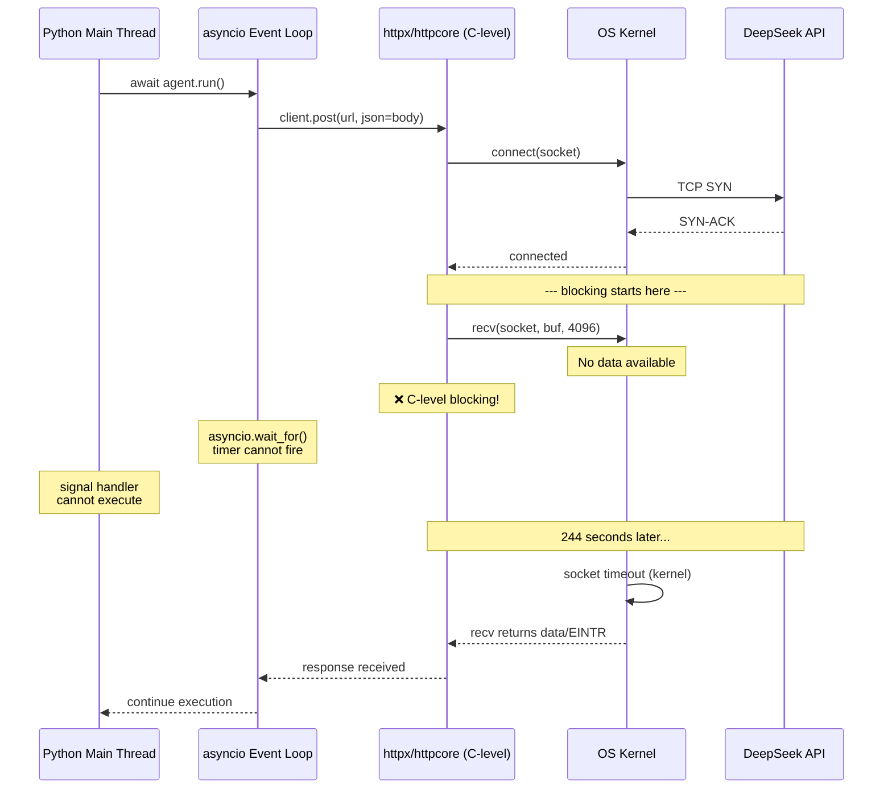
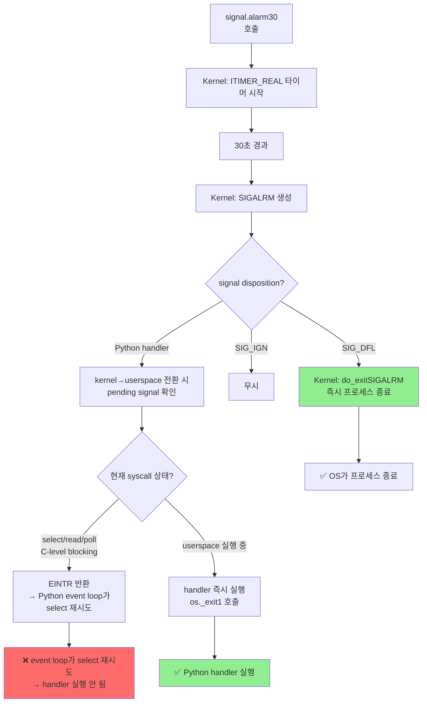
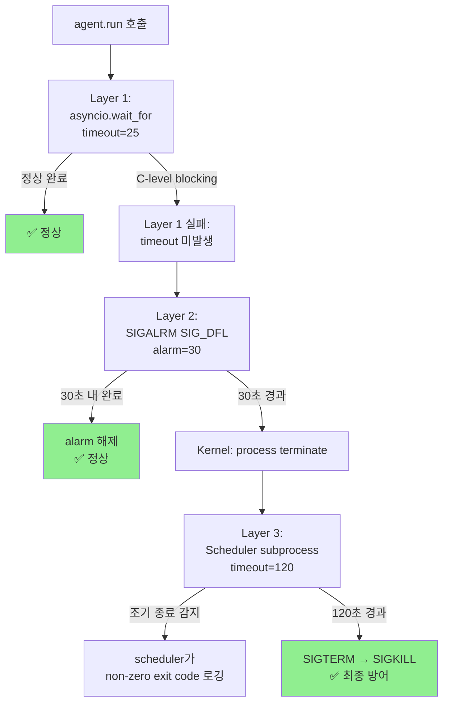
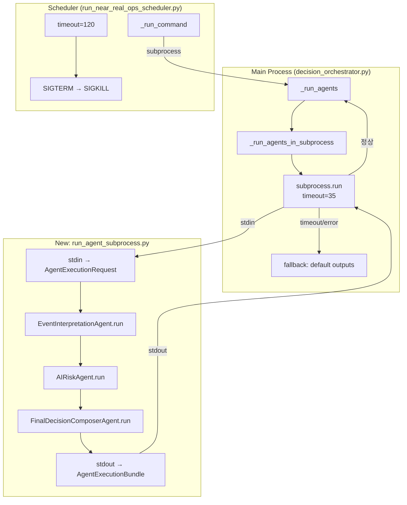
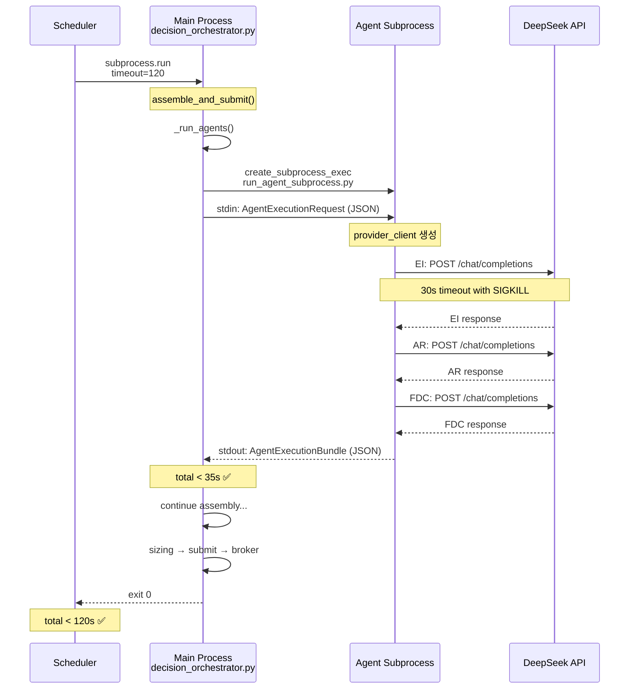
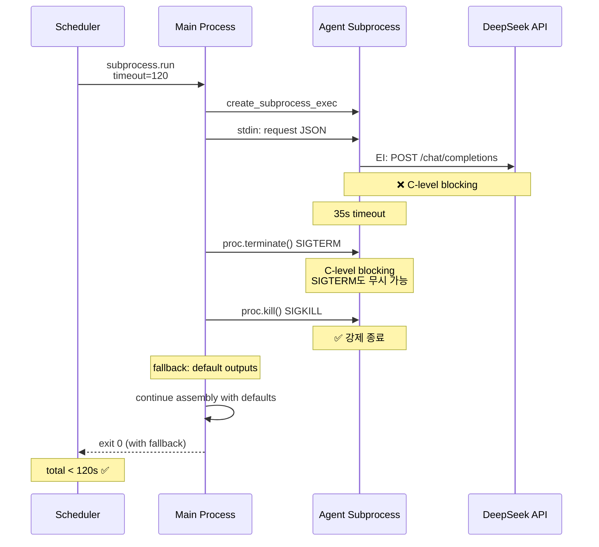
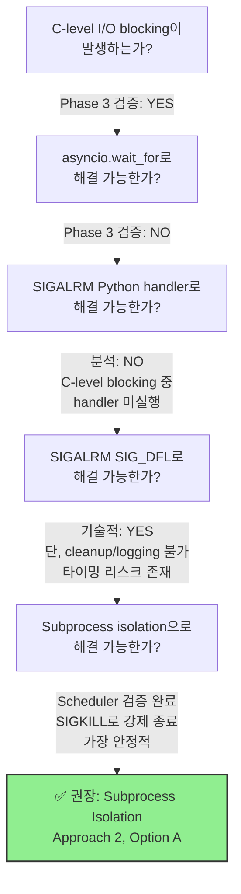

# Phase 4: SIGALRM / Subprocess Isolation 설계 — 2026-05-19

## 1. 문제 재정의

### 1.1 Phase 3의 실패 원인

Phase 3에서 적용한 3가지 수정이 모두 244s timeout 해결에 실패한 **근본 원인**은 다음과 같습니다:

1. **httpx read timeout 25s → 15s** ([`provider_client.py:137`](src/agent_trading/services/ai_agents/provider_client.py:137)): httpx의 timeout은 내부적으로 `asyncio.wait_for()`와 동일한 메커니즘을 사용합니다. C-level socket `read()` blocking이 발생하면 timeout coroutine이 scheduling되지 않아 timeout이 절대 fire하지 않습니다.

2. **threading.Timer + os._exit(1)** ([`run_paper_decision_loop.py:822`](scripts/run_paper_decision_loop.py:822)): `PER_AGENT_HARD_TIMEOUT`(90s) 로그가 전혀 출력되지 않음 → `asyncio.TimeoutError`가 절대 raise되지 않음 → `except asyncio.TimeoutError` 블록 진입 자체가 불가능. threading.Timer는 별도 스레드에서 실행되지만, `os._exit(1)` 호출 타이밍이 문제가 아니라 **`asyncio.TimeoutError`가 raise되지 않는 것이 근본 원인**.

3. **per-agent duration logging** ([`decision_orchestrator.py`](src/agent_trading/services/decision_orchestrator.py:1629)): C-level I/O blocking으로 인해 logging coroutine이 scheduling되지 않아 로그 미출력.

### 1.2 C-level I/O Blocking의 본질



**핵심 통찰**: Python의 asyncio event loop는 단일 스레드에서 cooperative multitasking으로 동작합니다. C-level socket I/O blocking이 발생하면:
- asyncio event loop가 해당 coroutine의 `await` 지점에서 block됨
- 다른 coroutine (timeout, signal handler, logging)이 scheduling되지 않음
- threading-based 접근(SIGALRM 핸들러, threading.Timer)만이 유일한 해결책

### 1.3 유일하게 동작하는 메커니즘

[`run_near_real_ops_scheduler.py:390`](scripts/run_near_real_ops_scheduler.py:390)의 `_run_command()` — **subprocess-level timeout**:

```python
# scheduler가 subprocess를 SIGTERM → SIGKILL로 강제 종료
proc = await asyncio.create_subprocess_exec(*argv, ...)
try:
    stdout_b, stderr_b = await asyncio.wait_for(
        proc.communicate(), timeout=timeout_seconds)
except asyncio.TimeoutError:
    proc.terminate()  # SIGTERM
    try:
        await asyncio.wait_for(proc.wait(), timeout=3)
    except asyncio.TimeoutError:
        proc.kill()  # SIGKILL — C-level blocking도 강제 해제!
```

SIGKILL은 OS kernel 레벨에서 프로세스를 즉시 종료시키며, C-level I/O blocking과 무관하게 동작합니다. 이는 `_run_agents()`의 `asyncio.wait_for()`가 실패하는 이유와 정확히 대칭됩니다.

---

## 2. 접근법별 기술적 타당성 분석

### 2.1 접근법 1: SIGALRM 기반 강제 종료

#### 메커니즘

Python의 `signal.alarm(n)`은 n초 후 현재 프로세스에 SIGALRM을 전송합니다.

**옵션 A: Python signal handler (`os._exit(1)`)**
```python
def handler(signum, frame):
    os._exit(1)
signal.signal(signal.SIGALRM, handler)
signal.alarm(30)
```

**옵션 B: SIG_DFL (default action = process terminate)**
```python
signal.signal(signal.SIGALRM, signal.SIG_DFL)
signal.alarm(30)
```

#### 기술적 타당성 평가

| 요소 | 옵션 A (Python handler) | 옵션 B (SIG_DFL) |
|------|------------------------|-------------------|
| C-level blocking 중 동작 | ❌ 동작하지 않음 | ✅ Kernel이 직접 프로세스 종료 |
| 로깅 가능 | ✅ handler에서 logging 가능 | ❌ 불가능 |
| Cleanup 가능 | ✅ handler에서 cleanup 가능 | ❌ 불가능 |
| httpx EINTR retry 영향 | N/A (handler 미실행) | ⚠️ Kernel terminate가 EINTR 처리보다 우선 |

**옵션 A는 Phase 3의 `asyncio.wait_for()`와 동일한 이유로 실패**합니다. Python signal handler는 C-level blocking 중에는 실행되지 않습니다.

**옵션 B는 kernel 레벨에서 즉시 프로세스를 종료**하므로 C-level blocking과 무관하게 동작합니다. SIG_DFL(SIGALRM) = process terminate는 kernel의 signal delivery mechanism에 의해 처리되며, Python bytecode 실행 여부와 무관합니다.

#### Linux Kernel Signal Delivery 상세



**결론**: 
- **옵션 A (Python handler)** 는 Phase 3와 동일한 이유로 실패합니다. C-level I/O blocking(e.g. `select()`, `recv()`) 중에는 Python signal handler가 실행되지 않고, syscall이 EINTR을 반환한 후에도 asyncio event loop가 select를 재시도하기 때문입니다.
- **옵션 B (SIG_DFL)** 은 kernel이 직접 프로세스를 종료시키므로 C-level blocking과 무관하게 동작합니다. 단, cleanup/logging이 불가능하고, alarm이 assembly 이외의 구간(DB write, broker submission)에서 fire될 위험이 있습니다.

### 2.2 접근법 2: Subprocess Isolation

#### 메커니즘

각 agent(EI/AR/FDC) 호출을 별도 Python subprocess로 분리하여, scheduler가 이미 검증한 subprocess timeout 메커니즘을 agent 레벨에 적용합니다.

**옵션 A: Agent 전체를 하나의 subprocess로**
- `_run_agents()` 전체를 하나의 subprocess로 실행
- stdin으로 `AgentExecutionRequest`(serialized) 전달
- stdout으로 agent outputs (serialized) 수신
- `subprocess.run(timeout=35)`으로 timeout 적용

**옵션 B: Agent별 개별 subprocess**
- EI/AR/FDC 각각을 개별 subprocess로 실행
- 순차적으로 실행 (EI → AR → FDC)
- 각 subprocess마다 독립적인 timeout 적용

#### serialization 전략

```mermaid
flowchart LR
    subgraph Main Process
        A["AssembledContext<br/>AgentExecutionRequest"] 
        B["json.dumps"]
        C["subprocess.stdin<br/>write"]
    end
    
    subgraph Subprocess
        D["stdin.read"]
        E["json.loads"]
        F["Agent Execution<br/>EI → AR → FDC"]
        G["json.dumps"]
        H["stdout.write"]
    end
    
    subgraph Main Process (cont)
        I["stdout.read"]
        J["json.loads"]
        K["AgentExecutionBundle"]
    end
    
    A --> B --> C
    C --> D --> E --> F --> G --> H
    H --> I --> J --> K
```

#### serialization scope

전송해야 할 데이터:
1. `AgentExecutionRequest` (decision_context_id, correlation_id, symbol, market, source_type)
2. `AssembledContext` (decision_context, config_version, recent_events, score, position_snapshot, cash_balance_snapshot, risk_limit_snapshot)

**주의**: `AssembledContext`는 DB entity references를 포함합니다. Subprocess는 DB 연결이 없으므로, 모든 데이터가 JSON serializable해야 합니다.

| Field | Type | Serializable? |
|-------|------|---------------|
| decision_context | `DecisionContextEntity` | ✅ (dataclass → dict) |
| config_version | `ConfigVersionEntity` | ✅ |
| recent_events | `tuple[ExternalEventEntity]` | ✅ |
| score | `ScoreResult` | ✅ |
| position_snapshot | `PositionSnapshotEntity` | ✅ |
| cash_balance_snapshot | `CashBalanceSnapshotEntity` | ✅ |
| risk_limit_snapshot | `RiskLimitSnapshotEntity` | ✅ |

#### 장단점

| 항목 | 평가 |
|------|------|
| **Timeout 보장** | ✅ SIGKILL로 C-level blocking도 강제 해제 |
| **격리성** | ✅ Memory leak, FD leak 격리 |
| **코드 변경 범위** | ⚠️ `_run_agents()` 전체 재구성 필요 |
| **오버헤드** | ⚠️ Subprocess startup ~0.3-0.5s per call |
| **DB 연결** | ⚠️ Subprocess는 agent_recorder DB 접근 불가 |
| **테스트 용이성** | ⚠️ Subprocess 기반 테스트는 복잡 |

### 2.3 접근법 3: 하이브리드

3계층 방어 구조:

```
Layer 1: asyncio.wait_for (25s) — best-effort
    ↓ 실패 시 (C-level blocking)
Layer 2: SIGALRM SIG_DFL (30s) — OS-level kill
    ↓ 실패 시 (EINTR retry 등)
Layer 3: Scheduler subprocess timeout (120s) — SIGKILL
```

#### 각 Layer의 관계



#### 장단점

| 항목 | 평가 |
|------|------|
| **Defense in depth** | ✅ 3계층 방어 |
| **코드 변경 범위** | ⚠️ SIGALRM 설정/해제 로직 필요 |
| **SIGALRM 타이밍 리스크** | ⚠️ alarm이 assembly 구간 외에서 fire될 위험 |
| **복잡성** | ⚠️ 3계층 각각의 동작 조건 이해 필요 |
| **로깅** | ⚠️ SIG_DFL terminate 시 로깅 불가 |

---

## 3. 권장 접근법: Subprocess Isolation (Approach 2, Option A)

### 3.1 선정 이유

| 기준 | SIGALRM (접근1) | Subprocess (접근2) | 하이브리드 (접근3) |
|------|-----------------|-------------------|-------------------|
| C-level blocking 해제 | ✅ (SIG_DFL만) | ✅ (SIGKILL) | ✅ |
| Data safety | ⚠️ 다른 구간에서 fire 위험 | ✅ 격리된 subprocess | ⚠️ (SIGALRM 위험 공유) |
| 유지보수성 | ✅ (변경 최소) | ⚠️ (변경 큼) | ❌ (3계층 복잡) |
| 로깅 가능 | ❌ (SIG_DFL) | ✅ (scheduler가 로깅) | ❌ |
| 확장성 | ❌ (단일 프로세스) | ✅ (격리된 실행) | ⚠️ |
| Phase 3 검증 | ❌ (유사 실패 이력) | ✅ (scheduler 검증 완료) | ⚠️ |

**SIGALRM(SIG_DFL)이 기술적으로는 동작하지만, 다음과 같은 이유로 Subprocess Isolation을 권장합니다**:

1. **SIG_DFL의 타이밍 리스크**: alarm이 `_run_agents()` 구간을 넘어 `assemble_and_submit()`의 다른 phase(DB write, broker submission)에서 fire될 경우, 데이터 정합성 문제 발생 가능
2. **로깅 불가**: SIG_DFL terminate 시 어떤 agent에서 timeout이 발생했는지 전혀 알 수 없음 → 디버깅 불가
3. **EINTR 재시도 리스크**: httpx/httpcore의 특정 버전에서 EINTR 재시도 로직이 있을 경우 SIGALRM이 무력화될 수 있음
4. **Subprocess는 이미 검증됨**: Scheduler의 `_run_command()`는 SIGTERM → SIGKILL 2단계 timeout으로 운영 환경에서 검증 완료

### 3.2 상세 설계

#### 아키텍처 개요



#### 변경 파일 목록

| 파일 | 변경 유형 | 변경 내용 |
|------|----------|----------|
| `scripts/run_agent_subprocess.py` | **신규 생성** | Agent subprocess entry point |
| `src/agent_trading/services/decision_orchestrator.py` | 수정 | `_run_agents()` → subprocess 위임 |
| `src/agent_trading/services/ai_agents/provider_client.py` | 수정 | httpx client 공유 문제 방지 |
| `scripts/run_near_real_ops_scheduler.py` | 수정 | `DEFAULT_TASK_TIMEOUT_SECONDS` 240→120 |
| `scripts/run_paper_decision_loop.py` | 수정 | `PER_AGENT_HARD_TIMEOUT` 90→제거 (중복) |
| `tests/services/test_decision_orchestrator.py` | 수정 | 기존 테스트 subprocess mock으로 변경 |
| `tests/scripts/test_agent_subprocess.py` | **신규 생성** | Subprocess 단위 테스트 |

#### 상세 변경 사항

##### 3.2.1 신규 파일: `scripts/run_agent_subprocess.py`

```python
"""
Subprocess entry point for agent execution.

Usage:
    echo '<json-input>' | python3 -m scripts.run_agent_subprocess

Reads AgentExecutionRequest from stdin, runs EI/AR/FDC agents
sequentially, and writes AgentExecutionBundle to stdout as JSON.

This script is designed to be called by DecisionOrchestratorService
via asyncio.create_subprocess_exec() with a 35-second timeout.
"""

import json
import sys
import os

# Ensure project root is on sys.path
sys.path.insert(0, os.path.dirname(os.path.dirname(os.path.abspath(__file__))))

from agent_trading.services.ai_agents import (
    OpenAICompatibleClient,
    EventInterpretationAgent,
    AIRiskAgent,
    FinalDecisionComposerAgent,
)
from agent_trading.services.ai_agents.base import AgentExecutionRequest
from agent_trading.services.ai_agents.schemas import (
    EventInterpretationOutput,
    AIRiskOutput,
    FinalDecisionComposerOutput,
)
from agent_trading.config.settings import AppSettings


def main():
    # 1. Read serialized request from stdin
    raw = sys.stdin.read()
    input_data = json.loads(raw)
    
    # 2. Reconstruct AgentExecutionRequest
    # (AssembledContext and entity reconstruction from JSON)
    request = _deserialize_request(input_data)
    
    # 3. Initialize provider client (inside subprocess)
    settings = AppSettings()
    provider = OpenAICompatibleClient(
        api_key=settings.provider_api_key,
        base_url=settings.provider_base_url,
        timeout_seconds=30,
    )
    
    # 4. Execute agents sequentially
    ei_agent = EventInterpretationAgent(provider_client=provider)
    ar_agent = AIRiskAgent(provider_client=provider)
    fdc_agent = FinalDecisionComposerAgent(provider_client=provider)
    
    try:
        ei_output = asyncio.run(ei_agent.run(request))
        request_with_ei = _build_request_with_ei(request, ei_output)
        
        ar_output = asyncio.run(ar_agent.run(request_with_ei))
        request_with_ei_ar = _build_request_with_ei_ar(request, ei_output, ar_output)
        
        fdc_output = asyncio.run(fdc_agent.run(request_with_ei_ar))
        
        # 5. Serialize outputs to stdout
        output = _serialize_bundle(ei_output, ar_output, fdc_output)
        print(json.dumps(output))
        sys.exit(0)
    except Exception as exc:
        # On any error, output default fallback outputs
        output = _serialize_fallback(str(exc))
        print(json.dumps(output))
        sys.exit(1)
    finally:
        asyncio.run(provider.close())


if __name__ == "__main__":
    main()
```

##### 3.2.2 `decision_orchestrator.py` 변경

```python
# In _run_agents() method:

async def _run_agents(
    self,
    *,
    assembled_context: AssembledContext,
    decision_context_id: UUID | None,
    correlation_id: str,
    symbol: str | None = None,
    market: str | None = None,
) -> AgentExecutionBundle:
    """Execute three agents via isolated subprocess (Phase 4)."""
    
    # Phase 4: subprocess isolation for reliable timeout enforcement
    if self._use_subprocess_isolation:  # Config flag
        return await self._run_agents_in_subprocess(
            assembled_context=assembled_context,
            decision_context_id=decision_context_id,
            correlation_id=correlation_id,
            symbol=symbol,
            market=market,
        )
    
    # Fallback: original in-process execution (for tests)
    return await self._run_agents_in_process(
        assembled_context=assembled_context,
        decision_context_id=decision_context_id,
        correlation_id=correlation_id,
        symbol=symbol,
        market=market,
    )


async def _run_agents_in_subprocess(
    self,
    *,
    assembled_context: AssembledContext,
    decision_context_id: UUID | None,
    correlation_id: str,
    symbol: str | None = None,
    market: str | None = None,
) -> AgentExecutionBundle:
    """Run agents in a separate subprocess with 35s timeout."""
    
    # 1. Serialize request
    request_data = _serialize_agent_request(
        assembled_context=assembled_context,
        decision_context_id=decision_context_id,
        correlation_id=correlation_id,
        symbol=symbol,
        market=market,
    )
    request_json = json.dumps(request_data)
    
    # 2. Launch subprocess
    proc = await asyncio.create_subprocess_exec(
        sys.executable,
        "-m", "scripts.run_agent_subprocess",
        stdin=asyncio.subprocess.PIPE,
        stdout=asyncio.subprocess.PIPE,
        stderr=asyncio.subprocess.PIPE,
        env={**os.environ},  # Inherit env (API key, etc.)
    )
    
    # 3. Send request and read response with timeout
    SUBPROCESS_TIMEOUT = 35  # seconds (30s for agents + 5s buffer)
    try:
        stdout_b, stderr_b = await asyncio.wait_for(
            proc.communicate(input=request_json.encode()),
            timeout=SUBPROCESS_TIMEOUT,
        )
    except asyncio.TimeoutError:
        # SIGTERM → SIGKILL
        proc.terminate()
        try:
            await asyncio.wait_for(proc.wait(), timeout=3)
        except asyncio.TimeoutError:
            proc.kill()
            await proc.wait()
        
        logger.warning(
            "Agent subprocess timed out after %ds — using default fallback outputs. "
            "decision_context_id=%s correlation_id=%s",
            SUBPROCESS_TIMEOUT,
            decision_context_id,
            correlation_id,
        )
        return _default_fallback_bundle()
    
    # 4. Parse response
    if proc.returncode != 0:
        stderr_text = stderr_b.decode(errors="replace")[:500]
        logger.warning(
            "Agent subprocess failed (code=%d): %s — using default fallback. "
            "decision_context_id=%s",
            proc.returncode, stderr_text, decision_context_id,
        )
        return _default_fallback_bundle()
    
    try:
        output_data = json.loads(stdout_b.decode())
        return _deserialize_bundle(output_data)
    except (json.JSONDecodeError, KeyError) as exc:
        logger.warning(
            "Agent subprocess output parse failed: %s — using default fallback. "
            "decision_context_id=%s",
            exc, decision_context_id,
        )
        return _default_fallback_bundle()
```

##### 3.2.3 `run_near_real_ops_scheduler.py` 변경

```python
# DEFAULT_TASK_TIMEOUT_SECONDS = 240  # Before Phase 4
DEFAULT_TASK_TIMEOUT_SECONDS = 120  # Phase 4: reduced because subprocess isolation
# ensures fast failure within ~35s per agent group.
```

#### 시퀀스 다이어그램



#### 오류 시나리오: Subprocess timeout



---

## 4. 테스트 전략

### 4.1 단위 테스트

| 테스트 | 대상 | 방법 |
|--------|------|------|
| `test_agent_subprocess_serialization` | `scripts/run_agent_subprocess.py` | Request serialization → deserialization round-trip |
| `test_subprocess_timeout` | `_run_agents_in_subprocess` | Mock subprocess that sleeps 60s → verify 35s timeout |
| `test_subprocess_error` | `_run_agents_in_subprocess` | Mock subprocess that exits 1 → verify fallback |
| `test_subprocess_malformed_output` | `_run_agents_in_subprocess` | Mock subprocess that outputs garbage JSON → verify fallback |

### 4.2 통합 테스트

| 테스트 | 방법 |
|--------|------|
| `test_subprocess_real_agents` | 실제 `run_agent_subprocess.py` 실행, stub provider로 검증 |
| `test_assemble_with_subprocess` | `DecisionOrchestratorService`에서 subprocess isolation enabled → `assemble()` 정상 동작 확인 |

### 4.3 E2E 테스트

| 테스트 | 방법 |
|--------|------|
| `verify_paper_loop.py` | 수정 후 paper loop 정상 동작 확인 |
| `run_orchestrator_once.py` | 단일 cycle 정상 동작 확인 |

### 4.4 Subprocess 테스트 실행 방식

```python
# 테스트에서 subprocess를 mock으로 대체
@pytest.fixture
def mock_agent_subprocess(monkeypatch):
    """Mock asyncio.create_subprocess_exec to avoid actual subprocess in tests."""
    
    async def _mock_subprocess(*args, **kwargs):
        """Return a fake process with pre-defined stdout."""
        class FakeProcess:
            returncode = 0
            async def communicate(self, input=None):
                return (json.dumps(FAKE_BUNDLE).encode(), b"")
            async def wait(self):
                pass
            def terminate(self):
                pass
            def kill(self):
                pass
        return FakeProcess()
    
    monkeypatch.setattr(
        asyncio, "create_subprocess_exec", _mock_subprocess
    )
```

### 4.5 Subprocess 실제 실행 테스트

```python
@pytest.mark.asyncio
async def test_agent_subprocess_real():
    """실제 subprocess 실행 + mock provider로 검증 (unit → subprocess boundary)."""
    proc = await asyncio.create_subprocess_exec(
        sys.executable, "-m", "scripts.run_agent_subprocess",
        stdin=asyncio.subprocess.PIPE,
        stdout=asyncio.subprocess.PIPE,
        stderr=asyncio.subprocess.PIPE,
        env={**os.environ, "PROVIDER_API_KEY": "test-key"},
    )
    
    request_json = json.dumps(_make_test_request())
    stdout_b, stderr_b = await asyncio.wait_for(
        proc.communicate(input=request_json.encode()),
        timeout=10,
    )
    
    assert proc.returncode == 0
    output = json.loads(stdout_b.decode())
    assert "ei_output" in output
    assert "ar_output" in output
    assert "fdc_output" in output
```

---

## 5. Docker 배포 전략

### 5.1 Rebuild 필요 여부: ✅ 필요

| 변경 사항 | Rebuild 필요? | 이유 |
|----------|--------------|------|
| `scripts/run_agent_subprocess.py` 신규 | ✅ | 새로운 Python 파일 추가 |
| `decision_orchestrator.py` 수정 | ✅ | 코드 변경 |
| `run_near_real_ops_scheduler.py` 수정 | ✅ | 환경 변수/설정 변경 |
| `provider_client.py` 수정 | ✅ | timeout 값 변경 |

### 5.2 배포 절차

```bash
# 1. Build 새 이미지
docker compose build ops-scheduler

# 2. 재시작 (rolling update)
docker compose up -d --no-deps ops-scheduler

# 3. 상태 확인
curl http://localhost:8000/health

# 4. 로그 모니터링 (최초 3 cycle)
docker compose logs --tail=100 ops-scheduler | grep -E "subprocess|timeout|PER_AGENT"
```

### 5.3 배포 후 모니터링 항목

| 항목 | 임계값 | 조치 |
|------|--------|------|
| Subprocess timeout count | 0 (이상적) | >3회/h → DeepSeek API 상태 확인 |
| `_run_agents_in_subprocess` avg duration | <30s | >30s → subprocess timeout 임계값 조정 |
| Fallback output rate | <10% | >10% → provider 문제 분석 |
| Scheduler subprocess timeout count | 0 | >0 → subprocess isolation 실패, 추가 분석 |

---

## 6. 변경 요약

### 변경 파일 및 예상 라인 수

| 파일 | 변경 유형 | 예상 라인 수 |
|------|----------|-------------|
| `scripts/run_agent_subprocess.py` | **신규** | ~150 lines |
| `src/agent_trading/services/decision_orchestrator.py` | 수정 | ~100 lines 추가 (~2206 총라인) |
| `src/agent_trading/services/ai_agents/provider_client.py` | 수정 (선택) | ~5 lines |
| `scripts/run_near_real_ops_scheduler.py` | 수정 | ~1 line (timeout 값 변경) |
| `scripts/run_paper_decision_loop.py` | 수정 | ~5 lines (HARD_TIMEOUT 관련) |
| `tests/services/test_decision_orchestrator.py` | 수정 | ~50 lines |
| `tests/scripts/test_agent_subprocess.py` | **신규** | ~120 lines |

### 총 예상 변경량: ~430 lines

---

## 7. 리스크 및 완화 방안

| 리스크 | 영향 | 완화 방안 |
|--------|------|----------|
| **Subprocess startup overhead** | 매 cycle ~0.3-0.5s 지연 | 무시 가능 (total cycle < 120s 목표) |
| **Provider API key subprocess 전달** | 보안 리스크 | 환경 변수 상속 (추가 노출 없음) |
| **Agent output serialization 실패** | Fallback output 사용 | JSON schema validation |
| **httpx connection pool subprocess 분리** | 각 subprocess가 새 connection | 3회의 TCP handshake overhead (~300ms) |
| **Subprocess resource leak (좀비 프로세스)** | FD 고갈 | `proc.wait()` 보장, `proc.kill()` 이중화 |
| **기존 테스트 호환성** | 테스트 실패 | `_use_subprocess_isolation=False` default for tests |
| **동시성 (concurrent cycles)** | 중복 subprocess 실행 | scheduler가 serial execution 보장 |

---

## 8. 결정 트리



---

## 9. 결론

**권장 접근법: Subprocess Isolation (Approach 2, Option A)**

- **근거**: Phase 3에서 증명된 C-level I/O blocking 문제를 근본적으로 해결할 수 있는 유일한 방법은 OS 레벨의 프로세스 격리(SIGKILL)입니다.
- **검증된 기반**: Scheduler(`run_near_real_ops_scheduler.py`)의 `_run_command()`가 동일한 메커니즘(SIGTERM → SIGKILL)으로 운영 환경에서 검증 완료되었습니다.
- **변경 최소화**: 기존 `_run_agents()` 구조를 유지하면서, subprocess 호출을 새로운 메서드(`_run_agents_in_subprocess`)로 분리합니다. 기존 `_run_agents_in_process`는 테스트용으로 유지됩니다.
- **안전한 fallback**: Subprocess timeout/실패 시에도 기존의 default output fallback이 그대로 동작합니다.
- **단계적 적용**: `_use_subprocess_isolation` 플래그로 제어 가능하며, 문제 발생 시 즉시 in-process 모드로 롤백 가능합니다.
