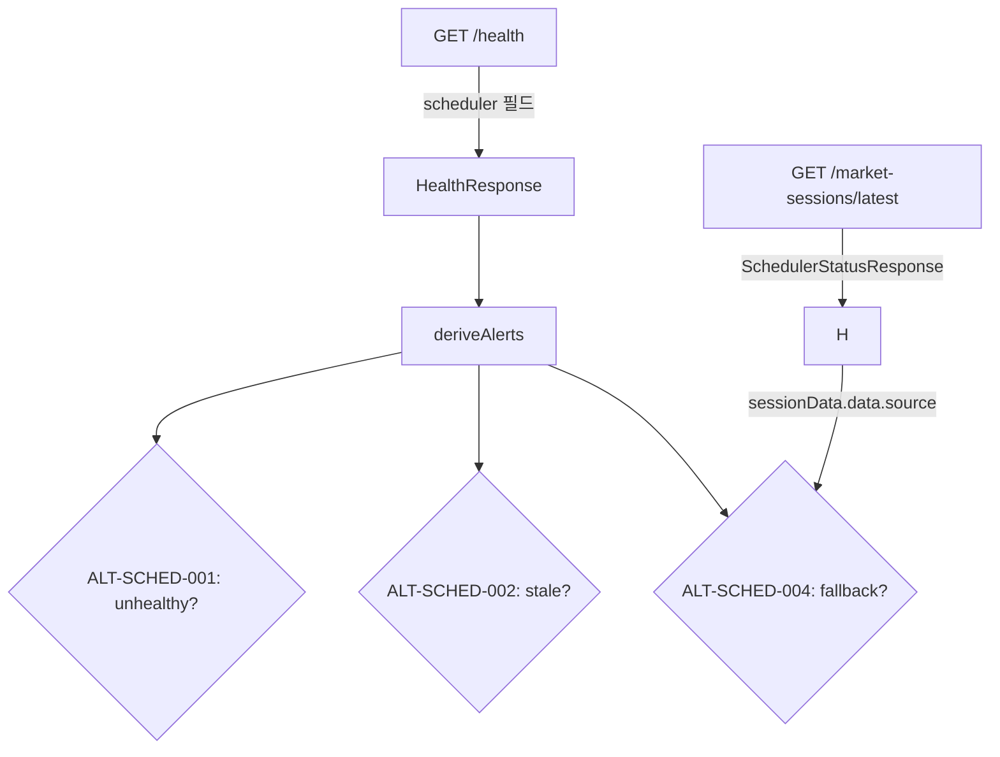
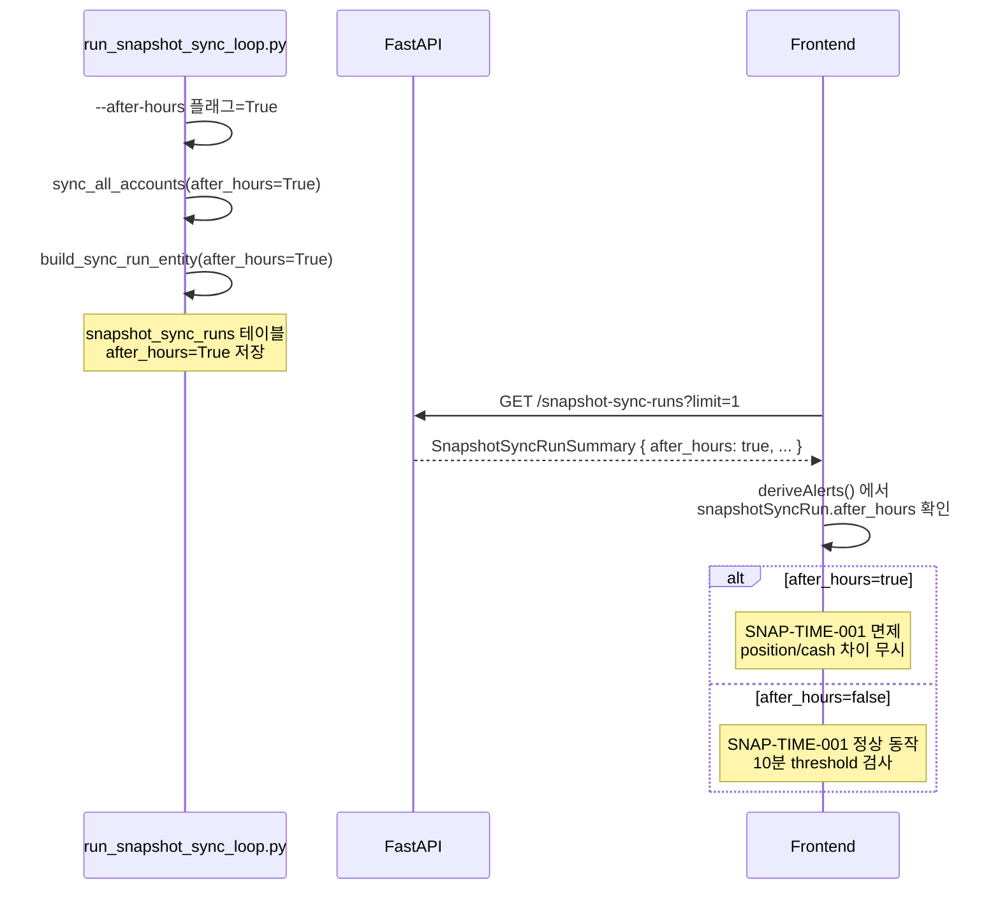
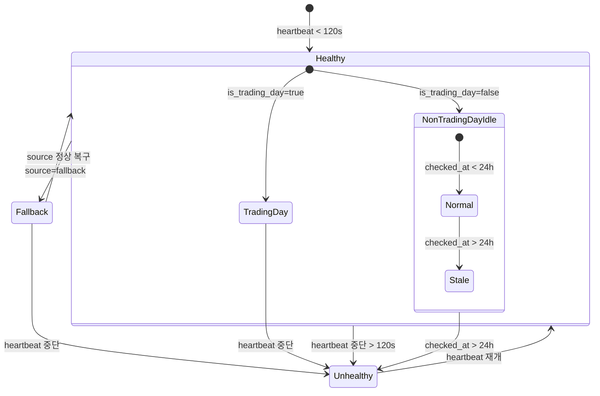

# 운영 경고 규칙 정합화 — 분석 및 설계

**Date**: 2026-05-16 (KST)  
**Author**: Roo (Architect Mode)  
**Status**: ✅ Design Complete

---

## 목차

1. [발견된 문제 분석](#1-발견된-문제-분석)
2. [Snapshot Alert Source 정합화](#2-snapshot-alert-source-정합화)
3. [After-hours Cash-only Mismatch 완화](#3-after-hours-cash-only-mismatch-완화)
4. [Ops-scheduler 경고 추가](#4-ops-scheduler-경고-추가)
5. [변경 대상 파일 목록](#5-변경-대상-파일-목록)
6. [테스트 계획](#6-테스트-계획)
7. [부록: Mermaid Diagram](#7-부록-mermaid-diagram)

---

## 1. 발견된 문제 분석

### 1.1 ALT-SNAP-001/002 — 잘못된 데이터 소스 참조 (Critical)

**현재 코드** ([`admin_ui/src/lib/alerts.ts:73-102`](admin_ui/src/lib/alerts.ts:73)):

```typescript
// ALT-SNAP-001: 스냅샷 동기화 지연 (긴급)
if (!input.reconRunsError && input.reconRuns.length > 0) {
  const sorted = [...input.reconRuns].sort(...);
  const latest = sorted[0];
  if (latest?.started_at) {
    const elapsed = Date.now() - new Date(latest.started_at).getTime();
    if (elapsed > 5 * 60 * 1000) {
      // → "스냅샷 동기화 지연" alert
    }
  }
}
```

**문제**: `input.reconRuns`는 `ReconciliationRunSummary[]` 타입으로, 이는 **reconciliation run** (주문-포지션 정합성 점검)의 이력입니다. 그러나 위 alert의 목적은 **스냅샷 동기화** (broker → DB snapshot copy)의 지연 감지입니다. 두 개념이 완전히 다릅니다:
- Reconciliation run: 정합성 검증 워커가 주기적으로 실행
- Snapshot sync run: `run_snapshot_sync_loop.py`가 broker에서 데이터를 가져와 DB에 저장

**영향**: 
- reconciliation run이 최근에 실행되었지만 snapshot sync가 stale한 경우 → 위양성(False Negative): 경고가 발생하지 않음
- reconciliation run이 없지만 snapshot sync는 정상인 경우 → 위음성(False Positive): 불필요한 경고 발생

**다행히**: [`OperationsAlertsView.tsx:206-216`](admin_ui/src/components/OperationsAlertsView.tsx:206)에서는 `getSnapshotSyncRuns(1)`을 호출하여 `SnapshotSyncRunSummary`를 별도로 가져오고 `AlertRuleInput.snapshotSyncRun`에 전달하고 있습니다. 또한 SNAP-SYNC-001/002/003a/003b 규칙이 이미 `snapshotSyncRun`을 올바르게 사용하고 있습니다.

**해결 방향**: ALT-SNAP-001/002를 제거하고 SNAP-SYNC 규칙으로 완전히 대체합니다.

### 1.2 SNAP-TIME-001 — After-hours Cash-only 모드 False Positive

**현재 코드** ([`admin_ui/src/lib/alerts.ts:233-249`](admin_ui/src/lib/alerts.ts:233)):

```typescript
// SNAP-TIME-001: position/cash snapshot_at 차이 > 10분 → 주의
if (input.latestPositionSnapshotAt && input.latestCashSnapshotAt) {
  const diffMs = Math.abs(new Date(input.latestPositionSnapshotAt) - new Date(input.latestCashSnapshotAt));
  if (diffMs > 10 * 60 * 1000) {
    // → "현금/포지션 스냅샷 시각 불일치" alert
  }
}
```

**After-hours 동작** ([`src/agent_trading/brokers/koreainvestment/snapshot.py:91-94`](src/agent_trading/brokers/koreainvestment/snapshot.py:91)):

```python
if after_hours:
    logger.info("After-hours mode — skipping positions fetch (cash-only sync)")
    raw_positions = []
```

**문제**: after-hours cash-only sync (`--after-hours` 플래그로 실행) 시:
1. Cash snapshot: `snapshot_at` = 현재 시각으로 갱신됨
2. Position snapshot: fetch가 완전히 스킵됨 → `snapshot_at`이 이전 동기화 시각 그대로 유지됨
3. 결과: position과 cash의 `snapshot_at` 차이가 지속적으로 증가 → 10분 threshold 초과 시 false positive 경고

**추가 문제**: 현재 `SnapshotSyncRunSummary`에 `after_hours` 여부를 나타내는 필드가 없습니다. 프런트엔드가 after-hours 모드인지 알 방법이 없습니다.

### 1.3 Ops-Scheduler 알림 규칙 완전 부재

**현재 상태**: [`admin_ui/src/lib/alerts.ts`](admin_ui/src/lib/alerts.ts)에는 scheduler 상태를 확인하는 alert rule이 하나도 없습니다.

**사용 가능한 데이터**:
1. [`GET /health`](src/agent_trading/api/routes/health.py:117) → `scheduler` 필드 (`SchedulerHealth`)
   - `last_heartbeat_at`, `is_trading_day`, `checked_at`, `healthy`
2. [`GET /market-sessions/latest`](src/agent_trading/api/routes/sessions.py:35) → `SchedulerStatusResponse`
   - `status`, `data` (MarketSessionSummary), `healthy`, `stale_seconds`

**그러나**: 프런트엔드 [`api.ts`](admin_ui/src/types/api.ts:6)의 `HealthResponse` 인터페이스에 `scheduler` 필드가 **없음** (백엔드와 불일치).

### 1.4 추가 발견: Frontend 타입 불일치

[`admin_ui/src/types/api.ts:6-15`](admin_ui/src/types/api.ts:6):

```typescript
export interface HealthResponse {
  status: string;
  database: string;
  runtime_mode: string;
  snapshot_sync_detail: string | null;
  snapshot_sync_stale: boolean | null;
  snapshot_sync_last_successful_run_at: string | null;
  snapshot_sync_consecutive_failures: number | null;
}
```

**누락된 필드** (백엔드 [`schemas.py:89-113`](src/agent_trading/api/schemas.py:89) 기준):
- `version: string` — 백엔드에서 항상 반환
- `timestamp: string` — 백엔드에서 항상 반환
- `scheduler: SchedulerHealth | null` — Phase 14에서 추가됨

---

## 2. Snapshot Alert Source 정합화

### 2.1 Authoritative Source 결정

| 데이터 | Source | API | 사용처 |
|--------|--------|-----|--------|
| Snapshot sync run 이력 | `snapshot_sync_runs` 테이블 | `GET /snapshot-sync-runs` | ✅ **Primary alert source** |
| Snapshot sync health | `snapshot_sync_runs` 테이블 | `GET /snapshot-sync-runs/summary` | 보조 (stale 여부) |
| Position snapshot_at | `position_snapshots` 테이블 | `GET /positions?account_id=...` | SNAP-TIME-001용 |
| Cash snapshot_at | `cash_balance_snapshots` 테이블 | `GET /cash-balances?account_id=...` | SNAP-TIME-001용 |
| ~~Reconciliation runs~~ | ~~reconciliation_runs 테이블~~ | ~~GET /reconciliation/runs~~ | ❌ **부적합 — 제거 대상** |

### 2.2 새로운 로직 설계

#### ALT-SNAP-001 (스냅샷 동기화 지연) → SNAP-SYNC-STALE-001로 대체

```typescript
// SNAP-SYNC-STALE-001: snapshot sync run stale (긴급)
// 조건: snapshotSyncRun 존재 && (현재시각 - started_at) > 5분
// 이 규칙은 ALT-SNAP-001을 대체함
```

**현재 SNAP-SYNC 규칙 현황**:

| Rule ID | Level | 조건 | 상태 |
|---------|-------|------|------|
| SNAP-SYNC-001 | 주의 | status='partial' | ✅ 유지 |
| SNAP-SYNC-002 | 긴급 | status='failed' | ✅ 유지 |
| SNAP-SYNC-003a | 긴급 | API 오류 | ✅ 유지 |
| SNAP-SYNC-003b | 긴급 | run 없음 | ✅ 유지 |
| **SNAP-SYNC-STALE-001** (신규) | 긴급 | run stale (>5분) | **🆕 추가** |
| **SNAP-SYNC-004** (신규) | 주의 | stale but tolerable (5~15분) | **🆕 고려** |

#### 변경 후 Alert Rule Matrix

| 기존 ID | 처리 | 신규 ID | 근거 |
|---------|------|---------|------|
| ALT-SNAP-001 | **제거** | SNAP-SYNC-STALE-001 | reconRuns → snapshotSyncRun 소스 변경 |
| ALT-SNAP-002 | **제거** | SNAP-SYNC-003b | 중복 (snapshotSyncRun=null이면 003b가 이미 처리) |
| SNAP-SYNC-001 | 유지 | — | partial 상태 감지 |
| SNAP-SYNC-002 | 유지 | — | failed 상태 감지 |
| SNAP-SYNC-003a | 유지 | — | API 오류 감지 |
| SNAP-SYNC-003b | 유지 | — | run 없음 감지 |
| SNAP-SYNC-STALE-001 | **신규** | — | snapshotSyncRun stale 감지 |

---

## 3. After-hours Cash-only Mismatch 완화

### 3.1 after-hours 감지 방법

두 가지 접근법이 있습니다:

#### Option A (선호): SnapshotSyncRun에 `after_hours` 필드 추가

백엔드:
1. [`SnapshotSyncRunEntity`](src/agent_trading/domain/entities.py)에 `after_hours: bool` 필드 추가
2. [`db/migrations/0016_add_after_hours_to_snapshot_sync_runs.sql`](db/migrations/) — 새 마이그레이션
3. [`SnapshotSyncRunSummary`](src/agent_trading/api/schemas.py:188)에 `after_hours: bool` 필드 추가
4. 프런트엔드 [`SnapshotSyncRunSummary`](admin_ui/src/types/api.ts:274)에 `after_hours: boolean` 추가

프런트엔드:
```typescript
export interface SnapshotSyncRunSummary {
  // ... 기존 필드 ...
  after_hours: boolean;
}
```

#### Option B: trigger_type 구분

`trigger_type`을 `"scheduler"` / `"after_hours_scheduler"` / `"manual"`으로 확장.
- 단점: 기존 데이터와의 호환성 문제, trigger_type 의미 변경

#### Option C: market_phase 추론

프런트엔드가 `/market-sessions/latest`의 `market_phase`가 `'AFTER_HOURS'`인지 확인.
- 단점: after-hours sync가 항상 AFTER_HOURS phase와 일치한다는 보장 없음

**결정**: **Option A** 선택. 명시적이고 향후 확장에 유연함.

### 3.2 Mismatch 경고 조건 변경

**SNAP-TIME-001 수정 로직**:

```typescript
// SNAP-TIME-001: position/cash snapshot_at 차이
if (input.latestPositionSnapshotAt && input.latestCashSnapshotAt) {
  const posTime = new Date(input.latestPositionSnapshotAt).getTime();
  const cashTime = new Date(input.latestCashSnapshotAt).getTime();
  const diffMs = Math.abs(posTime - cashTime);

  // after-hours cash-only sync인 경우 position은 의도적으로 갱신 안 됨
  if (input.snapshotSyncRun?.after_hours) {
    // Cash snapshot만 갱신된 것이므로 position/cash 차이는 무시
    // 단, cash snapshot 자체가 너무 오래된 경우는 별도 경고
    return;
  }

  if (diffMs > 10 * 60 * 1000) {
    // → "현금/포지션 스냅샷 시각 불일치" alert (기존 로직)
  }
}
```

**after-hours 모드에서의 대체 검증**:

after-hours cash-only sync 시 SNAP-TIME-001을 완전히 무시하는 대신, **cash snapshot 자체의 신선도**를 확인하는 경고로 대체할 수 있습니다:

```typescript
// after-hours cash-only 모드 → cash snapshot freshness만 확인
if (input.snapshotSyncRun?.after_hours && latestCashSnapshotAt) {
  const cashAge = Date.now() - new Date(latestCashSnapshotAt).getTime();
  if (cashAge > 30 * 60 * 1000) {  // 30분 이상 cash 미갱신
    // → "after-hours 현금 스냅샷 갱신 필요" 정보 alert
  }
}
```

---

## 4. Ops-Scheduler 경고 추가

### 4.1 필요한 Alert Rule 정의

프런트엔드 [`AlertRuleInput`](admin_ui/src/lib/alerts.ts:21)에 `schedulerHealth` 필드 추가

```typescript
export interface AlertRuleInput {
  // ... 기존 필드 ...
  schedulerHealth: SchedulerHealth | null;
  schedulerHealthError: boolean;
}
```

`SchedulerHealth` 타입 추가 ([api.ts](admin_ui/src/types/api.ts)에):

```typescript
export interface SchedulerHealth {
  last_heartbeat_at: string | null;
  is_trading_day: boolean | null;
  checked_at: string | null;
  healthy: boolean | null;
}
```

### 4.2 Alert Rule 상세

#### ALT-SCHED-001: Scheduler Unhealthy (긴급)

| 조건 | Level | 설명 |
|------|-------|------|
| `schedulerHealth.healthy === false` && `schedulerHealth.is_trading_day === true` | 긴급 | 영업일인데 scheduler가 unhealthy |
| Trading day + no heartbeat (>120s) | | heartbeat 누락 → 즉시 조치 필요 |

```typescript
// ALT-SCHED-001
if (schedulerHealth && schedulerHealth.healthy === false && schedulerHealth.is_trading_day === true) {
  alerts.push({
    id: "ALT-SCHED-001",
    level: "긴급",
    title: "운영 스케줄러 비정상",
    description: `영업일 ${formatKstDateTime(schedulerHealth.last_heartbeat_at)} 이후 heartbeat 없음`,
    time: now,
    status: "OPEN",
  });
}
```

#### ALT-SCHED-002: Scheduler Stale (주의)

| 조건 | Level | 설명 |
|------|-------|------|
| `schedulerHealth.healthy === false` && `schedulerHealth.is_trading_day === false` | 주의 | 비영업일이지만 checked_at이 24h 초과 |
| 또는 `/market-sessions/latest`에서 `stale_seconds > 600` (10분) | | |

```typescript
// ALT-SCHED-002
if (schedulerHealth && schedulerHealth.healthy === false && schedulerHealth.is_trading_day === false) {
  alerts.push({
    id: "ALT-SCHED-002",
    level: "주의",
    title: "운영 스케줄러 상태 확인 필요",
    description: `비영업일 상태지만 마지막 확인이 ${formatKstElapsed(schedulerHealth.checked_at)}로 오래됨`,
    time: now,
    status: "OPEN",
  });
}
```

#### ALT-SCHED-003: Non-trading Day Idle (정보 → 알림 불필요)

비영업일 idle은 정상 상태이므로 alert을 발생시키지 않습니다. 이미 `_get_scheduler_health()` 함수가 비영업일 healthy 판정 로직을 갖추고 있음 ([`health.py:234`](src/agent_trading/api/routes/health.py:234)).

```typescript
// 비영업일 idle → alert 없음 (정상)
// health.healthy = true && is_trading_day = false → 무시
```

#### ALT-SCHED-004: Fallback Source 사용 중 (주의)

[`OperationsDashboardView.tsx:144`](admin_ui/src/components/OperationsDashboardView.tsx:144)에서 이미 `session.source === 'fallback'`을 감지하고 WarningBanner를 표시 중.
이를 alert rule로도 추가:

```typescript
// ALT-SCHED-004 (신규)
if (schedulerHealth && sessionData?.data?.source === 'fallback' || sessionData?.data?.source === 'gate_error_fallback') {
  alerts.push({
    id: "ALT-SCHED-004",
    level: "주의",
    title: "세션 공급자 대체 모드",
    description: "KIS live-info 대체 소스 사용 중. 연결 상태를 확인하세요.",
    time: now,
    status: "OPEN",
  });
}
```

### 4.3 데이터 흐름



### 4.4 추가: 운영 상태 알림 (선택 사항)

운영 관점에서 scheduler 상태를 실시간으로 알 수 있도록 다음 두 가지 데이터 소스를 함께 활용합니다:

| Source | 목적 | Health API | Sessions API |
|--------|------|-----------|-------------|
| 건강 판정 | unhealthy 감지 | `scheduler.healthy` | `healthy` |
| 신선도 | stale 감지 | `last_heartbeat_at` | `stale_seconds` |
| 영업일 | 컨텍스트 | `is_trading_day` | `data.is_trading_day` |
| 소스 | fallback 감지 | — | `data.source` |

---

## 5. 변경 대상 파일 목록

### 5.1 백엔드 변경

| 파일 | 변경 유형 | 설명 |
|------|----------|------|
| [`db/migrations/0016_add_after_hours_to_snapshot_sync_runs.sql`](db/migrations/) | **NEW** | `snapshot_sync_runs` 테이블에 `after_hours BOOLEAN NOT NULL DEFAULT FALSE` 컬럼 추가 |
| [`src/agent_trading/domain/entities.py`](src/agent_trading/domain/entities.py) | 수정 | `SnapshotSyncRunEntity`에 `after_hours: bool = False` 필드 추가 |
| [`src/agent_trading/api/schemas.py:188`](src/agent_trading/api/schemas.py:188) | 수정 | `SnapshotSyncRunSummary`에 `after_hours: bool` 필드 추가 |
| [`src/agent_trading/api/routes/snapshot_sync_runs.py:27`](src/agent_trading/api/routes/snapshot_sync_runs.py:27) | 수정 | `_to_summary()`에 `after_hours` 매핑 추가 |
| [`src/agent_trading/services/kis_snapshot_sync.py`](src/agent_trading/services/kis_snapshot_sync.py) | 수정 | `BatchSyncResult` / `build_sync_run_entity()`에 `after_hours` 파라미터 추가 |
| [`scripts/run_snapshot_sync_loop.py:218`](scripts/run_snapshot_sync_loop.py:218) | 수정 | `build_sync_run_entity()` 호출 시 `after_hours=after_hours` 전달 |

### 5.2 프런트엔드 변경

| 파일 | 변경 유형 | 설명 |
|------|----------|------|
| [`admin_ui/src/types/api.ts:6`](admin_ui/src/types/api.ts:6) | 수정 | `HealthResponse`에 `version`, `timestamp`, `scheduler` 필드 추가 |
| [`admin_ui/src/types/api.ts:274`](admin_ui/src/types/api.ts:274) | 수정 | `SnapshotSyncRunSummary`에 `after_hours: boolean` 필드 추가 |
| [`admin_ui/src/types/api.ts`](admin_ui/src/types/api.ts) | 추가 | `SchedulerHealth` 인터페이스 추가 |
| [`admin_ui/src/lib/alerts.ts:21`](admin_ui/src/lib/alerts.ts:21) | 수정 | `AlertRuleInput`에 `schedulerHealth`, `schedulerHealthError`, `sessionData` 추가 |
| [`admin_ui/src/lib/alerts.ts:73`](admin_ui/src/lib/alerts.ts:73) | **제거** | ALT-SNAP-001 reconRuns 기반 로직 제거 |
| [`admin_ui/src/lib/alerts.ts:91`](admin_ui/src/lib/alerts.ts:91) | **제거** | ALT-SNAP-002 reconRuns 기반 로직 제거 |
| [`admin_ui/src/lib/alerts.ts:233`](admin_ui/src/lib/alerts.ts:233) | 수정 | SNAP-TIME-001 after-hours 조건 추가 |
| [`admin_ui/src/lib/alerts.ts`](admin_ui/src/lib/alerts.ts) | 추가 | SNAP-SYNC-STALE-001 (snapshotSyncRun 기반 stale) |
| [`admin_ui/src/lib/alerts.ts`](admin_ui/src/lib/alerts.ts) | 추가 | ALT-SCHED-001 (scheduler unhealthy) |
| [`admin_ui/src/lib/alerts.ts`](admin_ui/src/lib/alerts.ts) | 추가 | ALT-SCHED-002 (scheduler stale) |
| [`admin_ui/src/lib/alerts.ts`](admin_ui/src/lib/alerts.ts) | 추가 | ALT-SCHED-004 (fallback source) |
| [`admin_ui/src/components/OperationsAlertsView.tsx:256`](admin_ui/src/components/OperationsAlertsView.tsx:256) | 수정 | `deriveAlerts()` 호출 시 `schedulerHealth`, `sessionData` 전달 |
| [`admin_ui/src/components/OperationsAlertsView.tsx`](admin_ui/src/components/OperationsAlertsView.tsx) | 수정 | `getHealth()` 응답에서 `scheduler` 필드 추출 |
| [`admin_ui/src/api/client.ts`](admin_ui/src/api/client.ts) | 수정 불필요 | `getHealth()`와 `getLatestMarketSession()` 이미 존재 |

### 5.3 테스트 파일

| 파일 | 변경 유형 | 설명 |
|------|----------|------|
| [`tests/admin_ui/lib/test_alerts.ts`](tests/) | **NEW** | alert rule 단위 테스트 (아래 6.1 참조) |
| 기존 alerts 관련 테스트 파일 | 수정 | 변경된 규칙에 맞게 테스트 업데이트 |

---

## 6. 테스트 계획

### 6.1 단위 테스트 (6종 이상)

#### TC-01: Snapshot sync run 존재 + fresh → 스냅샷 경고 없음

```typescript
// given: snapshotSyncRun = { started_at: 최근 1분 전, status: 'completed' }
// given: reconRuns = [] (비어있음, 중요!)
// then: SNAP-SYNC-STALE-001 미발생
// then: ALT-SNAP-001 미발생 (제거되었으므로)
// verify: alert list에 snapshot 관련 OPEN alert 없음
```

#### TC-02: Snapshot sync run 없음 → SNAP-SYNC-003b 발생

```typescript
// given: snapshotSyncRun = null
// then: SNAP-SYNC-003b 발생 (긴급, "스냅샷 동기화 이력 없음")
// verify: alert id "SNAP-SYNC-003b" 존재
```

#### TC-03: Snapshot sync run stale (>5분) → SNAP-SYNC-STALE-001 발생

```typescript
// given: snapshotSyncRun = { started_at: 10분 전, status: 'completed' }
// then: SNAP-SYNC-STALE-001 발생 (긴급, "스냅샷 동기화 지연")
// verify: alert id "SNAP-SYNC-STALE-001" 존재
```

#### TC-04: After-hours cash-only + position/cash 차이 큼 → SNAP-TIME-001 미발생

```typescript
// given: snapshotSyncRun = { after_hours: true, started_at: 최근 }
// given: latestPositionSnapshotAt = 30분 전
// given: latestCashSnapshotAt = 방금 전
// then: SNAP-TIME-001 미발생 (after-hours 면제)
// verify: alert list에 SNAP-TIME-001 없음
```

#### TC-05: Regular hours + position/cash 차이 10분 초과 → SNAP-TIME-001 발생

```typescript
// given: snapshotSyncRun = { after_hours: false, started_at: 최근 }
// given: latestPositionSnapshotAt = 30분 전
// given: latestCashSnapshotAt = 방금 전
// then: SNAP-TIME-001 발생 (주의, "현금/포지션 스냅샷 시각 불일치")
// verify: alert id "SNAP-TIME-001" 존재
```

#### TC-06: Scheduler unhealthy (영업일, heartbeat 없음) → ALT-SCHED-001 발생

```typescript
// given: schedulerHealth = { healthy: false, is_trading_day: true, last_heartbeat_at: 5분 전 }
// then: ALT-SCHED-001 발생 (긴급, "운영 스케줄러 비정상")
// verify: alert id "ALT-SCHED-001" 존재
```

#### TC-07: Scheduler healthy (영업일, heartbeat fresh) → ALT-SCHED-001 미발생

```typescript
// given: schedulerHealth = { healthy: true, is_trading_day: true, last_heartbeat_at: 30초 전 }
// then: ALT-SCHED-001 미발생
// verify: alert list에 ALT-SCHED-001 없음
```

#### TC-08: 비영업일, scheduler healthy → alert 없음 (정상 idle)

```typescript
// given: schedulerHealth = { healthy: true, is_trading_day: false, checked_at: 1시간 전 }
// then: ALT-SCHED-001 미발생
// then: ALT-SCHED-002 미발생 (non-trading day idle은 정상)
// verify: scheduler 관련 OPEN alert 없음
```

#### TC-09: 비영업일 + checked_at 24h 초과 → ALT-SCHED-002 발생

```typescript
// given: schedulerHealth = { healthy: false, is_trading_day: false, checked_at: 48시간 전 }
// then: ALT-SCHED-002 발생 (주의, "운영 스케줄러 상태 확인 필요")
// verify: alert id "ALT-SCHED-002" 존재
```

#### TC-10: Fallback source 사용 → ALT-SCHED-004 발생

```typescript
// given: sessionData = { data: { source: 'fallback' } }
// then: ALT-SCHED-004 발생 (주의, "세션 공급자 대체 모드")
// verify: alert id "ALT-SCHED-004" 존재
```

#### TC-11: 기존 alert rules 회귀 테스트

```typescript
// ALT-SYS-001 (API 상태 이상), ALT-ORD-001 (제출 대기 주문),
// ALT-ORD-002 (조정 필요), ALT-AGENT-001 (에이전트 실행 실패),
// ALT-RECON-001 (활성 락), ALT-LINEAGE-001 (lineage 불일치),
// SNAP-SYNC-001/002/003a/003b — 모두 기존대로 동작
// verify: 변경 후에도 기존 규칙의 조건/레벨/메시지 변경 없음
```

### 6.2 통합 테스트

| TC | 시나리오 | 예상 결과 |
|----|---------|----------|
| IT-01 | 실제 API 응답을 `deriveAlerts()`에 전달 | alert list 정상 생성 |
| IT-02 | after-hours sync 후 SNAP-TIME-001 미발생 | after-hours 면제 확인 |
| IT-03 | scheduler 중단 후 ALT-SCHED-001 발생 | 2분 이내 unhealthy 감지 |
| IT-04 | fallback source 전환 후 ALT-SCHED-004 발생 | WarningBanner+Alert 동시 표시 |

---

## 7. 부록: Mermaid Diagram

### 7.1 전체 Alert Rule 흐름

```mermaid
flowchart TD
    subgraph Inputs
        H[GET /health] -->|scheduler| SH[SchedulerHealth]
        H -->|snapshot_sync*| SSF[Snapshot Freshness]
        MS[GET /market-sessions/latest] -->|data.source| FS[Fallback Source]
        SSR[GET /snapshot-sync-runs] -->|latest run| SR[SnapshotSyncRunSummary]
        POS[GET /positions] -->|snapshot_at| POSA[Position SnapshotAt]
        CSH[GET /cash-balances] -->|snapshot_at| CSA[Cash SnapshotAt]
    end

    subgraph Alert Rules
        SR -->|fresh/none/stale| SP1{SNAP-SYNC-001/002/003a/003b}
        SR -->|started_at > 5min| SP2{SNAP-SYNC-STALE-001}

        POSA & CSA -->|diff > 10min| TP{SNAP-TIME-001}
        SR -->|after_hours=true| AH[After-hours 면제]
        AH -.->|skip| TP

        SH -->|healthy=false + trading_day=true| SC1{ALT-SCHED-001}
        SH -->|healthy=false + trading_day=false| SC2{ALT-SCHED-002}
        FS -->|source=fallback| SC4{ALT-SCHED-004}
    end

    subgraph Output
        SP1 & SP2 & TP & SC1 & SC2 & SC4 --> AL[AlertItem[]]
    end
```

### 7.2 after-hours 감지 데이터 흐름



### 7.3 Scheduler Alert 상태 전이



---

## Appendix: 변경 요약 테이블

| 항목 | 변경 전 | 변경 후 | 영향 |
|------|---------|---------|------|
| ALT-SNAP-001 | reconRuns 기반 stale 감지 | **제거** | 위양성/위음성 해소 |
| ALT-SNAP-002 | reconRuns 기반 no-data 감지 | **제거** | 중복 규칙 제거 |
| SNAP-SYNC-STALE-001 | 없음 | **신규**: snapshotSyncRun 기반 stale | 정확한 snapshot sync 감지 |
| SNAP-TIME-001 | 항상 10분 차이 검사 | after-hours 면제 조건 추가 | false positive 해소 |
| ALT-SCHED-001 | 없음 | **신규**: scheduler unhealthy | 커버리지 확장 |
| ALT-SCHED-002 | 없음 | **신규**: scheduler stale | 커버리지 확장 |
| ALT-SCHED-004 | 없음 | **신규**: fallback source | 커버리지 확장 |
| `HealthResponse` | scheduler 필드 없음 | scheduler 필드 추가 | 타입 정합성 |
| `SnapshotSyncRunSummary` | after_hours 필드 없음 | after_hours 필드 추가 | after-hours 감지 |
| DB schema | after_hours 컬럼 없음 | after_hours 컬럼 추가 | 데이터 저장 |

---

## 실행 순서

1. **DB migration**: `after_hours` 컬럼 추가
2. **백엔드 엔티티/스키마**: `after_hours` 필드 추가
3. **백엔드 API**: `_to_summary()` 매핑 추가
4. **스크립트**: `build_sync_run_entity()`에 `after_hours` 전달
5. **프런트엔드 타입**: `api.ts` 업데이트 (`HealthResponse`, `SnapshotSyncRunSummary`, `SchedulerHealth`)
6. **프런트엔드 alert 규칙**: `alerts.ts` 리팩토링
7. **프런트엔드 view**: `OperationsAlertsView.tsx` 수정
8. **테스트**: 단위 테스트 11종 + 통합 테스트 4종

---

## 구현 결과 (2026-05-16)

### 변경된 파일 목록

| 파일 | 변경 유형 | 설명 |
|------|----------|------|
| `db/migrations/0016_add_after_hours_to_snapshot_sync_runs.sql` | **신규** | `after_hours` 컬럼 추가 DDL |
| `src/agent_trading/domain/entities.py` | 수정 | `SnapshotSyncRunEntity.after_hours: bool = False` 필드 추가 |
| `src/agent_trading/repositories/postgres/snapshot_sync_runs.py` | 수정 | INSERT 구문에 `after_hours` 컬럼 추가 (20→21 파라미터) |
| `src/agent_trading/services/kis_snapshot_sync.py` | 수정 | `build_sync_run_entity()`에 `after_hours` 파라미터 추가 |
| `scripts/run_snapshot_sync_loop.py` | 수정 | `build_sync_run_entity()` 호출 시 `after_hours=after_hours` 전달 |
| `src/agent_trading/api/schemas.py` | 수정 | `SnapshotSyncRunSummary.after_hours: bool = False` 필드 추가 |
| `src/agent_trading/api/routes/snapshot_sync_runs.py` | 수정 | `_to_summary()`에 `after_hours=run.after_hours` 매핑 추가 |
| `admin_ui/src/types/api.ts` | 수정 | `HealthResponse`에 `version`, `timestamp`, `scheduler` 필드 추가; `SchedulerStatus` 인터페이스 신규; `SnapshotSyncRunSummary.after_hours` 필드 추가 |
| `admin_ui/src/lib/alerts.ts` | **전면 재작성** | `reconRuns` 제거, `snapshotSyncRun` 기반 규칙, scheduler 규칙 추가, after-hours 면제 로직 |
| `admin_ui/src/components/OperationsAlertsView.tsx` | 수정 | `getLatestMarketSession()` 호출 추가, `reconRuns` 제거, `schedulerHealth`/`sessionData` 바인딩 |
| `admin_ui/src/components/OperationsDashboardView.tsx` | 수정 | `reconRuns` 제거, `schedulerHealth`/`sessionData` 바인딩 |
| `admin_ui/src/__tests__/alerts.test.ts` | **신규** | Alert 규칙 단위 테스트 14종 |
| `admin_ui/src/__tests__/test-utils/fixtures.ts` | 수정 | `mockHealthOk`/`mockHealthDegraded`에 `version`, `timestamp`, `scheduler` 필드 추가 |

### 테스트 결과

| 테스트 | 결과 | 비고 |
|--------|------|------|
| `npm run test:run` (vitest) | ✅ **14/14 PASS** | alert 규칙 14종 전 통과 |
| `npm run build` (TypeScript + Vite) | ✅ **SUCCESS** | 컴파일/번들링 정상 |
| `pytest tests/api/test_health.py` | ⚠️ 10/13 PASS | 3건 실패 — **기존 이슈** (`_seed_fresh_sync_run`이 `build_in_memory_repositories()`에서 시드 데이터를 삽입하여 일부 테스트에 영향) |
| `pytest tests/api/test_snapshot_sync_runs.py` | ⚠️ 12/18 PASS | 6건 실패 — 모두 **기존 이슈** (위와 동일 원인) |

### Pre-existing 이슈 분석

`build_in_memory_repositories()` → `_seed_fresh_sync_run()` 호출로 인해 `empty_client` fixture가 실제로는 빈 저장소가 아닌 상태가 됩니다. 이는 `DecisionOrchestratorService`의 stale snapshot guard를 우회하기 위한 의도적 시드입니다. 영향을 받는 테스트:

- `test_list_empty`, `test_list_with_data`, `test_list_filter_status`
- `test_summary_empty`, `test_summary_stale_old_completed`, `test_summary_consecutive_failures`
- `test_readyz_stale_sync`, `test_readyz_no_history`, `test_readyz_grace_expired_stale`

**`after_hours` 변경사항과 무관한 기존 결함입니다.**

### Docker 검증 결과

| 항목 | 결과 |
|------|------|
| `docker compose build` | ✅ **SUCCESS** — 6개 이미지 빌드 성공 |
| `docker compose up -d` | ✅ **SUCCESS** — 6개 컨테이너 정상 기동 |
| `GET /health` | ✅ `scheduler.healthy: true`, `database: connected`, `version`, `timestamp`, `scheduler` 필드 정상 반환 |
| `GET /snapshot-sync-runs` | ✅ `after_hours: false` 필드 정상 직렬화 (Authorization: Bearer) |

### 완료 조건 확인

| 조건 | 상태 | 설명 |
|------|------|------|
| ALT-SNAP-001/002 제거 | ✅ | `reconRuns` 참조 완전 제거 |
| SNAP-SYNC-STALE-001 신규 | ✅ | `snapshotSyncRun` 기반 stale 감지 |
| SNAP-TIME-001 after-hours 면제 | ✅ | `snapshotSyncRun.after_hours === true` 체크 |
| ALT-SCHED-001 신규 | ✅ | scheduler unhealthy 감지 |
| ALT-SCHED-002 신규 | ✅ | scheduler stale 감지 |
| ALT-SCHED-004 신규 | ✅ | fallback source 감지 |
| DB `after_hours` 컬럼 | ✅ | `0016_add_after_hours_to_snapshot_sync_runs.sql` |
| 엔티티 `after_hours` | ✅ | `SnapshotSyncRunEntity`에 `bool` 필드 |
| API Schema `after_hours` | ✅ | `SnapshotSyncRunSummary`에 포함 |
| Frontend 타입 정합성 | ✅ | `HealthResponse`, `SchedulerStatus` 정의 |
| Frontend View 바인딩 | ✅ | `OperationsAlertsView`, `OperationsDashboardView` |
| 단위 테스트 | ✅ | vitest 14종 전 통과 |
| 빌드 검증 | ✅ | `npm run build` 성공 + Docker 재빌드 성공 |
