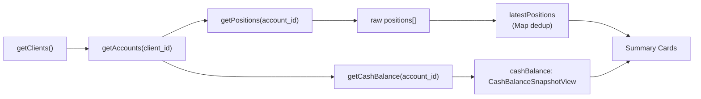

# 운영 대시보드 데이터 실데이터 검증 및 표시 개선 계획

## 1. Mock 잔존 여부 전수 조사 결과 — 1단계 완료 ✅

| 검색 패턴 | OperationsDashboardView | OperationsAlertsView | OrderTrackingView | 결과 |
|-----------|:----------------------:|:--------------------:|:-----------------:|:----:|
| mock / dummy / sample / fixture | 0건 | 0건 | 0건 | ✅ |
| `ordersData` / `alertsData` / `stateEventsData` / `brokerOrdersData` | 0건 | 0건 | 0건 | ✅ |
| `currentPositions` / `Math.random` | 0건 | 0건 | 0건 | ✅ |
| 하드코딩 배열 상수 (`const xxx = [`) | 없음 | 없음 | 없음 | ✅ |
| 하드코딩된 운영 숫자 (추가 확인) | 0건 | 0건 | 0건 | ✅ |

**결론: 세 파일 모두 mock 데이터는 0건. 모든 데이터는 실제 API 호출(`getOrders()`, `getPositions()`, `getCashBalance()` 등)을 통해 가져옵니다.**

---

## 2. AccountsView 데이터 소스 분석 결과 — 2단계 완료 ✅

### 2.1 API 호출 파이프라인



### 2.2 핵심 데이터 가공 규칙

| 항목 | AccountsView 방식 | 필드 |
|------|-------------------|------|
| **Position dedup** | `Map<instrument_id, PositionSnapshotView>` — 최신 `snapshot_at`만 유지 | `latestPositions` |
| **총 자산** | `latestPositions` 각 포지션의 `qty × market_price` 합계 + `cashBalance.settled_cash` | `totalValue` |
| **현금 잔고** | `cashBalance.settled_cash` (단일 계좌 기준) | `settled_cash` |
| **미실현 손익** | `latestPositions`의 `unrealized_pnl` 합계 | `totalPnl` |
| **스냅샷 신선도** | position의 `snapshot_at` / cash balance의 `snapshot_at` | 실제 데이터 기준 |

---

## 3. 운영 대시보드 데이터 매핑 문제 분석 — 3단계 완료 ✅

### Problem A: "현재 포지션 14건" — Position count 불일치 🔴

**원인**: [`OperationsDashboardView.tsx:293-296`](admin_ui/src/components/OperationsDashboardView.tsx:293)
```typescript
const totalPositions = Array.from(data.positionsMap.values()).reduce(
  (sum, arr) => sum + arr.length,  // ← 모든 스냅샷 이력을 DEDUP 없이 단순 합산
  0
);
```
- 동일 instrument에 대해 여러 snapshot이 있으면 중복 카운트
- AccountsView는 `latestPositions` (instrument_id별 1건)만 사용

**수정**: 
1. `instrument_id` 기준 `snapshot_at` 최신값 dedup (동률 시 `created_at` 최신값)
2. dedup 후 `quantity > 0`인 포지션만 카운트

### Problem B: "가용 현금" — Cash balance 불일치 🔴

**원인**: [`OperationsDashboardView.tsx:305-309`](admin_ui/src/components/OperationsDashboardView.tsx:305)
```typescript
for (const cash of data.cashMap.values()) {
  if (cash) {
    totalAvailableCash += cash.available_cash ?? 0;  // ← available_cash 필드
  }
}
```
- AccountsView: `cashBalance.settled_cash` (단일 계좌)
- 운영 대시보드: `cash.available_cash` 합계 (전체 계좌)
- **필드 차이**: `available_cash` ≠ `settled_cash`

**수정**: 
- `settled_cash` 우선 사용
- `settled_cash`가 null/없으면 `available_cash` fallback
- fallback 사용 시 보조 텍스트에 표시

### Problem C: "마지막 스냅샷 없음" — Snapshot freshness 기준 오류 🔴

**원인**: [`OperationsDashboardView.tsx:331-337`](admin_ui/src/components/OperationsDashboardView.tsx:331)
```typescript
const sortedRuns = [...(data.reconRuns ?? [])].sort(...);  // ← 정합성 실행 이력 기준
const lastReconRun = sortedRuns[0] ?? null;
```
- Recon run은 정합성 검사 실행 이력일 뿐, 실제 snapshot과 무관
- 계좌는 있지만 reconciliation run이 없으면 null → "스냅샷 없음"
- AccountsView는 실제 position의 `snapshot_at` 사용

**수정**: 
- 모든 positions/cash 중 최신 `snapshot_at` 값으로 변경
- position+cash 모두 없을 때만 "스냅샷 없음" 표시
- orders 존재와 snapshot 존재는 별개로 판단

### Problem D: "14종목" → 단위 표시 문제 🟡

- 현재 "14종목"으로 표시되지만, 실제로는 중복 포함된 snapshot 수
- dedup 후에는 "5종목" 등으로 변경됨
- 단위는 "종목" 유지 (dedup 기준이므로)

### Problem E: OperationsAlertsView lineage check — Raw count 사용 🟡

**원인**: [`OperationsAlertsView.tsx:320`](admin_ui/src/components/OperationsAlertsView.tsx:320)
```typescript
positionsCount += r.value.length;  // ← raw count (no dedup)
```
- Rule 7 (`ALT-LINEAGE-001`): `orders.length === 0 && positionsCount > 0`
- Raw count 사용 시 중복 스냅샷으로 인한 false positive 가능성

**수정**: instrument_id dedup + quantity > 0 기준으로 count

---

## 4. 수정 계획 — 상세 TODO (보정사항 반영)

### File 1: [`OperationsDashboardView.tsx`](admin_ui/src/components/OperationsDashboardView.tsx)

#### 4.1 Position count dedup (+ quantity > 0 필터) [P0]

**변경 위치**: `derived` useMemo 내부, line 291-296

**변경 전**:
```typescript
const totalPositions = Array.from(data.positionsMap.values()).reduce(
  (sum, arr) => sum + arr.length, 0
);
```

**변경 후**:
```typescript
// instrument_id 기준 최신 snapshot만 유지 (AccountsView와 동일 기준)
// 동률 시 created_at 최신값 우선
const latestPositionMap = new Map<string, PositionSnapshotView>();
for (const positions of data.positionsMap.values()) {
  for (const p of positions) {
    const existing = latestPositionMap.get(p.instrument_id);
    if (!existing || p.snapshot_at > existing.snapshot_at ||
        (p.snapshot_at === existing.snapshot_at && (p.created_at ?? '') > (existing.created_at ?? ''))) {
      latestPositionMap.set(p.instrument_id, p);
    }
  }
}
// quantity > 0인 포지션만 카운트
const totalPositions = Array.from(latestPositionMap.values())
  .filter(p => (p.quantity ?? 0) > 0).length;
```

#### 4.2 Cash balance 필드 변경 (`settled_cash` 우선 + fallback) [P0]

**변경 위치**: `derived` useMemo 내부, line 305-309

**변경 전**:
```typescript
for (const cash of data.cashMap.values()) {
  if (cash) {
    totalAvailableCash += cash.available_cash ?? 0;
  }
}
```

**변경 후**:
```typescript
let usedFallback = false;
for (const cash of data.cashMap.values()) {
  if (cash) {
    const val = cash.settled_cash ?? cash.available_cash;
    if (val !== null && val !== undefined) {
      totalAvailableCash += val;
    }
    if (cash.settled_cash === null || cash.settled_cash === undefined) {
      usedFallback = true;
    }
  }
}
```

`usedFallback`을 derived와 subtitle에 반영:
```typescript
return {
  totalPositions,
  totalUnrealizedPnl,
  totalAvailableCash,
  cashUsedFallback: usedFallback,  // 추가
  // ...
};
```

StatusCard subtitle:
```typescript
subtitle={d.cashUsedFallback 
  ? "출처: /cash-balance (settled_cash 없음, available_cash fallback)"
  : "출처: /cash-balance (settled_cash 합계)"}
```

#### 4.3 Snapshot freshness 기준 변경 (position/cash snapshot_at) [P0]

**변경 위치**: `derived` useMemo 내부, line 331-337

**변경 전**:
```typescript
// Snapshot freshness: latest reconciliation run
const sortedRuns = [...(data.reconRuns ?? [])].sort(
  (a, b) =>
    new Date(b.started_at ?? 0).getTime() -
    new Date(a.started_at ?? 0).getTime()
);
const lastReconRun = sortedRuns[0] ?? null;
```

**변경 후**:
```typescript
// Snapshot freshness: position/cash snapshot_at 최신값
let latestSnapshotAt: string | null = null;
for (const positions of data.positionsMap.values()) {
  for (const p of positions) {
    if (p.snapshot_at && (!latestSnapshotAt || p.snapshot_at > latestSnapshotAt)) {
      latestSnapshotAt = p.snapshot_at;
    }
  }
}
for (const cash of data.cashMap.values()) {
  if (cash?.snapshot_at && (!latestSnapshotAt || cash.snapshot_at > latestSnapshotAt)) {
    latestSnapshotAt = cash.snapshot_at;
  }
}
```

**관련 변경**: StatusCard 렌더링 부분 line 463-469

**변경 전**:
```typescript
const snapshotTime = d.lastReconRun?.started_at ?? null;
const snapshotStatus = snapshotTime
  ? timeAgo(snapshotTime)
  : "스냅샷 없음";
const snapshotVariant = snapshotTime
  ? (Date.now() - new Date(snapshotTime).getTime() < 5 * 60 * 1000 ? "healthy" as const : "warning" as const)
  : "error" as const;
```

**변경 후**:
```typescript
const snapshotTime = d.latestSnapshotAt;
const snapshotStatus = snapshotTime
  ? timeAgo(snapshotTime)
  : "스냅샷 없음";
const snapshotVariant = snapshotTime
  ? (Date.now() - new Date(snapshotTime).getTime() < 5 * 60 * 1000 ? "healthy" as const : "warning" as const)
  : "error" as const;
```

#### 4.4 derived 반환에 `latestSnapshotAt` 추가

```typescript
return {
  totalPositions,
  totalUnrealizedPnl,
  totalAvailableCash,
  cashUsedFallback,
  latestSnapshotAt,
  // ... 기존 필드 유지
};
```

#### 4.5 데이터 출처 라벨 추가 (P2, 선택 — 시간되면 포함)

변경 예시:
| 카드 | 현재 subtitle | 변경 후 subtitle |
|------|-------------|-----------------|
| 현재 포지션 | `총 평가액: ...` | `출처: /positions (최신 스냅샷 기준, quantity>0)` |
| 가용 현금 | `전체 계좌 합계` | `출처: /cash-balance (settled_cash 합계)` |
| 마지막 스냅샷 | `기준: HH:MM:SS` | `출처: /positions, /cash-balance snapshot_at` |
| API 상태 | `Health endpoint` | `출처: GET /health` |
| 오늘 AI 결정 | `에이전트 실행 ...` | `출처: GET /agent-runs` |
| 오늘 주문 제출 | `체결 N / 대기 N` | `출처: GET /orders` |
| 미실현 손익 | `포지션 없음 / %` | `출처: /positions unrealized_pnl` |

### File 2: [`OperationsAlertsView.tsx`](admin_ui/src/components/OperationsAlertsView.tsx)

#### 4.6 Position count dedup + quantity > 0 (lineage check) [P1]

**변경 위치**: `fetchAlerts` 내부, line 312-324

**변경 전**:
```typescript
let positionsCount = 0;
// ...
posResults.forEach((r) => {
  if (r.status === "fulfilled") {
    positionsCount += r.value.length;
  }
});
```

**변경 후**:
```typescript
let positionsCount = 0;
// ...
const dedupPositions = new Map<string, PositionSnapshotView>();
posResults.forEach((r) => {
  if (r.status === "fulfilled") {
    for (const pos of r.value) {
      const existing = dedupPositions.get(pos.instrument_id);
      if (!existing || pos.snapshot_at > existing.snapshot_at ||
          (pos.snapshot_at === existing.snapshot_at && (pos.created_at ?? '') > (existing.created_at ?? ''))) {
        dedupPositions.set(pos.instrument_id, pos);
      }
    }
  }
});
positionsCount = Array.from(dedupPositions.values())
  .filter(p => (p.quantity ?? 0) > 0).length;
```

**참고**: `PositionSnapshotView` 타입 import 필요 (추가)

---

## 5. 수정 우선순위

| 순위 | 항목 | 영향도 | 난이도 |
|:----:|------|--------|:------:|
| **P0** | Position count dedup + quantity>0 필터 | "14건" → 실제 종목 수 | `하` |
| **P0** | Cash balance `settled_cash` 우선 + fallback | AccountsView와 불일치 해소 | `하` |
| **P0** | Snapshot freshness 기준(position/cash snapshot_at) | "스냅샷 없음" 오류 해소 | `중` |
| **P1** | AlertsView lineage count dedup + quantity>0 | False positive 방지 | `하` |
| **P2** | 데이터 출처 라벨 (선택) | 가독성 개선 | `중` |

---

## 6. 검증 절차

```bash
# (1) TypeScript 빌드
cd /workspace/agent_trading/admin_ui && npm run build

# (2) 단위 테스트
cd /workspace/agent_trading/admin_ui && npm run test:run

# (3) 브라우저 확인
# - #/ 운영 대시보드
# - #/accounts 계좌
# - #/operations/alerts 운영 경고

# (4) 수동 비교 포인트
# - "현재 포지션 14건"이 사라졌는가?
# - 예수금이 계좌 메뉴와 일치하는가?
# - "마지막 스냅샷 없음"이 실제 snapshot 존재 여부와 일치하는가?
# - 포지션 0건 상태가 정상적으로 표시되는가?
```

---

## 7. 최종 보고 체크리스트

- [ ] 수정 파일: `OperationsDashboardView.tsx`, `OperationsAlertsView.tsx`
- [ ] "14건" 표시 원인과 수정 결과 설명
- [ ] Cash 불일치 원인과 수정 결과 설명
- [ ] 마지막 스냅샷 기준 변경 결과 설명
- [ ] Build/Test 결과
- [ ] 브라우저 수동 비교 결과
