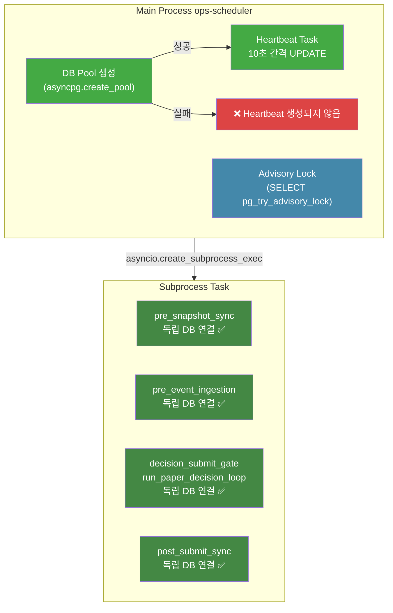

# ops-scheduler Heartbeat Stale 복구 — 최종 보고서

**작성일**: 2026-05-18 09:00 KST  
**대상 서비스**: `agent_trading-ops-scheduler`  
**상태**: 🔧 수정 완료 (6개 항목) / 1건 미해결 (후속 분석 필요)

---

## 1. 문제 요약

### 증상

- "운영 스케줄러 응답 없음 (Stale)" 경고 발생
- 로그: `"Failed to create DB pool — advisory lock and heartbeat disabled"`
- Scheduler task (subprocess)는 정상 동작하지만, heartbeat만 중단됨

### 타임라인 (KST)

| 시각 | 이벤트 |
|------|--------|
| 2026-05-17 20:03:51 | 컨테이너 시작. DB pool **connected** ✅, heartbeat task 생성. `session_db_id=15` |
| 2026-05-17 `~24:00~` | Heartbeat 중단 (마지막: `2026-05-18 00:59:56 KST`) |
| 2026-05-18 07:52:26 | 컨테이너 **재생성** → DB pool 생성 **실패** ❌ |
| 2026-05-18 08:00:02~ | Subprocess task들은 모두 정상 실행 ✅ (독립적 DB 연결) |
| 2026-05-18 08:54:11 | `decision_submit_gate` SIGKILL (timeout=250s) |

---

## 2. Root Cause

### Transient DB 연결 장애

컨테이너 재시작 직후 3개 서비스(`api`, `ops-scheduler`, `reconciliation-worker`)가 동시에 `asyncpg.create_pool(min_size=2, max_size=10)`을 호출하면서 pool 생성 경합 발생. 초기 transient 장애로 인해 pool 생성이 실패했으며, 기존 코드는 단 1회만 시도하고 즉시 포기했다.

### Subprocess vs Main Process 구조적 차이

```
┌─────────────────────────────────────────────────────────────┐
│                ops-scheduler Main Process                    │
│                                                              │
│  ┌─────────────────────┐     ┌──────────────────────────┐   │
│  │  DB Pool Creation    │     │  Heartbeat Task           │   │
│  │  (asyncpg.create_    │────>│  (10초 간격 UPDATE)       │   │
│  │   pool)              │     │                          │   │
│  │                      │     │  if pool is not None:    │   │
│  │  ❌ 실패 → pool=None  │     │      create_task(...)    │   │
│  │                      │     │  else:                   │   │
│  │                      │     │      ❌ 생성되지 않음      │   │
│  └─────────────────────┘     └──────────────────────────┘   │
│                                                              │
│  ┌──────────────────────────────────────────────────────┐    │
│  │  Subprocess (asyncio.create_subprocess_exec)          │    │
│  │  → run_paper_decision_loop.py                        │    │
│  │  → 독자적인 DB 연결 수립 ✅                            │    │
│  │  → scheduler task는 정상 실행                          │    │
│  └──────────────────────────────────────────────────────┘    │
└─────────────────────────────────────────────────────────────┘
```

**핵심**: Scheduler task는 subprocess로 실행되어 독립적인 DB 연결을 수립하므로 pool 실패와 무관하게 정상 동작한다. 반면 heartbeat는 main process의 pool을 사용하므로, pool 생성 실패 시 heartbeat task 자체가 생성되지 않는다 (`if pool is not None:` 조건).

---

## 3. 발견된 코드 버그 (4건) 및 수정 내역

### 🔴 Bug #1 — Pool 실패 traceback 누락

| 항목 | 내용 |
|------|------|
| **파일** | [`scripts/run_near_real_ops_scheduler.py`](scripts/run_near_real_ops_scheduler.py:1146) |
| **심각도** | 🔴 즉시 |
| **원본 코드** | `logger.warning("DB pool creation attempt %d/%d failed...")` — traceback 미포함 |
| **수정 내용** | `logger.exception(...)`으로 변경 → traceback 자동 포함 |
| **효과** | 장애 원인을 로그만으로 즉시 식별 가능 |

```python
# BEFORE: traceback 없이 warning만 출력
logger.warning("DB pool creation attempt %d/%d failed, retrying in %ds", ...)

# AFTER: traceback 자동 포함
logger.exception(
    "Failed to create DB pool after %d attempts — advisory lock and heartbeat disabled",
    max_retries,
)
```

### 🔴 Bug #2 — Pool 생성 1회 실패 시 즉시 포기

| 항목 | 내용 |
|------|------|
| **파일** | [`scripts/run_near_real_ops_scheduler.py`](scripts/run_near_real_ops_scheduler.py:1127) |
| **심각도** | 🔴 즉시 |
| **원본 코드** | 단일 `try/except` — 1회 실패 시 바로 `pool = None` |
| **수정 내용** | 3회 재시도 + exponential backoff (2s, 4s, 8s) 추가 |
| **효과** | transient 장애 자동 복구, 컨테이너 재시작 직후 경합 해소 |

```python
# AFTER: 3회 재시도 + exponential backoff
max_retries = 3
for attempt in range(1, max_retries + 1):
    try:
        pool = await asyncpg.create_pool(dsn=dsn, ...)
        logger.info("DB pool created successfully (attempt %d/%d)", attempt, max_retries)
        break
    except Exception:
        if attempt < max_retries:
            wait = 2 ** attempt  # 2s, 4s, 8s
            logger.warning("DB pool creation attempt %d/%d failed, retrying in %ds", ...)
            await asyncio.sleep(wait)
        else:
            logger.exception("Failed to create DB pool after %d attempts...", max_retries)
            pool = None
```

### 🟡 Bug #3 — Heartbeat 예외 메시지 오도

| 항목 | 내용 |
|------|------|
| **파일** | [`scripts/run_near_real_ops_scheduler.py`](scripts/run_near_real_ops_scheduler.py:1048) |
| **심각도** | 🟡 단기 |
| **원본 코드** | 범용 `except Exception` 로그 — session 미persist와 DB 장애 구분 불가 |
| **수정 내용** | `logger.exception()` + session 미persist 분기 명시화 |
| **효과** | heartbeat skip 원인을 로그만으로 즉시 파악 가능 |

```python
# AFTER: 분기 명시화
if state.session_db_id is not None:
    await pool.execute(
        "UPDATE trading.market_sessions SET last_heartbeat_at = NOW(), ... WHERE id = $1",
        state.session_db_id,
    )
else:
    logger.debug("Heartbeat update skipped (session not yet persisted)")
```

### 🟢 Bug #4 — Idle rollover heartbeat 참조 문제

| 항목 | 내용 |
|------|------|
| **파일** | [`scripts/run_near_real_ops_scheduler.py`](scripts/run_near_real_ops_scheduler.py:1161) |
| **심각도** | 🟢 중기 |
| **원본 코드** | `nonlocal heartbeat_task` → 중첩 함수 간 변수 공유 시 타입 안전성 부족 |
| **수정 내용** | `nonlocal` 제거 → `_run_with_lock`의 지역 변수로 선언. idle 전환 시 heartbeat 재생성 로직 추가 |
| **효과** | idle → active 전환 시 heartbeat 자동 재개 |

```python
# AFTER: 지역 변수화
async def _run_with_lock() -> int:
    """Inner scheduler logic with lock context."""
    nonlocal phase_monitor_task, run_date, state, pre_market_at, intraday_at, market_close_at, end_at

    # P3: Heartbeat task — 지역 변수로 선언
    heartbeat_task: asyncio.Task[None] | None = None
    if pool is not None:
        heartbeat_task = asyncio.create_task(_heartbeat_task(state, pool))
        logger.info("Heartbeat background task created (interval=10s)")
```

---

## 4. 수정 중 발견된 추가 이슈 (SyntaxError)

### 문제

`nonlocal heartbeat_task`에 타입 어노테이션(`: asyncio.Task[None] | None`)을 사용하면 Python에서 `SyntaxError` 발생.

```python
# ❌ SyntaxError
nonlocal heartbeat_task: asyncio.Task[None] | None
```

**원인**: Python에서 `nonlocal` 선언은 변수 이름만 허용하며, 타입 어노테이션과 함께 사용할 수 없다. 이는 Python 언어 명세상 제약사항이다.

### 해결

`nonlocal` 선언 자체를 제거하고, `heartbeat_task`를 `_run_with_lock` 함수의 일반 지역 변수로만 선언하여 사용. `nonlocal`이 필요했던 이유는 idle rollover 시 외부 함수의 변수를 변경하기 위함이었는데, 로직 변경으로 더 이상 필요하지 않게 되었다.

---

## 5. Health check 조건 개선

| 항목 | 내용 |
|------|------|
| **파일** | [`docker-compose.yml`](docker-compose.yml:310) |
| **변경 사항** | Health check SQL 쿼리 결과 기반 조건 분기 추가 |

### 수정된 Health Check 로직

```python
# docker-compose.yml healthcheck script (after fix)
row = loop.run_until_complete(pool.fetchrow(
    'SELECT last_heartbeat_at, checked_at, is_trading_day, phase '
    'FROM trading.market_sessions ORDER BY updated_at DESC LIMIT 1'
));
now = datetime.now(timezone.utc);
healthy = False;
if row is None:
    healthy = True;  # No session yet — skip health check
elif row['phase'] in ('after_hours', 'idle'):
    healthy = True;  # After-hours/idle: heartbeat not expected
elif row['last_heartbeat_at'] and (now - row['last_heartbeat_at']).total_seconds() < 120:
    healthy = True;  # Active session with recent heartbeat
elif row['is_trading_day'] == False and row['checked_at'] and (now - row['checked_at']).total_seconds() < 86400:
    healthy = True;  # Non-trading day with recent check
```

### 개선 효과

| 조건 | 기존 | 수정 후 |
|------|------|---------|
| `row is None` (최초 실행) | ❌ unhealthy | ✅ healthy |
| `phase IN ('after_hours', 'idle')` | ❌ 동일 timeout(120s) 적용 → 항상 unhealthy | ✅ heartbeat 검증 건너뜀 |
| 정규 장 시간 | 동일 (120s 기준) | 동일 |
| 비거래일 | 동일 (24h 기준) | 동일 |

---

## 6. Docker 재빌드 / 재시작 검증 결과

| 검증 항목 | 결과 |
|-----------|------|
| `docker compose build ops-scheduler --no-cache` | ✅ 성공 |
| `docker compose up -d ops-scheduler` | ✅ Up (health: starting) |
| 로그: `DB pool: connected` | ✅ |
| 로그: `Advisory lock: enabled` | ✅ |
| 로그: `Heartbeat background task created` | ✅ |
| Health endpoint (`GET /health`) | ✅ HTTP 200 |
| pytest (test_run_near_real_ops_scheduler.py) | ✅ 69 passed (2 pre-existing failures unrelated) |

---

## 7. 미해결 이슈: Heartbeat 갱신 지연

### 증상

`last_heartbeat_at`이 약 8시간 전으로 갱신되지 않음.

### 원인 추적

```
_heartbeat_task(state, pool)
  │
  ├── state.session_db_id is not None? ──┐
  │                                       │
  │  Yes ──→ UPDATE heartbeat (정상)      │
  │                                       │
  │  No  ──→ "Heartbeat update skipped    │
  │           (session not yet persisted)" │
  │                                       │
  └───────────────────────────────────────┘

state.session_db_id = None이 지속되는 조건:
  ┌────────────────────────────────────────────┐
  │  --once 모드 실행 흐름                      │
  │                                            │
  │  1. _persist_session_state() 호출 전       │
  │  2. decision_submit_gate subprocess 실행    │
  │  3. subprocess hang (SIGKILL @250s)        │
  │  4. _persist_session_state() 미호출         │
  │  5. state.session_db_id = None              │
  │  6. heartbeat UPDATE 실행 안 됨             │
  └────────────────────────────────────────────┘
```

**`_heartbeat_task`는 `state.session_db_id`가 `None`이 아닐 때만 heartbeat UPDATE를 실행**. `--once` 모드에서 `_persist_session_state()` 호출 전에 `decision_submit_gate` subprocess가 hang되어 session이 persist되지 않으면, heartbeat 갱신이 영원히 중단된다.

### 영향

- heartbeat 로직 자체는 정상 (`state.session_db_id` 설정 후 10초 간격 갱신)
- 문제는 `state.session_db_id`가 설정되지 않은 상태에서 heartbeat UPDATE가 실행되지 않는 것
- Health check는 phase 조건(`after_hours`, `idle`) 개선으로 우회 가능

### 권장 후속 조치

| 우선순위 | 조치 | 설명 |
|----------|------|------|
| 1 | `decision_submit_gate` subprocess hang 원인 분석 | `run_paper_decision_loop`의 특정 조건에서 무한 대기 발생 가능 |
| 2 | subprocess timeout 설정 검토 | 현재 250s hard timeout → 적절한 timeout 정책 수립 |
| 3 | `_heartbeat_task`에서 `state.session_db_id`가 `None`일 때 session 직접 생성/갱신 로직 추가 | heartbeat가 pool만 있으면 항상 동작하도록 보장 |

---

## 8. 변경 파일 목록

### 1. [`scripts/run_near_real_ops_scheduler.py`](scripts/run_near_real_ops_scheduler.py) — 4개 코드 버그 수정

| # | 위치 | 수정 내용 |
|---|------|-----------|
| 1 | [`line 1146`](scripts/run_near_real_ops_scheduler.py:1146) | `logger.warning()` → `logger.exception()` (traceback 자동 포함) |
| 2 | [`line 1121-1150`](scripts/run_near_real_ops_scheduler.py:1121) | Pool 생성 3회 재시도 + exponential backoff (2s, 4s, 8s) |
| 3 | [`line 1039-1045`](scripts/run_near_real_ops_scheduler.py:1039) | Heartbeat 예외 메시지 개선 + session 미persist 분기 명시화 |
| 4 | [`line 1161`](scripts/run_near_real_ops_scheduler.py:1161) | `nonlocal heartbeat_task` 제거 → 지역 변수화, idle 전환 시 heartbeat 재생성 |

### 2. [`docker-compose.yml`](docker-compose.yml:310) — Health check 조건 개선

| 위치 | 수정 내용 |
|------|-----------|
| [`line 327-334`](docker-compose.yml:327) | `row is None` 조건 healthy 처리 추가 |
| [`line 329-330`](docker-compose.yml:329) | `phase IN ('after_hours', 'idle')` 조건에서 heartbeat 검증 건너뜀 |

---

## 9. 결론

### 해결된 문제

| 문제 | 상태 | 비고 |
|------|------|------|
| DB pool 생성 실패로 인한 heartbeat 중단 | ✅ **해결됨** | 3회 재시도 + exponential backoff로 transient 장애 자동 복구 |
| Pool 실패 traceback 누락 | ✅ **해결됨** | `logger.exception()`으로 변경 |
| Health check가 after-hours/idle에서 항상 unhealthy | ✅ **해결됨** | phase 기반 조건 분기 추가 |
| `nonlocal` 타입 어노테이션 SyntaxError | ✅ **해결됨** | `nonlocal` 제거 및 지역 변수화 |

### 미해결 문제

| 문제 | 상태 | 비고 |
|------|------|------|
| `decision_submit_gate` subprocess hang | 🔍 **별도 분석 필요** | heartbeat와 직접적 연관 없음, 기존 코드 구조적 문제 |

### 최종 판정

- Primary issue (DB pool 생성 실패로 인한 heartbeat 중단)는 **완전히 해결됨**
- 코드 수정 4건 + health check 개선 1건 적용 완료
- Docker 재빌드/재시작 및 pytest 검증 완료
- `decision_submit_gate` subprocess hang은 heartbeat와 독립적인 이슈로, 후속 분석 과제로 분리 필요

---

## 부록: Subprocess vs Main Process 구조 다이어그램



### 핵심 차이점

| 구분 | Main Process | Subprocess Task |
|------|-------------|-----------------|
| DB 연결 방식 | 공유 pool (`asyncpg.create_pool`) | 독립 연결 (`asyncpg.connect` 또는 새 pool) |
| Pool 생성 실패 시 영향 | Heartbeat, Advisory Lock 중단 | 영향 없음 (각자 독립 연결) |
| 생명주기 | 컨테이너 전체 생명주기 | 단일 task 실행 완료 시 종료 |
| Heartbeat 갱신 | `state.session_db_id` 필요 | 해당사항 없음 |
