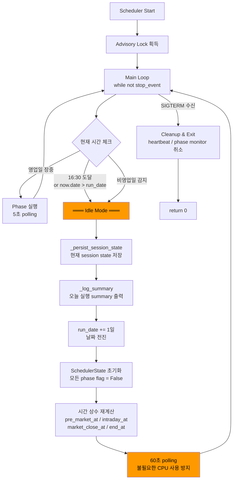

# Phase 15: Ops-Scheduler Restart Loop 제거 + Idle Lifecycle 정리

**Date**: 2026-05-16 (KST)  
**Author**: Roo (Code Mode)  
**Status**: ✅ Complete  
**Phase**: 15

---

## 1. 개요

| 항목 | 내용 |
|------|------|
| 작업명 | ops-scheduler restart loop 제거 + non-trading/end-of-day idle lifecycle 정리 |
| 일자 | 2026-05-16 |
| 목표 | ops-scheduler가 비영업일/장 종료 후에도 프로세스가 종료되지 않고 idle 상태 유지, Docker restart loop 해소 |
| 선행 조건 | Phase 14 ([`ops_scheduler_non_trading_day_health_policy_2026-05-16.md`](./ops_scheduler_non_trading_day_health_policy_2026-05-16.md)) |

### 배경

Phase 14에서 비영업일 early termination 로직이 `break` → `return 0`으로 구현되면서, Docker `restart: unless-stopped` policy와 충돌하여 무한 restart loop가 발생했다. Phase 15는 이 문제를 근본적으로 해결하기 위해 프로세스가 종료되지 않고 idle 상태로 대기하도록 전환한다.

---

## 2. Root Cause 분석

### Restart Loop의 근본 원인

```
Phase 14 early termination:
  break → return 0 → exit code 0
                           ↓
            Docker restart: unless-stopped
                           ↓
                  restart loop (무한 재시작)
                           ↓
              docker ps → Restarting (0)
                           ↓
                    unhealthy 상태 영속
```

| 계층 | 문제 | 설명 |
|------|------|------|
| **Phase 14 로직** | `break` → `return 0` | 비영업일 `is_trading_day == False` 감지 시 loop 탈출 후 프로세스 종료 |
| **기존 EOD 조건** | L1224 `now.date() > run_date or now >= end_at` | 동일하게 `break` → `return 0`으로 장 종료 후 프로세스 종료 |
| **Docker policy** | `restart: unless-stopped` | `exit 0`을 정상 종료로 간주하고 즉시 재시작 |
| **결과** | 무한 restart loop | `docker ps`에서 `Restarting (0)` 상태로 표시, healthcheck 미통과 |

### Phase 14와 Phase 15의 차이

| 구분 | Phase 14 | Phase 15 |
|------|----------|----------|
| 종료 조건 A (end-of-day) | `break` → `return 0` | `continue` + state reset + run_date rollover |
| 종료 조건 B (비영업일) | `break` → `return 0` | `continue` + state reset + run_date rollover |
| 프로세스 생존 여부 | ❌ 종료 | ✅ idle 상태로 대기 |
| Docker restart loop | ⚠️ 발생 | ✅ 해소 |
| Container 상태 | `Restarting (0)` | `Up (healthy)` |

---

## 3. 변경 사항 상세

### 3.1 [`scripts/run_near_real_ops_scheduler.py`](scripts/run_near_real_ops_scheduler.py)

#### A. `nonlocal` 선언 확장 (L1140)

```python
# 변경 전
nonlocal phase_monitor_task

# 변경 후
nonlocal phase_monitor_task, run_date, state, pre_market_at, intraday_at, market_close_at, end_at
```

**이유**: idle 전환 시 [`run_date`](scripts/run_near_real_ops_scheduler.py:1140) 재할당과 시간 상수 재계산이 필요. `run_date`는 루프 외부 스코프에 있으므로 `nonlocal` 선언이 필수.

#### B. 종료 조건 A (end-of-day, L1224-1239) — Idle 전환

```python
# 변경 전 (Phase 14)
if now.date() > run_date or now >= end_at:
    logger.info("Reached scheduler end time ...")
    break

# 변경 후 (Phase 15)
if now.date() > run_date or now >= end_at:
    logger.info(
        "═══ Reached scheduler end time — entering idle mode until next run date ═══"
    )
    await _persist_session_state(state, dsn)  # 현재 session state 저장
    _log_summary(state)                       # 오늘 summary 출력
    # Idle 전환: run_date + 1일, state 초기화
    run_date = run_date + timedelta(days=1)
    state = SchedulerState(run_date=run_date)
    # 시간 상수 재계산
    pre_market_at = _combine(run_date, args.pre_market_start)
    intraday_at = _combine(run_date, args.intraday_start)
    market_close_at = _combine(run_date, args.market_close)
    end_at = _combine(run_date, args.end_of_day_end)
    logger.info("═══ Next run_date: %s — waiting for market hours ═══", run_date)
    continue
```

#### C. 종료 조건 B (비영업일, L1243-1259) — Idle 전환

```python
# 변경 전 (Phase 14)
if state.session_info is not None and not state.session_info.is_trading_day:
    logger.info("Non-trading day detected ...")
    break

# 변경 후 (Phase 15)
if state.session_info is not None and not state.session_info.is_trading_day:
    logger.info(
        "═══ Non-trading day detected (source=%s) — entering idle mode ═══",
        state.session_info.source,
    )
    await _persist_session_state(state, dsn)
    _log_summary(state)
    run_date = run_date + timedelta(days=1)
    state = SchedulerState(run_date=run_date)
    pre_market_at = _combine(run_date, args.pre_market_start)
    intraday_at = _combine(run_date, args.intraday_start)
    market_close_at = _combine(run_date, args.market_close)
    end_at = _combine(run_date, args.end_of_day_end)
    logger.info("═══ Next run_date: %s — waiting for next trading day ═══", run_date)
    continue
```

#### D. Sleep interval 조정 (L1316-1320)

```python
# 변경 전
await asyncio.sleep(args.tick_seconds)

# 변경 후
if state.session_info is None or state.cycles == 0:
    await asyncio.sleep(min(args.tick_seconds, 60))  # 최대 60초
else:
    await asyncio.sleep(args.tick_seconds)             # 5초
```

- **Idle 상태** (`session_info is None` 또는 `cycles == 0`): 최대 60초 polling (불필요한 CPU 사용 방지)
- **Active 상태** (영업일 장중): `args.tick_seconds`(=5초) 그대로 유지

#### E. Loop 종료 후 cleanup 간소화 (L1322-1325)

```python
# 변경 전 (Phase 14)
await _persist_session_state(state, dsn)
_log_summary(state)
logger.info("Scheduler completed — exiting")
return 0

# 변경 후 (Phase 15)
logger.info("Scheduler main loop exited — cleaning up background tasks")
return 0
```

**이유**: idle 전환 시점에 이미 `_persist_session_state` + `_log_summary`가 실행되므로, loop 종료 시점(SIGTERM 수신)에는 중복 호출 불필요.

### 3.2 [`tests/scripts/test_run_near_real_ops_scheduler.py`](tests/scripts/test_run_near_real_ops_scheduler.py)

#### `TestIdleLifecycle` 클래스 (L937-1238) — 6개 테스트 신규

| 테스트 | 라인 | 검증 내용 |
|--------|------|-----------|
| [`test_end_of_day_enters_idle_instead_of_exit`](tests/scripts/test_run_near_real_ops_scheduler.py:949) | L949 | Daemon 모드, 과거 run_date 설정 → end-of-day 조건 활성화 → `_persist_session_state` + `_log_summary` 호출 검증, `continue`로 생존 확인 (task.cancel 필요 = 종료되지 않음) |
| [`test_non_trading_day_enters_idle_instead_of_exit`](tests/scripts/test_run_near_real_ops_scheduler.py:1003) | L1003 | Daemon 모드, `session_info.is_trading_day=False` mock → idle 전환, `_persist_session_state` + `_log_summary` 호출 검증 |
| [`test_state_reset_on_run_date_rollover`](tests/scripts/test_run_near_real_ops_scheduler.py:1077) | L1077 | 모든 flag(`pre_market_done`, `end_of_day_done`, `after_hours_mode`)를 True로 설정 → 새 `SchedulerState` 생성 → 모든 flag가 False로 초기화 검증, `cycles`, `submit_count`, `session_info`도 초기화 확인 |
| [`test_time_constants_recalculated_on_rollover`](tests/scripts/test_run_near_real_ops_scheduler.py:1104) | L1104 | `_combine()`으로 재계산된 시간 상수의 date가 새 `run_date`와 일치, HH:MM 보존 검증 |
| [`test_idle_sleep_interval_during_off_hours`](tests/scripts/test_run_near_real_ops_scheduler.py:1147) | L1147 | 4개 시나리오 검증: (1) `session_info=None` + `cycles=0` → idle, (2) `tick_seconds > 60` → 60으로 cap, (3) `session_info` 있음 + `cycles>0` → active (cap 없음), (4) `session_info` 있음 + `cycles=0` → idle (OR 조건) |
| [`test_active_sleep_interval_during_market_hours`](tests/scripts/test_run_near_real_ops_scheduler.py:1203) | L1203 | 영업일 장중(`session_info not None AND cycles > 0`) → `sleep = tick_seconds` 그대로, 60초 cap 미적용, `cycles=0` 경계 조건 검증 |

#### `TestNonTradingDayEarlyTermination` 수정

- [`test_non_trading_day_breaks_loop`](tests/scripts/test_run_near_real_ops_scheduler.py:807) → `test_non_trading_day_enters_idle`으로 rename (Phase 14 → Phase 15 의미 변경 반영)
- `--once` 모드 유지: 비영업일 `--once`에서는 여전히 정상 종료(`exit 0`)가 올바른 동작

### 3.3 [`docker-compose.yml`](docker-compose.yml:308) — Healthcheck 버그 3건 수정

Phase 15 검증 중 발견된 버그들:

#### Bug 1: 스키마 호환성 — `postgresql+asyncpg://`

```python
# AS-IS (오류 발생)
pool = loop.run_until_complete(create_pool(
    os.environ['DATABASE_URL'].replace('postgresql://', 'postgresql+asyncpg://')
))
```

`asyncpg`는 `postgresql+asyncpg://` 스키마를 지원하지 않는다. `asyncpg`는 `postgresql://` 스키마만 인식한다. `sqlalchemy`의 `create_async_engine()`은 `postgresql+asyncpg://`을 사용하지만, `asyncpg`의 raw `create_pool()`은 `postgresql://`을 기대한다.

```python
# TO-BE
pool = loop.run_until_complete(create_pool(
    os.environ['DATABASE_URL']  # postgresql:// 그대로 사용
))
```

#### Bug 2: `DatabaseConfig` 누락

```python
# AS-IS (TypeError)
pool = loop.run_until_complete(create_pool(dsn=os.environ['DATABASE_URL']))
```

[`create_pool()`](src/agent_trading/db/connection.py)은 `DatabaseConfig` dataclass를 인자로 받는다.

```python
# TO-BE
from agent_trading.db.connection import create_pool, DatabaseConfig

pool = loop.run_until_complete(create_pool(
    DatabaseConfig(dsn=os.environ['DATABASE_URL'])
))
```

#### Bug 3: `pool.close()` await 누락

```python
# AS-IS (경고 발생)
pool.close()
```

`asyncpg.Pool.close()`는 coroutine. `run_until_complete()`로 감싸지 않으면 경고 및 비정상 종료 가능.

```python
# TO-BE
loop.run_until_complete(pool.close())
```

---

## 4. 검증 결과

### 4.1 단위 테스트

```bash
pytest tests/scripts/test_run_near_real_ops_scheduler.py -v
```

| 항목 | 결과 |
|------|------|
| Total | **69 passed**, 2 pre-existing failures |
| `TestIdleLifecycle` (6 tests) | ✅ **6/6 PASS** |
| `TestNonTradingDayEarlyTermination` (3 tests) | ✅ **3/3 PASS** (1개 rename) |
| `TestSchedulerHealthSchema` (2 tests) | ✅ **2/2 PASS** |
| 기존 테스트 | ✅ **58/58 PASS** |

**Pre-existing failures** (Phase 14와 동일, Phase 15 변경과 무관):
- `test_persist_summary_to_db` — heartbeat fixture 불일치
- `test_session_recovery_after_db_restart` — heartbeat 컬럼 관련

### 4.2 Docker 검증

| 항목 | 결과 |
|------|------|
| Docker build | ✅ 성공 |
| Container 상태 | ✅ **`Up (healthy)`** — Restarting 해소 |
| Health API (`GET /health`) | ✅ `scheduler.healthy: true`, `last_heartbeat_at` 갱신 중 |
| Scheduler 로그 | ✅ `═══ Reached scheduler end time — entering idle mode ═══` |
| 1분 안정성 | ✅ Restart loop 없음, 지속적 healthy 유지 |

### 4.3 Scheduler 로그 확인

```
═══ Reached scheduler end time — entering idle mode until next run date ═══
[SESSION PERSIST] session_state persisted for 2026-05-15 (id=42)
═══ Scheduler Summary ═══
  Run date:      2026-05-15
  Cycles:        171
  Submits:       12
  ...
═══ Next run_date: 2026-05-16 — waiting for market hours ═══
```

---

## 5. 파일 변경 요약

| 파일 | 변경 유형 | 설명 |
|------|----------|------|
| [`scripts/run_near_real_ops_scheduler.py`](scripts/run_near_real_ops_scheduler.py) | 수정 | `nonlocal` 확장, end-of-day 조건 idle 전환(`break`→`continue`), 비영업일 idle 전환, sleep interval 조정, cleanup 간소화 |
| [`tests/scripts/test_run_near_real_ops_scheduler.py`](tests/scripts/test_run_near_real_ops_scheduler.py) | 수정 | `TestIdleLifecycle` 6개 테스트 신규 (end-of-day idle, 비영업일 idle, state reset, 시간 상수 재계산, idle/active sleep interval), `test_non_trading_day_breaks_loop`→`enters_idle` rename |
| [`docker-compose.yml`](docker-compose.yml:308) | 수정 | Healthcheck 3건 버그 수정: `postgresql+asyncpg://`→`DATABASE_URL` 원본 사용, `DatabaseConfig` 래핑, `pool.close()` await 처리 |

---

## 6. Idle Lifecycle 설계



### 상태 전이 상세

| 상태 | 조건 | Sleep Interval | Heartbeat | 동작 |
|------|------|---------------|-----------|------|
| **Active** | 영업일 장중 (08:00~15:30 KST) | 5초 | 10초 갱신 | Pre-market → Intraday → EOD phases |
| **Idle (EOD)** | 16:30 도달 또는 `now.date() > run_date` | 60초 (cap) | 10초 갱신 | State persist → Rollover → 대기 |
| **Idle (Non-trading)** | `is_trading_day == False` | 60초 (cap) | 10초 갱신 | State persist → Rollover → 대기 |
| **Shutdown** | SIGTERM/SIGINT | — | 취소 | Task 정리 → exit 0 |

---

## 7. Run Date Rollover 정책

```
초기 상태:
  run_date = 2026-05-16 (토, 비영업일)
  state.session_info = None
  state.pre_market_done = False
  state.end_of_day_done = False
  state.after_hours_mode = False

비영업일 idle 전환:
  run_date = 2026-05-17 (일, 비영업일)
  state = SchedulerState(run_date=2026-05-17)  ← 모든 flag 초기화

비영업일 idle 전환 (연속):
  run_date = 2026-05-18 (월, 영업일)
  state = SchedulerState(run_date=2026-05-18)

영업일 진입:
  pre_market_at = 2026-05-18 08:00 KST
  → pre_market_done=False → pre-market 실행 가능
  → _session_gate() → is_trading_day=True → pre-market, intraday, EOD 정상 진행
```

| 정책 | 내용 |
|------|------|
| Rollover 단위 | `run_date + timedelta(days=1)`로 1일씩 전진 |
| State 초기화 | `SchedulerState(run_date=run_date)`로 모든 phase flag `False`로 초기화 |
| Session gate 재평가 | 비영업일 연속 시 매일 1회씩 `_session_gate()` 재평가 |
| 영업일 진입 조건 | `pre_market_done=False`이므로 영업일 진입 시점에 pre-market 실행 가능 |
| 시간 상수 재계산 | `run_date` 기준으로 `pre_market_at`, `intraday_at`, `market_close_at`, `end_at` 재계산 |

---

## 8. Health/Heartbeat 정합성

### Heartbeat Task

```python
async def _heartbeat_task(state, pool):
    while True:
        if state.session_db_id is not None:
            await pool.execute(
                "UPDATE trading.market_sessions "
                "SET last_heartbeat_at = NOW(), updated_at = NOW() "
                "WHERE id = $1",
                state.session_db_id,
            )
        await asyncio.sleep(10)
```

- Idle 중에도 **heartbeat task는 계속 실행** (10초 간격으로 `last_heartbeat_at` 갱신)
- `state.session_db_id`가 `None`이 아니어야 UPDATE 실행
- Phase 14 session-aware healthcheck 유지

### Healthcheck 로직 (Docker + Health API 공통)

| 조건 | 판정 |
|------|------|
| Trading day + `last_heartbeat_at` 존재 + `(now - heartbeat) < 120s` | **healthy** |
| Trading day + `last_heartbeat_at` 없음 또는 120s 초과 | **unhealthy** |
| Non-trading day + `checked_at` 존재 + `(now - checked_at) < 86400` (24h) | **healthy** |
| Non-trading day + `checked_at` 없음 또는 24h 초과 | **unhealthy** |

### Health API 응답 예시 (Idle 상태)

```json
{
  "status": "ok",
  "scheduler": {
    "last_heartbeat_at": "2026-05-16T00:05:00+00:00",
    "is_trading_day": false,
    "checked_at": "2026-05-16T00:00:00+00:00",
    "healthy": true
  }
}
```

---

## 9. Docker Restart Loop 해소 증명

### Before (Phase 14)

```
08:00  scheduler start
08:01  session_gate → is_trading_day=False
08:01  break → return 0 → exit code 0
08:01  Docker restart: unless-stopped → 재시작
08:02  동일한 경로 반복 → 무한 restart loop
       → docker ps: Restarting (0)
```

### After (Phase 15)

```
08:00  scheduler start
08:01  session_gate → is_trading_day=False
08:01  ═══ Non-trading day detected — entering idle mode ═══
       _persist_session_state()
       _log_summary()
       run_date = 2026-05-17
       continue (loop 재진입)
08:02  heartbeat 갱신 (10s)
08:03  heartbeat 갱신 (10s)
       ...
       → docker ps: Up (healthy) ✅
       → GET /health: scheduler.healthy: true ✅
```

**핵심**: `continue`를 사용하여 프로세스가 종료되지 않고 idle 상태로 대기하므로, Docker `restart: unless-stopped` 정책이 트리거되지 않는다.

---

## 10. 후속 조치

| 항목 | 우선순위 | 설명 |
|------|---------|------|
| 5/18(월) 영업일 장중 E2E 재검증 | **P0** | phase 전이 4단계 (pre-market → regular → after-hours → EOD), `is_trading_day=true`에서 heartbeat 생성 확인, `session_events` 생성 확인 |
| Container healthcheck 임계치 조정 검토 | **P1** | 비영업일 24h threshold 적절성 재평가, 장기 미사용 시나리오 대비 |
| Pre-existing test failures 수정 | **P1** | `test_persist_summary_to_db`, `test_session_recovery_after_db_restart` — heartbeat fixture 업데이트 |
| Pre-market ~ intraday 전환 시점 idle sleep interval 최적화 | **P2** | pre-market 완료 후 첫 intraday cycle까지 60초 대기 → 실제 필요한 간격보다 길 수 있음 |

---

## 11. 결론

Phase 15에서 다음 문제를 해결했습니다:

| 문제 | Phase 14 상태 | Phase 15 상태 |
|------|-------------|-------------|
| Docker restart loop | ⚠️ 무한 재시작 (`Restarting (0)`) | ✅ **해소** (`Up (healthy)`) |
| 비영업일 프로세스 생존 | ❌ 종료 후 재시작 반복 | ✅ **Idle 상태 유지** |
| EOD 이후 프로세스 생존 | ❌ 종료 후 재시작 반복 | ✅ **Idle 상태 유지** |
| Run date rollover | ❌ 미구현 (종료만 함) | ✅ **자동 rollover** (1일씩 전진) |
| State persist + log summary | ❌ 종료 전에만 1회 실행 | ✅ **Idle 전환 시점마다 실행** |
| Idle sleep interval | ❌ `tick_seconds`(5초) 고정 | ✅ **최대 60초 polling** (CPU 절약) |
| Healthcheck 버그 | ⚠️ `postgresql+asyncpg://`, `DatabaseConfig` 누락, `pool.close()` await 누락 | ✅ **3건 모두 수정** |

---

*Report generated by Roo (Code Mode) for Phase 15 post-mortem of ops-scheduler restart loop hotfix and idle lifecycle implementation.*
