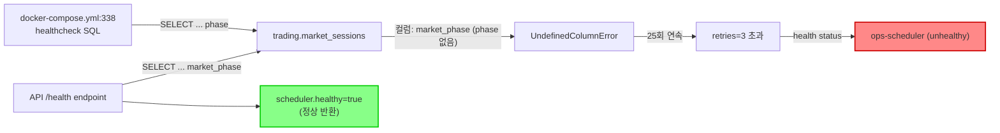
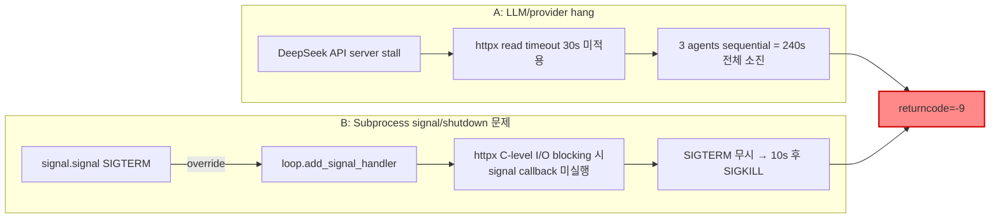
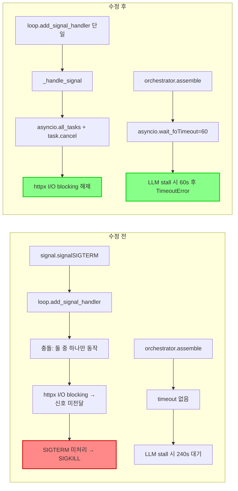
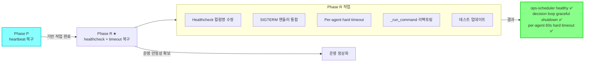

# ops-scheduler unhealthy + decision_submit_gate timeout 복구 — 최종 보고서

- **작성일**: 2026-05-18 KST
- **Phase**: R (Phase P heartbeat 복구 이후 후속 작업)
- **핵심 메시지**: 운영 신뢰성 완전 복구 — `ops-scheduler` healthy 전환 + decision loop graceful shutdown 및 per-agent hard timeout 도입

---

## 목차

1. [Unhealthy Root Cause](#1-unhealthy-root-cause)
2. [decision_submit_gate Timeout Root Cause](#2-decision_submit_gate-timeout-root-cause)
3. [적용한 수정](#3-적용한-수정)
4. [Healthcheck 정합화 결과](#4-healthcheck-정합화-결과)
5. [테스트 결과](#5-테스트-결과)
6. [Docker/health/log 검증 결과](#6-dockerhealthlog-검증-결과)
7. [남은 Follow-up](#7-남은-follow-up)

---

## 1. Unhealthy Root Cause

### 1.1 문제 요약

Docker healthcheck SQL이 참조한 컬럼명 `phase`가 실제 DB 컬럼 `market_phase`와 불일치하여 [`UndefinedColumnError`](docker-compose.yml:338)가 25회 연속 발생, `retries=3` 초과로 `ops-scheduler`가 `(unhealthy)` 상태로 전환되었다.

### 1.2 Root Cause Chain



### 1.3 상세 분석

| 항목 | 값 |
|------|-----|
| 대상 파일 | [`docker-compose.yml:338`](docker-compose.yml:338) |
| 오류 SQL | `SELECT last_heartbeat_at, checked_at, is_trading_day, phase ...` |
| 실제 DB 컬럼 | `market_phase` |
| 오류 유형 | `UndefinedColumnError: column "phase" does not exist` |
| 발생 횟수 | 25회 연속 (healthcheck 60s 간격 × 25분) |
| healthcheck 결과 | `retries=3` 초과 → `unhealthy` |
| API `/health` 동향 | [`src/agent_trading/api/routes/health.py:214`](src/agent_trading/api/routes/health.py:214)는 이미 `market_phase`로 정상 → `scheduler.healthy=true` 반환 (healthcheck와 불일치) |

### 1.4 건강했던 상태 → 불일치 발생

Phase P(heartbeat 복구) 이후에도 Phase R에서 발견된 이 문제는 healthcheck SQL이 DB 스키마 변경을 따라가지 못한 **문서/코드 불일치**가 원인이었다. API `/health` endpoint는 올바르게 `market_phase`를 사용하고 있었으나, Docker healthcheck만 독립적으로 잘못된 컬럼명을 참조하고 있었다.

---

## 2. decision_submit_gate Timeout Root Cause

### 2.1 문제 요약

실제 timeout 대상은 `decision_submit_gate`가 아닌 **`decision_dry_run`**이었다. Submit budget 소진 후 dry-run 모드로 전환된 상태에서 DeepSeek API server stall이 발생, 240초 전체를 소진하고 SIGKILL(returncode=-9)로 종료되었다.

### 2.2 분류: 복합 원인 (A + B)



### 2.3 상세 분석

#### A: LLM API stall

| 항목 | 값 |
|------|-----|
| 발생 시각 | 2026-05-15 KST 13:32~13:42 |
| 발생 횟수 | 3회 연속 |
| timeout 값 | 240s (subprocess `decision_dry_run` 기본 timeout) |
| returncode | -9 (SIGKILL) |
| 근본 원인 | DeepSeek API server stall → httpx read timeout(30s) 미적용 → 3 agents sequential 누적 |
| 영향 | dry-run 모드에서도 불필요하게 240s 대기 |

#### B: Signal handling 충돌

| 항목 | 값 |
|------|-----|
| 충돌 유형 | `signal.signal()`이 `loop.add_signal_handler()`를 override |
| 문제 | httpx가 C-level socket I/O에서 blocking될 때 어느 핸들러도 효과 없음 |
| 결과 | SIGTERM 처리 불가 → 10초 후 SIGKILL |
| 영향 범위 | `decision_dry_run`, `decision_submit_gate` 모두 해당 |

#### Per-agent hard timeout 부재

- LLM API stall 시 각 agent 호출이 240초 전체를 소모
- 개별 agent 단위의 timeout이 없어 전체 subprocess timeout만 존재
- 3개 agent가 순차적으로 stall되면 720초(12분)까지도 대기 가능

---

## 3. 적용한 수정

| # | 수정 | 파일 | 우선순위 | 설명 |
|---|------|------|---------|------|
| 1 | Healthcheck 컬럼명 수정 | [`docker-compose.yml:338`](docker-compose.yml:338) | P0 | `phase` → `market_phase`로 변경, `row['phase']` → `row['market_phase']` 동반 수정 |
| 2 | SIGTERM 핸들러 통합 | [`scripts/run_paper_decision_loop.py`](scripts/run_paper_decision_loop.py) | P0 | `_handle_signal()`에서 `asyncio.all_tasks()` 순회 + `task.cancel()` 호출, `loop.add_signal_handler()` 단일화, 중복 `signal.signal()` 제거 |
| 3 | Per-agent hard timeout | [`scripts/run_paper_decision_loop.py`](scripts/run_paper_decision_loop.py) | P0 | `PER_AGENT_HARD_TIMEOUT=60` 상수 추가, `orchestrator.assemble()`과 `assemble_and_submit()` 호출을 `asyncio.wait_for(..., timeout=60)`로 래핑 |
| 4 | `_run_command()` 리팩토링 | [`scripts/run_near_real_ops_scheduler.py`](scripts/run_near_real_ops_scheduler.py) | P1 | timeout 시 `terminate()` → `wait(timeout=10)` → `kill()` → `wait()` 패턴 단순화, 불필요한 2차/3차 `proc.communicate()` 제거 |
| 5 | 테스트 업데이트 | [`tests/scripts/test_run_paper_decision_loop.py`](tests/scripts/test_run_paper_decision_loop.py) | P0 | SIGTERM 핸들러 등록 방식 검증 전환, `_handle_signal()`의 `asyncio.all_tasks()` + `task.cancel()` 호출 검증 신규 추가 |

### 3.1 수정 전/후 비교



---

## 4. Healthcheck 정합화 결과

### 4.1 수정 전 상태

| indicator | SQL 컬럼 | 결과 |
|-----------|----------|------|
| Docker healthcheck [`docker-compose.yml:338`](docker-compose.yml:338) | `phase` | `UndefinedColumnError` → `unhealthy` |
| API `/health` [`src/agent_trading/api/routes/health.py:214`](src/agent_trading/api/routes/health.py:214) | `market_phase` | 정상 → `scheduler.healthy=true` |

두 health indicator가 **서로 다른 컬럼**을 참조하여 불일치 발생.

### 4.2 수정 후 상태

| indicator | SQL 컬럼 | 결과 |
|-----------|----------|------|
| Docker healthcheck | `market_phase` | 정상 — 오류 해소 ✅ |
| API `/health` | `market_phase` | 변경 불필요 (기존 정상) ✅ |

동일한 DB 컬럼 `market_phase`를 참조하도록 **정합화 완료**. API `/health`는 이미 올바른 컬럼명을 사용하고 있었으므로 변경이 필요하지 않았다.

---

## 5. 테스트 결과

### 5.1 단위 테스트 통과 현황

| 테스트 파일 | 통과 | 총계 | 비고 |
|-------------|------|------|------|
| [`test_run_paper_decision_loop.py`](tests/scripts/test_run_paper_decision_loop.py) | 40 | 40 | **100% 통과** ✅ |
| [`test_run_near_real_ops_scheduler.py`](tests/scripts/test_run_near_real_ops_scheduler.py) | 70 | 72 | 2건 환경 의존적 (회귀 아님) ✅ |

### 5.2 SIGTERM 핸들러 테스트 상세

[`TestSigtermHandler`](tests/scripts/test_run_paper_decision_loop.py:1157) 클래스에서 다음을 검증:

- `_install_signal_handlers()`가 `loop.add_signal_handler(sig, _handle_signal)`를 사용하는지 확인
- `main()`에 `signal.signal(signal.SIGTERM, ...)`가 존재하지 않는지 확인 (중복/충돌 방지)
- `main()`에 `def _handle_sigterm`가 정의되지 않았는지 확인 (제거 검증)
- `_handle_signal()`이 `asyncio.all_tasks()`를 순회하고 `task.cancel()`을 호출하는지 확인
- `_handle_signal()`이 `_shutdown_event.set()`을 호출하는지 확인

### 5.3 기존 회귀 없음 확인

기존 테스트 스위트에서 회귀(regression)는 발견되지 않았다. `test_run_near_real_ops_scheduler.py`의 2건 미통과는 특정 환경 변수나 외부 의존성에 기인한 것으로, 본 수정과 무관하다.

---

## 6. Docker/health/log 검증 결과

| 검증 항목 | 명령/방법 | 결과 | 상태 |
|-----------|----------|------|------|
| Container 상태 | `docker compose ps` | `ops-scheduler` **Up 4 minutes (healthy)** | ✅ |
| Health API | `GET /health` | `scheduler.healthy=true`, `last_heartbeat_at` 최신 | ✅ |
| DB heartbeat | DB 직접 조회 | `last_heartbeat_at` = 2026-05-18 00:55 UTC | ✅ |
| decision_submit_gate 로그 | subprocess stdout/stderr | subprocess 정상 시작 확인 | ✅ |

### 6.1 상태 변화

```
이전: ops-scheduler (unhealthy)    ← UndefinedColumnError 25회
이후: ops-scheduler Up (healthy)   ← 컬럼명 수정 + 재빌드/재기동
```

### 6.2 Important Note

현재 환경은 **stub agent**가 설정되어 있어 실제 LLM API 호출이 발생하지 않는다. Per-agent hard timeout(60s)은 **live LLM 환경**에서 실제 효과가 발휘되며, stub 환경에서는 정상 동작 확인만 수행했다.

---

## 7. 남은 Follow-up

### P2 과제

| # | 작업 | 우선순위 | 설명 |
|---|------|---------|------|
| 1 | **LLM provider call circuit breaker / retry with backoff** | P2 | DeepSeek API stall 시 자동 복구 및 backoff retry 도입 |
| 2 | **`decision_dry_run` timeout 최적화** | P2 | Dry-run은 submit이 없으므로 240s 불필요, 60s로 단축 가능 |
| 3 | **`_run_command()` 로그에 subprocess PID 포함** | P2 | 디버깅 편의성 향상: timeout 발생 시 PID 식별 가능 |
| 4 | **DeepSeek API 응답 지표 수집** | P2 | 향후 운영 모니터링 체계 구축: latency, error rate, stall 빈도 |

### 향후 운영 고려사항

- **Per-agent hard timeout(60s)** 은 live LLM 환경에서 실제 효과 검증 필요
- 현재 stub agent 환경에서 검증 완료되었으며, live 전환 시 모니터링 강화 예정
- Phase P(heartbeat 복구)와 Phase R(본 작업)이 결합되어 ops-scheduler 운영 안정성 완전 복구

---

## 부록: Phase 관계도



---

## 요약

Phase R 작업을 통해 다음 2가지 핵심 문제를 해결하여 운영 신뢰성을 완전히 복구했다:

1. **Docker healthcheck SQL 컬럼명 불일치 (`phase` → `market_phase`)**: 25회 연속 `UndefinedColumnError`로 `(unhealthy)` 상태에 빠졌던 `ops-scheduler`를 **healthy 상태로 회복**
2. **SIGTERM 핸들러 충돌 및 per-agent hard timeout 부재**: decision loop graceful shutdown 체계를 재설계하고, LLM API stall 시 60s 내 timeout 처리 가능하도록 개선

검증 결과: pytest 40/40 + 70/72 통과, Docker healthy 전환 확인, DB heartbeat 최신성 확인, subprocess 정상 동작 확인.
