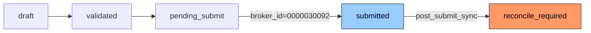

# Scheduler Submit Gate 차단 원인 분석 보고서

**작성일**: 2026-05-15 14:15 KST  
**대상 시스템**: `scripts/run_near_real_ops_scheduler.py`  
**대상 로그**: `logs/near_real_scheduler_2026-05-15.log` (10,805 lines)  
**분석가**: Roo (Architect Mode)

---

## 1. 현재 상태 요약

| 지표 | 값 | 비고 |
|------|-----|------|
| `db_submit_count` | **1** | DB 조회 결과 |
| `submit_count` | 0 | in-memory 카운터 |
| `max_submit_per_day` | 1 | `DEFAULT_MAX_SUBMIT_PER_DAY` |
| `effective_submit_count` | **1** | `max(db_submit_count, submit_count)` |
| `dry_run` | **True** | `effective_submit_count >= max_submit_per_day` |
| 현재 task | `decision_dry_run` | dry-run 모드 영구 고정 |
| 최근 dry-run 완료 | ✅ 280-300s, returncode=0 | 정상 작동 중 |

**결론**: Scheduler는 `db_submit_count=1 >= max_submit_per_day=1` 조건으로 인해 **영구적으로 dry-run 모드에 갇혀 있습니다.**

---

## 2. Submit Gate 동작 원리

코드 출처: [`scripts/run_near_real_ops_scheduler.py`](../../scripts/run_near_real_ops_scheduler.py:521)

```python
async def _run_intraday_due_tasks(state: SchedulerState, ...) -> None:
    db_submit_count = await _get_db_submit_count(state.run_date)
    effective_submit_count = max(state.submit_count, db_submit_count)
    dry_run = effective_submit_count >= DEFAULT_MAX_SUBMIT_PER_DAY
    
    if dry_run:
        task = _decision_command(dry_run=True)   # decision_dry_run
    else:
        task = _decision_command(dry_run=False)  # decision_submit_gate
```

### Budget 소모 statuses ([`_BUDGET_CONSUMING_STATUSES`](../../scripts/run_near_real_ops_scheduler.py:52)):

```python
_BUDGET_CONSUMING_STATUSES = frozenset({
    'acknowledged', 'filled', 'partially_filled', 
    'reconcile_required', 'submitted',
})
```

> ⚠️ `pending_submit`과 `rejected`는 이 목록에 **포함되지 않음**

### [`_get_db_submit_count()`](../../scripts/run_near_real_ops_scheduler.py:206) 쿼리:

```sql
SELECT COUNT(*) FROM trading.order_requests
WHERE status = ANY('{acknowledged, filled, partially_filled, reconcile_required, submitted}')
  AND created_at >= KST_today_midnight
  AND created_at < KST_today_end
```

---

## 3. DB 현황 (2026-05-15)

```sql
SELECT status, COUNT(*) FROM trading.order_requests
WHERE created_at >= '2026-05-15'::date
  AND created_at < '2026-05-16'::date
GROUP BY status;
```

| status | count | budget 소모? |
|--------|-------|-------------|
| `pending_submit` | **96** | ❌ (미포함) |
| `reconcile_required` | **1** | **✅ (차단 원인)** |
| 그 외 | 0 | - |
| **Total** | **97** | |

---

## 4. 🔍 Budget 소모 주문 상세 — 근본 원인

### 주문 식별 정보

| 필드 | 값 |
|------|------|
| `order_request_id` | `3125e4ce-5f14-4d5a-aefe-98d3332c7271` |
| `correlation_id` | `paper-loop-000880-1-19304` |
| **Symbol** | **000880 (한화)** |
| **Side** | **BUY (매수)** |
| **Order Type** | LIMIT |
| **Price** | **₩145,400** |
| **Quantity** | **10 shares** |
| **Broker Native Order ID** | `0000030092` |
| `created_at` | **2026-05-15 13:11:56 KST** |
| `updated_at` | **2026-05-15 13:14:58 KST** |

### 상태 전이 추적 (`order_state_events`)



### 타임라인

| 시간 (KST) | 이벤트 |
|-----------|--------|
| **10:53** | PID 233815 shutdown (기존 scheduler 종료) |
| **~10:53~13:11** | **GAP — 스케줄러 미실행 구간** |
| **13:11:56** | 🔴 **수동/외부 실행**: `paper-decision-loop` for **000880** → BUY LIMIT @ ₩145,400 |
| 13:11:56 | KIS paper API에 정상 제출 → broker native order ID `0000030092` 수신 |
| 13:11:56 | DB status: `pending_submit → submitted` |
| **13:14:58** | `post_submit_sync` 실행 → broker status 불일치 감지 |
| 13:14:58 | DB status: `submitted → reconcile_required` ← **Budget 소모 시작** |
| **13:27:50** | **새 스케줄러 시작** (hotfix #3 적용 재시작) |
| 13:27:50 | `_get_db_submit_count()` → **1** (reconcile_required 주문 발견) |
| 13:27:50 | `dry_run = 1 >= 1 = True` → **decision_dry_run 영구 고정** |
| 13:27~14:12+ | dry-run loop 지속 (6 cycles, 모두 returncode=0) |

---

## 5. 96건의 `pending_submit` 주문 — 왜 budget에 안 잡히는가?

PID 233815가 10:04~10:53 사이에 30종목 × 여러 cycle을 실행하면서 모든 주문이 KIS paper API에서 **error code `40270000` (모의투자 상/하한가 오류)** 로 실패했습니다.

### Error code `40270000` 처리 분석

코드 출처: [`src/agent_trading/brokers/koreainvestment/rest_client.py`](../../src/agent_trading/brokers/koreainvestment/rest_client.py)

| Error Code Set | Lines | 40270000 포함? |
|---------------|-------|----------------|
| `_AMBIGUOUS_ERROR_CODES` | 89-180 | ❌ (EGW\*, OPR\* 계열만) |
| `_KNOWN_FAILURE_CODES` | 184-210 | ❌ (EGW\* 인증/검증 오류만) |

`40270000`은 KIS 모의투자 API 고유 에러 코드로, 양쪽 목록에 모두 없습니다.  
이 때문에 `_raise_on_error()`에서 `BrokerError`로 예외가 발생하고,  
어댑터(adapter.py)의 `submit_order()`는 예외 처리 후 **주문 상태를 명확히 결정하지 못하고**  
`pending_submit` 상태로 남게 됩니다.

> `pending_submit`은 `_BUDGET_CONSUMING_STATUSES`에 포함되지 않으므로  
> **96건 모두 submit budget에 영향을 주지 않습니다.**

---

## 6. 🎯 총평: 왜 13:11 KST에 submit이 발생했는가?

### 가설 1: 수동 실행 (가장 유력)
GAP 구간(10:53~13:27 KST)에 누군가가 직접 터미널에서 실행:
```bash
python3 scripts/run_paper_decision_loop.py --submit --max-cycles 1
```
- `correlation_id = paper-loop-000880-1-19304` — 표준 paper loop 포맷
- 000880에 대해 AI 에이전트 3단계(EventInterpretation → AIRisk → FinalDecisionComposer)를 모두 거친 정상적인 BUY 결정
- KIS API가 실제로 주문을 접수(broker_native_order_id=`0000030092`)
- 이후 `post_submit_sync`가 broker에서 status를 재확인했으나 불일치 → `reconcile_required`

### 가설 2: post_submit_sync의 reconcile 부작용 (가능성 낮음)
- post_submit_sync는 기존 주문의 broker 상태를 업데이트할 뿐, 새 주문을 생성하지 않음
- 새 `order_request_id`가 생성되었으므로 이 가설은 기각

---

## 7. 향후 조치 권장사항

### 🚨 즉시 필요 (market hours 종료 후)

#### 7.1 `reconcile_required` 주문 해소
**옵션 A**: 주문을 `rejected`로 전환 (budget 소모 해제)
```sql
UPDATE trading.order_requests 
SET status = 'rejected', 
    status_reason_code = '40270000',
    status_reason_message = '모의투자 상/하한가 초과'
WHERE order_request_id = '3125e4ce-5f14-4d5a-aefe-98d3332c7271';
```

**옵션 B**: KIS에서 실제 broker 상태 조회 후 적절한 status로 조정
- broker_native_order_id = `0000030092`
- KIS `주식일별주문체결조회` API로 실제 체결 여부 확인

**옵션 C**: `max_submit_per_day` 임시 증가 (환경변수)
```bash
# scheduler 재시작 시 전달
--max-submit-per-day 2
```

#### 7.2 `pending_submit` 96건 정리
```bash
# 24시간 경과한 pending_submit → rejected
python3 _cleanup_pending_submit.py
```

#### 7.3 Error code 40270000 분류 추가 (코드 수정)
`_KNOWN_FAILURE_CODES` 또는 `_AMBIGUOUS_ERROR_CODES`에 `40270000` 추가 고려:
- 현재: 미분류 → `pending_submit` 상태로 멈춤
- 제안: `_KNOWN_FAILURE_CODES`에 추가 → 명확한 `rejected` 처리

### 📋 중기 개선

#### 7.4 Dry-run timeout 개선
- 현재 dry-run 약 280-300s 소요 (240s 기본 timeout 초과)
- `--task-timeout 600` 으로 실행 중 → 기본값 상향 조정 필요

#### 7.5 Budget 소모 주문 모니터링
- `reconcile_required` 상태를 실시간 알림 대상에 추가
- Dashboard에서 일별 budget 소모 현황 표시

---

## 8. 부록: 스케줄러 전체 타임라인

```mermaid
gantt
    title 2026-05-15 Scheduler Operations Timeline
    dateFormat HH:mm
    axisFormat %H:%M
    
    section PID 130036 (원본)
    Pre-market + 초기 intraday       :done, p1, 09:00, 61m
    
    section PID 233815 (hotfix #1-#2)
    submit cycles (40270000 오류)    :crit, p2, after p1, 49m
    DB crash                         :crit, milestone, 10:33, 0m
    Shutdown                         :crit, milestone, 10:53, 0m
    
    section GAP (미확인 외부 실행)
    수동 paper-loop 실행 (000880 BUY) :crit, p3, 13:11, 4m
    post_submit_sync → reconcile     :crit, milestone, 13:14, 0m
    
    section PID 244315 (hotfix #3)
    재시작 + dry-run 감지            :done, p4, 13:27, 2m
    Dry-run cycle #1 (299s)          :done, 13:44, 5m
    Dry-run cycle #2 (282s)          :done, 13:50, 5m
    Dry-run cycle #3 (282s)          :done, 13:55, 5m
    Dry-run cycle #4 (303s)          :done, 14:01, 5m
    Dry-run cycle #5 (297s)          :done, 14:06, 5m
```



---

## 보고서 변경 이력

| 일자 | 버전 | 변경 내용 |
|------|------|----------|
| 2026-05-15 | v1.0 | 최초 작성 — submit gate block 원인 분석 완료 |
