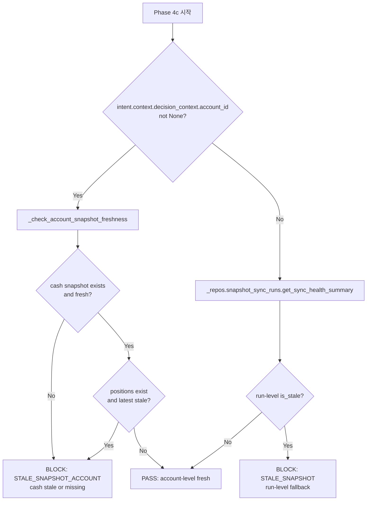

# Account-Level Snapshot Freshness 정밀화

## 1. 개요

**목적**: Submit guard (Phase 4c)의 snapshot freshness 판단 기준을 run-level global summary에서 **계좌별 cash/position snapshot 기준**으로 정밀화.

**현황**: 현재 Phase 4c는 [`SnapshotSyncRunRepository.get_sync_health_summary()`](src/agent_trading/repositories/contracts.py:38)의 run-level `is_stale`을 사용. 특정 계좌의 개별 snapshot 신선도는 확인하지 않음.

**제약**:
- Admin UI 변경 금지
- Broker submit semantics 변경 금지
- Hard guardrail / reconciliation 경계 변경 금지
- 기존 run-level freshness health/API 경로는 유지
- Schema 변경 최소화

---

## 2. Step 1: Account-Level Freshness Source Inventory

| Source | Table/Entity | Timestamp 필드 | 계좌별 조회 메서드 | Empty 계좌 처리 |
|--------|-------------|---------------|-------------------|----------------|
| Cash balance snapshot | [`CashBalanceSnapshotEntity`](src/agent_trading/domain/entities.py:132) | `snapshot_at: datetime` | [`get_latest_by_account(account_id)`](src/agent_trading/repositories/contracts.py:222) → `CashBalanceSnapshotEntity \| None` | `None` 반환 — sync 미실행 |
| Position snapshots | [`PositionSnapshotEntity`](src/agent_trading/domain/entities.py:118) | `snapshot_at: datetime` | [`list_latest_by_account(account_id)`](src/agent_trading/repositories/contracts.py:211) → `Sequence[PositionSnapshotEntity]` | 빈 list 반환 — zero positions 또는 sync 미실행 |

**판단**: Cash snapshot repository의 `get_latest_by_account()`와 Position snapshot repository의 `list_latest_by_account()` 모두 이미 구현되어 있음 (InMemory [282](src/agent_trading/repositories/memory.py:282), [264](src/agent_trading/repositories/memory.py:264) / Postgres [53](src/agent_trading/repositories/postgres/cash_balance_snapshots.py:53), [55](src/agent_trading/repositories/postgres/position_snapshots.py:55)). **신규 repository 메서드 불필요**.

---

## 3. Step 2: Freshness Summary 설계

### 3.1 새 dataclass: [`AccountSnapshotFreshness`](src/agent_trading/services/decision_orchestrator.py)

`DecisionOrchestratorService` 내부에 dataclass 추가 (별도 파일 없이):

```python
@dataclass(slots=True, frozen=True)
class AccountSnapshotFreshness:
    account_id: UUID
    latest_cash_snapshot_at: datetime | None
    latest_position_snapshot_at: datetime | None
    is_cash_stale: bool
    is_position_stale: bool
    is_stale: bool
```

### 3.2 Threshold 재사용

기존 `self._stale_threshold_seconds` (`AppSettings.kis_snapshot_stale_threshold_seconds`, 기본 900s) 그대로 사용. 별도 설정 불필요.

### 3.3 계산 로직 — 새 private method

```python
async def _check_account_snapshot_freshness(
    self, account_id: UUID
) -> AccountSnapshotFreshness:
    now = datetime.now(timezone.utc)

    # 1. Cash snapshot
    cash_snapshot = await self._repos.cash_balance_snapshots.get_latest_by_account(
        account_id
    )
    if cash_snapshot is None:
        return AccountSnapshotFreshness(
            account_id=account_id,
            latest_cash_snapshot_at=None,
            latest_position_snapshot_at=None,
            is_cash_stale=True,
            is_position_stale=True,
            is_stale=True,
        )

    is_cash_stale = (
        now - cash_snapshot.snapshot_at
    ).total_seconds() > self._stale_threshold_seconds

    # 2. Position snapshots
    position_snapshots = await self._repos.position_snapshots.list_latest_by_account(
        account_id
    )
    latest_position_snapshot_at: datetime | None = None
    is_position_stale = False

    if position_snapshots:
        latest_position_snapshot_at = max(s.snapshot_at for s in position_snapshots)
        is_position_stale = (
            now - latest_position_snapshot_at
        ).total_seconds() > self._stale_threshold_seconds

    return AccountSnapshotFreshness(
        account_id=account_id,
        latest_cash_snapshot_at=cash_snapshot.snapshot_at,
        latest_position_snapshot_at=latest_position_snapshot_at,
        is_cash_stale=is_cash_stale,
        is_position_stale=is_position_stale,
        is_stale=is_cash_stale or is_position_stale,
    )
```

**`is_position_stale` 조건**: `(now - latest_position_snapshot_at).total_seconds() > self._stale_threshold_seconds`
- `latest_position_snapshot_at`은 `list_latest_by_account()` 결과 중 max `snapshot_at` 사용
- Position snapshots가 empty list면 `is_position_stale = False` (cash snapshot proxy로 판정)


## 4. Step 3: Submit Guard 보강 (Phase 4c 변경)

### 4.1 현재 Phase 4c (line 827-880)

```python
# ── Phase 4c: stale snapshot guard ──
health = await self._repos.snapshot_sync_runs.get_sync_health_summary(
    stale_threshold_seconds=self._stale_threshold_seconds,
)
if health.is_stale:
    # BLOCK (run-level)
```

### 4.2 변경 후 Phase 4c

```python
# ── Phase 4c: stale snapshot guard (account-level preferred) ──
account_id: UUID | None = (
    intent.context.decision_context.account_id
    if intent.context is not None
    and intent.context.decision_context is not None
    else None
)
if account_id is not None:
    freshness = await self._check_account_snapshot_freshness(account_id)
    if freshness.is_stale:
        # BLOCK (account-level detail)
else:
    # Fallback: run-level summary
    health = await self._repos.snapshot_sync_runs.get_sync_health_summary(
        stale_threshold_seconds=self._stale_threshold_seconds,
    )
    if health.is_stale:
        # BLOCK (run-level detail)
```

### 4.3 BLOCK 시 rule_results 차이

**Account-level block** (신규):
```python
rule_results={
    "is_stale": True,
    "stale_level": "account",
    "account_id": str(account_id),
    "latest_cash_snapshot_at": str(freshness.latest_cash_snapshot_at),
    "latest_position_snapshot_at": str(freshness.latest_position_snapshot_at),
    "is_cash_stale": freshness.is_cash_stale,
    "is_position_stale": freshness.is_position_stale,
    "stale_threshold_seconds": self._stale_threshold_seconds,
},
blocking_rule_codes=["STALE_SNAPSHOT_ACCOUNT"],
```

**Run-level fallback block** (기존 유지):
```python
rule_results={
    "is_stale": True,
    "stale_level": "run",
    "last_successful_run_at": ...,
    "stale_threshold_seconds": ...,
    "last_run_status": ...,
},
blocking_rule_codes=["STALE_SNAPSHOT"],
```

성능 영향 없음 — Phase 4c에서 1-2회의 in-memory/DB lookup만 추가.

---

## 5. Step 4: Edge Case 정리

### 5.1 정책 표

| Cash Snapshot | Position Snapshots | is_stale | 차단? | 근거 |
|--------------|-------------------|----------|-------|------|
| ✅ Fresh | ✅ Fresh (max within threshold) | `False` | ❌ 통과 | 둘 다 최신 |
| ✅ Fresh | ❌ Stale (max > threshold) | `True` | ✅ 차단 | 포지션 데이터 노후 |
| ❌ Stale | ✅ Fresh | `True` | ✅ 차단 | 현금 데이터 노후 |
| ❌ None | N/A | `True` | ✅ 차단 | 계좌에 sync 실행된 적 없음 |
| ✅ Fresh | ⚠️ Empty list | `False` | ❌ 통과 | Zero positions — 포지션 없음은 fresh로 간주 |

### 5.2 "Empty positions" vs "Never synced positions" 구분

**문제**: `list_latest_by_account(account_id)`가 빈 list를 반환하면 두 가지 가능성이 있음:
1. 계좌에 포지션이 0개 (정상)
2. Position sync가 실행된 적 없음

**해결책**: Cash snapshot을 proxy로 사용. Cash snapshot이 존재하고 fresh하면 position sync도 실행되었음이 보장됨 (`sync_kis_account_snapshots()`가 cash와 position을 함께 동기화). 따라서:
- Cash snapshot fresh + position snapshots empty = "zero positions, recently synced" → **PASS**
- Cash snapshot None → "never synced" → **BLOCK**

**신규 스키마/메서드 불필요**.

---

## 6. Step 5: 테스트

### 6.1 기존 테스트 변경

[`test_scenario_4_stale_snapshot_guard`](tests/services/test_paper_trading_scenarios.py:472) — 현재 run-level 기반. 변경 사항:
- `repos.snapshot_sync_runs._items.clear()` 유지 (run-level fallback도 함께 stale)
- 검증 로직은 그대로 유지 (run-level stale → 차단)

[`test_scenario_4b_fresh_snapshot_submitted`](tests/services/test_paper_trading_scenarios.py:552) — 변경:
- Run-level fresh seed + account-level cash/position snapshot fresh seed 추가

### 6.2 신규 테스트 (6개)

| # | 테스트명 | Given | Then | broker.submit_order 검증 |
|---|---------|-------|------|--------------------------|
| 1 | `test_account_level_fresh_cash_and_positions` | Cash + positions both fresh for account | ✅ SUBMITTED | `assert_called_once()` — 정상 제출 경로 |
| 2 | `test_account_level_stale_cash` | Cash snapshot stale (positions fresh) | ✅ SKIPPED (STALE_SNAPSHOT_ACCOUNT) | `assert_not_called()` — 차단되어 submit 미호출 |
| 3 | `test_account_level_stale_positions` | Positions stale (cash fresh) | ✅ SKIPPED (STALE_SNAPSHOT_ACCOUNT) | `assert_not_called()` — 차단되어 submit 미호출 |
| 4 | `test_account_level_no_cash_snapshot` | No cash snapshot (positions empty) | ✅ SKIPPED (STALE_SNAPSHOT_ACCOUNT) | `assert_not_called()` — 차단되어 submit 미호출 |
| 5 | `test_account_level_run_fresh_account_stale` | Run-level fresh but account-specific cash stale | ✅ SKIPPED (account-level wins, STALE_SNAPSHOT_ACCOUNT) | `assert_not_called()` — account-level 차단이 run-level보다 우선 |
| 6 | `test_account_level_fresh_cash_empty_positions` | Cash fresh, no positions (empty list) | ✅ SUBMITTED (zero-position account policy) | `assert_called_once()` — 정상 제출 경로 |

### 6.3 기존 회귀 테스트 (그대로 유지)

- 기존 36개 pipeline 테스트
- 기존 Scenario 4 (run-level stale) — fallback 경로 유지 검증

---

## 7. 변경 파일 목록

| 파일 | 변경 유형 | 설명 |
|------|----------|------|
| [`decision_orchestrator.py`](src/agent_trading/services/decision_orchestrator.py:297) | 수정 | `AccountSnapshotFreshness` dataclass 추가, `_check_account_snapshot_freshness()` 메서드 추가, Phase 4c account-level 우선 guard로 변경 |
| [`test_paper_trading_scenarios.py`](tests/services/test_paper_trading_scenarios.py:472) | 수정 | Scenario 4에 account-level seed 추가, Scenario 4b에 account-level seed 추가, 신규 6개 테스트 추가 |
| [`stale_snapshot_submit_guard.md`](plans/stale_snapshot_submit_guard.md) | 수정 | `Future Work` 섹션 업데이트 또는 새 문서로 대체 |
| [`[BACKLOG] backlog.md`](plans/[BACKLOG]%20backlog.md) | 수정 | 항목 상태 업데이트 |

---

## 8. 완료 보고 형식

1. **Account-level freshness 판단 기준**: Cash snapshot + Position snapshot의 `snapshot_at` 기준, threshold는 기존 `stale_threshold_seconds` 재사용
2. **Cash 확인 방식**: `cash_balance_snapshots.get_latest_by_account(account_id)` → `snapshot_at` 비교
3. **Position 확인 방식**: `position_snapshots.list_latest_by_account(account_id)` → max `snapshot_at` 비교, empty list는 PASS
4. **No snapshot 정책**: Cash None → BLOCK; Position empty + Cash fresh → PASS
5. **변경 파일**: `decision_orchestrator.py`, `test_paper_trading_scenarios.py`, 설계 문서
6. **Submit guard 정밀화**: run-level global → account-level cash+position dual check로 개선. `STALE_SNAPSHOT_ACCOUNT` blocking rule code 도입
7. **후속 작업 (1개)**: "Empty positions synchronized" 신호를 위한 최소 스키마 확장 — position_sync_run마다 zero-position account 목록 저장

---

## 9. Mermaid: Phase 4c 의사결정 흐름


