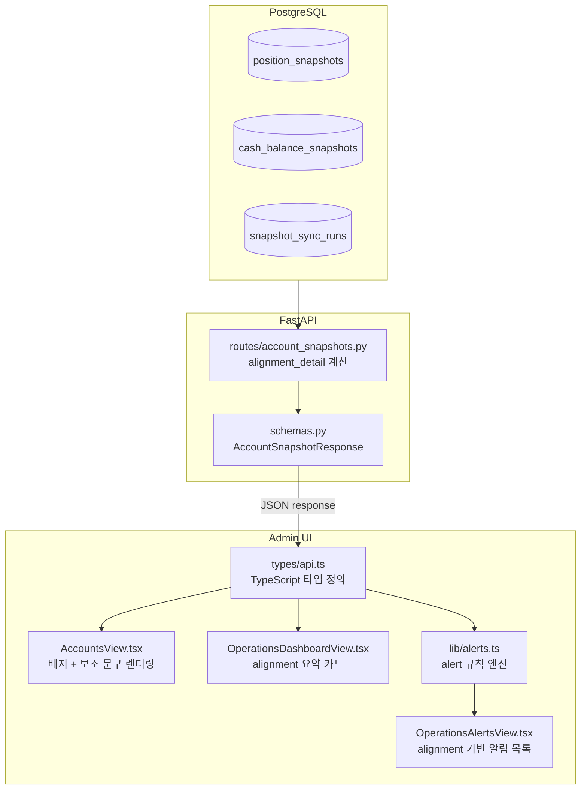
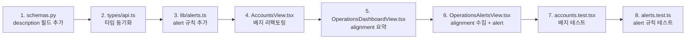

# Account Snapshot Alignment UX 개선 설계

## 1. 질문에 대한 답변

### Q1. 각 상태를 지금보다 더 쉬운 한국어로 어떻게 설명할 것인가?

| 상태 | 현재 배지 텍스트 | 개선된 배지 텍스트 | 보조 설명 문구 |
|------|----------------|-------------------|---------------|
| `same_run` | 동일 sync-run 기준 | 동기화 완료 | position과 cash 모두 동일한 sync-run에서 캡처되어 가장 신뢰할 수 있는 상태 |
| `after_hours_cash_updated` | after-hours cash 업데이트 반영 | 장후 현금 업데이트 | position은 정규장 마지막 sync-run 기준, cash는 장후 업데이트 반영 — 정상 범주 |
| `cash_only` | 현금만 조회됨 | 현금만 조회 | position 데이터 없음 — 잔고 증감 확인은 가능하나 포트폴리오 구성 불가 |
| `partial_position_only` | 포지션만 조회됨 | 포지션만 조회 | 현금 데이터 없음 — 예수금 확인 불가, 주문 가능 금액 산정 불가 |
| `timestamp_proximity` | 시간 기준 근사 | 시간 근사 정합 (⚠) | FK(sync_run_id) 없이 timestamp로만 정합된 legacy 데이터 — 데이터 신뢰도 낮음 |
| `unknown` | snapshot 정보 없음 | 정보 없음 | 스냅샷 데이터가 없거나 분류 불가 |

**개선 원칙:**
- `same_run` → "동기화 완료": operator가 가장 자주 보는 상태로, "정상"이라는 의미를 직관적으로 전달
- `after_hours_cash_updated` → "장후 현금 업데이트": 정상 운영의 일부임을 명시 (파란색 배지로 '정보' 카테고리화)
- `cash_only` / `partial_position_only` → 각각 데이터 유무를 명확히 표기
- `timestamp_proximity` → "⚠" 아이콘으로 경고성 강조, 보조 문구에 "데이터 신뢰도 낮음" 포함

### Q2. 배지 외에 보조 문구/tooltip/banner가 필요한가?

**필요한 경우:**
1. **AccountsView 상세 패널**: 배지 옆에 보조 설명 문구를 **항상 표시** (tooltip과 별도). 배지와 보조 문구를 flex row로 배치.
   - 예: `[동기화 완료] position과 cash 모두 동일한 sync-run`
   - 예: `[⚠ 시간 근사 정합] FK 없음 — 데이터 신뢰도 낮음`

2. **OperationsDashboardView**: "마지막 스냅샷 동기화" StatusCard 하단에 alignment 상태별 계좌 수 집계를 추가. 특이 상태 계좌는 별도 리스트로 표시.

3. **WarningBanner**: `timestamp_proximity` 상태 계좌가 존재할 경우 Dashboard 상단에 WarningBanner 표시 고려.
   - 조건: 계좌 전체 또는 일부가 `timestamp_proximity` 또는 `cash_only` 상태
   - 텍스트: "N개 계좌의 스냅샷 데이터 신뢰도가 낮습니다. 자세한 내용은 Accounts 화면에서 확인하세요."

4. **tooltip은 유지**: 마우스 오버 시 더 상세한 설명 제공 (예: sync_run_id 포함)

**불필요한 경우:**
- `same_run` / `after_hours_cash_updated`는 정상 상태이므로 별도 banner 불필요

### Q3. after-hours cash-only와 실제 partial failure를 어떻게 구분해서 보여줄 것인가?

| 상태 | 의도된 동작? | operator 조치 필요? | 배지 색상 |
|------|------------|-------------------|----------|
| `after_hours_cash_updated` | ✅ 네 (정상 장후 업데이트) | ❌ 아니오 | 🔵 파랑 (정보) |
| `cash_only` | ❌ 아니오 (position 누락) | ⚠️ 확인 필요 | 🟡 노랑 (주의) |
| `partial_position_only` | ❌ 아니오 (cash 누락) | ⚠️ 확인 필요 | 🟠 주황 (주의) |

**구분 전략:**
1. **색상 차별화**: `after_hours_cash_updated`는 파란색 계열(정보), `cash_only`는 노란색(주의), `partial_position_only`는 주황색(다른 주의)으로 3계층 구분
2. **아이콘 차별화**: `after_hours_cash_updated` = `↻` (순환/업데이트), `cash_only` = `₩` (현금), `partial_position_only` = `⊞` (포지션)
3. **보조 문구**: 각 상태의 원인을 명시 (`after_hours_cash_updated` = "정상 장후 업데이트", `cash_only` = "position 데이터 없음")
4. **Dashboard 집계**: 이상 상태(`cash_only`, `partial_position_only`)는 Dashboard의 alignment 요약에서 별도 카테고리로 집계

### Q4. operator가 가장 헷갈리는 상태는 무엇인가?

**1순위: `after_hours_cash_updated` vs `same_run`** (위험도: 중간)
- 현재 둘 다 녹색 배지로 완전히 동일하게 보임
- `after_hours_cash_updated`는 position과 cash의 기준 시점이 다름에도 "정상"으로 오인
- 해결: 파란색 배지로 변경 + 보조 문구에 "position: 정규장, cash: 장후" 표시

**2순위: `cash_only` vs `partial_position_only`** (위험도: 높음)
- 현재 둘 다 노란색 배지로 시각적 구분 불가
- 실제 장애 상황(`partial_position_only`는 현금 데이터 없음 → 주문 가능 금액 확인 불가)과 데이터 부족(`cash_only`는 position 없음)의 구분이 안 됨
- 해결: 각각 노란색/주황색으로 분리 + 보조 문구로 영향도 명시

**3순위: `timestamp_proximity`의 위험성 과소평가** (위험도: 높음)
- 현재 노란색("주의")으로 표시되지만, 실제로는 FK 기반 정합이 불가능한 legacy 데이터
- 데이터 신뢰도가 낮아 잘못된 의사결정으로 이어질 수 있음
- 해결: 빨간색(위험)으로 변경 + 보조 문구에 "데이터 신뢰도 낮음" 명시

---

## 2. 전체 시스템 아키텍처



---

## 3. 변경 상세 설계

### 3.1 AccountsView.tsx — 배지 개선

**현재 (lines 576-651):**
- 5개 상태가 3가지 색상(green/amber/gray)으로만 구분
- `after_hours_cash_updated`가 `same_run`과 동일한 녹색
- `cash_only`, `partial_position_only`, `timestamp_proximity`가 모두 동일한 노란색
- tooltip(title)에만 의존

**변경 후:**
- 6개 상태를 6가지 색상 + 아이콘 + 보조 문구로 완전 구분
- 각 상태별 고유 색상 팔레트

**리팩토링 전략:**
현재 if/else if 체인을 컴포넌트/함수로 분리하여 가독성과 유지보수성 향상.

```typescript
// 제안: alignmentDetail에 따른 배지 구성을 반환하는 함수
function getAlignmentBadgeConfig(detail: AlignmentDetail): {
  bg: string;
  text: string;
  icon: string;
  label: string;
  description: string;
} {
  switch (detail) {
    case "same_run":
      return {
        bg: "bg-[#ecfdf5] text-[#16a34a]",
        icon: "✓",
        label: "동기화 완료",
        description: "position + cash 동일 시점",
      };
    case "after_hours_cash_updated":
      return {
        bg: "bg-[#eff6ff] text-[#2563eb]",
        icon: "↻",
        label: "장후 현금 업데이트",
        description: "position: 정규장, cash: after-hours",
      };
    case "cash_only":
      return {
        bg: "bg-[#fef9c3] text-[#b45309]",
        icon: "₩",
        label: "현금만 조회",
        description: "position 데이터 없음",
      };
    case "partial_position_only":
      return {
        bg: "bg-[#fff7ed] text-[#c2410c]",
        icon: "⊞",
        label: "포지션만 조회",
        description: "현금 데이터 없음",
      };
    case "timestamp_proximity":
      return {
        bg: "bg-[#fef2f2] text-[#dc2626]",
        icon: "⚠",
        label: "시간 근사 정합",
        description: "FK 없음 - 데이터 신뢰도 낮음",
      };
    default:
      return {
        bg: "bg-[#f1f5f9] text-[#64748b]",
        icon: "?",
        label: "정보 없음",
        description: "snapshot 상태 미확인",
      };
  }
}
```

**렌더링 구조 (JSX):**
```tsx
// 단일 badge + description + run_id
<div className="flex items-center gap-3 text-xs">
  <span className={`inline-flex items-center gap-1.5 rounded-full px-2.5 py-1 font-medium ${config.bg}`}
        title={detailedTooltip}>
    <span className="text-xs font-bold">{config.icon}</span>
    {config.label}
    <span className="ml-1 text-[10px] opacity-70">— {config.description}</span>
  </span>
  {snapshotSyncRunId && (
    <span className="text-[#94a3b8] font-mono" title={`Sync Run ID: ${snapshotSyncRunId}`}>
      run: {truncateUuid(snapshotSyncRunId)}
    </span>
  )}
</div>
```

### 3.2 OperationsDashboardView.tsx — alignment_detail 표시

**현재:** "마지막 스냅샷 동기화" StatusCard에 sync run 레벨의 성공/실패만 표시. 계좌별 alignment 상태는 전혀 표시되지 않음.

**변경:**
"마지막 스냅샷 동기화" StatusCard 하단에 alignment 상태 요약을 추가하거나, 별도 섹션으로 추가.

**구현 방안 A (권장 — StatusCard 확장):**

```tsx
// StatusCard 내부에 alignment detail 요약 추가
// snapshotStatus, snapshotVariant, snapshotSubtitle 계산 로직 이후

// alignment_detail 집계 (deriveAlignmentSummary 함수)
interface AlignmentSummary {
  counts: Record<AlignmentDetail, number>;
  abnormalAccounts: Array<{ accountId: string; detail: AlignmentDetail }>;
}

function deriveAlignmentSummary(
  accounts: AccountSummary[],
  positionsMap: Map<string, PositionSnapshotView[]>,
  cashMap: Map<string, CashBalanceSnapshotView | null>,
): AlignmentSummary {
  // 계좌별 alignment_detail 계산 로직
  // (AccountsView와 유사한 로직을 Dashboard에서도 수행)
}
```

```tsx
// StatusCard JSX (추가 부분)
<StatusCard
  title="마지막 스냅샷 동기화"
  value={snapshotStatus}
  status={snapshotVariant}
  subtitle={snapshotSubtitle}
>
  {/* alignment_detail 요약 */}
  {alignmentSummary && (
    <div className="mt-2 pt-2 border-t border-[#e2e8f0] space-y-1">
      <div className="text-xs text-[#64748b]">계좌별 정합 상태:</div>
      <div className="flex flex-wrap gap-1">
        {alignmentSummary.counts.same_run > 0 && (
          <span className="text-xs bg-[#ecfdf5] text-[#16a34a] px-1.5 py-0.5 rounded">
            ✓ {alignmentSummary.counts.same_run}개 정합
          </span>
        )}
        {alignmentSummary.counts.after_hours_cash_updated > 0 && (
          <span className="text-xs bg-[#eff6ff] text-[#2563eb] px-1.5 py-0.5 rounded">
            ↻ {alignmentSummary.counts.after_hours_cash_updated}개 장후
          </span>
        )}
        {alignmentSummary.counts.cash_only > 0 && (
          <span className="text-xs bg-[#fef9c3] text-[#b45309] px-1.5 py-0.5 rounded">
            ₩ {alignmentSummary.counts.cash_only}개 현금만
          </span>
        )}
        {alignmentSummary.counts.partial_position_only > 0 && (
          <span className="text-xs bg-[#fff7ed] text-[#c2410c] px-1.5 py-0.5 rounded">
            ⊞ {alignmentSummary.counts.partial_position_only}개 포지션만
          </span>
        )}
        {alignmentSummary.counts.timestamp_proximity > 0 && (
          <span className="text-xs bg-[#fef2f2] text-[#dc2626] px-1.5 py-0.5 rounded">
            ⚠ {alignmentSummary.counts.timestamp_proximity}개 근사
          </span>
        )}
      </div>
      {/* 특이 상태 계좌 리스트 */}
      {alignmentSummary.abnormalAccounts.length > 0 && (
        <div className="mt-1 text-xs text-[#94a3b8]">
          특이 상태 계좌: {alignmentSummary.abnormalAccounts.map(a => a.accountId.slice(0, 8)).join(", ")}
        </div>
      )}
    </div>
  )}
</StatusCard>
```

### 3.3 OperationsAlertsView.tsx + alerts.ts — alignment 기반 알림

**AlertRuleInput에 새로운 필드 추가:**

```typescript
// alerts.ts — AlertRuleInput에 추가
export interface AlertRuleInput {
  // ... 기존 필드들 ...
  
  // ── Account-level alignment detail ──
  alignmentDetails?: Array<{
    account_id: string;
    detail: AlignmentDetail;
  }>;
}
```

**세 가지 새로운 alert 규칙:**

```typescript
// SNAP-ALIGN-001: partial_position_only 계좌 발견 → 주의
if (input.alignmentDetails) {
  const partialPosOnly = input.alignmentDetails.filter(
    (a) => a.detail === "partial_position_only"
  );
  if (partialPosOnly.length > 0) {
    alerts.push({
      id: "SNAP-ALIGN-001",
      level: "주의",
      title: "포지션만 조회된 계좌 있음",
      description: `${partialPosOnly.length}개 계좌의 현금 데이터가 없습니다. 예수금 확인이 불가능합니다. (계좌: ${partialPosOnly.map(a => a.account_id.slice(0, 8)).join(", ")})`,
      time: now,
      status: "OPEN",
    });
  }
}

// SNAP-ALIGN-002: timestamp_proximity 계좌 발견 → 정보
if (input.alignmentDetails) {
  const tsProximity = input.alignmentDetails.filter(
    (a) => a.detail === "timestamp_proximity"
  );
  if (tsProximity.length > 0) {
    alerts.push({
      id: "SNAP-ALIGN-002",
      level: "정보",
      title: "시간 근사 정합된 계좌 있음 (legacy 데이터)",
      description: `${tsProximity.length}개 계좌가 FK 없이 timestamp 근사치로 정합되었습니다. 데이터 신뢰도가 낮을 수 있습니다.`,
      time: now,
      status: "OPEN",
    });
  }
}

// SNAP-ALIGN-003: cash_only 계좌 발견 → 주의
if (input.alignmentDetails) {
  const cashOnly = input.alignmentDetails.filter(
    (a) => a.detail === "cash_only"
  );
  if (cashOnly.length > 0) {
    alerts.push({
      id: "SNAP-ALIGN-003",
      level: "주의",
      title: "현금 데이터만 조회된 계좌 있음",
      description: `${cashOnly.length}개 계좌의 position 데이터가 없습니다. 포트폴리오 구성 확인이 필요합니다.`,
      time: now,
      status: "OPEN",
    });
  }
}
```

**OperationsAlertsView.tsx — alignmentDetails 수집:**

현재 OperationsAlertsView는 `positionsCount`와 `latestPositionSnapshotAt`만 가져오고 계좌별 alignment_detail은 수집하지 않음. 계좌별 snapshot을 조회하는 API 호출을 추가해야 함.

```typescript
// OperationsAlertsView fetchAlerts 함수 내 추가
// 계좌 목록 조회 후 각 계좌의 snapshot alignment_detail 수집
const alignmentDetails: Array<{ account_id: string; detail: AlignmentDetail }> = [];
for (const account of accounts) {
  try {
    const snapshot = await getAccountSnapshots(account.account_id);
    alignmentDetails.push({
      account_id: account.account_id,
      detail: snapshot.alignment_detail,
    });
  } catch {
    // 개별 계좌 조회 실패는 무시
  }
}
```

**중요: API 호출 부하 고려**
- 모든 계좌에 대해 `getAccountSnapshots` 호출은 비용이 큼
- 대안 1: `getPositions` + `getCashBalance` 결과만으로 alignment_detail 유추 (AccountsView와 동일 로직)
- 대안 2: 백엔드에 alignment_detail 벌크 조회 API 추가
- **권장: 대안 1** — Dashboard에서 이미 positionsMap과 cashMap을 가지고 있으므로 alignment_detail 유추 가능

### 3.4 API 변경 (선택 사항)

**현재:** `AccountSnapshotResponse`에는 `alignment_detail: str`만 있음.

**제안:** `alignment_detail_description` 필드를 선택적(str | None)으로 추가.

```python
# schemas.py
class AccountSnapshotResponse(BaseModel):
    # ... 기존 필드들 ...
    alignment_detail: str = "unknown"
    
    alignment_detail_description: str | None = None
    """사람이 읽기 쉬운 alignment_detail 설명.
    예: "position: [sync_run_id_A] 기준 (정규장), cash: [sync_run_id_B] 기준 (after-hours)"
    UI에서 보조 문구로 사용됨.
    """
```

**변경 이유:**
- 백엔드에서 sync_run_id, snapshot_at 등의 컨텍스트를 포함한 설명을 생성 가능
- UI에서 sync_run_id 포맷팅 로직 중복 방지
- 향후 alignment_detail 값이 추가되어도 UI 수정 없이 대응 가능

**변경하지 않아도 되는 이유:**
- 현재 UI가 alignment_detail 문자열을 직접 보고 있으므로 설명이 있어도 동일한 로직 필요
- 설명 문자열은 대부분 정적이므로 UI에서 관리 가능

**결정: 변경 진행** — 설명이 동적 컨텍스트(sync_run_id, snapshot_at)를 포함하므로 백엔드에서 생성하는 것이 적절.

### 3.5 테스트 업데이트

#### accounts.test.tsx

각 alignment_detail 값에 대한 배지 렌더링 테스트 추가:

```typescript
describe("AccountsView alignment badge", () => {
  it("renders same_run badge with green background", async () => {
    // mock: alignment_detail="same_run"
    // assert: 초록색 배지 + "동기화 완료" 텍스트
  });

  it("renders after_hours_cash_updated badge with blue background", async () => {
    // mock: alignment_detail="after_hours_cash_updated"
    // assert: 파란색 배지 + "장후 현금 업데이트" 텍스트
  });

  it("renders cash_only badge with yellow background", async () => {
    // mock: alignment_detail="cash_only"
    // assert: 노란색 배지 + "현금만 조회" 텍스트
  });

  it("renders partial_position_only badge with orange background", async () => {
    // mock: alignment_detail="partial_position_only"
    // assert: 주황색 배지 + "포지션만 조회" 텍스트
  });

  it("renders timestamp_proximity badge with red background", async () => {
    // mock: alignment_detail="timestamp_proximity"
    // assert: 빨간색 배지 + "시간 근사 정합" 텍스트
  });

  it("shows description text next to badge", async () => {
    // assert: 보조 설명 문구가 배지 옆에 표시됨
  });
});
```

#### alerts.test.ts

새 alignment alert 규칙 테스트 추가:

```typescript
describe("deriveAlerts — Alignment Detail Rules", () => {
  it("SNAP-ALIGN-001: partial_position_only 계좌 → 주의 alert 발생", () => {
    const input = defaultInput({
      alignmentDetails: [
        { account_id: "ac-test-1", detail: "partial_position_only" },
      ],
    });
    const alerts = deriveAlerts(input);
    expect(findAlert(alerts, "SNAP-ALIGN-001")).toBeDefined();
  });

  it("SNAP-ALIGN-002: timestamp_proximity 계좌 → 정보 alert 발생", () => {
    // ...
  });

  it("SNAP-ALIGN-003: cash_only 계좌 → 주의 alert 발생", () => {
    // ...
  });

  it("정상 상태 계좌만 있을 때 alignment alert 미발생", () => {
    // ...
  });
});
```

---

## 4. 색상 팔레트 요약

| 상태 | 배경색 | 텍스트색 | Dot 색상(현재) | 아이콘(변경) |
|------|--------|---------|---------------|-------------|
| `same_run` | `#ecfdf5` | `#16a34a` | `#16a34a` | `✓` |
| `after_hours_cash_updated` | `#eff6ff` | `#2563eb` | `#16a34a` 🔴변경 | `↻` |
| `cash_only` | `#fef9c3` | `#b45309` | `#b45309` | `₩` |
| `partial_position_only` | `#fff7ed` | `#c2410c` 🔴변경 | `#b45309` 🔴변경 | `⊞` |
| `timestamp_proximity` | `#fef2f2` 🔴변경 | `#dc2626` 🔴변경 | `#b45309` 🔴변경 | `⚠` |
| `unknown` | `#f1f5f9` | `#64748b` | `#64748b` | `?` |

---

## 5. 구현 단계 (Todo)


