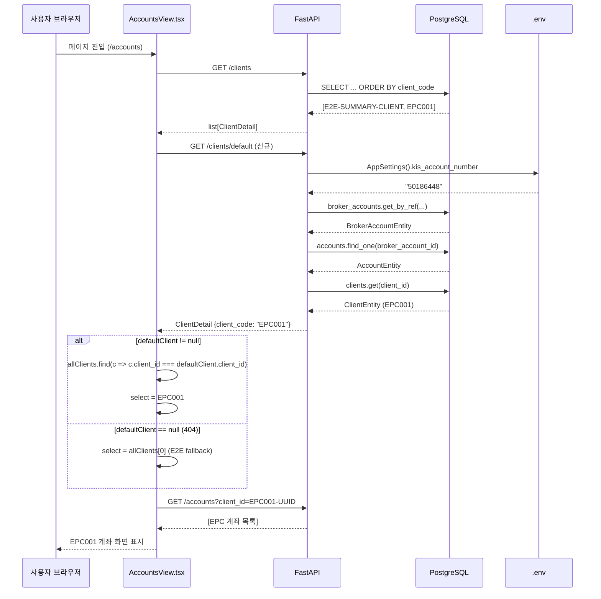

# AccountsView 기본 선택 정상화 설계

## 1. 문제 정의

### 현황
- [`AccountsView.tsx:91-93`](../../admin_ui/src/components/AccountsView.tsx:91-93) 가 mount 시 `allClients[0]` 를 무조건 선택
- [`GET /clients`](../../src/agent_trading/api/routes/clients.py:14-20) 는 `ORDER BY client_code` 로 정렬되어 `E2E-SUMMARY-CLIENT`(E) 가 `EPC001`(E) 보다 항상 먼저 옴
- 결과: E2E 계좌가 항상 기본 선택되어 사용자가 매번 EPC001 로 수동 전환해야 함

### `.env` → Client 매핑 체인
```
KIS_ACCOUNT_NO=50186448
  → AppSettings.kis_account_number
    → broker_accounts.account_ref='50186448'
      (broker_name='koreainvestment', environment='paper')
        → accounts (broker_account_id FK)
          → clients (client_id FK) → client_code='EPC001'
```

---

## 2. 방식 비교 분석

### 방식 1: `GET /clients/default` API 엔드포인트 추가 (권장) ✅

| 항목 | 내용 |
|------|------|
| **백엔드 변경** | 신규 엔드포인트 1개 (`routes/clients.py` + `schemas.py` 불필요) |
| **프론트엔드 변경** | `api/client.ts` 에 함수 추가 + `AccountsView.tsx` 마운트 로직 변경 |
| **테스트** | API 통합 테스트 + FE 단위 테스트 |
| **장점** | `.env` 와 완전 연동, 명확한 단일 책임, fallback 안전장치 내장 |
| **단점** | DB 조회 3회 (broker_accounts → accounts → clients), 약간의 latency |

### 방식 2: `/clients` 응답에 `is_default` 필드 추가

| 항목 | 내용 |
|------|------|
| **백엔드 변경** | `ClientDetail` 스키마 변경 + `list_clients()` 로직 수정 |
| **프론트엔드 변경** | `AccountsView.tsx` 선택 로직 변경 |
| **테스트** | 기존 `GET /clients` 응답 구조 변경 → 회귀 위험 |
| **장점** | 단일 round-trip |
| **단점** | 기존 API 응답 구조 변경 = 모든 클라이언트 영향, schema migration 필요, **회귀 위험 높음** |

### 방식 3: Frontend-only heuristic (`client_code` prefix 매칭)

| 항목 | 내용 |
|------|------|
| **백엔드 변경** | 없음 |
| **프론트엔드 변경** | `AccountsView.tsx` 선택 로직만 변경 |
| **테스트** | FE 단위 테스트 |
| **장점** | 백엔드 변경 전혀 없음, 가장 가벼움 |
| **단점** | `.env` 미연동, heuristic (EPC prefix가 향후 변경되면 깨짐), **요구사항 위반** |

### 최종 선택: **방식 1 (권장)**

**이유:**
1. `.env` KIS 계좌 기반으로 운영 client 를 **정확히** 식별 가능
2. 기존 API 응답 구조 (`GET /clients`) 변경 없음 → 회귀 risk 無
3. `/clients/default` 실패 시 `allClients[0]` fallback 으로 안전하게 동작
4. 확장성: 향후 다른 broker 가 추가되어도 동일 패턴으로 default client 결정 가능

---

## 3. 변경 파일 목록

### 백엔드 (Python)

| # | 파일 | 변경 유형 | 변경 내용 |
|---|------|-----------|-----------|
| 1 | [`src/agent_trading/api/routes/clients.py`](../../src/agent_trading/api/routes/clients.py) | 신규 엔드포인트 추가 | `GET /clients/default` 핸들러 추가 |
| 2 | [`tests/api/test_clients.py`](../../tests/api/test_clients.py) | 신규 파일 | `/clients/default` 통합 테스트 |

### 프론트엔드 (TypeScript/React)

| # | 파일 | 변경 유형 | 변경 내용 |
|---|------|-----------|-----------|
| 3 | [`admin_ui/src/api/client.ts`](../../admin_ui/src/api/client.ts) | 함수 추가 | `getDefaultClient()` 함수 |
| 4 | [`admin_ui/src/components/AccountsView.tsx`](../../admin_ui/src/components/AccountsView.tsx) | 마운트 로직 변경 | `/clients/default` 호출 + fallback |

---

## 4. 구체적 변경 사항

### 4.1 `GET /clients/default` 엔드포인트 추가

#### 위치: [`src/agent_trading/api/routes/clients.py`](../../src/agent_trading/api/routes/clients.py) (37-66 line 추가)

```python
@router.get("/clients/default", response_model=ClientDetail)
async def get_default_client(
    repos: RepositoryContainer = Depends(get_repos),
) -> ClientDetail:
    """Return the client mapped from ``KIS_ACCOUNT_NO`` in ``.env``.
    
    Resolution chain::
    
        KIS_ACCOUNT_NO → broker_accounts (get_by_ref)
                       → accounts (find_one by broker_account_id)
                       → clients (get by client_id)
    
    Returns ``404`` when the KIS account has no mapped client
    (e.g. paper environment without seed data).
    """
    from agent_trading.config.settings import AppSettings
    from agent_trading.domain.enums import Environment

    settings = AppSettings()
    account_ref = settings.kis_account_number
    if not account_ref:
        raise HTTPException(status_code=404, detail="KIS_ACCOUNT_NO not configured")

    kis_env = settings.kis_env  # "paper" | "live"
    env = Environment(kis_env)  # normalize to enum

    # Step 1: broker_account → by (koreainvestment, account_ref, env)
    broker_acct = await repos.broker_accounts.get_by_ref(
        broker_name="koreainvestment",
        account_ref=account_ref,
        environment=env,
    )
    if broker_acct is None:
        raise HTTPException(status_code=404, detail="No broker account found for KIS_ACCOUNT_NO")

    # Step 2: account → by broker_account_id
    from agent_trading.repositories.filters import AccountLookup
    acct = await repos.accounts.find_one(
        AccountLookup(broker_account_id=broker_acct.broker_account_id)
    )
    if acct is None:
        raise HTTPException(status_code=404, detail="No account found for broker account")

    # Step 3: client → by client_id
    client = await repos.clients.get(acct.client_id)
    if client is None:
        raise HTTPException(status_code=404, detail="No client found for account")

    return ClientDetail.model_validate(client)
```

**상세 설명:**
- `from agent_trading.config.settings import AppSettings` — 기존 route(`health.py`, `snapshot_sync_runs.py`) 와 동일한 패턴
- `GET /clients/{client_id}` 와 경로 충돌 방지: `/clients/default` 는 `/clients/{client_id}` 보다 먼저 등록되어야 함 (FastAPI 는 등록 순서로 매칭하므로 `/clients/default` 를 먼저 등록)
  * FastAPI `APIRouter` 는 `@router.get("/clients/default")` 가 먼저 등록되면 `/clients/default` 경로를 static path 로 인식하고, 이후 `@router.get("/clients/{client_id}")` 는 dynamic path 로 처리 — 충돌 없음
- 404 응답: KIS 계좌가 설정되지 않았거나 매핑된 client 가 없는 경우 (fallback trigger)

### 4.2 프론트엔드 API 함수 추가

#### 위치: [`admin_ui/src/api/client.ts`](../../admin_ui/src/api/client.ts) (100-102 line 이후)

```typescript
/** Fetch the default client mapped from KIS_ACCOUNT_NO env var.
 *  Returns ``null`` on 404 (no mapping configured) — caller should fall back.
 */
export async function getDefaultClient(): Promise<ClientDetail | null> {
  try {
    return await request<ClientDetail>("/clients/default");
  } catch (err) {
    if (err instanceof ApiResponseError && err.status === 404) {
      return null;
    }
    throw err;
  }
}
```

### 4.3 AccountsView 마운트 로직 변경

#### 변경 전: [`admin_ui/src/components/AccountsView.tsx`](../../admin_ui/src/components/AccountsView.tsx):77-103

```typescript
// ── Fetch clients → accounts ───────────────────────────────────
useEffect(() => {
  setLoading(true);
  setError(null);

  getClients()
    .then((allClients) => {
      setClients(allClients);
      if (allClients.length === 0) {
        setAccounts([]);
        setLoading(false);
        return;
      }
      // Auto-select first client
      const first = allClients[0];
      setSelectedClient(first);
      return getAccounts(first.client_id);
    })
    ...
}, []);
```

#### 변경 후:

```typescript
// ── Fetch clients → accounts ───────────────────────────────────
useEffect(() => {
  setLoading(true);
  setError(null);

  getClients()
    .then(async (allClients) => {
      setClients(allClients);
      if (allClients.length === 0) {
        setAccounts([]);
        setLoading(false);
        return;
      }
      // Try default client first; fallback to allClients[0]
      const defaultClient = await getDefaultClient();
      const target = defaultClient !== null
        ? allClients.find(c => c.client_id === defaultClient.client_id) ?? allClients[0]
        : allClients[0];
      setSelectedClient(target);
      return getAccounts(target.client_id);
    })
    ...
}, []);
```

**변경 설명:**
- `getClients()` 와 `getDefaultClient()` 를 **sequential** 로 호출 (race condition 방지)
- `getDefaultClient()` 가 `null` 반환 시 (404) → `allClients[0]` fallback (기존 동작)
- 반환된 `ClientDetail` 의 `client_id` 로 `allClients` 배열에서 매칭하여 선택 (서로 다른 UUID 인스턴스 방지)
- KIS 계좌 미설정 환경(pure in-memory test 등)에서도 정상 동작

**고려사항:**
- `getDefaultClient()` 호출은 `getClients()` 의 `.then()` 내부에서 `async` 로 처리 — 기존 useEffect 의 cleanup/abort 전략은 변경 없음
- 에러 발생 시 (404 외 다른 HTTP 에러): `getDefaultClient()` 가 throw → catch 되지 않으면 전체 useEffect 실패 → `ErrorBanner` 표시
  - 이는 의도된 동작: 설정 문제를 사용자에게 알리는 것이 적절

---

## 5. 리스크 분석

| 리스크 | 영향 | 확률 | 대응 |
|--------|------|------|------|
| `/clients/default` 404 시 fallback 누락 | E2E 계좌 선택 | Low | 코드 리뷰로 방지 |
| `getDefaultClient()` 네트워크 에러로 전체 차트 미표시 | AccountsView 빈 화면 | Low | `getDefaultClient` catch 로 404+기타 에러 구분 |
| KIS 계좌 변경 시 accounts 테이블과 불일치 | 잘못된 client 선택 | Low | 정합성 문제는 별도 로그/모니터링 |
| `GET /clients/default` 내 DB 3회 조회로 인한 latency 증가 | 페이지 로딩 10-30ms 증가 | Very Low | in-memory mode 에서도 정상 동작 |
| FastAPI `/clients/default` vs `/clients/{client_id}` 경로 충돌 | 422 오류 | Very Low | 등록 순서로 해결 (static path 우선) |

### 영향 범위
- `GET /clients` — 변경 없음, 기존 응답 구조 유지
- `GET /clients/{client_id}` — 변경 없음
- 기타 accounts/positions/cash-balances API — 영향 없음
- `AccountsView` 외 다른 뷰 (Orders, Decisions 등) — 영향 없음

---

## 6. 테스트 전략

### 6.1 API 통합 테스트 (Python/pytest)

**신규 파일:** `tests/api/test_clients.py`

```python
"""Tests for ``GET /clients/default`` and ``GET /clients``."""

from __future__ import annotations

from uuid import uuid4

import pytest
from fastapi.testclient import TestClient

from agent_trading.domain.entities import (
    AccountEntity,
    BrokerAccountEntity,
    ClientEntity,
)
from agent_trading.domain.enums import Environment
from agent_trading.repositories.bootstrap import build_in_memory_repositories


@pytest.fixture
def seeded_client_app():
    """Build app with seeded clients, accounts, broker_accounts."""
    repos = build_in_memory_repositories()
    client_id = uuid4()
    broker_account_id = uuid4()
    account_id = uuid4()

    # Seed: broker_account (matching KIS account ref)
    repos.broker_accounts.add(BrokerAccountEntity(
        broker_account_id=broker_account_id,
        broker_name="koreainvestment",
        account_ref="50186448",
        environment=Environment.PAPER,
        credential_ref="test",
        base_url="",
        status="active",
        broker_account_code="50186448",
    ))

    # Seed: account linked to broker_account
    repos.accounts.add(AccountEntity(
        account_id=account_id,
        client_id=client_id,
        broker_account_id=broker_account_id,
        environment=Environment.PAPER,
        account_alias="EPC-ACCT",
        status="active",
    ))

    # Seed: client
    repos.clients.add(ClientEntity(
        client_id=client_id,
        client_code="EPC001",
        name="EPC Operating Client",
        status="active",
        base_currency="KRW",
    ))

    # Also seed E2E client (should NOT be selected)
    e2e_client_id = uuid4()
    repos.clients.add(ClientEntity(
        client_id=e2e_client_id,
        client_code="E2E-SUMMARY-CLIENT",
        name="E2E Summary Client",
        status="active",
        base_currency="KRW",
    ))

    from agent_trading.api.app import create_app
    app = create_app(repos=repos, auth_enabled=False)
    return TestClient(app)


class TestGetDefaultClient:
    def test_returns_epc_client(self, seeded_client_app):
        """``GET /clients/default`` returns the client mapped from KIS account."""
        resp = seeded_client_app.get("/clients/default")
        assert resp.status_code == 200
        data = resp.json()
        assert data["client_code"] == "EPC001"
        assert data["name"] == "EPC Operating Client"

    def test_404_when_no_mapping(self, empty_client):
        """No KIS account configured → 404."""
        resp = empty_client.get("/clients/default")
        assert resp.status_code == 404
```

**참고:** `empty_client` fixture 는 [`tests/api/conftest.py`](../../tests/api/conftest.py) 에 이미 정의된 빈 저장소 사용 클라이언트

### 6.2 AccountsView 동작 검증 (수동/Playwright)

| 시나리오 | 기대 동작 |
|----------|-----------|
| KIS 계좌 매핑된 client 존재 | `EPC001` 이 기본 선택됨 |
| KIS 계좌 미설정 (404) | `E2E-SUMMARY-CLIENT` 가 기본 선택됨 (기존 동작) |
| `/clients/default` 네트워크 에러 | `ErrorBanner` 표시 (기존 에러 처리와 동일) |

---

## 7. 검증 방법 (Docker rebuild + curl)

```bash
# 1. Docker rebuild
docker compose build api

# 2. 서비스 시작
docker compose up -d

# 3. 토큰 발급
TOKEN=$(curl -s -X POST http://localhost:8000/auth/token \
  -H "Content-Type: application/json" \
  -d '{"password": "'"$ADMIN_PASSWORD"'"}' | jq -r '.access_token')

# 4. GET /clients/default 검증
curl -s http://localhost:8000/clients/default \
  -H "Authorization: Bearer $TOKEN" | jq .

# 기대: client_code가 "EPC001"인 client 반환

# 5. GET /clients (기존 API 영향 없음 확인)
curl -s http://localhost:8000/clients \
  -H "Authorization: Bearer $TOKEN" | jq '.[].client_code'

# 기대: ["E2E-SUMMARY-CLIENT", "EPC001"] — E2E가 여전히 첫 번째

# 6. 환경 변수 없이 실행 시 404 확인
docker compose run --rm -e KIS_ACCOUNT_NO="" api \
  python -c "import requests; r=requests.get('http://api:8000/clients/default'); print(r.status_code, r.json())"
# 기대: 404
```

---

## 8. Mermaid: Data Flow



---

## 9. 변경 요약

| 구분 | 파일 | 변경 유형 | 예상 라인 수 |
|------|------|-----------|-------------|
| 백엔드 | [`src/agent_trading/api/routes/clients.py`](../../src/agent_trading/api/routes/clients.py) | 신규 엔드포인트 +30 lines | ~30 |
| 테스트 | [`tests/api/test_clients.py`](../../tests/api/test_clients.py) | 신규 테스트 파일 +60 lines | ~60 |
| 프론트엔드 API | [`admin_ui/src/api/client.ts`](../../admin_ui/src/api/client.ts) | 함수 추가 +15 lines | ~15 |
| 프론트엔드 View | [`admin_ui/src/components/AccountsView.tsx`](../../admin_ui/src/components/AccountsView.tsx) | 로직 변경 +5 lines | ~5 |

**총 변경량: ~110 lines (신규 + 변경)**

---

## 10. 구현 순서

1. **백엔드**: `routes/clients.py` 에 `GET /clients/default` 엔드포인트 추가
2. **프론트엔드 API**: `api/client.ts` 에 `getDefaultClient()` 함수 추가
3. **프론트엔드 View**: `AccountsView.tsx` 마운트 로직 수정
4. **백엔드 테스트**: `tests/api/test_clients.py` 통합 테스트 작성
5. **검증**: Docker rebuild + curl 로 API 정상 동작 확인
