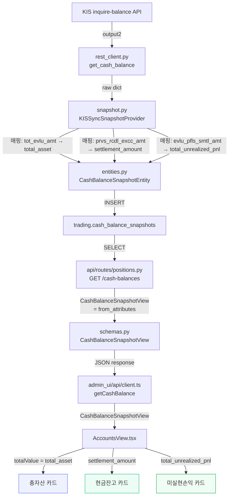

# AccountsView KIS 금액 정합성 수정 계획

## 1. 문제 정의

`AccountsView.tsx` 상단 요약 카드 3개가 현재 **내부 계산식**으로 표시되고 있어 KIS 브로커의 authoritative value와 불일치.

| 카드 | 현재 구현 | 문제 |
|------|-----------|------|
| 총자산 | `sum(quantity * market_price) + settled_cash` | 스냅샷 시점 불일치, KIS 총괄값과 차이 가능 |
| 현금잔고 | `cashBalance.settled_cash` (nxdy_excc_amt=익일초과액) | 사용자가 원하는 값은 `prvs_rcdl_excc_amt` (가수도정산금액) |
| 미실현손익 | `sum(position.unrealized_pnl)` (개별 포지션 합산) | 계좌 총괄값 `evlu_pfls_smtl_amt`와 차이 가능 |

**사용자 피드백 반영 (3건):**
1. `settlement_amount` 주석에 KIS D+2 기준임을 명시
2. Migration: nullable + additive 전용, 과거 backfill 금지
3. AccountsView UI fallback: `??` 연산자로 기존 계산값 유지

## 2. KIS 기준 확정 매핑

KIS Excel `주식잔고조회` 시트 `output2` (예수금 총괄) 기준:

| AccountsView 카드 | KIS Raw Field | 한글명 | 성격 |
|-------------------|---------------|--------|------|
| 총자산 | `tot_evlu_amt` | 총평가금액 | 유가증권 평가금액 합계 + D+2 예수금 |
| 현금잔고 | `prvs_rcdl_excc_amt` | 가수도정산금액 | D+2 결제 예정 금액 (실질 현금) |
| 미실현손익 | `evlu_pfls_smtl_amt` | 평가손익합계금액 | 전체 포지션 평가손익 합계 |

## 3. 현재 파이프라인 분석 (As-Is)

```
KIS inquire-balance API
  ├── output/output1: [position objects]  ← get_positions() 사용
  │     └── 각 position: pdno, hldg_qty, pchs_avg_pric, prpr, evlu_pfls_amt
  └── output2: {cash summary}             ← get_cash_balance() 사용
        ├── dnca_tot_amt     → available_cash  ✅
        ├── nxdy_excc_amt    → settled_cash    ✅ (현재 AccountsView에서 사용)
        ├── ord_psbl_amt     → (미사용)
        ├── tot_evlu_amt     → (미사용) ❌ ← 추가 필요
        ├── prvs_rcdl_excc_amt → (미사용) ❌ ← 추가 필요
        └── evlu_pfls_smtl_amt → (미사용) ❌ ← 추가 필요
```

> **참고:** `settlement_amount`는 KIS `prvs_rcdl_excc_amt` (가수도정산금액, D+2 예수금 기준)에서 매핑됩니다. 내부 필드명만 보면 일반 정산금으로 오해할 수 있으므로 entity/schema 주석에 반드시 KIS D+2 기준임을 명시합니다.

### 계층별 현재 상태

| 계층 | 파일 | 3개 필드 존재? | 비고 |
|------|------|----------------|------|
| KIS REST Client | `rest_client.py:get_cash_balance()` | ✅ raw output2에 포함 | `data.get("output2", {})`로 전체 dict 반환 |
| Snapshot Mapper | `snapshot.py:KISSyncSnapshotProvider` | ❌ 미추출 | `dnca_tot_amt`, `nxdy_excc_amt`만 매핑 |
| Domain Entity | `entities.py:CashBalanceSnapshotEntity` | ❌ 필드 없음 | `available_cash`, `settled_cash`, `unsettled_cash`만 존재 |
| PostgreSQL | `trading.cash_balance_snapshots` | ❌ 컬럼 없음 | entity와 동일 |
| API Schema | `schemas.py:CashBalanceSnapshotView` | ❌ 필드 없음 | entity와 동일 |
| Frontend Types | `types/api.ts:CashBalanceSnapshotView` | ❌ 필드 없음 | schema와 동일 |
| AccountsView | `AccountsView.tsx` | ❌ 계산식 사용 | `totalValue`, `cashBalance.settled_cash`, `totalPnl` |

## 4. 수정 범위 (최소 변경 원칙)

**변경 필요 계층:** Snapshot Mapper → Domain Entity → DB (migration) → API Schema → Frontend Types → AccountsView

**변경 불필요 계층:**
- `rest_client.py`: `get_cash_balance()`는 이미 `output2` 전체 dict 반환하므로 수정 불필요
- `adapter.py`: `get_cash_balance()`는 entity 변환 안 함, 수정 불필요
- Position 관련 로직: 전혀 건드리지 않음
- `kis_snapshot_sync.py`: `snapshot.py`와 중복—둘 다 수정하거나 하나만 수정

## 5. 상세 구현 항목

### 5.1 Domain Entity 수정
**파일:** [`src/agent_trading/domain/entities.py`](src/agent_trading/domain/entities.py:131)

`CashBalanceSnapshotEntity`에 3개 optional 필드 추가:
```python
@dataclass(slots=True, frozen=True)
class CashBalanceSnapshotEntity:
    cash_balance_snapshot_id: UUID
    account_id: UUID
    currency: str
    available_cash: Decimal
    settled_cash: Decimal | None
    unsettled_cash: Decimal | None
    # ── KIS output2 account-level summary fields ──
    total_asset: Decimal | None = None          # tot_evlu_amt (총평가금액)
    settlement_amount: Decimal | None = None    # prvs_rcdl_excc_amt (가수도정산금액)
    total_unrealized_pnl: Decimal | None = None # evlu_pfls_smtl_amt (평가손익합계금액)
    source_of_truth: str
    snapshot_at: datetime
    created_at: datetime | None = None
```

**참고:** `frozen=True` dataclass이므로 기본값을 가진 필드는 순서상 source_of_truth **앞**에 위치해야 함. Python dataclass 규칙상 기본값 없는 필드 다음에 기본값 있는 필드가 와야 함.

### 5.2 Snapshot Mapper 수정
**파일:** [`src/agent_trading/brokers/koreainvestment/snapshot.py`](src/agent_trading/brokers/koreainvestment/snapshot.py:29)

```python
# KIS inquire-balance output2 (cash summary) field names — 추가
_KIS_TOT_EVL_AMT = "tot_evlu_amt"           # 총평가금액
_KIS_PRVS_RCDL_EXCC_AMT = "prvs_rcdl_excc_amt"  # 가수도정산금액
_KIS_EVL_PFLS_SMTL_AMT = "evlu_pfls_smtl_amt"   # 평가손익합계금액

# fetch_snapshot() cash balance 섹션에 다음 추가:
total_asset = safe_optional_decimal(raw_cash.get(_KIS_TOT_EVL_AMT))
settlement_amount = safe_optional_decimal(raw_cash.get(_KIS_PRVS_RCDL_EXCC_AMT))
total_pnl = safe_optional_decimal(raw_cash.get(_KIS_EVL_PFLS_SMTL_AMT))

cash_balance = CashBalanceSnapshotEntity(
    ...
    total_asset=total_asset,
    settlement_amount=settlement_amount,
    total_unrealized_pnl=total_pnl,
)
```

**같이 수정:** [`src/agent_trading/services/kis_snapshot_sync.py`](src/agent_trading/services/kis_snapshot_sync.py:28) — 동일한 필드 매핑 및 entity 생성 로직 존재. `sync_account()` 함수 내 cash balance 생성 부분에도 동일하게 3개 필드 추가.

### 5.3 DB Migration 추가
**파일:** 신규 마이그레이션 (예: `src/agent_trading/db/migrations/versions/XXX_add_kis_output2_fields.py`)

```sql
ALTER TABLE trading.cash_balance_snapshots
    ADD COLUMN total_asset NUMERIC(20,4),
    ADD COLUMN settlement_amount NUMERIC(20,4),
    ADD COLUMN total_unrealized_pnl NUMERIC(20,4);
```

**또는** 간단한 raw SQL migration 파일 추가.

### 5.4 API Schema 수정
**파일:** [`src/agent_trading/api/schemas.py`](src/agent_trading/api/schemas.py:361)

```python
class CashBalanceSnapshotView(BaseModel):
    model_config = ConfigDict(from_attributes=True)
    cash_balance_snapshot_id: UUID
    account_id: UUID
    currency: str
    available_cash: float
    settled_cash: float | None
    unsettled_cash: float | None
    # ── KIS output2 account-level summary fields ──
    total_asset: float | None = None
    settlement_amount: float | None = None
    total_unrealized_pnl: float | None = None
    source_of_truth: str
    snapshot_at: datetime
    created_at: datetime
```

### 5.5 Frontend Types 수정
**파일:** [`admin_ui/src/types/api.ts`](admin_ui/src/types/api.ts:133)

```typescript
export interface CashBalanceSnapshotView {
  cash_balance_snapshot_id: string;
  account_id: string;
  currency: string;
  available_cash: number;
  settled_cash: number;
  unsettled_cash: number;
  // ── KIS output2 account-level summary fields ──
  total_asset: number | null;
  settlement_amount: number | null;
  total_unrealized_pnl: number | null;
  source_of_truth: string;
  snapshot_at: string;
}
```

### 5.6 AccountsView.tsx 수정
**파일:** [`admin_ui/src/components/AccountsView.tsx`](admin_ui/src/components/AccountsView.tsx:138)

**변경 1:** `totalValue` 계산식 제거 → KIS `tot_evlu_amt` 사용
```typescript
// BEFORE (lines 142-149):
const totalValue = useMemo(() => {
  const posValue = latestPositions.reduce(
    (sum, p) => sum + p.quantity * p.market_price, 0,
  );
  const cash = cashBalance?.settled_cash ?? 0;
  return posValue + cash;
}, [latestPositions, cashBalance]);

// AFTER:
const totalValue = useMemo(() => {
  return cashBalance?.total_asset ?? 0;
}, [cashBalance]);
```

**변경 2:** 현금잔고 `settled_cash` → `settlement_amount`
```typescript
// BEFORE (line 490):
{cashBalance ? formatKrw(cashBalance.settled_cash) : "—"}

// AFTER:
{cashBalance ? formatKrw(cashBalance.settlement_amount ?? cashBalance.settled_cash) : "—"}
// (settlement_amount가 null일 경우 기존 settled_cash fallback)
```

**변경 3:** `totalPnl` 계산식 제거 → KIS `total_unrealized_pnl` 사용
```typescript
// BEFORE (lines 138-140):
const totalPnl = useMemo(() => {
  return latestPositions.reduce((sum, p) => sum + (p.unrealized_pnl ?? 0), 0);
}, [latestPositions]);

// AFTER:
const totalPnl = useMemo(() => {
  return cashBalance?.total_unrealized_pnl ?? 0;
}, [cashBalance]);
```

### 5.7 관련 테스트 업데이트
**파일:** [`tests/...`] — CashBalanceSnapshotEntity 관련 테스트에서 새 필드 포함 여부 확인

### 5.8 Docker 재빌드/재기동 (백엔드 수정 시)
```
cd /workspace/agent_trading && docker compose build && docker compose up -d
# /health 확인
```

## 6. 변경 파일 완전 목록

| # | 파일 | 변경 유형 | 영향 |
|---|------|-----------|------|
| 1 | `src/agent_trading/domain/entities.py` | 수정 | CashBalanceSnapshotEntity에 3개 optional 필드 추가 |
| 2 | `src/agent_trading/brokers/koreainvestment/snapshot.py` | 수정 | KIS output2 → entity 매핑에 3개 필드 추가 |
| 3 | `src/agent_trading/services/kis_snapshot_sync.py` | 수정 | 동일한 매핑 로직에 3개 필드 추가 |
| 4 | `src/agent_trading/db/migrations/` | 신규 | cash_balance_snapshots 테이블 ALTER TABLE |
| 5 | `src/agent_trading/api/schemas.py` | 수정 | CashBalanceSnapshotView에 3개 optional 필드 추가 |
| 6 | `admin_ui/src/types/api.ts` | 수정 | CashBalanceSnapshotView 인터페이스에 3개 optional 필드 추가 |
| 7 | `admin_ui/src/components/AccountsView.tsx` | 수정 | totalValue/totalPnl 계산식 → KIS 필드, 현금잔고 → settlement_amount |
| 8 | `tests/...` | 수정 | 관련 테스트에 새 필드 반영 |

## 7. 리스크 및 주의사항

1. **Backward compatibility:** 3개 필드는 모두 `Optional` / `None` 가능이므로, 기존 DB에 데이터가 없는 스냅샷은 `null` 반환. AccountsView에서 `??` fallback 처리 필요.
2. **스냅샷 sync 시점:** 새 필드는 snapshot sync가 실행된 이후부터 채워짐. 과거 스냅샷은 `null`. AccountsView에서 graceful handling 필요.
3. **kis_snapshot_sync.py vs snapshot.py:** 두 파일에 유사한 매핑 로직이 중복 존재. 두 파일 모두 수정 필요.
4. **DB migration 순서:** running migrations가 있는지 확인하고, 기존 마이그레이션 체인에 새 migration 추가.
5. **Docker 재시작:** `docker compose down` → `docker compose up -d --build` 순서로 하면 다운타임 발생. `docker compose up -d --build`만으로 롤링 재시작.

## 8. 검증 절차

1. **백엔드 단위:** pytest 실행 (CashBalanceSnapshotEntity 관련 테스트)
2. **DB migration:** migration 스크립트 실행 후 `\d trading.cash_balance_snapshots`로 컬럼 추가 확인
3. **프런트엔드 build:** `cd admin_ui && npx tsc --noEmit` (또는 `npm run build`)
4. **Docker:** `docker compose up -d --build` → `curl http://localhost:8000/health`
5. **AccountsView 확인:** 브라우저에서 각 카드 값이 KIS snapshot 값으로 표시되는지 확인

## 9. Mermaid 데이터 흐름 다이어그램


