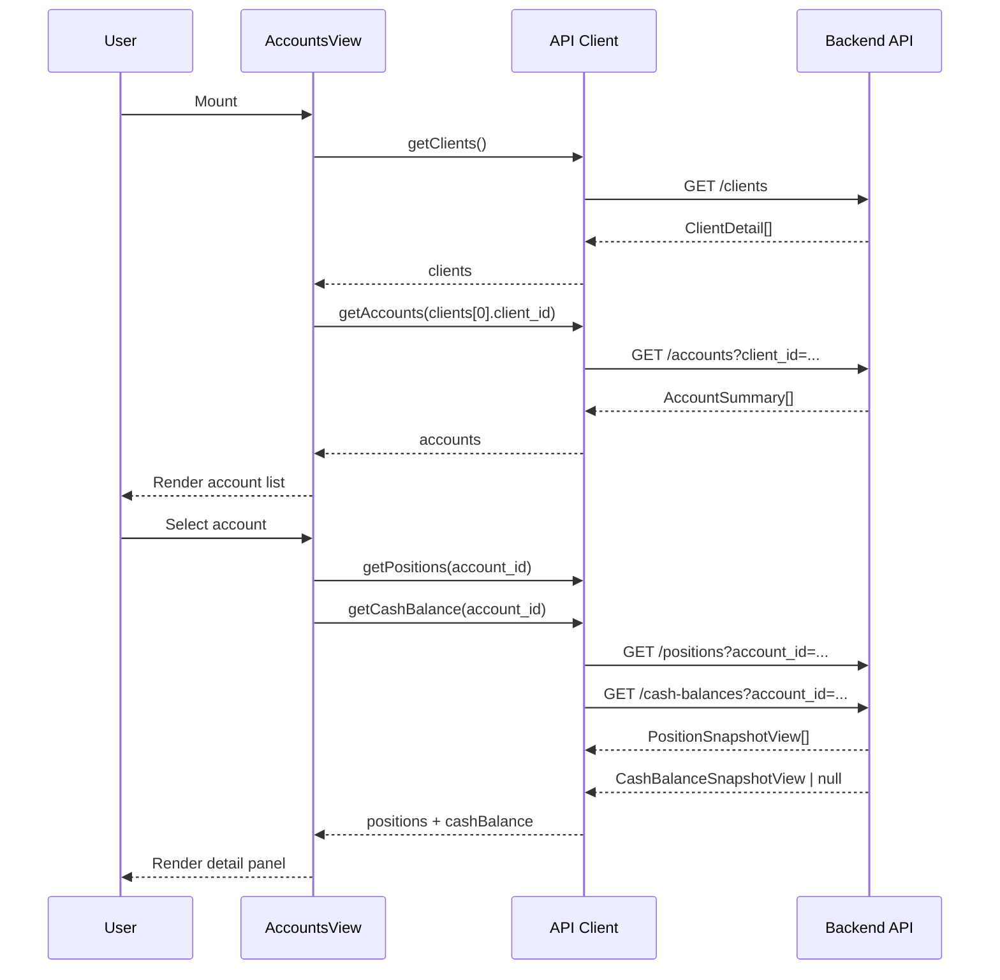
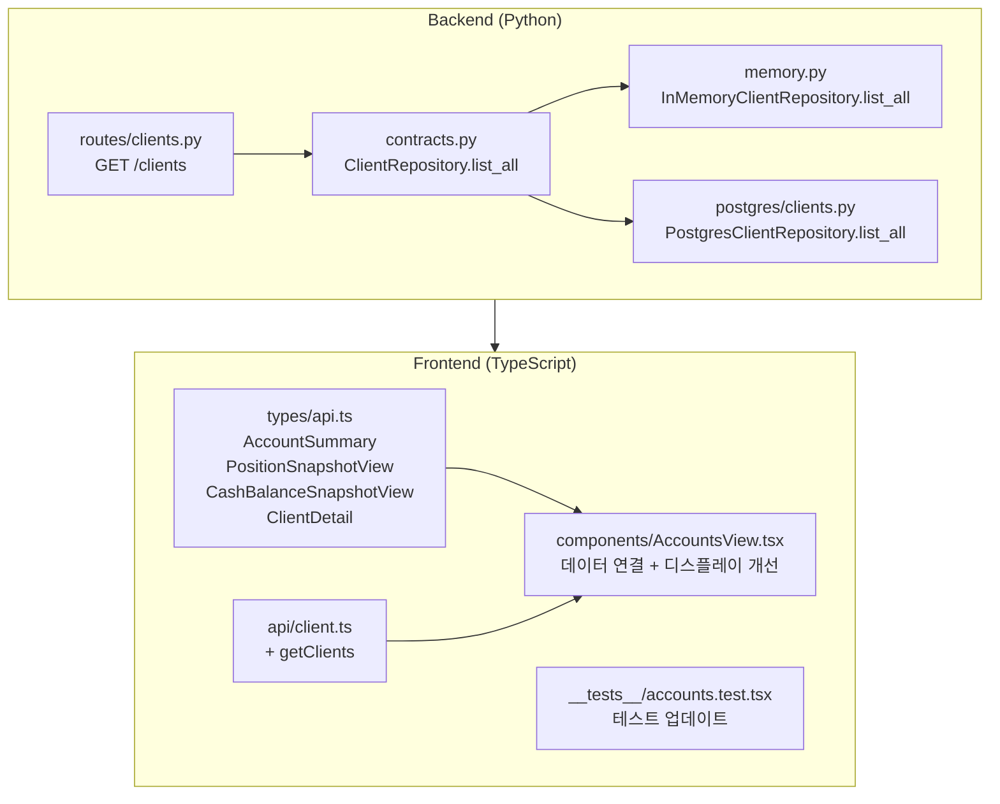

# Admin UI Account 연동 계획

## 1. 분석 결과

### 1.1 현재 상태

| 영역 | 상태 | 문제점 |
|------|------|--------|
| `GET /accounts` | Backend: `client_id` 필수 Query Param | Frontend에서 client_id 획득 불가 |
| `GET /clients` | **존재하지 않음** (GET /clients/{id}만 있음) | Client 목록 조회 불가 |
| `AccountSummary` 타입 | **Frontend/Backend 불일치** | 4개 필드 불일치 |
| `PositionSnapshotView` 타입 | **Frontend/Backend 불일치** | symbol/side 없음, instrument_id 사용 |
| `CashBalanceSnapshotView` 타입 | **Frontend/Backend 불일치** | available_amount/total_amount → available_cash/settled_cash/unsettled_cash |
| `ClientDetail` 타입 | **Frontend/Backend 불일치** | client_name → name, base_currency 누락 |

### 1.2 Backend Schema (실제)

```python
# AccountSummary
account_id: UUID
client_id: UUID
broker_account_id: UUID       # → broker_account 관계를 통해 broker_name 조회 가능
account_alias: str | None     # → 계좌 alias/ref
account_masked: str | None    # → 계좌번호 마스킹
environment: str              # → paper/live
status: str
risk_profile: dict | None
created_at: datetime
updated_at: datetime | None

# PositionSnapshotView
position_snapshot_id: UUID
account_id: UUID
instrument_id: UUID           # → symbol이 아닌 instrument UUID
quantity: float
average_price: float
market_price: float
unrealized_pnl: float | None
source_of_truth: str
snapshot_at: datetime

# CashBalanceSnapshotView
cash_balance_snapshot_id: UUID
account_id: UUID
currency: str
available_cash: float
settled_cash: float
unsettled_cash: float
source_of_truth: str
snapshot_at: datetime

# ClientDetail
client_id: UUID
client_code: str
name: str                     # frontend: client_name (틀림)
status: str
base_currency: str            # frontend: 누락
created_at: datetime
updated_at: datetime | None
```

### 1.3 핵심 문제

1. **Client 목록 조회 불가**: `GET /clients` 엔드포인트가 없어 client_id 획득 불가 → 계좌 목록 조회 불가
2. **Frontend 타입 불일치**: `AccountSummary`, `PositionSnapshotView`, `CashBalanceSnapshotView`, `ClientDetail` 모두 Backend 스키마와 다름
3. **Position에 symbol 없음**: Backend position snapshot은 `instrument_id`(UUID)만 가지고 `symbol`이 없음 → symbol 표시를 위해 `GET /instruments/{id}` 호출 필요

---

## 2. 변경 범위

### 2.1 Backend 변경 (소규모 — 신규 엔드포인트 추가)

#### 2.1.1 `ClientRepository` Protocol에 `list_all()` 추가
- **파일**: [`src/agent_trading/repositories/contracts.py`](src/agent_trading/repositories/contracts.py)
- **변경**: `ClientRepository` protocol에 `async def list_all() -> Sequence[ClientEntity]` 추가

#### 2.1.2 `InMemoryClientRepository`에 `list_all()` 구현
- **파일**: [`src/agent_trading/repositories/memory.py`](src/agent_trading/repositories/memory.py)
- **변경**: `InMemoryClientRepository`에 `async def list_all() -> Sequence[ClientEntity]` 추가
- **구현**: `return tuple(self._items.values())`

#### 2.1.3 `PostgresClientRepository`에 `list_all()` 구현
- **파일**: [`src/agent_trading/repositories/postgres/clients.py`](src/agent_trading/repositories/postgres/clients.py)
- **변경**: `PostgresClientRepository`에 `async def list_all() -> Sequence[ClientEntity]` 추가
- **구현**: `SELECT * FROM trading.clients`

#### 2.1.4 `GET /clients` 엔드포인트 추가
- **파일**: [`src/agent_trading/api/routes/clients.py`](src/agent_trading/api/routes/clients.py)
- **변경**: 기존 `GET /clients/{client_id}` 유지 + `GET /clients` (list all) 신규 추가
- **응답**: `list[ClientDetail]`

### 2.2 Frontend 타입 정렬 (스키마 불일치 해소)

#### 2.2.1 `AccountSummary` 타입 수정
- **파일**: [`admin_ui/src/types/api.ts`](admin_ui/src/types/api.ts)
- **변경 전**:
  ```typescript
  interface AccountSummary {
    account_id: string;
    account_code: string;    // 없음
    client_code: string;     // 없음
    account_type: string;    // 없음
    status: string;
    currency: string;        // 없음
  }
  ```
- **변경 후**:
  ```typescript
  interface AccountSummary {
    account_id: string;
    client_id: string;
    broker_account_id: string;
    account_alias: string | null;
    account_masked: string | null;
    environment: string;
    status: string;
    risk_profile: Record<string, unknown> | null;
    created_at: string;
    updated_at: string | null;
  }
  ```

#### 2.2.2 `PositionSnapshotView` 타입 수정
- **파일**: [`admin_ui/src/types/api.ts`](admin_ui/src/types/api.ts)
- **변경 전**:
  ```typescript
  interface PositionSnapshotView {
    position_snapshot_id: string;
    account_id: string;
    symbol: string;          // 없음
    side: string;            // 없음
    quantity: string;
    avg_price: string;       // average_price로 변경
    current_price: string;   // market_price로 변경
    pnl: string;             // unrealized_pnl로 변경
    snapshot_time: string;   // snapshot_at으로 변경
  }
  ```
- **변경 후**:
  ```typescript
  interface PositionSnapshotView {
    position_snapshot_id: string;
    account_id: string;
    instrument_id: string;
    quantity: number;
    average_price: number;
    market_price: number;
    unrealized_pnl: number | null;
    source_of_truth: string;
    snapshot_at: string;
  }
  ```

#### 2.2.3 `CashBalanceSnapshotView` 타입 수정
- **파일**: [`admin_ui/src/types/api.ts`](admin_ui/src/types/api.ts)
- **변경 전**:
  ```typescript
  interface CashBalanceSnapshotView {
    cash_balance_snapshot_id: string;
    account_id: string;
    currency: string;
    available_amount: string;   // available_cash로 변경
    total_amount: string;       // 없음 (settled_cash + unsettled_cash로 대체)
    snapshot_time: string;      // snapshot_at으로 변경
  }
  ```
- **변경 후**:
  ```typescript
  interface CashBalanceSnapshotView {
    cash_balance_snapshot_id: string;
    account_id: string;
    currency: string;
    available_cash: number;
    settled_cash: number;
    unsettled_cash: number;
    source_of_truth: string;
    snapshot_at: string;
  }
  ```

#### 2.2.4 `ClientDetail` 타입 수정
- **파일**: [`admin_ui/src/types/api.ts`](admin_ui/src/types/api.ts)
- **변경 전**:
  ```typescript
  interface ClientDetail {
    client_id: string;
    client_code: string;
    client_name: string;     // name으로 변경
    status: string;
  }
  ```
- **변경 후**:
  ```typescript
  interface ClientDetail {
    client_id: string;
    client_code: string;
    name: string;
    status: string;
    base_currency: string;
    created_at: string;
    updated_at: string | null;
  }
  ```

### 2.3 Frontend API client 확장

#### 2.3.1 `getClients()` 함수 추가
- **파일**: [`admin_ui/src/api/client.ts`](admin_ui/src/api/client.ts)
- **시그니처**: `export async function getClients(): Promise<ClientDetail[]>`
- **호출**: `GET /clients`
- **설명**: 모든 client 목록 반환 (신규 엔드포인트)

### 2.4 AccountsView.tsx 데이터 연결

#### 2.4.1 데이터 플로우 (신규)
```
Mount → GET /clients → client 목록
     → auto-select first client
     → GET /accounts?client_id=... → accounts 목록
     → user selects account
       → GET /positions?account_id=... → positions
       → GET /cash-balances?account_id=... → cash balance
```

#### 2.4.2 변경 사항

**A. `useEffect` #1 (client → accounts 로드)**
```typescript
useEffect(() => {
  setLoading(true);
  setError(null);
  getClients()
    .then((clients) => {
      if (clients.length === 0) {
        setAccounts([]);
        setLoading(false);
        return;
      }
      // Auto-select first client
      setSelectedClient(clients[0]);
      return getAccounts(clients[0].client_id);
    })
    .then((accounts) => {
      if (accounts) setAccounts(accounts);
    })
    .catch((err: unknown) => {
      const msg = err instanceof Error ? err.message : "Failed to load accounts";
      setError(msg);
    })
    .finally(() => setLoading(false));
}, []);
```

**B. State 추가**
```typescript
const [selectedClient, setSelectedClient] = useState<ClientDetail | null>(null);
```

**C. Account 컬럼 재정의** — 기존 `account_code`, `client_code`, `account_type` → `account_masked`, `account_alias`, `environment`, `client_id`

| 컬럼 | 설명 |
|------|------|
| `account_masked` | 계좌번호 마스킹 (****1234) |
| `account_alias` | 계좌 alias/별칭 |
| `environment` | paper/live (StatusBadge로 표시) |
| `status` | active/locked (기존 유지) |

**D. Detail 패널 개선** — 사용자 요청사항 반영:
- `broker_account_id` → `BrokerAccountRepository` 조회 or 단순 표시
- `environment` badge 표시 (PAPER/LIVE)
- `account_alias` 표시 (alias/ref)
- `account_masked` 표시 (계좌번호 마스킹)

**E. Position 테이블 컬럼 재정의** — `symbol`/`side` 제거, `instrument_id` 추가
- `instrument_id` → 추후 `GET /instruments/{id}` 연동 가능하도록预留
- `quantity` (number → formatted)
- `average_price` (number → currency formatted)
- `market_price` (number → currency formatted)
- `unrealized_pnl` (number → currency formatted, colored)
- `snapshot_at`

**F. Cash Balance Detail 재정의**
- `available_cash` → available amount
- `settled_cash` → settled cash
- `unsettled_cash` → unsettled cash
- `snapshot_at`
- Summary 카드의 `total_amount` → `settled_cash + unsettled_cash` 계산

**G. FilterBar 수정** — `account_type` 필터 제거 (backend에 account_type 없음)
- `searchText` 필터: `account_alias` 또는 `account_masked` 검색
- Type 필터: `environment` 필터로 대체 (paper/live)

### 2.5 AccountsView.tsx 상세 구현

#### 2.5.1 Account 목록 컬럼
```typescript
const accountColumns: Column<AccountSummary>[] = [
  { key: "account_masked", header: "Account #" },
  {
    key: "account_alias",
    header: "Alias",
    render: (r) => r.account_alias ?? "—",
  },
  {
    key: "environment",
    header: "Env",
    render: (r) => (
      <StatusBadge variant={r.environment === "live" ? "warning" : "info"}>
        {r.environment.toUpperCase()}
      </StatusBadge>
    ),
  },
  {
    key: "status",
    header: "Status",
    render: (r) => { ... },
  },
];
```

#### 2.5.2 Detail 패널
```
┌─ Account Detail ─────────────────────────────────┐
│ Account #    | ****1234                           │
│ Alias        | API-ACCT-001                       │
│ Environment  | [PAPER] badge                      │
│ Status       | [ACTIVE] badge                     │
│ Client ID    | abc-def-...                        │
│ Broker Acct  | broker-acct-uuid                   │
└──────────────────────────────────────────────────┘
```

#### 2.5.3 필터 변경
```typescript
filters={[
  {
    key: "env",
    label: "Environment",
    options: [
      { label: "Paper", value: "paper" },
      { label: "Live", value: "live" },
    ],
    value: envFilter,
    onChange: setEnvFilter,
  },
]}
```

#### 2.5.4 Position 컬럼
```typescript
const positionColumns: Column<PositionSnapshotView>[] = [
  { key: "instrument_id", header: "Instrument ID", render: (r) => r.instrument_id.slice(0, 8) + "…" },
  { key: "quantity", header: "Qty", render: (r) => formatQty(r.quantity) },
  { key: "average_price", header: "Avg Cost", render: (r) => formatCurrency(r.average_price) },
  { key: "market_price", header: "Market Price", render: (r) => formatCurrency(r.market_price) },
  {
    key: "unrealized_pnl",
    header: "Unrealized P&L",
    render: (r) => {
      const pnl = r.unrealized_pnl ?? 0;
      return <span className={...}>{pnl >= 0 ? "+" : ""}{formatCurrency(pnl)}</span>;
    },
  },
  { key: "snapshot_at", header: "Snapshot" },
];
```

### 2.6 테스트 업데이트

#### 2.6.1 `accounts.test.tsx` 업데이트
- **파일**: [`admin_ui/src/__tests__/accounts.test.tsx`](admin_ui/src/__tests__/accounts.test.tsx)

```typescript
// Mock data
const mockClients: ClientDetail[] = [
  { client_id: "cl-1", client_code: "CLIENT01", name: "Test Client", status: "active", base_currency: "KRW", created_at: "2024-01-01T00:00:00Z", updated_at: null },
];
const mockAccounts: AccountSummary[] = [
  { account_id: "acct-1", client_id: "cl-1", broker_account_id: "ba-1", account_alias: "My Account", account_masked: "****1234", environment: "paper", status: "active", risk_profile: null, created_at: "...", updated_at: null },
];

// Test cases:
// 1. Shows loading state initially
// 2. Fetches clients and accounts on mount
// 3. Shows accounts list
// 4. Selecting account shows detail panel
// 5. Shows positions and cash balance for selected account
// 6. Shows empty state when no clients
// 7. Shows error state on fetch failure
```

---

## 3. Mermaid: 데이터 플로우



## 4. Mermaid: 변경 범위



## 5. 변경 불가 확인

| 항목 | 상태 |
|------|------|
| Write 기능 추가 | ❌ 변경하지 않음 |
| submit/order 실행 | ❌ 변경하지 않음 |
| Auth 정책 변경 | ❌ 변경하지 않음 |
| Backend 대규모 계약 변경 | ❌ 소규모 신규 엔드포인트만 추가 (GET /clients) |
| Admin UI 전체 레이아웃 리디자인 | ❌ 변경하지 않음 |
| 기존 엔드포인트 응답 형식 변경 | ❌ 변경하지 않음 (AccountSummary 등 기존 응답은 그대로) |

## 6. 검증 항목

1. [ ] `GET /clients`가 모든 client를 반환하는지
2. [ ] Client 목록에서 첫 번째 client가 자동 선택되는지
3. [ ] 선택된 client의 accounts가 올바르게 표시되는지
4. [ ] Account 선택 시 positions + cash balance가 표시되는지
5. [ ] Empty state (clients=0 또는 accounts=0)가 올바르게 표시되는지
6. [ ] Error state가 올바르게 표시되는지
7. [ ] 계좌번호 마스킹(`account_masked`)이 표시되는지
8. [ ] Environment badge(PAPER/LIVE)가 표시되는지
9. [ ] Account alias가 표시되는지
10. [ ] Summary 카드(Total Value, Cash Balance, P&L)가 올바르게 계산되는지
11. [ ] 기존 테스트가 여전히 통과하는지
