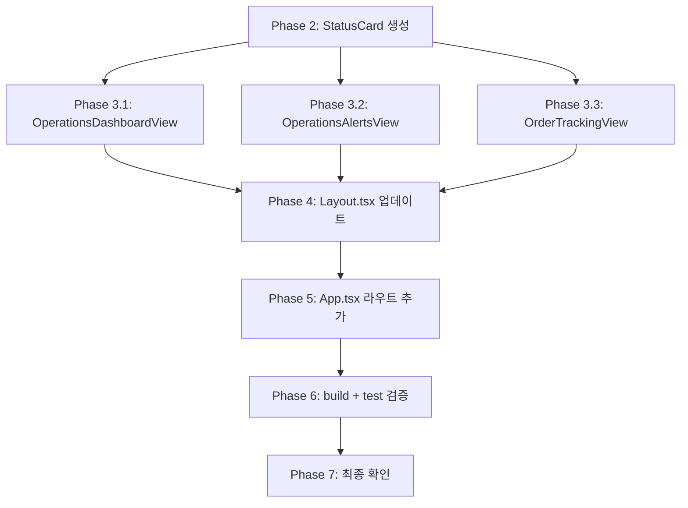

# Admin UI 디자인 포팅 계획

## 목표
`design/design_template/`의 v0.dev 디자인 템플릿을 실제 `admin_ui/`에 이식하되, 기존 기능/API 연동/테스트는 최대한 보존한다.

---

## 1. 사전 분석 결과

### 1.1 현재 admin_ui 상태 (6개 기능 페이지, 모두 정상 동작)

| 경로 | 컴포넌트 | 설명 |
|------|---------|------|
| `/` | `Dashboard.tsx` | MetricCard + 계좌/주문/잠금 테이블 |
| `/orders` | `OrdersView.tsx` | 주문 목록 |
| `/orders/:orderId` | `OrderDetail.tsx` | 주문 상세 |
| `/reconciliation` | `ReconciliationView.tsx` | 정합성 점검 |
| `/accounts` | `AccountsView.tsx` | 계좌 관리 |
| `/decisions` | `DecisionsView.tsx` | 의사결정 |
| `/agent-runs` | `AgentRunsView.tsx` | 에이전트 실행 |

### 1.2 design_template 신규 요소 (admin_ui에 없는 것)

| 요소 | 파일 | 설명 |
|------|------|------|
| `StatusCard` | `components/StatusCard.tsx` | ✅ **신규 컴포넌트** — 상태 표시 카드 |
| `OperationsDashboard` | `pages/OperationsDashboard.tsx` | ✅ **신규 페이지** — 운영 현황 |
| `OperationsAlerts` | `pages/OperationsAlerts.tsx` | ✅ **신규 페이지** — 경고/알림 |
| `OrderTracking` | `pages/OrderTracking.tsx` | ✅ **신규 페이지** — 주문 추적 |
| Sidebar 섹션 구조 | `components/Sidebar.tsx` | ✅ **참고** — "운영 모니터링" 섹션 |
| Agent 컴포넌트 개선 | Styling/variant 차이 | ⚠️ **선택적 반영** |

### 1.3 이미 포팅된 요소 (변경 불필요)

| 컴포넌트 | 이유 |
|---------|------|
| `DataTable` | admin_ui 버전이 더 발전됨 (loading/empty/compact) |
| `StatusBadge` | admin_ui 버전이 더 발전됨 (variant + status auto-map) |
| `WarningBanner` | 이미 동일 (한국어 레이블 적용됨) |
| `FilterBar` | 이미 동일 (한국어 레이블 적용됨) |
| `AgentTypeBadge` | 이미 동일 |
| `AgentRunsTable` | 이미 동일 (한국어 + Link 네비게이션 추가됨) |
| `AgentRunDetailPanel` | 이미 동일 (한국어 레이블 적용됨) |

---

## 2. 작업 상세

### Phase 2: 신규 `StatusCard` 공통 컴포넌트 추가

**파일**: `admin_ui/src/components/common/StatusCard.tsx`
**출처**: `design/design_template/src/components/StatusCard.tsx` (디자인 참조, 코드 재작성)

- StatusCardProps: `title`, `value`, `status: "healthy" | "warning" | "error" | "neutral"`, `subtitle?`
- design_template의 디자인과 동일한 스타일 유지
- `admin_ui/src/components/common/` 디렉토리에 추가 (기존 공통 컴포넌트와 일관성)
- 기존 `Dashboard.tsx`의 `MetricCard`는 **변경하지 않음** (별도 컴포넌트)

### Phase 3: 신규 페이지 3개 생성

#### 3.1 `OperationsDashboardView.tsx`
**경로**: `admin_ui/src/components/OperationsDashboardView.tsx`
**라우트**: `/operations`
**디자인 참조**: `design/design_template/src/pages/OperationsDashboard.tsx`

- Mock 데이터 → 실제 API 연동 없이 UI 전용 (기존 백엔드 코드 변경 금지)
- `StatusCard` 그리드로 시스템 상태 표시
- 최근 실행 타임라인 섹션 (DataTable 사용)
- 미해결 정합성 상태 섹션
- 대시보드 탐색 버튼은 React Router `useNavigate()` 사용
- `WarningBanner` 연동

#### 3.2 `OperationsAlertsView.tsx`
**경로**: `admin_ui/src/components/OperationsAlertsView.tsx`
**라우트**: `/operations/alerts`
**디자인 참조**: `design/design_template/src/pages/OperationsAlerts.tsx`

- Alert 목록 + 상세 패널 레이아웃
- 레벨별 필터 (전체/긴급/주의/정보)
- 운영 메모 섹션
- Pre-Market 체크리스트
- 모든 데이터는 UI 전용 (mock)

#### 3.3 `OrderTrackingView.tsx`
**경로**: `admin_ui/src/components/OrderTrackingView.tsx`
**라우트**: `/operations/orders`
**디자인 참조**: `design/design_template/src/pages/OrderTracking.tsx`

- 종목/주문 ID 검색 + 상태/구분 필터 (FilterBar 사용)
- 주문 목록 + 상세 패널 (분할 레이아웃)
- 상태 전이 타임라인
- 브로커 주문 정보
- 제출 경로 요약 (DC/TD/Agent Runs)
- 모든 데이터는 UI 전용 (mock)

### Phase 4: Layout.tsx 네비게이션 메뉴 업데이트

**파일**: `admin_ui/src/components/Layout.tsx`

현재 navSections:
```
활성
├── 개요 (/)
├── 주문 (/orders)
├── 정합성 점검 (/reconciliation)
├── 계좌 (/accounts)
├── 의사결정 (/decisions)
└── 에이전트 실행 (/agent-runs)
예약
├── 브로커 (disabled)
├── 시스템 (disabled)
└── 관리자 (disabled)
```

변경 후 navSections:
```
운영 모니터링          ← 신규 섹션 (design_template에서 가져옴)
├── 운영 대시보드 (/operations)     ← 신규
├── 운영 경고 (/operations/alerts)   ← 신규
└── 주문 추적 (/operations/orders)   ← 신규
기본 운영              ← 기존 "활성" → "기본 운영"으로 변경
├── 개요 (/)
├── 주문 (/orders)
├── 정합성 점검 (/reconciliation)
├── 계좌 (/accounts)
├── 의사결정 (/decisions)
└── 에이전트 실행 (/agent-runs)
예약됨                 ← 기존 "예약" 유지
├── 브로커 (disabled)
├── 시스템 (disabled)
└── 관리 (disabled)
```

- 새 아이콘: `Activity`(운영 대시보드), `AlertCircle`(운영 경고), `Search`(주문 추적) → `lucide-react`에서 import
- `cn()` 유틸리티 사용하여 활성 메뉴 스타일링 (기존 패턴 유지)
- `currentPath` 로직 확장: `/operations`, `/operations/alerts`, `/operations/orders` 경로 처리

### Phase 5: App.tsx 라우트 추가 (Additive Only)

**파일**: `admin_ui/src/App.tsx`

```typescript
// 추가할 import
import OperationsDashboardView from "./components/OperationsDashboardView";
import OperationsAlertsView from "./components/OperationsAlertsView";
import OrderTrackingView from "./components/OrderTrackingView";

// Protected Route 내부에 추가 (기존 라우트 변경 없음)
<Route path="operations" element={<OperationsDashboardView />} />
<Route path="operations/alerts" element={<OperationsAlertsView />} />
<Route path="operations/orders" element={<OrderTrackingView />} />
```

- 기존 `Route` 블록은 **절대 변경하지 않음**
- 새로운 `Route` 요소만 추가

### Phase 6: 빌드 및 테스트 검증

```bash
cd admin_ui && npm run build
cd admin_ui && npm run test:run  # 기존 테스트 통과 확인
```

- TypeScript 컴파일 에러 확인
- 기존 테스트 스위트 전원 통과 확인
- Lint 에러 확인

### Phase 7: 최종 확인

- 변경된 파일 목록 정리
- 기존 기능 영향도 보고
- 이상 유무 보고

---

## 3. 변경 대상 파일 목록

| 파일 | 작업 | 위험도 |
|------|------|--------|
| `admin_ui/src/components/common/StatusCard.tsx` | **생성** | 낮음 |
| `admin_ui/src/components/OperationsDashboardView.tsx` | **생성** | 낮음 |
| `admin_ui/src/components/OperationsAlertsView.tsx` | **생성** | 낮음 |
| `admin_ui/src/components/OrderTrackingView.tsx` | **생성** | 낮음 |
| `admin_ui/src/components/Layout.tsx` | **수정** (navSections만 변경) | 중간 |
| `admin_ui/src/App.tsx` | **수정** (라우트 3개 추가) | 중간 |

## 4. 변경하지 않는 대상

| 파일 | 이유 |
|------|------|
| `src/agent_trading/` 전체 | 백엔드 코드 변경 금지 |
| `admin_ui/src/api/client.ts` | 기존 API 클라이언트 보존 |
| `admin_ui/src/context/AuthContext.tsx` | 기존 인증 로직 보존 |
| `admin_ui/src/components/ProtectedRoute.tsx` | 기존 ProtectedRoute 보존 |
| `admin_ui/src/components/Dashboard.tsx` | 기존 개요 페이지 보존 |
| `admin_ui/src/components/OrdersView.tsx` | 기존 주문 페이지 보존 |
| `admin_ui/src/components/OrderDetail.tsx` | 기존 주문 상세 보존 |
| `admin_ui/src/components/ReconciliationView.tsx` | 기존 정합성 페이지 보존 |
| `admin_ui/src/components/AccountsView.tsx` | 기존 계좌 페이지 보존 |
| `admin_ui/src/components/DecisionsView.tsx` | 기존 의사결정 페이지 보존 |
| `admin_ui/src/components/AgentRunsView.tsx` | 기존 에이전트 페이지 보존 |
| `admin_ui/src/components/LoginForm.tsx` | 기존 로그인 폼 보존 |
| `admin_ui/src/components/BrokerCapacityPanel.tsx` | 기존 브로커 용량 패널 보존 |
| `admin_ui/src/components/AgentTypeBadge.tsx` | 이미 동일하므로 보존 |
| `admin_ui/src/components/AgentRunsTable.tsx` | 이미 동일하므로 보존 |
| `admin_ui/src/components/AgentRunDetailPanel.tsx` | 이미 동일하므로 보존 |
| `admin_ui/src/components/common/DataTable.tsx` | 이미 더 발전됨 |
| `admin_ui/src/components/common/StatusBadge.tsx` | 이미 더 발전됨 |
| `admin_ui/src/components/common/WarningBanner.tsx` | 이미 동일 |
| `admin_ui/src/components/common/FilterBar.tsx` | 이미 동일 |
| `admin_ui/src/__tests__/` 전체 | 기존 테스트 보존 |
| `.env` | 변경 금지 |
| `package.json` | 변경 불필요 (shadcn/ui 미설치) |

---

## 5. 작업 순서 의존성



- Phase 2 (StatusCard)는 Phase 3의 3개 페이지에서 모두 사용되므로 먼저 생성
- Phase 3 (신규 페이지 3개)은 서로 독립적이므로 병렬 생성 가능
- Phase 4 (Layout)는 Phase 3 완료 후 메뉴 연결 확인 위해 순차 진행
- Phase 5 (App.tsx)는 Phase 4 완료 후 진행

---

## 6. 리스크 및 주의사항

1. **HashRouter 경로 문제**: `/operations/alerts`는 HashRouter에서 중첩 경로로 정상 동작해야 함
2. **Layout currentPath 로직**: 현재 `location.pathname.split("/")[1]` 방식으로 활성 메뉴 판별. `/operations/alerts`의 경우 `split("/")[1]`이 `operations`가 되어 `/operations` 메뉴가 활성화되어야 함 → 정상
3. **lucide-react 아이콘 import**: `AlertCircle`은 이미 Layout.tsx에서 사용 중이므로 추가 import 불필요. `Activity`도 이미 import되어 있음. `Search` 아이콘만 추가 필요
4. **디자인 일관성**: design_template의 컬러 시스템(#f8fafc, #e2e8f0, #64748b, #0f172a 등)은 admin_ui와 완전히 동일하므로 직접 적용 가능
5. **Mock 데이터**: 신규 페이지는 UI 전용이므로 mock 데이터만 사용. 추후 실제 API 연동은 별도 작업
