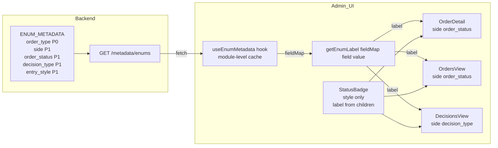

# Admin UI Enum Label P1 확장 — `side`, `order_status`, `decision_type`, `entry_style`

## 설계 결정

### Metadata Key Naming

| Metadata Key | API Payload Field | Domain Enum | 이유 |
|---|---|---|---|
| `order_status` | `status` | `OrderStatus` | domain enum prefix 일관성 (`order_type`과 동일 패턴). `status`는 너무 일반적이어서 다른 entity 충돌 가능 |
| `side` | `side` | `OrderSide` (+ `hold` drift) | API field명과 동일. 단, OrderSide enum에는 `hold`가 없으나 `TradeDecisionDetail.side` payload에서 사용됨 |
| `decision_type` | `decision_type` | `DecisionType` | API field명과 동일 |
| `entry_style` | `entry_style` | `EntryStyle` | API field명과 동일. **metadata만 등록, UI 미적용** |

### 호출부 규칙 (고정)

metadata key `order_status`와 payload field `status`가 다르므로 혼동 방지를 위해 규칙 고정:

```typescript
// ✅ 올바른 패턴 — metadata key는 order_status, payload field는 status
getEnumLabel(fieldMap, "order_status", order.status)

// ❌ 잘못된 패턴 — metadata key와 payload field명이 달라서 헷갈리기 쉬움
// getEnumLabel(fieldMap, "status", order.status) ← WRONG
```

모든 호출부에서 이 규칙을 일관되게 적용한다.

### `side` — `hold` 값 출처

`OrderSide` enum (`enums.py`):
```python
class OrderSide(str, Enum):
    BUY = "buy"
    SELL = "sell"
```

`TradeDecisionDetail.side` payload에는 `buy`, `sell` 외에 `hold`도 사용됨:
- `DecisionsView.tsx` filter: `{ label: "보류", value: "hold" }`
- 백엔드 `_normalize_decision_type()` 등에서 `hold`가 decision의 side로 사용됨

따라서 `side` metadata는 **"domain enum strict mirror가 아니라 UI/API payload display metadata"**임을 명시.
`hold` 값을 포함하여 3개 value 등록.

### Label 값

**`side`** (3 values — UI/API payload display metadata)
| value | label | 출처 |
|---|---|---|
| `buy` | `매수` | `OrderSide.BUY` |
| `sell` | `매도` | `OrderSide.SELL` |
| `hold` | `보류` | `TradeDecisionDetail.side` payload drift |

**`order_status`** (12 values — `OrderStatus` enum mirror)
| value | label |
|---|---|
| `draft` | `초안` |
| `validated` | `검증됨` |
| `pending_submit` | `제출 대기` |
| `submitted` | `제출됨` |
| `acknowledged` | `확인됨` |
| `partially_filled` | `부분 체결` |
| `filled` | `체결` |
| `cancel_pending` | `취소 대기` |
| `cancelled` | `취소됨` |
| `rejected` | `거부됨` |
| `expired` | `만료` |
| `reconcile_required` | `조정 필요` |

**`decision_type`** (6 values — `DecisionType` enum mirror)
| value | label |
|---|---|
| `approve` | `승인` |
| `reject` | `거부` |
| `hold` | `보류` |
| `watch` | `관찰` |
| `exit` | `청산` |
| `reduce` | `축소` |

**`entry_style`** (5 values — `EntryStyle` enum mirror, **UI 미적용**)
| value | label |
|---|---|
| `limit` | `지정가` |
| `market` | `시장가` |
| `vwap` | `VWAP` |
| `twap` | `TWAP` |
| `no_order` | `미주문` |

---

### `StatusBadge` 텍스트 개선 정책

- `StatusBadge`의 `variant` 결정 로직은 raw value 기반 **유지** (색상 의미 체계 변경 금지)
- `children` prop으로 label 전달 → 텍스트만 label로 교체
- `statusToVariant()`는 raw value로 매핑하므로 `status` prop은 그대로 유지
- 패턴: `<StatusBadge status={order.status}>{getEnumLabel(fieldMap, "order_status", order.status)}</StatusBadge>`

### Raw Value 노출 정책

- **Subtitle/배너**: label만 표시, raw value 불필요 (매수/매도/체결 등은 직관적)
- **Detail field**: label 우선, raw value는 tooltip 또는 보조 회색 텍스트
- **StatusBadge**: label만 표시 (색상으로 이미 구분됨)

---

## 보정 사항: Status Variant Map (사전 점검 결과)

### 발견된 문제

**`OrdersView.tsx` (line 55-62)** 의 variant map이 non-canonical key 사용:
```typescript
const variants = {
  filled: "success",
  pending: "warning",      // ← canonical: pending_submit
  rejected: "error",
  partial: "info",         // ← canonical: partially_filled
  submitted: "info",
  cancelled: "neutral",
};
```

**`StatusBadge.tsx` `statusToVariant()`** (line 23-41) 도 일부 canonical 값 누락:
- `draft`, `validated`, `pending_submit`, `acknowledged`, `cancel_pending` → 모두 "info" fallthrough

**Test fixture** (`fixtures.ts`) 도 non-canonical 값 사용:
- `status: "pending"` (canonical: `pending_submit`)
- `from_status: "pending"` (canonical: `pending_submit`)

### 조치: 이번 턴에서 함께 수정

label 적용 전에 variant raw key가 실제 API 값과 일치해야 UI가 어색하지 않음.
따라서 **같은 턴에서 variant map + statusToVariant() canonical key 추가**를 포함.

**`OrdersView.tsx` variant map 변경:**
```typescript
const variants = {
  filled: "success",
  submitted: "info",
  partially_filled: "info",
  pending_submit: "warning",
  rejected: "error",
  cancelled: "neutral",
  expired: "neutral",
  acknowledged: "info",
  reconcile_required: "warning",
  draft: "neutral",
  validated: "info",
  cancel_pending: "warning",
  // legacy/short keys (fixture backward compat)
  pending: "warning",
  partial: "info",
};
```

**`StatusBadge.tsx` `statusToVariant()` 변경:**
```typescript
// 추가할 값 (기존 리스트에 추가):
// neutral: "draft"
// info: "validated", "acknowledged"
// warning: "pending_submit", "cancel_pending"
```

### 제외 사항

- Test fixture 값 (`fixtures.ts`) 자체는 이번 턴에 수정하지 않음 (별도 정리 필요)
- 단, fixture가 non-canonical 값을 사용해도 variant map이 legacy key로 커버하므로 label 적용에 지장 없음

---

## 변경 파일 목록

### 1. `src/agent_trading/api/enum_metadata.py` (MODIFY)
- `ENUM_METADATA`에 `side`, `order_status`, `decision_type`, `entry_style` 4개 field 추가
- 기존 `order_type` 불변, 구조 변경 없음
- P0/P1 주석 업데이트

### 2. `admin_ui/src/components/OrderDetail.tsx` (MODIFY)
- Line 90: `{order.side}` → `{getEnumLabel(fieldMap, "side", order.side)}`
- Line 108-112: `<StatusBadge>{order.side}</StatusBadge>` → `<StatusBadge>{getEnumLabel(fieldMap, "side", order.side)}</StatusBadge>`
- Line 116: `<StatusBadge status={order.status} />` → `<StatusBadge status={order.status}>{getEnumLabel(fieldMap, "order_status", order.status)}</StatusBadge>`

### 3. `admin_ui/src/components/OrdersView.tsx` (MODIFY)
- `useEnumMetadata` import + `const { fieldMap } = useEnumMetadata()` 추가
- Line 50-52: side column → label (기존 `toUpperCase()` 제거)
- Line 54-64: status column → label + variant map canonical key 추가
- Line 158: side panel → label (기존 `toUpperCase()` 제거)
- Line 166: status panel → label

### 4. `admin_ui/src/components/DecisionsView.tsx` (MODIFY)
- `useEnumMetadata` import + `const { fieldMap } = useEnumMetadata()` 추가
- Line 118-120: side column → label (기존 `toUpperCase()` 제거)
- Line 231: banner `{selectedDecision.side.toUpperCase()}` → `{getEnumLabel(fieldMap, "side", selectedDecision.side)}`
- Line 249: `{selectedDecision.decision_type}` → `{getEnumLabel(fieldMap, "decision_type", selectedDecision.decision_type)}`
- Line 295-297: side signal → label (기존 `toUpperCase()` 제거)

### 5. `admin_ui/src/components/common/StatusBadge.tsx` (MODIFY)
- `statusToVariant()`에 canonical key 5개 추가: `draft`(neutral), `validated`(info), `pending_submit`(warning), `acknowledged`(info), `cancel_pending`(warning)

### 6. `tests/api/test_enum_metadata.py` (MODIFY)
- P1 field 4개가 endpoint에 포함되는지 검증
- 각 field별 대표 value label 매핑 테스트 (1~2개씩)
- 기존 `order_type` 테스트는 변경 없음

### 7. `admin_ui/src/__tests__/hooks/useEnumMetadata.test.ts` (MODIFY)
- `mockFieldMap`에 P1 field 데이터 추가
- P1 field label 매핑 테스트 추가
- 기존 9개 `order_type` 테스트 유지

---

## 테스트 범위 (최소화)

| 레벨 | 대상 | 내용 |
|------|------|------|
| Backend endpoint | `test_enum_metadata.py` | P1 field 4개 포함 여부 + 각 field 대표 label 1~2개 |
| Frontend pure | `useEnumMetadata.test.ts` | `getEnumLabel()` P1 field 매핑 + fallback |
| ~~Component render~~ | 제외 | 이번 턴은 UI 통합테스트 과하게 늘리지 않음 |

**제외 사유:** `entry_style`은 UI 미적용이므로 frontend 테스트 대상에서 제외.
`OrderDetail`/`OrdersView`/`DecisionsView`의 render 테스트는 기존 `orderDetail.test.tsx` 등에서 간접 커버됨.

---

## 작업 순서

| Step | 파일 | 작업 |
|------|------|------|
| 1 | `src/agent_trading/api/enum_metadata.py` | P1 field 4개 ENUM_METADATA 등록 |
| 2 | `admin_ui/src/components/common/StatusBadge.tsx` | canonical key 5개 statusToVariant() 추가 |
| 3 | `admin_ui/src/components/OrderDetail.tsx` | side + order_status label 적용 |
| 4 | `admin_ui/src/components/OrdersView.tsx` | side + order_status label + variant map 수정 |
| 5 | `admin_ui/src/components/DecisionsView.tsx` | side + decision_type label 적용 |
| 6 | `tests/api/test_enum_metadata.py` | P1 field 테스트 추가 |
| 7 | `admin_ui/src/__tests__/hooks/useEnumMetadata.test.ts` | P1 field 테스트 추가 |
| 8 | `npx vitest run` + `npx tsc --noEmit` | 전체 검증 |

---

## Mermaid: 데이터 흐름



---

## 레이아웃 리스크 (DecisionsView 배너)

`DecisionsView.tsx` line 231:
```typescript
<span className="text-sm font-bold text-[#16a34a]">{selectedDecision.side.toUpperCase()}</span>
```
현재: `BUY` → label 적용 후: `매수`

한글 2자가 영문 3자(`BUY`)보다 시각적 너비가 작거나 비슷하므로 레이아웃 영향 미미.
단 `SELL`(4자) → `매도`(2자)는 오히려 더 짧아짐. 레이아웃 이슈 없음.

---

## 작업 제약 준수 확인

| 제약 | 준수 |
|------|------|
| Canonical enum 값 변경 금지 | ✅ 변경 없음, metadata만 추가 |
| Broker submit semantics 변경 금지 | ✅ Backend API/domain 변경 없음 |
| Admin UI 구조 대개편 금지 | ✅ 표시값만 교체, 구조 변경 없음 |
| Metadata fetch 실패 시 UI 오류 유발 금지 | ✅ `getEnumLabel()` fallback 체인 유지 |
| 과도한 abstraction 금지 | ✅ 기존 hook/helper 재사용, 신규 추상화 없음 |
| `StatusBadge` 스타일 역할 유지 | ✅ variant 로직 유지, children만 교체 |
| `entry_style` UI 미적용 | ✅ metadata 등록만, 테스트도 endpoint까지만 |
