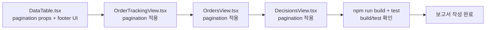

# Admin UI 리스트 Pagination — 최종 보고서

**작성일**: 2026-05-17  
**상태**: 구현 및 테스트 완료 ✅  
**관련 파일**:
- [`admin_ui/src/components/common/DataTable.tsx`](../admin_ui/src/components/common/DataTable.tsx)
- [`admin_ui/src/components/OrderTrackingView.tsx`](../admin_ui/src/components/OrderTrackingView.tsx)
- [`admin_ui/src/components/OrdersView.tsx`](../admin_ui/src/components/OrdersView.tsx)
- [`admin_ui/src/components/DecisionsView.tsx`](../admin_ui/src/components/DecisionsView.tsx)
- [`admin_ui/src/components/AgentRunsPanel.tsx`](../admin_ui/src/components/AgentRunsPanel.tsx)

---

## 1. 적용 대상 화면 목록

| 화면 | 컴포넌트 | 적용 여부 | 방식 |
|------|---------|:---------:|------|
| 주문추적 | [`OrderTrackingView.tsx`](../admin_ui/src/components/OrderTrackingView.tsx) | ✅ 적용 | DataTable 공통 pagination |
| 주문 | [`OrdersView.tsx`](../admin_ui/src/components/OrdersView.tsx) | ✅ 적용 | DataTable 공통 pagination |
| 의사결정 | [`DecisionsView.tsx`](../admin_ui/src/components/DecisionsView.tsx) | ✅ 적용 | DataTable 공통 pagination |
| 에이전트 실행 | [`AgentRunsPanel.tsx`](../admin_ui/src/components/AgentRunsPanel.tsx) | ❌ 제외 (skip) | — |

---

## 2. Pagination 적용 방식

### 2.1 DataTable 공통화

[`DataTable.tsx`](../admin_ui/src/components/common/DataTable.tsx)에 6개 optional pagination props 추가 (lines 22-28):

```typescript
interface DataTableProps<T> {
  // ── 기존 props (변경 없음) ──
  columns: Column<T>[];
  data: T[];
  idKey?: string;
  onRowClick?: (row: T) => void;
  selectedId?: string | number | null;
  isLoading?: boolean;
  emptyMessage?: string;
  compact?: boolean;

  // ── 신규 pagination props (optional) ──
  currentPage?: number;
  pageSize?: number;
  totalItems?: number;
  onPageChange?: (page: number) => void;
  onPageSizeChange?: (pageSize: number) => void;
  pageSizeOptions?: number[];
}
```

### 2.2 Client-side pagination

전체 데이터를 API에서 받아 프런트에서 `Array.slice()`로 페이징 처리. 각 View에서 다음 패턴 사용:

```typescript
const totalPages = Math.max(1, Math.ceil(filteredOrders.length / pageSize));
const safePage = Math.min(currentPage, totalPages);
const pagedOrders = useMemo(() => {
  return filteredOrders.slice((safePage - 1) * pageSize, safePage * pageSize);
}, [filteredOrders, safePage, pageSize]);
```

### 2.3 Footer UI

조건부 렌더링 (lines 92-95 in DataTable.tsx):

```typescript
const showPagination =
  currentPage !== undefined &&
  totalItems !== undefined &&
  onPageChange !== undefined;
```

- **좌측**: "총 N건" 텍스트 (`text-xs text-[#94a3b8]`)
- **우측**: `< Prev | 1 2 3 ... N | Next >` + page-size selector

```
┌─────────────────────────────────────────────────┐
│  ┌───────────┬──────────┬──────────┬──────────┐ │
│  │ Header 1  │ Header 2 │ Header 3 │ Header 4 │ │
│  ├───────────┼──────────┼──────────┼──────────┤ │
│  │   ...     │   ...    │   ...    │   ...    │ │
│  └───────────┴──────────┴──────────┴──────────┘ │
│                                                   │
│  ┌─────────────────────────────────────────────┐ │
│  │ 총 N건          ◀ 1 2 3 ... N ▶  [20건씩▼] │ │
│  └─────────────────────────────────────────────┘ │
└─────────────────────────────────────────────────┘
```

### 2.4 safePage 로직

`Math.min(currentPage, totalPages)`로 범위 초과 방지. 필터 변경 시 page 1로 reset하지만, page-size 변경이나 데이터 변경에서도 안전하게 동작.

### 2.5 Ellipsis

[`getPageNumbers()`](../admin_ui/src/components/common/DataTable.tsx:32) 헬퍼 사용 — 7페이지 초과 시 중간 생략:

| currentPage | 표시 |
|:---:|---|
| 1 | `1 2 3 ... 20` |
| 3 | `1 2 3 4 ... 20` |
| 10 | `1 ... 9 10 11 ... 20` |
| 20 | `1 ... 18 19 20` |

---

## 3. Page Size 정책

| 항목 | 값 |
|------|:---:|
| 기본 page size | **20** (`pageSize` prop 기본값) |
| 선택 옵션 | **10 / 20 / 50** (`pageSizeOptions` 기본값) |
| 5개 옵션 | ❌ 제거 |
| page-size 변경 시 | page 1로 reset (`onPageSizeChange`에서 `setCurrentPage(1)`) |

---

## 4. Filter/Search 변경 시 Page Reset 정책

| 변경 트리거 | 동작 | 구현 위치 |
|-----------|:----:|----------|
| 검색어(search term) 변경 | `setCurrentPage(1)` | 각 View의 `onSearchChange` 핸들러 |
| status 필터 변경 | `setCurrentPage(1)` | 각 View의 `onChange` 핸들러 |
| side 필터 변경 | `setCurrentPage(1)` | 각 View의 `onChange` 핸들러 |
| clear all | `setCurrentPage(1)` | 각 View의 `onClearAll` 핸들러 |
| page-size 변경 | `setCurrentPage(1)` | `onPageSizeChange` 콜백 |

---

## 5. AgentRuns 화면 판단 결과

```
판단: Pagination 불필요 (skip)
근거:
- 단일 decision_context_id 기준 3~10건만 조회
- DataTable 미사용 (커스텀 카드 레이아웃)
- 운영 패턴상 최근 실행을 한눈에 보는 것이 UX에 유리
- 향후 전체 agent run 목록 화면(독립 페이지) 추가 시 pagination 도입 검토
```

[`AgentRunsPanel.tsx`](../admin_ui/src/components/AgentRunsPanel.tsx)는 카드 기반 레이아웃이며 DataTable을 import하지 않음. 데이터 규모가 작고(3~10건) 확장성이 필요하지 않으므로 변경 없음.

---

## 6. 변경 파일 목록

| 파일 | 변경 유형 | 설명 |
|------|:--------:|------|
| [`admin_ui/src/components/common/DataTable.tsx`](../admin_ui/src/components/common/DataTable.tsx) | 수정 | Pagination props + footer UI + `getPageNumbers` helper 추가 |
| [`admin_ui/src/components/OrderTrackingView.tsx`](../admin_ui/src/components/OrderTrackingView.tsx) | 수정 | `currentPage`/`pageSize` state, `pagedOrders` slice, filter reset, pagination props 전달 |
| [`admin_ui/src/components/OrdersView.tsx`](../admin_ui/src/components/OrdersView.tsx) | 수정 | 동일 패턴 |
| [`admin_ui/src/components/DecisionsView.tsx`](../admin_ui/src/components/DecisionsView.tsx) | 수정 | 동일 패턴 |
| [`admin_ui/src/components/AgentRunsPanel.tsx`](../admin_ui/src/components/AgentRunsPanel.tsx) | **변경 없음** | Skip |

### 각 View별 변경 상세

#### OrderTrackingView.tsx (lines 157-158, 220-224, 259/275/287/293, 304-308)
- `useState` 2개 추가: `currentPage` (기본 1), `pageSize` (기본 20)
- `filteredOrders` → `pagedOrders` slice (`useMemo` + `safePage`)
- Filter 핸들러: `setSearch`, `setStatusFilter`, `setSideFilter` 호출 시 `setCurrentPage(1)` 포함
- `DataTable`에 `currentPage`, `pageSize`, `totalItems`, `onPageChange`, `onPageSizeChange` props 전달

#### OrdersView.tsx (lines 23-24, 61-65, 122/142/152/159, 167-171)
- 동일 패턴 적용
- `onClearAll`에서 `setCurrentPage(1)` 포함

#### DecisionsView.tsx (lines 58-59, 112-116, 196/207/213, 221-225)
- 동일 패턴 적용
- `onClearAll`에서 `setCurrentPage(1)` 포함

---

## 7. 테스트 결과

- **16개 테스트 파일, 215개 테스트 전부 통과** ✅
- `cd admin_ui && npx vitest run` 실행 결과

### 신규 pagination 테스트 항목 (components.test.tsx)

| 테스트 | 설명 |
|--------|------|
| DataTable pagination footer 렌더링 | Pagination props 제공 시 footer 표시 확인 |
| Page-size selector 옵션 10/20/50만 존재 | 5 없음 확인 |
| Page-size 기본값 20 | `pageSize` prop 생략 시 20건씩 보기 |
| 현재 page 행만 렌더링 | 42개 데이터 중 20개만 표시 확인 |
| Prev/Next 버튼 disabled | 첫 페이지 Prev disabled, 마지막 페이지 Next disabled |
| Page navigation click | 페이지 번호 클릭 시 `onPageChange` 호출 |
| Page size 변경 callback | `onPageSizeChange` 호출 및 값 확인 |
| 페이지 번호 버튼 렌더링 | 42건/20건씩 = 3페이지 버튼 표시 확인 |
| Pagination 미제공 시 footer 미표시 | 기존 동작 유지 확인 |

### View별 pagination footer 표시 확인

| 테스트 파일 | 테스트 항목 |
|-------------|-------------|
| [`orderTrackingView.test.tsx`](../admin_ui/src/__tests__/orderTrackingView.test.tsx) | Scenario 9: Pagination footer 표시 |
| [`orders.test.tsx`](../admin_ui/src/__tests__/orders.test.tsx) | Scenario 10: Pagination footer 표시 |
| [`decisions.test.tsx`](../admin_ui/src/__tests__/decisions.test.tsx) | Scenario 10: Pagination footer 표시 |

---

## 8. Build 결과

```bash
cd admin_ui && npm run build
```

```text
> admin-ui@0.0.0 build
> tsc -b && vite build

vite v6.0.6 building for production...
✓ 57 modules transformed.
dist/index.html                  0.46 kB │ gzip:  0.31 kB
dist/assets/index-CLa6BmYk.css  24.59 kB │ gzip:  6.59 kB
dist/assets/index-DPL8UDzK.js   422.67 kB │ gzip: 125.04 kB
```

- `tsc -b` ✅ TypeScript 컴파일 성공
- `vite build` ✅ 422.67 kB production build 완료

---

## 9. 남은 Follow-up

| 항목 | 설명 | 우선순위 |
|------|------|:--------:|
| **Server-side pagination** | 데이터가 수만 건 이상 증가하면 API 레벨 pagination 도입 필요. 현재는 전체 데이터를 가져와 client-side에서 slice. | Low (현재 규모에서 불필요) |
| **AgentRuns 독립 페이지** | 향후 전체 agent run 목록 화면 추가 시 pagination 검토. 현재는 [`AgentRunsPanel.tsx`](../admin_ui/src/components/AgentRunsPanel.tsx)가 decision_context_id 기준으로만 조회. | Medium |
| **/trade-decisions API limit** | 현재 [`getTradeDecisions()`](../admin_ui/src/api/client.ts)가 `list_all()`로 전체 레코드 반환. limit/offset 파라미터 추가 검토. | Low |

---

## 부록: 구현 순서 요약



1. [`DataTable.tsx`](../admin_ui/src/components/common/DataTable.tsx) — Pagination UI 구현 (props 기반, `getPageNumbers` helper)
2. [`OrderTrackingView.tsx`](../admin_ui/src/components/OrderTrackingView.tsx) — 1차 적용 (가장 복잡한 화면)
3. [`OrdersView.tsx`](../admin_ui/src/components/OrdersView.tsx) — 동일 패턴 적용
4. [`DecisionsView.tsx`](../admin_ui/src/components/DecisionsView.tsx) — 동일 패턴 적용
5. `cd admin_ui && npm run build && npx vitest run` — Build + 테스트 확인
6. 보고서 작성 완료 ✅
