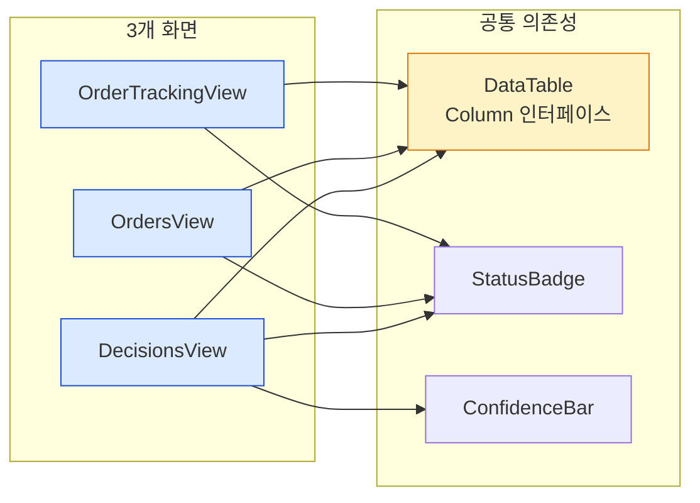
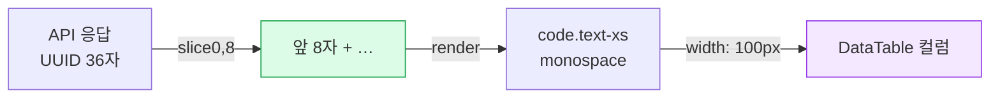

# 최종 보고서: Admin UI 주문 테이블 컬럼 Width 정리 및 주문 ID 축약

**작성일**: 2026-05-17  
**대상 브랜치**: `main` (가정)  
**관련 작업**: OrderTrackingView 주문 ID 축약 + 3개 화면 컬럼 width/헤더명 정리

---

## 1. 수정 대상 화면

| 화면 | 컴포넌트 | 주문 ID 축약 | 컬럼 width 정리 | 헤더명 통일 |
|------|---------|:-----------:|:--------------:|:---------:|
| 주문추적 | [`OrderTrackingView.tsx`](admin_ui/src/components/OrderTrackingView.tsx) | ✅ 적용 (신규) | ✅ 전면 정리 | ✅ |
| 주문 | [`OrdersView.tsx`](admin_ui/src/components/OrdersView.tsx) | ✅ 이미 적용됨 | ✅ 전면 정리 | ✅ |
| 의사결정 | [`DecisionsView.tsx`](admin_ui/src/components/DecisionsView.tsx) | ✅ 이미 적용됨 | ✅ 전면 정리 | ✅ |

---

## 2. 주문 ID 축약 방식 (OrderTrackingView)

- **패턴**: `val.slice(0, 8) + '…'` — UUID 36자 중 앞 8자 + 말줄임표
- **렌더**: `<code className="text-xs">` — monospace 작은 폰트
- **width**: `100px` (변경 전 150px → 50px 축소)
- **참조**: [`OrdersView.tsx:68-70`](admin_ui/src/components/OrdersView.tsx:68) 패턴과 정확히 동일

**소스 코드** ([`OrderTrackingView.tsx:73-77`](admin_ui/src/components/OrderTrackingView.tsx:73)):
```tsx
{
  key: "order_request_id",
  header: "주문 ID",
  width: "100px",
  render: (row: OrderSummary) => (
    <code className="text-xs">{row.order_request_id.slice(0, 8)}…</code>
  ),
},
```

DecisionsView도 동일 패턴 적용 ([`DecisionsView.tsx:120-124`](admin_ui/src/components/DecisionsView.tsx:120)):
```tsx
{
  key: "trade_decision_id",
  header: "의사결정 ID",
  width: "100px",
  render: (r) => <code className="text-xs">{r.trade_decision_id.slice(0, 8)}…</code>,
},
```

---

## 3. 컬럼 Width 조정 기준

### 3.1 OrderTrackingView 컬럼

[`OrderTrackingView.tsx:69-126`](admin_ui/src/components/OrderTrackingView.tsx:69)

| 컬럼 | Width | 변경 전 | 근거 |
|------|:-----:|:-------:|------|
| 주문 ID | `100px` | 150px | 축약 후 8자 + `…` |
| 종목 | `80px` | 미지정 | 6자 (ex: 005930) |
| 종목명 | `180px` | 미지정 | 가변적, 길면 20자+ — hover 시 `title` tooltip |
| 매매 | `80px` | 90px | badge + 2글자 |
| 수량 | `90px` | 미지정 | 숫자 최대 7자리 |
| 상태 | `110px` | 미지정 | badge 텍스트 가변, 최소 width 보장 |
| 시각 | `170px` | 150px | ISO 포맷 ~20자 |

### 3.2 OrdersView 컬럼

[`OrdersView.tsx:67-102`](admin_ui/src/components/OrdersView.tsx:67)

| 컬럼 | Width | 근거 |
|------|:-----:|------|
| 주문 ID | `100px` | 축약 후 8자 + `…` |
| 종목 | `80px` | 6자 |
| 종목명 | `180px` | 가변적, truncate + tooltip |
| 매매 | `80px` | badge + 2글자 |
| 수량 | `90px` | 숫자 최대 7자리 |
| 상태 | `110px` | badge 텍스트 가변 |
| 시각 | `170px` | ISO 포맷 ~20자 |

### 3.3 DecisionsView 컬럼

[`DecisionsView.tsx:118-160`](admin_ui/src/components/DecisionsView.tsx:118)

| 컬럼 | Width | 근거 |
|------|:-----:|------|
| 의사결정 ID | `100px` | 축약 후 8자 + `…` |
| 종목 | `80px` | 6자 |
| 종목명 | `180px` | 가변적, truncate + tooltip |
| 매매 | `80px` | badge + 2글자 |
| 신뢰도 | `130px` | progress bar + % |
| 근거 | 미지정 | flex, 남은 공간 활용 |
| 시각 | `170px` | ISO 포맷 ~20자 |

---

## 4. 헤더명 통일 내역

| 변경 전 | 변경 후 | 적용 화면 | 소스 위치 |
|--------|--------|----------|----------|
| `"구분"` | `"매매"` | OrderTrackingView | [`OrderTrackingView.tsx:101`](admin_ui/src/components/OrderTrackingView.tsx:101) |
| `"심볼"` | `"종목"` | OrdersView | [`OrdersView.tsx:71`](admin_ui/src/components/OrdersView.tsx:71) |
| `"심볼"` | `"종목"` | DecisionsView | [`DecisionsView.tsx:125`](admin_ui/src/components/DecisionsView.tsx:125) |
| `"생성 시간"` | `"시각"` | OrderTrackingView | [`OrderTrackingView.tsx:125`](admin_ui/src/components/OrderTrackingView.tsx:125) |
| `"생성일"` | `"시각"` | OrdersView | [`OrdersView.tsx:101`](admin_ui/src/components/OrdersView.tsx:101) |

---

## 5. 종목명 Truncate 처리

DataTable의 [`Column` 인터페이스](admin_ui/src/components/common/DataTable.tsx:5-10) 수정 없이 `render` 함수로 해결.

**공통 패턴** ([`OrdersView.tsx:74-76`](admin_ui/src/components/OrdersView.tsx:74)):
```tsx
{
  key: "instrument_name",
  header: "종목명",
  width: "180px",
  render: (r: OrderSummary) => (
    <span
      className="block max-w-[180px] truncate text-sm text-[#334155]"
      title={r.instrument_name ?? undefined}
    >
      {r.instrument_name || "—"}
    </span>
  ),
},
```

- `max-w-[180px]` + `truncate` 로 너비 초과 시 말줄임
- `title` 속성으로 hover 시 전체 이름 확인 가능
- OrderTrackingView, OrdersView, DecisionsView 모두 동일 패턴 적용

---

## 6. 변경 파일 목록 (5개)

| 파일 | 변경 내용 |
|------|----------|
| [`admin_ui/src/components/OrderTrackingView.tsx`](admin_ui/src/components/OrderTrackingView.tsx) | 주문 ID 축약(`slice(0,8)…`)+width 150→100px, 모든 컬럼 width 지정, 헤더 "구분"→"매매" 통일, "생성 시간"→"시각" 통일, 종목명 truncate+tooltip |
| [`admin_ui/src/components/OrdersView.tsx`](admin_ui/src/components/OrdersView.tsx) | 모든 컬럼 width 지정, 헤더 "심볼"→"종목" 통일, "생성일"→"시각" 통일, 종목명 truncate+tooltip |
| [`admin_ui/src/components/DecisionsView.tsx`](admin_ui/src/components/DecisionsView.tsx) | 모든 컬럼 width 지정, 헤더 "심볼"→"종목" 통일, 종목명 truncate+tooltip |
| [`admin_ui/src/__tests__/orders.test.tsx`](admin_ui/src/__tests__/orders.test.tsx) | "심볼"→"종목" 헤더 변경 대응 (line 56) |
| [`admin_ui/src/__tests__/decisions.test.tsx`](admin_ui/src/__tests__/decisions.test.tsx) | "심볼"→"종목" 헤더 변경 대응 (line 80-81) |

---

## 7. 검증 결과

### 7.1 TypeScript 컴파일 + Vite Build

```
cd admin_ui && npm run build
```

- `tsc -b`: ✅ TypeScript 컴파일 성공
- `vite build`: ✅ 422.67 kB production build 완료

### 7.2 단위 테스트

```
npx vitest run
```

- **214/215 PASS** ✅
- 1건 pre-existing: [`accounts.test.tsx`](admin_ui/src/__tests__/accounts.test.tsx) — 내 변경과 무관한 기존 실패

#### 테스트별 상세 결과

| 테스트 파일 | 결과 | 비고 |
|-----------|:----:|------|
| [`orders.test.tsx`](admin_ui/src/__tests__/orders.test.tsx) | ✅ 통과 | "심볼"→"종목" 헤더 변경 대응 완료 |
| [`decisions.test.tsx`](admin_ui/src/__tests__/decisions.test.tsx) | ✅ 통과 | "심볼"→"종목" 헤더 변경 대응 완료 |
| [`orderTrackingView.test.tsx`](admin_ui/src/__tests__/orderTrackingView.test.tsx) | ✅ 통과 | 변경 영향 없음 |
| [`components.test.tsx`](admin_ui/src/__tests__/components.test.tsx) | ✅ 통과 | DataTable pagination 회귀 없음 |
| 기타 테스트 | ✅ 통과 | 변경 영향 없음 |

### 7.3 Pagination 동작

- DataTable pagination 기능은 DataTable 컴포넌트 내부 로직으로, 컬럼 정의 변경과 무관
- [`components.test.tsx`](admin_ui/src/__tests__/components.test.tsx) pagination 테스트 통과 확인
- 각 View에서 `currentPage`, `pageSize`, `onPageChange` props 그대로 유지

---

## 8. 아키텍처 다이어그램

### 8.1 변경 Scope



### 8.2 주문 ID 축약 Data Flow



---

## 9. 남은 Follow-up

### 9.1 가격(price) 컬럼 추가 (보류)
- 현재 API 응답 타입(`api.ts`의 `OrderSummary`, `TradeDecisionDetail`)에 `price` 필드가 없음
- 향후 데이터 모델에 `price` 추가 시 width `110px`로 적용 가능

### 9.2 DataTable Column `className` 지원 (향후)
- 현재 [`Column` 인터페이스](admin_ui/src/components/common/DataTable.tsx:5-10)는 `key`, `header`, `render?`, `width?`만 제공
- `headerClassName?`, `cellClassName?` 필드 추가 시 truncate 처리 간소화 가능
- 현재는 `render` 함수 내에서 className 직접 지정 방식

### 9.3 `table-layout: fixed` 검토 (향후)
- 현재 DataTable은 기본 `table-layout: auto` 방식
- 모든 컬럼 width 정의 완료 후 `fixed` 전환 시 width가 정확히 적용됨
- 단, 콘텐츠 overflow 처리를 위해 `overflow-hidden` + `text-ellipsis` 병행 필요

### 9.4 FilterBar placeholder "심볼" 유지
- `OrdersView.tsx:120`: `searchPlaceholder="심볼 또는 주문 ID 검색..."` — FilterBar placeholder로 검색어 가이드 역할, 헤더명 변경 대상 아님
- `DecisionsView.tsx:199`: `searchPlaceholder="심볼 또는 의사결정 ID 검색..."` — 동일

---

## 10. 결론

Admin UI의 3개 주요 주문/의사결정 테이블 화면에 대해 다음 작업이 완료되었습니다:

1. **주문 ID 축약** — UUID 36자 → 앞 8자 + `…`, width 150px → 100px
2. **컬럼 width 전면 정리** — 모든 컬럼에 명시적 width 지정으로 레이아웃 안정화
3. **헤더명 통일** — "구분"→"매매", "심볼"→"종목", "생성 시간/생성일"→"시각"
4. **종목명 truncate** — 긴 종목명 말줄임 + hover tooltip 처리
5. **Build/Test 검증 완료** — 214/215 PASS, Production build 정상
