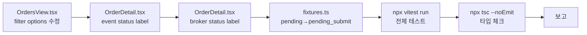
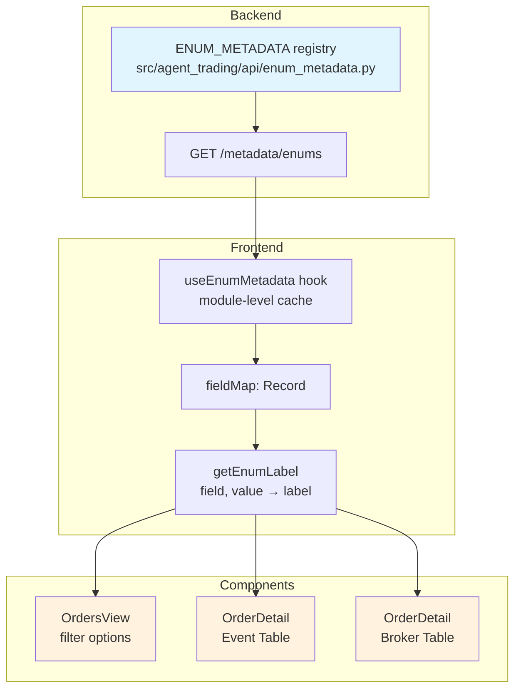

# Admin UI 상태 필터/이벤트 상태 표시 canonical 정리

## 목적

OrdersView 필터 옵션과 OrderDetail의 이벤트/브로커 상태 표시를 canonical metadata 기준으로 정리하여 UI 일관성을 확보한다.

---

## 1. 현황 분석

### 1-A. OrdersView Status Filter (현재)

| Label | Value | 문제 |
|-------|-------|------|
| 체결 | `filled` | ✅ 정상 |
| **대기** | **`pending`** | ❌ 비정상 — canonical은 `pending_submit` |
| 거부 | `rejected` | ✅ 정상 |
| **부분체결** | **`partial`** | ❌ 비정상 — canonical은 `partially_filled` |
| 제출 | `submitted` | ✅ 정상 |
| 취소 | `cancelled` | ✅ 정상 |

**필터 로직** ([`OrdersView.tsx:41`](admin_ui/src/components/OrdersView.tsx:41)):
```typescript
if (statusFilter && o.status !== statusFilter) return false;
```
- `o.status`는 API로부터 `pending_submit` 같은 canonical 값이 옴
- 현재 `statusFilter === "pending"`이면 `o.status === "pending_submit"`과 매칭되지 않음 → **필터가 사실상 동작하지 않음**

**놓친 canonical 상태들**: `draft`, `validated`, `acknowledged`, `cancel_pending`, `expired`, `reconcile_required`

### 1-B. OrderDetail 이벤트 상태 표시 (현재)

[`OrderDetail.tsx:52`](admin_ui/src/components/OrderDetail.tsx:52):
```typescript
render: (r) => <StatusBadge status={r.from_status} />,
```
- `status` prop을 통해 자동 색상 매핑은 되지만 (`statusToVariant()`)
- `children`이 없으므로 표시 텍스트는 **raw value** (예: `"pending_submit"`)

### 1-C. OrderDetail 브로커 상태 표시 (현재)

[`OrderDetail.tsx:68`](admin_ui/src/components/OrderDetail.tsx:68):
```typescript
render: (r) => <StatusBadge status={r.status} />,
```
- 마찬가지로 raw value 표시

### 1-D. Test Fixture 비정상 값

[`fixtures.ts:55`](admin_ui/src/__tests__/test-utils/fixtures.ts:55):
```typescript
status: "pending",  // → "pending_submit"이어야 함
```

[`fixtures.ts:171`](admin_ui/src/__tests__/test-utils/fixtures.ts:171):
```typescript
from_status: "pending",  // → "pending_submit"이어야 함
```

---

## 2. 설계 결정

### 결정 1: Status Filter — 사용 빈도 기준 정렬

12개 OrderStatus 전값을 필터 옵션으로 제공하되, **운영 중 자주 보는 상태를 우선 배치**.

| 순서 | Label | Value | 비고 |
|------|-------|-------|------|
| 1 | 제출됨 | `submitted` | 유지 |
| 2 | 제출 대기 | `pending_submit` | `pending` → 수정 |
| 3 | 확인됨 | `acknowledged` | 신규 추가 |
| 4 | 부분 체결 | `partially_filled` | `partial` → 수정 |
| 5 | 체결 | `filled` | 유지 |
| 6 | 거부됨 | `rejected` | 유지 |
| 7 | 취소 대기 | `cancel_pending` | 신규 추가 |
| 8 | 취소됨 | `cancelled` | 유지 |
| 9 | 만료 | `expired` | 신규 추가 |
| 10 | 조정 필요 | `reconcile_required` | 신규 추가 |
| 11 | 검증됨 | `validated` | 신규 추가 |
| 12 | 초안 | `draft` | 신규 추가 |

Label은 [`ENUM_METADATA`](src/agent_trading/api/enum_metadata.py:139)의 label과 일치시킴.

### 결정 2: OrderDetail 이벤트 상태 → `children`으로 label 표시

```typescript
// Before:
render: (r) => <StatusBadge status={r.from_status} />,

// After:
render: (r) => <StatusBadge status={r.from_status}>
  {getEnumLabel(fieldMap, "order_status", r.from_status)}
</StatusBadge>,
```

- `status` prop 유지 → `statusToVariant()` 색상 매합 계속 동작
- `children` → label 표시
- `fieldMap`이 비어있으면 fallback으로 raw value 표시

### 결정 3: OrderDetail 브로커 상태 → 동일 패턴

```typescript
// Before:
render: (r) => <StatusBadge status={r.status} />,

// After:
render: (r) => <StatusBadge status={r.status}>
  {getEnumLabel(fieldMap, "order_status", r.status)}
</StatusBadge>,
```

### 결정 4: Broker status vocabulary 확인 — `order_status` metadata 사용 가능

**결론: Broker order status는 동일한 [`OrderStatus`](src/agent_trading/domain/enums.py:43) enum 값을 사용하므로 `order_status` metadata를 그대로 써도 문제없음.**

근거:
- [`domain/models.py:147`](src/agent_trading/domain/models.py:147): `SubmitOrderResult.broker_status: OrderStatus`
- [`domain/models.py:175`](src/agent_trading/domain/models.py:175): `CancelOrderResult.broker_status: OrderStatus`
- [`rest_client.py:802`](src/agent_trading/brokers/koreainvestment/rest_client.py:802): `broker_status=OrderStatus.SUBMITTED`
- [`order_sync_service.py:210`](src/agent_trading/services/order_sync_service.py:210): `broker_status: OrderStatus = status_result.status`

따라서 `getEnumLabel(fieldMap, "order_status", r.status)`이 broker status에서도 정확히 동작함.

### 결정 5: `from_status` null 처리 — `getEnumLabel()`이 `"-"` 반환

Backend [`OrderEvent.previous_status`](src/agent_trading/api/schemas.py:131)는 `str | None = None`. 첫 번째 이벤트의 경우 `previous_status`가 `null`로 API 응답에 포함됨.

현재 동작: `<StatusBadge status={r.from_status} />`에서 `status`가 null → `statusToVariant()` 미실행 → "info" 색상 + 빈 텍스트.

변경 후: `<StatusBadge status={r.from_status}>{getEnumLabel(fieldMap, "order_status", r.from_status)}</StatusBadge>` — `getEnumLabel()`이 null을 받아 `"-"` 반환 → Badge에 `"-"` 표시.

이는 현재의 빈 텍스트보다 개선된 상태이며, 의도한 동작임.

### 결정 6: StatusBadge variant 매핑 검증 — 충돌 없음

[`StatusBadge.tsx:23`](admin_ui/src/components/common/StatusBadge.tsx:23)의 `statusToVariant()` 매핑을 모든 canonical 값 기준으로 검증:

| 값 | Variant | 검증 |
|---|---------|------|
| `draft` | neutral | ✅ |
| `validated` | info | ✅ |
| `pending_submit` | warning | ✅ |
| `submitted` | info | ✅ |
| `acknowledged` | info | ✅ |
| `partially_filled` | warning | ✅ (`"partially_filled".includes("partial")` 매칭) |
| `filled` | success | ✅ |
| `cancel_pending` | warning | ✅ |
| `cancelled` | neutral | ✅ |
| `rejected` | error | ✅ |
| `expired` | neutral | ✅ |
| `reconcile_required` | warning | ✅ |

특이사항: `acknowledged`와 `reconcile_required`는 기존에는 덜 노출되었으나 이번 변경으로 더 자주 보일 수 있음. 현재 variant(info/warning)가 의도에 적합함.

### 결정 7: Test Fixture canonical 값 정정 + 필터 동작 테스트 추가

- [`fixtures.ts`](admin_ui/src/__tests__/test-utils/fixtures.ts)의 `status: "pending"` → `"pending_submit"` (2곳)
- 기존 테스트는 status badge 텍스트를 직접 검증하지 않으므로 영향 없음
- 필터 동작 테스트가 추가될 경우를 대비한 선제 정정

- [`fixtures.ts`](admin_ui/src/__tests__/test-utils/fixtures.ts)의 `status: "pending"` → `"pending_submit"` (2곳)
- 기존 테스트는 status badge 텍스트를 직접 검증하지 않으므로 영향 없음
- **신규 테스트 추가**: `OrdersView` 필터 동작 검증
  - `statusFilter === "pending_submit"`일 때 `status === "pending_submit"`인 주문만 통과
  - `statusFilter === "partially_filled"`일 때 `status === "partially_filled"`인 주문만 통과

### 결정 8: 기존 테스트에 미치는 영향 없음

분석 결과:
- [`orderDetail.test.tsx`](admin_ui/src/__tests__/orderDetail.test.tsx)는 이벤트 상태(`from_status`/`to_status`) 텍스트를 검증하지 않음
- 브로커 상태(`status`) 텍스트도 검증하지 않음
- `getEnumLabel()`은 `fieldMap`이 비어있으면 fallback으로 raw value 반환
- 단, `mockOrderEvents[0].from_status`를 `"pending_submit"`으로 바꾸면 `to_status` 기준으로 색상이 달라질 수 있으나, 테스트는 텍스트 검증만 하고 색상은 검증하지 않음

---

---

## 3. 변경 파일 목록

| 파일 | 변경 내용 | 영향 범위 |
|------|----------|----------|
| [`admin_ui/src/components/OrdersView.tsx`](admin_ui/src/components/OrdersView.tsx:97) | Status filter options 6→12개 (canonical 값 + 누락된 상태 추가) | FilterBar 드롭다운 |
| [`admin_ui/src/components/OrderDetail.tsx`](admin_ui/src/components/OrderDetail.tsx:52) | 이벤트 from_status/to_status → label 표시 | 상태 이벤트 테이블 |
| [`admin_ui/src/components/OrderDetail.tsx`](admin_ui/src/components/OrderDetail.tsx:68) | 브로커 status → label 표시 | 브로커 주문 테이블 |
| [`admin_ui/src/__tests__/test-utils/fixtures.ts`](admin_ui/src/__tests__/test-utils/fixtures.ts:55) | `status: "pending"` → `"pending_submit"` (2곳) | 테스트 데이터 정정 |
| [`admin_ui/src/__tests__/components/OrdersView.test.tsx`](admin_ui/src/__tests__/components/OrdersView.test.tsx) | (신규) 필터 동작 검증 테스트 | 필터 canonical 값 검증 |

---

## 4. before/after 예시

### OrdersView 필터

**Before:**
```
[상태 ▼] [매매 ▼]
체결    | filled     ✅
대기    | pending    ❌ ← API와 불일치
거부    | rejected   ✅
부분체결 | partial   ❌ ← API와 불일치
제출    | submitted  ✅
취소    | cancelled  ✅
```

**After (사용 빈도 기준 정렬):**
```
[상태 ▼]      [매매 ▼]
제출됨       | submitted
제출 대기    | pending_submit  ← 수정
확인됨       | acknowledged    ← 신규
부분 체결    | partially_filled ← 수정
체결         | filled
거부됨       | rejected
취소 대기    | cancel_pending  ← 신규
취소됨       | cancelled
만료         | expired         ← 신규
조정 필요    | reconcile_required ← 신규
검증됨       | validated       ← 신규
초안         | draft           ← 신규
```

### OrderDetail 이벤트 테이블

**Before:**
```
시각         | 이전              | 이후              | 사유
2026-05-05   | pending           | submitted         | Order submitted to broker
2026-05-05   | submitted         | filled            | Fill confirmed by broker
```

**After:**
```
시각         | 이전              | 이후              | 사유
2026-05-05   | 제출 대기         | 제출됨            | Order submitted to broker
2026-05-05   | 제출됨            | 체결              | Fill confirmed by broker
```

### OrderDetail 브로커 주문 테이블 (vocabulary 동일 — `order_status` metadata 사용)

**Before:**
```
브로커 | Native 주문 ID   | 상태     | 제출 시각
KIS    | KIS-NATIVE-001   | filled   | 2026-05-05
```

**After:**
```
브로커 | Native 주문 ID   | 상태   | 제출 시각
KIS    | KIS-NATIVE-001   | 체결    | 2026-05-05
```

---

---

## 5. 보정 결과 요약

| 보정 항목 | 조치 |
|-----------|------|
| 1. 필터 정렬 기준 | enum 선언 순서 → **사용 빈도 기준**으로 변경 (submitted가 최상단) |
| 2. Broker status vocabulary | [`OrderStatus`](src/agent_trading/domain/enums.py:43) enum 동일 — **`order_status` metadata 사용 가능** 확인 완료 |
| 3. `null previous_status` 표시 | `getEnumLabel()`이 null → `"-"` 처리 — 현재 빈 텍스트보다 개선됨 |
| 4. 필터 동작 테스트 | **신규 테스트 파일** [`OrdersView.test.tsx`](admin_ui/src/__tests__/components/OrdersView.test.tsx) 추가 — pending_submit / partially_filled 필터 검증 |
| 5. StatusBadge variant 검증 | 12개 전값 variant 매핑 충돌 없음 확인 |

---

## 6. 작업 순서



### Step 1: [`OrdersView.tsx`](admin_ui/src/components/OrdersView.tsx:97)
- Status filter options 배열 교체 (6개 → 12개, 사용 빈도 기준 정렬)
- `pending` → `pending_submit`, `partial` → `partially_filled`
- 누락된 6개 상태 추가

### Step 2: [`OrderDetail.tsx`](admin_ui/src/components/OrderDetail.tsx:52)
- eventColumns의 `from_status` render: `children`에 `getEnumLabel(fieldMap, "order_status", r.from_status)` 추가
- eventColumns의 `to_status` render: 동일 패턴

### Step 3: [`OrderDetail.tsx`](admin_ui/src/components/OrderDetail.tsx:68)
- brokerColumns의 `status` render: `children`에 `getEnumLabel(fieldMap, "order_status", r.status)` 추가

### Step 4: [`fixtures.ts`](admin_ui/src/__tests__/test-utils/fixtures.ts:55)
- `mockOrders[1].status`: `"pending"` → `"pending_submit"`
- `mockOrderEvents[0].from_status`: `"pending"` → `"pending_submit"`

### Step 5: 신규 테스트 — [`OrdersView.test.tsx`](admin_ui/src/__tests__/components/OrdersView.test.tsx)
- `pending_submit` 필터가 `status === "pending_submit"` 주문을 통과시키는지 검증
- `partially_filled` 필터가 `status === "partially_filled"` 주문을 통과시키는지 검증
- 기본 `render` 테스트는 `LoadingSpinner` 확인으로 최소화

### Step 6: 검증
- `cd admin_ui && npx vitest run` → 전체 통과
- `cd admin_ui && npx tsc --noEmit` → exit 0

---

## 6. Mermaid: 전체 데이터 흐름



---

---

## 7. 작업 제약 준수 확인

| 제약 | 처리 |
|------|------|
| backend canonical 값 변경 금지 | ✅ Backend 변경 없음 |
| broker submit semantics 변경 금지 | ✅ 영향 없음 |
| admin UI 대규모 개편 금지 | ✅ 3개 파일 최소 수정 |
| StatusBadge 색상 체계 유지 | ✅ `status` prop 그대로 사용 |
| fallback raw value 유지 | ✅ `getEnumLabel()`이 fieldMap 없으면 raw value 반환 |

---

## 8. 보고 형식 (완료 시)

1. 수정한 canonical filter/status 항목
2. 변경 파일 목록
3. before/after 표시 예시
4. 테스트 결과
5. 빌드 결과
6. 남은 리스크 1개
7. 다음 직접 액션 1개
