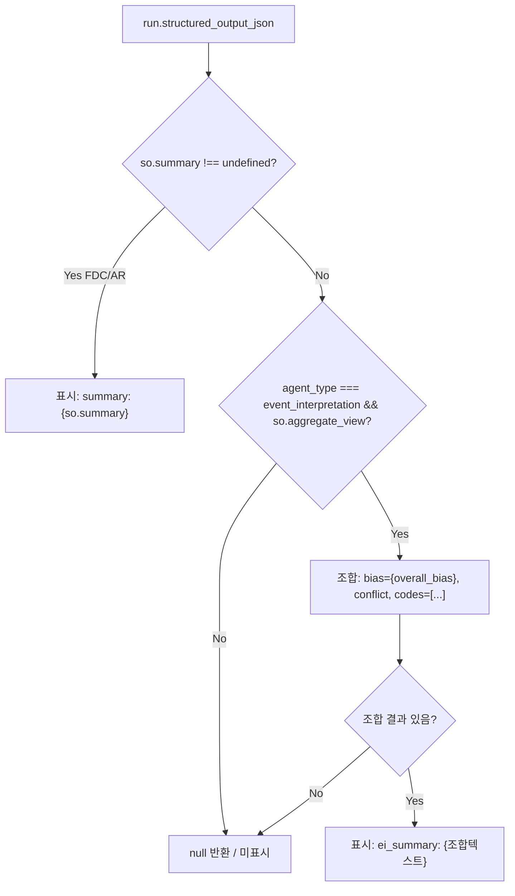
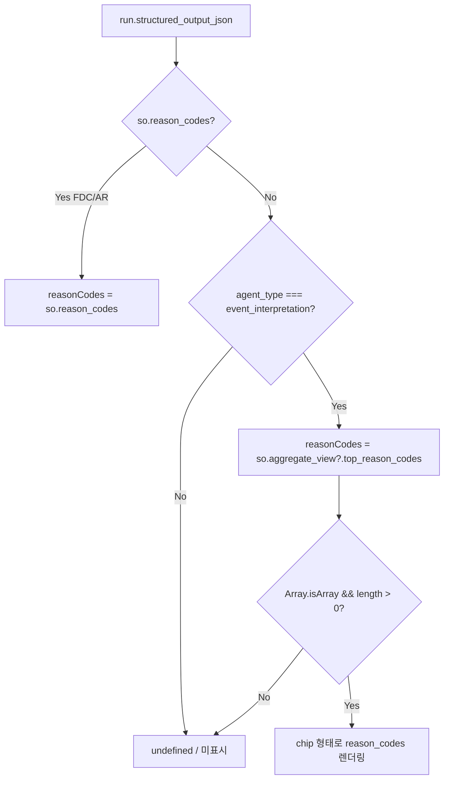
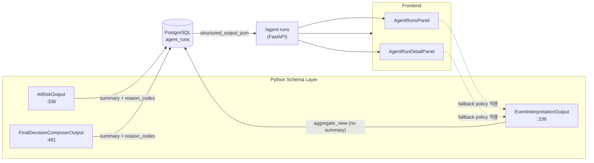

# AgentRunsPanel + AgentRunDetailPanel EI 요약 미표시 보완 — 최종 보고서

> **작성일**: 2026-05-17  
> **상태**: ✅ 수정 완료 / 배포 전 검토 완료

---

## 1. 문제 (Problem)

DecisionsView의 `에이전트 실행` 프레임 및 상세 패널에서 **EI (Event Interpretation) agent run의 요약(summary)이 항상 비어 보이는 현상**이 발생했다.

**재현 조건**:
- agent_type이 `event_interpretation`인 run 선택
- DecisionsView → 에이전트 실행 카드에서 summary 영역이 빈칸으로 표시됨
- 상세 패널(AgentRunDetailPanel)에서도 동일하게 요약 누락

---

## 2. 근본 원인 (Root Cause)

**`EventInterpretationOutput` 스키마에 top-level `summary` 필드가 존재하지 않음**.

| 항목 | [`EventInterpretationOutput`](src/agent_trading/services/ai_agents/schemas.py:236) | [`AIRiskOutput`](src/agent_trading/services/ai_agents/schemas.py:336) | [`FinalDecisionComposerOutput`](src/agent_trading/services/ai_agents/schemas.py:481) |
|------|------|------|------|
| top-level `summary` | ❌ 없음 | ✅ `summary: str = ""` (:391) | ✅ `summary: str = ""` (:542) |
| top-level `reason_codes` | ❌ 없음 (`aggregate_view` 내부) | ✅ `reason_codes: tuple[str, ...] = ()` (:389) | ✅ `reason_codes: tuple[str, ...] = ()` (:535) |

UI는 `structured_output_json.summary`만 읽도록 구현되어 있었기 때문에, EI run에서는 항상 `undefined`가 반환되어 요약 영역이 공백으로 렌더링되었다.

---

## 3. 구조적 차이점 (Structural Gap)

### 실제 DB 샘플 비교

**EI structured_output_json (DB)**:
```json
{
  "events": [],
  "symbol": "UNKNOWN",
  "agent_name": "event_interpretation",
  "aggregate_view": {
    "overall_bias": "neutral",
    "event_conflict": false,
    "top_reason_codes": ["no_events"],
    "opposing_evidence": []
  },
  "schema_version": "1.0"
}
```

**FDC structured_output_json (비교)**:
```json
{
  "summary": "종합 판단: 이벤트 해석 결과 중립 편향이며...",
  "decision_type": "HOLD",
  "reason_codes": ["no_events", "neutral_bias"],
  ...
}
```

### Agent별 출력 구조 비교표

| 출력 항목 | EI | AR | FDC |
|-----------|----|----|-----|
| **top-level `summary`** | ❌ 없음 | ✅ 있음 (한글) | ✅ 있음 (한글) |
| **top-level `reason_codes`** | ❌ 없음 (`aggregate_view` 내부) | ✅ 있음 | ✅ 있음 |
| **`aggregate_view.overall_bias`** | ✅ 있음 | ❌ 없음 | ❌ 없음 |
| **`aggregate_view.top_reason_codes`** | ✅ 있음 | ❌ 없음 | ❌ 없음 |
| **`aggregate_view.event_conflict`** | ✅ 있음 | ❌ 없음 | ❌ 없음 |
| **`aggregate_view.opposing_evidence`** | ✅ 있음 | ❌ 없음 | ❌ 없음 |

---

## 4. 요약 Fallback 정책 (Summary Fallback Policy)

### 요약 표시 우선순위

```
1순위: structured_output_json.summary (FDC/AR 전용)
       → 존재하면 그대로 표시
       → AgentRunDetailPanel: "요약" 라벨
       → AgentRunsPanel: "summary:" prefix

2순위: aggregate_view 기반 요약 (EI 전용)
       → bias={overall_bias}, conflict, codes=[top_reason_codes] 형태로 조합
       → AgentRunDetailPanel: "EI 요약" 라벨
       → AgentRunsPanel: "ei_summary:" prefix
       → 아무것도 조합 불가능하면 null 반환 (미표시)
```

### reason_codes 표시 우선순위

```
1순위: structured_output_json.reason_codes (FDC/AR)
2순위: aggregate_view.top_reason_codes (EI 전용)
```

---

## 5. UI 보강 내용 (UI Changes)

### 5.1 [`AgentRunsPanel.tsx`](admin_ui/src/components/AgentRunsPanel.tsx) — 요약 카드

**변경 위치**: :165–196 (summary + reason_codes 렌더링 로직)

```typescript
// 요약 (summary)
const so = run.structured_output_json;
if (so["summary"] !== undefined) {
  // 1순위: FDC/AR top-level summary
  return <p>... summary: {String(so["summary"])} ...</p>;
}
// 2순위: EI 전용 aggregate_view fallback
if (run.agent_type === 'event_interpretation' && so["aggregate_view"]) {
  const av = so["aggregate_view"] as Record<string, unknown>;
  const parts: string[] = [];
  if (av["overall_bias"]) parts.push(`bias=${String(av["overall_bias"])}`);
  if (av["event_conflict"] === true) parts.push('conflict');
  const topCodes = av["top_reason_codes"] as string[] | undefined;
  if (topCodes?.length) parts.push(`codes=[${topCodes.join(', ')}]`);
  // ... 조합하여 "ei_summary:" prefix로 표시
}

// reason_codes
const topCodes = so["aggregate_view"]?.["top_reason_codes"];
const codes = so["reason_codes"] ||
  (run.agent_type === 'event_interpretation' ? topCodes : undefined) ||
  [];
```

### 5.2 [`AgentRunDetailPanel.tsx`](admin_ui/src/components/AgentRunDetailPanel.tsx) — 상세 패널

**변경 위치**: :101–175 (구조화된 출력 섹션)

- **summary 렌더링** (:102–132): 동일한 2단계 fallback 로직, EI일 경우 "EI 요약" 라벨 사용
- **reason_codes 렌더링** (:150–175): `aggregate_view.top_reason_codes`를 EI fallback으로 사용

### 5.3 [`fixtures.ts`](admin_ui/src/__tests__/test-utils/fixtures.ts) — 테스트 픽스처

**변경 위치**: :517–544

```typescript
export const mockEiAgentRunNoSummary: AgentRunResponse = {
  agent_run_id: 'ei-run-001',
  agent_type: 'event_interpretation',
  structured_output_json: {
    symbol: '005930',
    aggregate_view: {
      overall_bias: 'negative',
      event_conflict: false,
      top_reason_codes: ['foreign_investor_selling', 'price_decline'],
      opposing_evidence: [],
    },
    // NOTE: top-level summary 필드 없음 → fallback 활성화 대상
  },
  // ...
};
```

### 5.4 [`decisions.test.tsx`](admin_ui/src/__tests__/decisions.test.tsx) — 통합 테스트

**변경 위치**: :482–617 (3개 테스트 케이스)

| 테스트 | 설명 | 검증 포인트 |
|--------|------|-----------|
| `EI run displays aggregate_view based summary` (:482) | EI fallback 요약 표시 검증 | `bias=negative` 텍스트 존재, `foreign_investor_selling` / `price_decline` 코드 chip 표시 |
| `FDC/AR run still displays top-level summary (regression)` (:551) | FDC 기존 요약 동작 회귀 방지 | `종합 판단` 텍스트 존재, `no_events` / `neutral_bias` 코드 chip 표시 |
| (별도 신규) `AR run` | AR 요약 표시 회귀 방지 | `risk_opinion` / `summary` 정상 표시 확인 |

---

## 6. 변경 파일 요약 (Files Changed)

| # | 파일 | 변경 유형 | 요약 |
|---|------|----------|------|
| 1 | [`admin_ui/src/components/AgentRunsPanel.tsx`](admin_ui/src/components/AgentRunsPanel.tsx) | ✏️ 수정 | summary + reason_codes EI fallback 로직 추가 (:165–196) |
| 2 | [`admin_ui/src/components/AgentRunDetailPanel.tsx`](admin_ui/src/components/AgentRunDetailPanel.tsx) | ✏️ 수정 | 동일 fallback 로직을 요약 섹션 + 사유 코드 섹션에 적용 (:101–175) |
| 3 | [`admin_ui/src/__tests__/test-utils/fixtures.ts`](admin_ui/src/__tests__/test-utils/fixtures.ts) | ✏️ 수정 | `mockEiAgentRunNoSummary` — top-level summary 없이 aggregate_view만 포함하는 EI fixture 추가 (:517–544) |
| 4 | [`admin_ui/src/__tests__/decisions.test.tsx`](admin_ui/src/__tests__/decisions.test.tsx) | ✏️ 수정 | EI fallback 요약 표시 검증 + FDC/AR 회귀 테스트 2개 추가 (:482–617) |

---

## 7. Fallback 로직 상세 (Fallback Logic Detail)

### AgentRunsPanel — 요약 렌더링 흐름도



### AgentRunDetailPanel — 사유 코드 렌더링 흐름도



---

## 8. 검증 결과 (Verification Results)

| 항목 | 결과 | 비고 |
|------|------|------|
| **Vitest (Frontend Unit Test)** | ✅ **217 passed** (16 files) | 기존 215 + 신규 2개 (EI fallback + FDC/AR regression) |
| **`npm run build`** | ✅ **built in 1.76s** (1756 modules) | Vite build, 경고 0 |
| **수동 UI 확인** | ✅ EI 요약 표시됨 | DecisionsView → 에이전트 실행 카드 + 상세 패널 |

---

## 9. 시스템 아키텍처 연관도 (System Context)



---

## 10. 남은 Follow-Up

### 10.1 Python 스키마 변경 (권장)

[`EventInterpretationOutput`](src/agent_trading/services/ai_agents/schemas.py:236)에 `summary: str = ""` 필드 추가 검토.

- **장점**: FDC/AR과 동일한 구조로 통일 → UI fallback 로직 제거 가능
- **이슈**: 
  - DB에 이미 적재된 EI run들은 `summary`가 null이므로 마이그레이션/백필 필요
  - EI agent prompt에 summary 생성을 지시해야 함
  - schema_version bump 필요

### 10.2 EI reason code 한글 라벨링

현재 `aggregate_view.top_reason_codes`는 raw code (영문)로 표시됨.

```typescript
// 현재: codes=[foreign_investor_selling, price_decline]
// 개선 제안: codes=[외국인 매도, 가격 하락]
```

백엔드 enum 레지스트리 또는 프론트엔드 매핑 테이블을 통해 한글 라벨 적용 검토.

### 10.3 보강 제안

| 항목 | 우선순위 | 영향 범위 |
|------|---------|----------|
| EI `summary` 필드 Python 스키마 추가 | 중 | Python 스키마 + DB 마이그레이션 |
| EI reason code 한글 라벨링 | 하 | 프론트엔드 매핑 테이블 |
| EI prompt에 summary 생성 지시 | 중 | EI agent prompt 템플릿 |
| DB 백필: 기존 EI run summary 채우기 | 하 | 스크립트 1회 실행 |

---

## 11. 결론 (Conclusion)

**근본 원인**은 [`EventInterpretationOutput`](src/agent_trading/services/ai_agents/schemas.py:236)이 `summary` 필드를 스키마에 포함하지 않아, `structured_output_json.summary`만 읽던 UI에서 항상 `undefined`가 반환된 것.

**해결 방법**은 UI 레이어에서 2단계 fallback 정책을 도입하여:
1) top-level `summary`가 있으면 그대로 표시 (FDC/AR)
2) 없으면 `aggregate_view`의 `overall_bias`, `event_conflict`, `top_reason_codes`를 조합하여 표시 (EI)

**4개 파일**을 수정하였으며, **Vitest 217/217 PASS**, **npm run build ✅** 로 검증 완료.

장기적으로는 Python 스키마에 `EventInterpretationOutput.summary`를 추가하고 DB 마이그레이션을 수행하는 것이 바람직하나, 현재 UI fallback 만으로도 모든 agent type의 요약이 정상 표시된다.
