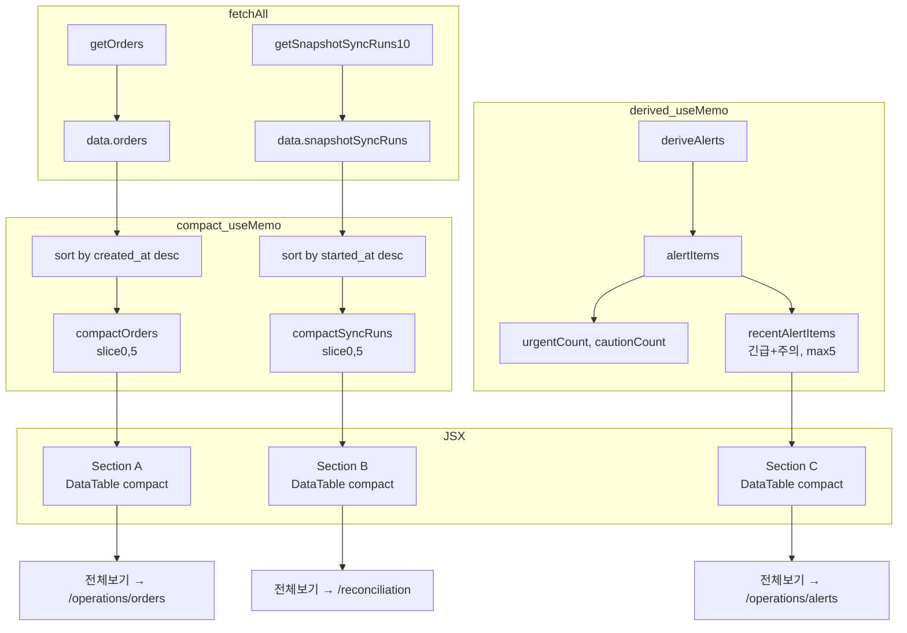

# 운영 대시보드 최근 요약 섹션 변경 계획 (v2)

## 목적

운영 대시보드 하단의 상세 테이블(Recent Events / Pending Reconciliations)을 완전히 숨기는 대신, 최근 주요 내역을 각 5개씩 **compact 요약 카드**로 표시한다. 전체 목록은 각 섹션의 "전체 보기" 링크를 통해 기존 상세 화면으로 이동한다.

---

## 변경 사항 요약

| 항목 | AS-IS | TO-BE |
|------|-------|-------|
| Feature flag (sections) | `SHOW_DASHBOARD_SECTIONS = false` | `SHOW_DASHBOARD_RECENT_SUMMARIES = true` |
| 기존 flag 처리 | 사용하지 않음 | 제거 or "legacy detailed sections" 주석 |
| 기존 useMemo | `recentEvents`, `pendingRecons` (사용 안 함) | 제거 or 주석 처리 (unused variable 오류 방지) |
| Section A | 최근 주문 타임라인 (10개, DataTable) → 숨김 | 최근 주문/제출 내역 (5개, compact, `created_at` 내림차순 정렬) |
| Section B | 미해결 정합성 상태 (DataTable) → 숨김 | 최근 스냅샷 동기화 (5개, compact, `started_at` 내림차순 정렬) |
| Section C | 없음 | 최근 운영 경고 (5개, 긴급+주의만, compact) |
| Derived return | `alertItems` 계산만 하고 미반환 | `recentAlertItems` (긴급+주의, max 5) 추가 반환 |

---

## Step-by-step 작업 항목

### Step 1: Feature flag 변경 및 기존 flag 정리

**파일:** [`admin_ui/src/components/OperationsDashboardView.tsx`](admin_ui/src/components/OperationsDashboardView.tsx:34)

```typescript
// AS-IS (라인 37-38)
const SHOW_DASHBOARD_SECTIONS = false;

// TO-BE
// SHOW_DASHBOARD_SECTIONS — legacy detailed sections (제거)
const SHOW_DASHBOARD_RECENT_SUMMARIES = true;
```

`SHOW_ADVANCED_OPERATION_CARDS = false`는 유지 (변경 없음).

---

### Step 2: 기존 useMemo 처리

**파일:** [`admin_ui/src/components/OperationsDashboardView.tsx`](admin_ui/src/components/OperationsDashboardView.tsx:388-410)

`recentEvents` / `pendingRecons` useMemo는 더 이상 사용하지 않으므로 **주석 처리**하여 unused variable TS 경고 방지.

```typescript
/* ── Deprecated: legacy detailed sections (feature flag 복원 시 사용)
const recentEvents: RecentEvent[] = useMemo(...)
const pendingRecons: PendingRecon[] = useMemo(...)
── */
```

---

### Step 3: 새 인터페이스 추가 (compact display용)

**파일:** [`admin_ui/src/components/OperationsDashboardView.tsx`](admin_ui/src/components/OperationsDashboardView.tsx:85)

기존 `RecentEvent` / `PendingRecon` 인터페이스는 주석 처리된 useMemo와 함께 유지.

```typescript
/* ── Compact Summary Types ── */
interface CompactOrderItem {
  id: string;
  createdAt: string;
  symbol: string;
  side: string;        // "매수" | "매도"
  quantity: number;
  status: string;      // 한글 상태 레이블
  statusVariant: "success" | "warning" | "error" | "info" | "neutral";
}

interface CompactSyncItem {
  id: string;
  startedAt: string;
  status: string;      // "정상" | "주의" | "긴급"
  statusVariant: "success" | "warning" | "error" | "neutral";
  totalAccounts: number;
  errorCount: number;
}

interface CompactAlertItem {
  id: string;
  level: "긴급" | "주의";
  levelVariant: "error" | "warning";
  title: string;
  description: string;
}
```

---

### Step 4: derived useMemo에서 `recentAlertItems` 반환 추가

**파일:** [`admin_ui/src/components/OperationsDashboardView.tsx`](admin_ui/src/components/OperationsDashboardView.tsx:366)

현재 `alertItems`는 계산만 하고 반환하지 않는다. Section C에서 사용하기 위해 **action-needed(긴급+주의)만 필터링 + 최대 5개**로 제한하여 반환한다.

```typescript
// 라인 366-368 (기존)
const alertItems = deriveAlerts(alertInput);
const urgentCount = alertItems.filter((a) => a.level === "긴급" && a.status === "OPEN").length;
const cautionCount = alertItems.filter((a) => a.level === "주의" && a.status === "OPEN").length;

// TO-BE: 라인 369 추가
const recentAlertItems: CompactAlertItem[] = alertItems
  .filter((a) => (a.level === "긴급" || a.level === "주의") && a.status === "OPEN")
  .slice(0, 5)
  .map((a) => ({
    id: a.id,
    level: a.level as "긴급" | "주의",
    levelVariant: a.level === "긴급" ? "error" as const : "warning" as const,
    title: a.title,
    description: a.description,
  }));
```

Return object (라인 370-385)에 `recentAlertItems` 추가:

```typescript
return {
  // ...기존 필드 모두 유지...
  urgentCount,
  cautionCount,
  recentAlertItems,  // ← 추가
};
```

---

### Step 5: Compact summary useMemo 추가

**파일:** [`admin_ui/src/components/OperationsDashboardView.tsx`](admin_ui/src/components/OperationsDashboardView.tsx:388)

#### Section A: `compactOrders` (created_at 내림차순 정렬 후 5개)

**보정사항 #1 반영:** API 반환 순서에 의존하지 않고 `created_at` 기준 내림차순 정렬 후 5개 선택.

```typescript
const compactOrders: CompactOrderItem[] = useMemo(() => {
  if (!data) return [];
  return [...data.orders]
    .sort((a, b) => new Date(b.created_at ?? 0).getTime() - new Date(a.created_at ?? 0).getTime())
    .slice(0, 5)
    .map((o) => {
      let sideLabel: string;
      switch (o.side) {
        case "buy": sideLabel = "매수"; break;
        case "sell": sideLabel = "매도"; break;
        default: sideLabel = o.side ?? "-";
      }
      let statusLabel: string;
      let statusVariant: "success" | "warning" | "error" | "info" | "neutral";
      switch (o.status) {
        case "filled":
          statusLabel = "체결";
          statusVariant = "success";
          break;
        case "submitted":
          statusLabel = "제출";
          statusVariant = "info";
          break;
        case "rejected":
          statusLabel = "거부";
          statusVariant = "error";
          break;
        case "reconcile_required":
          statusLabel = "조정필요";
          statusVariant = "warning";
          break;
        default:
          statusLabel = o.status;
          statusVariant = "neutral";
      }
      return {
        id: o.order_request_id,
        createdAt: o.created_at ?? "-",
        symbol: o.symbol ?? "-",
        side: sideLabel,
        quantity: o.requested_quantity ?? 0,
        status: statusLabel,
        statusVariant,
      };
    });
}, [data]);
```

#### Section B: `compactSyncRuns` (started_at 내림차순 정렬 후 5개)

**보정사항 #2 반영:** API 반환 순서에 의존하지 않고 `started_at` 기준 내림차순 정렬 후 5개 선택.

```typescript
const compactSyncRuns: CompactSyncItem[] = useMemo(() => {
  if (!data) return [];
  return [...data.snapshotSyncRuns]
    .sort((a, b) => new Date(b.started_at ?? 0).getTime() - new Date(a.started_at ?? 0).getTime())
    .slice(0, 5)
    .map((r) => {
      let statusLabel: string;
      let statusVariant: "success" | "warning" | "error" | "neutral";
      switch (r.status) {
        case "completed":
          statusLabel = "정상";
          statusVariant = "success";
          break;
        case "partial":
          statusLabel = "주의";
          statusVariant = "warning";
          break;
        case "failed":
          statusLabel = "긴급";
          statusVariant = "error";
          break;
        default:
          statusLabel = r.status;
          statusVariant = "neutral";
      }
      return {
        id: r.snapshot_sync_run_id,
        startedAt: r.started_at ?? "-",
        status: statusLabel,
        statusVariant,
        totalAccounts: r.total_accounts,
        errorCount: r.error_count,
      };
    });
}, [data]);
```

---

### Step 6: JSX 섹션 교체

**파일:** [`admin_ui/src/components/OperationsDashboardView.tsx`](admin_ui/src/components/OperationsDashboardView.tsx:612)

기존 `{SHOW_DASHBOARD_SECTIONS && (...)}` 블록 2개를 **하나의 `{SHOW_DASHBOARD_RECENT_SUMMARIES && (...)}` 블록**으로 교체.

내부에 3개의 섹션을 배치:

#### 6.1 Section A: 최근 주문/제출 내역

```tsx
{SHOW_DASHBOARD_RECENT_SUMMARIES && (
  <div className="space-y-6">
    {/* ── Section A: 최근 주문/제출 내역 ── */}
    <div className="space-y-3">
      <div className="flex items-center justify-between">
        <h2 className="text-lg font-semibold text-[#0f172a]">최근 주문/제출 내역</h2>
        <button
          onClick={() => navigate("/operations/orders")}
          className="flex items-center gap-1 text-sm text-[#3b82f6] hover:text-[#2563eb] font-medium transition-colors"
        >
          주문 추적 보기
          <ArrowRight className="h-4 w-4" />
        </button>
      </div>
      <DataTable
        columns={[
          { key: "createdAt", header: "생성시각", width: "140px" },
          { key: "symbol", header: "종목", width: "80px" },
          { key: "side", header: "매매", width: "60px" },
          { key: "quantity", header: "수량", width: "80px" },
          {
            key: "status",
            header: "상태",
            width: "80px",
            render: (row: CompactOrderItem) => (
              <StatusBadge variant={row.statusVariant}>{row.status}</StatusBadge>
            ),
          },
        ]}
        data={compactOrders}
        idKey="id"
        compact
        emptyMessage="오늘 주문 없음"
      />
    </div>

    {/* ── Section B: 최근 스냅샷 동기화 ── */}
    <div className="space-y-3">
      <div className="flex items-center justify-between">
        <h2 className="text-lg font-semibold text-[#0f172a]">최근 스냅샷 동기화</h2>
        <button
          onClick={() => navigate("/reconciliation")}
          className="flex items-center gap-1 text-sm text-[#3b82f6] hover:text-[#2563eb] font-medium transition-colors"
        >
          정합성 점검 보기
          <ArrowRight className="h-4 w-4" />
        </button>
      </div>
      <DataTable
        columns={[
          { key: "startedAt", header: "시작시각", width: "140px" },
          {
            key: "status",
            header: "상태",
            width: "80px",
            render: (row: CompactSyncItem) => (
              <StatusBadge variant={row.statusVariant}>{row.status}</StatusBadge>
            ),
          },
          { key: "totalAccounts", header: "전체계좌", width: "80px" },
          { key: "errorCount", header: "오류", width: "60px" },
        ]}
        data={compactSyncRuns}
        idKey="id"
        compact
        emptyMessage="동기화 이력 없음"
      />
    </div>

    {/* ── Section C: 최근 운영 경고 ── */}
    <div className="space-y-3">
      <div className="flex items-center justify-between">
        <h2 className="text-lg font-semibold text-[#0f172a]">최근 운영 경고</h2>
        <button
          onClick={() => navigate("/operations/alerts")}
          className="flex items-center gap-1 text-sm text-[#3b82f6] hover:text-[#2563eb] font-medium transition-colors"
        >
          운영 경고 보기
          <ArrowRight className="h-4 w-4" />
        </button>
      </div>
      <DataTable
        columns={[
          {
            key: "level",
            header: "수준",
            width: "60px",
            render: (row: CompactAlertItem) => (
              <StatusBadge variant={row.levelVariant}>{row.level}</StatusBadge>
            ),
          },
          { key: "title", header: "제목" },
          { key: "description", header: "설명" },
        ]}
        data={d.recentAlertItems}
        idKey="id"
        compact
        emptyMessage="운영 경고 없음"
      />
    </div>
  </div>
)}
```

---

### Step 7: Build 검증

```bash
cd admin_ui && npm run build
```

### Step 8: Test 검증

```bash
cd admin_ui && npm run test:run
```

---

## 데이터 흐름 다이어그램



---

## 각 섹션 상세 명세

### Section A: 최근 주문/제출 내역

| 항목 | 값 |
|------|-----|
| 데이터 출처 | [`getOrders()`](admin_ui/src/api/client.ts:102) → `data.orders` |
| 정렬 | `created_at` 기준 **내림차순** (최신순) |
| 최대 개수 | 5 |
| 표시 컬럼 | 생성시각(`created_at`), 종목(`symbol`), 매매(`side`→"매수"/"매도"), 수량(`requested_quantity`), 상태(`status`→한글) |
| 상태 매핑 | `filled`→"체결"(success), `submitted`→"제출"(info), `rejected`→"거부"(error), `reconcile_required`→"조정필요"(warning), 기타→`neutral` |
| Empty state | `emptyMessage="오늘 주문 없음"` (DataTable 기본 empty 렌더링) |
| Link | "주문 추적 보기" → `/operations/orders` |

### Section B: 최근 스냅샷 동기화

| 항목 | 값 |
|------|-----|
| 데이터 출처 | [`getSnapshotSyncRuns(10)`](admin_ui/src/api/client.ts:253) → `data.snapshotSyncRuns` |
| 정렬 | `started_at` 기준 **내림차순** (최신순) |
| 최대 개수 | 5 |
| 표시 컬럼 | 시작시각(`started_at`), 상태(`status`→한글), 전체계좌(`total_accounts`), 오류(`error_count`) |
| 상태 매핑 | `completed`→"정상"(success), `partial`→"주의"(warning), `failed`→"긴급"(error), 기타→`neutral` |
| Empty state | `emptyMessage="동기화 이력 없음"` |
| Link | "정합성 점검 보기" → `/reconciliation` |
| 비고 | 이 섹션은 **스냅샷 동기화 실행**(SnapshotSyncRun) 데이터이며, Reconciliation run과는 별개. 링크는 `/reconciliation`으로 이동하여 전체 정합성 현황 확인 가능. |

### Section C: 최근 운영 경고

| 항목 | 값 |
|------|-----|
| 데이터 출처 | [`deriveAlerts()`](admin_ui/src/lib/alerts.ts:52) → `derived.recentAlertItems` |
| 필터 | `level === "긴급" OR level === "주의"` (action-needed only), `status === "OPEN"` |
| 최대 개수 | 5 |
| 표시 컬럼 | 수준(`level`→badge), 제목(`title`), 설명(`description`) |
| Level badge | 긴급→`error`(red), 주의→`warning`(yellow) |
| Empty state | `emptyMessage="운영 경고 없음"` |
| Link | "운영 경고 보기" → `/operations/alerts` |

---

## 변경 파일 목록

| 파일 | 변경 내용 |
|------|-----------|
| [`admin_ui/src/components/OperationsDashboardView.tsx`](admin_ui/src/components/OperationsDashboardView.tsx) | Feature flag rename, 3개 새 인터페이스 추가, 기존 useMemo 주석 처리, `derived` return에 `recentAlertItems` 추가, 2개 새 useMemo (정렬 포함) 추가, JSX 섹션 교체 |

**변경 없는 파일:**
- [`admin_ui/src/lib/alerts.ts`](admin_ui/src/lib/alerts.ts) — 변경 없음
- [`admin_ui/src/components/OperationsAlertsView.tsx`](admin_ui/src/components/OperationsAlertsView.tsx) — 변경 없음
- [`admin_ui/src/components/common/StatusCard.tsx`](admin_ui/src/components/common/StatusCard.tsx) — 변경 없음
- [`admin_ui/src/types/api.ts`](admin_ui/src/types/api.ts) — 변경 없음
- [`admin_ui/src/api/client.ts`](admin_ui/src/api/client.ts) — 변경 없음

---

## 검증 항목

1. `cd admin_ui && npm run build` — TypeScript 컴파일 성공
2. `cd admin_ui && npm run test:run` — 111/111 테스트 통과
3. 브라우저 확인:
   - `#/` — 대시보드 하단에 3개의 compact 섹션 표시
   - `#/operations/orders` — 전체 주문 목록 정상
   - `#/reconciliation` — 정합성 점검 정상
   - `#/operations/alerts` — 운영 경고 정상

---

## 보정사항 반영 체크리스트

| # | 보정사항 | 반영 위치 | 상태 |
|---|---------|-----------|------|
| 1 | `compactOrders`는 `created_at` 내림차순 정렬 후 5개 | Step 5 useMemo | ✅ |
| 2 | `compactSyncRuns`는 `started_at` 내림차순 정렬 후 5개 | Step 5 useMemo | ✅ |
| 3 | 최근 운영 경고는 긴급+주의만 (정보/정상 제외) | Step 4 filter 조건 | ✅ |
| 4 | Lineage 경고 포함 (max 5 유지) | Step 4 filter는 level 기준, lineage는 포함됨 | ✅ |
| 5 | 섹션 제목 정확히 구분 | "최근 주문/제출 내역", "최근 스냅샷 동기화", "최근 운영 경고" | ✅ |
| 6 | 스냅샷 동기화 ≠ reconciliation run, 링크 텍스트 "정합성 점검 보기" | Step 6 섹션 B | ✅ |
| 7 | `SHOW_DASHBOARD_SECTIONS` 제거 또는 "legacy" 주석 | Step 1 | ✅ |
| 8 | 기존 useMemo 주석 처리 (unused variable 방지) | Step 2 | ✅ |
| 9 | DataTable compact 컬럼 폭/줄바꿈 확인 | width 지정, compact prop 적용 | ✅ |
| 10 | Empty state가 mock처럼 보이지 않게 | 자연스러운 한국어 메시지 사용 | ✅ |
