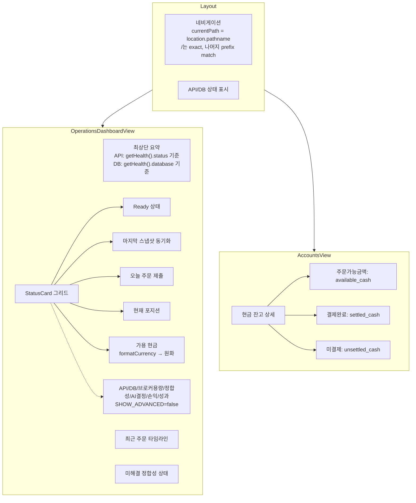

# 프런트엔드 UI 정리 계획 (v2 - 보정 반영)

## 목표
장중 백엔드 수정 없이 Admin UI 프런트엔드만 조정한다.

---

## 작업 1: 운영 대시보드 카드/섹션 정리

**파일:** [`admin_ui/src/components/OperationsDashboardView.tsx`](admin_ui/src/components/OperationsDashboardView.tsx)

### Feature flag
```typescript
// 파일 상단, import 아래에 배치
// 현재 운영 화면 단순화를 위해 숨김, 추후 필요 시 true
const SHOW_ADVANCED_OPERATION_CARDS = false;
```

### 숨길 StatusCard 7개 (SHOW_ADVANCED_OPERATION_CARDS flag로 감싸기)

| 카드 | 설명 |
|------|------|
| `API 상태` | 최상단 요약으로 대체 |
| `DB 상태` | 최상단 요약으로 대체 |
| `브로커 용량` | |
| `미해결 정합성` | |
| `오늘 AI 결정` | |
| `미실현 손익` | |
| `당일 성과` | |

### 남길 StatusCard 5개 (그대로 유지)

| 카드 | 설명 |
|------|------|
| `Ready 상태` | 시스템 준비 상태 |
| `마지막 스냅샷 동기화` | 스냅샷 동기화 현황 |
| `오늘 주문 제출` | 주문 제출 통계 |
| `현재 포지션` | 포지션 수 |
| `가용 현금` | 현금 잔고 (formatCurrency 원화) |

### 최상단 summary 영역 추가

```tsx
{/* System Status Summary */}
<div className="flex items-center gap-4 text-sm text-[#64748b] bg-white rounded-xl border border-[#e2e8f0] px-5 py-3">
  <span className="flex items-center gap-1.5">
    <span className={`h-2 w-2 rounded-full ${data.health?.status === "ok" ? "bg-[#22c55e]" : "bg-[#ef4444]"}`} />
    API: {data.health?.status === "ok" ? "정상" : "확인 필요"}
  </span>
  <span className="text-[#e2e8f0]">|</span>
  <span className="flex items-center gap-1.5">
    <span className={`h-2 w-2 rounded-full ${(data.health?.database === "connected" || data.health?.database === "ok") ? "bg-[#22c55e]" : "bg-[#ef4444]"}`} />
    DB: {(data.health?.database === "connected" || data.health?.database === "ok") ? "연결됨" : "확인 필요"}
  </span>
</div>
```

**중요:** `getHealth()` 실제 결과 기준으로 표시. 하드코딩 금지.

### API 호출 정리

| API 호출 | 처리 | 이유 |
|----------|------|------|
| `getBrokerCapacity()` | 제거 | 브로커 용량 카드 숨김 |
| `getTradeDecisions()` | 제거 | AI 결정 카드 숨김 |
| `getAgentRuns()` | 제거 | AI 결정 카드 숨김 (recentAgentFailures 불필요) |
| `getReconciliationSummary()` | 유지 | WarningBanner에서 필요 |
| `getHealth()` | 유지 | 최상단 요약 + readyz에서 필요 |
| `getReadyz()` | 유지 | Ready 상태 카드에서 필요 |

### Import 정리
- `getBrokerCapacity` → import 제거
- `getTradeDecisions` → import 제거  
- `getAgentRuns` → import 제거
- 관련 타입 import도 제거 (unused variable 방지)

### Derived metrics 정리
- `brokerEntry`, `brokerConnected`, `brokerHealthy` → 제거
- `totalUnrealizedPnl` → 제거 (관련 루프도 제거)
- `recentAgentFailures` → 제거
- `decisionCount` → 제거

### Promise.allSettled 및 변수 정리
- `fetchAll`에서 `brokerCapacityPromise`, `decisionsPromise`, `agentRunsPromise` 제거
- `Promise.all([...])`에서 해당 promise 제거
- `DashboardData` 인터페이스에서 `brokerCapacity`, `decisions`, `agentRuns` 필드 제거
- `setData()`에서 해당 필드 제거

---

## 작업 2: 계좌 화면 현금 잔고 라벨 수정

**파일:** [`admin_ui/src/components/AccountsView.tsx`](admin_ui/src/components/AccountsView.tsx)

### 변경 (line 591)
```tsx
{/* 변경 전 */}
<span className="text-[#64748b]">가용: </span>

{/* 변경 후 */}
<span className="text-[#64748b]">주문가능금액: </span>
```

### 유지
- `결제완료: {settled_cash}` — 유지
- `미결제: {unsettled_cash}` — 유지
- `통화: {currency}` — 유지

---

## 작업 3: 운영 대시보드 KRW/원 표시 정리

**파일:** [`admin_ui/src/components/OperationsDashboardView.tsx`](admin_ui/src/components/OperationsDashboardView.tsx)

### formatCurrency 함수 변경
```typescript
// 변경 전: $ 달러 표시
function formatCurrency(val: number | null | undefined): string {
  if (val == null) return "N/A";
  const prefix = val >= 0 ? "" : "-";
  return `${prefix}$${Math.abs(val).toLocaleString("en-US", { minimumFractionDigits: 2, maximumFractionDigits: 2 })}`;
}

// 변경 후: 원화 표시
function formatCurrency(val: number | null | undefined): string {
  if (val == null || val === undefined) return "—";
  if (Number.isNaN(val)) return "—";
  const formatted = Math.abs(val).toLocaleString("ko-KR");
  const prefix = val >= 0 ? "" : "-";
  return `${prefix}${formatted}원`;
}
```

### 적용 위치
- `가용 현금` 카드 value (line 640)

---

## 작업 4: 사이드바 active menu highlight 수정

**파일:** [`admin_ui/src/components/Layout.tsx`](admin_ui/src/components/Layout.tsx)

### 원인
`currentPath`가 첫 번째 segment만 추출:
- `/operations/alerts` → `/operations` ❌ (nav item `to`는 `/operations/alerts`)

### 수정

```typescript
// 변경 전
const currentPath = location.pathname === "/" ? "/" : `/${location.pathname.split("/")[1]}`;

// 변경 후
const currentPath = location.pathname;
```

### isActive 판정 (line 143)
```typescript
// 변경 전
const isActive = !item.disabled && currentPath === item.to;

// 변경 후: "/"는 exact match, 나머지는 prefix match (상세 페이지 포함)
const isActive = !item.disabled && (
  item.to === "/"
    ? currentPath === "/"
    : currentPath === item.to || currentPath.startsWith(item.to + "/")
);
```

**참고:** `currentPath.startsWith(item.to + "/")`가 필요한 이유:
- `/orders/:orderId` (예: `/orders/abc-123`) → `/orders` 메뉴 active 유지
- `/operations/alerts` → `/operations`는 nav item이 없으므로 문제 없음

### 적용 결과

| 경로 | Active 메뉴 |
|------|------------|
| `/` | 운영 대시보드 ✅ (exact match) |
| `/operations/alerts` | 운영 경고 ✅ |
| `/operations/orders` | 주문 추적 ✅ |
| `/orders` | 주문 ✅ |
| `/orders/abc-123` | 주문 ✅ (prefix match) |
| `/accounts` | 계좌 ✅ |
| `/reconciliation` | 정합성 점검 ✅ |
| `/decisions` | 의사결정 ✅ |
| `/agent-runs` | 에이전트 실행 ✅ |

---

## Mermaid: 변경된 컴포넌트 관계



---

## 구현 순서

### Step 1: OperationsDashboardView.tsx — formatCurrency KRW 변경 (작업 3)
### Step 2: OperationsDashboardView.tsx — feature flag + 카드 숨김 + API 호출 정리 (작업 1)
### Step 3: AccountsView.tsx — "가용" → "주문가능금액" (작업 2)
### Step 4: Layout.tsx — currentPath + isActive prefix match (작업 4)
### Step 5: Build + Test 검증
