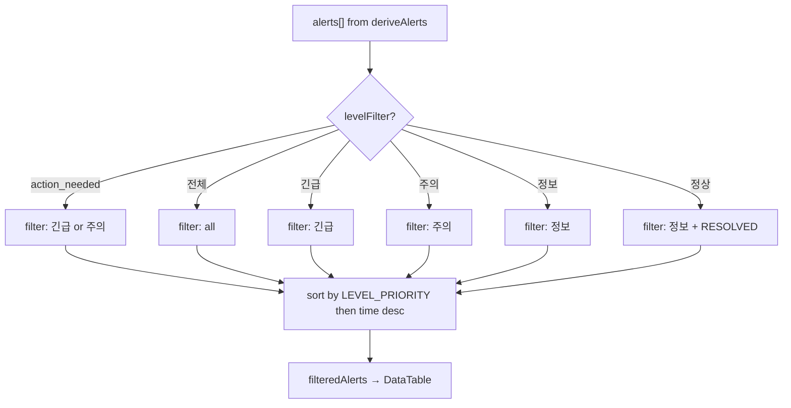

# 운영 경고 및 대시보드 정리 계획 (v2 — 보정 반영)

## 목표

장중 운영 화면의 정보 과다를 줄이고, 운영자가 실제 조치해야 하는 항목만 빠르게 볼 수 있도록 [`OperationsAlertsView.tsx`](admin_ui/src/components/OperationsAlertsView.tsx)와 [`OperationsDashboardView.tsx`](admin_ui/src/components/OperationsDashboardView.tsx)를 프런트엔드에서 정리한다.

**범위**: `admin_ui/`만 수정. 백엔드/스케줄러 수정 금지.

---

## 작업 1: 운영 경고 우선순위 정리 (`OperationsAlertsView.tsx`)

### 1.1 기본 필터 "조치 필요" 추가

**필터 버튼** (항상 동일하게 표시, 기본 선택만 "조치 필요"):

```
[조치 필요] [전체] [긴급] [주의] [정보] [정상]
```

| 필터 모드 | 표시 조건 |
|-----------|----------|
| `"action_needed"` (기본값) | `alert.level === "긴급" \|\| alert.level === "주의"` |
| `""` (전체) | 모든 레벨 |
| `"긴급"` | `alert.level === "긴급"` |
| `"주의"` | `alert.level === "주의"` |
| `"정보"` | `alert.level === "정보"` |
| `"정상"` | `alert.level === "정보" && alert.status === "RESOLVED"` |

### 1.2 우선순위 정렬

`filteredAlerts` useMemo에 정렬 로직 추가:

```typescript
const LEVEL_PRIORITY: Record<string, number> = {
  "긴급": 1,
  "주의": 2,
  "경고": 3,
  "정보": 4,
};

// filteredAlerts: filter + sort
return alerts
  .filter(...)
  .sort((a, b) => {
    const p = (LEVEL_PRIORITY[a.level] ?? 99) - (LEVEL_PRIORITY[b.level] ?? 99);
    if (p !== 0) return p;
    return b.time.localeCompare(a.time);
  });
```

### 1.3 빈 상태 문구

- `filter === "action_needed"` && 결과 0건: `"현재 조치가 필요한 운영 경고가 없습니다"`
- 그 외: 기존 `"선택한 수준의 알림이 없습니다"`

### 1.4 정적 노트/체크리스트

**변경 없음**. Pre-Market Checklist, Operation Notes는 알림 아래에 위치. `notesCollapsed=true` 유지. Alert count에 포함되지 않음 (기존과 동일).

---

## 작업 2: 운영 경고 문구 정리 (`OperationsAlertsView.tsx`)

### 2.1 용어 통일

**화면 표시 레벨**: `긴급`, `주의`, `정보`, `정상`

현재 내부 level 값:
| 내부 level | UI 표시 | 비고 |
|-----------|---------|------|
| `"긴급"` | 긴급 | 그대로 |
| `"주의"` | 주의 | 그대로 |
| `"경고"` | 주의 | ALT-LINEAGE-001, SNAP-TIME-001: `"경고"` → `"주의"`로 변경 |
| `"정보"` (OPEN) | 정보 | ALT-OK-001 제외한 정보성 알림 |
| `"정보"` (RESOLVED) | 정상 | ALT-OK-001 ("시스템 정상") → `"정상"`으로 표시 |

### 2.2 reconcile_required (ALT-ORD-002)

| 필드 | 현재 | 변경 |
|------|------|------|
| `level` | `"주의"` | 유지 |
| `title` | `"조정 필요 상태 존재"` | 유지 |
| `description` | `"브로커 확정 불가 상태인 주문이 N건 있습니다. 수동 확인이 필요합니다."` | `"브로커 확정 상태 확인이 필요한 주문이 있습니다."` |

### 2.3 snapshot partial (SNAP-SYNC-001)

| 필드 | 현재 | 변경 |
|------|------|------|
| `level` | `"주의"` | 유지 |
| `title` | `"스냅샷 부분 성공"` | 유지 |
| `description` | 성공/실패 계좌 수 표시 | `"일부 스냅샷이 최신이 아닐 수 있습니다."` |

### 2.4 Lineage 경고 (ALT-LINEAGE-001) → 상단 배너

- **내부 level**: `"경고"` → `"주의"`로 변경 (UI 통일)
- **표시 방식**: 알림 목록 위 별도 WarningBanner (variant: "warning")
- **목록 중복 제외**: 배너 표시 시 목록에서는 ALT-LINEAGE-001 제외

### 2.5 API 실패 알림에 API 이름 노출

`AlertRuleInput`에 `apiErrors: { apiName: string; message: string }[]` 필드 추가.
`fetchAlerts`에서 각 API 호출 실패 시 API 이름을 기록.
ALT-SYS-001 description에 실패한 API 이름 목록 포함.

```typescript
description: input.apiErrors?.length 
  ? `API 응답 없음: ${input.apiErrors.map(e => e.apiName).join(", ")}`
  : `API 응답 없음: GET /health`,
```

---

## 작업 3: 운영 대시보드 요약화 (`OperationsDashboardView.tsx`)

### 3.1 Alert count 표시

`derived` useMemo 내에서 alert count 계산. 같은 rule 기준 사용 (shared `deriveAlerts()`).

Dashboard가 이미 fetch하는 데이터로 AlertRuleInput 구성:
- `health`, `orders`, `reconSummary`, `snapshotSyncRuns`, `positionsMap` → 모두 있음
- `reconRuns`: Dashboard는 snapshotSyncRuns 사용 (reconRuns는 별도 조회하지 않음)
- `agentRuns`: Dashboard는 조회하지 않음 → 빈 배열 전달 (alert 없음)

### 3.2 UI 배치

```tsx
<StatusCard
  title="운영 경고"
  value={`긴급 N / 주의 N`}
  status={urgent > 0 ? "error" : caution > 0 ? "warning" : "healthy"}
  subtitle="운영 경고 보기 →"
  // 클릭 시 navigate("/operations/alerts")
/>
```

`StatusCard`의 `subtitle`이 `string`만 허용하면, `onClick`을 카드 자체에 걸거나 별도 링크 버튼 추가.

### 3.3 Recent Events / Pending Reconciliations 섹션

**숨김 처리** (완전 삭제하지 않음). Feature flag `SHOW_DASHBOARD_SECTIONS` = `false`로 제어.

```typescript
const SHOW_DASHBOARD_SECTIONS = false; // true로 변경 시 복원
```

해당 섹션 div를 조건부 렌더링으로 감쌈.

---

## 작업 4: 중복 로직 최소화 (`lib/alerts.ts`)

### 4.1 공유 모듈 생성

[`admin_ui/src/lib/alerts.ts`](admin_ui/src/lib/alerts.ts):

```typescript
// 타입 export
export interface AlertItem { ... }
export interface AlertRuleInput { ... }

// 상수 export
export const LEVEL_PRIORITY: Record<string, number> = { ... }

// 순수 함수 export
export function deriveAlerts(input: AlertRuleInput): AlertItem[] {
  // ... 모든 alert rule 로직 (문구 변경 반영)
  // ... apiErrors 처리 (API 이름 표시)
  // ... "경고" → "주의" 레벨 변경 (ALT-LINEAGE-001, SNAP-TIME-001)
}
```

### 4.2 양쪽 뷰에서 import

```typescript
// OperationsAlertsView.tsx
import { deriveAlerts, LEVEL_PRIORITY, type AlertItem, type AlertRuleInput } from "../lib/alerts";
// 로컬 deriveAlerts 제거, 로컬 AlertItem 제거

// OperationsDashboardView.tsx
import { deriveAlerts } from "../lib/alerts";
```

### 4.3 AlertRuleInput 필드 변경 (신규)

```typescript
export interface AlertRuleInput {
  // ... 기존 필드 유지
  // 추가:
  apiErrors?: { apiName: string; message: string }[];
}
```

---

## 구현 순서

| # | 작업 | 파일 | 상세 |
|---|------|------|------|
| 1 | `lib/alerts.ts` 생성 | 신규 파일 | 타입 + deriveAlerts + LEVEL_PRIORITY 추출 |
| 2 | OperationsAlertsView - import 교체 | `OperationsAlertsView.tsx` | 로컬 함수 제거, shared import |
| 3 | Alert 문구 정리 (reconcile, partial) | `lib/alerts.ts` | description 변경 |
| 4 | "경고" → "주의" 통일 | `lib/alerts.ts` | ALT-LINEAGE-001, SNAP-TIME-001 |
| 5 | API 이름 노출 | `lib/alerts.ts` + `OperationsAlertsView.tsx` | apiErrors 전달, description 변경 |
| 6 | Lineage 배너 + 목록 제외 | `OperationsAlertsView.tsx` | WarningBanner 상단, 목록 filter |
| 7 | 필터 + 정렬 | `OperationsAlertsView.tsx` | "조치 필요" default, priority sort |
| 8 | 빈 상태 문구 | `OperationsAlertsView.tsx` | 조건부 문구 |
| 9 | Dashboard alert count | `OperationsDashboardView.tsx` | shared deriveAlerts 호출 |
| 10 | Dashboard "운영 경고 보기" 링크 | `OperationsDashboardView.tsx` | navigate link |
| 11 | Recent/Pending 섹션 숨김 | `OperationsDashboardView.tsx` | feature flag |
| 12 | Build + Test 검증 | — | `npm run build && npm run test:run` |

---

## Mermaid: 필터/정렬 흐름



---

## 검증 명령어

```bash
cd admin_ui && npm run build
cd admin_ui && npm run test:run
```

## 완료 보고 항목

- 수정 파일 목록
- alert level/필터 정책
- `lib/alerts.ts` 추출 여부
- 대시보드/경고 화면 alert count 일치 여부
- 숨긴 섹션 목록
- build/test 결과
