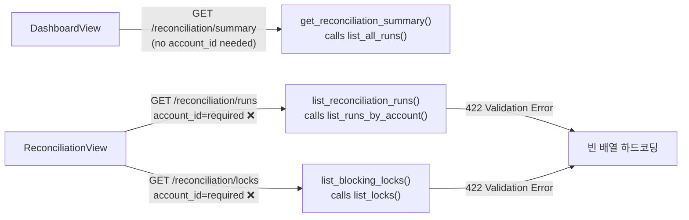
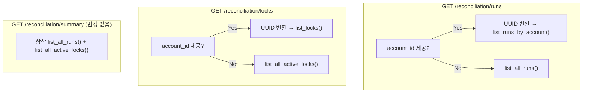
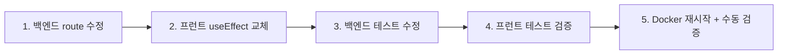

# 운영 대시보드 ↔ 정합성 화면 데이터 불일치 Hotfix 설계서

## 1. 개요

| 항목 | 내용 |
|------|------|
| **문서 ID** | HOTFIX-2026-05-17-reconciliation-dashboard-alignment |
| **작성일** | 2026-05-17 |
| **대상 버전** | agent_trading v1.x |
| **우선순위** | 높음 (운영 화면 데이터 정합성) |

## 2. Root Cause 분석

### 2.1 문제 증상

- [`OperationsDashboardView`](admin_ui/src/components/OperationsDashboardView.tsx) (대시보드) → [`GET /reconciliation/summary`](src/agent_trading/api/routes/reconciliation.py:109) → **정합성 요약 4건 정상 표시**
- [`ReconciliationView`](admin_ui/src/components/ReconciliationView.tsx) (정합성 점검 화면) → runs/locks API가 `account_id` required → **호출 포기, 빈 배열 하드코딩**

### 2.2 근본 원인



#### 백엔드: [`routes/reconciliation.py`](src/agent_trading/api/routes/reconciliation.py)

| 함수 (라인) | 파라미터 | 문제 |
|------------|----------|------|
| [`list_reconciliation_runs()`](src/agent_trading/api/routes/reconciliation.py:41) | `account_id: str = Query(...)` | **required**, 전역 조회 불가 |
| [`list_blocking_locks()`](src/agent_trading/api/routes/reconciliation.py:72) | `account_id: str = Query(...)` | **required**, 전역 조회 불가 |
| [`get_reconciliation_summary()`](src/agent_trading/api/routes/reconciliation.py:109) | `account_id` 없음 | 정상 동작 (전역 조회) |

#### 프런트: [`ReconciliationView.tsx`](admin_ui/src/components/ReconciliationView.tsx)

[`useEffect` (72-82행)](admin_ui/src/components/ReconciliationView.tsx:72):
```typescript
// Backend /reconciliation endpoints require an account_id, which we cannot
// derive from /orders alone (OrderSummary has no client_id).
// Show empty state until a proper account selection mechanism is added.
setRuns([]);    // ← 항상 빈 배열
setLocks([]);   // ← 항상 빈 배열
setLoading(false);
```

#### Repository 계층 (변경 불필요)

두 구현체 모두 전역 조회 메서드를 **이미 제공 중**이므로 route만 수정하면 됨:

| 구현체 | 파일 | 전역 조회 메서드 |
|--------|------|-----------------|
| Protocol (interface) | [`contracts.py:477-487`](src/agent_trading/repositories/contracts.py:477) | `list_all_runs()`, `list_all_active_locks()` |
| In-memory | [`memory.py:621-639`](src/agent_trading/repositories/memory.py:621) | `list_all_runs()`, `list_all_active_locks()` |
| Postgres | [`postgres/reconciliation.py:148-175`](src/agent_trading/repositories/postgres/reconciliation.py:148) | `list_all_runs()`, `list_all_active_locks()` |

#### API 클라이언트 (이미 대비 완료)

[`client.ts`](admin_ui/src/api/client.ts)의 `accountId` 파라미터는 **이미 optional**로 정의됨:

```typescript
// 129-136행
export async function getReconciliationRuns(
  accountId?: string                          // ← 이미 optional
): Promise<ReconciliationRunSummary[]> {
  const params = accountId ? `?account_id=${encodeURIComponent(accountId)}` : "";
  return request<ReconciliationRunSummary[]>(`/reconciliation/runs${params}`);
}

// 138-145행
export async function getReconciliationLocks(
  accountId?: string                          // ← 이미 optional
): Promise<BlockingLockStatus[]> {
  const params = accountId ? `?account_id=${encodeURIComponent(accountId)}` : "";
  return request<BlockingLockStatus[]>(`/reconciliation/locks${params}`);
}
```

따라서 프런트는 `getReconciliationRuns()` / `getReconciliationLocks()`를 인자 없이 호출하기만 하면 됨.

## 3. 변경 사항 상세

### 3.1 변경 대상 파일 목록

| # | 파일 | 변경 유형 | 설명 |
|---|------|-----------|------|
| 1 | [`src/agent_trading/api/routes/reconciliation.py`](src/agent_trading/api/routes/reconciliation.py) | 수정 | `account_id` optional 전환 + 전역 조회 분기 |
| 2 | [`admin_ui/src/components/ReconciliationView.tsx`](admin_ui/src/components/ReconciliationView.tsx) | 수정 | `useEffect` 실제 API 호출로 교체 |
| 3 | [`tests/api/test_inspection.py`](tests/api/test_inspection.py) | 수정 | 422 기대값 → 200 변경, 회귀 테스트 추가 |
| 4 | [`tests/api/test_postgres_inspection.py`](tests/api/test_postgres_inspection.py) | 수정 | 422 기대값 → 200 변경 |
| 5 | [`admin_ui/src/__tests__/reconciliation.test.tsx`](admin_ui/src/__tests__/reconciliation.test.tsx) | 수정 | mock 데이터 검증 추가 |

### 3.2 백엔드: API scope 수정

#### [`list_reconciliation_runs()`](src/agent_trading/api/routes/reconciliation.py:41)

**변경 전:**
```python
async def list_reconciliation_runs(
    account_id: str = Query(..., description="Account ID (required)"),
    limit: int = Query(20, ge=1, le=100),
    repos: RepositoryContainer = Depends(get_repos),
) -> list[ReconciliationRunSummary]:
    uid = UUID(account_id)
    runs = await repos.reconciliations.list_runs_by_account(uid, limit=limit)
    ...
```

**변경 후:**
```python
async def list_reconciliation_runs(
    account_id: str | None = Query(None, description="Account ID (optional — omit for global view)"),
    limit: int = Query(20, ge=1, le=100),
    repos: RepositoryContainer = Depends(get_repos),
) -> list[ReconciliationRunSummary]:
    if account_id is not None:
        uid = UUID(account_id)          # ← invalid UUID → 400 기존 로직 유지
        runs = await repos.reconciliations.list_runs_by_account(uid, limit=limit)
    else:
        runs = await repos.reconciliations.list_all_runs(limit=limit)
    ...
```

#### [`list_blocking_locks()`](src/agent_trading/api/routes/reconciliation.py:72)

**변경 전:**
```python
async def list_blocking_locks(
    account_id: str = Query(..., description="Account ID (required)"),
    repos: RepositoryContainer = Depends(get_repos),
) -> list[BlockingLockStatus]:
    uid = UUID(account_id)
    locks = await repos.reconciliations.list_locks(uid)
    ...
```

**변경 후:**
```python
async def list_blocking_locks(
    account_id: str | None = Query(None, description="Account ID (optional — omit for global view)"),
    repos: RepositoryContainer = Depends(get_repos),
) -> list[BlockingLockStatus]:
    if account_id is not None:
        uid = UUID(account_id)          # ← invalid UUID → 400 기존 로직 유지
        locks = await repos.reconciliations.list_locks(uid)
    else:
        locks = await repos.reconciliations.list_all_active_locks()
    ...
```

#### 계정별/전역 조회 흐름



### 3.3 프런트: ReconciliationView 데이터 로딩 수정

#### `useEffect` 교체 ([`ReconciliationView.tsx:72-82`](admin_ui/src/components/ReconciliationView.tsx:72))

**변경 전:**
```typescript
useEffect(() => {
  setLoading(true);
  setError(null);
  // Backend /reconciliation endpoints require an account_id ...
  setRuns([]);
  setLocks([]);
  setLoading(false);
}, []);
```

**변경 후:**
```typescript
useEffect(() => {
  let cancelled = false;

  async function fetchData() {
    setLoading(true);
    setError(null);

    try {
      const [runsData, locksData] = await Promise.all([
        getReconciliationRuns(),    // ← account_id 없이 전역 조회
        getReconciliationLocks(),   // ← account_id 없이 전역 조회
      ]);
      if (cancelled) return;
      setRuns(runsData);
      setLocks(locksData);
    } catch (err: unknown) {
      if (!cancelled) {
        const msg =
          err instanceof Error
            ? err.message
            : "정합성 데이터를 불러오지 못했습니다";
        setError(msg);
      }
    } finally {
      if (!cancelled) setLoading(false);
    }
  }

  fetchData();
  return () => {
    cancelled = true;
  };
}, []);
```

**변경 포인트 요약:**
1. `cancelled` 플래그 패턴 추가 (컴포넌트 언마운트 시 race condition 방지)
2. `getReconciliationRuns()` / `getReconciliationLocks()` 호출 — 인자 없이 전역 조회
3. 에러 핸들링: `setError()`로 에러 메시지 설정
4. `finally` 블록에서 `setLoading(false)` 보장

### 3.4 백엔드 API 변경에 따른 영향도

| 호출자 | account_id 전달 | account_id 없음 | 영향 |
|--------|----------------|-----------------|------|
| [`ReconciliationView.tsx`](admin_ui/src/components/ReconciliationView.tsx) | ❌ (현재) | ✅ (변경 후) | **이번 fix 대상** |
| [`OperationsDashboardView.tsx`](admin_ui/src/components/OperationsDashboardView.tsx) | — | ✅ `/summary` 사용 | 영향 없음 |
| 기존 서비스 코드 (`ReconciliationService`) | ✅ | — | 영향 없음 (내부 호출) |
| 외부 API 소비자 (미래) | ✅ 가능 | ✅ 가능 | 하위 호환성 유지 |

## 4. 테스트 계획

### 4.1 테스트 변경 항목 (5개)

| # | 테스트 | 파일 | 현재 | 변경 후 |
|---|--------|------|------|---------|
| 1 | `test_list_reconciliation_runs_missing_param` | [`test_inspection.py:219`](tests/api/test_inspection.py:219) | `assert 422` | `assert 200` + 빈 배열 or 데이터 |
| 2 | `test_list_locks_missing_param` | [`test_inspection.py:245`](tests/api/test_inspection.py:245) | `assert 422` | `assert 200` + 빈 배열 or 데이터 |
| 3 | `test_reconciliation_runs_requires_param` | [`test_postgres_inspection.py:71`](tests/api/test_postgres_inspection.py:71) | `assert 422` | `assert 200` |
| 4 | `test_list_reconciliation_runs_with_account_id` | [`test_inspection.py:204`](tests/api/test_inspection.py:204) | `assert 200` + account 검증 | **변경 없음** (회귀 방지) |
| 5 | `test_list_locks_with_account_id` | [`test_inspection.py:226`](tests/api/test_inspection.py:226) | `assert 200` + account 검증 | **변경 없음** (회귀 방지) |

### 4.2 프런트 테스트

| # | 테스트 | 파일 | 설명 |
|---|--------|------|------|
| 6 | 기존 reconciliation.test.tsx | [`reconciliation.test.tsx`](admin_ui/src/__tests__/reconciliation.test.tsx) | `getReconciliationRuns`/`getReconciliationLocks` mock이 이미 `[]` 반환 중. 변경 후에도 동일 mock 유지 가능 (API 호출만 추가됨) |
| 7 | 신규: runs/locks 로딩 검증 | 동일 파일 | `getReconciliationRuns` mock 데이터 설정 → 화면에 runs 테이블 렌더링 확인 |

### 4.3 회귀 테스트 항목

- [`test_list_reconciliation_runs`](tests/api/test_inspection.py:204) — `account_id` 지정 시 정상 동작 유지
- [`test_list_locks`](tests/api/test_inspection.py:226) — `account_id` 지정 시 정상 동작 유지
- [`test_list_locks_invalid_uuid`](tests/api/test_inspection.py:250) — 잘못된 UUID → 400 유지
- [`test_reconciliation_summary`](tests/api/test_inspection.py:257) — summary 엔드포인트 영향 없음

## 5. 실행 순서



### Step 1: 백엔드 route 수정
- [x] [`reconciliation.py`](src/agent_trading/api/routes/reconciliation.py)의 `list_reconciliation_runs()`, `list_blocking_locks()` 수정
- `account_id`를 `Query(None)` (optional)로 변경
- `account_id` 유무에 따른 분기 로직 추가

### Step 2: 프런트 useEffect 교체
- [ ] [`ReconciliationView.tsx`](admin_ui/src/components/ReconciliationView.tsx) 72-82행 수정
- `cancelled` 플래그 패턴 적용
- `getReconciliationRuns()` / `getReconciliationLocks()` 호출
- 에러 핸들링 추가

### Step 3: 백엔드 테스트 수정
- [ ] [`test_inspection.py`](tests/api/test_inspection.py) — `_missing_param` 테스트 2개: 422→200
- [ ] [`test_postgres_inspection.py`](tests/api/test_postgres_inspection.py) — `_requires_param` 테스트 1개: 422→200
- [ ] 계정 지정 테스트는 변경 없음 (회귀 방지)

### Step 4: 프런트 테스트 검증
- [ ] [`reconciliation.test.tsx`](admin_ui/src/__tests__/reconciliation.test.tsx) — 기존 mock 유지, 필요시 신규 테스트 추가
- `getReconciliationRuns`/`getReconciliationLocks`가 mock에서 `[]` 반환 → 빈 상태 정상 렌더링

### Step 5: Docker 재시작 + 수동 검증
- [ ] `docker-compose restart api` (또는 전체 재시작)
- [ ] 대시보드: 정합성 요약 4건 정상 표시 확인
- [ ] 정합성 화면: runs/locks 빈 배열 대신 실제 데이터 표시 확인
- [ ] 기존 `account_id` 지정 API 호출 회귀 없음 확인 (curl or Swagger)

## 6. 리스크 및 고려사항

### 계정 필터링
현재 변경 방향은 **전역 조회** (account_id 없이 모든 계정 대상). 이는 [`OperationsDashboardView`](admin_ui/src/components/OperationsDashboardView.tsx)의 summary와 일관성을 유지하기 위함. 추후 특정 계정 필터링이 필요하면 `FilterBar` 컴포넌트를 [`ReconciliationView.tsx`](admin_ui/src/components/ReconciliationView.tsx)에 추가하여 `account_id`를 선택적으로 전달하는 방식으로 확장 가능.

### API 변경 영향
`account_id`가 required에서 optional로 변경되므로 하위 호환성은 유지됨. `account_id`를 전달하는 기존 호출자(서비스 코드, ReconciliationWorker 등)는 영향 없음.

### 테스트 데이터 의존성
`test_postgres_inspection.py`의 `test_reconciliation_runs_requires_param`은 Postgres 컨테이너가 필요함. 변경 후 200을 기대하지만 DB에 데이터가 없으면 빈 배열(`[]`)이 반환됨. 이는 postgres 테스트 환경에서 reconciliation_runs 테이블에 데이터가 시드되어 있지 않으면 빈 배열이 정상임.
