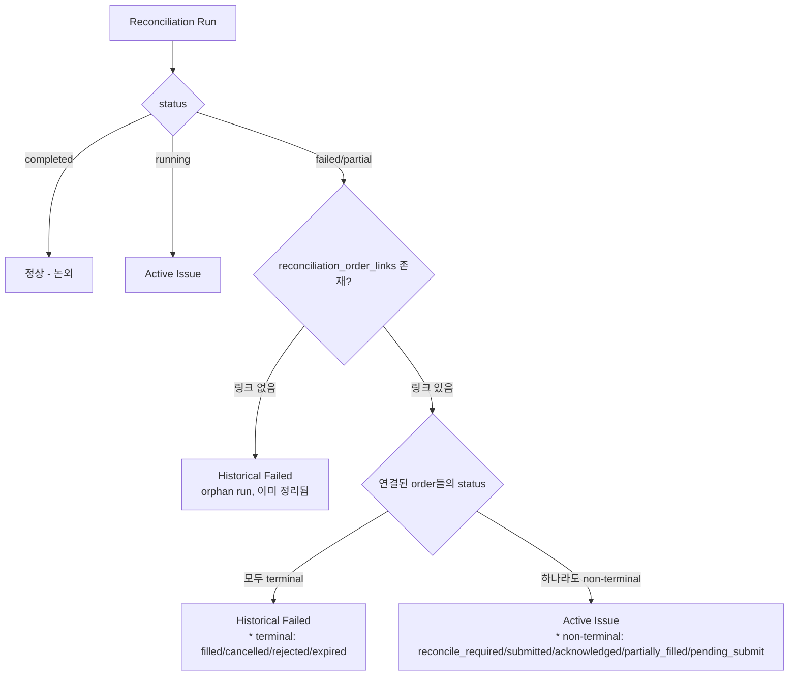

# 대시보드/정합성 화면 — Historical Failed Run과 Active Issue 분리 설계

> 작성일: 2026-05-25  
> 상태: 초안

---

## 1. 현행 코드 분석

### 1.1 데이터 모델

#### `trading.reconciliation_runs` (DB 테이블)

| 컬럼 | 타입 | 설명 |
|------|------|------|
| `reconciliation_run_id` | UUID | PK |
| `account_id` | UUID | 대상 계좌 |
| `trigger_type` | str | 트리거 종류 |
| `status` | str | `started` / `completed` / `failed` / `partial` |
| `mismatch_count` | int | 불일치 건수 |
| `summary_json` | jsonb | 요약 정보 |
| `started_at` | timestamptz | 시작 시각 |
| `completed_at` | timestamptz | 완료 시각 |

#### `trading.reconciliation_order_links` (DB 테이블)

| 컬럼 | 타입 | 설명 |
|------|------|------|
| `reconciliation_run_id` | UUID | → reconciliation_runs FK |
| `order_request_id` | UUID | → order_requests FK |
| `mismatch_type` | str | 불일치 유형 |
| `details_json` | jsonb | 상세 정보 |

#### [`ReconciliationRunSummary`](src/agent_trading/api/schemas.py:185) (API Schema)

```python
class ReconciliationRunSummary(BaseModel):
    reconciliation_run_id: str
    account_id: str
    trigger_type: str
    status: str          # "completed" | "failed" | "started" | "partial"
    started_at: datetime
    completed_at: datetime | None = None
    mismatch_count: int = 0
    # ❌ is_active 필드 없음
```

#### [`ReconciliationSummary`](src/agent_trading/api/schemas.py:268) (API Schema)

```python
class ReconciliationSummary(BaseModel):
    active_locks_count: int
    incomplete_recon_count: int   # ← status != "completed" 인 모든 run 카운트
    recent_active_locks: list[BlockingLockStatus]
    recent_incomplete_runs: list[ReconciliationRunSummary]
    generated_at: datetime
```

**문제**: `incomplete_recon_count`는 `failed` 상태의 run을 모두 포함한다.  
이 중 상당수는 broker_order가 없던 orphan 주문에서 발생한 과거 실패 이력(historical)으로,  
이미 EOD 정리(or 다른 조치)로 주문/락이 해결된 상태여도 run row는 감사 이력으로 남아 있다.

### 1.2 API 엔드포인트

| 엔드포인트 | 반환 타입 | 설명 |
|-----------|----------|------|
| `GET /reconciliation/runs` | `list[ReconciliationRunSummary]` | run 목록 (account_id 필터 가능) |
| `GET /reconciliation/locks` | `list[BlockingLockStatus]` | 활성 락 목록 |
| `GET /reconciliation/summary` | `ReconciliationSummary` | 집계 요약 (대시보드용) |

### 1.3 Repository

[`PostgresReconciliationRepository.list_all_runs()`](src/agent_trading/repositories/postgres/reconciliation.py:148)

```sql
SELECT * FROM trading.reconciliation_runs
ORDER BY started_at DESC
LIMIT $1
```

- 단순 SELECT, JOIN 없음 → run과 order의 연결 관계를 알 수 없음
- [`get_run_order_links()`](src/agent_trading/repositories/postgres/reconciliation.py:214)는 개별 run_id로만 조회 가능

### 1.4 UI 컴포넌트 구조

#### [`ReconciliationView.tsx`](admin_ui/src/components/ReconciliationView.tsx:51)

- `getReconciliationRuns()`로 전체 run 목록 조회
- status 필터: `all`, `completed`, `running`, `reconcile_required`, `failed`
- 필터링된 run을 `DataTable`에 표시
- 아래쪽에 `reconcile_required` 주문 섹션 별도 존재

**문제점**:
- `failed` 필터 선택 시 historical + active failed run이 혼합되어 표시됨
- 운영자가 "지금 당장 조치해야 할 것"과 "과거 이력"을 구분할 수 없음

#### [`OperationsDashboardView.tsx`](admin_ui/src/components/OperationsDashboardView.tsx:282)

- `getReconciliationSummary()`로 `incomplete_recon_count` + `active_locks_count` 조회
- WarningBanner: `incompleteReconCount > 0 || activeLocksCount > 0` → 경고 표시
- StatusCard: `incompleteReconCount + activeLocksCount` → "미해결 정합성"
- "최근 정합성 점검" compact 섹션에 최근 5개 run 표시

**문제점**:
- `incomplete_recon_count`가 historical failed run까지 포함하므로,
  이미 해결된 문제로 WarningBanner가 잘못 트리거될 수 있음
- Dashboard의 정합성 StatusCard가 과대 계수됨

#### [`OperationsAlertsView.tsx`](admin_ui/src/components/OperationsAlertsView.tsx:103)

- `deriveAlerts()`로 알림 생성
- [`ALT-RECON-001`](admin_ui/src/lib/alerts.ts:163): active locks 존재 → `주의`
- [`ALT-ORD-002`](admin_ui/src/lib/alerts.ts:131): reconcile_required 주문 → `주의`
- **직접적인 "failed run → active issue" 알림 규칙 없음**

---

## 2. Active Issue vs Historical Failed 판별 기준

### 2.1 정의



**Active Issue** 조건 (모두 충족):
1. Run의 `status`가 `failed` 또는 `partial` 또는 `started`
2. `reconciliation_order_links`에 1개 이상의 링크가 존재
3. 연결된 order 중 **하나라도** `reconcile_required`, `submitted`, `acknowledged`, `partially_filled`, `pending_submit`, `cancel_pending` 상태 (non-terminal)

**Historical Failed** 조건 (하나라도 충족):
1. Run의 `status`가 `failed`/`partial`이고 `reconciliation_order_links`가 **0건**
2. Run의 `status`가 `failed`/`partial`이고 연결된 모든 order가 terminal 상태(`filled`, `cancelled`, `rejected`, `expired`)

**`started` (running) 상태**: 항상 Active Issue (실행 중이므로 모니터링 필요)

### 2.2 Terminal vs Non-Terminal Order Status

| 구분 | OrderStatus 값 |
|------|---------------|
| **Terminal** (최종) | `filled`, `cancelled`, `rejected`, `expired` |
| **Non-Terminal** (진행/대기/조정필요) | `draft`, `validated`, `pending_submit`, `submitted`, `acknowledged`, `partially_filled`, `cancel_pending`, `reconcile_required` |

### 2.3 판별 우선순위

```
active_issue = (
    run.status in ('failed', 'partial', 'started') 
    AND EXISTS reconciliation_order_links 
    AND EXISTS order with non-terminal status
)
```

> **참고**: `running`(`started`) 상태의 run은 `reconciliation_order_links`가 없더라도  
> 실행 중이므로 Active Issue로 간주할 수 있으나,  
> 위 기준에 따르면 reconciliation_order_links가 없는 `started` run은  
> legacy run으로 간주되어 historical 처리된다.  
> **→ 설계 결정: `started` 상태는 links 존재 여부와 무관하게 active로 간주**
>
> 수정된 기준:
> ```
> active_issue = (
>     run.status == 'started' 
>     OR (run.status in ('failed', 'partial') 
>         AND EXISTS reconciliation_order_links 
>         AND EXISTS order with non-terminal status)
> )
> historical_failed = (
>     run.status in ('failed', 'partial') 
>     AND NOT active_issue
> )
> ```

---

## 3. API 변경 설계

### 3.1 접근 방식: **API 측 계산 (Recommended)**

**이유**:
- `reconciliation_order_links` 테이블은 backend만 접근 가능
- SQL JOIN으로 한 번에 해결 가능 (N+1 문제 없음)
- UI 3개 컴포넌트가 동일한 로직 공유
- `is_active` 필드를 schema에 포함 → API 응답만으로 UI가 바로 판별 가능

### 3.2 Schema 변경

#### [`ReconciliationRunSummary`](src/agent_trading/api/schemas.py:185) — `is_active` 필드 추가

```python
class ReconciliationRunSummary(BaseModel):
    reconciliation_run_id: str
    account_id: str
    trigger_type: str
    status: str
    started_at: datetime
    completed_at: datetime | None = None
    mismatch_count: int = 0
    is_active: bool = False         # ← 신규
    linked_order_statuses: list[str] | None = None  # ← 신규 (디버깅/UI 상세용, optional)
```

#### [`ReconciliationSummary`](src/agent_trading/api/schemas.py:268) — 세분화된 카운트 추가

```python
class ReconciliationSummary(BaseModel):
    active_locks_count: int
    incomplete_recon_count: int                           # ← 유지 (backward compat)
    active_issue_count: int = 0                           # ← 신규
    historical_failed_count: int = 0                      # ← 신규
    recent_active_locks: list[BlockingLockStatus]
    recent_incomplete_runs: list[ReconciliationRunSummary]
    recent_active_issues: list[ReconciliationRunSummary] = []   # ← 신규
    generated_at: datetime
```

**계산식**:

```python
active_issue_count = len([r for r in runs if r.is_active])
historical_failed_count = len([r for r in runs if r.status in ('failed', 'partial') and not r.is_active])
# incomplete_recon_count 는 기존과 동일: status != 'completed' 인 모든 run
```

### 3.3 Repository 변경

#### [`PostgresReconciliationRepository`](src/agent_trading/repositories/postgres/reconciliation.py:148) — 새 query 메서드 추가

```python
async def list_all_runs_with_activity(
    self, limit: int = 20
) -> Sequence[tuple[ReconciliationRunEntity, bool, list[str]]]:
    """JOIN reconciliation_order_links + order_requests 로 is_active 계산"""
    rows = await self._tx.connection.fetch(
        """
        SELECT 
            r.*,
            CASE 
                WHEN r.status = 'started' THEN true
                WHEN r.status IN ('failed', 'partial') 
                     AND EXISTS (
                         SELECT 1 
                         FROM trading.reconciliation_order_links l
                         JOIN trading.order_requests o ON o.order_request_id = l.order_request_id
                         WHERE l.reconciliation_run_id = r.reconciliation_run_id
                           AND o.status NOT IN ('filled', 'cancelled', 'rejected', 'expired')
                     ) THEN true
                ELSE false
            END AS is_active,
            CASE 
                WHEN EXISTS (
                    SELECT 1 
                    FROM trading.reconciliation_order_links l2
                    WHERE l2.reconciliation_run_id = r.reconciliation_run_id
                ) THEN (
                    SELECT array_agg(DISTINCT o2.status)
                    FROM trading.reconciliation_order_links l3
                    JOIN trading.order_requests o2 ON o2.order_request_id = l3.order_request_id
                    WHERE l3.reconciliation_run_id = r.reconciliation_run_id
                )
                ELSE NULL
            END AS linked_order_statuses
        FROM trading.reconciliation_runs r
        ORDER BY r.started_at DESC
        LIMIT $1
        """,
        limit,
    )
    result = []
    for row in rows:
        entity = row_to_entity(row, ReconciliationRunEntity)
        is_active = row["is_active"]
        statuses = row["linked_order_statuses"] or []
        result.append((entity, is_active, list(statuses)))
    return result
```

> **참고**: 기존 `list_all_runs()`와 `list_runs_by_account()`는 그대로 유지  
> (다른 caller가 있을 수 있음). 새 메서드 `list_all_runs_with_activity()`만 추가.

### 3.4 Route 변경

#### [`GET /reconciliation/runs`](src/agent_trading/api/routes/reconciliation.py:40)

```python
@router.get("/runs", response_model=list[ReconciliationRunSummary])
async def list_reconciliation_runs(
    account_id: str | None = Query(None),
    limit: int = Query(20, ge=1, le=100),
    active_only: bool = Query(False, description="active issue만 필터링"),  # ← 신규
    repos: RepositoryContainer = Depends(get_repos),
) -> list[ReconciliationRunSummary]:
    # ...
    if account_id:
        uid = UUID(account_id)
        runs = await repos.reconciliations.list_runs_by_account(uid, limit=limit)
        # 기존 list_runs_by_account도 is_active 계산 필요? 
        # → 선택: account_id가 있을 때는 단순 SELECT 유지 (성능)
        #   또는 list_runs_by_account도 is_active 계산하도록 확장
    else:
        runs_with_activity = await repos.reconciliations.list_all_runs_with_activity(limit=limit)
    
    result = []
    for (entity, is_active, linked_statuses) in runs_with_activity:
        if active_only and not is_active:
            continue
        result.append(ReconciliationRunSummary(
            reconciliation_run_id=str(entity.reconciliation_run_id),
            # ... 기존 필드 ...
            is_active=is_active,
            linked_order_statuses=linked_statuses,
        ))
    return result
```

#### [`GET /reconciliation/summary`](src/agent_trading/api/routes/reconciliation.py:118)

```python
@router.get("/summary", response_model=ReconciliationSummary)
async def get_reconciliation_summary(...):
    runs_with_activity = await repos.reconciliations.list_all_runs_with_activity(limit=50)
    locks = await repos.reconciliations.list_all_active_locks()
    
    incomplete_runs = [r for r, active, _ in runs_with_activity if r.status != "completed"]
    active_issues = [r for r, active, _ in runs_with_activity if active]
    historical_failed = [r for r, active, _ in runs_with_activity 
                         if r.status in ('failed', 'partial') and not active]
    
    return ReconciliationSummary(
        active_locks_count=len(locks),
        incomplete_recon_count=len(incomplete_runs),              # 유지
        active_issue_count=len(active_issues),                     # 신규
        historical_failed_count=len(historical_failed),            # 신규
        recent_active_locks=enriched_locks,
        recent_incomplete_runs=[...],                               # 유지
        recent_active_issues=[...],                                 # 신규
        generated_at=now,
    )
```

### 3.5 확장: account_id 기반 조회에서도 is_active 계산 (선택)

단순성 유지를 위해 최소 변경(minimal change) 원칙을 따르되,  
`list_runs_by_account()`도 동일한 SQL 패턴으로 확장할 수 있다.

```python
async def list_runs_by_account_with_activity(
    self, account_id: UUID, limit: int = 20
) -> Sequence[tuple[ReconciliationRunEntity, bool, list[str]]]:
    """list_all_runs_with_activity와 동일한 쿼리 + account_id WHERE"""
    # account_id 조건을 추가한 동일한 SQL
```

---

## 4. UI 변경 설계

### 4.1 타입/API 클라이언트 변경

#### [`types/api.ts`](admin_ui/src/types/api.ts:86) — `ReconciliationRunSummary` 확장

```typescript
export interface ReconciliationRunSummary {
  reconciliation_run_id: string;
  account_id: string;
  trigger_type: string;
  status: string;
  started_at: string;
  completed_at: string | null;
  mismatch_count: number;
  is_active: boolean;                        // ← 신규
  linked_order_statuses: string[] | null;    // ← 신규 (optional)
}
```

#### [`types/api.ts`](admin_ui/src/types/api.ts:106) — `ReconciliationSummary` 확장

```typescript
export interface ReconciliationSummary {
  active_locks_count: number;
  incomplete_recon_count: number;             // ← 유지
  active_issue_count: number;                 // ← 신규
  historical_failed_count: number;            // ← 신규
  recent_active_locks: BlockingLockStatus[];
  recent_incomplete_runs: ReconciliationRunSummary[];
  recent_active_issues: ReconciliationRunSummary[];  // ← 신규
  generated_at: string;
}
```

#### [`api/client.ts`](admin_ui/src/api/client.ts:129) — `getReconciliationRuns`에 `active_only` 파라미터 추가

```typescript
export async function getReconciliationRuns(
  accountId?: string,
  activeOnly?: boolean
): Promise<ReconciliationRunSummary[]> {
  const params = new URLSearchParams();
  if (accountId) params.set("account_id", accountId);
  if (activeOnly) params.set("active_only", "true");
  const qs = params.toString();
  return request<ReconciliationRunSummary[]>(
    `/reconciliation/runs${qs ? `?${qs}` : ""}`
  );
}
```

### 4.2 [`ReconciliationView.tsx`](admin_ui/src/components/ReconciliationView.tsx) 변경

#### 섹션 구조 변경 (Before → After)

```
Before:
┌────────────────────────────────┐
│  정합성 점검                     │
│  [활성 잠금 섹션]                │
│  [정합성 점검 실행 섹션]          │
│    ┌─ 필터: 전체/완료/실행중/    │
│    │   정합성필요/실패            │
│    └─ Run DataTable              │
│  [조정 필요 주문 섹션]            │
└────────────────────────────────┘

After:
┌────────────────────────────────┐
│  정합성 점검                     │
│  [활성 잠금 섹션]                │
│                                  │
│  ── Active Issues ──             │
│  [요약 카드: active issue N건]   │
│  [Active Issues DataTable]       │
│    (is_active=true인 run만)       │
│    (기본 focus, 운영자 즉시 확인) │
│                                  │
│  ── 정합성 점검 실행 이력 ──       │
│  [필터: 전체/완료/실행중/         │
│   정합성필요/실패/active_issue]   │
│  [Run DataTable]                 │
│    (전체 run, historical 포함)    │
│    (is_active 컬럼 추가: 뱃지)    │
│                                  │
│  [조정 필요 주문 섹션]            │
└────────────────────────────────┘
```

#### 상세 변경 사항

1. **Active Issues 섹션 신설 (상단)**:
   - `getReconciliationRuns(undefined, true)`로 active_only run만 별도 호출
   - 또는 `useMemo`로 기존 `runs` 데이터에서 `is_active=true` 필터링
   - 요약 카드: "현재 조치 필요 N건" / "과거 실패 이력 M건"
   - Active Issues DataTable: `started_at`, `account_id`, `status`, `mismatch_count`, `linked_order_statuses` 표시
   - 행 클릭 시 상세 패널 표시

2. **기존 Run 테이블에 `is_active` 컬럼 추가**:
   - `is_active=true` → 빨간색 "Active" 뱃지
   - `is_active=false` → 회색 "Historical" 뱃지
   - 정렬 가능하게

3. **필터에 `active_issue` 옵션 추가**:
   - `RUN_STATUSES`에 `"active_issue"` 추가
   - 선택 시 `is_active=true`인 run만 표시

4. **상세 패널 확장**:
   - `linked_order_statuses` 표시 (연결된 order 상태 목록)
   - Active/Historical 구분 아이콘

### 4.3 [`OperationsDashboardView.tsx`](admin_ui/src/components/OperationsDashboardView.tsx) 변경

#### 요약 카드/경고 배너 로직 변경

```typescript
// Before (잘못된 경고)
const reconStatus = d.incompleteReconCount > 0 || d.activeLocksCount > 0
  ? `${d.incompleteReconCount + d.activeLocksCount}건`
  : "정상";

// After (active issue만 경고)
const hasActiveIssues = d.activeIssueCount > 0 || d.activeLocksCount > 0;
const reconStatus = hasActiveIssues
  ? `${d.activeIssueCount + d.activeLocksCount}건`
  : "정상";
```

1. **WarningBanner 조건 변경**:
   - `incompleteReconCount > 0` → `activeIssueCount > 0` 또는 `activeLocksCount > 0`
   - Historical failed만 있는 경우 경고 배너 미표시

2. **StatusCard 변경**:
   - "미해결 정합성" → `activeIssueCount + activeLocksCount` 건수
   - subtitle에 `historicalFailedCount` 보조 정보 포함

3. **"최근 정합성 점검" compact 섹션**:
   - `is_active` 여부에 따라 배지/색상 차별화
   - active run은 강조 표시

4. **`DashboardData` 타입 확장**:
   ```typescript
   interface DashboardData {
     // ... 기존 필드 ...
     reconSummary: { 
       active_locks_count: number; 
       incomplete_recon_count: number;
       active_issue_count: number;      // ← 신규
       historical_failed_count: number; // ← 신규
     } | null;
   }
   ```

### 4.4 [`OperationsAlertsView.tsx`](admin_ui/src/components/OperationsAlertsView.tsx) 변경

1. **Alert Rule 추가 (ALT-RECON-002)**:
   ```typescript
   // Active reconciliation issues alert
   if (!input.reconSummaryError && input.reconSummary) {
     const activeIssues = (input.reconSummary as any).active_issue_count ?? 0;
     if (activeIssues > 0) {
       alerts.push({
         id: "ALT-RECON-002",
         level: "긴급",
         title: "활성 정합성 문제 존재",
         description: `현재 조치가 필요한 정합성 문제가 ${activeIssues}건 있습니다. 정합성 점검 화면에서 확인하세요.`,
         time: now,
         status: "OPEN",
       });
     }
   }
   ```

2. **기존 `ALT-RECON-001` (active locks) 유지** — 별도 의미

3. **`AlertRuleInput` 타입 확장**:
   ```typescript
   export interface AlertRuleInput {
     // ... 기존 필드 ...
     reconSummary: { 
       active_locks_count: number; 
       incomplete_recon_count: number;
       active_issue_count: number;
       historical_failed_count: number;
     } | null;
   }
   ```

### 4.5 [`alerts.ts`](admin_ui/src/lib/alerts.ts) 변경

`AlertRuleInput.reconSummary` 타입 확장 및 새로운 규칙 추가.

---

## 5. 실행 계획 (Subtask)

> 각 subtask는 독립적으로 구현/테스트 가능하도록 분리됨.

| # | 작업 | 파일 | 의존성 |
|---|------|------|--------|
| 1 | Repository: `list_all_runs_with_activity()` 메서드 추가 | [`reconciliation.py`](src/agent_trading/repositories/postgres/reconciliation.py) | 없음 |
| 2 | Schema: `ReconciliationRunSummary.is_active` + `ReconciliationSummary` 확장 | [`schemas.py`](src/agent_trading/api/schemas.py) | 1 |
| 3 | Route: `/reconciliation/runs`에 `is_active` 포함 + `active_only` 파라미터 | [`reconciliation.py`](src/agent_trading/api/routes/reconciliation.py) | 2 |
| 4 | Route: `/reconciliation/summary`에 `active_issue_count`, `historical_failed_count` 추가 | [`reconciliation.py`](src/agent_trading/api/routes/reconciliation.py) | 2 |
| 5 | Backend 테스트 (pytest) | [`tests/`](tests/) | 3, 4 |
| 6 | Frontend 타입: `ReconciliationRunSummary`, `ReconciliationSummary` 확장 | [`types/api.ts`](admin_ui/src/types/api.ts) | 2 |
| 7 | API client: `getReconciliationRuns()`에 `activeOnly` 파라미터 | [`api/client.ts`](admin_ui/src/api/client.ts) | 6 |
| 8 | UI: `ReconciliationView.tsx` — Active Issues 섹션 추가 | [`ReconciliationView.tsx`](admin_ui/src/components/ReconciliationView.tsx) | 6, 7 |
| 9 | UI: `OperationsDashboardView.tsx` — active_issue_count 기반 경고/요약 | [`OperationsDashboardView.tsx`](admin_ui/src/components/OperationsDashboardView.tsx) | 6, 7 |
| 10 | UI: `alerts.ts` — ALT-RECON-002 규칙 추가 | [`alerts.ts`](admin_ui/src/lib/alerts.ts) | 6 |
| 11 | UI: `OperationsAlertsView.tsx` — ALT-RECON-002 표시 | [`OperationsAlertsView.tsx`](admin_ui/src/components/OperationsAlertsView.tsx) | 10 |
| 12 | Frontend 테스트 | [`tests/`](admin_ui/src/__tests__/) | 8, 9, 11 |

---

## 6. 데이터 흐름 다이어그램

```mermaid
flowchart LR
    DB[("PostgreSQL
    reconciliation_runs
    reconciliation_order_links
    order_requests")]

    subgraph Backend[Backend API Layer]
        RR[list_all_runs_with_activity]
        RS[reconciliation/summary]
    end

    subgraph UI_Components[React UI Components]
        RV[ReconciliationView]
        DV[DashboardView]
        AV[AlertsView]
    end

    subgraph Shared_Logic[Shared UI Logic]
        AL[alerts.ts - deriveAlerts]
        TYPES[types/api.ts]
    end

    DB -->|LEFT JOIN order_links + orders<br/>서브쿼리로 is_active 계산| RR
    RR -->|ReconciliationRunSummary[]<br/>각 item에 is_active 포함| RV

    DB -->|동일 쿼리 + 집계| RS
    RS -->|active_issue_count<br/>historical_failed_count<br/>(+기존 필드 유지)| DV
    RS -->|active_issue_count| AV

    TYPES -->|ReconciliationSummary 확장| AL
    AL -->|ALT-RECON-002 규칙| AV

    RV -->|Active Issues 섹션<br/>(is_active=true만)| RV_Display
    DV -->|WarningBanner: active_issue_count>0<br/>StatusCard: active_issue_count| DV_Display
    AV -->|ALT-RECON-002: 긴급| AV_Display
```

---

## 7. UI 화면 구성 (Wireframe)

### 7.1 ReconciliationView — After

```
┌──────────────────────────────────────────────────────────┐
│  정합성 점검                                               │
│  불확실한 상태, 정합성 점검 실행 및 활성 잠금을 모니터링합니다  │
├──────────────────────────────────────────────────────────┤
│  [활성 잠금 섹션 - 기존과 동일]                              │
├──────────────────────────────────────────────────────────┤
│  ⚠ 현재 조치 필요: 2건  |  📋 과거 실패 이력: 5건            │
│                                                          │
│  ── Active Issues ──                                      │
│  ┌─────────────────────────────────────────────────────┐  │
│  │ 시작시각      │ 계정    │ 상태    │ 불일치 │ 연결된 주문   │  │
│  ├─────────────────────────────────────────────────────┤  │
│  │ 05-25 09:30  │ acct-1 │ 🔴 실패 │ 3     │ reconcile..  │  │
│  │ 05-25 09:15  │ acct-2 │ 🟡 실행중│ -     │ -           │  │
│  └─────────────────────────────────────────────────────┘  │
│                                                          │
│  ── 정합성 점검 실행 이력 ──                                │
│  [전체] [완료] [실행중] [정합성필요] [실패] [Active]        │
│  ┌─────────────────────────────────────────────────────┐  │
│  │ Run ID   │ 시작      │ 상태            │ 불일치 │ Active│  │
│  ├─────────────────────────────────────────────────────┤  │
│  │ a1b2...  │ 05-25 09:30│ 🔴 실패        │ 3     │ 🔴 Y  │  │
│  │ c3d4...  │ 05-24 18:00│ 🔴 실패        │ 1     │ ⚪ N  │  │
│  │ e5f6...  │ 05-24 17:30│ ✅ 완료        │ 0     │ ⚪ N  │  │
│  └─────────────────────────────────────────────────────┘  │
├──────────────────────────────────────────────────────────┤
│  [조정 필요 주문 섹션 - 기존과 동일]                          │
└──────────────────────────────────────────────────────────┘
```

### 7.2 DashboardView — After

```
┌──────────────────────────────────────────────────────────┐
│  운영 대시보드                                             │
├──────────────────────────────────────────────────────────┤
│  [WarningBanner - active_issue_count > 0 일때만 표시]      │
│  ⚠ 현재 조치 필요: 2건 (정합성 점검 화면에서 확인하세요)      │
├──────────────────────────────────────────────────────────┤
│  ┌─────────┐ ┌─────────┐ ┌─────────┐ ┌─────────┐       │
│  │Ready    │ │Scheduler│ │마지막   │ │오늘 주문│       │
│  │상태     │ │Status   │ │스냅샷   │ │제출     │       │
│  │정상     │ │정상     │ │동기화   │ │10건    │       │
│  │         │ │         │ │정상     │ │         │       │
│  └─────────┘ └─────────┘ └─────────┘ └─────────┘       │
│  ┌─────────┐ ┌─────────┐ ┌─────────┐ ┌─────────┐       │
│  │미해결   │ │현재     │ │가용 현금│ │운영 경고│       │
│  │정합성   │ │포지션   │ │         │ │긴급1/   │       │
│  │⚠ 2건   │ │3종목   │ │1,000만  │ │주의2   │       │
│  │(과거+5) │ │         │ │         │ │         │       │
│  └─────────┘ └─────────┘ └─────────┘ └─────────┘       │
├──────────────────────────────────────────────────────────┤
│  최근 정합성 점검                                         │
│  ┌──────────────────────────────────────────────────┐   │
│  │ 시작시각     │ 상태            │ 불일치 │ 완료시각  │   │
│  ├──────────────────────────────────────────────────┤   │
│  │ 05-25 09:30│ 🔴 실패 Active   │ 3     │ 09:31   │   │
│  │ 05-24 18:00│ 🔴 실패 (과거)   │ 1     │ 18:01   │   │
│  │ 05-24 17:30│ ✅ 완료          │ 0     │ 17:31   │   │
│  └──────────────────────────────────────────────────┘   │
└──────────────────────────────────────────────────────────┘
```

---

## 8. 테스트 계획

### 8.1 Backend 테스트 (pytest)

| 테스트 케이스 | 설명 | 검증 |
|--------------|------|------|
| `test_list_runs_with_activity__active_failed` | failed run + non-terminal 주문 연결 | `is_active=True` |
| `test_list_runs_with_activity__historical_failed` | failed run + terminal 주문 연결 | `is_active=False` |
| `test_list_runs_with_activity__no_links` | failed run + order_links 없음 | `is_active=False`, `linked_order_statuses=None` |
| `test_list_runs_with_activity__started` | started(running) run | `is_active=True` (links 무관) |
| `test_list_runs_with_activity__completed` | completed run | `is_active=False` |
| `test_list_runs_with_activity__active_only_filter` | `active_only=True` 파라미터 | active만 반환 |
| `test_summary__active_issue_count` | 여러 run 혼합 | `active_issue_count` 정확 |
| `test_summary__historical_failed_count` | 여러 run 혼합 | `historical_failed_count` 정확 |
| `test_summary__backward_compat` | 기존 `incomplete_recon_count` | 변경 없이 동일 값 |

### 8.2 Frontend 테스트 (Jest/React Testing Library)

| 테스트 케이스 | 설명 | 검증 |
|--------------|------|------|
| `ReconciliationView__active_issues_section` | active issue 섹션 렌더링 | active run만 표시 |
| `ReconciliationView__is_active_badge` | run 테이블 Active/Historical 배지 | 올바른 배지 표시 |
| `ReconciliationView__filter_active_issue` | active_issue 필터 | is_active=true만 표시 |
| `DashboardView__warning_banner_active_only` | active issue 있을 때만 경고 | 조건별 표시/미표시 |
| `DashboardView__status_card_counts` | StatusCard 값 | active_issue_count+active_locks_count |
| `AlertsView__ALT_RECON_002` | active issue alert 규칙 | 올바른 level/title |
| `deriveAlerts__recon_active_issue` | alert derivation | ALT-RECON-002 포함 |

---

## 9. Q&A 정리

### Q1. "active issue"의 정의는?

- **Running** 상태의 reconciliation run (`status = 'started'`)
- **Failed/Partial** 상태이면서 `reconciliation_order_links`에 연결된 order 중  
  하나라도 non-terminal 상태(`reconcile_required`, `submitted`, `acknowledged`, `partially_filled`, `pending_submit`, `cancel_pending`)인 run
- Active lock 존재 (`blocking_lock` 테이블, 기존)

### Q2. Historical failed의 판별 기준은?

- `status`가 `failed`/`partial`이고, `reconciliation_order_links`가 없거나
- 모든 연결된 order가 terminal 상태(`filled`, `cancelled`, `rejected`, `expired`)
- Time-based cutoff(24h)는 사용하지 않음 — 주문 상태가 진짜 기준

### Q3. API vs UI 계산 — 선택: API

**API 계산** 채택 이유:
- `reconciliation_order_links` 테이블은 backend 전용
- SQL JOIN으로 한 번에 해결 → N+1 문제 없음
- UI 3개 컴포넌트가 동일한 로직 공유
- `is_active: bool` 필드를 schema에 포함시키면 UI는 단순히 필드 읽기만 하면 됨

### Q4. 각 화면에서의 표현 방식

| 화면 | Active Issue 표현 | Historical Failed 표현 |
|------|-------------------|----------------------|
| **Dashboard** | WarningBanner + StatusCard 주값 | StatusCard 보조 표시 (예: "과거+5") |
| **ReconciliationView** | 상단 Active Issues 섹션 (별도 테이블) | 하단 이력 테이블에 포함, 회색 배지 |
| **Alerts** | ALT-RECON-002 (긴급) 알림 생성 | 알림 미발생 |
