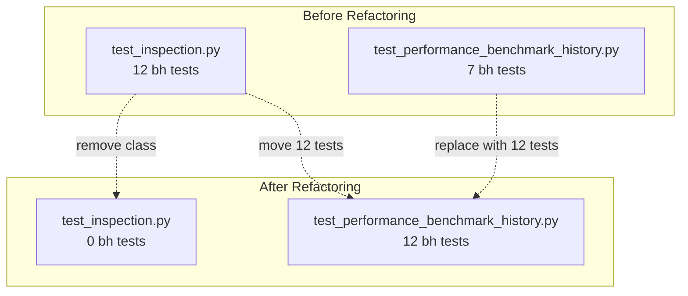

# Benchmark History API Test — 파일 분리 리팩터링 계획

> **목적**: `TestPerformanceBenchmarkHistory`를 `test_inspection.py`에서 분리하여 전용 파일로 이관
> **이유**: 중복 해소 (12-test comprehensive version으로 통일) + 유지보수성 개선

---

## 1. 현재 중복 현황

| 파일 | 클래스 | 테스트 수 | 상태 |
|------|--------|-----------|------|
| [`tests/api/test_inspection.py:759`](../tests/api/test_inspection.py:759) | `TestPerformanceBenchmarkHistory` | **12 tests** ✅ (보정사항 반영, comprehensive) | 이관할 대상 |
| [`tests/api/test_performance_benchmark_history.py`](../tests/api/test_performance_benchmark_history.py) | `TestPerformanceBenchmarkHistory` | **7 tests** ❌ (이전 버전, coverage 부족) | 교체 대상 |

### 별도 파일(7 tests)에서 누락된 항목

- `test_point_field_types` — nullable vs non-nullable 타입 검증
- `test_invalid_strategy_id_400` — strategy_id UUID 검증
- `test_unknown_account_returns_valid_shape` — empty result shape 검증
- Field-level detail (top-level 7개 필드 각각 타입 확인, `test_200_response_shape`보다 단순)

---

## 2. 변경 파일 및 상세 내역

### 파일 1: [`tests/api/test_performance_benchmark_history.py`](../tests/api/test_performance_benchmark_history.py) — **재작성**

| 항목 | 결정 사항 | 근거 |
|------|----------|------|
| Module-level `_get_account_id()` | **유지** (파일 내부) | 사용자 권장사항, conftest로 올리면 공용 helper 증가 |
| `empty_client` import | **추가`# noqa: F401`** | `test_unknown_account_returns_valid_shape`에서 필요 |
| `date` import | **제거** | 12-test version에서 `date` 미사용 |
| `TestClient` import | **유지** | 모든 테스트에서 사용 |
| `client` fixture import | **유지** (`# noqa: F401`) | 대부분의 테스트에서 사용 |
| `empty_client` fixture import | **추가** (`# noqa: F401`) | `test_unknown_account_returns_valid_shape`에서 사용 |
| Docstring | **재작성** | 12개 테스트 전체 범위 명시 |
| `self._get_account_id(client)` → `_get_account_id(client)` | **변경** | module-level 함수로 호출 방식 통일 |

**최종 imports**:
```python
from __future__ import annotations

from fastapi.testclient import TestClient

from tests.api.conftest import client  # noqa: F401
from tests.api.conftest import empty_client  # noqa: F401
```

**테스트 구조** (12 tests, 4개 그룹):
| 그룹 | 테스트 | 설명 |
|------|--------|------|
| **A. Shape** (3) | `test_200_response_shape` | Top-level 7개 필드 + 기본 KOSPI |
| | `test_point_field_shape` | Point 9개 필드 존재 |
| | `test_point_field_types` | Non-nullable(int/bool) vs nullable(float\|None) |
| **B. total_days+정렬** (2) | `test_total_days_matches_points_length` | `total_days == len(points)` |
| | `test_points_ascending_order` | Date 오름차순 |
| **C. Validation** (6) | `test_invalid_account_id_400` | 6개 validation error |
| | ~ `test_invalid_strategy_id_400` | |
| **D. Empty** (1) | `test_unknown_account_returns_valid_shape` | Unknown account → 200 + valid shape |

### 파일 2: [`tests/api/test_inspection.py`](../tests/api/test_inspection.py) — **제거**

| 작업 | 상세 |
|------|------|
| **제거 범위** | `TestPerformanceBenchmarkHistory` 클래스 전체 (lines 759-1048, ~290 lines) |
| **Docstring 수정** | ❌ 불필요 — 기존 docstring(line 1-9)에 `/performance-benchmark-history`가 언급되지 않음 |
| **Import 수정** | ❌ 불필요 — `test_inspection.py`는 `client`만 import, `empty_client`는 `TestPerformanceMetrics`에서 자체 import 없이 fixture로 사용 |

### 파일 3: [`plans/benchmark_history_api_test_and_date_coverage.md`](plans/benchmark_history_api_test_and_date_coverage.md) — **업데이트**

변경 파일 목록, 실행 단계, 제약 조건 점검을 리팩터링 결과에 맞게 갱신.

---

## 3. 실행 단계

| 단계 | 작업 | 명령어 / 상세 |
|------|------|---------------|
| **Step 1** | `test_performance_benchmark_history.py` 재작성 | 12-test version으로 전체 교체. `_get_account_id()` module-level 유지, `self.` → module-level 호출로 변경 |
| **Step 2** | `test_inspection.py`에서 `TestPerformanceBenchmarkHistory` 제거 | Lines 759-1048 삭제 |
| **Step 3** | Docstring/imports 정합성 확인 | `test_inspection.py` docstring 불필요; `test_performance_benchmark_history.py` imports 정확 |
| **Step 4** | 계획 문서 업데이트 | `plans/benchmark_history_api_test_and_date_coverage.md` |
| **Step 5** | ✅ `test_performance_benchmark_history.py` 실행 | `python3 -m pytest tests/api/test_performance_benchmark_history.py -q` |
| **Step 6** | ✅ `test_inspection.py` 실행 (회귀 확인) | `python3 -m pytest tests/api/test_inspection.py -q` |
| **Step 7** | ✅ 두 파일 동시 실행 | `python3 -m pytest tests/api/test_performance_benchmark_history.py tests/api/test_inspection.py -q` |
| **Step 8** | 완료 보고 | 7개 항목 보고서 |

---

## 4. 분리 전후 테스트 통과 수 비교

| 시나리오 | 분리 전 | 분리 후 | 예상 |
|----------|---------|---------|------|
| `test_inspection.py` | 68 passed (56 original + 12 bh) | **56 passed** | bh 테스트가 빠지므로 감소 |
| `test_performance_benchmark_history.py` | 7 passed | **12 passed** | coverage 증가 |
| `tests/api/` 전체 | 68 + 7 = 75 (중복) | **68 passed (56 + 12)** | 중복 제거로 68로 수렴 |

> ❗ **주의**: 분리 전에는 중복 실행으로 75개가 통과했으나, 이는 56 + 12(bh in inspection) + 7(bh in separate file) 구조. 중복 제거 후 56 + 12 = 68로 정상.

---

## 5. Mermaid: 파일 의존성 구조



---

## 6. 제약 조건 점검

| 제약 조건 | 상태 | 설명 |
|-----------|------|------|
| endpoint 구현 코드 변경 금지 | ✅ 준수 | 변경 없음 |
| schema 변경 금지 | ✅ 준수 | 변경 없음 |
| service 계산 로직 변경 금지 | ✅ 준수 | 변경 없음 |
| benchmark semantics 변경 금지 | ✅ 준수 | 변경 없음 |
| DB migration 금지 | ✅ 준수 | 변경 없음 |
| admin UI 변경 금지 | ✅ 준수 | 변경 없음 |
| 테스트 로직 의미 변경 금지 | ✅ 준수 | 12-test version 그대로 이관, 추가/변경 없음 |
| 파일 분리 + 문서/주석 정합성만 | ✅ 준수 | docstring/imports만 정리 |
| paper/live 동일 시스템 원칙 | ✅ 준수 | 테스트 구조만 변경 |
