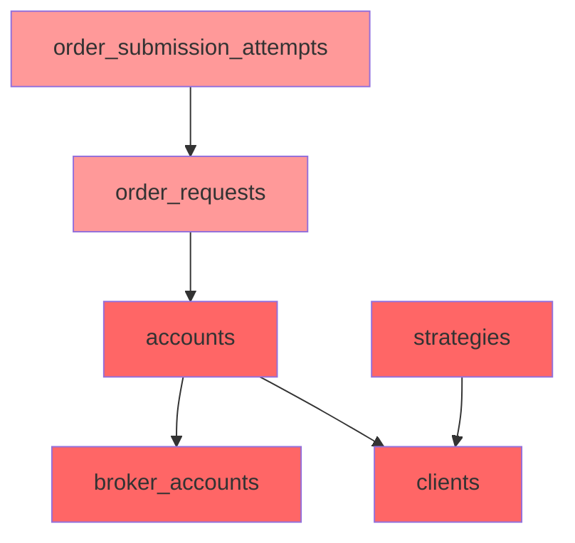

# E2E 계좌 완전 삭제 전략 설계

## 1. 현재 DB 상태 요약

### 계좌 현황 (총 2개)
| account_code | client_code | broker_account_ref | 보존 |
|---|---|---|---|
| **EPC001-PAPER-ENTRYPOINT** | EPC001 | 50186448 (koreainvestment) | ✅ 보존 |
| **E2E-SUMMARY-001** | E2E-SUMMARY-CLIENT | E2E-SUMMARY-BA-REF (KOREA_INVESTMENT) | ❌ 삭제 |

### 추가 클라이언트 (삭제 제외)
| client_code | 비고 |
|---|---|
| LOCK_TEST_f874f646 | 별도 테스트 클라이언트 — **보존** |

### E2E-SUMMARY-001 연결 데이터 (실제 DB 조회 결과)

| 테이블 | 건수 | FK 컬럼 | 비고 |
|--------|------|---------|------|
| `order_requests` | **2건** | account_id | E2E-ORD-SUMMARY-001, E2E-ORD-SUMMARY-NOATT |
| `order_submission_attempts` | **3건** | order_request_id | 모두 E2E-ORD-SUMMARY-001에 연결 |
| `broker_orders` | 0건 | order_request_id | - |
| `fill_events` | 0건 | broker_order_id 경유 | - |
| `order_state_events` | 0건 | order_request_id | - |
| `execution_attempts` | 0건 | order_request_id | nullable |
| `guardrail_evaluations` | 0건 | order_request_id | nullable |
| `reconciliation_order_links` | 0건 | order_request_id | - |
| `decision_contexts` | 0건 | account_id | - |
| `position_snapshots` | 0건 | account_id | - |
| `cash_balance_snapshots` | 0건 | account_id | - |
| `trading_sessions` | 0건 | account_id | - |
| `reconciliation_runs` | 0건 | account_id | - |
| `risk_limit_snapshots` | 0건 | account_id | - |
| `order_blocking_locks` | 0건 | account_id | - |

### E2E-SUMMARY-CLIENT 연결 데이터

| 테이블 | 건수 | 비고 |
|--------|------|------|
| `strategies` | **1건** | E2E-SUMMARY-STRAT (strategy_versions: 0건) |
| `config_versions` | 0건 | - |
| `decision_contexts` | 0건 | strategy_id로도 0건 |

## 2. 옵션 분석 및 선택

### 옵션 A: 계좌 + order_requests만 삭제 (최소)
- 장점: 영향 범위 최소, 빠름
- 단점: E2E-SUMMARY-CLIENT, broker_account, strategy가 orphan으로 잔류
- 평가: 요구사항 충족에는 미달 (데이터 정리 목적에 부적합)

### 옵션 B: 계좌 + 브로커 계정 + 클라이언트 + 전략까지 완전 삭제 (선택)
- 장점: E2E 관련 모든 데이터 완전 제거, 운영 데이터에 영향 없음
- 단점: 삭제 대상이 더 많음 (그러나 E2E 전용 데이터이므로 안전)
- **평가: ✅ 최적 — E2E-SUMMARY-CLIENT는 E2E-SUMMARY-001만 참조, E2E-SUMMARY-STRAT도 E2E-SUMMARY-CLIENT만 참조이므로 완전 삭제해도 안전**

### 옵션 C: Python 스크립트로 구현
- 장점: 검증 로직 포함 가능
- 단점: 단순 DELETE로 충분한 작업에 오버엔지니어링
- 평가: SQL 스크립트로 충분 (트랜잭션 내 실행)

### 최종 선택: **옵션 B — SQL 스크립트로 완전 삭제**

선택 근거:
1. E2E-SUMMARY-CLIENT는 E2E-SUMMARY-001 account만 참조 중 (다른 account 없음)
2. E2E-SUMMARY-STRAT strategy도 E2E-SUMMARY-CLIENT만 참조 중 (다른 클라이언트에서 사용 안 함)
3. 모든 데이터가 E2E 전용이므로 완전 삭제해도 운영에 전혀 영향 없음
4. LOCK_TEST_f874f646 client는 별도 데이터이므로 보존

## 3. 전체 삭제 순서 (의존성 그래프)

### 의존성 그래프



### 단계별 삭제 순서

```
Phase 1 ─ order_submission_attempts  (order_request_id IN E2E orders)
    ↓
Phase 2 ─ order_requests             (account_id = E2E account)
    ↓
Phase 3 ─ strategies                 (client_id = E2E-SUMMARY-CLIENT)
    ↓
Phase 4 ─ accounts                   (account_code = 'E2E-SUMMARY-001')
    ↓
Phase 5 ─ broker_accounts            (account_ref = 'E2E-SUMMARY-BA-REF')
    ↓
Phase 6 ─ clients                    (client_code = 'E2E-SUMMARY-CLIENT')
```

### 상세 FK 의존성 분석

**accounts (E2E-SUMMARY-001) → 8개 자식 테이블**
- 모두 `delete_rule = 'NO ACTION'` → 수동 순차 삭제 필요
- 실제 데이터 있는 것만: `order_requests` (2건)
- 나머지 7개: 모두 0건이므로 DELETE 불필요

**order_requests (E2E 2건) → 7개 자식 테이블**
- 실제 데이터 있는 것만: `order_submission_attempts` (3건)
- broker_orders: 0건 (→ broker_orders를 통한 fill_events도 0건)
- order_state_events, execution_attempts, guardrail_evaluations, reconciliation_order_links: 0건
- trade_decisions: order_request_id FK 없음 (order_requests가 trade_decision_id FK 가짐)

**clients (E2E-SUMMARY-CLIENT) → 3개 자식 테이블**
- accounts: 1건 (삭제 대상 — Phase 4에서 삭제)
- strategies: 1건 (삭제 대상 — Phase 3에서 삭제)
- config_versions: 0건

**strategies (E2E-SUMMARY-STRAT) → 5개 자식 테이블**
- strategy_versions: 0건
- feature_snapshots: 0건
- decision_contexts: 0건
- trade_decisions: 0건
- order_blocking_locks: 0건

## 4. SQL 스크립트

```sql
-- ============================================================================
-- E2E-SUMMARY-001 계좌 완전 삭제 스크립트
-- 옵션 B: 계좌 + 브로커 계정 + 클라이언트 + 전략까지 완전 삭제
--
-- 실행 전 주의사항:
--   1. 반드시 트랜잭션 내에서 실행 (BEGIN; ... COMMIT; or ROLLBACK;)
--   2. 운영 시간 외에 실행 권장
--   3. 사전 백업 필수
-- ============================================================================

BEGIN;

-- ==================================================================
-- Phase 0: 삭제 대상 UUID 확인 (SELECT로 사전 검증)
-- ==================================================================
-- 확인용 쿼리 (실제 DELETE 전에 반드시 실행)
-- SELECT account_id FROM trading.accounts WHERE account_code = 'E2E-SUMMARY-001';
-- SELECT client_id FROM trading.clients WHERE client_code = 'E2E-SUMMARY-CLIENT';
-- SELECT broker_account_id FROM trading.broker_accounts WHERE account_ref = 'E2E-SUMMARY-BA-REF';

-- ==================================================================
-- Phase 1: order_submission_attempts 삭제 (order_request_id → E2E orders)
-- ==================================================================
DELETE FROM trading.order_submission_attempts osa
WHERE osa.order_request_id IN (
    SELECT orq.order_request_id
    FROM trading.order_requests orq
    JOIN trading.accounts a ON a.account_id = orq.account_id
    WHERE a.account_code = 'E2E-SUMMARY-001'
);
-- 예상 삭제 건수: 3건

-- ==================================================================
-- Phase 2: order_requests 삭제 (account_id → E2E account)
-- ==================================================================
DELETE FROM trading.order_requests orq
USING trading.accounts a
WHERE a.account_id = orq.account_id
  AND a.account_code = 'E2E-SUMMARY-001';
-- 예상 삭제 건수: 2건

-- ==================================================================
-- Phase 3: strategies 삭제 (client_id → E2E-SUMMARY-CLIENT)
-- 자식 테이블(strategy_versions, feature_snapshots, decision_contexts,
-- trade_decisions, order_blocking_locks) 데이터 0건 확인 완료
-- ==================================================================
DELETE FROM trading.strategies s
USING trading.clients c
WHERE c.client_id = s.client_id
  AND c.client_code = 'E2E-SUMMARY-CLIENT';
-- 예상 삭제 건수: 1건

-- ==================================================================
-- Phase 4: accounts 삭제
-- ==================================================================
DELETE FROM trading.accounts
WHERE account_code = 'E2E-SUMMARY-001';
-- 예상 삭제 건수: 1건

-- ==================================================================
-- Phase 5: broker_accounts 삭제
-- ==================================================================
DELETE FROM trading.broker_accounts
WHERE account_ref = 'E2E-SUMMARY-BA-REF';
-- 예상 삭제 건수: 1건

-- ==================================================================
-- Phase 6: clients 삭제
-- ==================================================================
DELETE FROM trading.clients
WHERE client_code = 'E2E-SUMMARY-CLIENT';
-- 예상 삭제 건수: 1건

COMMIT;
-- ROLLBACK;  -- 문제 발생 시
```

### 실행 전 사전 검증 SQL

```sql
-- 1) 삭제 대상 account 확인
SELECT account_id, account_code, account_alias, environment, status
FROM trading.accounts
WHERE account_code = 'E2E-SUMMARY-001';

-- 2) 삭제 대상 client 확인
SELECT client_id, client_code, name, status
FROM trading.clients
WHERE client_code = 'E2E-SUMMARY-CLIENT';

-- 3) E2E account 참조하는 order_requests 및 자식 데이터 건수
SELECT 'order_requests' as tbl, count(*) as cnt
FROM trading.order_requests orq
JOIN trading.accounts a ON a.account_id = orq.account_id
WHERE a.account_code = 'E2E-SUMMARY-001'
UNION ALL
SELECT 'order_submission_attempts', count(*)
FROM trading.order_submission_attempts osa
JOIN trading.order_requests orq ON orq.order_request_id = osa.order_request_id
JOIN trading.accounts a ON a.account_id = orq.account_id
WHERE a.account_code = 'E2E-SUMMARY-001';

-- 4) E2E client의 strategies 및 자식 데이터
SELECT 'strategies', count(*)
FROM trading.strategies s
JOIN trading.clients c ON c.client_id = s.client_id
WHERE c.client_code = 'E2E-SUMMARY-CLIENT'
UNION ALL
SELECT 'strategy_versions', count(*)
FROM trading.strategy_versions sv
JOIN trading.strategies s ON s.strategy_id = sv.strategy_id
JOIN trading.clients c ON c.client_id = s.client_id
WHERE c.client_code = 'E2E-SUMMARY-CLIENT';

-- 5) 삭제 후 E2E account가 다른 곳에서 참조되지 않는지 확인
-- accounts를 참조하는 8개 테이블 중 order_requests 외에 데이터 있는지 확인
SELECT 'position_snapshots', count(*)
FROM trading.position_snapshots ps
JOIN trading.accounts a ON a.account_id = ps.account_id
WHERE a.account_code = 'E2E-SUMMARY-001'
UNION ALL
SELECT 'cash_balance_snapshots', count(*)
FROM trading.cash_balance_snapshots cbs
JOIN trading.accounts a ON a.account_id = cbs.account_id
WHERE a.account_code = 'E2E-SUMMARY-001'
UNION ALL
SELECT 'trading_sessions', count(*)
FROM trading.trading_sessions ts
JOIN trading.accounts a ON a.account_id = ts.account_id
WHERE a.account_code = 'E2E-SUMMARY-001'
UNION ALL
SELECT 'reconciliation_runs', count(*)
FROM trading.reconciliation_runs rr
JOIN trading.accounts a ON a.account_id = rr.account_id
WHERE a.account_code = 'E2E-SUMMARY-001'
UNION ALL
SELECT 'risk_limit_snapshots', count(*)
FROM trading.risk_limit_snapshots rls
JOIN trading.accounts a ON a.account_id = rls.account_id
WHERE a.account_code = 'E2E-SUMMARY-001'
UNION ALL
SELECT 'decision_contexts', count(*)
FROM trading.decision_contexts dc
JOIN trading.accounts a ON a.account_id = dc.account_id
WHERE a.account_code = 'E2E-SUMMARY-001'
UNION ALL
SELECT 'order_blocking_locks', count(*)
FROM trading.order_blocking_locks obl
JOIN trading.accounts a ON a.account_id = obl.account_id
WHERE a.account_code = 'E2E-SUMMARY-001';
```

## 5. 검증 계획

### 삭제 전 검증 (Pre-delete Validation)

```sql
-- 1) 운영 계좌 데이터 건수 스냅샷
SELECT 'EPC001-PAPER-ENTRYPOINT' as account, count(*) as order_count
FROM trading.order_requests orq
JOIN trading.accounts a ON a.account_id = orq.account_id
WHERE a.account_code = 'EPC001-PAPER-ENTRYPOINT';
```

### 삭제 후 검증 (Post-delete Validation)

```sql
-- 1) E2E 데이터 완전 삭제 확인 (모두 0건이어야 함)
SELECT 'accounts' as tbl, count(*) as cnt
FROM trading.accounts
WHERE account_code = 'E2E-SUMMARY-001'
UNION ALL
SELECT 'clients', count(*)
FROM trading.clients
WHERE client_code = 'E2E-SUMMARY-CLIENT'
UNION ALL
SELECT 'broker_accounts', count(*)
FROM trading.broker_accounts
WHERE account_ref = 'E2E-SUMMARY-BA-REF'
UNION ALL
SELECT 'strategies', count(*)
FROM trading.strategies s
JOIN trading.clients c ON c.client_id = s.client_id
WHERE c.client_code = 'E2E-SUMMARY-CLIENT'
UNION ALL
SELECT 'order_requests', count(*)
FROM trading.order_requests orq
JOIN trading.accounts a ON a.account_id = orq.account_id
WHERE a.account_code = 'E2E-SUMMARY-001'
UNION ALL
SELECT 'order_submission_attempts', count(*)
FROM trading.order_submission_attempts osa
JOIN trading.order_requests orq ON orq.order_request_id = osa.order_request_id
JOIN trading.accounts a ON a.account_id = orq.account_id
WHERE a.account_code = 'E2E-SUMMARY-001';

-- 2) 운영 데이터 보존 확인
SELECT 'EPC001-PAPER-ENTRYPOINT_exists' as check_name,
       CASE WHEN EXISTS (SELECT 1 FROM trading.accounts WHERE account_code = 'EPC001-PAPER-ENTRYPOINT')
            THEN '✅ 보존' ELSE '❌ 삭제됨' END as result
UNION ALL
SELECT 'EPC001_client_exists',
       CASE WHEN EXISTS (SELECT 1 FROM trading.clients WHERE client_code = 'EPC001')
            THEN '✅ 보존' ELSE '❌ 삭제됨' END as result
UNION ALL
SELECT '50186448_broker_exists',
       CASE WHEN EXISTS (SELECT 1 FROM trading.broker_accounts WHERE account_ref = '50186448')
            THEN '✅ 보존' ELSE '❌ 삭제됨' END as result
UNION ALL
SELECT 'LOCK_TEST_client_exists',
       CASE WHEN EXISTS (SELECT 1 FROM trading.clients WHERE client_code = 'LOCK_TEST_f874f646')
            THEN '✅ 보존' ELSE '❌ 삭제됨' END as result;
```

### API 검증

```bash
# 1) GET /clients/default → EPC001만 응답 (E2E-SUMMARY-CLIENT는 없어야 함)
# 2) GET /accounts → EPC001-PAPER-ENTRYPOINT만 응답
# 3) GET /orders?account_code=E2E-SUMMARY-001 → 404 또는 빈 응답
```

## 6. 롤백 계획

### 사전 백업 (필수)

```sql
-- 백업 테이블 생성 및 데이터 백업
CREATE TABLE trading._backup_20260531_e2e_cleanup_accounts AS
SELECT * FROM trading.accounts WHERE account_code = 'E2E-SUMMARY-001';

CREATE TABLE trading._backup_20260531_e2e_cleanup_clients AS
SELECT * FROM trading.clients WHERE client_code = 'E2E-SUMMARY-CLIENT';

CREATE TABLE trading._backup_20260531_e2e_cleanup_broker_accounts AS
SELECT * FROM trading.broker_accounts WHERE account_ref = 'E2E-SUMMARY-BA-REF';

CREATE TABLE trading._backup_20260531_e2e_cleanup_strategies AS
SELECT s.* FROM trading.strategies s
JOIN trading.clients c ON c.client_id = s.client_id
WHERE c.client_code = 'E2E-SUMMARY-CLIENT';

CREATE TABLE trading._backup_20260531_e2e_cleanup_order_requests AS
SELECT orq.* FROM trading.order_requests orq
JOIN trading.accounts a ON a.account_id = orq.account_id
WHERE a.account_code = 'E2E-SUMMARY-001';

CREATE TABLE trading._backup_20260531_e2e_cleanup_order_submission_attempts AS
SELECT osa.* FROM trading.order_submission_attempts osa
JOIN trading.order_requests orq ON orq.order_request_id = osa.order_request_id
JOIN trading.accounts a ON a.account_id = orq.account_id
WHERE a.account_code = 'E2E-SUMMARY-001';
```

### 롤백 SQL (복원)

```sql
-- 역순으로 복원
-- Phase 6: clients 복원
INSERT INTO trading.clients (client_id, client_code, name, status, base_currency, created_at, updated_at)
SELECT client_id, client_code, name, status, base_currency, created_at, updated_at
FROM trading._backup_20260531_e2e_cleanup_clients;

-- Phase 5: broker_accounts 복원
INSERT INTO trading.broker_accounts (broker_account_id, broker_name, account_ref, environment, credential_ref, base_url, status, created_at, updated_at, broker_account_code)
SELECT broker_account_id, broker_name, account_ref, environment, credential_ref, base_url, status, created_at, updated_at, broker_account_code
FROM trading._backup_20260531_e2e_cleanup_broker_accounts;

-- Phase 4: accounts 복원
INSERT INTO trading.accounts (account_id, client_id, broker_account_id, environment, account_alias, account_masked, status, risk_profile, created_at, updated_at, account_code)
SELECT account_id, client_id, broker_account_id, environment, account_alias, account_masked, status, risk_profile, created_at, updated_at, account_code
FROM trading._backup_20260531_e2e_cleanup_accounts;

-- Phase 3: strategies 복원
INSERT INTO trading.strategies (strategy_id, client_id, strategy_code, name, asset_class, status, description, created_at, updated_at)
SELECT strategy_id, client_id, strategy_code, name, asset_class, status, description, created_at, updated_at
FROM trading._backup_20260531_e2e_cleanup_strategies;

-- Phase 2: order_requests 복원
INSERT INTO trading.order_requests (order_request_id, account_id, trade_decision_id, instrument_id, client_order_id, idempotency_key, correlation_id, side, order_type, time_in_force, requested_price, requested_quantity, status, status_reason_code, status_reason_message, submitted_at, created_at, updated_at, decision_context_id, order_intent_id)
SELECT order_request_id, account_id, trade_decision_id, instrument_id, client_order_id, idempotency_key, correlation_id, side, order_type, time_in_force, requested_price, requested_quantity, status, status_reason_code, status_reason_message, submitted_at, created_at, updated_at, decision_context_id, order_intent_id
FROM trading._backup_20260531_e2e_cleanup_order_requests;

-- Phase 1: order_submission_attempts 복원
INSERT INTO trading.order_submission_attempts (attempt_id, order_request_id, attempt_number, submitted_at, broker_name, accepted, broker_native_order_id, broker_status, raw_code, raw_message, error_type, retryable, http_status, request_payload_uri, response_payload_uri, duration_ms, created_at)
SELECT attempt_id, order_request_id, attempt_number, submitted_at, broker_name, accepted, broker_native_order_id, broker_status, raw_code, raw_message, error_type, retryable, http_status, request_payload_uri, response_payload_uri, duration_ms, created_at
FROM trading._backup_20260531_e2e_cleanup_order_submission_attempts;

-- 백업 테이블 정리 (복원 확인 후)
-- DROP TABLE IF EXISTS trading._backup_20260531_e2e_cleanup_accounts;
-- DROP TABLE IF EXISTS trading._backup_20260531_e2e_cleanup_clients;
-- DROP TABLE IF EXISTS trading._backup_20260531_e2e_cleanup_broker_accounts;
-- DROP TABLE IF EXISTS trading._backup_20260531_e2e_cleanup_strategies;
-- DROP TABLE IF EXISTS trading._backup_20260531_e2e_cleanup_order_requests;
-- DROP TABLE IF EXISTS trading._backup_20260531_e2e_cleanup_order_submission_attempts;
```

## 7. 리스크 분석

| 리스크 | 영향 | 확률 | 대응 |
|--------|------|------|------|
| **실수로 운영 계좌 삭제** | 치명적 | 낮음 | WHERE 조건에 `account_code = 'E2E-SUMMARY-001'`로 정확히 지정, 실행 전 SELECT로 검증 |
| **트랜잭션 중단 시 부분 삭제** | 데이터 정합성 깨짐 | 낮음 | 전체를 단일 트랜잭션(BEGIN/COMMIT)으로 실행하여 원자성 보장 |
| **FK 제약 조건 위반** | SQL 에러 | 낮음 | 삭제 순서를 FK 의존성 역순으로 정확히 구성 |
| **스키마 변경으로 인한 호환성 문제** | SQL 실패 | 낮음 | 최신 마이그레이션(0028)까지 반영된 스키마 기준으로 SQL 작성 |
| **E2E 데이터가 운영 데이터와 연결됨** | 의도치 않은 운영 데이터 영향 | 없음 | E2E-SUMMARY-001는 EPC001-PAPER-ENTRYPOINT와 완전히 분리된 데이터 |
| **LOCK_TEST client 영향** | 불필요한 삭제 | 없음 | WHERE 조건으로 E2E-SUMMARY-CLIENT만 정확히 지정 |

### 안전장치 요약

1. **트랜잭션 래핑**: 전체 삭제를 단일 트랜잭션으로 실행 → 문제 발생 시 `ROLLBACK`
2. **사전 백업**: 각 테이블의 삭제 대상 데이터를 백업 테이블에 저장
3. **사전 검증 쿼리**: DELETE 실행 전 SELECT로 삭제 대상 정확히 확인
4. **삭제 후 검증 쿼리**: 모든 E2E 데이터가 0건이고 운영 데이터가 보존되었는지 확인
5. **운영 시간 외 실행**: 장애 영향 최소화
6. **복원 스크립트 준비**: 롤백 시 역순으로 정확히 복원 가능

## 8. 최종 체크리스트

### 실행 전
- [ ] 운영 시간 외인지 확인
- [ ] 사전 백업 SQL 실행 (백업 테이블 생성)
- [ ] 검증 쿼리 실행하여 삭제 대상 데이터 정확히 확인
- [ ] 운영 계좌(EPC001-PAPER-ENTRYPOINT) 데이터 건수 스냅샷 저장
- [ ] `.env` 파일 수정 금지

### 실행
- [ ] 트랜잭션 시작 (BEGIN)
- [ ] Phase 1~6 순차 실행
- [ ] 각 Phase별 삭제 건수 확인
- [ ] COMMIT (또는 문제 시 ROLLBACK)

### 실행 후
- [ ] 검증 쿼리 실행 (E2E 데이터 0건, 운영 데이터 보존)
- [ ] 백업 테이블 정리 (선택사항)
- [ ] API 동작 확인 (GET /clients/default, GET /accounts)
