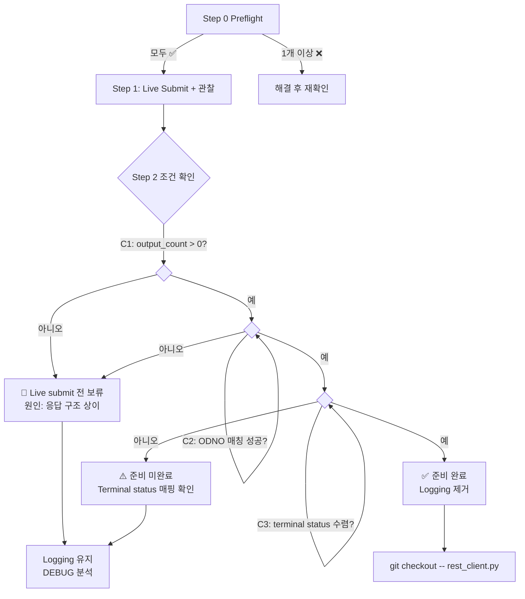

# Live 환경 전환 운영 계획 — Preflight → Submit → 판정

> **목적**: Paper submit 성공 경로(`APPROVE → SUBMITTED → ODNO → post-submit sync`)를 기반으로, Live 환경 최초 submit 시 운영자가 따라야 할 전 단계를 정의한다.
> **선행 문서**:
> - [`live_verification_prerequisites.md`](plans/live_verification_prerequisites.md) — Preflight 체크리스트 (env, token, snapshot, sync loop)
> - [`inquire_daily_ccld_payload_capture_report.md`](plans/inquire_daily_ccld_payload_capture_report.md) — 계측 logging 제거 조건 (3가지)
> - [`paper_submit_success_docs_final_report.md`](plans/paper_submit_success_docs_final_report.md) — Paper 실증 결과 요약
> - [`paper_mock_boundary_validation_scope.md`](plans/paper_mock_boundary_validation_scope.md) — Paper mock 한계 문서화
> - [`post_submit_sync_e2e_report.md`](plans/post_submit_sync_e2e_report.md) — Phase A E2E 검증 결과
> - [`paper_submit_smoke_ops_checklist.md`](plans/paper_submit_smoke_ops_checklist.md) — 운영 체크리스트 (성공 기준)
> 
> **제약**:
> - 본 문서는 **실행 계획**을 정의한다. 실제 Live submit은 본 문서 범위 외.
> - Live 주문 실행은 별도 절차로 수행.
> - production 코드 변경 금지, admin UI 변경 금지, broker submit semantics 변경 금지.

---

## 목차

- [Step 0: Live 전환 전 Preflight](#step-0-live-전환-전-preflight)
- [Step 1: 최초 Live Submit 관찰](#step-1-최초-live-submit-관찰)
- [Step 2: Instrumentation 제거 조건 재확인](#step-2-instrumentation-제거-조건-재확인)
- [Step 3: 판정 체계](#step-3-판정-체계)
- [운영 순서 요약](#운영-순서-요약)
- [다음 직접 액션](#다음-직접-액션)

---

## Step 0: Live 전환 전 Preflight

> 상세 절차는 [`live_verification_prerequisites.md`](plans/live_verification_prerequisites.md) 참조.  
> 아래는 Preflight 체크리스트 요약이며, **6개 항목이 모두 ✅여야 Step 1 진행 가능**.

### Preflight 체크리스트

| # | 항목 | 확인 명령어 / 방법 | 기준 | 관련 문서 |
|---|------|-------------------|------|----------|
| 0.1 | **장중 여부** | `TZ='Asia/Seoul' date '+%Y-%m-%d %H:%M:%S %A'` | 월~금, 08:30~15:30 KST | [`#1`](plans/live_verification_prerequisites.md:10) |
| 0.2 | **`KIS_ENV=real` 확인** | `bash -c 'set -a && source .env && set +a && echo $KIS_ENV'` | `real` (paper 아님) | [`#2.2`](plans/live_verification_prerequisites.md:43) |
| 0.3 | **Live API key/secret 확인** | 위 명령어로 `KIS_APP_KEY`/`KIS_APP_SECRET` 출력 확인 | Paper와 다른 Live 전용 key | [`#2.2`](plans/live_verification_prerequisites.md:43) |
| 0.4 | **Token cache 삭제** | `ls -la .cache/kis_token.json` 존재 시 `rm -f .cache/kis_token.json` | Paper token cache 제거 | [`#2.3`](plans/live_verification_prerequisites.md:55) |
| 0.5 | **Snapshot freshness** | `snapshot_sync_runs` 최근 5건 조회 (SQL) | 5분 이내, status=`completed` | [`#3`](plans/live_verification_prerequisites.md:69) |
| 0.6 | **Sync loop / submit 경로 확인** | `ls scripts/run_post_submit_sync_loop.py scripts/run_orchestrator_once.py` | 두 스크립트 모두 존재 | [`#4`](plans/live_verification_prerequisites.md:102) |
| 0.7 | **Logging 유지 상태 확인** | `grep -n 'inquire-daily-ccld' src/agent_trading/brokers/koreainvestment/rest_client.py \| head -5` | DEBUG/INFO logging 존재 (제거되지 않음) | [`inquire_daily_ccld_payload_capture_report.md#1`](plans/inquire_daily_ccld_payload_capture_report.md:3) |

### Preflight 판정

```
모든 항목 ✅  → Step 1 (Live Submit + 관찰) 진행 가능
1개 이상 ❌  → Step 1 진행 불가. 해당 항목 해결 후 재확인
```

> **참고**: 장중이 아닐 경우(`0.1 ❌`), Step 0.5 snapshot freshness도 만료되므로 모든 Preflight가 의미 없음.  
> `KIS_SNAPSHOT_STALE_THRESHOLD_SECONDS` 기본값 300초(5분)이므로, 장중에 snapshot sync 실행 필요.

---

## Step 1: 최초 Live Submit 관찰

Step 0이 모두 ✅이면 Live submit을 실행합니다. 아래는 **실행 전/중/후 관찰 체크리스트**입니다.

### 1.1 Submit 실행 전 확인

```bash
# Dry-run으로 APPROVE 사전 확인 (선택 — risk가 낮은 paper와 달리 Live는 필수 권장)
cd /workspace/agent_trading && bash -c 'set -a && source .env && set +a && python3 scripts/run_orchestrator_once.py --dry-run --output text'
```

| 관찰 항목 | 기대값 | 이상 징후 |
|-----------|--------|----------|
| `decision_type` | `APPROVE` | `HOLD`/`WATCH` → submit 불가. 원인 분석 필요 |
| 오류 발생 | 없음 | 예외 발생 시 즉시 중단 |

### 1.2 Submit 실행

```bash
cd /workspace/agent_trading && bash -c 'set -a && source .env && set +a && python3 scripts/run_orchestrator_once.py --submit --output text'
```

### 1.3 Submit 응답 관찰 항목

| # | 관찰 항목 | 확인 방법 | 기대값 | 이상 징후 |
|---|----------|----------|--------|----------|
| 1.3.1 | **Submit 자체 성공 여부** | 실행 로그 출력 | `status=SUBMITTED` 또는 `broker_native_order_id` 발급 메시지 | `ERROR` / 예외 발생 |
| 1.3.2 | **ODNO 발급 여부** | 로그에서 `broker_native_order_id` 검색 | `broker_native_order_id`에 numeric 값 존재 | 값이 `None`이거나 빈 문자열 |
| 1.3.3 | **`broker_status`** | 로그 출력 | `SUBMITTED` | `REJECTED` / `ERROR` → 즉시 원인 분석 |
| 1.3.4 | **`side` / `requested_quantity` 정확성** | 로그 출력 또는 DB 조회 | Paper 실증과 일치하는 값 | 비정상적인 side/수량 |

### 1.4 Post-Submit Sync 실행

```bash
cd /workspace/agent_trading && bash -c 'set -a && source .env && set +a && python3 scripts/run_post_submit_sync_loop.py --max-cycles 1'
```

### 1.5 Sync 실행 후 관찰 항목

| # | 관찰 항목 | 확인 방법 | 기대값 | 이상 징후 |
|---|----------|----------|--------|----------|
| 1.5.1 | **Sync cycle 결과** | 실행 로그 출력 | `orders>=1, errors=0` | errors > 0 |
| 1.5.2 | **`inquire-daily-ccld` 응답 row 수** | DEBUG logging `output_count=N` 확인 | `output_count > 0` (1 이상) | `output_count = 0` → Paper mock과 동일한 패턴 |
| 1.5.3 | **Response `ODNO` 목록** | DEBUG logging `odnos_in_response=[...]` 확인 | 발급받은 `broker_native_order_id`(ODNO)가 목록에 존재 | 목록에 없음 → ODNO 매칭 실패 |
| 1.5.4 | **ODNO 매칭 성공 여부** | INFO logging `ODNO match failure` 출력 확인 | **매칭 실패 로그 미출력** | `ODNO match failure` 로그 출력 |
| 1.5.5 | **`broker_status` → `normalized_status`** | DB `broker_orders` 조회 | FILLED / CANCELLED / REJECTED 중 하나 | `RECONCILE_REQUIRED`로 고정 (Paper와 동일) |
| 1.5.6 | **`order_state_events` 증가** | `SELECT COUNT(*) FROM order_state_events;` | 이전 대비 증가 (1건 이상) | 증가 없음 |
| 1.5.7 | **`last_synced_at` 갱신** | DB `broker_orders` 조회 | Paper submit 직후 시간으로 갱신 | 갱신되지 않음 (NULL 또는 이전 시간) |

### 1.6 관찰 결과 기록 양식

```
=== Live 1st Submit Observation ===
Date/Time: [YYYY-MM-DD HH:MM:SS KST]

1.3.1 Submit 성공:        [✅/❌] broker_native_order_id=[ODNO]
1.3.3 broker_status:      [SUBMITTED / REJECTED / ERROR]
1.3.4 side/qty:           [BUY/SELL] [quantity]

1.5.1 Sync cycle:         orders=[N], errors=[N]
1.5.2 output_count:       [N]
1.5.3 ODNO in response:   [✅ found / ❌ not found]
1.5.4 Match failure log:  [✅ none / ❌ found]
1.5.5 broker_status:      [FILLED / CANCELLED / REJECTED / RECONCILE_REQUIRED]
1.5.6 state_events:       [increased / not increased]
1.5.7 last_synced_at:     [updated / not updated]
```

---

## Step 2: Instrumentation 제거 조건 재확인

> 상세: [`inquire_daily_ccld_payload_capture_report.md#72-제거-조건-3개-모두-충족-시`](plans/inquire_daily_ccld_payload_capture_report.md)

### 제거 조건 3가지

아래 **3가지 조건이 모두 충족**되어야 instrumentation logging(`rest_client.py:896-928`)을 제거할 수 있습니다.

| # | 조건 | 관찰 항목 매핑 | 확인 방법 |
|---|------|---------------|----------|
| **C1** | Live `inquire-daily-ccld` payload 확인 | 1.5.2 `output_count > 0` | DEBUG logging에서 `first_item_fields`가 정상 출력되고 `output_count > 0` |
| **C2** | ODNO 매칭 성공 | 1.5.3 + 1.5.4 | `item.get("ODNO") == broker_order_id` 성공, INFO logging에 `ODNO match failure` 미출력 |
| **C3** | Terminal status 수렴 | 1.5.5 | `broker_status`가 FILLED / CANCELLED / REJECTED 중 하나로 수렴 |


### 제거 실행 명령

```bash
# 조건 C1/C2/C3 모두 충족 확인 후 실행
git checkout -- src/agent_trading/brokers/koreainvestment/rest_client.py
```

> **⚠️ 중요**: 3개 조건 중 **하나라도 실패**하면 logging을 유지하고 원인 분석.  
> C1/C2 실패 → Live `inquire-daily-ccld` 응답 구조가 코드 예상과 다를 가능성.  
> C3 실패 → Broker가 제공하는 terminal status mapping 재검토 필요.

---

## Step 3: 판정 체계

> Step 1 관찰 결과와 Step 2 제거 조건 충족 여부에 따라 최종 판정을 내립니다.

### 판정 기준

| 판정 | 조건 | 후속 조치 |
|------|------|----------|
| **✅ 준비 완료** | C1 ✅ AND C2 ✅ AND C3 ✅ | Instrumentation logging 제거 실행. 시스템 운영 기준 문서 업데이트 |
| **⚠️ 준비 미완료** | C1 ✅ AND C2 ✅ AND C3 ❌ | Terminal status 수렴만 실패. Broker 응답 매핑 확인 필요. Logging 유지 |
| **🔴 Live submit 전 보류** | C1 ❌ OR C2 ❌ | Live `inquire-daily-ccld` 응답 구조 또는 ODNO 매칭 로직에 문제. Logging 유지 + 원인 분석 후 재시도 |

### 판정 흐름도



---

## 운영 순서 요약

```
┌─────────────────────────────────────────────────────────┐
│  Live 환경 전환 운영 순서                                │
├─────────────────────────────────────────────────────────┤
│                                                         │
│  1. Preflight (Step 0)                                   │
│     0.1 장중 확인 ──❌→ 대기                              │
│     0.2 KIS_ENV=real ──❌→ .env 수정                     │
│     0.3 Live key/secret ──❌→ .env 수정                  │
│     0.4 Token cache 삭제                                │
│     0.5 Snapshot freshness ──❌→ snapshot sync 실행      │
│     0.6 Script 경로 확인                                │
│     0.7 Logging 유지 상태 확인                           │
│     → 모두 ✅면 Step 1                                   │
│                                                         │
│  2. Dry-run (Step 1.1, 선택 but 권장)                    │
│     decision_type=APPROVE 확인                           │
│                                                         │
│  3. Submit 실행 (Step 1.2)                              │
│     결과 관찰: ODNO 발급, broker_status, side/qty        │
│                                                         │
│  4. Post-Submit Sync 실행 (Step 1.4)                    │
│     결과 관찰: output_count, ODNO 매칭, status 수렴      │
│                                                         │
│  5. 판정 (Step 3)                                       │
│     ✅ 준비 완료  → logging 제거                         │
│     ⚠️ 준비 미완료 → logging 유지, terminal status 확인  │
│     🔴 보류        → logging 유지, 응답 구조 분석       │
│                                                         │
└─────────────────────────────────────────────────────────┘
```

---

## 위험 대응

| 상황 | 대응 |
|------|------|
| **Dry-run에서 APPROVE가 나오지 않음** | Paper과 달리 Live에서는 event 데이터 품질을 조정할 수 없음. 실제 OpenDART 공시 데이터의 품질이 AI 결정을 좌우. `event_interpretation.py` 로그에서 AI 판단 근거 확인 필요 |
| **Submit 응답이 `REJECTED`** | Broker가 주문을 거절. `msg_cd` 값 확인. 가능한 원인: 가격 제한 초과, 계좌 상태 이상, 수량 부족 |
| **`output_count = 0`** | Paper mock과 동일한 패턴. Live `inquire-daily-ccld`가 실제로 빈 배열을 반환하는지, 아니면 다른 파라미터가 필요한지 확인 |
| **ODNO 매칭 실패** | DEBUG logging에서 `odnos_in_response`와 `broker_order_id` 비교. 포맷 차이(e.g., leading zero, padding) 가능성 |
| **Terminal status = `RECONCILE_REQUIRED`** | C3 실패. Live 환경에서도 ODNO 매칭은 성공했으나, `_parse_order_status_item()` 매핑에 없는 status 코드일 가능성 |

---

## 다음 직접 액션

> **Live 환경 전환은 다음 조건이 모두 충족될 때까지 대기**:
> 1. 장중 시간 (월~금 08:30~15:30 KST)
> 2. Live KIS 계정 준비 완료 (`.env`에 Live key/secret 설정)
> 3. 위 Step 0 Preflight 7개 항목 모두 ✅

### 사전 준비 (Live 전환 전)
1. [`live_verification_prerequisites.md`](plans/live_verification_prerequisites.md)의 Preflight 절차를 따라 7개 항목 확인
2. 관찰 결과 기록 양식(1.6) 준비
3. 위험 대응(위 섹션) 숙지

### 실행 시
4. Dry-run으로 `APPROVE` 확인 (Step 1.1) — **생략하지 말 것**
5. Submit 실행 (Step 1.2)
6. Post-Submit Sync 실행 (Step 1.4)
7. Step 1.5 관찰 항목 7개 모두 기록
8. Step 3 판정 기준에 따라 최종 판정
