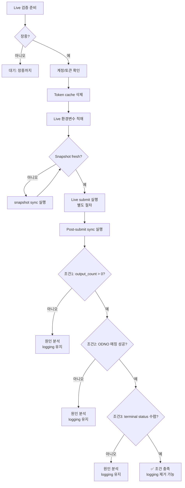

# Live 환경 검증 전 체크리스트

> **목적**: KIS paper mock → Live 전환 시, post-submit sync의 ODNO 매칭 및 terminal status convergence를 검증하기 위한 사전 준비 사항.
> **선행 문서**: [`mode_boundary_paper_live.md`](plans/mode_boundary_paper_live.md) — Paper/Live mode 전환 절차
> **관련 문서**: [`inquire_daily_ccld_payload_capture_report.md`](plans/inquire_daily_ccld_payload_capture_report.md) — 계측 logging 제거 조건
> **제약**: 본 문서는 **검증 준비 조건만 정의**하며, 실제 Live 주문 실행은 포함하지 않음.

---

## 1. 장중 여부 확인

Live KIS API는 장중에만 정상 응답합니다. 장중이 아닐 경우 모든 요청이 `msg_cd=40580000` (장 마감)으로 실패합니다.

```bash
TZ='Asia/Seoul' date '+%Y-%m-%d %H:%M:%S %A'
```

| 항목 | 기준 |
|------|------|
| 요일 | 월~금 (공휴일 제외) |
| 시간 | 08:30 ~ 15:30 KST (정규장) |
| 확인 명령어 | `TZ='Asia/Seoul' date '+%Y-%m-%d %H:%M:%S %A'` |

> **참고**: KIS paper mock (`openapivts`)은 24시간 접속 가능하나, Live는 장중에만 가능. 첫 Live 검증은 장중에만 실행 가능.

---

## 2. 계정/토큰 확인

### 2.1 환경변수 적재 확인

```bash
cd /workspace/agent_trading && bash -c 'set -a && source .env && set +a && echo "
KIS_ENV=$KIS_ENV
KIS_ACCOUNT_NO=$KIS_ACCOUNT_NO
KIS_ACCOUNT_PRODUCT_CODE=$KIS_ACCOUNT_PRODUCT_CODE
KIS_APP_KEY=${KIS_APP_KEY:0:8}...
KIS_APP_SECRET=${KIS_APP_SECRET:0:8}...
KIS_BASE_URL=$KIS_BASE_URL
"'
```

### 2.2 Live 환경 필수값

| 변수 | Paper 값 예시 | Live 값 예시 |
|------|-------------|-------------|
| `KIS_ENV` | `paper` | `real` |
| `KIS_BASE_URL` | `https://openapivts.koreainvestment.com:29443` | `https://openapi.koreainvestment.com:9443` |
| `KIS_APP_KEY` | Paper API key | Real API key |
| `KIS_APP_SECRET` | Paper API secret | Real API secret |
| `KIS_ACCOUNT_NO` | Paper 계좌번호 | Live 계좌번호 |

> **주의**: Live 계정 정보가 `.env`에 설정되어 있어도, `KIS_ENV=paper`면 paper mock으로 요청됨. `KIS_ENV` 변경 누락이 가장 흔한 실수.

### 2.3 Token Cache

```bash
# Token cache 존재 여부 확인
ls -la .cache/kis_token.json 2>/dev/null || echo "No token cache found"

# Token cache 제거 (Live 전환 시 필수 — paper token으로 Live 인증 불가)
# rm -f .cache/kis_token.json
```

Paper token과 Live token은 별도로 발급됩니다. `dev_token_cache_enabled=True` 상태에서 paper token이 캐시되어 있으면, Live 전환 시 `HTTP 403 (접근토큰 발급 잠시 후 다시 시도)`가 발생할 수 있습니다. **Live 전환 시 token cache를 반드시 삭제**해야 합니다.

### 2.4 KIS_SMOKE_PRICE 확인 (near-real submit 필수)

> **운영 규칙 (2026-05-13 확정)**: near-real submit 전 `KIS_SMOKE_PRICE`는 **필수 설정** 항목. 기본값 50000 의존 금지.

```bash
# KIS_SMOKE_PRICE 설정 여부 확인
echo "KIS_SMOKE_PRICE=${KIS_SMOKE_PRICE:-<NOT SET>}"

# 설정되지 않은 경우 KIS API로 현재가 조회 후 설정
# export KIS_SMOKE_PRICE=<KIS API inquire-price stck_prpr>
```

| 상태 | 조치 |
|------|------|
| 미설정 또는 기본값 50000 | ❌ submit 불가 (`msg_cd=40270000`). KIS API로 현재가 조회 후 설정 |
| 시장가와 일치 | ✅ submit 가능 |

상세: [`paper_submit_smoke_ops_checklist.md#7`](plans/paper_submit_smoke_ops_checklist.md:345)

### 2.5 Stale PENDING_SUBMIT 확인 (cleanup 필요)

> **운영 규칙 (2026-05-13 확정)**: 24h 이상 `pending_submit` 상태로 broker 미제출 주문은 submit 전 정리 필요.

```bash
cd /workspace/agent_trading && bash -c 'set -a && source .env && set +a && python3 -c "
import asyncio, asyncpg
async def main():
    conn = await asyncpg.connect(
        host=\"\$(echo \$DATABASE_HOST)\", port=\$(echo \$DATABASE_PORT),
        user=\"\$(echo \$DATABASE_USER)\", password=\"\$(echo \$DATABASE_PASSWORD)\",
        database=\"\$(echo \$DATABASE_NAME)\")
    rows = await conn.fetch(\"\"\"
        SELECT COUNT(*) FROM order_requests
        WHERE status = 'pending_submit'
          AND created_at < NOW() - INTERVAL '24 hours'
          AND order_request_id NOT IN (SELECT order_request_id FROM broker_orders)
    \"\"\")
    print(f'Stale pending_submit: {rows[0][0]}건')
    await conn.close()
asyncio.run(main())
"
```

| 상태 | 조치 |
|------|------|
| 0건 | ✅ 정상, submit 가능 |
| 1건 이상 | ❌ [`_cleanup_pending_submit.py`](_cleanup_pending_submit.py) 실행 후 재확인 |

상세: [`paper_submit_smoke_ops_checklist.md#10-B`](plans/paper_submit_smoke_ops_checklist.md:608)

---

## 3. Snapshot Freshness 확인

Post-submit sync는 Snapshot Sync에 의존하지 않지만, sync loop 실행 전 snapshot이 stale 상태면 submit이 차단될 수 있습니다.

```bash
cd /workspace/agent_trading && bash -c 'set -a && source .env && set +a && python3 -c "
import asyncio
from agent_trading.db.connection import create_pool
async def main():
    pool = await create_pool()
    async with pool.acquire() as conn:
        rows = await conn.fetch('''
            SELECT account_id, synced_at, status 
            FROM snapshot_sync_runs 
            ORDER BY synced_at DESC 
            LIMIT 5
        ''')
        for r in rows:
            print(f'account: {r[\"account_id\"]}  synced: {r[\"synced_at\"]}  status: {r[\"status\"]}')
    await pool.close()
asyncio.run(main())
"
```

| 항목 | 기준 |
|------|------|
| 최근 sync 시간 | 5분 이내 (장중). Stale snapshot은 submit 차단 가능 |
| sync 상태 | `completed` 또는 `running` |

> Stale snapshot으로 인한 submit 차단은 `KIS_SNAPSHOT_STALE_THRESHOLD_SECONDS` 환경변수로 조정 가능 (기본값: 300초).

---

## 4. Sync Loop 실행 경로 확인

Live 검증 시 post-submit sync loop의 실행 경로를 미리 확인합니다.

### 4.1 Sync Script 존재 확인

```bash
ls -la scripts/run_post_submit_sync_loop.py
```

### 4.2 실행 명령 (참고용 — 실제 실행은 별도)

```bash
cd /workspace/agent_trading && bash -c 'set -a && source .env && set +a && python3 scripts/run_post_submit_sync_loop.py --max-cycles 1'
```

### 4.3 Sync 대상 확인 (DB)

Paper 환경에서 `reconcile_required` 상태로 남은 broker_orders는 sync loop의 대상에서 제외됩니다. Live 환경에서는 `_SYNCABLE_STATUSES` = `{SUBMITTED, ACKNOWLEDGED, PARTIALLY_FILLED}`에 해당하는 주문만 sync됩니다.

```sql
SELECT broker_order_id, broker_native_order_id, broker_status, last_synced_at
FROM broker_orders
WHERE broker_status IN ('submitted', 'acknowledged', 'partially_filled')
ORDER BY submitted_at DESC
LIMIT 10;
```

> **Live 첫 검증 시나리오**: Live에서 submit 성공 → broker_orders에 `submitted` 상태 row 생성 → sync loop 실행 시 해당 row 발견 → `get_order_status()`에서 ODNO 매칭 시도 → terminal status로 수렴 예상.

---

## 5. Paper vs Live 기대 결과 비교표

| 단계 | Paper Mock | Live |
|------|-----------|------|
| **submit** | ✅ 정상 (ODNO 발급) | ✅ 정상 예상 |
| **`inquire-daily-ccld`** | `output: []` (빈 배열) | `output: [{ODNO, ORD_QTY, CCLD_QTY, ...}]` 예상 |
| **ODNO 매칭** | ❌ 매칭 불가 (loop 미실행) | ✅ 매칭 성공 예상 |
| **Post-submit sync 결과** | `reconcile_required` (고정) | FILLED / CANCELLED / REJECTED (실제 체결 상태) |
| **`last_synced_at`** | ✅ 갱신됨 | ✅ 갱신 예상 |
| **`order_state_events`** | ✅ 기록됨 | ✅ 기록 예상 |
| **fills 조회** | ❌ 기대 불가 | ✅ 가능 |
| **검증 가능 범위** | pipeline 정상 동작 여부 | 전체 order lifecycle |

## 6. Paper 실증 완료 vs Live 전용 분리

> **2026-05-13 기준**: 아래 표는 2026-05-13 APPROVE + Submit + Post-Submit Sync 실증 결과를 반영하여, Paper에서 검증 완료된 항목과 Live에서만 검증 가능한 항목을 분리합니다.

### 6.1 Paper 실증 완료 항목 (✅)

| 항목 | 상태 | 실증 근거 |
|------|------|----------|
| Dry-run → APPROVE 결정 | ✅ 2026-05-13 실증 완료 | DB UPDATE로 smoke event 품질 개선 후 APPROVE 유도 성공 |
| Submit 성공 (broker API 호출) | ✅ 2026-05-13 실증 완료 | `broker_status=SUBMITTED`, `broker_native_order_id` (ODNO) 발급 |
| Post-submit sync 실행 | ✅ 2026-05-13 실증 완료 | `last_synced_at` 갱신, `order_state_events` 증가 |
| Sync pipeline 정상 동작 | ✅ 2026-05-13 실증 완료 | orders>=1, errors=0 |
| `reconcile_required` 허용 | ✅ Paper mock 정상 범위 | `inquire-daily-ccld` → `output: []` (paper mock 한계) |
| KIS_SMOKE_PRICE = 시장가 일치 필수 | ✅ 2026-05-13 실증 완료 | 26850/50000 실패 → 267000(시장가) 성공 |

### 6.2 Live 전용 검증 항목 (❌ Paper 미검증)

| 항목 | 설명 | 검증 방법 |
|------|------|----------|
| `inquire-daily-ccld` 실제 payload | Paper mock은 `output: []` 반환. Live에서는 실제 체결 데이터 반환 예상 | DEBUG logging `output_count > 0` 확인 |
| ODNO 매칭 성공 | `item.get("ODNO") == broker_order_id` 매칭 성공 → `_parse_order_status_item()` 호출 | INFO logging에 ODNO match failure 미출력 |
| Terminal status 수렴 | FILLED / CANCELLED / REJECTED로 수렴 | DB `broker_orders.broker_status` 확인 |
| Fills 동기화 | `_sync_fills()`가 실제 체결 건에서 FillEvent 생성 | DB `fill_events` 테이블 조회 |
| Cancel/reject 반영 | Broker가 주문 취소/거절 시 상태 전이 | `order_state_events` 경로 확인 |

### 6.3 Logging 제거 조건과의 관계

위 3개 Live 전용 항목 (`inquire-daily-ccld` payload, ODNO 매칭, terminal status 수렴)은 [Section 7](#7-logging-제거-조건-요약)의 instrumentation logging 제거 조건과 정확히 일치합니다. 즉, **Live 검증 = Logging 제거 조건 확인**과 동일합니다.

---

## 7. Logging 제거 조건 요약

계측 logging (`rest_client.py:896-928`) 제거는 **Live 검증 후 3가지 조건이 모두 충족**되어야 합니다:

| # | 조건 | 확인 방법 |
|---|------|----------|
| 1 | Live `inquire-daily-ccld` payload에 `output_count > 0` | DEBUG logging 출력 확인 |
| 2 | ODNO 매칭 성공 (`broker_order_id` 일치) | INFO logging에 ODNO match failure 미출력 |
| 3 | Terminal status 수렴 (FILLED/CANCELLED/REJECTED) | DB `broker_orders.broker_status` 확인 |

자세한 조건은 [`inquire_daily_ccld_payload_capture_report.md#72-제거-조건-3개-모두-충족-시`](plans/inquire_daily_ccld_payload_capture_report.md) 참조.

---

## 8. 전체 흐름도

> **조건1/2/3의 상세 정의는 [Section 6.2](#62-live-전용-검증-항목-❌-paper-미검증) 참조.**
> 조건1 `output_count > 0` = Live `inquire-daily-ccld` 실제 payload 확인
> 조건2 ODNO 매칭 성공 = broker_order_id 일치
> 조건3 terminal status 수렴 = FILLED/CANCELLED/REJECTED



---

## 부록: 관련 문서 링크

| 문서 | 내용 |
|------|------|
| [`live_transition_operational_plan.md`](plans/live_transition_operational_plan.md) | **Live 전환 운영 계획** — Preflight → Submit 관찰 → 판정 체계 통합 |
| [`mode_boundary_paper_live.md`](plans/mode_boundary_paper_live.md) | Paper/Live mode 전환 절차 (env vars, rate limit, gate) |
| [`inquire_daily_ccld_payload_capture_report.md`](plans/inquire_daily_ccld_payload_capture_report.md) | Payload 계측 결과, logging 제거 조건 |
| [`paper_mock_boundary_validation_scope.md`](plans/paper_mock_boundary_validation_scope.md) | Paper mock 한계 문서화 보고서 |
| [`post_submit_sync_e2e_report.md`](plans/post_submit_sync_e2e_report.md) | Phase A E2E 검증 결과 |
| [`paper_submit_smoke_ops_checklist.md`](plans/paper_submit_smoke_ops_checklist.md) | 운영 체크리스트 (Phase 4 검증 기준) |
