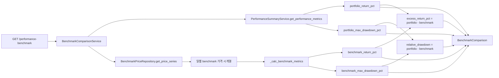

# Paper Benchmark Comparison — 전략/계좌 성과 기준 지수 대비 초과수익 비교

> **상태**: 설계 — **mode-agnostic**
> **목표**: paper/live 모두에서 benchmark 대비 상대 평가를 제공
> **제약**: 단일 benchmark 대비 read-only comparison에 집중, 기존 endpoint 의미 변경 금지
> **mode-agnostic**: 이 모듈은 paper/live 모두에서 동일하게 동작합니다. broker env와 무관하게 repository의 fill/position 데이터를 읽어 benchmark 비교를 수행합니다.

---

## 1. Benchmark Data Source Inventory

| 항목 | 현재 상태 | 이번 턴 구현 | 비고 |
|------|----------|-------------|------|
| **KOSPI 일별 가격** | 내부에 없음 | InMemory fixture + Protocol 구조 | 실제 source 연결은 후속 |
| **KOSDAQ 일별 가격** | 내부에 없음 | InMemory fixture + Protocol 구조 | 실제 source 연결은 후속 |
| **기타 benchmark** | 없음 | Protocol만 정의, 필요시 후속 추가 | KOSPI/KOSDAQ 우선 |
| **`ExternalEventEntity`** | 존재 (event/polling infra) | 사용하지 않음 | event data 용도로 유지, price series와 무관 |
| **`BenchmarkPriceRepository`** | 없음 | **신규 Protocol + InMemory** | `get_price_series()` 메서드 1개 |

### 선택: `BenchmarkPriceRepository` Protocol + InMemory

```python
class BenchmarkPriceRepository(Protocol):
    """일별 benchmark 가격 시계열 조회 Protocol."""

    async def get_price_series(
        self,
        benchmark_code: str,
        start_date: date,
        end_date: date,
    ) -> Sequence[tuple[date, Decimal]]:
        """benchmark_code의 start_date~end_date 일별 가격 반환.
        
        Parameters
        ----------
        benchmark_code:
            benchmark 식별자 (예: "KOSPI", "KOSDAQ").
        start_date:
            조회 시작일 (inclusive).
        end_date:
            조회 종료일 (inclusive).
        
        Returns
        -------
        Sequence[tuple[date, Decimal]]
            (날짜, 종가) 시퀀스, 날짜 오름차순.
            데이터가 없으면 빈 시퀀스.
        """
        ...
```

### Benchmark code constants

```python
BENCHMARK_KOSPI = "KOSPI"
BENCHMARK_KOSDAQ = "KOSDAQ"
VALID_BENCHMARK_CODES = frozenset({BENCHMARK_KOSPI, BENCHMARK_KOSDAQ})
```

---

## 2. Comparison Model 설계

```python
@dataclass(slots=True, frozen=True)
class BenchmarkComparison:
    """계좌/전략 성과와 benchmark 대비 초과수익 비교 Read Model.
    
    portfolio metrics는 ``PerformanceMetrics``에서 재사용하고,
    benchmark metrics는 ``BenchmarkPriceRepository``에서 가져온
    일별 가격 시계열로 계산합니다.
    """
    
    account_id: UUID
    """계좌 ID."""
    
    strategy_id: UUID | None
    """전략 ID (optional). None이면 계좌 전체."""
    
    benchmark_code: str
    """benchmark 식별자 (예: "KOSPI")."""
    
    period_start: date
    """비교 기간 시작일."""
    
    period_end: date
    """비교 기간 종료일."""
    
    portfolio_return_pct: Decimal
    """포트폴리오 기간 누적 수익률 (%)."""
    
    benchmark_return_pct: Decimal
    """benchmark 기간 누적 수익률 (%)."""
    
    excess_return_pct: Decimal
    """초과 수익률 = portfolio_return_pct - benchmark_return_pct (%)."""
    
    portfolio_max_drawdown_pct: Decimal
    """포트폴리오 기간 최대 낙폭 (%)."""
    
    benchmark_max_drawdown_pct: Decimal | None
    """benchmark 기간 최대 낙폭 (%). 가격 시계열 데이터 부족 시 None."""
    
    relative_drawdown_pct: Decimal | None
    """상대 낙폭 = portfolio_max_drawdown_pct - benchmark_max_drawdown_pct.
       benchmark_max_drawdown_pct가 None이면 None."""
    
    portfolio_volatility_pct: Decimal | None
    """(후속) 포트폴리오 일별 수익률 변동성. 이번 턴에서는 None 고정."""
    
    benchmark_volatility_pct: Decimal | None
    """(후속) benchmark 일별 수익률 변동성. 이번 턴에서는 None 고정."""
```

---

## 3. Service 구현

### 파일: `src/agent_trading/services/benchmark_comparison.py` (신규)

```python
class BenchmarkComparisonService:
    """Read-only benchmark comparison service.
    
    ``PerformanceSummaryService``의 portfolio metrics와
    ``BenchmarkPriceRepository``의 benchmark price series를
    결합하여 초과수익 비교를 제공합니다.
    """
    
    def __init__(
        self,
        repos: RepositoryContainer,
        benchmark_price_repo: BenchmarkPriceRepository,
    ) -> None:
        self._repos = repos
        self._benchmark_price_repo = benchmark_price_repo
    
    async def get_benchmark_comparison(
        self,
        account_id: UUID,
        start_date: date,
        end_date: date,
        benchmark_code: str,
        strategy_id: UUID | None = None,
    ) -> BenchmarkComparison:
        """계좌/전략 성과를 benchmark와 비교합니다.
        
        Parameters
        ----------
        account_id:
            대상 계좌 UUID.
        start_date:
            비교 시작일 (inclusive).
        end_date:
            비교 종료일 (inclusive).
        benchmark_code:
            benchmark 식별자 ("KOSPI" / "KOSDAQ").
        strategy_id:
            특정 전략 필터 (optional).
        
        Returns
        -------
        BenchmarkComparison
            portfolio vs benchmark 비교 결과.
        
        Raises
        ------
        ValueError
            유효하지 않은 benchmark_code인 경우.
        """
        # 1. Validate benchmark_code
        if benchmark_code not in VALID_BENCHMARK_CODES:
            raise ValueError(
                f"Invalid benchmark_code: {benchmark_code}. "
                f"Valid codes: {sorted(VALID_BENCHMARK_CODES)}"
            )
        
        # 2. Portfolio metrics (재사용)
        perf_service = PerformanceSummaryService(self._repos)
        metrics = await perf_service.get_performance_metrics(
            account_id, start_date, end_date, strategy_id
        )
        
        # 3. Benchmark price series
        prices = await self._benchmark_price_repo.get_price_series(
            benchmark_code, start_date, end_date
        )
        
        # 4. Benchmark return 계산
        benchmark_return_pct, benchmark_max_dd_pct = _calc_benchmark_metrics(
            prices, start_date, end_date
        )
        
        # 5. Excess return
        excess_return_pct = metrics.cumulative_return_pct - benchmark_return_pct
        
        # 6. Relative drawdown
        relative_dd: Decimal | None = None
        if benchmark_max_dd_pct is not None:
            relative_dd = metrics.max_drawdown_pct - benchmark_max_dd_pct
        
        return BenchmarkComparison(
            account_id=account_id,
            strategy_id=strategy_id,
            benchmark_code=benchmark_code,
            period_start=start_date,
            period_end=end_date,
            portfolio_return_pct=metrics.cumulative_return_pct,
            benchmark_return_pct=benchmark_return_pct,
            excess_return_pct=excess_return_pct,
            portfolio_max_drawdown_pct=metrics.max_drawdown_pct,
            benchmark_max_drawdown_pct=benchmark_max_dd_pct,
            relative_drawdown_pct=relative_dd,
            portfolio_volatility_pct=None,
            benchmark_volatility_pct=None,
        )
```

### Pure Helper: `_calc_benchmark_metrics()`

```python
def _calc_benchmark_metrics(
    prices: Sequence[tuple[date, Decimal]],
    start_date: date,
    end_date: date,
) -> tuple[Decimal, Decimal | None]:
    """일별 benchmark 가격 시계열에서 기간 수익률과 최대 낙폭을 계산합니다.
    
    Parameters
    ----------
    prices:
        (날짜, 종가) 시퀀스, 날짜 오름차순.
    start_date:
        비교 시작일 (prices 범위 확인용).
    end_date:
        비교 종료일 (prices 범위 확인용).
    
    Returns
    -------
    tuple[Decimal, Decimal | None]
        (benchmark_return_pct, benchmark_max_drawdown_pct).
        prices가 2일 미만이면 return=0, drawdown=None.
        prices가 1일만 있으면 return=0, drawdown=0.
    """
    if len(prices) < 2:
        # 데이터 부족 → return 0%, drawdown unknown
        return Decimal("0"), None
    
    # 시작 가격: start_date 이전 가장 가까운 가격, 또는 첫 번째 가격
    first_price = prices[0][1]
    last_price = prices[-1][1]
    
    # 시작 가격이 0이면 return 0%
    if first_price == 0:
        benchmark_return_pct = Decimal("0")
    else:
        benchmark_return_pct = (last_price - first_price) / first_price * 100
    
    # Max drawdown (rolling peak)
    peak = first_price
    max_dd = Decimal("0")
    
    for _, price in prices:
        if price > peak:
            peak = price
        if peak > 0:
            dd = (peak - price) / peak * 100
            if dd > max_dd:
                max_dd = dd
    
    return benchmark_return_pct, max_dd
```

### BenchmarkPriceRepository 구현체

**InMemory** (tests + fixture):

```python
class InMemoryBenchmarkPriceRepository:
    """In-memory benchmark price repository.
    
    fixture 데이터를 dict로 저장하여 테스트와 개발에 사용.
    """
    
    def __init__(self, prices: dict[str, Sequence[tuple[date, Decimal]]] | None = None) -> None:
        self._prices: dict[str, Sequence[tuple[date, Decimal]]] = prices or {}
    
    async def get_price_series(
        self,
        benchmark_code: str,
        start_date: date,
        end_date: date,
    ) -> Sequence[tuple[date, Decimal]]:
        series = self._prices.get(benchmark_code, [])
        return [
            (d, p) for d, p in series
            if start_date <= d <= end_date
        ]
```

---

## 4. API 추가

```
GET /performance-benchmark?account_id=<UUID>&start_date=YYYY-MM-DD&end_date=YYYY-MM-DD&benchmark_code=KOSPI
```

### Optional params
- `strategy_id=<UUID>` — 특정 전략 필터

### Response (JSON)

```json
{
    "account_id": "uuid-string",
    "strategy_id": null,
    "benchmark_code": "KOSPI",
    "period_start": "2026-05-01",
    "period_end": "2026-05-09",
    "portfolio_return_pct": 8.5,
    "benchmark_return_pct": 3.2,
    "excess_return_pct": 5.3,
    "portfolio_max_drawdown_pct": 5.0,
    "benchmark_max_drawdown_pct": 4.1,
    "relative_drawdown_pct": 0.9,
    "portfolio_volatility_pct": null,
    "benchmark_volatility_pct": null
}
```

### Pydantic schema (`api/schemas.py`)

```python
class BenchmarkComparisonView(BaseModel):
    """GET /performance-benchmark response model."""
    
    model_config = ConfigDict(from_attributes=True)
    
    account_id: str
    strategy_id: str | None
    benchmark_code: str
    period_start: date
    period_end: date
    
    portfolio_return_pct: float
    benchmark_return_pct: float
    excess_return_pct: float
    
    portfolio_max_drawdown_pct: float
    benchmark_max_drawdown_pct: float | None
    relative_drawdown_pct: float | None
    
    portfolio_volatility_pct: float | None
    benchmark_volatility_pct: float | None
```

### Route (`routes/performance.py`)

```python
@router.get(
    "/performance-benchmark",
    response_model=BenchmarkComparisonView,
)
async def get_benchmark_comparison(
    account_id: str = Query(...),
    start_date: str = Query(...),
    end_date: str = Query(...),
    benchmark_code: str = Query(..., description="Benchmark code (KOSPI/KOSDAQ)"),
    strategy_id: str | None = Query(None),
    repos: RepositoryContainer = Depends(get_repos),
) -> BenchmarkComparisonView:
    # UUID validation
    # date format validation
    # benchmark_code validation (400 if invalid)
    # ...
    
    from agent_trading.services.benchmark_comparison import (
        BenchmarkComparisonService,
        InMemoryBenchmarkPriceRepository,
    )
    
    benchmark_price_repo = InMemoryBenchmarkPriceRepository(_DEFAULT_BENCHMARK_PRICES)
    service = BenchmarkComparisonService(repos, benchmark_price_repo)
    result = await service.get_benchmark_comparison(aid, sd, ed, benchmark_code, sid)
    
    return BenchmarkComparisonView.model_validate(result)
```

---

## 5. Mermaid: 데이터 흐름



---

## 6. 변경 파일 목록

| 파일 | 변경 | 설명 |
|------|------|------|
| `src/agent_trading/services/benchmark_comparison.py` | **생성** | `BenchmarkComparison` dataclass, `BenchmarkPriceRepository` Protocol, `InMemoryBenchmarkPriceRepository`, `_calc_benchmark_metrics()` pure helper, `BenchmarkComparisonService` |
| `src/agent_trading/api/schemas.py` | **수정** | `BenchmarkComparisonView` Pydantic model 추가 |
| `src/agent_trading/api/routes/performance.py` | **수정** | `GET /performance-benchmark` endpoint 추가, `BenchmarkComparisonView` import |
| `tests/services/test_benchmark_comparison.py` | **생성** | 순수 함수 + 통합 테스트 |
| `plans/[BACKLOG] backlog.md` | **수정** | Backlog item #24 등록 |

**변경 없음**:
- 기존 `performance_summary.py` — 건드리지 않음 (재사용만 함)
- 기존 `GET /performance-summary`, `/performance-history`, `/performance-metrics` — 의미 변경 없음
- `RepositoryContainer` — 건드리지 않음 (benchmark repo는 service 생성자에서 직접 주입)

---

## 7. 테스트 계획

### 7.1 Pure function: `_calc_benchmark_metrics()` (3 tests)

| # | 시나리오 | 입력 | 기대 결과 |
|---|----------|------|----------|
| 1 | 정상 상승 benchmark | prices=[(D0, 100), (D1, 105), (D2, 110)] | return=10%, max_dd=0% |
| 2 | peak 후 decline | prices=[(D0, 100), (D1, 110), (D2, 99)] | return=-1%, max_dd=10% |
| 3 | 데이터 부족 | prices=[(D0, 100)] 또는 [] | return=0%, max_dd=None |

### 7.2 Service 통합: `get_benchmark_comparison()` (5 tests)

| # | 시나리오 | 설명 |
|---|----------|------|
| 4 | Outperform | portfolio return=10%, benchmark=3% → excess=7% |
| 5 | Underperform | portfolio return=-2%, benchmark=5% → excess=-7% |
| 6 | Flat benchmark/portfolio | 둘 다 0% → excess=0% |
| 7 | Invalid benchmark code | `benchmark_code="INVALID"` → ValueError 또는 400 |
| 8 | Strategy filter | strategy_id 제공 → 해당 전략만 집계 |

### 7.3 회귀 검증

- 기존 44개 performance_summary 테스트 변경 없음
- 기존 performance API endpoint 테스트 회귀 없음

---

## 8. 실행 단계

| 단계 | 작업 | 상세 |
|------|------|------|
| **Step 1** | `benchmark_comparison.py` 생성 | `BenchmarkComparison` dataclass + `BenchmarkPriceRepository` Protocol + `InMemoryBenchmarkPriceRepository` + `_calc_benchmark_metrics()` + `BenchmarkComparisonService.get_benchmark_comparison()` |
| **Step 2** | Schema 추가 | `BenchmarkComparisonView` Pydantic model (schemas.py) |
| **Step 3** | API endpoint 추가 | `GET /performance-benchmark` (routes/performance.py) |
| **Step 4** | 테스트 작성 | 8 tests (3 pure + 5 통합) |
| **Step 5** | 회귀 검증 | 전체 pytest suite |
| **Step 6** | 문서 정리 | [BACKLOG] backlog.md 업데이트 + 완료 보고 |

---

## 9. Benchmark Default Prices (Fixture)

```python
_DEFAULT_BENCHMARK_PRICES: dict[str, Sequence[tuple[date, Decimal]]] = {
    "KOSPI": [
        (date(2026, 5, 1), Decimal("2600.00")),
        (date(2026, 5, 2), Decimal("2615.50")),
        (date(2026, 5, 3), Decimal("2630.20")),
        (date(2026, 5, 4), Decimal("2645.80")),
        (date(2026, 5, 5), Decimal("2620.10")),
        (date(2026, 5, 6), Decimal("2655.30")),
        (date(2026, 5, 7), Decimal("2670.00")),
        (date(2026, 5, 8), Decimal("2685.40")),
        (date(2026, 5, 9), Decimal("2700.00")),
    ],
    "KOSDAQ": [
        (date(2026, 5, 1), Decimal("850.00")),
        (date(2026, 5, 2), Decimal("855.20")),
        (date(2026, 5, 3), Decimal("860.10")),
        (date(2026, 5, 4), Decimal("858.50")),
        (date(2026, 5, 5), Decimal("852.30")),
        (date(2026, 5, 6), Decimal("865.00")),
        (date(2026, 5, 7), Decimal("870.40")),
        (date(2026, 5, 8), Decimal("872.10")),
        (date(2026, 5, 9), Decimal("880.00")),
    ],
}
```

---

## 10. 후속 작업 (이번 턴 범위 외)

1. **실제 benchmark price source 연결** — KOSPI/KOSDAQ 일별 종가를 정기적으로 수집/저장
2. **Benchmark price history API** — `GET /benchmark-prices?code=KOSPI&start=...&end=...`
3. **다중 benchmark 비교** — KOSPI vs KOSDAQ vs 특정 ETF 동시 비교
4. **Sector/market regime 비교** — 업종별 지수 대비 상대 평가
5. **Live canary gate** — benchmark 대비 성과가 일정 threshold 이하일 때 경고
6. **Sharpe / Sortino / Information ratio** — 위험 조정 수익률 지표
