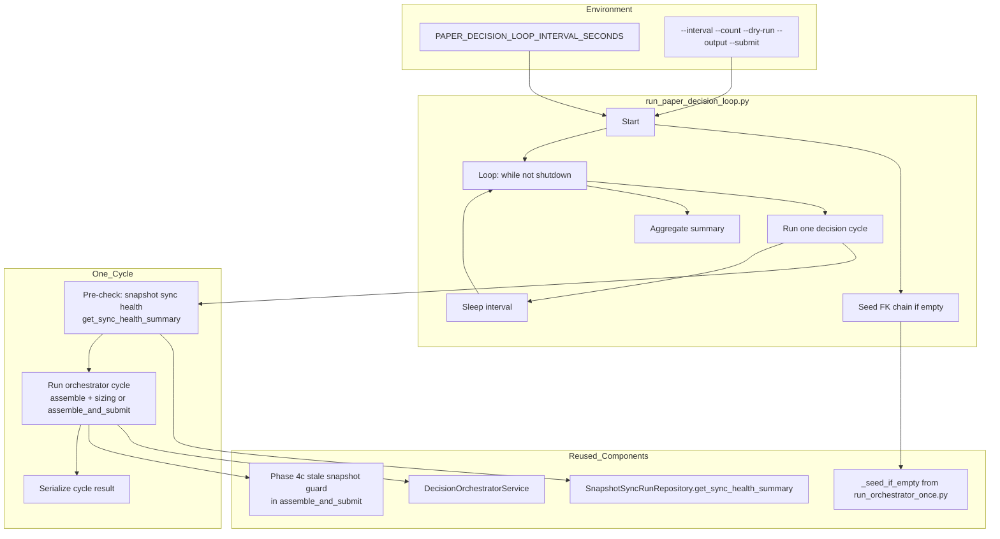
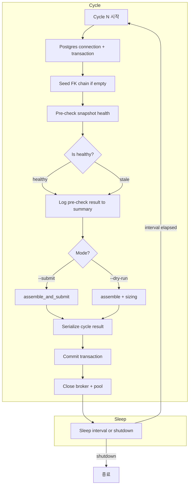

# Paper Continuous Decision Loop — 설계 문서

> **목적**: 단발 orchestrator(`run_orchestrator_once.py`)를 반복 실행 가능한 운영 루프로 승격.
> 기존 `verify_paper_loop.py`는 검증 전용으로 유지, 신규 `run_paper_decision_loop.py`는 운영 전용.
>
> **상태**: 설계 완료
>
> **참고**: 이 문서는 "paper"라는 이름을 가지고 있지만, 문서에서 설명하는 runtime loop는 **mode-agnostic**입니다.
> 동일한 decision pipeline, sizing, submit 로직이 live mode에서도 그대로 동작합니다.
> "paper"는 초기 구현 컨텍스트를 반영한 naming이며, 실제 runtime은 env-specific broker 설정만 교체하면 live에서도 실행 가능합니다.

---

## 1. 전체 아키텍처



### 역할 분리 (변경 없음)

| 루프 | 스크립트 | 역할 | 간격 |
|------|---------|------|------|
| **Snapshot Sync** | `run_snapshot_sync_loop.py` | Position/cash 데이터 최신성 유지 | 300s (5min) |
| **Post-Submit Sync** | `run_post_submit_sync_loop.py` | 미체결/부분체결 주문 상태 Broker 수렴 | 30s |
| **WS-Triggered Fast Path** | `RealTimeEventLoop` | WS fill 알림 → 즉시 sync | Event-driven |
| **Paper Decision Loop** | **`run_paper_decision_loop.py`** | AI Decision → Submit 반복 실행 | 300s (5min) |

---

## 2. CLI 인터페이스

```bash
# 기본 실행 (5분 간격, 무한 반복, submit 모드)
python -m scripts.run_paper_decision_loop

# 1회 실행 후 종료
python -m scripts.run_paper_decision_loop --count 1

# Dry-run (assemble + sizing only, submit 없음)
python -m scripts.run_paper_decision_loop --count 1 --dry-run

# 60초 간격, 5회, JSON 출력
python -m scripts.run_paper_decision_loop --interval 60 --count 5 --output json

# 명시적 submit 모드 (기본값)
python -m scripts.run_paper_decision_loop --submit --count 1
```

### CLI 옵션

| 옵션 | 타입 | 기본값 | 설명 |
|------|------|--------|------|
| `--interval` | int | `PAPER_DECISION_LOOP_INTERVAL_SECONDS` env (기본 300) | Cycle 간 대기 시간(초) |
| `--count` | int | 0 (무한) | 실행할 cycle 수. 0=무한 |
| `--dry-run` | bool | False | Broker submit 없이 assemble + sizing만 실행 |
| `--submit` | bool | True | Full pipeline 실행 (assemble → submit) |
| `--output` | text\|json | text | 출력 형식 |

### 환경 변수

| 변수 | 기본값 | 설명 |
|------|--------|------|
| `PAPER_DECISION_LOOP_INTERVAL_SECONDS` | 300 | Cycle 간격(초). `--interval`보다 낮은 우선순위 |
| `KIS_SNAPSHOT_STALE_THRESHOLD_SECONDS` | 900 | Snapshot staleness 임계값 |
| `KIS_SNAPSHOT_STARTUP_GRACE_SECONDS` | 600 | Startup grace period |

---

## 3. 사이클 요약 구조

### Per-Cycle Result 필드

```python
{
    "cycle": 1,
    "started_at": "2026-05-09T07:00:00.123456+00:00",
    "completed_at": "2026-05-09T07:00:05.654321+00:00",
    "duration_seconds": 5.531,
    "status": "SUBMITTED",        # SUBMITTED | SKIPPED | ERROR | DRY_RUN
    "precheck": {
        "health_status": "ok",    # ok | stale | no_history | starting_up
        "last_successful_run_at": "...",
        "consecutive_failures": 0,
    },
    # From SubmitResult (if submit mode):
    "decision_context_id": "uuid",
    "trade_decision_id": "uuid",
    "order_request_id": "uuid",
    "error_phase": None,
    "error_message": None,
    "decision_type": "APPROVE",
    "sized_quantity": "10",
    "sizing_constraints": [],
    "order_status": "SUBMITTED",
    "client_order_id": "...",
    "requested_quantity": "10",
}
```

### Aggregate Summary 필드

```python
{
    "mode": "summary",
    "total_cycles": 10,
    "success": 9,          # SUBMITTED or DRY_RUN
    "skip": 1,             # SKIPPED
    "error": 0,            # ERROR
    "success_rate": 90.0,
    "total_duration_seconds": 50.0,
}
```

---

## 4. 세부 구현 설계

### 4.1 `scripts/run_paper_decision_loop.py` 구조

```
run_paper_decision_loop.py
├── Constants (imported from run_orchestrator_once.py)
│   ├── CLIENT_ID, BROKER_ACCOUNT_ID, ACCOUNT_ID, STRATEGY_ID, CONFIG_VERSION_ID
│   ├── CLIENT_CODE, STRATEGY_CODE, ACCOUNT_ALIAS, SYMBOL, MARKET
│   └── _seed_account_ref, _seed_last4, _seed_broker_code, _seed_masked, _seed_base_url
├── _seed_if_empty(repos)  # Reused from run_orchestrator_once.py
├── Signal handling
│   ├── _shutdown_requested (module-level flag)
│   ├── _handle_signal(signum, frame)
│   └── _install_signal_handlers()
├── Serialization
│   ├── _serialize_precheck(health)  # SnapshotSyncHealthSummary → dict
│   ├── _serialize_cycle_result(cycle, result, duration, precheck, error)
│   └── _build_aggregate_summary(results, total_duration)
├── Core cycle
│   ├── _run_one_cycle(cycle, *, submit, dry_run) → dict
│   │   1. DB connection + transaction
│   │   2. Seed if empty
│   │   3. Pre-check snapshot health (get_sync_health_summary)
│   │   4. If submit: orchestrator.assemble_and_submit()
│   │   5. If dry_run: orchestrator.assemble() + calculate_sizing()
│   │   6. Serialize + return
│   └── _run_loop(*, interval, count, submit, dry_run, output)
│       1. Install signal handlers
│       2. Loop until shutdown or count reached
│       3. Call _run_one_cycle per iteration
│       4. Collect results, aggregate summary
│       5. Sleep between cycles (with shutdown check)
├── CLI
│   ├── _parse_args(argv)
│   ├── main(argv) → int
│   └── if __name__ == "__main__": sys.exit(main())
```

### 4.2 Health Check 재사용 (Step 4)

**원칙**: 기존 guardrail/health 정책을 **중복 구현하지 않는다**.

- Pre-check는 로깅 및 사이클 요약에만 사용된다
- 실제 차단 로직은 `DecisionOrchestratorService.assemble_and_submit()` 내부 Phase 4c가 담당
- Pre-check는 `SnapshotSyncRunRepository.get_sync_health_summary()`를 직접 호출 (HTTP 호출 불필요)
- `_serialize_cycle_result()`는 pre-check 결과를 `precheck` 필드에 포함

```python
async def _run_precheck(repos: RepositoryContainer) -> dict[str, object] | None:
    """Lightweight pre-check: snapshot sync health summary.
    
    Returns dict for cycle summary, or None if check unavailable.
    Does NOT block execution — the real guard is in Phase 4c.
    """
    try:
        health = await repos.snapshot_sync_runs.get_sync_health_summary(
            stale_threshold_seconds=STALE_THRESHOLD_SECONDS,
        )
        return _serialize_precheck(health)
    except Exception as exc:
        logger.warning("Pre-check failed: %s", exc)
        return None
```

### 4.3 Seed Logic 재사용

`_seed_if_empty()` 함수와 상수를 [`run_orchestrator_once.py`](scripts/run_orchestrator_once.py:127)에서 직접 import한다.
중복 구현을 방지하기 위해 **import 방식**을 사용한다.

```python
from scripts.run_orchestrator_once import (
    CLIENT_ID, BROKER_ACCOUNT_ID, ACCOUNT_ID, STRATEGY_ID, CONFIG_VERSION_ID,
    CLIENT_CODE, STRATEGY_CODE, ACCOUNT_ALIAS, SYMBOL, MARKET,
    _seed_account_ref, _seed_last4, _seed_broker_code, _seed_masked, _seed_base_url,
    _seed_if_empty,
)
```

### 4.4 Graceful Shutdown

- `run_post_submit_sync_loop.py` 패턴 사용: `asyncio.Event` 기반
- SIGINT/SIGTERM → shutdown 이벤트 설정 → 현재 cycle 완료 후 종료
- `asyncio.wait_for(shutdown_event.wait(), timeout=interval)` 사용하여 sleep 중에도 즉시 반응

```python
_shutdown_event = asyncio.Event()

def _handle_signal(signum: int, _frame: object) -> None:
    sig_name = signal.Signals(signum).name
    logger.info("Received %s — completing current cycle then exiting ...", sig_name)
    _shutdown_event.set()

def _install_signal_handlers() -> None:
    loop = asyncio.get_event_loop()
    for sig in (signal.SIGTERM, signal.SIGINT):
        try:
            loop.add_signal_handler(sig, lambda s=sig: _handle_signal(s, None))
        except NotImplementedError:
            signal.signal(sig, _handle_signal)
```

### 4.5 DB 연결 전략

`run_post_submit_sync_loop.py` 패턴을 따른다:
1. 각 cycle에서 새 broker adapter 생성 + DB pool 생성
2. `transaction()` context로 repos 생성
3. Cycle 종료 시 broker close + pool close

이 방식은 단순하지만 pool 생성 비용이 있다. 향후 최적화가 필요하면 pool 재사용으로 변경 가능.

---

## 5. 테스트 계획

### 5.1 테스트 파일: [`tests/scripts/test_run_paper_decision_loop.py`](tests/scripts/test_run_paper_decision_loop.py)

`tests/scripts/` 디렉토리 생성 후 추가.

| # | 테스트 | 설명 | 검증 |
|---|--------|------|------|
| 1 | `test_single_cycle_dry_run` | count=1, dry-run 모드 | status=DRY_RUN, broker 호출 없음 |
| 2 | `test_single_cycle_submit` | count=1, submit 모드 | status=SUBMITTED, broker 호출 1회 |
| 3 | `test_precheck_stale_in_summary` | stale snapshot 환경 | precheck 필드에 stale 정보 포함 |
| 4 | `test_graceful_shutdown` | SIGINT 시그널 | shutdown 후 cycle 정상 종료 |
| 5 | `test_cycle_count_limit` | count=2 설정 | 2 cycle 후 종료, 결과 2개 |

테스트는 in-memory repos + stub broker 사용 (실제 DB 의존 없음).

### 5.2 Mock 전략

- `postgres_runtime` → `_mock_runtime()` 컨텍스트 매니저로 대체
- In-memory repos 사용 (기존 `build_in_memory_repositories()`)
- Stub broker adapter 사용 (`AsyncMock`)
- `_seed_if_empty` → 이미 seed된 repos 사용하여 skip

### 5.3 테스트 구조

```python
@asynccontextmanager
async def _mock_runtime() -> AsyncIterator[dict[str, Any]]:
    """Mock runtime for testing — in-memory repos + stub orchestrator."""
    repos = build_in_memory_repositories()
    # ... seed data ...
    broker = AsyncMock(spec=BrokerAdapter)
    orchestrator = DecisionOrchestratorService(repos=repos)
    order_manager = OrderManager(repos=repos, reconciliation_service=...)
    yield {
        "repositories": repos,
        "orchestrator": orchestrator,
        "order_manager": order_manager,
        "primary_broker_adapter": broker,
    }

# Patch postgres_runtime with _mock_runtime in tests
@patch("scripts.run_paper_decision_loop.postgres_runtime", _mock_runtime)
async def test_single_cycle_dry_run():
    ...
```

---

## 6. 변경 파일 목록

| 파일 | 변경 유형 | 설명 |
|------|----------|------|
| `scripts/run_paper_decision_loop.py` | **신규** | Continuous decision loop runner (~350줄) |
| `tests/scripts/__init__.py` | **신규** | Package init |
| `tests/scripts/test_run_paper_decision_loop.py` | **신규** | 5개 단위 테스트 |
| `plans/paper_trading_loop_validation.md` | **수정** | Section 4/7/10 업데이트, Continuous Decision Loop 추가 |
| `plans/[BACKLOG] backlog.md` | **수정** | Item 1 상태 변경 (Paper Continuous Decision Loop → ✅ 승격됨) |

---

## 7. 기존 verify_paper_loop.py와의 차이점

| 항목 | `verify_paper_loop.py` | `run_paper_decision_loop.py` |
|------|----------------------|---------------------------|
| 목적 | **검증** (verification) | **운영** (operations) |
| DB 연결 | 매 cycle `postgres_runtime()` + migration | 매 cycle pool 생성 (migration 없음) |
| 기본 count | 1 | 0 (무한) |
| 기본 interval | 0 (1회) | 300s (5분) |
| Seed | 매 cycle `_seed_if_empty` 호출 | 매 cycle `_seed_if_empty` 호출 |
| Dry-run | `--submit` 없음 = assemble only | `--dry-run` 플래그 |
| Submit 기본값 | False | True |
| Pre-check | 없음 | `get_sync_health_summary()` 로깅 |
| Cycle 요약 | status/error_phase/trade_decision_id | + precheck/guard info |

---

## 8. 실행 순서

```bash
# 1. Paper Decision Loop 실행 (5분 간격, 무한)
python -m scripts.run_paper_decision_loop

# 2. Snapshot Sync Loop (별도 터미널, 5분 간격)
python -m scripts.run_snapshot_sync_loop

# 3. Post-Submit Sync Loop (별도 터미널, 30초 간격)
python -m scripts.run_post_submit_sync_loop

# 4. API 서버 (별도 터미널)
python -m uvicorn src.agent_trading.api.app:create_app_from_env
```

---

## 9. Mermaid: 사이클 흐름


