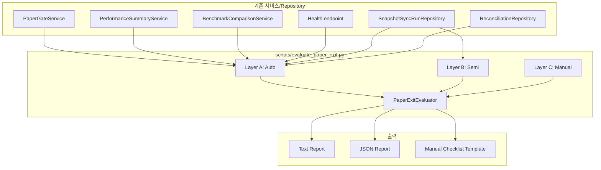
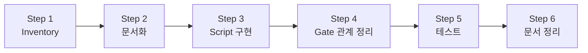

# Paper Exit Criteria — 설계 문서

> **목적**: paper 운용 단계를 끝낼 기준을 시스템과 문서에 고정한다.
> live 검토 이전의 최종 paper 합격 기준을 자동/부분자동/수동 3층으로 분류하고,
> 각 항목의 판정 방법과 임계값을 코드와 문서에 명시한다.
>
> **핵심 원칙**:
> - 새 분석 기능을 크게 더 만들지 않고, 기존 성과/안정성/건강도 정보를 최종 체크리스트로 묶는다
> - live canary 구현으로 넘어가지 않고, 그 이전의 자격 판정 체계를 완성한다
> - admin UI 변경 금지, live 실계정 검증 금지, broker submit semantics 변경 금지
> - hard guardrail/reconciliation 경계 변경 금지, 기존 performance/gate semantics 변경 금지

---

## 1. Exit Criteria Inventory — 3층 분류표

### 범례

| 레이어 | 코드 | 판정 방식 | 판정 주체 | 출력 |
|--------|------|-----------|-----------|------|
| **A: 자동** | Auto | 기존 서비스/Repository 호출로 즉시 계산 | `evaluate_paper_exit.py` | PASS / WARN / FAIL |
| **B: 부분자동** | Semi | 스크립트/테스트 실행 필요, 자동 수집 가능 | `evaluate_paper_exit.py` + 외부 명령 | OK / CHECK (수동 확인 필요) |
| **C: 수동** | Manual | 사람이 직접 검토 | 운영자 | ✅ / ❌ / N/A |

### Layer A: 자동 판정 (Auto) — 코드 기반 즉시 평가

| # | 항목 | Source | 판정 기준 | FAIL 조건 | WARN 조건 |
|---|------|--------|-----------|-----------|-----------|
| A1 | `MIN_RETURN` | `PaperGateService._check_min_return()` → `PerformanceMetrics.cumulative_return_pct` | `≥ PAPER_GATE_MIN_RETURN_PCT` (default 0.0) | `cumulative_return_pct < threshold` | — |
| A2 | `MAX_DRAWDOWN` | `PaperGateService._check_max_drawdown()` → `PerformanceMetrics.max_drawdown_pct` | `≤ PAPER_GATE_MAX_DRAWDOWN_PCT` (default 20.0) | `max_drawdown_pct > threshold` | — |
| A3 | `MIN_EXCESS_RETURN` | `PaperGateService._check_excess_return()` → `BenchmarkComparison.excess_return_pct` | `≥ PAPER_GATE_MIN_EXCESS_RETURN_PCT` (default -5.0) | `excess_return_pct < threshold` | benchmark 데이터 없음 |
| A4 | `MIN_WIN_RATE` | `PaperGateService._check_win_rate()` → `PerformanceMetrics.win_rate` | `≥ PAPER_GATE_MIN_WIN_RATE_PCT` (default 0.0) | — | `win_rate < threshold` |
| A5 | `MIN_FILLED_ORDERS` | `PaperGateService._check_filled_orders()` → `PerformanceMetrics.total_filled_orders` | `≥ PAPER_GATE_MIN_FILLED_ORDERS` (default 3) | `total_filled_orders < threshold` | — |
| A6 | `SNAPSHOT_FRESHNESS` | `PaperGateService._check_snapshot_freshness()` → `SnapshotSyncHealthSummary.is_stale` | `is_stale == False` | `is_stale == True` | — |
| A7 | `SYNC_FAILURES` | `PaperGateService._check_sync_failures()` → `SnapshotSyncHealthSummary.consecutive_failures` | `≤ PAPER_GATE_MAX_CONSECUTIVE_FAILURES` (default 3) | `consecutive_failures > threshold` | — |
| A8 | `BLOCKING_LOCKS` | `PaperGateService._check_blocking_locks()` → `ReconciliationRepository.list_all_active_locks()` | `lock_count == 0` | `lock_count > 0` | — |
| A9 | `HEALTH_ENDPOINT` | `GET /health` | `snapshot_sync_stale == false` | stale → FAIL | — |
| A10 | `READYZ_ENDPOINT` | `GET /health/readyz` | `status == "ok"` | `not_ready` (startup grace 미경과) → FAIL | `degraded` (stale) → HOLD |

> **참고**: A1~A8은 [`PaperGateService.evaluate()`](src/agent_trading/services/paper_gate.py:117)가 이미 수행 중.
> Exit Criteria 스크립트는 이 메서드를 재사용하고, A9~A10을 추가로 검증한다.

### Layer B: 부분 자동 (Semi-Auto) — 스크립트/테스트 실행 필요

| # | 항목 | 검증 방법 | 자동 수집 | `--run-semi` 실행 시 | `--run-semi` 미실행 시 |
|---|------|-----------|-----------|---------------------|----------------------|
| B1 | 전체 서비스 테스트 회귀 | `pytest tests/services/ -v` → all green | ⚠ subprocess | 0 failed, 0 errors → OK / else → FAIL | `NOT_RUN` |
| B2 | Paper loop verification | `python -m scripts.verify_paper_loop --count 1` → exit 0 | ⚠ subprocess | exit 0 → OK / else → FAIL | `NOT_RUN` |
| B3 | Decision loop dry-run | `python -m scripts.run_paper_decision_loop --count 1 --dry-run` → exit 0 | ⚠ subprocess | exit 0 → OK / else → FAIL | `NOT_RUN` |
| B4 | Snapshot sync scheduler 작동 | `SnapshotSyncRunRepository.get_sync_health_summary()` → `last_successful_run_at` 존재 | ✅ (항상 자동) | recent run 존재 → OK / 없음 → CHECK | 동일 |
| B5 | Test suite 개별 결과 확인 | 개별 테스트 파일 pass율 (safe order path, sizing, pipeline 등) | ⚠ subprocess | 모두 통과 → OK / 일부 실패 → FAIL | `NOT_RUN` |

### Layer C: 수동 검증 (Manual) — 운영자 판단

| # | 항목 | 검토 내용 (구체적 체크리스트 문장) | 판정 |
|---|------|-----------------------------------|------|
| C1 | Broker submit smoke 검토 | KIS paper 대상 `ENABLE_KIS_PAPER_SUBMIT_SMOKE=true` 테스트를 실행했는가? 실행 결과 C3 케이스가 PASS했는가? | ✅ 통과 / ❌ 미통과 / N/A 미실행 |
| C2 | Pipeline 오류율 검토 | 최근 10회 decision cycle 중 pipeline error(pipeline 예외/타임아웃)가 1회 미만인가? (`< 10%`) | ✅ 정상 / ❌ 이상 / N/A 무시 |
| C3 | Reconciliation 상태 검토 | admin UI ReconciliationView에서 미해결 mismatch 건수가 0인가? 활성 lock이 있는가? | ✅ 정상 / ❌ 이상 |
| C4 | Audit log 연속성 확인 | audit log가 최근 24시간 동안 1시간 이상의 갭 없이 연속 기록되고 있는가? | ✅ 정상 / ❌ 이상 |
| C5 | 최종 운영 판단 | 위 Layer A/B/C 모든 정보를 종합하여, paper 운용을 종료하고 live 검토를 시작해도 되는가? | ✅ GO / ❌ NO-GO |

---

## 2. Script 설계: `scripts/evaluate_paper_exit.py`

### 2.1 CLI 인터페이스

```bash
# 기본 실행 (자동 판정 Layer A만)
python -m scripts.evaluate_paper_exit \
    --account-id <UUID> \
    --start-date 2026-04-01 \
    --end-date 2026-05-01

# 벤치마크 포함 + semi-auto 검증 포함
python -m scripts.evaluate_paper_exit \
    --account-id <UUID> \
    --start-date 2026-04-01 \
    --end-date 2026-05-01 \
    --benchmark-code KOSPI \
    --run-semi   # Layer B 테스트/스크립트 실행 포함

# JSON 출력
python -m scripts.evaluate_paper_exit \
    --account-id <UUID> \
    --start-date 2026-04-01 \
    --end-date 2026-05-01 \
    --output json

# Manual 체크리스트용 템플릿 출력 (Layer C 항목만)
python -m scripts.evaluate_paper_exit \
    --account-id <UUID> \
    --start-date 2026-04-01 \
    --end-date 2026-05-01 \
    --manual-template
```

### 2.2 출력 포맷

#### Text 출력 (기본)

```
╔══════════════════════════════════════════════════════════╗
║              Paper Exit Criteria Evaluation              ║
║              2026-04-01 ~ 2026-05-01                     ║
╚══════════════════════════════════════════════════════════╝

[Layer A: 자동 판정 — PASS]  (10/10 pass)
  ✅ A1  MIN_RETURN          cumulative_return_pct = +3.2%  ≥   0.0%
  ✅ A2  MAX_DRAWDOWN        max_drawdown_pct      =  5.1%  ≤  20.0%
  ✅ A3  MIN_EXCESS_RETURN   excess_return_pct     = +2.1%  ≥  -5.0%
  ✅ A4  MIN_WIN_RATE        win_rate              = 55.0%  ≥   0.0%
  ✅ A5  MIN_FILLED_ORDERS   total_filled_orders   =   12   ≥     3
  ✅ A6  SNAPSHOT_FRESHNESS   is_stale              = False
  ✅ A7  SYNC_FAILURES       consecutive_failures  =    0   ≤     3
  ✅ A8  BLOCKING_LOCKS      active_lock_count     =    0
  ✅ A9  HEALTH_ENDPOINT     snapshot_sync_stale   = False  (stale→FAIL)
  ✅ A10 READYZ_ENDPOINT     status                = ok     (not_ready→FAIL, degraded→HOLD)

[Layer B: 부분 자동 — HOLD]  (2/4 ok, 2 not_run)
  ✅ B1  Service tests       589/589 pass
  ✅ B2  verify_paper_loop   exit 0
  ⚪ B3  decision_loop_dry   NOT_RUN  (--run-semi 미실행)
  ⚠ B4  snapshot_sync       last_run: 2026-04-30 10:00 (≥24h ago)  → CHECK
  ⚪ B5  Test suite detail   NOT_RUN  (--run-semi 미실행)

[Layer C: 수동 검증 — 대기]
  ⬜ C1  Broker submit smoke          — KIS paper submit smoke 테스트 실행 및 C3 PASS 확인
  ⬜ C2  Pipeline error rate          — 최근 10회 중 pipeline error 1회 미만 확인
  ⬜ C3  Reconciliation 상태          — 미해결 mismatch 0건, 활성 lock 없음 확인
  ⬜ C4  Audit log 연속성             — 최근 24시간 1시간 이상 갭 없음 확인
  ⬜ C5  최종 운영 판단               — 위 정보 종합하여 paper→live 검토 결정

━━━━━━━━━━━━━━━━━━━━━━━━━━━━━━━━━━━━━━━━━━━━━━━━━━━━━━━━
Overall: HOLD (자동: PASS, 부분자동: HOLD, 수동: 대기)
→ Layer A: 모두 통과. Layer B: NOT_RUN 2건 확인 필요 + snapshot CHECK.
→ Layer C 수동 완료 후 최종 PASS 가능.
━━━━━━━━━━━━━━━━━━━━━━━━━━━━━━━━━━━━━━━━━━━━━━━━━━━━━━━━
```

#### JSON 출력

```json
{
  "metadata": {
    "account_id": "uuid-...",
    "strategy_id": null,
    "start_date": "2026-04-01",
    "end_date": "2026-05-01",
    "benchmark_code": "KOSPI",
    "generated_at": "2026-05-09T10:00:00Z",
    "overall": "PASS"
  },
  "layers": {
    "auto": {
      "status": "PASS",
      "summary": "10/10 all pass",
      "checks": [
        {
          "code": "MIN_RETURN",
          "status": "PASS",
          "measured_value": "3.2",
          "threshold": "0.0",
          "message": "cumulative_return_pct = +3.2% ≥ 0.0%"
        }
      ]
    },
    "semi": {
      "status": "CHECK",
      "summary": "3/4 ok, 1 check",
      "checks": [
        { "code": "SERVICE_TESTS", "status": "OK", "detail": "589/589 pass" },
        { "code": "SNAPSHOT_SYNC", "status": "CHECK", "detail": "last_run: 2026-04-30 10:00 (≥24h ago)" }
      ]
    },
    "manual": {
      "status": "PENDING",
      "summary": "5 items pending manual review",
      "checks": [
        { "code": "BROKER_SUBMIT_SMOKE", "status": "PENDING" },
        { "code": "PIPELINE_ERROR_RATE", "status": "PENDING" },
        { "code": "RECONCILIATION_DEGRADE", "status": "PENDING" },
        { "code": "AUDIT_LOG_CONTINUITY", "status": "PENDING" },
        { "code": "FINAL_OPERATOR_DECISION", "status": "PENDING" }
      ]
    }
  }
}
```

#### Manual Template 출력

```markdown
# Paper Exit Criteria — Manual Checklist

Account ID: <UUID>
Period: 2026-04-01 ~ 2026-05-01
Generated: 2026-05-09T10:00:00Z

## Layer A: Auto (PASS)
All 10 auto checks passed. Gate status: GO.

## Layer B: Semi-Auto (CHECK)
| Code | Status | Detail |
|------|--------|--------|
| SERVICE_TESTS | ✅ OK | 589/589 pass |
| VERIFY_PAPER_LOOP | ✅ OK | exit 0 |
| DECISION_LOOP_DRY | ✅ OK | exit 0 |
| SNAPSHOT_SYNC | ⚠ CHECK | last_successful_run_at: ... |

## Layer C: Manual Verification

- [ ] C1: Broker submit smoke (KIS paper)
  - Result:
  - Notes:
- [ ] C2: Pipeline error rate review
  - Result:
  - Notes:
- [ ] C3: Reconciliation degrade check
  - Result:
  - Notes:
- [ ] C4: Audit log continuity
  - Result:
  - Notes:
- [ ] C5: 최종 운영 판단
  - Decision: GO / NO-GO
  - Reason:
```

### 2.3 내부 구조

```
evaluate_paper_exit.py
├── CLI: argparse (--account-id, --start-date, --end-date, --benchmark-code, --output, --run-semi, --manual-template)
├── class PaperExitEvaluator
│   ├── __init__(repos, settings, benchmark_price_repo)
│   ├── evaluate_auto(account_id, start_date, end_date, strategy_id, benchmark_code) → LayerAResult
│   │   └── PaperGateService.evaluate() 재사용 + /health, /readyz 대응 로직
│   ├── evaluate_semi(account_id, start_date, end_date) → LayerBResult
│   │   ├── 테스트 명령어 subprocess 실행 (선택적)
│   │   ├── SnapshotSyncHealthSummary 조회
│   │   └── 결과 수집
│   ├── build_manual_template() → LayerCResult (PENDING)
│   ├── to_text() → str
│   └── to_json() → dict
└── async main() → int (exit code: 0=PASS, 1=HOLD, 2=FAIL)
```

> **중요**: `evaluate_semi()`는 `--run-semi` 플래그가 있을 때만 subprocess를 실행한다.
> 기본값은 semi 항목 중 자동 수집 가능한 것만 (예: B4 snapshot sync) 조회하고,
> 나머지는 CHECK 상태로 표시한다.
> 이는 "새로운 분석 기능을 크게 더 만들지 말라"는 원칙에 따른 결정이다.

### 2.4 최종 종합 상태 규칙

Layer A/B/C의 모든 정보를 종합하여 최종 Overall status를 결정한다.

#### 종합 규칙 (우선순위 순)

1. **Layer A에 FAIL이 하나라도 존재하는가?**
   → 최종 **FAIL** (자동 판정 불합격, Gate 통과 불가)
   → exit code **2**

2. **Layer A는 모두 PASS지만 Layer B에 FAIL이 존재하는가?**
   → 최종 **HOLD** (자동 성과/건강도는 양호하나 테스트/스크립트 검증 실패)
   → exit code **1**

3. **Layer A/B 자동/부분자동 항목이 모두 양호(FAIL 없음)하지만 Layer C 수동 항목이 미완료인가?**
   → 최종 **HOLD** (수동 확인 완료까지 최종 PASS 불가)
   → exit code **1**

4. **Layer A/B/C 모든 항목이 양호 또는 PASS인가?**
   → 최종 **PASS** (paper 종료 및 live 검토 자격 획득)
   → exit code **0**

#### 상태 매트릭스

| Layer A (Auto) | Layer B (Semi) | Layer C (Manual) | Overall | Exit Code |
|----------------|----------------|-------------------|---------|-----------|
| FAIL 존재 | ANY | ANY | **FAIL** | 2 |
| 모두 PASS | FAIL 존재 | ANY | **HOLD** | 1 |
| 모두 PASS | OK / NOT_RUN / CHECK | 미완료 | **HOLD** | 1 |
| 모두 PASS | 모두 OK | ✅ 모두 완료 | **PASS** | 0 |

> **참고**: Layer B `NOT_RUN`은 `--run-semi` 미실행 시 발생한다. 이 경우 FAIL이 아니므로 HOLD로 처리되며,
> 운영자는 `--run-semi`를 실행하거나 Layer C 항목과 함께 수동으로 검토하여 최종 PASS로 전환할 수 있다.

---

## 3. 기존 Gate와의 관계

### 3.1 포함 관계

```
Paper Exit Criteria (전체)
├── Layer A: Auto (10 checks)
│   ├── A1~A8: PaperGateService.evaluate() — 8 checks
│   │   ├── Performance 축 (3): MIN_RETURN, MAX_DRAWDOWN, MIN_EXCESS_RETURN
│   │   ├── Stability 축 (2): MIN_WIN_RATE, MIN_FILLED_ORDERS
│   │   └── Operational 축 (3): SNAPSHOT_FRESHNESS, SYNC_FAILURES, BLOCKING_LOCKS
│   └── A9~A10: Health endpoint 확인 (2 checks)
├── Layer B: Semi-Auto (5 items)
│   ├── B1: Service test suite
│   ├── B2: verify_paper_loop
│   ├── B3: decision_loop dry-run
│   ├── B4: Snapshot sync scheduler
│   └── B5: 개별 테스트 파일
└── Layer C: Manual (5 items)
    ├── C1: Broker submit smoke
    ├── C2: Pipeline error rate
    ├── C3: Reconciliation degrade
    ├── C4: Audit log continuity
    └── C5: 최종 운영 판단
```

### 3.2 Gate와의 차이점

| 항목 | Paper Gate (기존) | Paper Exit Criteria (신규) |
|------|-------------------|---------------------------|
| 목적 | paper 운용의 **지속적 건강도** 모니터링 | paper 단계 **종료 자격** 판정 |
| 범위 | 8개 check (성과/안정성/운영) | 20개 항목 (Gate + Health + Test + Script + Manual) |
| 실행 주체 | API endpoint (`GET /performance/paper-go-no-go`) | CLI script (`evaluate_paper_exit.py`) |
| 판정 | GO / HOLD / NO_GO | PASS / HOLD / FAIL (3-layer 통합) |
| Gate 재사용 | — | Layer A의 A1~A8은 Gate의 evaluate()를 그대로 호출 |
| 변경 금지 | — | Gate의 semantics, endpoint, threshold 변경 금지 |

### 3.3 데이터 흐름



---

## 4. 테스트 계획

### 4.1 테스트 파일: `tests/scripts/test_evaluate_paper_exit.py`

### 4.2 테스트 시나리오

| # | 시나리오 | Layer A | Layer B | Overall | 설명 |
|---|----------|---------|---------|---------|------|
| 1 | **PASS** — 모든 조건 충족 | 10/10 PASS | 5/5 OK | PASS | 정상 paper 운용, Gate GO, 테스트/스크립트 모두 통과 |
| 2 | **HOLD** — Gate는 GO but snapshot CHECK | 9/10 PASS (B4 CHECK) | 4/5 OK (B4 CHECK) | HOLD | Auto에 WARN 없지만 Semi에 CHECK 있음 |
| 3 | **FAIL** — Gate NO_GO (drawdown 초과) | MAX_DRAWDOWN FAIL | 5/5 OK | FAIL | 성과 지표 불충족 |
| 4 | **FAIL** — Snapshot stale | SNAPSHOT_FRESHNESS FAIL | 5/5 OK | FAIL | 운영 건강 불량 |
| 5 | **FAIL** — Test suite failure | 10/10 PASS | B1 FAIL (test error) | FAIL | 테스트 회귀 발생 |
| 6 | **JSON 출력 검증** | PASS | PASS | PASS | JSON output schema 정합성 검증 |
| 7 | **Manual Template 출력** | PASS | PASS | PASS | Markdown template 형식 검증 |

### 4.3 모킹 전략

- In-memory repositories 사용 (기존 `build_in_memory_repositories()` 재사용)
- `PaperGateService`를 직접 생성하여 `evaluate()` 호출 — 실제 서비스 로직 검증
- Semi-Auto 항목 중 subprocess 실행이 필요한 경우 (B1~B3):
  - 단위 테스트에서는 `unittest.mock.patch`로 `subprocess.run` 모킹
  - 통합 테스트에서는 `--run-semi` 없이 실행하여 B1~B3는 SKIP
- B4 (snapshot sync)는 in-memory repository로 직접 검증 가능

---

## 5. 변경 파일 목록

| 파일 | 변경 유형 | 설명 |
|------|-----------|------|
| `scripts/evaluate_paper_exit.py` | **신규** | Exit Criteria 평가 CLI 스크립트 |
| `tests/scripts/test_evaluate_paper_exit.py` | **신규** | 스크립트 단위/통합 테스트 |
| `plans/paper_exit_criteria.md` | **신규** | 본 설계 문서 |
| `plans/paper_trading_loop_validation.md` | **수정** | Paper → Live Canary 조건에 Exit Criteria 항목 추가, 문서 간 링크 |
| `plans/[BACKLOG] backlog.md` | **수정** | 승격 기록 추가 |

---

## 6. 실행 단계



| 단계 | 내용 | 담당 모드 | 예상 파일 |
|------|------|-----------|----------|
| **Step 1** | Exit Criteria inventory — 3층 분류표 | ✅ 완료 (본 문서) | `plans/paper_exit_criteria.md` |
| **Step 2** | 문서화 — Must/Should/Manual 분리, CLI 스펙, 테스트 계획 | ✅ 완료 (본 문서) | `plans/paper_exit_criteria.md` |
| **Step 3** | `scripts/evaluate_paper_exit.py` 구현 | `code` | `scripts/evaluate_paper_exit.py` |
| **Step 4** | Gate 관계를 문서와 코드에 반영 (3.1~3.3) | ✅ 완료 (본 문서 3장) | `plans/paper_exit_criteria.md` |
| **Step 5** | `tests/scripts/test_evaluate_paper_exit.py` — 7개 시나리오 | `code` | `tests/scripts/test_evaluate_paper_exit.py` |
| **Step 6** | `paper_trading_loop_validation.md` + `[BACKLOG] backlog.md` 업데이트 | `code` | 문서 2건 |

---

## 7. 제약 조건 점검

| 제약 조건 | 준수 여부 | 설명 |
|-----------|-----------|------|
| admin UI 변경 금지 | ✅ | 스크립트 + 문서만 변경, UI touch 없음 |
| live 실계정 검증 금지 | ✅ | in-memory / postgres test DB로만 검증 |
| broker submit semantics 변경 금지 | ✅ | 기존 submit 로직 변경 없음 |
| hard guardrail/reconciliation 경계 변경 금지 | ✅ | guardrail/ reconciliation 코드 변경 없음 |
| 기존 performance/gate semantics 변경 금지 | ✅ | Gate는 재사용만 하고 변경 없음, performance metrics 변경 없음 |
| 새 분석 기능 추가 자제 | ✅ | `evaluate_paper_exit.py`는 기존 서비스 호출만으로 구성 |
| live canary로 넘어가지 않음 | ✅ | 자격 판정 체계만 완성, live canary 구현 안함 |

### 7.1 Mode Boundary 정리 연계

이 문서는 **paper-only validation artifact**에 해당합니다.
Paper→Live 전환 평가(`evaluate_paper_exit.py`)는 paper 모드에서만 실행되며,
live 모드에서는 실행되지 않습니다 (live 전용 gate가 필요하면 별도 구현).

자세한 paper/live mode 경계 정리는 [`plans/mode_boundary_paper_live.md`](plans/mode_boundary_paper_live.md) 참조.
