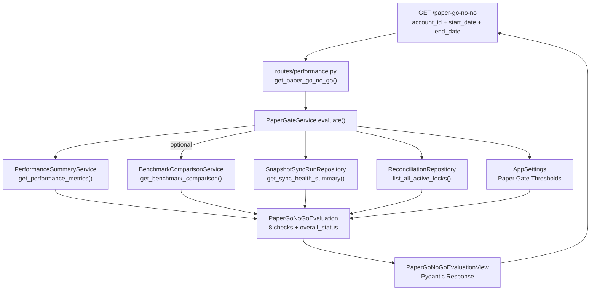

# Paper Go/No-Go Gate — 설계 문서

> **목적**: paper 운용의 성과/안정성/운영 건강도 지표를 종합하여, live 검토 자격 여부를 자동 판정하는 Gate 시스템.
>
> **핵심 원칙**:
> - 새 지표를 발명하지 않고, 기존 성과/안정성/건강도 정보를 묶는다
> - live gate 자체가 아니라, live 검토 이전의 paper 합격 기준을 시스템화
> - 기존 endpoint semantics 변경 금지, admin UI 변경 금지

---

## 1. Gate Criteria Inventory

| # | 지표명 | Source Service | Source Method | 정확/근사 | Gate 사용 |
|---|--------|---------------|---------------|-----------|-----------|
| 1 | `cumulative_return_pct` | `PerformanceSummaryService` | `get_performance_metrics()` | 정확 ✅ | **Performance** |
| 2 | `max_drawdown_pct` | `PerformanceSummaryService` | `get_performance_metrics()` | 정확 ✅ | **Performance** |
| 3 | `excess_return_pct` | `BenchmarkComparisonService` | `get_benchmark_comparison()` | 정확 ✅ | **Performance** (선택적) |
| 4 | `win_rate` | `PerformanceSummaryService` | `get_performance_metrics()` | 정확 ✅ | **Stability** |
| 5 | `total_filled_orders` | `PerformanceSummaryService` | `get_performance_metrics()` | 정확 ✅ | **Stability** |
| 6 | `is_stale` | `SnapshotSyncRunRepository` | `get_sync_health_summary()` | 정확 ✅ | **Operational Health** |
| 7 | `consecutive_failures` | `SnapshotSyncRunRepository` | `get_sync_health_summary()` | 정확 ✅ | **Operational Health** |
| 8 | active blocking locks | `ReconciliationRepository` | `list_all_active_locks()` | 정확 ✅ | **Operational Health** |

### Gate에서 사용하지 않는 지표 (의도적 제외)

| 지표 | 제외 사유 |
|------|-----------|
| avg_win / avg_loss / profit_factor | Gate 기준으로 삼기에는 trade-off가 많고, 절대적 합격선 정의가 어려움 |
| health degraded rate | paper 모드에서는 측정 불가 (live gate 영역) |
| pipeline error rate > 5% | paper_trading_loop_validation.md에 No-Go 조건으로 별도 관리; API gate에서는 제외 |

---

## 2. Data Model

### 2.1 `GateStatus` enum

```python
class GateStatus(str, Enum):
    PASS = "PASS"
    WARN = "WARN"
    FAIL = "FAIL"
```

### 2.2 `OverallStatus` enum

```python
class OverallStatus(str, Enum):
    GO = "GO"          # 모든 check PASS
    HOLD = "HOLD"      # WARN 하나 이상, FAIL 없음 — 조건부 합격
    NO_GO = "NO_GO"    # FAIL 하나 이상 — 불합격
```

### 2.3 `PaperGateCheck` dataclass

```python
@dataclass(slots=True, frozen=True)
class PaperGateCheck:
    code: str                                # e.g. "MIN_RETURN", "MAX_DRAWDOWN"
    label: str                               # 사람이 읽을 수 있는 레이블 (한국어)
    status: GateStatus                       # PASS / WARN / FAIL
    measured_value: Decimal | int | None     # 실제 측정값
    threshold: Decimal | int | None          # 기준값
    message: str                             # 해석 메시지 (한국어)
```

### 2.4 `PaperGoNoGoEvaluation` dataclass

```python
@dataclass(slots=True, frozen=True)
class PaperGoNoGoEvaluation:
    account_id: UUID
    strategy_id: UUID | None
    overall_status: OverallStatus           # GO / HOLD / NO_GO
    checks: Sequence[PaperGateCheck]        # 개별 check 결과 목록
    generated_at: datetime                  # 평가 시각
    summary_reason: str                     # 전체 요약 (한국어 1문장)
```

### 2.5 Pydantic View (schemas.py 추가)

```python
class PaperGateCheckView(BaseModel):
    code: str
    label: str
    status: GateStatus
    measured_value: str | None      # Decimal → str 직렬화
    threshold: str | None
    message: str

class PaperGoNoGoEvaluationView(BaseModel):
    account_id: str
    strategy_id: str | None
    overall_status: OverallStatus
    checks: list[PaperGateCheckView]
    generated_at: datetime
    summary_reason: str
```

---

## 3. Settings / Threshold 설계

### 3.1 Environment 변수

| 변수명 | 타입 | 기본값 | 설명 |
|--------|------|--------|------|
| `PAPER_GATE_MIN_RETURN_PCT` | Decimal | `0.0` | 최소 cumulative return (%) |
| `PAPER_GATE_MIN_EXCESS_RETURN_PCT` | Decimal | `-5.0` | 최소 benchmark 대비 초과수익 (%) |
| `PAPER_GATE_MAX_DRAWDOWN_PCT` | Decimal | `20.0` | 최대 허용 drawdown (%) |
| `PAPER_GATE_MIN_WIN_RATE_PCT` | Decimal | `0.0` | 최소 승률 (%) — WARN만 발생 |
| `PAPER_GATE_MIN_FILLED_ORDERS` | int | `3` | 최소 체결 주문 수 (sample size) |
| `PAPER_GATE_MAX_CONSECUTIVE_FAILURES` | int | `3` | 최대 연속 sync 실패 횟수 |

### 3.2 기본값 정책

- **보수적 기본값**: 모든 threshold는 paper 운용이 정상 작동 중임을 전제
  - `MIN_RETURN_PCT=0`: 음수 수익률은 FAIL
  - `MIN_EXCESS_RETURN_PCT=-5`: benchmark보다 5%p 이상 뒤쳐지면 WARN
  - `MAX_DRAWDOWN_PCT=20`: 20% 이상 drawdown은 FAIL
  - `MIN_WIN_RATE_PCT=0`: 기본적으로 승률 제한 없음 (WARN 전용, 관리자 설정 시 활성화)
  - `MIN_FILLED_ORDERS=3`: 3건 미만은 샘플 부족 → FAIL
  - `MAX_CONSECUTIVE_FAILURES=3`: 3회 이상 연속 실패 → FAIL

### 3.3 `AppSettings` 확장 (settings.py)

```python
# ---- Paper Go/No-Go Gate thresholds ------------------------------------
paper_gate_min_return_pct: Decimal = field(
    default_factory=lambda: Decimal(os.getenv("PAPER_GATE_MIN_RETURN_PCT", "0.0"))
)
paper_gate_min_excess_return_pct: Decimal = field(
    default_factory=lambda: Decimal(os.getenv("PAPER_GATE_MIN_EXCESS_RETURN_PCT", "-5.0"))
)
paper_gate_max_drawdown_pct: Decimal = field(
    default_factory=lambda: Decimal(os.getenv("PAPER_GATE_MAX_DRAWDOWN_PCT", "20.0"))
)
paper_gate_min_win_rate_pct: Decimal = field(
    default_factory=lambda: Decimal(os.getenv("PAPER_GATE_MIN_WIN_RATE_PCT", "0.0"))
)
paper_gate_min_filled_orders: int = field(
    default_factory=lambda: int(os.getenv("PAPER_GATE_MIN_FILLED_ORDERS", "3"))
)
paper_gate_max_consecutive_failures: int = field(
    default_factory=lambda: int(os.getenv("PAPER_GATE_MAX_CONSECUTIVE_FAILURES", "3"))
)
```

---

## 4. Check 설계 (6개)

### Axes & Check Matrix

| Axis | Check Code | Label | Source | Threshold | FAIL 조건 | WARN 조건 |
|------|-----------|-------|--------|-----------|-----------|-----------|
| Performance | `MIN_RETURN` | 최소 수익률 | `PerformanceMetrics.cumulative_return_pct` | `PAPER_GATE_MIN_RETURN_PCT` | `measured < threshold` | — |
| Performance | `MAX_DRAWDOWN` | 최대 손실 폭 | `PerformanceMetrics.max_drawdown_pct` | `PAPER_GATE_MAX_DRAWDOWN_PCT` | `measured > threshold` | — |
| Performance | `MIN_EXCESS_RETURN` | 벤치마크 대비 초과수익 | `BenchmarkComparison.excess_return_pct` | `PAPER_GATE_MIN_EXCESS_RETURN_PCT` | `measured < threshold` | 벤치마크 데이터 없음 |
| Stability | `MIN_WIN_RATE` | 최소 승률 | `PerformanceMetrics.win_rate` | `PAPER_GATE_MIN_WIN_RATE_PCT` | — | `measured < threshold` |
| Stability | `MIN_FILLED_ORDERS` | 최소 체결 건수 | `PerformanceMetrics.total_filled_orders` | `PAPER_GATE_MIN_FILLED_ORDERS` | `measured < threshold` | — |
| Operational | `SNAPSHOT_FRESHNESS` | 스냅샷 신선도 | `SnapshotSyncHealthSummary.is_stale` | `stale=False` | `is_stale=True` | — |
| Operational | `SYNC_FAILURES` | Sync 연속 실패 | `SnapshotSyncHealthSummary.consecutive_failures` | `PAPER_GATE_MAX_CONSECUTIVE_FAILURES` | `measured > threshold` | — |
| Operational | `BLOCKING_LOCKS` | 차단 락 존재 | `ReconciliationRepository.list_all_active_locks()` | `count=0` | `count > 0` | — |

### 4.1 Overall Status 결정 규칙

```
if any check.status == FAIL:
    overall_status = NO_GO
elif any check.status == WARN:
    overall_status = HOLD
else:
    overall_status = GO
```

### 4.2 Benchmark Data Unavailable 정책

`BenchmarkComparisonService`는 benchmark price repo가 필요합니다. 현재는 `InMemoryBenchmarkPriceRepository`로 KOSPI/KOSDAQ 데이터만 제공.

- **benchmark_code가 요청에 포함되지 않은 경우**: `MIN_EXCESS_RETURN` Check를 **SKIP** (evaluation에 포함하지 않음)
- **benchmark_code가 포함되었으나 price 데이터가 없는 경우**: `MIN_EXCESS_RETURN` Check의 status를 **WARN**, message: "벤치마크 가격 데이터를 불러올 수 없습니다"

---

## 5. Service 설계

### 5.1 `PaperGateService` — 파일: `services/paper_gate.py`

```python
class PaperGateService:
    """Paper Go/No-Go Gate evaluation service.

    Composes existing services/repos to produce a single
    ``PaperGoNoGoEvaluation`` for a given account/period.
    """

    def __init__(
        self,
        repos: RepositoryContainer,
        settings: AppSettings | None = None,
        benchmark_price_repo: BenchmarkPriceRepository | None = None,
    ) -> None:
        self._repos = repos
        self._settings = settings or AppSettings()
        self._perf_service = PerformanceSummaryService(repos)
        self._bench_service = (
            BenchmarkComparisonService(repos, benchmark_price_repo)
            if benchmark_price_repo is not None
            else None
        )

    async def evaluate(
        self,
        account_id: UUID,
        start_date: date,
        end_date: date,
        strategy_id: UUID | None = None,
        benchmark_code: str | None = None,
    ) -> PaperGoNoGoEvaluation:
        """Execute the full Go/No-Go evaluation and return the result."""

        checks: list[PaperGateCheck] = []

        # 1. Performance metrics
        metrics = await self._perf_service.get_performance_metrics(
            account_id, start_date, end_date, strategy_id
        )

        # Check 1: MIN_RETURN
        checks.append(self._check_min_return(metrics.cumulative_return_pct))

        # Check 2: MAX_DRAWDOWN
        checks.append(self._check_max_drawdown(metrics.max_drawdown_pct))

        # Check 3: MIN_EXCESS_RETURN (선택적 - benchmark_code가 있을 때)
        if benchmark_code is not None and self._bench_service is not None:
            try:
                bench = await self._bench_service.get_benchmark_comparison(
                    account_id, start_date, end_date, benchmark_code, strategy_id
                )
                checks.append(self._check_excess_return(bench.excess_return_pct))
            except Exception:
                checks.append(self._check_excess_return_unavailable())

        # Check 4: MIN_WIN_RATE
        checks.append(self._check_win_rate(metrics.win_rate))

        # Check 5: MIN_FILLED_ORDERS
        checks.append(self._check_filled_orders(metrics.total_filled_orders))

        # 2. Snapshot sync health
        health = await self._repos.snapshot_sync_runs.get_sync_health_summary(
            stale_threshold_seconds=self._settings.kis_snapshot_stale_threshold_seconds,
        )

        # Check 6: SNAPSHOT_FRESHNESS
        checks.append(self._check_snapshot_freshness(health.is_stale))

        # Check 7: SYNC_FAILURES
        checks.append(self._check_sync_failures(health.consecutive_failures))

        # 3. Reconciliation blocking locks
        active_locks = await self._repos.reconciliations.list_all_active_locks()

        # Check 8: BLOCKING_LOCKS
        checks.append(self._check_blocking_locks(len(active_locks)))

        # 4. Overall status
        overall = self._determine_overall(checks)
        summary = self._build_summary(overall, checks, metrics.total_filled_orders)

        return PaperGoNoGoEvaluation(
            account_id=account_id,
            strategy_id=strategy_id,
            overall_status=overall,
            checks=checks,
            generated_at=datetime.now(timezone.utc),
            summary_reason=summary,
        )
```

### 5.2 Pure Check Methods

각 check method는 `_check_*()` 형태의 pure/near-pure method:

```python
def _check_min_return(self, value: Decimal | None) -> PaperGateCheck:
    threshold = self._settings.paper_gate_min_return_pct
    if value is None:
        return PaperGateCheck(
            code="MIN_RETURN", label="최소 수익률",
            status=GateStatus.FAIL, measured_value=None, threshold=threshold,
            message="수익률 데이터를 계산할 수 없습니다",
        )
    if value < threshold:
        return PaperGateCheck(
            code="MIN_RETURN", label="최소 수익률",
            status=GateStatus.FAIL, measured_value=value, threshold=threshold,
            message=f"누적 수익률 {value}%이(가) 최소 기준 {threshold}%에 미달합니다",
        )
    return PaperGateCheck(
        code="MIN_RETURN", label="최소 수익률",
        status=GateStatus.PASS, measured_value=value, threshold=threshold,
        message=f"누적 수익률 {value}% — 기준 통과",
    )
```

동일한 패턴으로 8개 check method 구현.

### 5.3 Overall Status 결정

```python
@staticmethod
def _determine_overall(checks: Sequence[PaperGateCheck]) -> OverallStatus:
    has_fail = any(c.status == GateStatus.FAIL for c in checks)
    has_warn = any(c.status == GateStatus.WARN for c in checks)

    if has_fail:
        return OverallStatus.NO_GO
    if has_warn:
        return OverallStatus.HOLD
    return OverallStatus.GO
```

### 5.4 Summary 생성

```python
@staticmethod
def _build_summary(
    overall: OverallStatus,
    checks: Sequence[PaperGateCheck],
    total_orders: int,
) -> str:
    passed = sum(1 for c in checks if c.status == GateStatus.PASS)
    warned = sum(1 for c in checks if c.status == GateStatus.WARN)
    failed = sum(1 for c in checks if c.status == GateStatus.FAIL)
    total = len(checks)

    if overall == OverallStatus.GO:
        return f"전체 {total}개 항목 통과 — Paper 운용 양호, live 검토 가능"
    elif overall == OverallStatus.HOLD:
        return (
            f"{passed}/{total} 통과, {warned}개 주의 — 조건부 합격, "
            f"주의 항목 검토 후 재평가 권장"
        )
    else:
        return (
            f"{passed}/{total} 통과, {failed}개 실패 — Paper 운용 기준 미달, "
            f"실패 항목 조치 후 재평가 필요"
        )
```

---

## 6. API 설계

### 6.1 Endpoint

```
GET /paper-go-no-go
```

### 6.2 Query Parameters

| Parameter | Type | Required | Description |
|-----------|------|----------|-------------|
| `account_id` | `str` (UUID) | ✅ | 대상 계좌 UUID |
| `start_date` | `str` (YYYY-MM-DD) | ✅ | 평가 시작일 |
| `end_date` | `str` (YYYY-MM-DD) | ✅ | 평가 종료일 |
| `strategy_id` | `str` (UUID) | ❌ | 전략 필터 (선택) |
| `benchmark_code` | `str` | ❌ | 벤치마크 코드 (선택, 예: `KOSPI`) |

### 6.3 Route 구현 패턴

기존 [`routes/performance.py`](src/agent_trading/api/routes/performance.py:247)의 `get_performance_benchmark()` 패턴을 따라 구현:

```python
@router.get(
    "/paper-go-no-go",
    response_model=PaperGoNoGoEvaluationView,
)
async def get_paper_go_no_go(
    account_id: str = Query(..., description="Account UUID"),
    start_date: str = Query(..., description="Start date (YYYY-MM-DD)"),
    end_date: str = Query(..., description="End date (YYYY-MM-DD)"),
    strategy_id: str | None = Query(None, description="Optional strategy UUID"),
    benchmark_code: str | None = Query(
        None, description=f"Optional benchmark code ({sorted(VALID_BENCHMARK_CODES)})"
    ),
    repos: RepositoryContainer = Depends(get_repos),
) -> PaperGoNoGoEvaluationView:
    # UUID/date validation (same pattern as benchmark endpoint)
    # ...

    # Build service
    settings = AppSettings()
    benchmark_price_repo = ...
    service = PaperGateService(
        repos=repos,
        settings=settings,
        benchmark_price_repo=benchmark_price_repo,
    )
    evaluation = await service.evaluate(
        account_id=aid,
        start_date=sd,
        end_date=ed,
        strategy_id=sid,
        benchmark_code=benchmark_code,
    )
    return PaperGoNoGoEvaluationView.model_validate(evaluation)
```

### 6.4 Benchmark Price Repo Resolution

`benchmark_code`가 제공된 경우에만 `InMemoryBenchmarkPriceRepository`를 생성:
- 제공됨: `InMemoryBenchmarkPriceRepository(prices=_DEFAULT_BENCHMARK_PRICES)` 전달
- 미제공: `benchmark_price_repo=None` → `MIN_EXCESS_RETURN` check SKIP

---

## 7. Mermaid: 데이터 흐름



---

## 8. 변경 파일 목록

| # | 파일 | 변경 유형 | 설명 |
|---|------|-----------|------|
| 1 | `src/agent_trading/config/settings.py` | 수정 | Paper Gate threshold 6개 env config 필드 추가 |
| 2 | `src/agent_trading/services/paper_gate.py` | **신규** | `PaperGateService` + `PaperGoNoGoEvaluation` / `PaperGateCheck` dataclasses + `GateStatus` / `OverallStatus` enums |
| 3 | `src/agent_trading/api/schemas.py` | 수정 | `PaperGateCheckView` + `PaperGoNoGoEvaluationView` Pydantic models 추가 |
| 4 | `src/agent_trading/api/routes/performance.py` | 수정 | `GET /paper-go-no-go` endpoint 추가 + import |
| 5 | `tests/services/test_paper_gate.py` | **신규** | 최소 7개 테스트 (pure + 통합) |
| 6 | `plans/paper_trading_loop_validation.md` | 수정 | Go/No-Go 기준 문서에 Gate API 반영 |
| 7 | `plans/[BACKLOG] backlog.md` | 수정 | 승격 기록 추가 |

---

## 9. 테스트 계획

### 9.1 테스트 케이스 (최소 7개)

| # | 테스트명 | 유형 | 시나리오 | 기대 결과 |
|---|----------|------|----------|-----------|
| 1 | `test_all_pass_returns_go` | 통합 | 모든 지표가 threshold 충족 | `overall_status == GO`, 8개 check 모두 PASS |
| 2 | `test_one_warn_returns_hold` | 통합 | 승률이 threshold 미달 (WARN) | `overall_status == HOLD`, 1개 WARN |
| 3 | `test_one_fail_returns_no_go` | 통합 | return이 threshold 미달 (FAIL) | `overall_status == NO_GO`, 1개 FAIL |
| 4 | `test_insufficient_orders_fails` | 통합 | 체결 주문 2건 (< threshold 3) | `MIN_FILLED_ORDERS` FAIL, `overall_status == NO_GO` |
| 5 | `test_stale_snapshot_fails` | 통합 | 스냅샷 sync stale | `SNAPSHOT_FRESHNESS` FAIL, `overall_status == NO_GO` |
| 6 | `test_blocking_lock_fails` | 통합 | active blocking lock 존재 | `BLOCKING_LOCKS` FAIL, `overall_status == NO_GO` |
| 7 | `test_with_benchmark_code` | 통합 | benchmark_code 제공 → MIN_EXCESS_RETURN check 포함 | 8개 check (MIN_EXCESS_RETURN 포함) |
| 8 | `test_without_benchmark_code` | 통합 | benchmark_code 미제공 → MIN_EXCESS_RETURN SKIP | 7개 check (MIN_EXCESS_RETURN 미포함) |

### 9.2 Mock/Seed 전략

- `_seed_repos()`: `test_performance_summary.py`의 `_seed_repos()` 패턴 재사용 — 최소한의 account, order, fill, position, cash snapshot 데이터
- `InMemorySnapshotSyncRunRepository`: 직접 seed하여 health summary 제어
- `InMemoryReconciliationRepository`: `acquire_lock()`으로 lock 생성
- `AppSettings` overrides: threshold를 테스트에 맞게 조정 가능한 값으로 설정

### 9.3 확인 항목

- 각 check의 `code` / `label` / `status` / `measured_value` / `threshold` / `message` 정확성
- `overall_status` 결정 규칙 검증 (FAIL 우선, 다음 WARN, else PASS)
- `summary_reason`에 실패/주의 개수 포함 확인
- `generated_at`이 UTC datetime인지 확인

---

## 10. 실행 단계

| 단계 | 작업 | 파일 | 비고 |
|------|------|------|------|
| 1 | `settings.py` threshold 6개 추가 | `src/agent_trading/config/settings.py` | `paper_gate_*` 필드 6개 |
| 2 | `services/paper_gate.py` 신규 생성 | `src/agent_trading/services/paper_gate.py` | `PaperGateService` + dataclasses + enums |
| 3 | `schemas.py` Pydantic models 추가 | `src/agent_trading/api/schemas.py` | `PaperGateCheckView` + `PaperGoNoGoEvaluationView` |
| 4 | `routes/performance.py` endpoint 추가 | `src/agent_trading/api/routes/performance.py` | `GET /paper-go-no-go` |
| 5 | `tests/services/test_paper_gate.py` 신규 생성 | `tests/services/test_paper_gate.py` | 7개 테스트 |
| 6 | `pytest` 실행 및 회귀 확인 | — | 모든 기존 테스트 회귀 없음 확인 |
| 7 | `plans/paper_trading_loop_validation.md` 업데이트 | `plans/paper_trading_loop_validation.md` | Go/No-Go 기준에 Gate API 반영 |
| 8 | `plans/[BACKLOG] backlog.md` 업데이트 | `plans/[BACKLOG] backlog.md` | 승격 기록 추가 |
