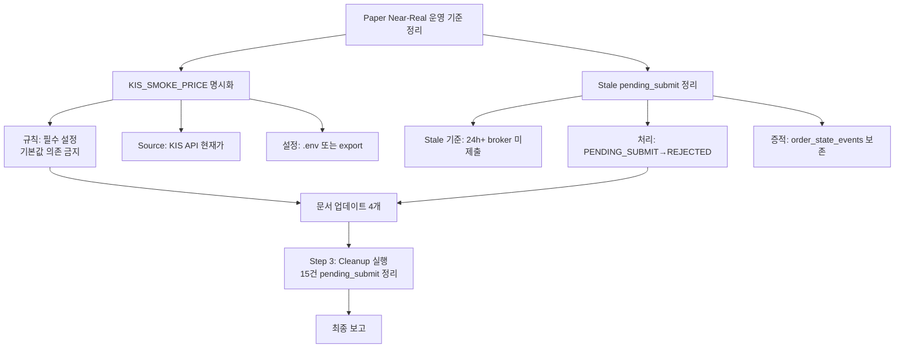

# KIS Paper Near-Real 운영 기준 정리 — 실행 계획

> **목적**: KIS paper 환경을 near-real execution environment로 운영할 때 남은 2가지 운영 이슈를 정리
> 1. `KIS_SMOKE_PRICE` 명시화 (기본값 50000 의존 금지)
> 2. stale `pending_submit` 주문 정리 기준 고정
>
> **제약**: 코드 수정 금지, broker submit semantics 변경 금지, admin UI 변경 금지

---

## 현재 상태 요약

### KIS_SMOKE_PRICE
| 항목 | 값 |
|------|-----|
| `.env` 설정 | ❌ 미설정 |
| Shell env | ❌ 미설정 |
| `_resolve_smoke_price()` 기본값 | `50000` |
| 실증 결과 (2026-05-13) | `50000` → ❌ `msg_cd=40270000` (모의투자 상/하한가 오류) |
| 실증 결과 (2026-05-13) | `267000` (KIS API 현재가) → ✅ SUBMITTED |

### Stale pending_submit 주문
| 항목 | 값 |
|------|-----|
| 총 건수 | **15건** |
| 생성일 | **2026-05-11** (~48시간 경과) |
| price=50000 | 1건 (`472be31a`) |
| price=268500 | 14건 |
| broker_orders 연결 | **0건** (모두 broker 미제출) |
| 상태 | `pending_submit`에서 대기 중 |
| 허용 상태전이 | → `SUBMITTED` / `RECONCILE_REQUIRED` / `REJECTED` (CANCELLED 불가) |

---

## 실행 계획

### Step 1. `KIS_SMOKE_PRICE` 운영 규칙 고정

**규칙 내용:**
1. **near-real submit 전 KIS_SMOKE_PRICE 필수 설정** — 기본값 50000은 mock 용도로만 허용
2. **설정 source**: KIS REST API `inquire-price` (stck_prpr)로 현재가 조회 후 설정
3. **설정 방법**: `.env`에 명시 또는 실행 직전 `export`
4. **미설정 시 위험**: KIS paper API가 `msg_cd=40270000` (모의투자 상/하한가 오류) 반환 → submit 실패

**변경 대상 문서:**
- [`paper_submit_smoke_ops_checklist.md#7`](plans/paper_submit_smoke_ops_checklist.md:345): Phase 2.5에 "필수 설정"으로 격상
- [`paper_submit_smoke_ops_checklist.md#2-B`](plans/paper_submit_smoke_ops_checklist.md:66): 필수 env vars 목록에 KIS_SMOKE_PRICE 추가
- [`paper_submit_smoke_ops_checklist.md#11`](plans/paper_submit_smoke_ops_checklist.md:634): 실수 포인트에 KIS_SMOKE_PRICE 미설정 추가

### Step 2. Stale `pending_submit` 정리 기준 정의

**Stale 판정 기준:**
```
status = 'pending_submit'
AND created_at < (NOW() - INTERVAL '24 hours')
AND NOT EXISTS (SELECT 1 FROM broker_orders WHERE order_request_id = order_requests.order_request_id)
```

- **24시간** 기준: 장중 1 session(6시간) + 다음 session까지 대기 시간 포함
- broker 미제출이 확인된 경우만 대상
- `reconcile_required` 주문은 **대상 제외** (broker에 제출 완료된 주문)

**처리 방침:**
- ✅ **수동 cleanup 권장**: 검증 전 preflight 단계에서 stale pending_submit 발견 시 정리
- ✅ **상태전이**: `PENDING_SUBMIT → REJECTED` (reason_code="stale_cleanup")
- ⛔ **DELETE 금지**: 검증 증적 보존을 위해 상태전이만 수행
- ⛔ **CANCELLED 불가**: 상태전이 테이블에서 PENDING_SUBMIT → CANCELLED 경로 없음

### Step 3. Cleanup 실행 (Code mode 필요)

**현재 DB의 15건 pending_submit 처리:**

| 대상 | 건수 | price | 판단 |
|------|------|-------|------|
| `472be31a` | 1건 | 50000 | ✅ **정리**: 기본값으로 생성된 잘못된 주문 |
| 14건 | 14건 | 268500 | ✅ **정리**: 2026-05-11 생성, broker 미제출, 48h 경과 |

**실행 방법** (코드 수정 없음, 임시 스크립트 사용):
```python
# PENDING_SUBMIT → REJECTED 상태전이
# order_state_events에 이벤트 기록
UPDATE order_requests SET status='rejected', status_reason_code='stale_cleanup', updated_at=NOW()
WHERE status='pending_submit' AND created_at < NOW() - INTERVAL '24 hours'
AND order_request_id NOT IN (SELECT order_request_id FROM broker_orders);

-- order_state_events에 기록
INSERT INTO order_state_events (order_state_event_id, order_request_id, previous_status, new_status, 
    reason_code, event_source, event_timestamp, created_at)
SELECT gen_random_uuid(), order_request_id, 'pending_submit', 'rejected',
    'stale_cleanup', 'system', NOW(), NOW()
FROM order_requests WHERE status='rejected' AND status_reason_code='stale_cleanup';
```

**위험 평가:**
- broker_orders 연결 없음 → 안전
- `reconcile_required` 주문과 혼동 없음
- 검증 증적은 `order_state_events`에 보존됨

### Step 4. 문서 업데이트

**변경 대상 문서:**

| 문서 | 변경 내용 |
|------|----------|
| [`paper_submit_smoke_ops_checklist.md`](plans/paper_submit_smoke_ops_checklist.md) | ① Phase 2.5: KIS_SMOKE_PRICE "권장" → "필수" ② 2-B: 필수 env vars에 추가 ③ 11: 실수 포인트 #10 추가 ④ Phase 5: stale pending_submit cleanup 기준 추가 |
| [`paper_submit_success_docs_final_report.md`](plans/paper_submit_success_docs_final_report.md) | ① 2.2: KIS_SMOKE_PRICE 규칙을 "필수"로 격상 ② 신규 Section: stale pending_submit 정리 기준 |
| [`live_verification_prerequisites.md`](plans/live_verification_prerequisites.md) | Preflight 체크리스트에 KIS_SMOKE_PRICE 확인 + stale pending_submit 확인 항목 추가 |
| [`paper_mock_boundary_validation_scope.md`](plans/paper_mock_boundary_validation_scope.md) | 남은 리스크에 stale pending_submit 누적 리스크 추가 |

---

## 다이어그램



---

## 승인 요청

이 계획에 대해 승인하시겠습니까? 승인 후 Code mode로 전환하여 Step 3 cleanup을 실행하고 문서를 업데이트합니다.

### 주요 판단 포인트
1. **KIS_SMOKE_PRICE 필수 설정**: 기본값 50000 의존 금지에 동의하시나요?
2. **Stale 기준 24h**: 적절한가요? 아니면 다른 기준을 원하시나요?
3. **Cleanup 실행**: 15건 pending_submit을 REJECTED로 상태전이해도 될까요?
4. **문서 변경 범위**: 4개 문서 업데이트에 동의하시나요?
