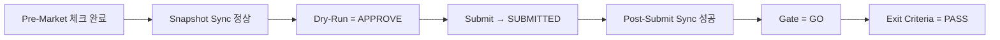
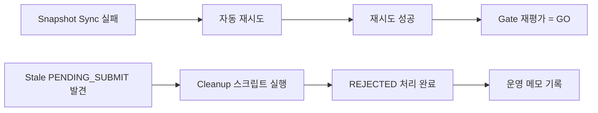

# KIS Paper 환경 1개월 운영 체크리스트 — 일일 루틴 / 장중 루틴 / cleanup / 성과 점검

> **⚠️ 운영 전제**: 현재 `KIS_ENV=paper`를 **운영상 live 환경으로 취급**한다.
> 모든 루틴은 실제 운영자가 그대로 실행 가능해야 하며, 아래 규칙을 **반드시** 준수한다.
>
> - **Python 실행**: 항상 `python3` 사용 (`python` 사용 금지)
> - **Shell 실행**: 항상 `/bin/bash` 기준 (`/bin/sh` 사용 금지)
> - **env 로드**: `bash -c 'set -a; source .env; set +a && ...'` 패턴 사용
> - **DB 스키마**: 모든 테이블은 public 스키마, 스키마 prefix 불필요 (`trading.` prefix 사용 금지)
> - **status 값**: DB enum 값은 **소문자** (`pending_submit`, `reconcile_required`, `failed`)
> - **KIS_SMOKE_PRICE**: 기본값 50000 의존 금지, 반드시 시장가와 일치시킬 것

> **운영 전제**: 현재 [`KIS_ENV=paper`](src/agent_trading/config/settings.py:120)를 실제 live 운영 환경으로 간주한다.
> 사용자가 직접 `.env`를 변경해 `real` 전환을 지시하기 전까지는 현 체제를 계속 운영한다.
>
> **작성 기준**: 2026-05-13, 아래 문서들을 종합하여 작성
> - [`paper_submit_smoke_ops_checklist.md`](plans/paper_submit_smoke_ops_checklist.md)
> - [`paper_nearreal_ops_cleanup_plan.md`](plans/paper_nearreal_ops_cleanup_plan.md)
> - [`paper_go_no_go_gate.md`](plans/paper_go_no_go_gate.md)
> - [`paper_exit_criteria.md`](plans/paper_exit_criteria.md)
> - [`paper_performance_summary.md`](plans/paper_performance_summary.md)
> - [`paper_performance_history.md`](plans/paper_performance_history.md)
> - [`paper_performance_metrics.md`](plans/paper_performance_metrics.md)
> - [`live_transition_operational_plan.md`](plans/live_transition_operational_plan.md)
> - [`live_verification_prerequisites.md`](plans/live_verification_prerequisites.md)
> - [`paper_mock_boundary_validation_scope.md`](plans/paper_mock_boundary_validation_scope.md)

---

## 목차

1. [일일 루틴 맵](#1-일일-루틴-맵)
2. [A. Pre-Market Routine (개장 전) — 08:00–08:50 KST](#a-pre-market-routine-개장-전--08000850-kst)
3. [B. Intraday Routine (장중) — 08:50–15:30 KST](#b-intraday-routine-장중--08501530-kst)
4. [C. End-of-Day Routine (장후) — 15:30–16:30 KST](#c-end-of-day-routine-장후--15301630-kst)
5. [D. Weekly Review (주간) — 매주 금요일 장후](#d-weekly-review-주간--매주-금요일-장후)
6. [E. Exception Handling (예외 대응)](#e-exception-handling-예외-대응)
7. [CTO Demonstration Observation Points](#7-cto-demonstration-observation-points)
8. [1개월 운영 일정표](#8-1개월-운영-일정표)
9. [참고: 관련 스크립트 및 명령어](#9-참고-관련-스크립트-및-명령어)

---

## 1. 일일 루틴 맵

```mermaid
flowchart TD
    subgraph PreMarket["A. Pre-Market (08:00-08:50)"]
        A1["A1: KIS_ENV 확인"]
        A2["A2: Env vars 적재 확인"]
        A3["A3: KIS_SMOKE_PRICE 검증"]
        A4["A4: DB connectivity"]
        A5["A5: Token cache 확인"]
        A6["A6: Snapshot freshness"]
        A7["A7: Stale pending_submit 정리"]
        A8["A8: Audit log 확인"]
    end

    subgraph Intraday["B. Intraday (08:50-15:30)"]
        B1["B1: Snapshot sync loop 동작 확인"]
        B2["B2: Dry-run 검증"]
        B3["B3: Submit 조건 확인"]
        B4["B4: Submit 실행"]
        B5["B5: Post-submit sync 1회"]
        B6["B6: Reconcile_required 모니터링"]
        B7["B7: 성과/포지션/현금 모니터링"]
    end

    subgraph EndOfDay["C. End-of-Day (15:30-16:30)"]
        C1["C1: Snapshot sync 최종 확인"]
        C2["C2: 실패/예외 케이스 정리"]
        C3["C3: Stale cleanup 필요 여부"]
        C4["C4: 일일 성과 기록"]
        C5["C5: 운영 메모 기록"]
    end

    subgraph Weekly["D. Weekly Review (금요일)"]
        D1["D1: Gate 평가"]
        D2["D2: Exit criteria 평가"]
        D3["D3: Sync/stale/lock 추세"]
        D4["D4: AI decision quality"]
        D5["D5: CTO 지표 정리"]
    end

    PreMarket --> Intraday
    Intraday --> EndOfDay
    EndOfDay --> Weekly
```



### 루틴별 수행 시간

| 루틴 | 시간 범위 KST | 소요 시간 | 담당 |
|---|---|---|---|
| A. Pre-Market | 08:00–08:50 | ~30분 | 운영자 |
| B. Intraday | 08:50–15:30 | 필요시 5분 | 운영자 (간헐적 확인) |
| C. End-of-Day | 15:30–16:30 | ~20분 | 운영자 |
| D. Weekly | 금 16:30–17:00 | ~30분 | 운영자 |

---

## 2. A. Pre-Market Routine (개장 전) — 08:00–08:50 KST

> **목적**: 장 시작 전 시스템이 정상 상태인지 확인하고, 장중 발생할 수 있는 문제를 사전 차단한다.

### A-1. KIS_ENV 및 운영 환경 확인 [필수]

| # | 항목 | 명령어 / 확인 방법 | 성공 기준 | 실패 시 대응 |
|---|---|---|---|---|
| 1 | `KIS_ENV` 확인 | `echo $KIS_ENV` 또는 `.env` 파일 확인 | `paper` | `real`이면 즉시 중단, 원인 파악 |
| 2 | Python 가상환경 확인 | `which python3 && python3 --version` | Python 3.11+ 정상 출력 | 가상환경 재설정 |
| 3 | DB URL 로드 확인 | `grep DATABASE_URL .env \| head -1` | 정상 URL 출력 | `.env` 재확인, shell scope 확인 |

> **KIS REST endpoint 참고**: 아래 표는 KIS paper/live 환경의 REST endpoint를 정리한 것이다.
> 모든 curl 예시와 스크립트는 이 기준을 따라야 한다.
>
> | 환경 | Hostname | Port | REST Base URL |
> |---|---|---|---|
> | **paper** (모의투자) | `openapivts.koreainvestment.com` | **29443** | `https://openapivts.koreainvestment.com:29443` |
> | **live** (실전) | `openapi.koreainvestment.com` | **9443** | `https://openapi.koreainvestment.com:9443` |

### A-2. 필수 환경변수 적재 확인 [필수]

| # | 변수명 | 확인 방법 | 성공 기준 |
|---|---|---|---|
| 1 | `KIS_APP_KEY` | `grep KIS_APP_KEY .env` | non-empty |
| 2 | `KIS_APP_SECRET` | `grep KIS_APP_SECRET .env` | non-empty |
| 3 | `KIS_PAPER_REST_RPS` | `grep KIS_PAPER_REST_RPS .env` | `1` (canonical; 과거 RPS=1 실패 이력은 budget 분배 로직 개선으로 해소) |
| 4 | `KIS_SMOKE_PRICE` | `grep KIS_SMOKE_PRICE .env` | non-empty, 시장가와 일치 |
| 5 | `DEEPSEEK_API_KEY` | `grep DEEPSEEK_API_KEY .env` | non-empty |
| 6 | `DEEPSEEK_MODEL_ID` | `grep DEEPSEEK_MODEL_ID .env` | non-empty (권장: `deepseek-chat`) |

> **⚠️ 실수 포인트 #1**: [`DATABASE_URL` shell scope](plans/paper_submit_smoke_ops_checklist.md:106) — `.env`는 `export`하지 않으므로 `source .env` 후에도 shell 변수로만 존재. DB 접근 스크립트는 python-dotenv를 통해 로드해야 함.
>
> **Shell 실행 규칙**: 모든 명령은 `/bin/bash` 기준. `/bin/sh`는 `source` 명령을 지원하지 않으므로 반드시 `bash -c 'set -a; source .env; set +a && ...'` 패턴을 사용할 것.

### A-3. KIS_SMOKE_PRICE 현재가 일치 검증 [필수]

> **⚠️ 중요**: `KIS_SMOKE_PRICE`는 **기본값 50000에 절대 의존하지 말 것**.
> 기본값 의존 시 `msg_cd=40270000` (가격 차이 과다) 또는 `msg_cd=267000` 오류가 발생하여 Submit이 실패한다.
> 반드시 KIS API로 현재가를 조회하여 `.env`에 설정한 후 진행한다.

[`KIS_SMOKE_PRICE`](plans/paper_submit_smoke_ops_checklist.md:345)는 장 시작 전 반드시 시장가와 일치해야 한다.

```bash
# python-dotenv로 .env 로드 → token cache 파일 읽기 → curl로 KIS API 현재가 조회
python3 -c "
from dotenv import load_dotenv
import os, json, subprocess, sys

load_dotenv()

# token cache 파일에서 access_token 읽기
cache_path = '.cache/kis_token.json'
try:
    with open(cache_path) as f:
        data = json.load(f)
    token = data.get('access_token', '')
except (FileNotFoundError, json.JSONDecodeError):
    token = ''

if not token:
    print('TOKEN_EMPTY — 캐시 파일 없음. snapshot sync 실행 후 재시도')
    sys.exit(1)

# curl로 KIS API 현재가 조회 (-k: KIS 모의투자 SSL 인증서 호스트명 불일치 대응)
# 주의: inquire-price는 authorization 외에도 appkey, appsecret, tr_id 헤더가 필요
result = subprocess.run(
    ['curl', '-s', '-k',
     '-H', 'content-type: application/json',
     '-H', f'authorization: Bearer {token}',
     '-H', f'appkey: {os.getenv(\"KIS_APP_KEY\", \"\")}',
     '-H', f'appsecret: {os.getenv(\"KIS_APP_SECRET\", \"\")}',
     '-H', 'tr_id: FHKST01010100',
     'https://openapivts.koreainvestment.com:29443/uapi/domestic-stock/v1/quotations/inquire-price?FID_COND_MRKT_DIV_CODE=J&FID_INPUT_ISCD=005930'],
    capture_output=True, text=True)
data = json.loads(result.stdout)
if data.get('rt_cd') != '0':
    print(f'API error: {data.get(\"msg1\", \"unknown\")} (code={data.get(\"msg_cd\", \"\")})')
    print('→ 토큰 만료 또는 appkey/appsecret 불일치. snapshot sync 실행 후 재시도')
    sys.exit(1)
price = data.get('output', {}).get('stck_prpr', 'NOT_FOUND')
print(f'005930 current price: {price}')
"
```

| 상태 | 조치 |
|---|---|
| 현재가 ≠ `.env`의 `KIS_SMOKE_PRICE` | `.env` 업데이트: `KIS_SMOKE_PRICE=<현재가>` |
| API 호출 실패 | 네트워크/토큰 확인, 수동으로 `KIS_SMOKE_PRICE` 설정 |
| `stck_prpr` = `NOT_FOUND` | 장 시간 확인, 휴장일 가능성 |

> **실수 포인트 #6 참조**: [`KIS_SMOKE_PRICE` 미설정 또는 시장가 불일치](plans/paper_submit_smoke_ops_checklist.md:404)

### A-4. DB Connectivity 확인 [필수]

```bash
# python-dotenv로 .env 로드 → DatabaseConfig.resolved_dsn 조합 → asyncpg 연결
python3 -c "
from dotenv import load_dotenv
import os, asyncio, asyncpg

load_dotenv()

host = os.getenv('DATABASE_HOST', 'localhost')
port = int(os.getenv('DATABASE_PORT', '5432'))
user = os.getenv('DATABASE_USER', 'trading')
password = os.getenv('DATABASE_PASSWORD', 'trading')
database = os.getenv('DATABASE_NAME', 'trading')
dsn = f'postgresql://{user}:{password}@{host}:{port}/{database}'

async def check():
    conn = await asyncpg.connect(dsn=dsn)
    val = await conn.fetchval('SELECT 1')
    print(f'DB connected: SELECT 1 = {val}')
    await conn.close()

asyncio.run(check())
"
```

| 상태 | 조치 |
|---|---|
| `SELECT 1` → `1` | ✅ 정상 |
| Connection refused / timeout | Docker 컨테이너 상태 확인, `docker-compose ps` |
| Authentication failed | `DATABASE_URL` 자격 증명 확인 |

### A-5. Token Cache 상태 확인 [권장]

[Token cache](src/agent_trading/brokers/koreainvestment/rest_client.py:320)는 **파일 기반**(`.cache/kis_token.json`)으로 저장된다.
DB 테이블(`kis_token_cache`)은 존재하지 않으므로 파일로 직접 확인한다.

```bash
# 캐시 파일 확인
ls -la .cache/kis_token.json 2>/dev/null || echo "캐시 없음"

# 캐시 내용 확인 (파일 직접 읽기)
python3 -c "
import json, os
from datetime import datetime, timezone
cache_path = '.cache/kis_token.json'
if os.path.exists(cache_path):
    with open(cache_path) as f:
        data = json.load(f)
    token = data.get('access_token', '')
    expires_at = data.get('expires_at', 'unknown')
    print(f'Token exists: {bool(token)}')
    print(f'Token expires: {expires_at}')
else:
    print('No cached token (file not found)')
"
```

| 상태 | 조치 |
|---|---|
| Valid token 있음 | ✅ 정상 |
| Token 만료 임박 (1h 이내) | 장중 첫 요청 시 자동 갱신, 문제 없음 |
| Token 없음 | 첫 API 호출 시 자동 발급, 문제 없음 |

### A-6. Snapshot Freshness 확인 [필수]

[Snapshot sync loop](scripts/run_snapshot_sync_loop.py)가 장 시작 전에 최소 1회 성공했는지 확인.

```bash
python3 -c "
from dotenv import load_dotenv
import os, asyncio, asyncpg
from datetime import datetime, timezone

load_dotenv()
host = os.getenv('DATABASE_HOST', 'localhost')
port = int(os.getenv('DATABASE_PORT', '5432'))
user = os.getenv('DATABASE_USER', 'trading')
password = os.getenv('DATABASE_PASSWORD', 'trading')
database = os.getenv('DATABASE_NAME', 'trading')
dsn = f'postgresql://{user}:{password}@{host}:{port}/{database}'

async def check():
    conn = await asyncpg.connect(dsn=dsn)
    rows = await conn.fetch('''
        SELECT snapshot_sync_run_id, started_at, status
        FROM trading.snapshot_sync_runs
        ORDER BY started_at DESC LIMIT 5
    ''')
    for r in rows:
        age = datetime.now(timezone.utc) - r['started_at']
        print(f'Run {r[\"snapshot_sync_run_id\"]}: started={r[\"started_at\"]}, age={age.total_seconds()/60:.0f}min, status={r[\"status\"]}')
    await conn.close()
asyncio.run(check())
"
```

| 조건 | 성공 기준 |
|---|---|
| 최근 sync가 30분 이내 | ✅ Fresh |
| 최근 sync가 30분–2시간 | ⚠️ Stale 경향 — sync loop 재시작 고려 |
| 최근 sync가 2시간 초과 | ❌ Stale — [sync loop 실행](scripts/run_snapshot_sync_loop.py) 필수 |

### A-7. Stale PENDING_SUBMIT 정리 [필수/조건부]

[정리 기준](plans/paper_submit_smoke_ops_checklist.md:616): `status=pending_submit` + `created_at < 24h` + `broker_orders 없음` → `REJECTED (reason_code=stale_cleanup)`

```bash
python3 _cleanup_pending_submit.py
```

> **사전 검증**: `SELECT COUNT(*) FROM trading.order_requests WHERE status='pending_submit' AND created_at < NOW() - INTERVAL '24 hours'` 가 0보다 크면 실행.

| 결과 | 의미 |
|---|---|
| `Deleted 0 rows` | 정리할 대상 없음 ✅ |
| `Deleted N rows` (N>0) | N건 정리 완료, 원인 분석 필요 |
| `reconcile_required` 영향 없음 | 정상 — [`reconcile_required`는 허용된 상태](plans/paper_mock_boundary_validation_scope.md:69) |

> **참고**: [정리 이후에도 동일 계정에서 계속 `PENDING_SUBMIT`이 누적](plans/paper_submit_success_docs_final_report.md:87)되면 근본 원인 분석 필요 (reset 조건, submit 조건, broker 연동).

### A-8. Audit Log / Logging 확인 [권장]

```bash
# 최근 10건의 audit_logs 확인
python3 -c "
from dotenv import load_dotenv
import os, asyncio, asyncpg

load_dotenv()
host = os.getenv('DATABASE_HOST', 'localhost')
port = int(os.getenv('DATABASE_PORT', '5432'))
user = os.getenv('DATABASE_USER', 'trading')
password = os.getenv('DATABASE_PASSWORD', 'trading')
database = os.getenv('DATABASE_NAME', 'trading')
dsn = f'postgresql://{user}:{password}@{host}:{port}/{database}'

async def check():
    conn = await asyncpg.connect(dsn=dsn)
    rows = await conn.fetch('''
        SELECT audit_log_id, actor_type, action, target_entity_type, created_at
        FROM trading.audit_logs
        ORDER BY created_at DESC LIMIT 10
    ''')
    for r in rows:
        print(f'{r[\"created_at\"]} | actor={r[\"actor_type\"]} | action={r[\"action\"]} | target={r[\"target_entity_type\"]}')
    await conn.close()
asyncio.run(check())
"
```

> **참고**: `audit_logs` 테이블에는 `status` / `error_message` 컬럼이 없다. 오류 로그 식별은 `action` 값 또는 `metadata` JSONB 필드를 통해 확인한다.

| 상태 | 조치 |
|---|---|
| 정상 로그만 출력 | ✅ |
| `action`에 `error`/`failure` 포함 다수 | 원인 분석 후 조치 |

---

## 3. B. Intraday Routine (장중) — 08:50–15:30 KST

> **목적**: 장중 시스템이 정상적으로 동작하는지 간헐적으로 확인하고, 장애 발생 시 빠르게 대응한다.

### B-1. Snapshot Sync Loop 동작 확인 [권장/30분]

Snapshot sync loop는 장중 지속적으로 실행되는 것이 이상적이나, 수동 실행(1회성)도 운영 방식으로 허용된다.
아래 두 가지를 구분하여 확인한다.

**① Sync loop 프로세스 실행 여부 확인**

```bash
ps aux | grep run_snapshot_sync_loop | grep -v grep
```

- 프로세스가 살아 있으면 loop 모드로 동작 중
- 프로세스가 없으면 수동 실행 상태 — 아래 freshness 확인으로 대체 가능

**② 최근 sync freshness 확인**

아래 스크립트로 마지막 sync 시점과 상태를 확인한다. DSN 조합 방식은 A-6/A-8과 동일하다.

```bash
python3 -c "
from dotenv import load_dotenv
import os, asyncio, asyncpg
from datetime import datetime, timezone

load_dotenv()
host = os.getenv('DATABASE_HOST', 'localhost')
port = int(os.getenv('DATABASE_PORT', '5432'))
user = os.getenv('DATABASE_USER', 'trading')
password = os.getenv('DATABASE_PASSWORD', 'trading')
database = os.getenv('DATABASE_NAME', 'trading')
dsn = f'postgresql://{user}:{password}@{host}:{port}/{database}'

async def check():
    conn = await asyncpg.connect(dsn=dsn)
    row = await conn.fetchrow('''
        SELECT started_at, status
        FROM trading.snapshot_sync_runs
        ORDER BY started_at DESC LIMIT 1
    ''')
    if row:
        age = datetime.now(timezone.utc) - row['started_at']
        print(f'last_sync: {row[\"started_at\"]}, age: {age.total_seconds()/60:.0f}min, status: {row[\"status\"]}')
    else:
        print('No sync records found')
    await conn.close()
asyncio.run(check())
"
```

> **참고**: `snapshot_sync_runs` 테이블에는 `error_message` 컬럼이 없다. 실패 원인은 별도 로그 파일에서 확인한다.

| 조건 | 평가 | 조치 |
|---|---|---|
| Loop 실행 중, age < 30min | ✅ 정상 | — |
| Loop 미실행, age < 30min | ✅ 정상 (수동 실행) | loop 시작은 선택 |
| Loop 미실행, age > 30min | ⚠️ freshness 저하 | `python3 scripts/run_snapshot_sync_loop.py --max-cycles=1` 으로 1회 실행 |
| Sync 실패 반복 (`status = failed`) | ❌ 장애 가능성 | KIS API 상태 확인, 로그 분석 |

### B-2. Dry-Run 검증 [권장/1시간]

장중 1회 이상 dry-run으로 AI 결정 상태를 확인한다.

```bash
set -a; source .env; set +a

python3 scripts/run_orchestrator_once.py --dry-run 2>&1 | tail -30
```

| 결과 | 의미 |
|---|---|
| Decision: `APPROVE` | ✅ 정상 — AI가 매매 신호 감지 |
| Decision: `HOLD` / `WATCH` | ✅ 정상 — 현재 매매 조건 아님 |
| Decision: `SKIP` | ✅ 정상 — sizing 결과 0 |
| Error / Exception | ❌ 로그 분석, 필요시 재시도 |

> **참고**: AI 결정은 확률적이므로 [`HOLD`가 연속 나와도](plans/paper_submit_smoke_ops_checklist.md:435) 시스템 이상이 아님. 다만 1주일 이상 단 한 번도 `APPROVE`가 없다면 AI 프롬프트/입력 이벤트 품질 점검 필요.

### B-3. Submit 조건 확인 [필수]

실제 submit 전에 아래 조건이 모두 충족되는지 확인한다.

| 조건 | 확인 방법 | 필수 여부 |
|---|---|---|
| Dry-run 결과 = `APPROVE` | 위 B-2 결과 | 필수 |
| `KIS_SMOKE_PRICE` 설정 | `echo $KIS_SMOKE_PRICE` | 필수 |
| Snapshot fresh (30분 이내) | B-1 결과 | 필수 |
| Token cache 유효 | A-5 결과 | 권장 |
| Stale pending_submit 없음 | A-7 결과 | 권장 |

### B-4. Submit 실행 [필수/조건부]

B-3 조건이 모두 충족될 때만 submit을 실행한다.

```bash
set -a; source .env; set +a

python3 scripts/run_orchestrator_once.py 2>&1
```

| 결과 | 의미 |
|---|---|
| `SUBMITTED` | ✅ 성공 — broker 접수 완료 |
| `RECONCILE_REQUIRED` | ⚠️ Broker 응답 불확실 — [허용 가능 상태](plans/paper_mock_boundary_validation_scope.md:69), post-submit sync로 해소 |
| `REJECTED` | ❌ Broker 거절 — `msg_cd` 확인, 원인 분석 |
| `ERROR` | ❌ 시스템 오류 — 로그 분석 |

### B-5. Post-Submit Sync 1회 [필수/submit 직후]

Submit 직후 post-submit sync를 1회 실행하여 broker 상태를 확인한다.

```bash
# 단발 1회 실행 (max-cycles=1)
python3 scripts/run_post_submit_sync_loop.py --max-cycles=1 --interval=5 2>&1 | tail -20
```

| 확인 항목 | 성공 기준 |
|---|---|
| [Broker Orders](plans/paper_submit_smoke_ops_checklist.md:520) | `status` = 접수/체결 상태 |
| [Order State Events](plans/paper_nearreal_ops_cleanup_plan.md:93) | 정상 상태전이 이벤트 기록됨 |
| `reconcile_required` 건수 | 증가 없거나 허용 범위 내 |

### B-6. Reconcile_required 모니터링 [권장/1시간]

`reconcile_required`는 broker 응답이 불확실할 때 발생하는 상태로, KIS paper mock의 한계상 일부 허용된다.
단, 급증하거나 지속 증가하면 원인 분석이 필요하다.

> DSN 조합 방식은 [B-1](#b-1-snapshot-sync-loop-동작-확인-권장30분)을 참고한다.

```bash
python3 -c "
from dotenv import load_dotenv
import os, asyncio, asyncpg

load_dotenv()
host = os.getenv('DATABASE_HOST', 'localhost')
port = int(os.getenv('DATABASE_PORT', '5432'))
user = os.getenv('DATABASE_USER', 'trading')
password = os.getenv('DATABASE_PASSWORD', 'trading')
database = os.getenv('DATABASE_NAME', 'trading')
dsn = f'postgresql://{user}:{password}@{host}:{port}/{database}'

async def check():
    conn = await asyncpg.connect(dsn=dsn)
    count = await conn.fetchval(\"SELECT COUNT(*) FROM trading.order_requests WHERE status='reconcile_required'\")
    print(f'reconcile_required 건수: {count}')
    if count > 0:
        rows = await conn.fetch('''
            SELECT order_request_id, created_at
            FROM trading.order_requests WHERE status='reconcile_required'
            ORDER BY created_at DESC
        ''')
        for r in rows[:5]:
            print(f'  {r[\"order_request_id\"]} | created={r[\"created_at\"]}')
    await conn.close()
asyncio.run(check())
"
```

| 건수 | 평가 | 조치 |
|---|---|---|
| 0건 | ✅ 정상 | — |
| 1–5건 | ⚠️ 관찰 — 증가 추세 확인 | 시간 경과에 따라 재측정 |
| 5건 초과 | ⚠️ 주의 — 절대 실패 기준 아님 | broker 연동 상태 점검, post-submit sync로 해소 가능 |
| 급증 (단기간 2배↑) | ❌ 원인 분석 필요 | 로그 분석, 필요시 수동 정리 |

### B-7. 성과/포지션/현금 모니터링 [권장]

```bash
# 성과 요약 조회 (API 통해)
curl -s http://localhost:8000/performance-summary 2>/dev/null | python3 -m json.tool || echo "API not available"

# 포지션 확인 (DSN 조합 방식은 B-1 참고)
python3 -c "
from dotenv import load_dotenv
import os, asyncio, asyncpg

load_dotenv()
host = os.getenv('DATABASE_HOST', 'localhost')
port = int(os.getenv('DATABASE_PORT', '5432'))
user = os.getenv('DATABASE_USER', 'trading')
password = os.getenv('DATABASE_PASSWORD', 'trading')
database = os.getenv('DATABASE_NAME', 'trading')
dsn = f'postgresql://{user}:{password}@{host}:{port}/{database}'

async def check():
    conn = await asyncpg.connect(dsn=dsn)
    rows = await conn.fetch('''
        SELECT instrument_id, quantity, market_price, average_price,
               (quantity * market_price) as market_value,
               snapshot_at
        FROM trading.position_snapshots
        ORDER BY snapshot_at DESC LIMIT 10
    ''')
    for r in rows:
        print(f'instrument={r[\"instrument_id\"]}: qty={r[\"quantity\"]}, market={r[\"market_price\"]}, avg={r[\"average_price\"]}, value={r[\"market_value\"]}')
    await conn.close()
asyncio.run(check())
"
```

---

## 4. C. End-of-Day Routine (장후) — 15:30–16:30 KST

> **목적**: 장 마감 후 시스템 상태를 최종 점검하고, 일일 성과를 기록하며, 익일 운영을 준비한다.
>
> **운영 원칙**:
> - 당일 submit이 0건(HOLD/WATCH)이어도 C 루틴은 정상 완료 가능하다. submit이 없어도 점검 항목은 독립적으로 수행한다.
> - `reconcile_required`는 KIS paper mock 한계상 허용되는 상태이며, 실패가 아니다. 증가 추세만 관찰한다.
> - stale cleanup이 0건이면 가장 이상적인 상태이다. cleanup이 필요 없는 것을 긍정적으로 평가한다.

### C-1. Snapshot Sync 최종 확인 [필수]

장 마감 시점에 마지막 snapshot sync 상태를 확인한다. DSN 조합 방식은 A-6/A-8/B-1과 동일하다.

```bash
python3 -c "
from dotenv import load_dotenv
import os, asyncio, asyncpg
from datetime import datetime, timezone

load_dotenv()
host = os.getenv('DATABASE_HOST', 'localhost')
port = int(os.getenv('DATABASE_PORT', '5432'))
user = os.getenv('DATABASE_USER', 'trading')
password = os.getenv('DATABASE_PASSWORD', 'trading')
database = os.getenv('DATABASE_NAME', 'trading')
dsn = f'postgresql://{user}:{password}@{host}:{port}/{database}'

async def check():
    conn = await asyncpg.connect(dsn=dsn)
    row = await conn.fetchrow('''
        SELECT started_at, status
        FROM snapshot_sync_runs
        ORDER BY started_at DESC LIMIT 1
    ''')
    if row:
        age = datetime.now(timezone.utc) - row['started_at']
        print(f'최종 sync: {row[\"started_at\"]}, {age.total_seconds()/60:.0f}분 전, 상태: {row[\"status\"]}')
    total = await conn.fetchval('SELECT COUNT(*) FROM snapshot_sync_runs')
    failed = await conn.fetchval(\"SELECT COUNT(*) FROM snapshot_sync_runs WHERE status='failed'\")
    print(f'총 sync 시도: {total}, 실패: {failed}')
    await conn.close()
asyncio.run(check())
"
```

| 상태 | 조치 |
|---|---|
| 마지막 sync 성공, 30분 이내 | ✅ 정상 |
| 마지막 sync 성공, 30분–2시간 | ⚠️ 늦은 종료 — sync loop가 장후에도 실행 중 |
| 마지막 sync 실패 | ❌ 원인 기록, 익일 재시도 |
| 일일 실패율 > 20% | ❌ 익일 원인 분석 |

> **참고**: 당일 submit이 0건이어도 C-1은 정상 수행 가능하다. Sync freshness는 submit 여부와 무관하게 독립적으로 평가한다.

### C-2. 실패/예외 케이스 정리 [필수]

당일 발생한 모든 예외 케이스를 취합한다. DSN 조합 방식은 C-1과 동일하다.

```bash
# 오늘 날짜 기준 예외 로그 확인
python3 -c "
from dotenv import load_dotenv
import os, asyncio, asyncpg
from datetime import date

load_dotenv()
host = os.getenv('DATABASE_HOST', 'localhost')
port = int(os.getenv('DATABASE_PORT', '5432'))
user = os.getenv('DATABASE_USER', 'trading')
password = os.getenv('DATABASE_PASSWORD', 'trading')
database = os.getenv('DATABASE_NAME', 'trading')
dsn = f'postgresql://{user}:{password}@{host}:{port}/{database}'

async def check():
    conn = await asyncpg.connect(dsn=dsn)
    today = date.today()
    
    # 오늘 생성된 audit_logs (전체 출력, status/error_message 컬럼 없음)
    rows = await conn.fetch('''
        SELECT audit_log_id, actor_type, action, target_entity_type, created_at
        FROM audit_logs
        WHERE created_at::date = \$1
        ORDER BY created_at DESC
    ''', today)
    print(f'== 오늘 audit_logs: {len(rows)}건 ==')
    for r in rows:
        print(f'{r[\"created_at\"]} | actor={r[\"actor_type\"]} | action={r[\"action\"]} | target={r[\"target_entity_type\"]}')
    
    # 오늘 생성된 reconcile_required
    # reconcile_required는 KIS paper mock 한계상 허용되는 상태 — 실패가 아님
    rr = await conn.fetch('''
        SELECT order_request_id, created_at
        FROM order_requests
        WHERE status='reconcile_required' AND created_at::date = \$1
        ORDER BY created_at DESC
    ''', today)
    print(f'== reconcile_required: {len(rr)}건 (허용 상태, 증가 추세 관찰) ==')
    
    # 오늘 생성된 pending_submit (아직 처리되지 않은 것)
    ps = await conn.fetch('''
        SELECT COUNT(*) as cnt FROM order_requests
        WHERE status='pending_submit' AND created_at::date = \$1
    ''', today)
    print(f'== 미처리 pending_submit: {ps[0][\"cnt\"]}건 ==')
    
    await conn.close()
asyncio.run(check())
"
```

| 항목 | 판정 기준 |
|------|----------|
| sync 실패 0건 | ✅ 정상 |
| audit_logs 이상 패턴 없음 | ✅ 정상 |
| reconcile_required 증가 없음 | ✅ 안정 상태 (KIS paper mock 한계상 허용) |
| reconcile_required 급증 (단기간 2배↑) | ⚠️ 주의 — 원인 분석 필요 (B-6 참고) |
| 미처리 pending_submit 0건 | ✅ 정상 |
| 당일 submit 0건 | ✅ 정상 (HOLD/WATCH도 정상 운영) |

### C-3. Stale Cleanup 필요 여부 확인 [필수]

24시간 이상 방치된 `pending_submit` 주문이 있는지 확인한다. DSN 조합 방식은 C-1/C-2와 동일하다.

```bash
python3 -c "
from dotenv import load_dotenv
import os, asyncio, asyncpg
from datetime import datetime, timezone, timedelta

load_dotenv()
host = os.getenv('DATABASE_HOST', 'localhost')
port = int(os.getenv('DATABASE_PORT', '5432'))
user = os.getenv('DATABASE_USER', 'trading')
password = os.getenv('DATABASE_PASSWORD', 'trading')
database = os.getenv('DATABASE_NAME', 'trading')
dsn = f'postgresql://{user}:{password}@{host}:{port}/{database}'

async def check():
    conn = await asyncpg.connect(dsn=dsn)
    stale = await conn.fetchval('''
        SELECT COUNT(*) FROM order_requests
        WHERE status='pending_submit'
        AND created_at < \$1
    ''', datetime.now(timezone.utc) - timedelta(hours=24))
    print(f'24h 이상 stale pending_submit: {stale}건')
    if stale > 0:
        print('>>> _cleanup_pending_submit.py 실행 필요')
    else:
        print('>>> cleanup 불필요 (0건)')
    await conn.close()
asyncio.run(check())
"
```

| stale 건수 | 판정 | 조치 |
|-----------|------|------|
| 0건 | ✅ 정상 — cleanup 불필요 | — |
| 1건 이상 | ⚠️ 주의 | `_cleanup_pending_submit.py` 실행 검토 |
| 5건 이상 급증 | ❌ 원인 분석 필요 | Stale 누적 원인 파악 |

> **참고**: stale 0건도 정상 결과이다. cleanup이 필요 없는 상태가 가장 이상적이다.

### C-4. 일일 성과 기록 [권장]

[PerformanceSummaryService](plans/paper_performance_summary.md:104)를 통해 당일 성과를 기록한다.

```bash
# API 통해 일일 성과 조회
curl -s http://localhost:8000/performance-summary 2>/dev/null | python3 -m json.tool || echo "API not available"

curl -s http://localhost:8000/performance-metrics 2>/dev/null | python3 -m json.tool || echo "API not available"
```

**기록할 항목** (운영 메모에 저장):

| 항목 | 출처 |
|---|---|
| 당일 realized PnL | [`get_account_summary().total_realized_pnl`](plans/paper_performance_summary.md:27) |
| 당일 unrealized PnL | [`get_account_summary().total_unrealized_pnl`](plans/paper_performance_summary.md:27) |
| Total equity | [`get_account_summary().total_equity`](plans/paper_performance_summary.md:27) |
| 누적 수익률 | [`get_performance_metrics().cumulative_return_pct`](plans/paper_performance_metrics.md:52) |
| 최대 낙폭 | [`get_performance_metrics().max_drawdown_pct`](plans/paper_performance_metrics.md:52) |
| 승률 | [`get_performance_metrics().win_rate`](plans/paper_performance_metrics.md:52) |
| 제출 건수 (당일) | `order_requests` COUNT |

### C-5. 운영 메모 기록 [권장]

**운영 메모 템플릿**:

```markdown
# 운영 메모 — YYYY-MM-DD

## 장중 요약
- Submit 실행: [Y/N, N회]
- Submit 결과: [SUBMITTED / RECONCILE_REQUIRED / REJECTED / N/A]
- Sync 이상: [Y/N]
- Reconcile_required 증가: [Y/N, N건]
- Stale cleanup: [Y/N, N건]

## 예외 사항
- [발생 시간] [내용] [조치 사항]

## 특이 사항
- [운영자 판단이 필요한 사항]

## 익일 준비
- [ ] KIS_SMOKE_PRICE 업데이트 필요
- [ ] Stale cleanup 필요
- [ ] 기타
```

---

## 5. D. Weekly Review (주간) — 매주 금요일 장후

> **목적**: 주간 운영 상태를 종합 평가하고, 장기 트렌드를 분석한다.

### D-1. Gate 평가 [권장/주간]

[`PaperGateService.evaluate()`](plans/paper_go_no_go_gate.md:189)를 통해 현재 시스템의 Go/No-Go 상태를 평가한다.

```bash
bash -c 'set -a; source .env; set +a && exec python3 scripts/run_paper_decision_loop.py --gate-only 2>&1'
```

또는 API로 조회:

```bash
curl -s http://localhost:8000/paper-gate 2>/dev/null | python3 -m json.tool
```

| Gate 결과 | 의미 |
|---|---|
| `GO` (모두 PASS) | ✅ 정상 운영 지속 |
| `HOLD` (WARN 존재) | ⚠️ 경고 항목 확인, 필요시 조치 |
| `NO_GO` (FAIL 존재) | ❌ 즉시 중단, 원인 분석 |

**Gate 8개 Check 요약** ([출처](plans/paper_go_no_go_gate.md:154)):

| 축 | Check | 임계값 | 위반 시 |
|---|---|---|---|
| Performance | `MIN_RETURN` | 0.0% | 수익률 마이너스 |
| Performance | `MAX_DRAWDOWN` | 20.0% | 낙폭 과다 |
| Performance | `MIN_EXCESS_RETURN` | 벤치마크 대비 | 시장 수익률 하회 |
| Stability | `MIN_WIN_RATE` | 30% | 승률过低 |
| Stability | `MIN_FILLED_ORDERS` | 3건 | 체결 부족 |
| Operational | `SNAPSHOT_FRESHNESS` | 30분 | 스냅샷 stale |
| Operational | `SYNC_FAILURES` | 연속 3회 실패 | sync 장애 |
| Operational | `BLOCKING_LOCKS` | 존재 여부 | DB lock |

### D-2. Exit Criteria 평가 [권장/주간]

[Paper Exit Criteria](plans/paper_exit_criteria.md:25) 3-layer 평가를 수행한다.

```bash
bash -c 'set -a; source .env; set +a && \
  python3 scripts/evaluate_paper_exit.py --account-id=<ACCOUNT_ID> 2>&1 && \
  python3 scripts/evaluate_paper_exit.py --account-id=<ACCOUNT_ID> --run-semi --output json 2>&1 && \
  python3 scripts/evaluate_paper_exit.py --account-id=<ACCOUNT_ID> --manual-template 2>&1'
```

| 종합 상태 | 의미 |
|---|---|
| `PASS` | ✅ 운영 지속 |
| `HOLD` | ⚠️ 일부 항목 주의 |
| `FAIL` | ❌ Paper 운영 종료 고려 |

### D-3. Sync Failure / Stale / Blocking Lock 추세 분석 [권장/주간]

```python
# python-dotenv + DSN 조합 방식 (A-6/A-8/B-1/C-1과 동일)
from dotenv import load_dotenv
import os, asyncio, asyncpg
from datetime import datetime, timezone, timedelta

load_dotenv()
host = os.getenv('DATABASE_HOST', 'localhost')
port = int(os.getenv('DATABASE_PORT', '5432'))
user = os.getenv('DATABASE_USER', 'trading')
password = os.getenv('DATABASE_PASSWORD', 'trading')
database = os.getenv('DATABASE_NAME', 'trading')
dsn = f'postgresql://{user}:{password}@{host}:{port}/{database}'

async def check():
    conn = await asyncpg.connect(dsn=dsn)
    week_ago = datetime.now(timezone.utc) - timedelta(days=7)
    
    # Sync 실패 추세
    total = await conn.fetchval('SELECT COUNT(*) FROM snapshot_sync_runs WHERE started_at > $1', week_ago)
    failed = await conn.fetchval("SELECT COUNT(*) FROM snapshot_sync_runs WHERE status='failed' AND started_at > $1", week_ago)
    fail_rate = (failed / total * 100) if total else 0
    print(f'주간 sync: 총 {total}회, 실패 {failed}회 ({fail_rate:.1f}% 실패율)' if total else 'No sync data')
    
    # pending_submit stale 추세
    stale = await conn.fetchval('''
        SELECT COUNT(*) FROM order_requests
        WHERE status='pending_submit'
        AND created_at < $1
    ''', week_ago)
    print(f'주간 stale pending_submit 누적: {stale}건')
    
    # Blocking locks
    locks = await conn.fetch('SELECT * FROM pg_locks WHERE NOT granted')
    print(f'Blocking locks: {len(locks)}건')
    
    await conn.close()

asyncio.run(check())
```

| 지표 | 정상 | 주의 | 심각 |
|------|------|------|------|
| Sync 실패율 | < 10% (✅) | 10–30% (⚠️) | > 30% 또는 연속 3회 실패 (❌) |
| Stale pending_submit | 0건 (✅) | 1–3건 (⚠️) | 5건 이상 급증 (❌) |
| Blocking locks | 0건 (✅) | 1–2건 (⚠️) | 3건 이상 (❌) |

### D-4. AI Decision Quality 검토 [권장/주간]

```python
# python-dotenv + DSN 조합 방식 (A-6/A-8/B-1/C-1과 동일)
from dotenv import load_dotenv
import os, asyncio, asyncpg
from datetime import datetime, timezone, timedelta

load_dotenv()
host = os.getenv('DATABASE_HOST', 'localhost')
port = int(os.getenv('DATABASE_PORT', '5432'))
user = os.getenv('DATABASE_USER', 'trading')
password = os.getenv('DATABASE_PASSWORD', 'trading')
database = os.getenv('DATABASE_NAME', 'trading')
dsn = f'postgresql://{user}:{password}@{host}:{port}/{database}'

async def check():
    conn = await asyncpg.connect(dsn=dsn)
    week_ago = datetime.now(timezone.utc) - timedelta(days=7)
    
    rows = await conn.fetch('''
        SELECT decision_type, COUNT(*) as cnt
        FROM trade_decisions
        WHERE created_at > $1
        GROUP BY decision_type
        ORDER BY cnt DESC
    ''', week_ago)
    print('== 주간 AI 결정 분포 ==')
    for r in rows:
        print(f'  {r["decision_type"]}: {r["cnt"]}회')
    
    # APPROVE 비율
    total = await conn.fetchval('SELECT COUNT(*) FROM trade_decisions WHERE created_at > $1', week_ago)
    approve = await conn.fetchval('''
        SELECT COUNT(*) FROM trade_decisions
        WHERE decision_type='APPROVE' AND created_at > $1
    ''', week_ago)
    print(f'APPROVE 비율: {approve}/{total} = {approve/total*100:.1f}%' if total else 'No data')
    
    await conn.close()

asyncio.run(check())
```

| 지표 | 정상 범위 | 이상 징후 |
|---|---|---|
| APPROVE 비율 | 5–30% | 0% (너무 보수적) 또는 >50% (너무 공격적) |
| HOLD vs WATCH 비율 | HOLD > WATCH | WATCH가 비정상적으로 많으면 입력 데이터 문제 |
| SKIP 비율 | < 20% | SKIP이 많으면 sizing/자금 문제 |

### D-5. CTO 지표 정리 [권장/주간]

[D-5 항목으로 이동](#73-cto-시연-핵심-지표-주간-업데이트)

---

## 6. E. Exception Handling (예외 대응)

### E-1. KIS_SMOKE_PRICE 미설정 또는 시장가 불일치

| 구분 | 내용 |
|---|---|
| **증상** | Submit 시 `msg_cd=40270000` 오류, 또는 `msg_cd=267000` (기본값 50000 의존 시) |
| **심각도** | 🔴 치명 — Submit 실패 |
| **즉시 조치** | KIS API로 현재가 조회 → `.env`의 `KIS_SMOKE_PRICE` 업데이트 → 재시도 |
| **예방** | [A-3 루틴](#a-3-kis_smoke_price-현재가-일치-검증-필수) 필수 수행 |
| **참고** | [실수 포인트 #6](plans/paper_submit_smoke_ops_checklist.md:404) |

### E-2. Dry-Run 결과가 HOLD/WATCH/SKIP (Non-Actionable)

| 구분 | 내용 |
|---|---|
| **증상** | Dry-run이 연속으로 `APPROVE` 아닌 결과 반환 |
| **심각도** | 🟡 경고 — 정상일 수 있음 |
| **즉시 조치** | 최근 시장 이벤트 입력 확인 (`external_events` 테이블) |
| **1일 이상 지속** | EI Agent 프롬프트/입력 품질 점검, OpenDART 이벤트 수집 상태 확인 |
| **1주일 이상 지속** | [D-2 Exit Criteria](#d-2-exit-criteria-평가-권장주간) 평가, CTO 보고 |
| **참고** | [AI 결정 확률성](plans/paper_submit_smoke_ops_checklist.md:435) |

### E-3. Submit REJECTED (Broker 거절)

| 구분 | 내용 |
|---|---|
| **증상** | Submit 응답에 `msg_cd` 에러 코드 포함 |
| **심각도** | 🔴 치명 — 해당 submit 실패 |
| **즉시 조치** | `msg_cd` 확인 → `_check_price.py`로 가격 적정성 확인 → 필요시 재시도 (최대 2회) |
| **빈번 발생** | `KIS_SMOKE_PRICE` 문제, 또는 계정 자격 증명 문제 가능성 |
| **기록** | `audit_log`에 자동 기록, 운영 메모에도 별도 기록 |

**주요 `msg_cd` 코드** ([참고](plans/paper_nearreal_ops_cleanup_plan.md:42)):

| 코드 | 의미 | 조치 |
|---|---|---|
| `40270000` | 가격 차이 과다 | `KIS_SMOKE_PRICE` 업데이트 |
| `267000` | 기본값 의존 오류 | `KIS_SMOKE_PRICE` 필수 설정 |
| 기타 | KIS API 오류 | `_known_failure_codes` 매핑 확인 |

### E-4. Snapshot Sync 실패

| 구분 | 내용 |
|---|---|
| **증상** | `snapshot_sync_runs.status = FAILED` 증가 |
| **심각도** | 🟠 심각 — 시스템 판단 저하 |
| **즉시 조치** | 오류 메시지 확인 → KIS API 상태 확인 → sync loop 재시작 |
| **연속 3회 실패** | [Gate SYNC_FAILURES 체크](plans/paper_go_no_go_gate.md:154) 위반 → HOLD/NO_GO 가능성 |
| **예방** | `KIS_PAPER_REST_RPS=1` (canonical; budget 분배 로직 개선으로 RPS=1에서 정상 동작) |

### E-5. Stale PENDING_SUBMIT 재발생

| 구분 | 내용 |
|---|---|
| **증상** | A-7 cleanup 후에도 계속 `PENDING_SUBMIT` 누적 |
| **심각도** | 🟡 경고 — 운영 노이즈 |
| **즉시 조치** | `_cleanup_pending_submit.py` 재실행 |
| **원인 분석** | 왜 `PENDING_SUBMIT`이 `SUBMITTED`로 전이되지 않는지 확인 |
| **추세 악화** | [reconcile_required 급증](plans/paper_mock_boundary_validation_scope.md:79)과 함께 발생하면 broker 연동 문제 |
| **참고** | [`reconcile_required`는 허용된 상태](plans/paper_mock_boundary_validation_scope.md:69), `PENDING_SUBMIT`과 혼동 금지 |

### E-6. Reconcile_required 급증

| 구분 | 내용 |
|---|---|
| **증상** | `reconcile_required` 건수가 평소 대비 2배 이상 증가 |
| **심각도** | 🟠 심각 — broker 연동 불안정 |
| **즉시 조치** | `audit_log`에서 관련 오류 확인 → 필요시 수동 broker 조회 |
| **임계값** | 5건 이상 또는 전일 대비 2배 이상 증가 시 대응 |
| **참고** | [Paper Mock 한계](plans/paper_mock_boundary_validation_scope.md:69): reconciliation loop의 Live 경로는 paper에서 검증 불가 |

### E-7. Logging 이상

| 구분 | 내용 |
|---|---|
| **증상** | `audit_log`에 `ERROR`/`FAILURE` 급증, 또는 로그 미출력 |
| **심각도** | 🟠 심각 — 감시 체계 이상 |
| **즉시 조치** | 로그 레벨 확인, 파일 시스템 여유 공간 확인 |
| **로깅 제거 조건** ([참고](plans/paper_mock_boundary_validation_scope.md:93)) | 3가지 조건 모두 충족 시에만 제거 (C1: paper submit 실증, C2: live 검증, C3: CTO 확인) |

### E-8. DB Connection / Query 이상

| 구분 | 내용 |
|---|---|
| **증상** | Connection refused, timeout, locked query |
| **심각도** | 🔴 치명 — 전체 시스템 중단 |
| **즉시 조치** | Docker 컨테이너 재시작: `docker-compose restart db` |
| **DB lock 확인** | `SELECT * FROM pg_locks WHERE NOT granted` |
| **예방** | [Blocking Lock 모니터링](plans/paper_go_no_go_gate.md:154)을 주간 루틴에 포함 |

---

## 7. CTO Demonstration Observation Points

### 7.1 핵심 운영 지표 (대시보드)

CTO 시연 시 아래 지표를 준비하여 시스템의 안정성과 성과를 입증한다.

| 영역 | 지표 | 출처 | 목표값 |
|---|---|---|---|
| 🏆 성과 | 누적 수익률 (`cumulative_return_pct`) | [`GET /performance-metrics`](plans/paper_performance_metrics.md:220) | > 0% |
| 🏆 성과 | 최대 낙폭 (`max_drawdown_pct`) | [`GET /performance-metrics`](plans/paper_performance_metrics.md:220) | < 20% |
| 🏆 성과 | 승률 (`win_rate`) | [`GET /performance-metrics`](plans/paper_performance_metrics.md:220) | > 30% |
| 🏆 성과 | Profit Factor | [`GET /performance-metrics`](plans/paper_performance_metrics.md:220) | > 1.0 |
| 🏆 성과 | Sharpe Ratio | [`GET /performance-metrics`](plans/paper_performance_metrics.md:220) | > 0.5 |
| 🏆 성과 | Total Equity 추이 | [`GET /performance-summary`](plans/paper_performance_summary.md:226) | 우상향 |
| 📊 안정성 | Gate 상태 | [`GET /paper-gate`](plans/paper_go_no_go_gate.md:359) | `GO` |
| 📊 안정성 | Exit Criteria 상태 | `evaluate_paper_exit.py` | `PASS` |
| 📊 안정성 | Sync 실패율 (주간) | snapshot_sync_runs | < 10% |
| 📊 안정성 | Stale pending_submit (잔여) | order_requests | 0건 |
| 🔄 운영 | Submit 건수 (누적) | order_requests | > 5건 |
| 🔄 운영 | AI 결정 APPROVE 비율 | trade_decisions | 5–30% |
| 🔄 운영 | Reconcile_required (잔여) | order_requests | 0–3건 |

### 7.2 시연 시나리오 1: "시스템이 정상 운영 중입니다"



**포인트**:
1. 모든 루틴이 자동화되어 있음을 보여줌
2. Gate/Exit criteria가 실시간 평가됨을 보여줌
3. 성과 지표가 실시간 갱신됨을 보여줌

### 7.3 시연 시나리오 2: "예외 상황에도 복구 가능합니다"



**포인트**:
1. 예외 상황을 조기에 발견하는 체계 (Pre-Market, 모니터링)
2. Cleanup 스크립트로 신속한 복구
3. 모든 조치가 audit_log에 기록됨

### 7.4 1개월 운영 보고서 템플릿

```markdown
# KIS Paper 1개월 운영 보고서

## 운영 기간
YYYY-MM-DD ~ YYYY-MM-DD (총 N영업일)

## 성과 요약
| 지표 | 값 | 평가 |
|---|---|---|
| 누적 수익률 | X% | ✅/⚠️/❌ |
| 최대 낙폭 | X% | ✅/⚠️/❌ |
| 승률 | X% | ✅/⚠️/❌ |
| Profit Factor | X | ✅/⚠️/❌ |
| Sharpe Ratio | X | ✅/⚠️/❌ |
| 최종 Total Equity | X원 | ✅/⚠️/❌ |

## 안정성 요약
| 지표 | 값 | 평가 |
|---|---|---|
| Gate 상태 (최종) | GO/HOLD/NO_GO | ✅/⚠️/❌ |
| Exit Criteria | PASS/HOLD/FAIL | ✅/⚠️/❌ |
| Sync 실패율 | X% | ✅/⚠️/❌ |
| Stale cleanup 횟수 | N회 | — |
| reconcile_required 최대 | N건 | ✅/⚠️/❌ |

## 운영 통계
| 항목 | 값 |
|---|---|
| 총 운영 일수 | N일 |
| Submit 실행 횟수 | N회 |
| Submit 성공 (SUBMITTED) | N회 |
| Submit 실패 (REJECTED) | N회 |
| reconcile_required 발생 | N회 |
| Stale cleanup 실행 | N회 |
| 예외 상황 발생 | N회 |

## 특이 사항
- [주요 이슈 및 조치 사항]

## CTO 코멘트
- [CTO 확인 필요 사항]

## 다음 액션
- [ ] Live 전환 검토 (Gate=GO 지속 시)
- [ ] 성과 지표 목표치 재조정
- [ ] 기타
```

---

## 8. 1개월 운영 일정표

### Week 1: 운영 체계 안정화

| 요일 | 중점 사항 | 확인 |
|---|---|---|
| 월 | Pre-Market/Intraday/End-of-Day 루틴 최초 실행 | 모든 체크 통과 |
| 화 | Submit 시도 (조건 충족 시) | Submit 성공 확인 |
| 수 | Post-Submit Sync 검증 | Broker Orders 정상 |
| 목 | 성과 기록 시작 | Performance metrics 정상 |
| 금 | Weekly Review + Gate/Exit 평가 | 첫 주간 보고서 |

### Week 2: 장기 운영 패턴 관찰

| 요일 | 중점 사항 | 확인 |
|---|---|---|
| 월 | Stale PENDING_SUBMIT 추세 확인 | Cleanup 필요성 평가 |
| 화 | Sync 실패율 추세 | RPS 설정 적정성 확인 |
| 수 | AI 결정 패턴 분석 | APPROVE 비율 적정 |
| 목 | Reconcile_required 추세 | Broker 연동 안정성 |
| 금 | Weekly Review + CTO 지표 업데이트 | 2주차 보고서 |

### Week 3: 예외 대응 체계 검증

| 요일 | 중점 사항 | 확인 |
|---|---|---|
| 월 | 지난 2주 예외 사항 리뷰 | 예외 대응 절차 개선 |
| 화–목 | 정상 운영 유지 | 루틴 최적화 |
| 금 | Weekly Review + 3주차 보고서 | Gate/Exit 안정적 유지 |

### Week 4: 1개월 종합 평가

| 요일 | 중점 사항 | 확인 |
|---|---|---|
| 월–목 | 정상 운영 유지 + 데이터 수집 | 모든 지표 기록 |
| 금 | Final Weekly Review | 1개월 운영 보고서 완성 |
| 금 | CTO 시연 자료 준비 | 모든 지표 및 시나리오 준비 |
| 금 | Live 전환 검토 | Gate=GO 지속 시 전환 논의 시작 |

### 휴장일 / 공휴일 대응

| 상황 | 조치 |
|---|---|
| 휴장일 확인 | `_check_price.py` 실행 → `stck_prpr` 없으면 휴장 |
| 휴장일 Pre-Market | A-1~A-5만 수행 (A-6, A-7은 skip) |
| 휴장일 Intraday | 불필요 (전체 skip) |
| 연속 휴장 | 매일 Pre-Market 최소 확인, 주간 루틴은 skip |
| 반장 (오전만) | Pre-Market+B+C 전체 수행, 시간 단축 운영 |

---

## 9. 참고: 관련 스크립트 및 명령어

### 환경 설정

```bash
# .env 로드 (모든 스크립트 실행 전)
set -a; source .env; set +a
```

### 스크립트 목록

| 스크립트 | 용도 | 실행 시점 | 필수 여부 |
|---|---|---|---|
| [`_check_price.py`](_check_price.py) | KIS_SMOKE_PRICE 현재가 검증 | Pre-Market (A-3) | 필수 |
| [`_cleanup_pending_submit.py`](_cleanup_pending_submit.py) | Stale PENDING_SUBMIT 정리 | Pre-Market (A-7) / End-of-Day (C-3) | 조건부 |
| [`scripts/run_snapshot_sync_loop.py`](scripts/run_snapshot_sync_loop.py) | Snapshot sync loop 실행 | 장중 지속 | 필수 |
| [`scripts/run_orchestrator_once.py`](scripts/run_orchestrator_once.py) | Dry-run / Submit 실행 | Intraday (B-2, B-4) | 조건부 |
| [`scripts/run_post_submit_sync_loop.py`](scripts/run_post_submit_sync_loop.py) | Post-submit sync 실행 | Submit 직후 (B-5) | 필수 |
| [`scripts/evaluate_paper_exit.py`](scripts/evaluate_paper_exit.py) | Exit criteria 평가 | Weekly (D-2) | 권장 |
| [`scripts/run_paper_decision_loop.py`](scripts/run_paper_decision_loop.py) | Paper decision loop | 필요시 | 선택 |

### 데이터베이스 직접 조회 명령어

```python
# python-dotenv + DSN 조합 방식 (A-6/A-8/B-1/C-1과 동일)
from dotenv import load_dotenv
import os, asyncio, asyncpg

load_dotenv()
host = os.getenv('DATABASE_HOST', 'localhost')
port = int(os.getenv('DATABASE_PORT', '5432'))
user = os.getenv('DATABASE_USER', 'trading')
password = os.getenv('DATABASE_PASSWORD', 'trading')
database = os.getenv('DATABASE_NAME', 'trading')
dsn = f'postgresql://{user}:{password}@{host}:{port}/{database}'

# order_requests 상태 분포
async def check_orders():
    conn = await asyncpg.connect(dsn=dsn)
    rows = await conn.fetch('SELECT status, COUNT(*) as cnt FROM order_requests GROUP BY status ORDER BY cnt DESC')
    for r in rows:
        print(f'{r["status"]}: {r["cnt"]}건')
    await conn.close()

asyncio.run(check_orders())

# order_state_events 최근 10건
async def check_events():
    conn = await asyncpg.connect(dsn=dsn)
    rows = await conn.fetch('SELECT * FROM order_state_events ORDER BY created_at DESC LIMIT 10')
    for r in rows:
        print(f'{r["created_at"]} | from={r["from_status"]} to={r["to_status"]} | reason={r["reason_code"]}')
    await conn.close()

asyncio.run(check_events())
```

### 운영 스크립트 하드닝 백로그

> **우선순위**: P4 — Nice to have, low effort (현재 운영 blocker 아님)
>
> **현재 운영**: [`/bin/bash` + env 로드 패턴](#9-참고-관련-스크립트-및-명령어)으로 문제없이 운영 중. 아래 하드닝은 없어도 운영 가능.

| 항목 | 대상 | 현재 방식 | 하드닝 제안 | 예상 변경 | 작업량 |
|------|------|-----------|------------|-----------|--------|
| `.env` self-loading | [`run_snapshot_sync_loop.py`](scripts/run_snapshot_sync_loop.py), [`run_orchestrator_once.py`](scripts/run_orchestrator_once.py) | `os.getenv()` 의존 — `.env`가 shell scope에 있어야 함 | 두 스크립트 `main()` 첫 줄에 `load_dotenv()` 추가 | 각 +2줄 | 5분 |

**판정 근거** ([분석原文](plans/paper_one_month_ops_checklist.md)):
- 두 스크립트는 `AppSettings()` / `DatabaseConfig()`를 통해 `os.getenv()`로 모든 설정을 읽음 (1일 리허설 실증 완료)
- `load_dotenv()` 없이도 [`bash -c 'set -a; source .env; set +a && python3 scripts/...'`](#9-참고-관련-스크립트-및-명령어) 패턴으로 정상 동작
- `.env` 미로드 시 KIS API 키 / DB 접속 정보 / AI Provider 키 누락 → 인증 실패
- `load_dotenv()`는 기존 env var를 덮어쓰지 않으므로 기존 패턴과 충돌 없음
- **지금 당장은 blocker가 아님** — 문서에 고정된 운영 패턴이 유효

---

## 부록 A: 문서 크로스 레퍼런스

| 문서 | 주요 내용 | 연관 루틴 |
|---|---|---|
| [`paper_submit_smoke_ops_checklist.md`](plans/paper_submit_smoke_ops_checklist.md) | Smoke test 전반, 실수 포인트, Phase별 절차 | A, B, C |
| [`paper_nearreal_ops_cleanup_plan.md`](plans/paper_nearreal_ops_cleanup_plan.md) | KIS_SMOKE_PRICE 규칙, stale 정리 기준, asyncpg 이슈 | A-3, A-7 |
| [`paper_go_no_go_gate.md`](plans/paper_go_no_go_gate.md) | 8개 Gate check, PaperGateService | D-1 |
| [`paper_exit_criteria.md`](plans/paper_exit_criteria.md) | 3-layer exit criteria, evaluate_paper_exit.py | D-2 |
| [`paper_performance_summary.md`](plans/paper_performance_summary.md) | PerformanceSummaryService, realized/unrealized PnL | C-4, 7.1 |
| [`paper_performance_history.md`](plans/paper_performance_history.md) | DailyPerformancePoint, get_daily_history() | C-4 |
| [`paper_performance_metrics.md`](plans/paper_performance_metrics.md) | 19개 성과 지표, sharpe/sortino/calmar ratio | C-4, 7.1 |
| [`live_transition_operational_plan.md`](plans/live_transition_operational_plan.md) | Live 전환 preflight, submit, 판정 체계 | D-5, Week 4 |
| [`live_verification_prerequisites.md`](plans/live_verification_prerequisites.md) | Live 검증 전 체크리스트 | A, D-5 |
| [`paper_mock_boundary_validation_scope.md`](plans/paper_mock_boundary_validation_scope.md) | Paper mock 한계, reconcile_required 정책, logging 제거 조건 | B-6, E-6, E-7 |
| [`paper_submit_success_docs_final_report.md`](plans/paper_submit_success_docs_final_report.md) | 전체 문서 관계 및 최종 보고 | 전체 |
| [`approve_submit_reverification_report.md`](plans/approve_submit_reverification_report.md) | APPROVE 유도 조건, KIS_SMOKE_PRICE 필수 설정 재확인 | A-3, B-2 |
| [`post_submit_sync_e2e_report.md`](plans/post_submit_sync_e2e_report.md) | Post-submit sync E2E 검증 결과, 버그 수정 이력 | B-5, B-6 |
| [`inquire_daily_ccld_payload_capture_report.md`](plans/inquire_daily_ccld_payload_capture_report.md) | ODNO 매칭 실패 원인, logging 제거 조건 | E-7 |

---

## 부록 B: 각 루틴별 필수/권장/예외 요약

| 루틴 | 항목 | 필수/권장 | 예외 대응 |
|---|---|---|---|
| A-1 | KIS_ENV 확인 | 필수 | real 감지 시 즉시 중단 |
| A-2 | Env vars 적재 | 필수 | 누락 시 보충 |
| A-3 | KIS_SMOKE_PRICE 검증 | 필수 | 불일치 시 업데이트 |
| A-4 | DB connectivity | 필수 | Docker 재시작 |
| A-5 | Token cache | 권장 | 없어도 자동 발급 |
| A-6 | Snapshot freshness | 필수 | Stale 시 sync loop 실행 |
| A-7 | Stale PENDING_SUBMIT 정리 | 필수/조건부 | 대상 없으면 skip |
| A-8 | Audit log 확인 | 권장 | ERROR 다수 시 분석 |
| B-1 | Sync loop 동작 | 권장 | 미실행 시 시작 |
| B-2 | Dry-run 검증 | 권장 | HOLD=정상, 1주일 이상 지속 시 점검 |
| B-3 | Submit 조건 확인 | 필수 | 미충족 시 submit 보류 |
| B-4 | Submit 실행 | 필수/조건부 | 조건 충족 시에만 |
| B-5 | Post-submit sync | 필수 | Submit 직후 1회 |
| B-6 | Reconcile_required 모니터링 | 권장 | 급증 시 원인 분석 |
| B-7 | 성과/포지션/현금 모니터링 | 권장 | 이상치 발견 시 기록 |
| C-1 | Sync 최종 확인 | 필수 | 실패 시 익일 재시도 |
| C-2 | 실패 케이스 정리 | 필수 | 운영 메모 기록 |
| C-3 | Stale cleanup 필요 여부 | 필수 | 필요 시 실행 |
| C-4 | 일일 성과 기록 | 권장 | 운영 메모 저장 |
| C-5 | 운영 메모 기록 | 권장 | 템플릿 사용 |
| D-1 | Gate 평가 | 권장 | HOLD/NO_GO 시 분석 |
| D-2 | Exit criteria 평가 | 권장 | FAIL 시 종료 검토 |
| D-3 | Sync/stale/lock 추세 | 권장 | 악화 시 원인 분석 |
| D-4 | AI decision quality | 권장 | APPROVE 0% 지속 시 점검 |
| D-5 | CTO 지표 정리 | 권장 | 주간 보고서 작성 |
