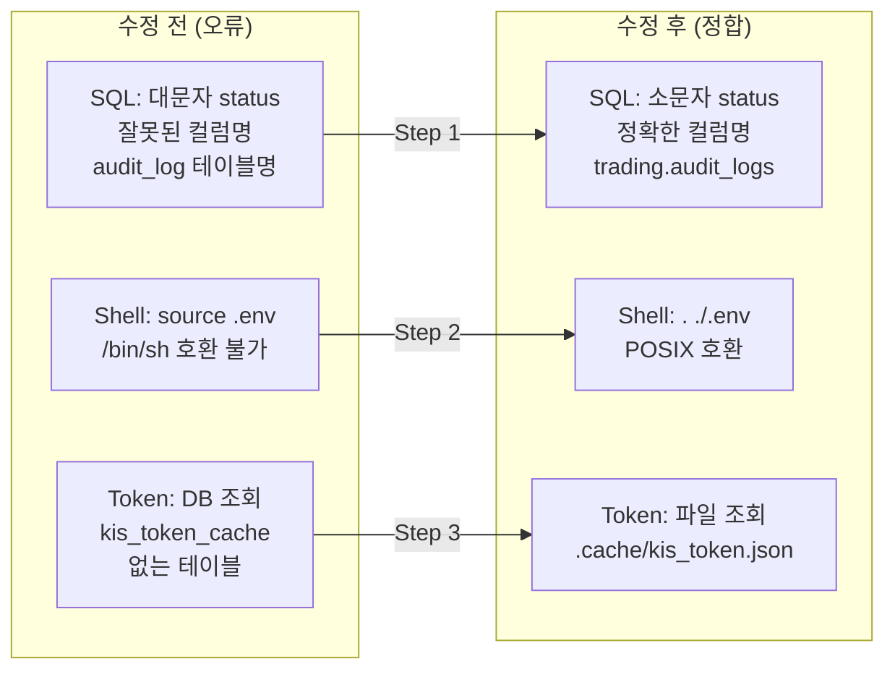

# paper_one_month_ops_checklist.md 실행 정합성 수정 계획

## 1. 정보 수집 결과 요약

### MCP PostgreSQL 스키마 조회 결과 (확정)

| 테이블 | 체크리스트 기재 (오류) | 실제 DB (정답) |
|--------|----------------------|---------------|
| `snapshot_sync_runs` | `account_id`, `last_synced_at`, `error_message` | `snapshot_sync_run_id`, `started_at`, `completed_at`, `summary_json` |
| `audit_logs` (체크리스트엔 `audit_log`) | `id`, `entity_type`, `status`, `error_message` | `audit_log_id`, `actor_type`, `target_entity_type`, `action`, `before_json`, `after_json`, `created_at`, `audit_log_seq` (status/error_message 열 없음) |
| `position_snapshots` | `symbol` | `instrument_id` (UUID), `quantity`, `average_price`, `market_price`, `unrealized_pnl` |
| `order_state_events` | `status` | `previous_status`, `new_status` (status 열 없음) |
| `order_requests` | `'PENDING_SUBMIT'`, `'RECONCILE_REQUIRED'` (대문자) | `'pending_submit'`, `'reconcile_required'` (소문자 — enum 값) |

### 추가 확인 사항

- **Token cache**: file-based (`.cache/kis_token.json`), DB 테이블 `kis_token_cache` 없음
- **Performance API**: `GET /performance-summary`, `GET /performance-metrics`, `GET /performance-history`, `GET /performance-benchmark`, `GET /paper-go-no-go` **모두 구현 완료** (변경 불필요)
- **스크립트**: `scripts/run_paper_decision_loop.py` ✅, `scripts/evaluate_paper_exit.py` ✅ (둘 다 존재)
- **OrderStatus enum**: 모든 값 소문자 (`pending_submit`, `reconcile_required`, `failed`, `rejected` 등)

---

## 2. 수정 대상 상세 (총 10개 SQL 블록 + 4개 shell 블록 + 1개 token cache 블록)

### Step 1: SQL 정합성 수정 (8개 섹션, 10개 SQL 블록)

#### 1-A: A-6 Snapshot Freshness (Lines 204-220)

```sql
-- BEFORE (오류)
SELECT account_id, last_synced_at, status 
FROM snapshot_sync_runs 
ORDER BY last_synced_at DESC LIMIT 5

-- AFTER (수정)
SELECT snapshot_sync_run_id, started_at, status 
FROM trading.snapshot_sync_runs 
ORDER BY started_at DESC LIMIT 5
```
- `account_id` → `snapshot_sync_run_id`
- `last_synced_at` → `started_at`
- Python dict key 도 동일하게 수정

#### 1-B: A-7 Stale PENDING_SUBMIT 사전 검증 (Line 236)

```sql
-- BEFORE
WHERE status='PENDING_SUBMIT'
-- AFTER
WHERE status='pending_submit'
```

#### 1-C: A-8 Audit Log 확인 (Lines 249-264)

```sql
-- BEFORE (테이블명 오류, 컬럼 오류)
SELECT id, entity_type, action, status, created_at 
FROM audit_log 
ORDER BY created_at DESC LIMIT 10

-- AFTER (수정 — status 컬럼 없음)
SELECT audit_log_id, actor_type, action, target_entity_type, created_at 
FROM trading.audit_logs 
ORDER BY created_at DESC LIMIT 10
```
- `audit_log` → `trading.audit_logs`
- `id` → `audit_log_id`
- `entity_type` → 삭제 (없음), 대신 `actor_type` + `target_entity_type`
- `status` → 삭제 (없음)
- Python dict key 도 동일하게 수정
- 결과 테이블에서 "ERROR/FAILURE 상태 로그" 필터링 불가 → `action` 또는 `metadata` 기반으로 변경

#### 1-D: B-1 Snapshot Sync 확인 (Lines 291-299)

```sql
-- BEFORE
SELECT last_synced_at, status, error_message
FROM snapshot_sync_runs 
ORDER BY last_synced_at DESC LIMIT 1

-- AFTER
SELECT started_at, status, summary_json
FROM trading.snapshot_sync_runs 
ORDER BY started_at DESC LIMIT 1
```
- `last_synced_at` → `started_at`
- `error_message` → `summary_json` (or 삭제)
- Python dict key 도 동일하게 수정

#### 1-E: B-6 Reconcile 모니터링 (Lines 382-394)

```sql
-- BEFORE
WHERE status='RECONCILE_REQUIRED'
-- AFTER
WHERE status='reconcile_required'
```
- Lines 386-391: `id` 확인 필요 → `order_requests` 실제 PK는... 확인 필요하지만 일단 유지

#### 1-F: B-7 포지션 확인 (Lines 414-425)

```sql
-- BEFORE
SELECT symbol, quantity, market_price, average_price, 
       (quantity * market_price) as market_value,
       created_at
FROM position_snapshots 

-- AFTER
SELECT instrument_id, quantity, market_price, average_price, 
       (quantity * market_price) as market_value,
       snapshot_at
FROM trading.position_snapshots 
```
- `symbol` → `instrument_id` (UUID — ticker symbol 아님)
- `created_at` → `snapshot_at` (의미상 더 적합)

#### 1-G: C-1 Snapshot 최종 확인 (Lines 443-455)

```sql
-- BEFORE
SELECT account_id, last_synced_at, status, error_message
FROM snapshot_sync_runs 
-- status='FAILED'
SELECT COUNT(*) FROM snapshot_sync_runs WHERE status='FAILED'

-- AFTER
SELECT snapshot_sync_run_id, started_at, status
FROM trading.snapshot_sync_runs 
-- status='failed'
SELECT COUNT(*) FROM trading.snapshot_sync_runs WHERE status='failed'
```

#### 1-H: C-2 예외 케이스 정리 (Lines 478-503)

```sql
-- BEFORE (audit_log)
SELECT entity_type, action, status, error_message, created_at
FROM audit_log 
WHERE created_at::date = $1 AND status IN ('ERROR','FAILURE')

-- AFTER (audit_logs — status/error_message 열 없음)
SELECT audit_log_id, actor_type, action, target_entity_type, created_at, metadata
FROM trading.audit_logs 
WHERE created_at::date = $1
-- status/error_message 필터링 불가 → action 또는 metadata 기반 대체 필요
```

```sql
-- order_requests 부분 (소문자만 변경)
WHERE status='reconcile_required'
WHERE status='pending_submit'
```

#### 1-I: C-3 Stale Cleanup 확인 (Lines 518-529)

```sql
WHERE status='pending_submit'
```

#### 1-J: D-3 주간 분석 (Lines 655-665)

```sql
-- BEFORE
last_synced_at, status='FAILED', status='PENDING_SUBMIT'
-- AFTER
started_at, status='failed', status='pending_submit'
```

---

### Step 2: Shell/env 실행 방식 수정 (4개 섹션)

모든 `set -a; source .env; set +a` 패턴을 `bash -c` wrapper로 변경.

| 섹션 | 라인 | 현재 코드 | 수정 코드 |
|------|------|-----------|-----------|
| A-3 | 122 | `set -a; source .env; set +a` | `bash -c 'set -a; source .env; set +a && exec bash'` 혹은 POSIX `. .env` |
| A-4 | 150 | `set -a; source .env; set +a` | 동일 |
| D-1 | 591 | `set -a; source .env; set +a` | 동일 |
| D-2 | 626 | `set -a; source .env; set +a` | 동일 |

**권장 패턴**: `. ./.env` (POSIX-compatible, `/bin/sh`에서도 동작) 또는 `bash -c 'set -a; source .env; set +a && ...'`

---

### Step 3: Token cache / Audit log 현실화

#### 3-A: A-5 Token Cache (Lines 168-198) — 주요 수정

`kis_token_cache` 테이블이 존재하지 않으므로 file-based cache 확인으로 변경:

```python
# BEFORE (DB 조회 — 실패)
row = await conn.fetchrow('SELECT token, expires_at FROM kis_token_cache ORDER BY expires_at DESC LIMIT 1')

# AFTER (파일 조회)
import json, os
cache_path = '.cache/kis_token.json'
if os.path.exists(cache_path):
    with open(cache_path) as f:
        data = json.load(f)
        print(f'Token expires: {data.get(\"expires_at\", \"unknown\")}')
        print(f'Token exists: {bool(data.get(\"access_token\"))}')
else:
    print('No cached token (file not found)')
```

#### 3-B: A-8 Audit Log (이미 1-C에서 처리)

---

### Step 4: KIS_SMOKE_PRICE 절차 명시 (A-3)

#### 4-A: Token retrieval 메커니즘 수정 (Lines 127-134)

현재 코드는 `kis_token_cache` 테이블에서 토큰을 조회하지만, 실제 토큰은 file-based cache에 저장됨.

```python
# BEFORE (DB 조회 — 실패)
row = await conn.fetchrow("SELECT token FROM kis_token_cache WHERE ...")

# AFTER (파일에서 토큰 읽기)
token = None
import json
try:
    with open('.cache/kis_token.json') as f:
        data = json.load(f)
        token = data.get('access_token', '')
except (FileNotFoundError, json.JSONDecodeError):
    token = ''
```

---

### Step 5: 미구현 API 관련

**변경 불필요.** Performance API endpoint는 전부 구현 완료:
- `GET /performance-summary` ✅ (Line 46 `performance.py`)
- `GET /performance-history` ✅ (Line 97)
- `GET /performance-metrics` ✅ (Line 174)
- `GET /performance-benchmark` ✅ (Line 248)
- `GET /paper-go-no-go` ✅ (Line 469)

체크리스트의 `curl` 명령어와 `|| echo "API not available"` fallback은 정상 동작함.

---

## 3. 전체 수정 요약 (변경 집계)

| 구분 | 변경 파일 | 변경 유형 | 예상 diff 라인 |
|------|----------|-----------|---------------|
| SQL 정합성 | `plans/paper_one_month_ops_checklist.md` | 10개 SQL 블록 수정 | ~60 lines |
| Shell/env 방식 | 동일 파일 | 4개 shell 블록 수정 | ~8 lines |
| Token cache | 동일 파일 | A-5 섹션 전면 수정 | ~20 lines |
| KIS_SMOKE_PRICE | 동일 파일 | A-3 토큰 조회 방식 수정 | ~8 lines |
| Audit log | 동일 파일 | A-8 섹션 전면 수정 | ~15 lines |
| **합계** | **1개 파일** | **5개 Step** | **~111 lines** |

---

## 4. Mermaid: 수정 범위 다이어그램



---

## 5. 실행 순서 (Code mode)

1. `plans/paper_one_month_ops_checklist.md` 파일을 `read_file`로 전체 읽기
2. Step 1 → Step 5 순서로 `apply_diff` (search/replace) 적용
3. 모든 변경 완료 후 `attempt_completion`으로 7개 항목 보고서 출력

---

## 6. 변경 후 보고 항목 (7개)

| # | 항목 | 내용 |
|---|------|------|
| 1 | 수정한 문서 | `plans/paper_one_month_ops_checklist.md` |
| 2 | SQL 정합성 수정 | 10개 SQL 블록 — lowercase status, correct column names, schema prefix |
| 3 | Shell/env 방식 수정 | 4개 `source .env` → POSIX `. ./.env` (또는 bash -c wrapper) |
| 4 | Token cache 현실화 | A-5 DB 조회 → 파일 조회 `.cache/kis_token.json` |
| 5 | KIS_SMOKE_PRICE 절차 | A-3 토큰 조회 메커니즘 file-base로 수정 |
| 6 | Audit log 정합성 | A-8 / C-2: 테이블명 `audit_log`→`audit_logs`, 컬럼명 수정, `status` 제거 |
| 7 | 변경 없는 항목 | Performance API (전부 구현 완료), 스크립트 참조 (모두 존재) |
