# 내일(2026-05-14) Near-Real 운영 실행 계획

> **실행 기준시각**: 2026-05-14 KST (Asia/Seoul)
> **환경**: `KIS_ENV=paper` (운영상 live 환경으로 취급)
> **목적**: [`paper_one_month_ops_checklist.md`](plans/paper_one_month_ops_checklist.md) 기준 Pre-Market → Intraday → End-of-Day 전 루틴 실제 수행 및 당일 운영 보고서 작성
> **제약**: production 코드 변경 금지, .env 계열 파일 수정 금지, admin UI 변경 금지, broker submit semantics 변경 금지
> **보정 반영**: 2026-05-13 사용자 리뷰 반영 (v2)

---

## 1. 운영 전 시스템 상태 (2026-05-13 16:09 KST 기준)

| 항목 | 상태 | 비고 |
|------|------|------|
| KIS_ENV | `paper` ✅ | 운영 전제 충족 |
| DB Connectivity | ✅ 정상 | PostgreSQL MCP 쿼리 정상 응답 |
| Snapshot Sync (당일) | 45회 시도, completed=41, partial=4, failed=0 ✅ | 마지막 sync 16:04 KST (4분 전) |
| Order 상태 분포 | rejected=15, reconcile_required=6, pending_submit=0 | pending_submit 0건 ✅ |
| 포지션 | 10주 005930, avg 267,000, market 284,000 | 미실현 PnL +170,000원 (+6.4%) |
| KIS_SMOKE_PRICE | 280,500 (`.env` 고정) ⚠️ | 시장가 284,000과 3,500원 차이 |
| Token Cache | `KIS_DEV_TOKEN_CACHE_ENABLED=true` / `.cache/kis_token.json` | 파일 존재 여부 Pre-Market에서 확인 |
| Stale PENDING_SUBMIT | **0건** ✅ | A-7/C-3 Skip 가능 |
| Audit Logs (5/13) | 10건, order.status_change/order.create, 이상 없음 ✅ | |
| Reconcile_required | 6건 (5/11: 5건, 5/13: 1건), 신규 증가 없음 ✅ | 안정적 유지 |

---

## 2. 실행 단계 개요

```mermaid
flowchart LR
    subgraph PM["A. Pre-Market 08:00-08:50"]
        A1["A-1: KIS_ENV 확인"]
        A2["A-2: Env vars 적재 확인"]
        A3["A-3: KIS_SMOKE_PRICE 검증"]
        A4["A-4: DB Connectivity"]
        A5["A-5: Token cache 확인"]
        A6["A-6: Snapshot freshness"]
        A7["A-7: Stale PENDING_SUBMIT"]
        A8["A-8: Audit log 확인"]
    end
    subgraph ID["B. Intraday 08:50-15:30"]
        B1["B-1: Sync loop 동작 확인"]
        B2["B-2: Dry-run 검증"]
        B3["B-3: Submit 조건 확인"]
        B4["B-4: Submit 실행 (조건부)"]
        B5["B-5: Post-submit sync"]
        B6["B-6: Reconcile_required"]
        B7["B-7: 포지션/성과"]
    end
    subgraph EOD["C. End-of-Day 15:30-16:30"]
        C1["C-1: Sync 최종 확인"]
        C2["C-2: 실패/예외 정리"]
        C3["C-3: Stale cleanup"]
        C4["C-4: 일일 성과 기록"]
        C5["C-5: 운영 메모"]
    end
    PM --> ID --> EOD
```



---

## 3. Step A: Pre-Market Routine (A-1~A-8)

> 실행 순서대로 나열. 각 항목마다 실행 명령어와 성공 기준을 명시.

### A-1. KIS_ENV 및 운영 환경 확인 [필수]

| # | 확인 항목 | 명령어 | 예상 결과 |
|---|----------|--------|----------|
| 1 | KIS_ENV 확인 | `grep KIS_ENV .env \| head -1` | `KIS_ENV=paper` |
| 2 | Python 버전 확인 | `which python3 && python3 --version` | Python 3.11+ |
| 3 | DB URL 구성 확인 | `grep DATABASE_HOST .env \| head -1` | `localhost` |

**실패 시 대응**: `KIS_ENV=real`이면 즉시 중단 및 원인 파악.

### A-2. 필수 환경변수 적재 확인 [필수]

| # | 변수명 | 확인 명령어 | 성공 기준 |
|---|--------|-----------|----------|
| 1 | KIS_APP_KEY | `grep KIS_APP_KEY .env` | non-empty |
| 2 | KIS_APP_SECRET | `grep KIS_APP_SECRET .env` | non-empty |
| 3 | KIS_PAPER_REST_RPS | `grep KIS_PAPER_REST_RPS .env` | `2` |
| 4 | KIS_SMOKE_PRICE | `grep KIS_SMOKE_PRICE .env` | `280500` (현재값) |
| 5 | DEEPSEEK_API_KEY | `grep DEEPSEEK_API_KEY .env` | non-empty |
| 6 | DEEPSEEK_MODEL_ID | `grep DEEPSEEK_MODEL_ID .env` | `deepseek-chat` |

### A-3. KIS_SMOKE_PRICE 현재가 일치 검증 [필수]

> ⚠️ **제약**: `.env` 계열 파일 수정 금지이므로, KIS_SMOKE_PRICE는 현재값 280500을 유지.
> 단, 시장가와의 차이는 운영 메모에 기록하고 dry-run 결과에 미치는 영향을 관찰.

**실행 명령어** (python-dotenv + KIS API inquire-price):

```bash
python3 -c "
from dotenv import load_dotenv
import os, json, subprocess, sys

load_dotenv()

# token cache 파일에서 access_token 읽기
cache_path = '.cache/kis_token.json'
try:
    with open(cache_path) as f:
        data = json.load(f)
    token = data.get('access_token', '')
except (FileNotFoundError, json.JSONDecodeError):
    token = ''

if not token:
    print('TOKEN_EMPTY — 캐시 파일 없음. snapshot sync 실행 후 재시도')
    sys.exit(1)

# curl로 KIS API 현재가 조회
result = subprocess.run(
    ['curl', '-s', '-k',
     '-H', 'content-type: application/json',
     '-H', f'authorization: Bearer {token}',
     '-H', f'appkey: {os.getenv(\"KIS_APP_KEY\", \"\")}',
     '-H', f'appsecret: {os.getenv(\"KIS_APP_SECRET\", \"\")}',
     '-H', 'tr_id: FHKST01010100',
     'https://openapivts.koreainvestment.com:29443/uapi/domestic-stock/v1/quotations/inquire-price?FID_COND_MRKT_DIV_CODE=J&FID_INPUT_ISCD=005930'],
    capture_output=True, text=True)
data = json.loads(result.stdout)
if data.get('rt_cd') != '0':
    print(f'API error: {data.get(\"msg1\", \"unknown\")} (code={data.get(\"msg_cd\", \"\")})')
    sys.exit(1)
price = data.get('output', {}).get('stck_prpr', 'NOT_FOUND')
smoke = os.getenv('KIS_SMOKE_PRICE', 'NOT_SET')
match = '✅ 일치' if price == smoke else '⚠️ 불일치'
print(f'시장가: {price} | KIS_SMOKE_PRICE: {smoke} | {match}')
"
```

**판정 기준**:
| 결과 | 조치 |
|------|------|
| 일치 | ✅ 정상, 다음 단계 진행 |
| 불일치 | ⚠️ 차이 기록, .env 수정 금지이므로 dry-run에 영향 관찰 |
| API 호출 실패 | 네트워크/토큰 상태 기록, 수동 진행 |

### A-4. DB Connectivity 확인 [필수]

이미 MCP PostgreSQL로 확인됨. 생략 가능. 단, Python asyncpg 경로도 확인.

```bash
python3 -c "
from dotenv import load_dotenv
import os, asyncio, asyncpg

load_dotenv()
host = os.getenv('DATABASE_HOST', 'localhost')
port = int(os.getenv('DATABASE_PORT', '5432'))
user = os.getenv('DATABASE_USER', 'trading')
password = os.getenv('DATABASE_PASSWORD', 'trading')
database = os.getenv('DATABASE_NAME', 'trading')
dsn = f'postgresql://{user}:{password}@{host}:{port}/{database}'

async def check():
    conn = await asyncpg.connect(dsn=dsn)
    val = await conn.fetchval('SELECT 1')
    print(f'DB connected: SELECT 1 = {val}')
    await conn.close()

asyncio.run(check())
"
```

### A-5. Token Cache 상태 확인 [권장]

```bash
ls -la .cache/kis_token.json 2>/dev/null || echo '캐시 없음'

python3 -c "
import json, os
from datetime import datetime, timezone
cache_path = '.cache/kis_token.json'
if os.path.exists(cache_path):
    with open(cache_path) as f:
        data = json.load(f)
    token = data.get('access_token', '')
    expires_at = data.get('expires_at', 'unknown')
    print(f'Token exists: {bool(token)}')
    print(f'Token expires: {expires_at}')
else:
    print('No cached token (file not found)')
"
```

**판정**: Valid token 있으면 ✅, 없으면 첫 API 호출 시 자동 발급되므로 정상 범위.

### A-6. Snapshot Freshness 확인 [필수]

```bash
python3 -c "
from dotenv import load_dotenv
import os, asyncio, asyncpg
from datetime import datetime, timezone

load_dotenv()
host = os.getenv('DATABASE_HOST', 'localhost')
port = int(os.getenv('DATABASE_PORT', '5432'))
user = os.getenv('DATABASE_USER', 'trading')
password = os.getenv('DATABASE_PASSWORD', 'trading')
database = os.getenv('DATABASE_NAME', 'trading')
dsn = f'postgresql://{user}:{password}@{host}:{port}/{database}'

async def check():
    conn = await asyncpg.connect(dsn=dsn)
    rows = await conn.fetch('''
        SELECT snapshot_sync_run_id, started_at, status
        FROM snapshot_sync_runs
        ORDER BY started_at DESC LIMIT 5
    ''')
    for r in rows:
        age = datetime.now(timezone.utc) - r['started_at']
        print(f'Run {r[\"snapshot_sync_run_id\"]}: started={r[\"started_at\"]}, age={age.total_seconds()/60:.0f}min, status={r[\"status\"]}')
    today_total = await conn.fetchval('SELECT COUNT(*) FROM snapshot_sync_runs WHERE started_at::date = CURRENT_DATE')
    today_failed = await conn.fetchval(\"SELECT COUNT(*) FROM snapshot_sync_runs WHERE status='failed' AND started_at::date = CURRENT_DATE\")
    print(f'당일 sync 시도: {today_total}, 실패: {today_failed}')
    await conn.close()
asyncio.run(check())
"
```

**판정**:
| 조건 | 평가 |
|------|------|
| 최근 sync 30분 이내 | ✅ Fresh |
| 최근 sync 30분~2시간 | ⚠️ Stale — sync loop 재시작 |
| 최근 sync 2시간 초과 | ❌ Stale — sync loop 필수 실행 |

### A-7. Stale PENDING_SUBMIT 정리 [필수/조건부]

이미 0건 확인됨. 대상 없으면 Skip.

```bash
python3 -c "
from dotenv import load_dotenv
import os, asyncio, asyncpg
from datetime import datetime, timezone, timedelta

load_dotenv()
host = os.getenv('DATABASE_HOST', 'localhost')
port = int(os.getenv('DATABASE_PORT', '5432'))
user = os.getenv('DATABASE_USER', 'trading')
password = os.getenv('DATABASE_PASSWORD', 'trading')
database = os.getenv('DATABASE_NAME', 'trading')
dsn = f'postgresql://{user}:{password}@{host}:{port}/{database}'

async def check():
    conn = await asyncpg.connect(dsn=dsn)
    stale = await conn.fetchval('''
        SELECT COUNT(*) FROM order_requests
        WHERE status='pending_submit'
        AND created_at < \$1
    ''', datetime.now(timezone.utc) - timedelta(hours=24))
    print(f'24h 이상 stale pending_submit: {stale}건')
    if stale > 0:
        print('>>> _cleanup_pending_submit.py 실행 필요')
    else:
        print('>>> cleanup 불필요 (0건)')
    await conn.close()
asyncio.run(check())
"
```

**판정**: 0건이면 ✅ Skip. 1건 이상이면 `python3 _cleanup_pending_submit.py` 실행.

### A-8. Audit Log 확인 [권장]

```bash
python3 -c "
from dotenv import load_dotenv
import os, asyncio, asyncpg
from datetime import date

load_dotenv()
host = os.getenv('DATABASE_HOST', 'localhost')
port = int(os.getenv('DATABASE_PORT', '5432'))
user = os.getenv('DATABASE_USER', 'trading')
password = os.getenv('DATABASE_PASSWORD', 'trading')
database = os.getenv('DATABASE_NAME', 'trading')
dsn = f'postgresql://{user}:{password}@{host}:{port}/{database}'

async def check():
    conn = await asyncpg.connect(dsn=dsn)
    today = date.today()
    rows = await conn.fetch('''
        SELECT audit_log_id, actor_type, action, target_entity_type, created_at
        FROM audit_logs
        WHERE created_at::date = \$1
        ORDER BY created_at DESC LIMIT 10
    ''', today)
    print(f'== 오늘 audit_logs: {len(rows)}건 ==')
    for r in rows:
        print(f'{r[\"created_at\"]} | actor={r[\"actor_type\"]} | action={r[\"action\"]} | target={r[\"target_entity_type\"]}')
    await conn.close()
asyncio.run(check())
"
```

**판정**: ERROR/FAILURE 패턴 없으면 ✅ 정상. 다수 발견 시 원인 분석.

---

## 4. Step B: Intraday Routine (B-1~B-7)

### B-1. Snapshot Sync Loop 동작 확인 [권장/30분]

```bash
# Sync loop 프로세스 확인
ps aux | grep run_snapshot_sync_loop | grep -v grep

# 최근 sync freshness 확인 (python-dotenv + DSN 조합, A-6과 동일)
python3 -c "
from dotenv import load_dotenv
import os, asyncio, asyncpg
from datetime import datetime, timezone

load_dotenv()
host = os.getenv('DATABASE_HOST', 'localhost')
port = int(os.getenv('DATABASE_PORT', '5432'))
user = os.getenv('DATABASE_USER', 'trading')
password = os.getenv('DATABASE_PASSWORD', 'trading')
database = os.getenv('DATABASE_NAME', 'trading')
dsn = f'postgresql://{user}:{password}@{host}:{port}/{database}'

async def check():
    conn = await asyncpg.connect(dsn=dsn)
    row = await conn.fetchrow('''
        SELECT started_at, status
        FROM snapshot_sync_runs
        ORDER BY started_at DESC LIMIT 1
    ''')
    if row:
        age = datetime.now(timezone.utc) - row['started_at']
        print(f'last_sync: {row[\"started_at\"]}, age: {age.total_seconds()/60:.0f}min, status: {row[\"status\"]}')
    else:
        print('No sync records found')
    await conn.close()
asyncio.run(check())
"
```

### B-2. Dry-Run 검증 [권장/1시간]

```bash
bash -c 'set -a; source .env; set +a && python3 scripts/run_orchestrator_once.py --dry-run 2>&1' | tail -30
```

**예상 결과 기록 항목**:
- Decision type: `APPROVE` / `HOLD` / `WATCH` / `SKIP`
- Sizing quantity
- Sizing skip reason (if any)
- AI Agent 실행 상태 (EI Agent, Risk Agent, Final Decision Composer)

### B-3. Submit 조건 확인 [필수]

| 조건 | 확인 방법 | 현재 예상 |
|------|----------|----------|
| Dry-run 결과 = APPROVE | B-2 결과 | 미정 (HOLD 예상) |
| KIS_SMOKE_PRICE 설정 | .env 확인 | 280500 ✅ |
| Snapshot fresh (30분 이내) | B-1 결과 | ✅ |
| Token cache 유효 | A-5 결과 | 확인 필요 |
| Stale pending_submit 없음 | A-7 결과 | 0건 ✅ |

**판정**: 모든 조건 충족 시에만 B-4 진행. 미충족 시 B-4 Skip.

### B-4. Submit 실행 [필수/조건부] — B-3 충족 시만

```bash
bash -c 'set -a; source .env; set +a && python3 scripts/run_orchestrator_once.py 2>&1'
```

**실행 규칙**:
- Dry-run이 `APPROVE`일 때만 **최대 1회** 실행
- `HOLD`/`WATCH`/`REJECT`이면 submit **강행 금지**
- Submit 결과 기록: `SUBMITTED` / `RECONCILE_REQUIRED` / `REJECTED` / `ERROR`

### B-5. Post-Submit Sync 1회 [필수/submit 직후] — B-4 실행 시만

```bash
python3 scripts/run_post_submit_sync_loop.py --max-cycles=1 --interval=5 2>&1 | tail -20
```

### B-6. Reconcile_required 모니터링 [권장/1시간]

```bash
python3 -c "
from dotenv import load_dotenv
import os, asyncio, asyncpg

load_dotenv()
host = os.getenv('DATABASE_HOST', 'localhost')
port = int(os.getenv('DATABASE_PORT', '5432'))
user = os.getenv('DATABASE_USER', 'trading')
password = os.getenv('DATABASE_PASSWORD', 'trading')
database = os.getenv('DATABASE_NAME', 'trading')
dsn = f'postgresql://{user}:{password}@{host}:{port}/{database}'

async def check():
    conn = await asyncpg.connect(dsn=dsn)
    count = await conn.fetchval(\"SELECT COUNT(*) FROM trading.order_requests WHERE status='reconcile_required'\")
    print(f'reconcile_required 건수: {count}')
    if count > 0:
        rows = await conn.fetch('''
            SELECT order_request_id, created_at
            FROM trading.order_requests WHERE status='reconcile_required'
            ORDER BY created_at DESC LIMIT 5
        ''')
        for r in rows:
            print(f'  {r[\"order_request_id\"]} | created={r[\"created_at\"]}')
    await conn.close()
asyncio.run(check())
"
```

### B-7. 포지션/성과 모니터링 [권장]

```bash
python3 -c "
from dotenv import load_dotenv
import os, asyncio, asyncpg

load_dotenv()
host = os.getenv('DATABASE_HOST', 'localhost')
port = int(os.getenv('DATABASE_PORT', '5432'))
user = os.getenv('DATABASE_USER', 'trading')
password = os.getenv('DATABASE_PASSWORD', 'trading')
database = os.getenv('DATABASE_NAME', 'trading')
dsn = f'postgresql://{user}:{password}@{host}:{port}/{database}'

async def check():
    conn = await asyncpg.connect(dsn=dsn)
    rows = await conn.fetch('''
        SELECT instrument_id, quantity, market_price, average_price,
               (quantity * market_price) as market_value,
               snapshot_at
        FROM trading.position_snapshots
        ORDER BY snapshot_at DESC LIMIT 10
    ''')
    for r in rows:
        print(f'instrument={r[\"instrument_id\"]}: qty={r[\"quantity\"]}, market={r[\"market_price\"]}, avg={r[\"average_price\"]}, value={r[\"market_value\"]}')
    
    # Cash balance
    cash = await conn.fetch('SELECT * FROM trading.cash_balance_snapshots ORDER BY snapshot_at DESC LIMIT 3')
    for c in cash:
        print(f'Cash: available={c[\"available_cash\"]}, settled={c[\"settled_cash\"]}, snapshot_at={c[\"snapshot_at\"]}')
    
    await conn.close()
asyncio.run(check())
"
```

---

## 5. Step C: End-of-Day Routine (C-1~C-5)

### C-1. Snapshot Sync 최종 확인 [필수]

A-6과 동일한 스크립트 실행. 추가로 당일 sync 통계 출력.

```bash
python3 -c "
from dotenv import load_dotenv
import os, asyncio, asyncpg
from datetime import datetime, timezone

load_dotenv()
host = os.getenv('DATABASE_HOST', 'localhost')
port = int(os.getenv('DATABASE_PORT', '5432'))
user = os.getenv('DATABASE_USER', 'trading')
password = os.getenv('DATABASE_PASSWORD', 'trading')
database = os.getenv('DATABASE_NAME', 'trading')
dsn = f'postgresql://{user}:{password}@{host}:{port}/{database}'

async def check():
    conn = await asyncpg.connect(dsn=dsn)
    row = await conn.fetchrow('''
        SELECT started_at, status
        FROM snapshot_sync_runs
        ORDER BY started_at DESC LIMIT 1
    ''')
    if row:
        age = datetime.now(timezone.utc) - row['started_at']
        print(f'최종 sync: {row[\"started_at\"]}, {age.total_seconds()/60:.0f}분 전, 상태: {row[\"status\"]}')
    total = await conn.fetchval('SELECT COUNT(*) FROM snapshot_sync_runs WHERE started_at::date = CURRENT_DATE')
    failed = await conn.fetchval(\"SELECT COUNT(*) FROM snapshot_sync_runs WHERE status='failed' AND started_at::date = CURRENT_DATE\")
    print(f'당일 sync 시도: {total}, 실패: {failed}')
    await conn.close()
asyncio.run(check())
"
```

### C-2. 실패/예외 케이스 정리 [필수]

```bash
python3 -c "
from dotenv import load_dotenv
import os, asyncio, asyncpg
from datetime import date

load_dotenv()
host = os.getenv('DATABASE_HOST', 'localhost')
port = int(os.getenv('DATABASE_PORT', '5432'))
user = os.getenv('DATABASE_USER', 'trading')
password = os.getenv('DATABASE_PASSWORD', 'trading')
database = os.getenv('DATABASE_NAME', 'trading')
dsn = f'postgresql://{user}:{password}@{host}:{port}/{database}'

async def check():
    conn = await asyncpg.connect(dsn=dsn)
    today = date.today()
    
    # 오늘 audit_logs
    rows = await conn.fetch('''
        SELECT audit_log_id, actor_type, action, target_entity_type, created_at
        FROM audit_logs
        WHERE created_at::date = \$1
        ORDER BY created_at DESC
    ''', today)
    print(f'== 오늘 audit_logs: {len(rows)}건 ==')
    for r in rows:
        print(f'{r[\"created_at\"]} | actor={r[\"actor_type\"]} | action={r[\"action\"]} | target={r[\"target_entity_type\"]}')
    
    # 오늘 reconcile_required
    rr = await conn.fetch('''
        SELECT order_request_id, created_at
        FROM order_requests
        WHERE status='reconcile_required' AND created_at::date = \$1
        ORDER BY created_at DESC
    ''', today)
    print(f'== reconcile_required: {len(rr)}건 (허용 상태, 증가 추세 관찰) ==')
    
    # 오늘 pending_submit
    ps = await conn.fetch('''
        SELECT COUNT(*) as cnt FROM order_requests
        WHERE status='pending_submit' AND created_at::date = \$1
    ''', today)
    print(f'== 미처리 pending_submit: {ps[0][\"cnt\"]}건 ==')
    
    await conn.close()
asyncio.run(check())
"
```

### C-3. Stale Cleanup 필요 여부 확인 [필수]

A-7과 동일한 스크립트 실행. 0건이면 ✅ 불필요.

### C-4. 일일 성과 기록 [권장]

```bash
# API 통해 일일 성과 조회
curl -s http://localhost:8000/performance-summary 2>/dev/null | python3 -m json.tool || echo 'API not available'
curl -s http://localhost:8000/performance-metrics 2>/dev/null | python3 -m json.tool || echo 'API not available'
```

### C-5. 운영 메모 기록 [권장]

별도 보고서 파일에 포함 (Section 7 템플릿 사용).

---

## 6. 예외 상황 대응

### E-1. KIS_SMOKE_PRICE 불일치
- **증상**: A-3에서 시장가와 KIS_SMOKE_PRICE 차이 확인
- **조치**: 차이를 운영 메모에 기록. `.env` 수정 금지이므로 dry-run 결과 영향 관찰
- **영향**: Price 차이가 3,500원 수준으로 dry-run HOLD에는 영향 없을 것으로 예상

### E-2. Dry-Run 결과 HOLD/WATCH (Non-Actionable)
- **정상 범위**: HOLD/WATCH/SKIP 모두 정상 운영 결과
- **기록**: 결정 유형, confidence score, skip reason 기록
- **Submit**: 불필요 (HOLD이므로 B-4 Skip)

### E-3. Sync Loop 미실행
- **증상**: B-1에서 `ps aux` 결과 프로세스 없음
- **조치**: `python3 scripts/run_snapshot_sync_loop.py --max-cycles=1` 1회 실행
- **예방**: 운영 메모에 기록하여 다음 Pre-Market에서 확인

### E-4. Reconcile_required 급증
- **증상**: B-6에서 전일 대비 2배 이상 증가
- **조치**: 증가 원인 분석, auditor_log 확인, 운영 메모에 기록
- **임계값**: 5건 초과 시 ⚠️ 주의, 12건 이상 시 ❌ 원인 분석

---

## 7. 보고서 템플릿 (`plans/paper_daily_ops_report_2026-05-14.md`)

실행 완료 후 아래 템플릿으로 보고서를 작성합니다.

```markdown
# 일일 운영 실행 보고 — 2026-05-14 (KIS Paper)

> **실행 일시**: 2026-05-14 KST
> **환경**: `KIS_ENV=paper`
> **목적**: paper_one_month_ops_checklist.md 기준 1일 운영 루틴 실제 수행 및 기록

---

## 1. Pre-Market 결과 (A-1~A-8)

| 항목 | 상태 | 비고 |
|------|------|------|
| A-1. KIS_ENV 확인 | ✅/⚠️/❌ | KIS_ENV=paper |
| A-2. 필수 env vars 적재 확인 | ✅/⚠️/❌ | |
| A-3. KIS_SMOKE_PRICE 검증 | ✅/⚠️/❌ | 시장가=X, KIS_SMOKE_PRICE=280500 |
| A-4. DB Connectivity | ✅/⚠️/❌ | |
| A-5. Token Cache | ✅/⚠️/❌ | |
| A-6. Snapshot Freshness | ✅/⚠️/❌ | |
| A-7. Stale PENDING_SUBMIT | ✅/⚠️/❌ | N건 |
| A-8. Audit Log | ✅/⚠️/❌ | |

## 2. Intraday 결과 (B-1~B-7)

| 항목 | 상태 | 비고 |
|------|------|------|
| B-1. Sync Loop 동작 확인 | ✅/⚠️/❌ | |
| B-2. Dry-Run 검증 | ✅/⚠️/❌ | decision_type= |
| B-3. Submit 조건 확인 | ✅/⚠️/❌ | |
| B-4. Submit 실행 | ✅/⚠️/❌/N/A | |
| B-5. Post-Submit Sync | ✅/⚠️/❌/N/A | |
| B-6. Reconcile_required 모니터링 | ✅/⚠️/❌ | N건 |
| B-7. 포지션/성과 모니터링 | ✅/⚠️/❌ | |

## 3. End-of-Day 결과 (C-1~C-5)

| 항목 | 상태 | 비고 |
|------|------|------|
| C-1. Sync 최종 확인 | ✅/⚠️/❌ | |
| C-2. 실패/예외 케이스 정리 | ✅/⚠️/❌ | |
| C-3. Stale Cleanup 필요 여부 | ✅/⚠️/❌ | |
| C-4. 일일 성과 기록 | ✅/⚠️/❌ | |
| C-5. 운영 메모 | ✅ | |

## 4. Actionable Submit 여부

- Dry-Run 결과: [APPROVE / HOLD / WATCH / SKIP]
- Submit 실행: [Y/N, 이유]
- Submit 결과: [SUBMITTED / RECONCILE_REQUIRED / REJECTED / N/A]

## 5. 운영 중 관찰 사항

### Observation #1
### Observation #2
### Observation #3

## 6. 문서 추가 수정 필요 여부

## 7. 코드 변경 여부

**이번 턴: 코드 변경 없음**

## 8. 다음 직접 액션
```

---

## 8. 실행 모드 전환

이 계획은 **명령어 실행이 가능한 모드**(예: Code 모드)에서 수행해야 합니다.
Architect 모드에서는 명령어 실행이 제한되므로, 승인 후 Code 모드로 전환하여 각 단계를 순차 실행합니다.

---

## 9. 다음 운영일 준비사항 (도출 예정)

운영 완료 후 실제 관찰 결과를 바탕으로 1개 이상의 다음 운영일 준비사항을 도출합니다.
