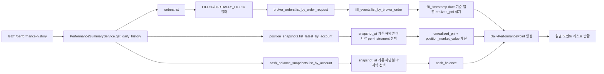

# Paper PnL History / Trend — 설계

## 1. History Source Inventory

| 데이터 | Source | 시간 기준 | 접근 경로 | 정확도 |
|--------|--------|-----------|-----------|--------|
| **일별 Realized PnL** | `FillEventEntity.fill_timestamp` | 체결 일자 (UTC) | orders.list() → broker_orders → fills → fill_timestamp.date() 기준 집계 | **정확** (실제 체결 시각) |
| **일별 Unrealized PnL** | `PositionSnapshotEntity.(market_price - average_price) × quantity` | snapshot 시각 | position_snapshots.list_latest_by_account() → 해당일 마지막 per-instrument snapshot 선택 | **근사** (snapshot 시점 기준) |
| **일별 현금 잔고** | `CashBalanceSnapshotEntity.available_cash` | snapshot 시각 | cash_balance_snapshots.**list_by_account()** (신규) → 해당일 마지막 snapshot 선택 | **정확** (broker 기준) |
| **일별 포지션 평가액** | `PositionSnapshotEntity.market_price × abs(quantity)` | snapshot 시각 | position_snapshots.list_latest_by_account() → 해당일 마지막 per-instrument 합계 | **근사** |
| **일별 Total Equity** | cash_balance + position_market_value | 계산 | 위 두 값의 합 | **혼합** |

### Realized PnL 상세

- 각 `FillEventEntity.fill_timestamp`의 **date 부분**을 키로 집계
- 같은 주문에 속한 여러 fill이 서로 다른 날짜에 체결될 수 있음 → 각 fill을 개별 fill_timestamp 기준으로 해당일 귀속
- 한 날짜의 realized PnL = `calc_realized_pnl_for_order(fills_in_day, side)`의 합계
- **누적 Realized PnL**: `start_date`부터 해당일까지의 realized_pnl 누적합

### Snapshot 데이터 상세

- 포지션 snapshot은 `list_latest_by_account()`로 전체 조회 (이미 모든 내역 반환)
- 현금 snapshot은 현재 `get_latest_by_account()`만 존재 → **신규 메서드 `list_by_account()` 필요** (전체 조회, snapshot_at DESC 정렬)
- 특정일 D의 snapshot = `snapshot_at <= end_of_day(D)` 조건의 가장 최신 per-instrument snapshot
- snapshot이 하나도 없는 날 → 이전날 snapshot을 carry-forward (최초 snapshot 이전 날짜는 None)

### No-Data Day 정책

| 상황 | realized_pnl | cash/equity |
|------|-------------|-------------|
| fills/snapshots 모두 없음 | 0 | None |
| fills만 없음 | 0 | 직전 snapshot carry-forward |
| snapshots만 없음 | 집계 | None |
| 범위 내 첫 데이터 이전 날짜 | 0 | None |

## 2. Data Model

```python
@dataclass(slots=True, frozen=True)
class DailyPerformancePoint:
    """일별 성과 포인트 — paper 운용 추세 평가용 Read Model."""

    date: date                    # UTC 날짜
    realized_pnl: Decimal         # 해당일 체결 기준 실현 손익
    cumulative_realized_pnl: Decimal  # start_date부터 해당일까지 누적 realized PnL
    cash_balance: Decimal | None  # 해당일 마지막 현금 snapshot (없으면 None)
    position_market_value: Decimal | None  # 해당일 마지막 포지션 평가액
    unrealized_pnl: Decimal | None  # 해당일 미실현 손익
    total_equity: Decimal | None  # 해당일 총 평가액 = cash + position_market_value
```

## 3. Service 확장

**대상**: `PerformanceSummaryService` (기존 클래스에 history 메서드 추가)

### 신규 pure helper

```python
def _group_fills_by_date(
    account_id: UUID,
    orders: Sequence[OrderRequestEntity],
    repos: RepositoryContainer,
) -> dict[date, Decimal]:
    """FILLED/PARTIALLY_FILLED 주문의 fill을 fill_timestamp.date()로 그룹핑하여
    일별 realized_pnl dict 반환."""
```

```python
def _latest_snapshot_on_or_before(
    snapshots: Sequence[PositionSnapshotEntity | CashBalanceSnapshotEntity],
    target_date: date,
) -> ...:
    """snapshot 목록에서 target_date 종료 시점 이전의 가장 최신 snapshot 반환.
    복수 instrument의 경우 per-instrument 최신 snapshot."""

    예: PositionSnapshotEntity는 instrument_id별로 최신 1개 선택
    CashBalanceSnapshotEntity는 단순히 snapshot_at <= end_of_day(target_date) 중 최신
```

### 신규 서비스 메서드

```python
async def get_daily_history(
    self,
    account_id: UUID,
    start_date: date,
    end_date: date,
    strategy_id: UUID | None = None,
) -> Sequence[DailyPerformancePoint]:
    """지정 기간의 일별 성과 추세 반환.

    Parameters
    ----------
    account_id: 대상 계좌
    start_date: 조회 시작일 (inclusive)
    end_date: 조회 종료일 (inclusive)
    strategy_id: 특정 전략으로 필터 (optional)

    Returns
    -------
    Sequence[DailyPerformancePoint]
        start_date부터 end_date까지의 일별 포인트 리스트.
        데이터가 없는 날은 정책에 따라 기본값 채움.
    """

    # 1. 모든 주문 조회
    all_orders = await self._repos.orders.list(OrderQuery(account_id=account_id))

    # 2. strategy_id 필터 (필요시)
    if strategy_id is not None:
        all_orders = await self._filter_orders_by_strategy(all_orders, strategy_id)

    # 3. FILLED/PARTIALLY_FILLED 주문 → broker_orders → fills → 일별 집계
    daily_realized: dict[date, Decimal] = {}
    for order in filled_orders:
        broker_orders = await self._repos.broker_orders.list_by_order_request(...)
        for bo in broker_orders:
            fills = await self._repos.fill_events.list_by_broker_order(bo.broker_order_id)
            for fill in fills:
                d = fill.fill_timestamp.date()
                # 이 fill의 order side로 realized PnL 기여분 계산
                fill_pnl = ... # per-fill PnL (not per-order)
                daily_realized[d] = daily_realized.get(d, Decimal("0")) + fill_pnl

    # 4. Position snapshots 전체 조회
    all_positions = await self._repos.position_snapshots.list_latest_by_account(account_id)

    # 5. Cash snapshots 전체 조회 (신규 list_by_account 사용)
    all_cash = await self._repos.cash_balance_snapshots.list_by_account(account_id)

    # 6. 일별 포인트 생성
    points = []
    cumulative = Decimal("0")
    for d in date_range(start_date, end_date):
        realized = daily_realized.get(d, Decimal("0"))
        cumulative += realized

        # 해당일 마지막 per-instrument position snapshot
        day_positions = _latest_per_instrument_on_or_before(all_positions, d)
        unrealized = calc_unrealized_pnl_from_positions(day_positions) if day_positions else None
        pos_mv = calc_position_market_value(day_positions) if day_positions else None

        # 해당일 마지막 cash snapshot
        day_cash = _latest_cash_on_or_before(all_cash, d)
        cash = day_cash.available_cash if day_cash else None

        equity = (cash or Decimal("0")) + (pos_mv or Decimal("0")) if cash is not None or pos_mv is not None else None

        points.append(DailyPerformancePoint(...))

    return points
```

Wait, I realize there's a subtlety. The current `calc_realized_pnl_for_order` takes ALL fills for an order and calculates the total PnL. But for daily attribution, I need to split fills by day. A per-fill PnL calculation would be:

For each fill:
- trade_value = fill_price × fill_quantity × side_multiplier (BUY=-1, SELL=+1)
- fill_pnl = trade_value - fee_share - tax_share

But fee and tax are per-fill already in the FillEventEntity (fill_fee, fill_tax are per-fill fields). So I can just calculate per-fill:

per_fill_pnl = (fill.fill_price * fill.fill_quantity * side_multiplier) - fill.fill_fee - fill.fill_tax

This is simpler and more correct for daily attribution.

Let me revise the approach to use per-fill PnL calculation.

## 4. API 설계

```
GET /performance-history?account_id=<UUID>&start_date=YYYY-MM-DD&end_date=YYYY-MM-DD[&strategy_id=<UUID>]
```

**Response**:
```json
{
    "account_id": "uuid",
    "start_date": "2026-05-01",
    "end_date": "2026-05-09",
    "strategy_id": "uuid or null",
    "points": [
        {
            "date": "2026-05-01",
            "realized_pnl": 50000.0,
            "cumulative_realized_pnl": 50000.0,
            "cash_balance": 1000000.0,
            "position_market_value": 500000.0,
            "unrealized_pnl": 10000.0,
            "total_equity": 1500000.0
        },
        ...
    ]
}
```

**Pydantic models**:
```python
class DailyPerformancePointView(BaseModel):
    date: date
    realized_pnl: float
    cumulative_realized_pnl: float
    cash_balance: float | None
    position_market_value: float | None
    unrealized_pnl: float | None
    total_equity: float | None

class PerformanceHistoryResponse(BaseModel):
    account_id: str
    start_date: date
    end_date: date
    strategy_id: str | None
    points: list[DailyPerformancePointView]
```

**별도 endpoint**로 추가 (기존 `/performance-summary` 변경 없음).

## 5. Repository 확장

**CashBalanceSnapshotRepository**에만 신규 메서드 1개 추가:

```python
class CashBalanceSnapshotRepository(Protocol):
    ...
    async def list_by_account(self, account_id: UUID) -> Sequence[CashBalanceSnapshotEntity]:
        """계좌의 모든 현금 snapshot을 snapshot_at DESC 정렬로 반환."""
        ...
```

구현체: Protocol / InMemory / Postgres 3곳 모두 변경.

(참고: `PositionSnapshotRepository.list_latest_by_account()`는 이미 모든 snapshot을 반환하므로 추가 변경 불필요)

## 6. Mermaid: 데이터 흐름



## 7. 테스트 계획

### Pure helper (fill 일별 그룹핑)

| # | 테스트 | 설명 |
|---|--------|------|
| 1 | single_fill_on_day | 하나의 fill → 해당일 realized_pnl 반환 |
| 2 | multiple_fills_same_day | 같은 날 2개 fill → 합계 반환 |
| 3 | fills_on_different_days | 다른 날짜 fill → 각각 해당일 귀속 확인 |
| 4 | no_fills | fill 없는 주문 → 빈 dict |
| 5 | with_strategy_filter | 전략 필터 → 해당 전략 fill만 집계 |

### Snapshot 날짜 선택

| # | 테스트 | 설명 |
|---|--------|------|
| 6 | latest_on_or_before_exact | 해당일 snapshot 존재 → 정확히 해당일 선택 |
| 7 | latest_on_or_before_carryforward | 해당일 없고 이전일 존재 → 이전일 carry-forward |
| 8 | no_snapshot_before_date | snapshot이 모두 조회일 이후 → None |

### Service 통합

| # | 테스트 | 설명 |
|---|--------|------|
| 9 | single_day_realized_only | 하루 realized_pnl만 → 1개 포인트 |
| 10 | multi_day_with_snapshots | 3일 범위, fill+snapshot 혼합 → 3개 포인트 |
| 11 | date_range_no_data | 데이터 없는 범위 → realized=0, equity=None |
| 12 | strategy_filter_history | 전략 필터 → 해당 전략 fill만 집계 |
| 13 | empty_account | 데이터 없는 계좌 → 모든 포인트 0/None |

## 8. 변경 파일 목록

| 파일 | 변경 | 설명 |
|------|------|------|
| `src/agent_trading/repositories/contracts.py` | 수정 | CashBalanceSnapshotRepository에 `list_by_account()` 추가 |
| `src/agent_trading/repositories/memory.py` | 수정 | InMemoryCashBalanceSnapshotRepository에 `list_by_account()` 구현 |
| `src/agent_trading/repositories/postgres/cash_balance_snapshots.py` | 수정 | PostgresCashBalanceSnapshotRepository에 `list_by_account()` 구현 |
| `src/agent_trading/services/performance_summary.py` | 수정 | `DailyPerformancePoint` dataclass + `get_daily_history()` 메서드 + pure helper 추가 |
| `src/agent_trading/api/schemas.py` | 수정 | `DailyPerformancePointView` + `PerformanceHistoryResponse` Pydantic 모델 추가 |
| `src/agent_trading/api/routes/performance.py` | 수정 | `GET /performance-history` endpoint 추가 |
| `tests/services/test_performance_summary.py` | 수정 | history/trend 테스트 13개 추가 |

## 9. 실행 단계

1. Repository 확장 — CashBalanceSnapshotRepository.list_by_account() (contract/memory/postgres)
2. Service 구현 — DailyPerformancePoint + get_daily_history() + pure helper
3. API 추가 — GET /performance-history
4. 테스트 — 13개 신규 테스트
5. 회귀 검증 — 기존 18개 + 전체 테스트
6. [BACKLOG] backlog.md — Paper Performance History 항목 추가
7. 완료 보고
